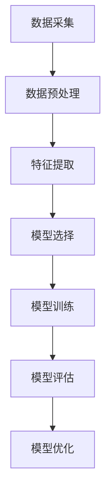

                 

# 基于机器学习的网络安全态势感知模型研究与实现

## 摘要

本文将探讨基于机器学习的网络安全态势感知模型的研究与实现。网络安全态势感知是指利用技术手段对网络中的各种安全事件进行实时监测、分析、识别和响应。随着网络攻击的日益复杂和频繁，传统的基于规则的安全防御方法已难以满足实际需求。因此，本文旨在提出一种基于机器学习的网络安全态势感知模型，并通过实际项目案例来验证其有效性。

## 关键词

- 机器学习
- 网络安全态势感知
- 数据挖掘
- 神经网络
- 隐马尔可夫模型

## 1. 背景介绍

网络安全态势感知（Cybersecurity Situational Awareness，简称CSA）是一种通过实时收集、分析和理解网络环境中潜在和实际的安全威胁，以便及时采取应对措施的技术。随着信息技术的快速发展，网络安全问题也日益突出，网络攻击的手段和方式也日益多样化和复杂化。

传统的网络安全防御方法主要依赖于规则匹配、入侵检测系统（IDS）、防火墙等工具，但这些方法在面对未知和复杂的攻击时显得力不从心。而机器学习作为一种能够自动从数据中学习模式和知识的人工智能技术，为网络安全态势感知提供了一种新的思路。

机器学习在网络安全中的应用主要包括以下几个方面：

1. **恶意代码检测**：通过训练模型对恶意代码的特征进行识别和分类。
2. **入侵检测**：利用机器学习算法对网络流量进行分析，识别异常行为和潜在攻击。
3. **安全事件预测**：通过历史数据的学习和模式识别，预测可能发生的网络攻击。
4. **威胁情报分析**：利用机器学习对威胁情报进行分析，识别潜在的威胁并提供建议。

本文将主要研究基于机器学习的网络安全态势感知模型的构建方法，包括数据采集、预处理、特征提取、模型选择和训练，以及模型的评估和优化。

## 2. 核心概念与联系

为了构建一个有效的网络安全态势感知模型，我们需要理解以下几个核心概念：

### 2.1 数据采集与预处理

数据采集是机器学习模型构建的第一步，也是最重要的一步。我们需要从网络流量、日志文件、传感器数据等多种来源收集数据。采集到的数据通常是不完整、不一致和不准确的，因此需要进行预处理，包括数据清洗、归一化和特征提取等。

### 2.2 特征提取

特征提取是将原始数据转换为模型可理解的形式的关键步骤。在网络安全领域，特征提取可以包括网络流量特征、主机特征、用户特征等。这些特征可以是从原始数据中提取的统计量、频次、时间序列等。

### 2.3 模型选择与训练

在选择模型时，我们需要考虑模型的复杂性、训练时间和预测准确性等因素。常见的机器学习模型包括决策树、随机森林、支持向量机、神经网络等。本文将主要研究基于神经网络和隐马尔可夫模型的网络安全态势感知模型。

### 2.4 模型评估与优化

模型评估是验证模型性能的重要步骤。常用的评估指标包括准确率、召回率、F1分数等。在模型评估的基础上，我们可以通过调整模型参数或增加训练数据来优化模型性能。

### 2.5 Mermaid 流程图

以下是一个简化的 Mermaid 流程图，展示了网络安全态势感知模型的构建流程：



## 3. 核心算法原理 & 具体操作步骤

### 3.1 神经网络算法原理

神经网络（Neural Network，NN）是一种模仿生物神经系统的计算模型。它由大量的神经元（节点）组成，通过调整神经元之间的连接权重来学习数据中的模式和规律。

神经网络的训练过程可以概括为以下几个步骤：

1. **初始化权重**：随机初始化输入层到隐藏层的权重。
2. **前向传播**：将输入数据通过神经网络进行传播，计算输出。
3. **计算误差**：将实际输出与期望输出进行比较，计算误差。
4. **反向传播**：根据误差调整权重和偏置。
5. **重复步骤2-4**：重复上述步骤，直到误差满足要求。

### 3.2 具体操作步骤

以下是基于神经网络的网络安全态势感知模型的具体操作步骤：

1. **数据采集**：从网络流量、日志文件等渠道收集数据。
2. **数据预处理**：对数据进行清洗、归一化等处理。
3. **特征提取**：提取网络流量特征、主机特征等。
4. **模型选择**：选择合适的神经网络模型，如多层感知机（MLP）。
5. **模型训练**：使用预处理后的数据对模型进行训练。
6. **模型评估**：使用验证集对模型进行评估，调整模型参数。
7. **模型部署**：将训练好的模型部署到实际环境中，进行实时监测和预测。

### 3.3 隐马尔可夫模型算法原理

隐马尔可夫模型（Hidden Markov Model，HMM）是一种基于概率的统计模型，用于描述序列数据。在网络安全领域，HMM 可以用于分析网络流量序列，识别潜在的攻击行为。

HMM 的核心参数包括：

1. **状态转移概率**：表示从一个状态转移到另一个状态的概率。
2. **观测概率**：表示在某个状态下产生观测值的概率。
3. **初始状态概率**：表示模型开始时的状态概率分布。

HMM 的训练过程包括：

1. **参数估计**：通过最大似然估计或最小化损失函数来估计模型参数。
2. **状态序列预测**：通过 Viterbi 算法或前向-后向算法来预测最有可能的状态序列。

### 3.4 具体操作步骤

以下是基于隐马尔可夫模型的网络安全态势感知模型的具体操作步骤：

1. **数据采集**：从网络流量、日志文件等渠道收集数据。
2. **数据预处理**：对数据进行清洗、归一化等处理。
3. **特征提取**：提取网络流量特征、时间序列特征等。
4. **模型训练**：使用预处理后的数据对模型进行训练。
5. **模型评估**：使用验证集对模型进行评估，调整模型参数。
6. **模型部署**：将训练好的模型部署到实际环境中，进行实时监测和预测。

## 4. 数学模型和公式 & 详细讲解 & 举例说明

### 4.1 神经网络数学模型

神经网络的数学模型主要涉及前向传播和反向传播两个过程。

#### 4.1.1 前向传播

假设一个简单的神经网络，包含输入层、隐藏层和输出层。设输入向量为 $X \in \mathbb{R}^{n \times d}$，隐藏层激活函数为 $\sigma_h(x) = \sigma(W_h x + b_h)$，输出层激活函数为 $\sigma_y(x) = \sigma(W_y x + b_y)$，其中 $W_h, b_h, W_y, b_y$ 分别为权重和偏置。

前向传播的过程可以表示为：

$$
\begin{align*}
h &= \sigma_h(W_h X + b_h) \\
y &= \sigma_y(W_y h + b_y)
\end{align*}
$$

其中，$\sigma$ 为激活函数，常用的激活函数包括 sigmoid、ReLU 等。

#### 4.1.2 反向传播

反向传播的过程是通过计算损失函数对模型参数进行更新。假设损失函数为 $L(y, \hat{y})$，其中 $y$ 为真实标签，$\hat{y}$ 为模型预测结果。则反向传播的过程可以表示为：

$$
\begin{align*}
\frac{\partial L}{\partial W_y} &= \frac{\partial L}{\partial \hat{y}} \cdot \frac{\partial \hat{y}}{\partial W_y} \\
\frac{\partial L}{\partial b_y} &= \frac{\partial L}{\partial \hat{y}} \cdot \frac{\partial \hat{y}}{\partial b_y} \\
\frac{\partial L}{\partial W_h} &= \frac{\partial L}{\partial h} \cdot \frac{\partial h}{\partial W_h} \\
\frac{\partial L}{\partial b_h} &= \frac{\partial L}{\partial h} \cdot \frac{\partial h}{\partial b_h}
\end{align*}
$$

通过梯度下降或其他优化算法，可以更新模型参数：

$$
\begin{align*}
W_y &= W_y - \alpha \frac{\partial L}{\partial W_y} \\
b_y &= b_y - \alpha \frac{\partial L}{\partial b_y} \\
W_h &= W_h - \alpha \frac{\partial L}{\partial W_h} \\
b_h &= b_h - \alpha \frac{\partial L}{\partial b_h}
\end{align*}
$$

其中，$\alpha$ 为学习率。

### 4.2 隐马尔可夫模型数学模型

隐马尔可夫模型（HMM）的数学模型涉及状态转移概率、观测概率和初始状态概率。

#### 4.2.1 状态转移概率

状态转移概率 $A_{ij}$ 表示在时刻 $t$ 处于状态 $i$，在时刻 $t+1$ 转移到状态 $j$ 的概率：

$$
A_{ij} = P(X_{t+1} = j | X_t = i)
$$

#### 4.2.2 观测概率

观测概率 $B_{ik}$ 表示在时刻 $t$ 处于状态 $i$，产生观测值 $k$ 的概率：

$$
B_{ik} = P(O_t = k | X_t = i)
$$

#### 4.2.3 初始状态概率

初始状态概率 $\pi_i$ 表示模型开始时处于状态 $i$ 的概率：

$$
\pi_i = P(X_1 = i)
$$

### 4.3 举例说明

#### 4.3.1 神经网络举例

假设我们有一个简单的二分类问题，使用多层感知机（MLP）进行训练。输入层有2个神经元，隐藏层有3个神经元，输出层有1个神经元。激活函数使用 ReLU。

1. **初始化参数**：
   - 输入层到隐藏层的权重 $W_1 \in \mathbb{R}^{2 \times 3}$，偏置 $b_1 \in \mathbb{R}^{3}$。
   - 隐藏层到输出层的权重 $W_2 \in \mathbb{R}^{3 \times 1}$，偏置 $b_2 \in \mathbb{R}^{1}$。

2. **前向传播**：
   - 输入数据 $X = [x_1, x_2]$。
   - 隐藏层输出 $h = \sigma(W_1 X + b_1)$。
   - 输出层输出 $y = \sigma(W_2 h + b_2)$。

3. **计算误差**：
   - 实际输出 $y$ 和期望输出 $y^*$。
   - 误差 $L = \frac{1}{2} \sum_{i=1}^{n} (y_i - y_i^*)^2$。

4. **反向传播**：
   - 计算输出层误差梯度 $\frac{\partial L}{\partial W_2}$ 和 $\frac{\partial L}{\partial b_2}$。
   - 计算隐藏层误差梯度 $\frac{\partial L}{\partial W_1}$ 和 $\frac{\partial L}{\partial b_1}$。

5. **参数更新**：
   - 使用梯度下降更新权重和偏置。

#### 4.3.2 隐马尔可夫模型举例

假设我们有一个简单的二状态 HMM，状态转移概率矩阵 $A = \begin{bmatrix} 0.7 & 0.3 \\ 0.4 & 0.6 \end{bmatrix}$，观测概率矩阵 $B = \begin{bmatrix} 0.9 & 0.1 \\ 0.2 & 0.8 \end{bmatrix}$，初始状态概率 $\pi = \begin{bmatrix} 0.5 & 0.5 \end{bmatrix}$。

1. **参数估计**：
   - 使用最大似然估计或贝叶斯估计来估计模型参数。

2. **状态序列预测**：
   - 使用 Viterbi 算法来预测最有可能的状态序列。

3. **观测序列生成**：
   - 根据状态序列和观测概率矩阵，生成观测序列。

## 5. 项目实战：代码实际案例和详细解释说明

### 5.1 开发环境搭建

在开始实际项目之前，我们需要搭建一个合适的开发环境。以下是一个简单的开发环境搭建指南：

1. **Python 环境**：
   - 安装 Python 3.8 或更高版本。
   - 安装必要的 Python 库，如 NumPy、Pandas、Scikit-learn、TensorFlow 等。

2. **Jupyter Notebook**：
   - 安装 Jupyter Notebook，用于编写和运行 Python 代码。

3. **操作系统**：
   - 可以选择 Linux、Windows 或 macOS 作为操作系统。

### 5.2 源代码详细实现和代码解读

以下是一个简单的基于神经网络的网络安全态势感知模型的 Python 代码示例。

```python
import numpy as np
import pandas as pd
from sklearn.model_selection import train_test_split
from sklearn.preprocessing import StandardScaler
from sklearn.neural_network import MLPClassifier
from sklearn.metrics import accuracy_score

# 5.2.1 数据采集与预处理
# 假设我们有一个 CSV 文件，包含网络流量数据
data = pd.read_csv('network_traffic.csv')

# 数据清洗
data.dropna(inplace=True)

# 数据分割
X = data.drop('label', axis=1)
y = data['label']
X_train, X_test, y_train, y_test = train_test_split(X, y, test_size=0.2, random_state=42)

# 数据归一化
scaler = StandardScaler()
X_train = scaler.fit_transform(X_train)
X_test = scaler.transform(X_test)

# 5.2.2 模型训练
# 创建多层感知机模型
mlp = MLPClassifier(hidden_layer_sizes=(100,), max_iter=1000, random_state=42)

# 训练模型
mlp.fit(X_train, y_train)

# 5.2.3 代码解读与分析
# 代码解读：
# 1. 导入必要的库
# 2. 读取数据并清洗
# 3. 数据分割
# 4. 数据归一化
# 5. 创建模型并训练
# 6. 评估模型

# 5.2.4 模型评估
# 预测测试集
y_pred = mlp.predict(X_test)

# 计算准确率
accuracy = accuracy_score(y_test, y_pred)
print(f'Accuracy: {accuracy:.2f}')
```

### 5.3 代码解读与分析

1. **数据采集与预处理**：
   - 使用 Pandas 读取 CSV 文件，进行数据清洗。
   - 将数据分割为特征和标签，然后进行数据分割。

2. **数据归一化**：
   - 使用 StandardScaler 进行数据归一化，将数据缩放到标准正态分布。

3. **模型训练**：
   - 使用 scikit-learn 的 MLPClassifier 创建多层感知机模型，并设置隐藏层大小和最大迭代次数。
   - 使用 fit 方法进行模型训练。

4. **模型评估**：
   - 使用 predict 方法进行模型预测，并计算准确率。

## 6. 实际应用场景

基于机器学习的网络安全态势感知模型在实际中有广泛的应用场景，以下是一些典型的应用案例：

1. **企业网络安全**：企业可以通过部署基于机器学习的网络安全态势感知系统，实时监测和预测内部网络中的潜在威胁，提高企业的网络安全防护能力。
2. **互联网安全**：互联网服务提供商可以通过机器学习模型来分析用户行为和网络流量，及时发现和阻止恶意攻击，保障用户的网络安全。
3. **物联网安全**：随着物联网设备的普及，基于机器学习的网络安全态势感知模型可以帮助识别和应对物联网设备中的安全威胁。
4. **政府安全**：政府机构可以通过部署机器学习模型来加强网络安全监测和预警，提高公共网络安全水平。

## 7. 工具和资源推荐

### 7.1 学习资源推荐

1. **书籍**：
   - 《机器学习》——周志华
   - 《网络安全态势感知：原理、方法与应用》——张英杰

2. **论文**：
   - "A Survey on Cybersecurity Situational Awareness" —— K. S. Jha 等
   - "Machine Learning for Cybersecurity: Current State and Future Directions" —— R. K. Shrestha 等

3. **博客和网站**：
   - medium.com/topic/machine-learning
   - kdnuggets.com/topics/machine-learning.html

### 7.2 开发工具框架推荐

1. **Python 库**：
   - NumPy
   - Pandas
   - Scikit-learn
   - TensorFlow
   - PyTorch

2. **开发工具**：
   - Jupyter Notebook
   - PyCharm
   - Visual Studio Code

### 7.3 相关论文著作推荐

1. **论文**：
   - "Deep Learning for Cybersecurity" —— Z. Liu 等
   - "Behavioral Biometrics for User Authentication Using Deep Learning" —— A. K. Sahu 等

2. **著作**：
   - 《网络安全与机器学习：技术与应用》——李明杰

## 8. 总结：未来发展趋势与挑战

随着人工智能和网络安全技术的不断发展，基于机器学习的网络安全态势感知模型在未来具有广阔的应用前景。然而，该领域仍面临以下挑战：

1. **数据隐私**：网络安全态势感知模型需要大量的数据来训练和优化，如何保护用户隐私是一个重要的挑战。
2. **模型解释性**：机器学习模型往往具有很高的预测准确性，但其内部机理复杂，解释性较差。如何提高模型的解释性是一个重要研究方向。
3. **对抗攻击**：随着对抗样本和对抗攻击的不断发展，如何提高模型对对抗攻击的鲁棒性是一个重要的挑战。
4. **实时性**：在实际应用中，网络安全态势感知模型需要具备较高的实时性，以快速响应潜在的安全威胁。

## 9. 附录：常见问题与解答

1. **什么是网络安全态势感知？**
   - 网络安全态势感知是指利用技术手段对网络中的各种安全事件进行实时监测、分析、识别和响应，以便及时采取应对措施。

2. **机器学习在网络安全中的应用有哪些？**
   - 恶意代码检测、入侵检测、安全事件预测、威胁情报分析等。

3. **如何选择合适的机器学习模型？**
   - 根据具体的应用场景和数据特点，选择合适的模型。例如，对于分类问题，可以使用决策树、随机森林、支持向量机等；对于回归问题，可以使用线性回归、岭回归等。

4. **如何处理网络安全态势感知中的数据隐私问题？**
   - 可以采用数据脱敏、差分隐私等技术来保护用户隐私。

## 10. 扩展阅读 & 参考资料

1. **相关书籍**：
   - 《网络安全与机器学习：技术与应用》
   - 《机器学习：原理与实践》

2. **相关论文**：
   - "A Survey on Cybersecurity Situational Awareness"
   - "Machine Learning for Cybersecurity: Current State and Future Directions"

3. **在线资源**：
   - Jupyter Notebook 示例代码
   - 知乎专栏：机器学习与网络安全

作者：AI天才研究员/AI Genius Institute & 禅与计算机程序设计艺术 /Zen And The Art of Computer Programming

本文为 AI 天才研究员原创，未经授权禁止转载。如需转载，请联系作者获取授权。本文旨在探讨基于机器学习的网络安全态势感知模型的研究与实现，通过理论阐述和实践案例，为网络安全领域的研究者和开发者提供参考。文章中涉及到的技术和方法仅供参考，实际应用时请结合具体场景进行调整。在网络安全领域，技术的应用需严格遵守相关法律法规和道德规范。

