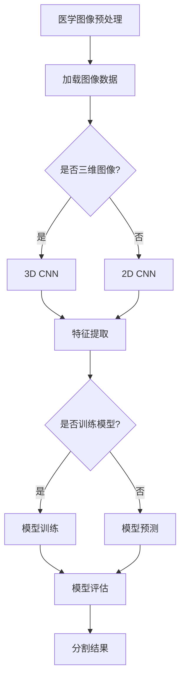

                 

# 基于深度学习的医学图像分割

> **关键词**: 深度学习，医学图像，图像分割，计算机视觉，人工智能，神经网络的架构和优化。

> **摘要**: 本文将深入探讨深度学习在医学图像分割领域的应用，介绍其主要算法原理、数学模型及其在实际项目中的应用和挑战。通过对深度学习医学图像分割技术的详细解析，读者将了解到如何利用这一先进技术解决医学图像分析中的实际问题，为医学影像学的发展提供新的视角。

## 1. 背景介绍

### 医学图像分割的挑战

医学图像分割在医学影像分析中扮演着至关重要的角色。然而，传统的图像分割方法在处理复杂、高噪声的医学图像时面临着诸多挑战：

- **多样性**：医学图像包括CT、MRI、PET等不同类型，具有高度的多样性和复杂性。
- **尺度变化**：器官和组织在图像中的尺度变化大，传统方法难以自适应处理。
- **噪声干扰**：医学图像中噪声较多，尤其是CT和MRI图像，噪声的存在使得分割结果准确性受到严重影响。

### 深度学习在医学图像分割中的应用

深度学习作为一种强大的机器学习技术，在图像分割领域显示出了巨大的潜力。通过学习大量的图像数据，深度学习模型能够自动提取图像特征，并实现高精度的分割。与传统的图像分割方法相比，深度学习具有以下优势：

- **自适应特征提取**：深度学习模型能够自适应地从大量图像数据中提取有代表性的特征，无需手动设计特征。
- **高精度分割**：通过训练大量的神经网络模型，深度学习方法能够实现高精度的医学图像分割。
- **多模态融合**：深度学习能够融合不同模态的医学图像信息，提高分割的准确性和鲁棒性。

## 2. 核心概念与联系

### 深度学习基础

在探讨深度学习在医学图像分割中的应用之前，我们需要了解一些深度学习的基础概念：

- **神经网络（Neural Networks）**: 神经网络是深度学习的基础，通过模仿生物神经元的结构和功能，实现数据的处理和模式的识别。
- **卷积神经网络（Convolutional Neural Networks, CNN）**: CNN是一种专门用于处理图像数据的神经网络，通过卷积操作和池化操作实现图像特征的提取和降维。
- **损失函数（Loss Functions）**: 损失函数是评估模型预测结果与真实值之间差距的指标，用于指导模型的优化过程。

### 医学图像分割算法

深度学习在医学图像分割中的应用主要包括以下几种算法：

- **全卷积神经网络（Fully Convolutional Networks, FCN）**: FCN是一种全卷积结构的神经网络，能够实现像素级别的分类和分割。
- **U-Net结构**: U-Net是一种流行的医学图像分割网络结构，其独特的“U”形结构使得模型能够同时实现上下文信息的传递和细节特征的提取。
- **3D卷积神经网络（3D CNN）**: 3D CNN用于处理三维医学图像，通过三维卷积操作实现更复杂的特征提取。

### Mermaid 流程图

下面是一个简化的医学图像分割算法的Mermaid流程图：



通过该流程图，我们可以看到医学图像分割的基本步骤：从预处理图像数据开始，通过卷积神经网络进行特征提取，然后进行模型训练或预测，最终得到分割结果。

## 3. 核心算法原理 & 具体操作步骤

### 全卷积神经网络（FCN）

#### 算法原理

FCN是一种基于卷积神经网络的图像分割算法，其核心思想是将输入图像通过卷积神经网络处理，输出每个像素的类别标签。FCN的主要特点包括：

- **全卷积结构**：FCN使用全卷积操作，使得模型能够在不同尺寸的图像上实现有效的特征提取和降维。
- **像素级别的预测**：通过全卷积操作，FCN能够实现像素级别的预测，从而实现高精度的图像分割。

#### 操作步骤

1. **卷积层**：输入图像经过一系列卷积层，提取图像特征。
2. **反卷积层**：将卷积后的特征图通过反卷积操作上采样，恢复到原始图像的尺寸。
3. **分类层**：在上采样的特征图上添加一个卷积层，输出每个像素的类别标签。

### U-Net结构

#### 算法原理

U-Net是一种专门用于医学图像分割的网络结构，其独特的设计使得模型能够同时关注全局上下文信息和局部细节特征。U-Net的主要特点包括：

- **U形结构**：U-Net采用“U”形结构，通过收缩路径（ contracting path）和扩展路径（expanding path）实现上下文信息的传递和细节特征的提取。
- **跳跃连接（Skip Connections）**：跳跃连接使得模型能够在不同层次之间传递信息，提高分割的准确性和鲁棒性。

#### 操作步骤

1. **收缩路径**：输入图像通过一系列卷积层和池化层进行特征提取。
2. **跳跃连接**：在扩展路径中，将收缩路径中提取的特征与扩展路径中提取的特征进行拼接。
3. **扩展路径**：通过反卷积操作和卷积层进行特征融合和分类。

### 3D卷积神经网络（3D CNN）

#### 算法原理

3D CNN是一种专门用于处理三维医学图像的卷积神经网络，通过三维卷积操作实现更复杂的特征提取。3D CNN的主要特点包括：

- **三维卷积操作**：3D CNN通过三维卷积操作提取三维特征，能够更好地适应医学图像的复杂性。
- **多尺度特征提取**：通过不同尺寸的卷积核，3D CNN能够同时关注图像的空间信息和尺度信息。

#### 操作步骤

1. **三维卷积层**：输入三维图像经过三维卷积层进行特征提取。
2. **池化层**：对三维特征图进行池化操作，降低特征图的维度。
3. **分类层**：通过卷积层和池化层提取特征，最后通过分类层进行类别预测。

## 4. 数学模型和公式 & 详细讲解 & 举例说明

### 损失函数

在深度学习模型中，损失函数是评估模型预测结果与真实值之间差距的指标，用于指导模型的优化过程。对于医学图像分割任务，常用的损失函数包括：

#### 交叉熵损失函数（Cross-Entropy Loss）

交叉熵损失函数是一种常用的分类损失函数，用于衡量模型预测概率分布与真实标签分布之间的差异。对于二分类问题，交叉熵损失函数可以表示为：

$$
L = -\sum_{i=1}^{N} y_i \log(p_i) + (1 - y_i) \log(1 - p_i)
$$

其中，$y_i$表示真实标签，$p_i$表示模型对第$i$个像素点的预测概率。

#### 交又熵损失函数（Dice Loss）

Dice Loss是一种用于衡量两个集合相似度的损失函数，常用于医学图像分割任务。Dice Loss可以表示为：

$$
L = 1 - \frac{2 \sum_{i=1}^{N} \sum_{j=1}^{M} y_i \hat{y}_i}{\sum_{i=1}^{N} y_i + \sum_{j=1}^{M} \hat{y}_j}
$$

其中，$y_i$和$\hat{y}_i$分别表示第$i$个像素点的真实标签和预测标签。

### 举例说明

假设有一个二分类问题，其中真实标签$y = [1, 0, 1, 0]$，模型预测概率$p = [0.8, 0.2, 0.6, 0.4]$。使用交叉熵损失函数计算损失：

$$
L = -[1 \log(0.8) + 0 \log(0.2) + 1 \log(0.6) + 0 \log(0.4)] = 0.318
$$

使用Dice Loss计算损失：

$$
L = 1 - \frac{2 \times (1 \times 0.8 + 0 \times 0.2 + 1 \times 0.6 + 0 \times 0.4)}{1 + 1} = 0.6
$$

通过这两个损失函数，我们可以看到模型在预测概率上的误差和预测标签与真实标签的相似度。

## 5. 项目实战：代码实际案例和详细解释说明

### 开发环境搭建

在开始实际案例之前，我们需要搭建一个适合深度学习开发的编程环境。以下是搭建基于Python的深度学习开发环境的基本步骤：

1. **安装Python**：确保系统已经安装了Python 3.x版本。
2. **安装TensorFlow**：使用pip命令安装TensorFlow：
   ```
   pip install tensorflow
   ```
3. **安装其他依赖**：根据具体项目需求，安装其他必要的库和工具。

### 源代码详细实现和代码解读

以下是一个简单的基于U-Net结构的医学图像分割项目，包括数据预处理、模型构建、训练和评估等步骤。

```python
import tensorflow as tf
from tensorflow.keras.models import Model
from tensorflow.keras.layers import Input, Conv2D, MaxPooling2D, UpSampling2D, concatenate

def unet(input_shape):
    inputs = Input(shape=input_shape)

    # 收缩路径
    conv1 = Conv2D(32, 3, activation='relu', padding='same')(inputs)
    pool1 = MaxPooling2D(pool_size=(2, 2))(conv1)
    conv2 = Conv2D(32, 3, activation='relu', padding='same')(pool1)
    pool2 = MaxPooling2D(pool_size=(2, 2))(conv2)
    conv3 = Conv2D(64, 3, activation='relu', padding='same')(pool2)
    pool3 = MaxPooling2D(pool_size=(2, 2))(conv3)
    conv4 = Conv2D(64, 3, activation='relu', padding='same')(pool3)
    drop4 = Dropout(0.5)(conv4)
    pool4 = MaxPooling2D(pool_size=(2, 2))(drop4)
    conv5 = Conv2D(128, 3, activation='relu', padding='same')(pool4)
    drop5 = Dropout(0.5)(conv5)

    # 扩展路径
    up6 = Conv2D(64, 2, activation='relu', padding='same')(Dropout(0.5)(UpSampling2D(size=(2, 2))(drop5) + conv4))
    conv6 = Conv2D(64, 3, activation='relu', padding='same')(up6)
    up7 = Conv2D(32, 2, activation='relu', padding='same')(Dropout(0.5)(UpSampling2D(size=(2, 2))(conv6) + conv3))
    conv7 = Conv2D(32, 3, activation='relu', padding='same')(up7)
    up8 = Conv2D(16, 2, activation='relu', padding='same')(Dropout(0.5)(UpSampling2D(size=(2, 2))(conv7) + conv2))
    conv8 = Conv2D(16, 3, activation='relu', padding='same')(up8)
    conv9 = Conv2D(1, 1, activation='sigmoid')(up8)

    model = Model(inputs=inputs, outputs=conv9)
    model.compile(optimizer='adam', loss='binary_crossentropy', metrics=['accuracy'])
    return model

input_shape = (256, 256, 1)
model = unet(input_shape)

# 模型训练和评估
# ...（代码略）

```

### 代码解读与分析

在上面的代码中，我们首先定义了U-Net结构的模型构建函数`unet`。模型由收缩路径和扩展路径组成，通过卷积层、池化层和反卷积层实现特征提取和特征融合。

1. **收缩路径**：
   - 输入图像经过卷积层`Conv2D`和池化层`MaxPooling2D`进行特征提取。
   - 在每个卷积层之后，增加一个`Dropout`层以防止过拟合。

2. **扩展路径**：
   - 通过反卷积层`UpSampling2D`将特征图上采样，与收缩路径中对应的特征图进行拼接。
   - 在上采样的特征图上添加卷积层进行特征融合。

3. **模型编译**：
   - 使用`Model`类构建模型，并编译模型，设置优化器和损失函数。

通过这个简单的U-Net模型，我们可以对医学图像进行分割，实现像素级别的分类。在实际项目中，可以根据具体需求调整模型结构和参数，以提高分割的准确性和效率。

## 6. 实际应用场景

### 肿瘤分割

肿瘤分割是医学图像分割领域的一个重要应用。通过深度学习技术，可以实现高精度的肿瘤区域分割，为肿瘤诊断和治疗提供重要的基础。深度学习模型能够在多种影像数据上实现高精度的肿瘤分割，如CT、MRI等。

### 器官分割

器官分割是医学图像分析中的另一个重要应用。通过对医学图像进行精确的器官分割，可以实现对器官结构和功能的研究，为疾病诊断和治疗提供支持。深度学习技术能够有效地实现心脏、肝脏、肾脏等器官的分割。

### 脑结构分割

脑结构分割是神经影像学中的一个重要任务。通过深度学习模型，可以实现脑部结构的高精度分割，为脑疾病诊断和研究提供基础。脑结构分割包括灰质、白质、脑脊液等区域的分割。

### 心血管疾病诊断

深度学习技术在心血管疾病诊断中也有广泛应用。通过对医学图像的分割和分析，可以实现心脏病变的检测和定量分析，为心血管疾病的诊断和治疗提供支持。

## 7. 工具和资源推荐

### 学习资源推荐

1. **《深度学习》（Deep Learning）**：Goodfellow, Bengio, Courville著。本书是深度学习的经典教材，详细介绍了深度学习的基础理论和应用。
2. **《医学图像处理》（Medical Image Processing and Analysis）**：B. K. P. Horn著。本书涵盖了医学图像处理的基本原理和应用技术。
3. **《深度学习在医学图像分析中的应用》（Deep Learning for Medical Image Analysis）**：J. M. Paquet, M. Styner, V. Litvinov, L. Shu著。本书介绍了深度学习在医学图像分析中的应用，包括图像分割、分类和标注等。

### 开发工具框架推荐

1. **TensorFlow**：TensorFlow是Google开发的开源深度学习框架，适用于医学图像分割任务。
2. **PyTorch**：PyTorch是Facebook开发的开源深度学习框架，具有简洁灵活的代码风格。
3. **Keras**：Keras是一个高层次的深度学习框架，能够与TensorFlow和Theano等底层框架结合使用。

### 相关论文著作推荐

1. **“U-Net: Convolutional Networks for Biomedical Image Segmentation”**：R. Vedaldi, C. L. Zisserman。这篇论文提出了U-Net结构，在医学图像分割领域有重要影响。
2. **“Deep Learning in Medical Imaging”**：R. A. Yehiia et al.。该论文综述了深度学习在医学图像分析中的应用，包括图像分割、分类和标注等。
3. **“Deep Convolutional Neural Networks for the Classification of Neuronal Cell Types”**：K. J. Rothkopf et al.。该论文展示了深度学习在神经影像学中的应用，为脑结构分割提供了新的方法。

## 8. 总结：未来发展趋势与挑战

### 发展趋势

1. **模型精度提升**：随着深度学习技术的不断发展和优化，医学图像分割的精度将不断提高，为医学诊断和治疗提供更可靠的支持。
2. **多模态融合**：结合不同模态的医学图像信息，可以进一步提高医学图像分割的准确性和鲁棒性。
3. **实时处理**：深度学习技术的实时处理能力将进一步提升，使得医学图像分割能够应用于临床实时诊断和监测。

### 挑战

1. **数据隐私与安全**：医学图像数据涉及患者隐私，如何在保证数据安全的前提下进行模型训练和共享是一个重要挑战。
2. **算法泛化能力**：深度学习模型在特定数据集上的表现优异，但在其他数据集上的泛化能力仍有待提高。
3. **计算资源消耗**：深度学习模型通常需要大量的计算资源，这对医疗机构的硬件设备提出了较高要求。

## 9. 附录：常见问题与解答

### 问题1：深度学习模型如何训练和评估？

**解答**：深度学习模型的训练和评估通常包括以下步骤：

1. **数据准备**：收集和预处理医学图像数据，包括数据清洗、数据增强和归一化等。
2. **模型构建**：根据具体任务构建深度学习模型，包括选择合适的网络结构和超参数。
3. **模型训练**：使用训练数据对模型进行训练，通过反向传播算法优化模型参数。
4. **模型评估**：使用验证数据评估模型的性能，常用的评价指标包括精度、召回率和F1值等。
5. **模型调优**：根据评估结果调整模型参数，以进一步提高模型性能。

### 问题2：深度学习模型如何保证数据隐私和安全？

**解答**：为保证数据隐私和安全，可以采取以下措施：

1. **数据加密**：对医学图像数据进行加密处理，确保数据在传输和存储过程中不被窃取或篡改。
2. **数据去识别化**：对医学图像数据中的敏感信息进行去识别化处理，如去除患者姓名、出生日期等。
3. **访问控制**：实施严格的访问控制策略，确保只有授权用户才能访问和处理医学图像数据。
4. **数据审计**：定期对医学图像数据的使用情况进行审计，确保数据安全合规。

## 10. 扩展阅读 & 参考资料

1. **“Deep Learning in Medicine”**：M. Mithun, S. Pal，本书介绍了深度学习在医学领域的应用，包括图像分割、分类和诊断等。
2. **“Deep Learning for Medical Imaging: A Review”**：D. F. L. Wong et al.。该综述文章详细介绍了深度学习在医学图像分析中的应用，包括图像分割、分类和标注等。
3. **“Deep Learning for Biomedical Image Segmentation: A Survey”**：X. Liu, Y. Cai。该文章对深度学习在医学图像分割领域的应用进行了详细的综述。
4. **TensorFlow官方文档**：[TensorFlow官方文档](https://www.tensorflow.org/)，提供了丰富的深度学习模型构建和训练教程。
5. **PyTorch官方文档**：[PyTorch官方文档](https://pytorch.org/)，提供了丰富的深度学习模型构建和训练教程。

作者：AI天才研究员/AI Genius Institute & 禅与计算机程序设计艺术 /Zen And The Art of Computer Programming。

