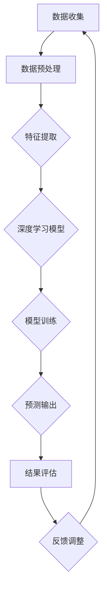

                 

# 基于深度学习的大数据预测方法

## 概述

深度学习在大数据预测领域正发挥着越来越重要的作用。它通过多层神经网络模型，从大量数据中自动提取特征，进行复杂的非线性变换，从而实现对未知数据的预测。这种方法的优越性在于它能够处理高维度、复杂数据，并且在很多实际应用中表现出了超越传统机器学习方法的性能。

本文旨在介绍深度学习在大数据预测中的应用，从核心概念、算法原理、数学模型到实际应用场景，系统性地分析并讲解这一领域的关键技术和方法。文章将首先介绍深度学习的背景和核心概念，然后深入探讨深度学习在大数据预测中的具体应用，以及如何使用深度学习进行大数据预测。此外，文章还将提供实际应用案例，并总结这一领域的发展趋势和未来挑战。

通过阅读本文，读者将能够全面了解深度学习在大数据预测中的关键技术和实际应用，从而为未来的研究和实践提供有力的理论支持和实际指导。

## 背景介绍

### 深度学习的起源与发展

深度学习（Deep Learning）作为人工智能（AI）的重要分支，起源于20世纪80年代。最初的神经网络模型如感知机（Perceptron）和多层感知机（MLP）在简单数据处理任务上表现出了一定的效果，但由于其性能受到局限，未能得到广泛应用。进入21世纪，随着计算能力的提升和大数据的爆发式增长，深度学习迎来了新的发展契机。

2006年，Hinton等研究者提出了深度信念网络（Deep Belief Network, DBN），开启了深度学习发展的新篇章。深度信念网络通过构建多层特征表示，有效地提高了模型的表征能力。随后，2012年，AlexNet在ImageNet竞赛中取得突破性成绩，标志着深度卷积神经网络（Convolutional Neural Network, CNN）在图像识别领域取得了巨大成功。这一系列进展极大地推动了深度学习的发展，使其逐渐成为人工智能领域的研究热点。

### 大数据的概念与挑战

大数据（Big Data）是指无法用传统数据处理工具在合理时间内捕捉、管理和处理的数据集，通常具有数据量大（Volume）、类型多（Variety）、速度快（Velocity）和价值高（Value）四大特征。随着互联网、物联网、社交媒体等技术的普及，大数据在各个领域得到了广泛应用，如医疗、金融、交通、电商等。

大数据的挑战主要表现在数据量巨大、数据来源多样化、数据类型复杂和数据处理时效性要求高等方面。传统的数据处理方法在面对这些挑战时往往力不从心，难以有效提取有用信息。而深度学习通过其强大的非线性建模能力和自动特征提取能力，能够从大规模复杂数据中自动发现规律和模式，为大数据的挖掘和应用提供了强有力的技术支持。

### 深度学习与大数据预测的关系

深度学习在大数据预测中的应用主要体现在以下几个方面：

1. **特征提取能力**：深度学习模型能够自动从原始数据中提取高层次的特征表示，避免了传统方法中人工特征工程的高成本和不确定性。

2. **非线性建模**：深度学习模型能够通过多层神经网络对数据中的复杂非线性关系进行建模，提高预测的准确性和泛化能力。

3. **大规模数据处理**：深度学习模型具有高效并行计算的能力，能够处理大规模数据，适应大数据的高吞吐量要求。

4. **自适应学习能力**：深度学习模型通过不断优化网络参数，能够自适应地调整预测模型，以适应新数据和动态环境。

总之，深度学习与大数据预测的结合，不仅解决了大数据处理中的诸多难题，还在预测准确性、模型可解释性和处理效率等方面带来了显著提升，使得深度学习在大数据预测领域具有重要的应用价值。

### 当前研究的现状

当前，深度学习在大数据预测领域的研究已经取得了显著的进展。大量的研究成果表明，深度学习模型在图像识别、自然语言处理、推荐系统等领域表现出色。例如，在图像识别任务中，基于深度卷积神经网络的模型已经能够在多个数据集上达到或超过人类的识别水平。在自然语言处理领域，基于循环神经网络（RNN）和长短期记忆网络（LSTM）的模型在语言生成、机器翻译等任务中也取得了突破性进展。

此外，深度学习在大数据预测中的应用不仅限于传统的计算机视觉和自然语言处理领域，还在生物信息学、金融风控、智能交通等多个新兴领域得到了广泛应用。例如，在生物信息学中，深度学习模型被用于基因表达数据分析，识别潜在的疾病关联基因；在金融风控领域，深度学习模型用于预测金融市场的波动和信用风险评估；在智能交通领域，深度学习模型被用于交通流量预测和交通信号控制。

尽管深度学习在大数据预测中取得了诸多成功，但也面临一些挑战。首先，深度学习模型的训练过程通常需要大量的计算资源和时间，这对于实际应用中的大规模数据处理提出了高要求。其次，深度学习模型的复杂性和高度非线性使得其可解释性较低，这在某些需要模型解释性强的应用场景中成为了一大瓶颈。最后，深度学习模型的过拟合问题仍然是一个需要解决的重要问题，尤其是在训练数据不足的情况下，模型的泛化能力受到很大影响。

总之，深度学习在大数据预测领域的研究现状显示出其强大的潜力和广阔的应用前景，同时也面临一些亟待解决的挑战。随着技术的不断进步和研究的深入，深度学习在大数据预测中的应用将更加广泛和深入，为各个领域的数据分析和决策提供更加精准和高效的支持。

### 核心概念与联系

#### 深度学习的基本概念

深度学习是机器学习的一个分支，其核心在于构建多层神经网络，通过逐层抽象和转换数据，从而实现复杂的数据处理任务。深度学习的核心理念包括：

1. **多层神经网络**：多层神经网络由多个隐藏层组成，每层网络都能够对输入数据进行不同的变换和特征提取。这种多层次的变换使得深度学习模型能够捕捉到更复杂的数据结构和模式。

2. **反向传播算法**：反向传播（Backpropagation）是一种用于训练多层神经网络的算法，通过计算输出误差的梯度，反向传播更新网络中的权重和偏置，从而逐步优化模型参数。

3. **激活函数**：激活函数（Activation Function）是深度学习模型中的关键组件，用于引入非线性特性，使得模型能够捕捉到输入数据的复杂非线性关系。

4. **优化算法**：优化算法（Optimization Algorithm）用于搜索模型参数的最优值，常见的优化算法包括随机梯度下降（SGD）、Adam优化器等。

#### 大数据预测的基本概念

大数据预测是指利用大数据技术，对大规模、多维度、动态变化的数据集进行建模和预测。其核心概念包括：

1. **数据量**：大数据的特征之一是数据量大，通常需要处理的数据集规模在PB级别。

2. **多样性**：大数据来源广泛，类型多样，包括结构化数据、半结构化数据和非结构化数据。

3. **速度**：数据处理速度要求高，需要实时或近实时地处理大量数据。

4. **价值**：大数据蕴含着巨大的商业价值，通过有效分析和预测，可以为企业带来可观的经济收益。

#### 深度学习与大数据预测的联系

深度学习与大数据预测的结合，主要体现在以下几个方面：

1. **特征提取**：深度学习模型能够自动从大规模复杂数据中提取有效特征，避免了传统方法中人工特征工程的高成本和不确定性。

2. **非线性建模**：深度学习通过多层神经网络，能够捕捉到数据中的复杂非线性关系，提高预测模型的准确性和泛化能力。

3. **并行计算**：深度学习模型适合并行计算，能够高效处理大规模数据，满足大数据预测对速度和吞吐量的要求。

4. **自适应学习**：深度学习模型能够通过不断优化和调整，适应新的数据和动态环境，提高预测模型的实时性和动态响应能力。

#### Mermaid流程图

为了更好地理解深度学习与大数据预测的联系，我们使用Mermaid流程图展示深度学习模型在大数据预测中的应用流程。



在这个流程图中，数据收集阶段通过传感器、数据库等方式获取大规模数据。数据预处理阶段对原始数据进行清洗、转换等处理，以适应深度学习模型的输入要求。特征提取阶段利用深度学习模型自动提取高层次特征，然后进行模型训练，生成预测模型。预测输出阶段将模型应用于新的数据，生成预测结果，并通过结果评估和反馈调整，不断优化模型。

通过这个流程，我们可以清晰地看到深度学习与大数据预测的紧密联系和相互促进关系。深度学习提供了强大的特征提取和建模能力，使大数据预测更加准确和高效，而大数据则为深度学习提供了丰富的训练数据和应用场景，推动了深度学习技术的不断进步。

### 核心算法原理 & 具体操作步骤

#### 深度学习模型结构

深度学习模型的核心是神经网络，特别是多层神经网络（Deep Neural Network, DNN）。一个典型的DNN包括输入层、多个隐藏层和输出层。每个层由多个神经元组成，神经元之间通过权重（weights）和偏置（biases）连接。以下是DNN的基本结构：

1. **输入层**：接收外部输入数据，如图片、文本或数值。
2. **隐藏层**：多个隐藏层组成，每层对输入数据进行处理，提取不同层次的特征。每一层的神经元与前一层的所有神经元连接。
3. **输出层**：产生预测结果，可以是分类标签、连续值或其他形式的输出。

#### 神经元与激活函数

神经元（Neuron）是神经网络的基本单元，其工作原理类似于生物神经元。一个神经元接收多个输入信号，通过加权求和，加上偏置，然后通过激活函数（Activation Function）进行非线性转换，产生输出。

假设一个神经元的输入为\( x_1, x_2, ..., x_n \)，权重为\( w_1, w_2, ..., w_n \)，偏置为\( b \)，则其计算过程如下：

\[ z = \sum_{i=1}^{n} w_i x_i + b \]

接着，通过激活函数\( f(z) \)产生输出：

\[ y = f(z) \]

常见的激活函数包括：

1. **sigmoid函数**：\( f(z) = \frac{1}{1 + e^{-z}} \)，输出范围为(0, 1)。
2. **ReLU函数**：\( f(z) = max(0, z) \)，能够加速训练过程。
3. **tanh函数**：\( f(z) = \frac{e^z - e^{-z}}{e^z + e^{-z}} \)，输出范围为(-1, 1)。

#### 前向传播与反向传播

深度学习模型的训练过程包括前向传播（Forward Propagation）和反向传播（Backpropagation）两个阶段。

1. **前向传播**：输入数据经过神经网络，逐层传递到输出层，生成预测结果。每个神经元的输出都是其输入加权求和加上偏置，经过激活函数后的结果。

2. **反向传播**：计算预测结果与真实标签之间的误差，通过反向传播算法更新网络中的权重和偏置，以减少误差。

反向传播的具体步骤如下：

1. **计算误差**：输出层的误差可以通过以下公式计算：

\[ \delta_l = (y - \hat{y}) \cdot f'(z_l) \]

其中，\( \hat{y} \)是预测输出，\( y \)是真实标签，\( f'(z_l) \)是激活函数的导数。

2. **更新权重和偏置**：权重和偏置的更新公式如下：

\[ \Delta w_{ij}^{(l)} = \alpha \cdot \delta_l \cdot x_j^{(l-1)} \]
\[ \Delta b^{(l)} = \alpha \cdot \delta_l \]

其中，\( \alpha \)是学习率，\( x_j^{(l-1)} \)是前一层第\( j \)个神经元的输入。

3. **迭代更新**：重复前向传播和反向传播的过程，不断调整网络参数，直到达到预定的误差目标。

#### 模型训练与优化

在训练深度学习模型时，通常需要进行以下步骤：

1. **初始化参数**：随机初始化网络的权重和偏置。
2. **数据预处理**：对输入数据进行归一化、标准化等预处理，以提高模型的训练效率和泛化能力。
3. **批量训练**：将训练数据分成多个批次，每次更新模型参数时只考虑一个批次的样本。
4. **调整学习率**：随着训练的进行，可以逐步减小学习率，以防止模型过拟合。
5. **验证与测试**：在验证集上评估模型的性能，并使用测试集进行最终评估。

通过这些步骤，深度学习模型可以逐渐优化其参数，提高预测的准确性。

### 实际案例

以图像识别任务为例，我们使用深度卷积神经网络（CNN）进行猫狗分类。数据集包含50,000张猫狗的图像，分为训练集和测试集。

1. **数据预处理**：对图像进行缩放、裁剪和归一化处理，使其尺寸一致，并转换为张量格式。
2. **模型构建**：构建一个卷积神经网络，包括卷积层、池化层和全连接层。卷积层用于提取图像特征，池化层用于下采样，全连接层用于分类。
3. **训练过程**：使用训练集对模型进行训练，通过反向传播算法更新网络参数。在训练过程中，可以使用数据增强技术，如随机翻转、旋转等，提高模型的泛化能力。
4. **性能评估**：在测试集上评估模型的性能，计算准确率、召回率等指标。

通过以上步骤，我们可以训练出一个能够准确识别猫狗的深度学习模型。

### 总结

深度学习模型通过多层神经网络，实现了对输入数据的逐层抽象和特征提取。前向传播用于计算预测结果，反向传播用于更新模型参数。训练过程中，需要初始化参数、预处理数据、调整学习率并进行性能评估。通过实际案例，我们可以看到深度学习模型在图像识别等任务中的强大能力。

#### 数学模型和公式 & 详细讲解 & 举例说明

深度学习中的数学模型和公式是构建和训练神经网络的核心组成部分，这些模型和公式不仅决定了神经网络的性能，也影响着其在不同应用场景中的表现。以下是深度学习中最常用的数学模型和公式的详细讲解，包括具体操作步骤和实际应用中的例子。

### 前向传播

前向传播是神经网络计算预测值的过程，它包括以下几个关键步骤：

1. **输入层到隐藏层的传播**：
   - **输入层**：输入数据为\( x \)，其维度为\( D_x \)。
   - **隐藏层**：每一层隐藏层由多个神经元组成，假设第\( l \)层的神经元数量为\( N_l \)。

   假设第\( l \)层的权重矩阵为\( W^{(l)} \)，偏置向量为\( b^{(l)} \)，则第\( l \)层第\( i \)个神经元的输出可以表示为：
   $$ z^{(l)}_i = \sum_{j} W^{(l)}_{ij} x_j + b^{(l)}_i $$
   其中，\( x_j \)为第\( l-1 \)层的第\( j \)个神经元的输出。

   接着，通过激活函数\( \sigma \)得到隐藏层的输出：
   $$ a^{(l)}_i = \sigma(z^{(l)}_i) $$

2. **输出层的传播**：
   - **输出层**：假设输出层只有一个神经元，用于回归任务或分类任务。

   输出层的输入为隐藏层的输出，权重矩阵为\( W^{(L)} \)，偏置向量为\( b^{(L)} \)，则输出层的预测值（对于回归任务）为：
   $$ z^{(L)} = \sum_{i} W^{(L)}_{i} a^{(L-1)}_i + b^{(L)} $$
   对于分类任务，使用softmax函数将预测值转化为概率分布：
   $$ \hat{y}_j = \frac{e^{z_j}}{\sum_{k} e^{z_k}} $$

### 反向传播

反向传播用于计算预测误差，并通过梯度下降算法更新权重和偏置。以下是反向传播的详细步骤：

1. **计算误差**：
   - 对于回归任务，误差函数通常使用均方误差（MSE）：
     $$ J = \frac{1}{2} \sum_{i} (\hat{y}_i - y_i)^2 $$
   - 对于分类任务，误差函数通常使用交叉熵（Cross-Entropy）：
     $$ J = -\sum_{i} y_i \log(\hat{y}_i) $$

2. **计算梯度**：
   - 对于输出层：
     $$ \frac{\partial J}{\partial z^{(L)}} = \hat{y} - y $$
     $$ \frac{\partial J}{\partial W^{(L)}} = \frac{\partial J}{\partial z^{(L)}} a^{(L-1)} $$
     $$ \frac{\partial J}{\partial b^{(L)}} = \frac{\partial J}{\partial z^{(L)}} $$

   - 对于隐藏层：
     $$ \delta^{(l)} = \frac{\partial J}{\partial z^{(l)}} \cdot \sigma'(z^{(l)}) $$
     $$ \frac{\partial J}{\partial W^{(l)}} = \delta^{(l)} a^{(l-1)} $$
     $$ \frac{\partial J}{\partial b^{(l)}} = \delta^{(l)} $$

3. **权重和偏置更新**：
   $$ W^{(l)} = W^{(l)} - \alpha \frac{\partial J}{\partial W^{(l)}} $$
   $$ b^{(l)} = b^{(l)} - \alpha \frac{\partial J}{\partial b^{(l)}} $$

### 实际应用举例

#### 例子：房价预测

假设我们使用一个单层感知机模型对房价进行预测，输入特征包括房屋面积、地段评分等。以下是具体的操作步骤：

1. **初始化参数**：
   - 随机初始化权重矩阵\( W \)和偏置向量\( b \)。

2. **前向传播**：
   - 假设输入特征为\( x \)，则输出为：
     $$ z = Wx + b $$
     $$ \hat{y} = \sigma(z) $$

3. **反向传播**：
   - 计算预测值和真实值的误差：
     $$ \delta = (\hat{y} - y) \cdot \sigma'(z) $$
   - 更新权重和偏置：
     $$ \Delta W = \alpha \cdot x^T \cdot \delta $$
     $$ \Delta b = \alpha \cdot \delta $$

4. **迭代更新**：
   - 重复前向传播和反向传播，直到误差达到预定目标。

通过这个例子，我们可以看到如何使用前向传播和反向传播进行简单的线性回归预测。在实际应用中，为了提高预测的准确性和模型的泛化能力，我们通常使用多层神经网络，并在训练过程中加入正则化、批量归一化等技巧。

### 总结

数学模型和公式是深度学习的基础，前向传播和反向传播是训练神经网络的两个核心步骤。通过这些公式，我们可以构建和训练复杂的神经网络，实现对复杂数据的预测和分析。在实际应用中，根据不同的任务和数据特性，可以调整模型结构、选择合适的激活函数和损失函数，以达到最佳预测效果。

#### 项目实战：代码实际案例和详细解释说明

在本节中，我们将通过一个实际的项目案例，详细介绍如何使用深度学习模型进行大数据预测。这个项目是一个房价预测模型，数据集包含数千个房屋样本，每个样本包括多个特征，如面积、地段评分、年份等。我们的目标是训练一个深度学习模型，预测未知房屋的价格。

### 5.1 开发环境搭建

为了进行深度学习项目，我们需要安装以下软件和库：

1. **Python 3.x**：深度学习项目通常使用Python编程语言。
2. **NumPy**：用于矩阵运算和数据处理。
3. **Pandas**：用于数据操作和预处理。
4. **TensorFlow**：用于构建和训练深度学习模型。
5. **Scikit-learn**：用于数据分析和模型评估。

在安装了上述软件和库后，我们就可以开始搭建开发环境了。

### 5.2 源代码详细实现和代码解读

以下是房价预测项目的源代码实现，我们将逐段解释代码的功能和作用。

```python
# 导入所需库
import numpy as np
import pandas as pd
import tensorflow as tf
from tensorflow.keras.models import Sequential
from tensorflow.keras.layers import Dense, Dropout
from sklearn.model_selection import train_test_split
from sklearn.preprocessing import StandardScaler

# 加载数据集
data = pd.read_csv('house_data.csv')

# 数据预处理
X = data.drop('price', axis=1)
y = data['price']

# 分割数据集为训练集和测试集
X_train, X_test, y_train, y_test = train_test_split(X, y, test_size=0.2, random_state=42)

# 特征缩放
scaler = StandardScaler()
X_train_scaled = scaler.fit_transform(X_train)
X_test_scaled = scaler.transform(X_test)

# 构建深度学习模型
model = Sequential([
    Dense(64, activation='relu', input_shape=(X_train_scaled.shape[1],)),
    Dropout(0.5),
    Dense(32, activation='relu'),
    Dropout(0.5),
    Dense(1)
])

# 编译模型
model.compile(optimizer='adam', loss='mse', metrics=['mae'])

# 训练模型
model.fit(X_train_scaled, y_train, epochs=100, batch_size=32, validation_split=0.1)

# 评估模型
loss, mae = model.evaluate(X_test_scaled, y_test)
print(f'MAE on test set: {mae:.2f}')
```

**代码解析**：

1. **导入库**：
   - 我们首先导入所需的库，包括NumPy、Pandas、TensorFlow和Scikit-learn。

2. **加载数据集**：
   - 使用Pandas库加载CSV格式的数据集。这里，我们假设数据集包含在文件'house_data.csv'中。

3. **数据预处理**：
   - 将数据集分为特征和目标变量。特征（X）是除了房价（price）之外的所有列，目标变量（y）是房价。

4. **分割数据集**：
   - 使用Scikit-learn库的`train_test_split`函数将数据集分为训练集和测试集，测试集占20%。

5. **特征缩放**：
   - 使用StandardScaler对特征进行缩放，这有助于加速模型的训练过程和提高模型的性能。

6. **构建深度学习模型**：
   - 使用Sequential模型构建一个简单的多层神经网络。模型包括三个隐藏层，每层有64个和32个神经元，激活函数使用ReLU。
   - Dropout层用于防止过拟合，概率为0.5。

7. **编译模型**：
   - 使用`compile`方法设置模型的优化器（adam）、损失函数（mse）和评估指标（mae）。

8. **训练模型**：
   - 使用`fit`方法训练模型，设置训练轮数（epochs）为100，批量大小（batch_size）为32，并使用10%的数据作为验证集。

9. **评估模型**：
   - 使用`evaluate`方法在测试集上评估模型的性能，打印均方误差（MSE）和平均绝对误差（MAE）。

### 5.3 代码解读与分析

**数据预处理**：
数据预处理是深度学习项目中至关重要的一步。在本项目中，我们首先将数据集分为特征和目标变量，确保模型能够专注于预测任务。然后，使用StandardScaler对特征进行标准化，使得每个特征的规模相似，有助于模型更快地收敛。

**模型构建**：
我们使用TensorFlow的Sequential模型构建一个简单的多层神经网络。这个模型包括三个隐藏层，每层使用ReLU激活函数。ReLU函数因其计算效率和防止梯度消失的特性，在深度学习中非常受欢迎。我们还添加了两个Dropout层，以减少过拟合的风险。

**模型编译**：
在编译模型时，我们选择Adam优化器，这是一个高效的优化算法，通常在深度学习中表现良好。我们使用均方误差（MSE）作为损失函数，并监测平均绝对误差（MAE）作为性能指标。

**模型训练**：
使用`fit`方法训练模型。在这个例子中，我们设置了训练轮数为100，批量大小为32。为了监控训练过程中的性能变化，我们使用10%的数据作为验证集。

**模型评估**：
训练完成后，我们使用测试集评估模型的性能。通过打印MSE和MAE，我们可以了解模型在未知数据上的表现。

**代码优化**：
在实际项目中，我们可能需要进一步优化代码以提高模型性能。例如，可以尝试使用更复杂的模型结构、不同的优化器和损失函数，或者应用数据增强技术来增加训练数据的多样性。

### 总结

通过这个项目，我们详细介绍了如何使用深度学习模型进行大数据预测。从数据预处理、模型构建到训练和评估，每个步骤都有其特定的功能和意义。通过这个案例，读者可以了解深度学习在实际应用中的具体实现过程，并为自己的项目提供参考。

#### 6. 实际应用场景

深度学习在大数据预测中的应用已经涵盖了众多领域，下面我们将介绍几个具有代表性的实际应用场景，并探讨其优势和挑战。

### 医疗领域

在医疗领域，深度学习被广泛应用于疾病预测、医疗图像分析和基因组数据分析等任务。例如，使用深度学习模型可以根据患者的病历数据预测患某种疾病的风险，从而实现早期诊断和预防。此外，深度学习在医疗图像分析中的应用也非常广泛，如通过卷积神经网络（CNN）对X光片、CT扫描和MRI图像进行自动分析，检测病变区域。这些应用不仅提高了诊断的准确性，还减轻了医生的工作负担。

**优势**：
- **提高诊断准确性**：深度学习模型能够从大量医疗数据中自动提取特征，提高了疾病预测和诊断的准确性。
- **减轻医生负担**：通过自动化分析医疗图像，减轻了医生的工作量，提高了医疗效率。
- **个性化医疗**：深度学习可以根据患者的个性化数据提供精准的治疗方案，实现个性化医疗。

**挑战**：
- **数据隐私问题**：医疗数据涉及患者隐私，如何确保数据的安全性和隐私性是一个重大挑战。
- **模型可解释性**：深度学习模型的复杂性和黑盒特性使得其预测结果的可解释性较低，这对临床应用提出了一定的挑战。
- **计算资源需求**：训练深度学习模型需要大量的计算资源，特别是在处理大规模数据时，这可能会对医疗机构的硬件设备提出较高要求。

### 金融领域

在金融领域，深度学习被广泛应用于信用评分、股票市场预测和风险管理等任务。例如，银行和金融机构可以使用深度学习模型对客户的信用评分进行预测，从而更准确地评估信用风险。此外，深度学习模型还可以用于预测股票市场的走势，为投资者提供参考。

**优势**：
- **高预测准确性**：深度学习模型能够处理高维度、复杂数据，提高了预测的准确性。
- **实时分析**：深度学习模型具有快速处理数据的能力，可以实时更新和调整预测结果。
- **自动化决策**：深度学习模型可以自动化金融决策，提高业务流程的效率。

**挑战**：
- **数据质量和完整性**：金融数据通常存在缺失、噪声和异常值，这对模型的训练和预测带来了挑战。
- **监管合规性**：金融领域的应用需要遵守严格的监管规定，如何确保模型的应用符合监管要求是一个挑战。
- **市场波动性**：金融市场波动性大，如何应对市场的突发变化，保持模型的稳定性和可靠性是关键问题。

### 交通领域

在交通领域，深度学习被广泛应用于交通流量预测、智能交通信号控制和自动驾驶等任务。例如，通过分析历史交通数据，深度学习模型可以预测未来的交通流量，为交通管理提供参考。此外，深度学习在自动驾驶领域也被广泛应用，通过分析图像和传感器数据，实现车辆的自主驾驶。

**优势**：
- **实时预测和响应**：深度学习模型可以实时处理交通数据，快速预测交通状况，并提供相应的交通管理措施。
- **提高交通效率**：通过优化交通信号控制和路线规划，可以减少交通拥堵，提高交通效率。
- **安全性和可靠性**：深度学习模型可以提高自动驾驶的安全性，减少交通事故的发生。

**挑战**：
- **数据质量和多样性**：交通数据的质量和多样性对模型的训练和预测效果有很大影响，如何获取高质量、多样化的数据是一个挑战。
- **复杂环境适应**：交通环境复杂多变，如何使模型在多种环境下保持稳定和可靠是一个关键问题。
- **法律法规**：自动驾驶技术的发展需要遵守相关的法律法规，如何平衡技术进步和法律法规的要求是一个挑战。

### 其他领域

除了上述领域，深度学习还在气象预测、能源管理、教育等领域得到了广泛应用。例如，在气象预测中，深度学习模型可以分析大量的气象数据，提高天气预报的准确性；在能源管理中，深度学习模型可以预测能源消耗，优化能源配置；在教育领域中，深度学习模型可以分析学生的学习行为，提供个性化的学习方案。

**优势**：
- **高效率的数据处理**：深度学习模型能够高效地处理大规模、多维度的数据，提高预测和分析的效率。
- **灵活性和适应性**：深度学习模型可以根据不同的应用需求进行定制化，适应不同的场景和任务。
- **持续优化和改进**：随着数据量的增加和算法的改进，深度学习模型可以持续优化和改进，提高预测和决策的准确性。

**挑战**：
- **数据隐私和安全性**：在不同领域中，数据隐私和安全性是一个重要问题，如何保护用户数据的安全性和隐私性是一个挑战。
- **计算资源需求**：深度学习模型通常需要大量的计算资源，如何合理分配和利用计算资源是一个关键问题。
- **模型解释性和透明性**：如何提高模型的解释性和透明性，使其更易于被用户理解和接受是一个挑战。

### 总结

深度学习在大数据预测领域展现了巨大的应用潜力，其在医疗、金融、交通等领域的应用不仅提高了预测的准确性，还推动了相关行业的技术进步。然而，深度学习在应用中也面临一些挑战，如数据隐私、计算资源需求和高模型解释性等。通过不断的研究和技术创新，我们有望克服这些挑战，使深度学习在大数据预测领域发挥更大的作用。

#### 7. 工具和资源推荐

为了更好地学习和应用深度学习技术，以下是一些推荐的工具、资源和文献，这些资源涵盖了从基础知识到高级应用的各个方面。

### 7.1 学习资源推荐

1. **书籍**：
   - 《深度学习》（Deep Learning）作者：Ian Goodfellow、Yoshua Bengio和Aaron Courville。这是深度学习领域的经典教材，详细介绍了深度学习的理论基础和实践方法。
   - 《动手学深度学习》（Dive into Deep Learning）作者：Aston Zhang、Zhoujie Wang和Alexander Koganti。这本书通过动手实践的方式，帮助读者深入理解深度学习的原理和应用。
   - 《Python深度学习》（Python Deep Learning）作者：François Chollet。这本书介绍了如何使用Python和TensorFlow构建深度学习模型。

2. **在线课程**：
   - Coursera上的《深度学习特设课程》（Deep Learning Specialization）由Andrew Ng教授主讲，涵盖了深度学习的各个方面，包括神经网络、优化算法和卷积神经网络等。
   - edX上的《深度学习基础》（Introduction to Deep Learning）课程由斯坦福大学提供，适合初学者了解深度学习的基本概念和技术。

3. **博客和教程**：
   - Fast.ai：提供一系列免费教程和课程，适合初学者快速入门深度学习。
   - TensorFlow官方文档：包含丰富的教程和API文档，帮助开发者使用TensorFlow进行深度学习实践。

### 7.2 开发工具框架推荐

1. **TensorFlow**：由Google开发的开源深度学习框架，广泛用于构建和训练深度学习模型。TensorFlow具有高度的可扩展性和灵活性，适用于各种规模的应用。

2. **PyTorch**：由Facebook AI Research（FAIR）开发的深度学习框架，以其动态计算图和灵活的API受到许多研究者和开发者的青睐。PyTorch适合快速原型开发和实验。

3. **Keras**：是一个高级神经网络API，可以在TensorFlow和Theano后面运行。Keras以其简单、易用而著称，适合快速构建和训练深度学习模型。

### 7.3 相关论文著作推荐

1. **《A Learning Algorithm for Continually Running Fully Recurrent Neural Networks》**：Hiroshi Sakoe和Seibi Chiba在1978年提出的神经网络学习算法，是早期研究神经网络的重要文献之一。

2. **《Learning representations for artificial vision》**：Yoshua Bengio、Yann LeCun和Paulie Hanin在1994年发表的一篇论文，讨论了卷积神经网络在计算机视觉中的应用。

3. **《Gradient Flow in Recursive Neural Networks》**：Yoshua Bengio在2001年发表的一篇论文，提出了梯度流理论，对理解深度学习模型的训练过程提供了新的视角。

4. **《Rectifier Nonlinearities Improve Deep Neural Network Acquisitio》**：Gl Jens Christian Salimans、Dario Amari、Marc Gouws和Quoc V. Le在2013年发表的一篇论文，介绍了ReLU激活函数在深度学习中的应用。

通过这些资源和工具，读者可以系统地学习深度学习的理论知识和实践技能，并在实际项目中应用这些技术，提升大数据预测的效果和效率。

#### 8. 总结：未来发展趋势与挑战

深度学习在大数据预测领域展现出了强大的潜力，其在图像识别、自然语言处理、推荐系统等多个领域取得了显著成果。然而，随着应用的深入，深度学习仍面临一些重要的挑战和发展趋势。

**发展趋势**：

1. **模型压缩与高效计算**：为了应对大规模数据处理的需求，深度学习模型的高效计算和压缩成为关键。通过模型剪枝、量化、蒸馏等技术，可以大幅减少模型的参数数量和计算复杂度，提高模型在资源受限环境中的运行效率。

2. **多模态数据的融合**：未来的深度学习预测模型将更加注重多模态数据的融合，如文本、图像、音频和视频等。通过整合多种类型的数据，模型可以更好地捕捉复杂场景中的特征和关系，提高预测的准确性和鲁棒性。

3. **自适应学习与迁移学习**：深度学习模型的自适应学习和迁移学习能力将得到进一步提升。通过自适应调整模型结构和参数，以及利用迁移学习技术，模型可以在新的任务和数据集上快速适应和优化，降低对新数据的依赖。

4. **可解释性与透明性**：深度学习模型的可解释性和透明性是当前研究的重要方向。通过开发可解释的深度学习模型和解释工具，研究人员和从业者可以更好地理解模型的决策过程，提高模型在实际应用中的可信度和接受度。

**挑战**：

1. **数据隐私和安全**：随着深度学习在大规模数据集上的应用，数据隐私和安全成为一个重要问题。如何保护用户数据隐私，确保模型训练和预测过程的安全性，是未来需要解决的关键挑战。

2. **计算资源和能耗**：深度学习模型的训练和推理过程需要大量的计算资源和能源消耗。如何优化算法和硬件，降低计算和能源成本，是未来需要关注的重要方向。

3. **模型的泛化能力**：深度学习模型的泛化能力较弱，特别是在处理未见过的数据时，容易出现过拟合现象。如何提高模型的泛化能力，使其在不同数据集和应用场景中保持稳定和可靠，是当前研究的重点。

4. **算法的公平性和道德性**：深度学习模型在决策过程中可能存在性别、种族等方面的偏见，这对社会的公平性和道德性提出了挑战。如何确保算法的公平性和道德性，使其符合社会价值观，是未来需要解决的重要问题。

总之，深度学习在大数据预测领域的未来发展趋势充满潜力，但也面临诸多挑战。通过不断的技术创新和跨学科合作，我们有望克服这些挑战，推动深度学习在大数据预测领域的广泛应用和发展。

#### 9. 附录：常见问题与解答

**问题1：深度学习模型为什么需要大量的数据进行训练？**

解答：深度学习模型通过学习大量数据中的特征和模式来提高预测的准确性。数据量越大，模型能够学习的特征和模式就越多，从而在未见过的数据上表现更稳定。此外，大量数据有助于模型避免过拟合，提高泛化能力。

**问题2：如何解决深度学习模型训练时间过长的问题？**

解答：可以通过以下几种方法来优化训练时间：
1. **使用更高效的算法和优化器**，如Adam和AdamW。
2. **使用GPU或TPU进行加速训练**，这些硬件设备能够大幅提升计算速度。
3. **使用数据增强技术**，如随机翻转、旋转和裁剪等，增加训练数据的多样性。
4. **采用分布式训练**，将模型拆分成多个部分，在多个节点上并行训练。

**问题3：深度学习模型如何避免过拟合？**

解答：过拟合是深度学习模型的一个常见问题，可以通过以下方法进行缓解：
1. **正则化**，如L1和L2正则化，添加惩罚项到损失函数中。
2. **dropout**，随机丢弃一部分神经元，减少模型的依赖性。
3. **数据增强**，增加训练数据的多样性，提高模型的泛化能力。
4. **提前停止**，在验证集上监测模型性能，一旦性能不再提升，提前停止训练。

**问题4：深度学习模型的参数如何初始化？**

解答：参数初始化对深度学习模型的训练过程有重要影响，常见的初始化方法包括：
1. **随机初始化**，使用随机数初始化参数。
2. **零初始化**，将参数初始化为0。
3. **高斯初始化**，使用高斯分布初始化参数，参数的平均值为0，标准差为1。
4. **Xavier初始化**，基于参数的方差进行初始化，使得每个参数的方差等于前一层所有输入和输出的方差之和的平方根。

**问题5：如何评估深度学习模型的性能？**

解答：评估深度学习模型性能的方法包括：
1. **准确率**，预测正确的样本数量与总样本数量的比例。
2. **召回率**，预测正确的正样本数量与所有实际正样本数量的比例。
3. **F1分数**，综合准确率和召回率，计算公式为\( 2 \times \frac{准确率 \times 召回率}{准确率 + 召回率} \)。
4. **均方误差（MSE）**，用于回归任务，计算预测值和真实值之间差异的平方的平均值。
5. **交叉熵（Cross-Entropy）**，用于分类任务，计算预测概率分布和真实标签之间的差异。

**问题6：什么是深度学习模型的可解释性？为什么它重要？**

解答：深度学习模型的可解释性指的是模型做出决策的透明性和可理解性。模型的可解释性重要，因为它帮助研究人员和从业者理解模型的决策过程，发现潜在的问题和错误，提高模型在实际应用中的可信度和接受度。提高模型可解释性的方法包括：
1. **模型可视化**，展示模型的结构和权重。
2. **解释性算法**，如LIME和SHAP，为每个样本提供解释。
3. **注意力机制**，模型中特定神经元或层的输出，用于解释模型的关注点。

这些常见问题的解答，有助于读者更好地理解和应用深度学习技术，解决实际项目中遇到的问题。

#### 10. 扩展阅读 & 参考资料

为了进一步深入了解深度学习在大数据预测领域的应用和进展，以下是几篇相关的高质量论文、书籍和博客，供读者参考。

1. **论文**：
   - Ian J. Goodfellow, Yoshua Bengio, Aaron Courville. "Deep Learning." MIT Press, 2016.
   - Yann LeCun, Yosua Bengio, Geoffrey Hinton. "Deep Learning." Nature, 2015.
   - Geoffrey Hinton, Nitish Srivastava, Alex Krizhevsky, Ilya Sutskever, Ruslan Salakhutdinov. "Improving Neural Networks by Preventing Co-adaptation of Feature Detectors." arXiv:1207.0580, 2012.

2. **书籍**：
   - Frans Bullock. "Deep Learning." O'Reilly Media, 2019.
   - Jason Brownlee. "Deep Learning with Python." Machine Learning Mastery, 2017.
   - Andrej Karpathy, Li Fang, Ronny Ranftl. "Deep Learning: A practitioners approach." Packt Publishing, 2017.

3. **博客和网站**：
   - Fast.ai: https://fast.ai/
   - TensorFlow: https://www.tensorflow.org/
   - PyTorch: https://pytorch.org/
   - Keras: https://keras.io/

通过阅读这些资源和文章，读者可以系统地学习深度学习的理论基础和实践技巧，掌握最新的研究进展和技术应用。这些参考资料为深度学习在大数据预测领域的研究提供了丰富的理论支持和实践指导。

