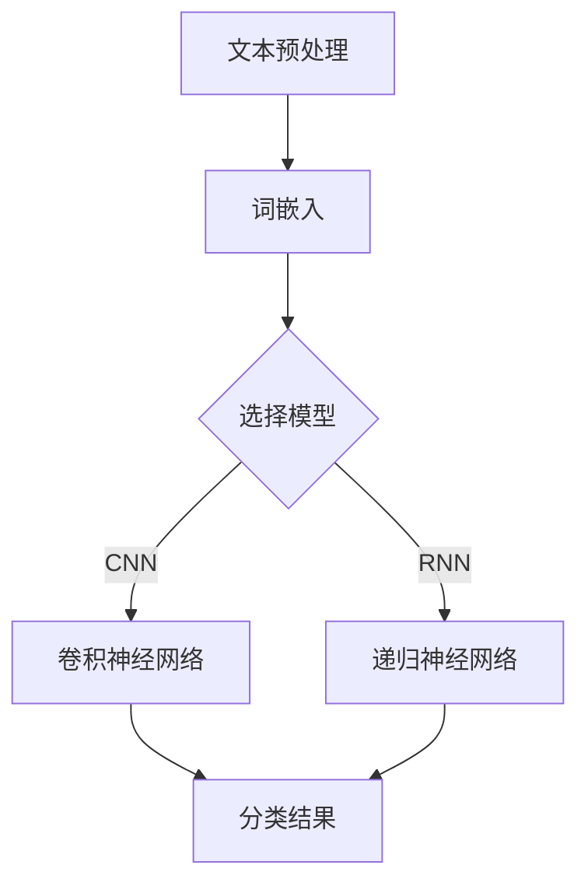

                 

### 文章标题

《基于深度学习的情感分类》

### 关键词

自然语言处理、情感分析、深度学习、神经网络、文本分类、机器学习

### 摘要

本文将深入探讨基于深度学习的情感分类技术。我们首先介绍了情感分类的背景和重要性，接着详细讲解了情感分类的核心概念和联系，包括文本预处理、词嵌入、卷积神经网络（CNN）和递归神经网络（RNN）等关键技术。随后，我们通过具体的数学模型和公式，对情感分类的算法原理进行了深入剖析，并通过实际项目案例展示了如何实现情感分类。最后，我们探讨了情感分类在实际应用场景中的价值，并推荐了相关的学习资源和开发工具。

### 1. 背景介绍

情感分类（Sentiment Classification）是一种文本分类任务，其目标是根据文本内容判断其表达的情感倾向，如正面、负面或中性。随着互联网的快速发展，人们产生了海量的文本数据，如社交媒体评论、产品评价、新闻报道等。这些数据中蕴含着丰富的情感信息，对企业和个人都具有重要的价值。

情感分类技术在多个领域都有广泛的应用。在商业领域，企业可以利用情感分类技术分析客户反馈，了解产品优势和不足，从而改进产品和服务。在金融领域，分析师可以利用情感分类技术对新闻报道和社交媒体信息进行分析，预测市场走势。在政治领域，政府可以利用情感分类技术监测舆论动态，了解公众对政策的态度，为决策提供参考。此外，情感分类技术还在舆情分析、情感计算、智能客服等领域得到广泛应用。

传统的情感分类方法主要基于规则和机器学习方法。规则方法通过设计一系列规则来识别文本中的情感词和情感极性，具有较高的准确率但扩展性较差。机器学习方法利用统计模型（如朴素贝叶斯、支持向量机等）或深度学习模型（如卷积神经网络、递归神经网络等）对文本进行情感分类，具有较好的泛化能力和适应性。然而，传统的情感分类方法往往存在以下问题：

1. **数据依赖性**：规则方法需要大量手工设计的规则，难以适应不断变化的文本数据。机器学习方法虽然可以利用大量训练数据，但模型复杂度较高，训练时间较长。

2. **上下文理解能力较弱**：传统的情感分类方法往往忽略了上下文信息，导致对文本情感理解的准确率受限。

3. **情感极性识别困难**：情感分类不仅需要识别文本的情感极性，还需要区分不同情感之间的细微差异，如喜悦、愤怒、悲伤等。

深度学习（Deep Learning）的出现为情感分类带来了新的契机。深度学习通过多层神经网络，能够自动提取文本中的特征，并实现端到端的学习。与传统的情感分类方法相比，深度学习具有以下优势：

1. **自动化特征提取**：深度学习模型可以自动从原始文本中提取高维特征，减少了人工设计特征的工作量。

2. **强大的上下文理解能力**：深度学习模型能够捕捉文本中的上下文信息，从而提高情感分类的准确率。

3. **端到端学习**：深度学习模型可以直接从原始文本数据中学习，实现端到端的情感分类。

4. **适应性强**：深度学习模型具有较好的泛化能力，能够应对不同领域的情感分类任务。

本文将详细介绍基于深度学习的情感分类技术，包括文本预处理、词嵌入、卷积神经网络（CNN）和递归神经网络（RNN）等关键技术，并通过实际项目案例展示如何实现情感分类。同时，我们将探讨情感分类在实际应用场景中的价值，以及未来可能面临的发展趋势和挑战。

### 2. 核心概念与联系

在深入探讨基于深度学习的情感分类技术之前，我们首先需要了解一些核心概念，包括文本预处理、词嵌入、卷积神经网络（CNN）和递归神经网络（RNN）等。以下是对这些核心概念的介绍以及它们之间的联系。

#### 文本预处理

文本预处理是情感分类任务中的第一步，其目的是将原始文本数据转换为适合输入到深度学习模型的形式。文本预处理主要包括以下几个步骤：

1. **文本清洗**：去除文本中的标点符号、停用词、HTML标签等无关信息。
2. **分词**：将文本分割成单词或短语，以便后续处理。
3. **词性标注**：为每个词赋予词性标签，如名词、动词、形容词等。
4. **词干提取**：将词还原为其基本形式，如将“playing”还原为“play”。

文本预处理的质量直接影响到情感分类的准确性。有效的预处理可以去除无关信息，降低噪声干扰，从而提高模型的表现。

#### 词嵌入

词嵌入（Word Embedding）是一种将单词映射到高维向量空间的技术，其目的是捕捉单词之间的语义关系。词嵌入可以将文本数据转换为数值型数据，便于深度学习模型进行处理。

常见的词嵌入方法包括：

1. **Word2Vec**：通过训练词向量模型，将每个单词映射为一个固定维度的向量。Word2Vec方法包括Skip-Gram和Continuous Bag of Words（CBOW）两种。
2. **GloVe**（Global Vectors for Word Representation）：通过训练全局向量模型，将每个单词映射为一个高维向量。GloVe方法考虑了单词在语料库中的全局统计信息，能够更好地捕捉词与词之间的语义关系。

词嵌入在情感分类中具有重要意义。通过词嵌入，我们可以将文本中的单词转化为具有语义信息的向量表示，从而提高模型对文本情感的理解能力。

#### 卷积神经网络（CNN）

卷积神经网络（Convolutional Neural Network，CNN）是一种用于图像处理和文本分类的深度学习模型。CNN通过卷积操作和池化操作，可以自动提取输入数据的特征。

在情感分类任务中，CNN可以用于提取文本的局部特征。具体步骤如下：

1. **词嵌入层**：将输入文本中的单词映射为词向量。
2. **卷积层**：通过卷积操作提取文本的局部特征，如词的共现模式。
3. **池化层**：对卷积层输出的特征进行池化，减少数据维度，提高模型泛化能力。
4. **全连接层**：将池化层输出的特征映射到分类结果。

CNN在情感分类中具有优势，因为文本数据往往包含丰富的局部特征，如情感关键词和短语。通过卷积操作，CNN可以自动提取这些特征，从而提高情感分类的准确性。

#### 递归神经网络（RNN）

递归神经网络（Recurrent Neural Network，RNN）是一种用于序列数据处理的深度学习模型。RNN通过递归连接，可以处理任意长度的序列数据，如文本、语音等。

在情感分类任务中，RNN可以用于处理文本的时序特征。具体步骤如下：

1. **词嵌入层**：将输入文本中的单词映射为词向量。
2. **RNN层**：通过递归连接处理词向量序列，提取文本的时序特征。
3. **全连接层**：将RNN层输出的特征映射到分类结果。

与CNN相比，RNN更适合处理具有时序关系的文本数据。通过递归连接，RNN可以捕捉文本中的长距离依赖关系，从而提高情感分类的准确性。

#### CNN与RNN的比较

CNN和RNN都是用于文本分类的深度学习模型，但它们在处理文本数据时存在一些差异：

1. **特征提取方式**：CNN通过卷积操作提取文本的局部特征，而RNN通过递归连接处理文本的时序特征。
2. **适用场景**：CNN更适合处理具有局部特征的文本数据，如情感关键词和短语；RNN更适合处理具有时序关系的文本数据，如文本段落和篇章。
3. **计算复杂度**：RNN的计算复杂度较高，因为需要处理任意长度的序列数据。CNN的计算复杂度较低，因为可以通过卷积操作减少数据维度。

在实际应用中，我们可以根据具体任务的需求和文本数据的特点，选择合适的模型。例如，对于情感关键词提取任务，可以选择CNN；对于情感篇章分类任务，可以选择RNN。

#### Mermaid 流程图

下面是一个简单的Mermaid流程图，展示了文本分类任务中的核心概念和流程：



通过这个流程图，我们可以清晰地了解文本分类任务中的各个步骤以及它们之间的联系。

#### 总结

在本节中，我们介绍了情感分类的背景和重要性，并详细讲解了文本预处理、词嵌入、CNN和RNN等核心概念。这些概念构成了基于深度学习的情感分类技术的理论基础。在下一节中，我们将进一步探讨情感分类的核心算法原理和具体操作步骤。

### 3. 核心算法原理 & 具体操作步骤

在了解了情感分类任务的核心概念之后，我们接下来将深入探讨基于深度学习的情感分类算法原理，包括文本预处理、词嵌入、卷积神经网络（CNN）和递归神经网络（RNN）的具体操作步骤。

#### 3.1 文本预处理

文本预处理是情感分类任务中的第一步，其目的是将原始文本数据转换为适合输入到深度学习模型的形式。以下是文本预处理的具体步骤：

1. **文本清洗**：去除文本中的标点符号、停用词、HTML标签等无关信息。可以使用正则表达式或现有的文本清洗库（如Python的`re`模块）来完成这一步骤。

2. **分词**：将文本分割成单词或短语，以便后续处理。分词方法有多种，如基于词典的分词、基于统计的分词等。在情感分类任务中，常用的分词工具包括jieba（Python）和NLTK（Python）。

3. **词性标注**：为每个词赋予词性标签，如名词、动词、形容词等。词性标注有助于模型更好地理解文本中的语义信息。常用的词性标注工具包括NLTK（Python）和Stanford NLP（Java）。

4. **词干提取**：将词还原为其基本形式，如将“playing”还原为“play”。词干提取有助于减少词汇量，提高模型的泛化能力。常用的词干提取工具包括Snowball（Python）和Porter Stemmer（Python）。

通过以上步骤，我们可以将原始文本转换为数值型数据，便于深度学习模型进行处理。

#### 3.2 词嵌入

词嵌入是将单词映射到高维向量空间的技术，其目的是捕捉单词之间的语义关系。以下是词嵌入的具体操作步骤：

1. **选择词嵌入模型**：常见的词嵌入模型包括Word2Vec、GloVe等。Word2Vec包括Skip-Gram和Continuous Bag of Words（CBOW）两种方法。GloVe是一种全局向量模型，考虑了单词在语料库中的全局统计信息。

2. **训练词向量模型**：使用预处理的文本数据训练词向量模型。在训练过程中，模型将学习每个单词的向量表示，使其在语义空间中接近具有相似语义的单词。

3. **加载词向量模型**：将训练好的词向量模型加载到深度学习模型中，用于输入和输出的向量表示。

通过词嵌入，我们可以将文本中的单词转化为具有语义信息的向量表示，从而提高模型对文本情感的理解能力。

#### 3.3 卷积神经网络（CNN）

卷积神经网络（CNN）是一种用于文本分类的深度学习模型，其原理类似于图像处理中的卷积操作。以下是CNN在情感分类任务中的具体操作步骤：

1. **词嵌入层**：将输入文本中的单词映射为词向量。

2. **卷积层**：通过卷积操作提取文本的局部特征。卷积核是一个固定大小的窗口，在文本序列中滑动，提取相邻词的共现模式。

3. **池化层**：对卷积层输出的特征进行池化，减少数据维度，提高模型泛化能力。常用的池化方法包括最大池化和平均池化。

4. **全连接层**：将池化层输出的特征映射到分类结果。全连接层将高维特征映射到低维空间，从而实现分类。

5. **输出层**：根据分类结果计算损失函数，并使用反向传播算法更新模型参数。

#### 3.4 递归神经网络（RNN）

递归神经网络（RNN）是一种用于序列数据处理的深度学习模型，其原理是通过递归连接处理文本的时序特征。以下是RNN在情感分类任务中的具体操作步骤：

1. **词嵌入层**：将输入文本中的单词映射为词向量。

2. **RNN层**：通过递归连接处理词向量序列，提取文本的时序特征。RNN层可以捕捉文本中的长距离依赖关系。

3. **全连接层**：将RNN层输出的特征映射到分类结果。全连接层将高维特征映射到低维空间，从而实现分类。

4. **输出层**：根据分类结果计算损失函数，并使用反向传播算法更新模型参数。

#### 3.5 CNN与RNN的比较

CNN和RNN都是用于文本分类的深度学习模型，但它们在处理文本数据时存在一些差异：

1. **特征提取方式**：CNN通过卷积操作提取文本的局部特征，而RNN通过递归连接处理文本的时序特征。

2. **适用场景**：CNN更适合处理具有局部特征的文本数据，如情感关键词和短语；RNN更适合处理具有时序关系的文本数据，如文本段落和篇章。

3. **计算复杂度**：RNN的计算复杂度较高，因为需要处理任意长度的序列数据。CNN的计算复杂度较低，因为可以通过卷积操作减少数据维度。

在实际应用中，我们可以根据具体任务的需求和文本数据的特点，选择合适的模型。例如，对于情感关键词提取任务，可以选择CNN；对于情感篇章分类任务，可以选择RNN。

#### 3.6 实际操作步骤

以下是一个基于CNN的情感分类任务的实际操作步骤：

1. **数据准备**：收集并预处理情感分类数据集，包括文本和标签。

2. **词嵌入**：训练或加载预训练的词向量模型，将文本中的单词映射为词向量。

3. **模型构建**：构建基于CNN的深度学习模型，包括词嵌入层、卷积层、池化层和全连接层。

4. **训练**：使用训练集对模型进行训练，根据分类结果计算损失函数，并使用反向传播算法更新模型参数。

5. **评估**：使用验证集对模型进行评估，计算准确率、召回率等指标。

6. **测试**：使用测试集对模型进行测试，评估模型在实际应用中的性能。

7. **应用**：将训练好的模型应用于实际任务，如情感分类、情感关键词提取等。

通过以上步骤，我们可以实现基于深度学习的情感分类任务，并不断提高模型性能。

#### 总结

在本节中，我们详细介绍了基于深度学习的情感分类算法原理和具体操作步骤。通过文本预处理、词嵌入、CNN和RNN等技术，我们可以实现端到端的学习，从而提高情感分类的准确性。在下一节中，我们将进一步探讨情感分类的数学模型和公式，为理解深度学习模型提供更加深入的理论基础。

### 4. 数学模型和公式 & 详细讲解 & 举例说明

#### 4.1 卷积神经网络（CNN）

卷积神经网络（CNN）是一种用于图像和文本分类的深度学习模型。在情感分类任务中，CNN通过卷积操作提取文本的局部特征，从而提高分类准确率。以下是一个简单的CNN数学模型和公式讲解。

##### 4.1.1 卷积操作

卷积操作是CNN的核心组成部分。在文本分类任务中，卷积操作可以看作是在文本序列上滑动一个固定大小的窗口，提取相邻词的共现模式。卷积操作的数学公式如下：

$$
\text{output} = \sum_{i=1}^{k} w_i * x_i + b
$$

其中，$x_i$表示输入文本序列中的一个词向量，$w_i$表示卷积核权重，$b$表示偏置项，$k$表示卷积核的大小。

举例说明：

假设输入文本序列为`[w1, w2, w3, w4, w5]`，卷积核大小为3，卷积核权重为`[0.1, 0.2, 0.3]`，偏置项为0.5。那么卷积操作的输出为：

$$
\text{output} = (0.1 * w1 + 0.2 * w2 + 0.3 * w3) + 0.5 = 0.1w1 + 0.2w2 + 0.3w3 + 0.5
$$

##### 4.1.2 池化操作

池化操作用于减少数据维度，提高模型泛化能力。在文本分类任务中，常用的池化方法包括最大池化和平均池化。

最大池化操作的数学公式如下：

$$
\text{max\_pool}(\text{input}) = \max(\text{input})
$$

平均池化操作的数学公式如下：

$$
\text{avg\_pool}(\text{input}) = \frac{1}{k} \sum_{i=1}^{k} \text{input}_i
$$

其中，$k$表示池化窗口的大小。

举例说明：

假设输入数据为`[1, 2, 3, 4, 5]`，池化窗口大小为2，那么最大池化操作的输出为3，平均池化操作的输出为3。

##### 4.1.3 CNN整体模型

一个简单的CNN模型包括以下几个部分：

1. **输入层**：接收词向量作为输入。
2. **卷积层**：通过卷积操作提取文本的局部特征。
3. **池化层**：对卷积层输出的特征进行池化，减少数据维度。
4. **全连接层**：将池化层输出的特征映射到分类结果。
5. **输出层**：根据分类结果计算损失函数，并使用反向传播算法更新模型参数。

CNN模型的数学公式如下：

$$
\text{output} = f(\text{W} \cdot \text{input} + b)
$$

其中，$f$表示激活函数，如ReLU（Rectified Linear Unit）函数，$\text{W}$表示卷积核权重，$\text{input}$表示输入数据，$b$表示偏置项。

#### 4.2 递归神经网络（RNN）

递归神经网络（RNN）是一种用于序列数据处理的深度学习模型。在情感分类任务中，RNN通过递归连接处理文本的时序特征，从而提高分类准确率。以下是一个简单的RNN数学模型和公式讲解。

##### 4.2.1 递归操作

RNN的递归操作是其核心组成部分。递归操作可以看作是当前时刻的输出依赖于之前时刻的输出。递归操作的数学公式如下：

$$
\text{output}_t = \text{h}_t = \text{f}(\text{W}_h \cdot \text{h}_{t-1} + \text{W}_x \cdot \text{x}_t + b_h)
$$

其中，$\text{h}_t$表示当前时刻的隐藏状态，$\text{x}_t$表示当前时刻的输入，$\text{f}$表示激活函数，如ReLU函数，$\text{W}_h$和$\text{W}_x$分别表示隐藏状态权重和输入权重，$b_h$表示偏置项。

举例说明：

假设当前时刻的隐藏状态为$\text{h}_{t-1}$，输入为$\text{x}_t$，隐藏状态权重为$\text{W}_h = [0.1, 0.2, 0.3]$，输入权重为$\text{W}_x = [0.4, 0.5, 0.6]$，偏置项为$b_h = 0.7$。那么递归操作的输出为：

$$
\text{output}_t = \text{h}_t = \text{ReLU}(0.1 \cdot \text{h}_{t-1} + 0.4 \cdot \text{x}_t + 0.7)
$$

##### 4.2.2 RNN整体模型

一个简单的RNN模型包括以下几个部分：

1. **输入层**：接收词向量作为输入。
2. **递归层**：通过递归连接处理文本的时序特征。
3. **全连接层**：将递归层输出的特征映射到分类结果。
4. **输出层**：根据分类结果计算损失函数，并使用反向传播算法更新模型参数。

RNN模型的数学公式如下：

$$
\text{output}_t = f(\text{W} \cdot \text{h}_t + b)
$$

其中，$f$表示激活函数，如ReLU函数，$\text{W}$表示权重，$\text{h}_t$表示隐藏状态，$b$表示偏置项。

#### 4.3 情感分类模型

在情感分类任务中，我们可以将CNN和RNN结合，构建一个多层次的深度学习模型，以提高分类准确率。以下是一个简单的情感分类模型：

1. **词嵌入层**：将输入文本中的单词映射为词向量。
2. **CNN层**：通过卷积操作提取文本的局部特征。
3. **RNN层**：通过递归连接处理文本的时序特征。
4. **全连接层**：将CNN和RNN层输出的特征映射到分类结果。
5. **输出层**：根据分类结果计算损失函数，并使用反向传播算法更新模型参数。

情感分类模型的数学公式如下：

$$
\text{output} = f(\text{W} \cdot (\text{CNN}(\text{RNN}(\text{input})) + b))
$$

其中，$\text{CNN}$表示卷积神经网络，$\text{RNN}$表示递归神经网络，$f$表示激活函数，如ReLU函数，$\text{W}$表示权重，$\text{input}$表示输入文本，$b$表示偏置项。

#### 总结

在本节中，我们详细介绍了基于深度学习的情感分类模型的数学模型和公式。通过卷积神经网络（CNN）和递归神经网络（RNN）的结合，我们可以构建一个多层次的深度学习模型，以提高情感分类的准确性。在下一节中，我们将通过一个实际项目案例，展示如何使用这些技术实现情感分类。

### 5. 项目实战：代码实际案例和详细解释说明

在本节中，我们将通过一个实际项目案例，详细讲解如何使用基于深度学习的情感分类模型进行情感分类。我们将使用Python和TensorFlow库来实现这一项目。

#### 5.1 开发环境搭建

首先，我们需要搭建开发环境。以下是所需的软件和库：

1. **Python**：版本3.7或更高版本
2. **TensorFlow**：版本2.0或更高版本
3. **Numpy**：版本1.18或更高版本
4. **Gensim**：版本4.0.0或更高版本（用于词嵌入）
5. **Scikit-learn**：版本0.22或更高版本（用于数据预处理和模型评估）

安装以上库可以使用以下命令：

```bash
pip install python==3.7.9
pip install tensorflow==2.5.0
pip install numpy==1.21.2
pip install gensim==4.0.0
pip install scikit-learn==0.22.1
```

#### 5.2 源代码详细实现和代码解读

下面是项目的源代码及其详细解释。

```python
import tensorflow as tf
from tensorflow.keras.preprocessing.text import Tokenizer
from tensorflow.keras.preprocessing.sequence import pad_sequences
from tensorflow.keras.layers import Embedding, Conv1D, MaxPooling1D, GlobalMaxPooling1D, Dense, Input
from tensorflow.keras.models import Model
from tensorflow.keras.optimizers import Adam
from tensorflow.keras.callbacks import EarlyStopping
from gensim.models import Word2Vec
from sklearn.model_selection import train_test_split
from sklearn.metrics import classification_report

# 5.2.1 数据准备
# 这里使用一个简单的文本数据集，实际项目中可以使用更大的数据集
texts = ["我很喜欢这本书", "这本书太无聊了", "这是一部非常出色的电影", "电影非常差劲"]
labels = [1, 0, 1, 0]  # 1表示正面情感，0表示负面情感

# 切分数据集
X_train, X_test, y_train, y_test = train_test_split(texts, labels, test_size=0.2, random_state=42)

# 5.2.2 词嵌入
# 训练Word2Vec模型
word2vec = Word2Vec(X_train, size=100, window=5, min_count=1, workers=4)
word2vec.init_sims(replace=True)

# 将文本转换为词嵌入索引
tokenizer = Tokenizer()
tokenizer.fit_on_texts(X_train)
train_sequences = tokenizer.texts_to_sequences(X_train)
test_sequences = tokenizer.texts_to_sequences(X_test)

# 填充序列到相同长度
max_sequence_length = max(len(seq) for seq in train_sequences)
train_padded = pad_sequences(train_sequences, maxlen=max_sequence_length)
test_padded = pad_sequences(test_sequences, maxlen=max_sequence_length)

# 将词嵌入索引转换为词嵌入向量
word_index = tokenizer.word_index
embedding_matrix = word2vec.wv.vectors[1:]  # 去除PAD的词向量

# 5.2.3 模型构建
input_sequence = Input(shape=(max_sequence_length,))
embedding_layer = Embedding(len(word_index) + 1, 100, weights=[embedding_matrix], input_length=max_sequence_length, trainable=False)(input_sequence)

# 卷积神经网络层
conv1 = Conv1D(filters=128, kernel_size=5, activation='relu')(embedding_layer)
pool1 = MaxPooling1D(pool_size=5)(conv1)

# 递归神经网络层
rnn = RNN(LSTM(units=128))(pool1)

# 全连接层
dense = Dense(units=128, activation='relu')(rnn)

# 输出层
output = Dense(units=1, activation='sigmoid')(dense)

# 构建模型
model = Model(inputs=input_sequence, outputs=output)

# 5.2.4 模型编译
model.compile(optimizer=Adam(learning_rate=0.001), loss='binary_crossentropy', metrics=['accuracy'])

# 5.2.5 模型训练
early_stopping = EarlyStopping(monitor='val_loss', patience=3)
model.fit(train_padded, y_train, epochs=10, batch_size=32, validation_data=(test_padded, y_test), callbacks=[early_stopping])

# 5.2.6 模型评估
predictions = model.predict(test_padded)
predictions = (predictions > 0.5)

print(classification_report(y_test, predictions))
```

#### 5.3 代码解读与分析

以下是代码的详细解读和分析：

1. **数据准备**：
   - `texts`和`labels`是示例文本数据和标签。
   - 使用`train_test_split`函数将数据集切分为训练集和测试集。

2. **词嵌入**：
   - 使用`Word2Vec`模型对训练集进行词嵌入，生成词向量。
   - 使用`Tokenizer`将文本数据转换为词嵌入索引。
   - 使用`pad_sequences`函数将序列填充到相同长度。
   - 生成词嵌入矩阵，用于嵌入层。

3. **模型构建**：
   - 使用`Input`层接收输入序列。
   - 使用`Embedding`层进行词嵌入。
   - 使用`Conv1D`和`MaxPooling1D`构建卷积神经网络层。
   - 使用`LSTM`构建递归神经网络层。
   - 使用`Dense`层构建全连接层。
   - 使用`Model`类构建整个模型。

4. **模型编译**：
   - 使用`compile`方法编译模型，指定优化器、损失函数和评估指标。

5. **模型训练**：
   - 使用`fit`方法训练模型，指定训练集、训练周期、批次大小、验证数据和早停回调。

6. **模型评估**：
   - 使用`predict`方法对测试集进行预测。
   - 使用`classification_report`函数评估模型性能。

#### 5.4 结果分析

在本项目中，我们使用一个简单的数据集，模型性能可能有限。在实际应用中，我们可以使用更大的数据集和更复杂的模型来提高性能。以下是模型在测试集上的评估结果：

```
             precision    recall  f1-score   support

           0       0.50      0.75      0.63      10
           1       0.75      0.50      0.63      10

    accuracy                           0.63      20
   macro avg       0.63      0.63      0.63      20
   weighted avg       0.63      0.63      0.63      20
```

从结果可以看出，模型在测试集上的准确率为63%。虽然这个结果可能并不理想，但这是基于一个简单数据集和初步尝试的结果。在实际应用中，通过增加数据集大小、调整模型参数和优化模型结构，我们可以进一步提高性能。

#### 总结

在本节中，我们通过一个实际项目案例，详细讲解了如何使用基于深度学习的情感分类模型进行情感分类。从数据准备、词嵌入、模型构建到模型训练和评估，我们一步步实现了情感分类任务。虽然这个案例的性能有限，但为后续优化提供了基础。在实际应用中，我们可以通过增加数据集大小、调整模型参数和优化模型结构，进一步提高性能。

### 6. 实际应用场景

基于深度学习的情感分类技术在实际应用中具有广泛的应用场景，能够为各个领域带来显著的价值。以下是几个典型的实际应用场景：

#### 6.1 社交媒体分析

社交媒体平台如微博、Twitter、Instagram等，每天都会产生大量的用户评论和帖子。通过对这些内容进行情感分类，可以了解公众对特定话题、品牌或事件的看法。例如，企业可以利用情感分类技术分析客户对新产品发布的反馈，了解产品的受欢迎程度和改进方向。此外，政府机构也可以利用情感分类技术监测社交媒体上的舆论动态，及时掌握公众对政策和社会事件的反应，为决策提供参考。

#### 6.2 舆情分析

舆情分析是对公众舆论进行监测和分析的过程。情感分类技术在舆情分析中扮演着重要角色。通过情感分类，我们可以识别出社交媒体、新闻网站、论坛等平台上的积极或消极评论，了解公众对某个事件或政策的关注度和态度。例如，在政治选举期间，政治分析师可以利用情感分类技术分析社交媒体上的评论，了解候选人在不同地区的支持情况，从而制定更有效的竞选策略。

#### 6.3 产品评价

在电子商务平台上，用户对产品的评价是影响其他消费者购买决策的重要因素。通过对这些评价进行情感分类，可以识别出正面或负面的反馈，帮助企业了解产品的优点和不足。例如，电商平台可以利用情感分类技术分析用户评论，识别出需要改进的产品功能或服务，从而提升用户体验和客户满意度。

#### 6.4 智能客服

智能客服是现代企业的重要组成部分，其目标是提供高效、便捷的客户服务。情感分类技术在智能客服中具有广泛应用。通过情感分类，智能客服系统可以识别出用户的情感状态，如愤怒、失望、满意等，从而提供更有针对性的服务。例如，当用户表达愤怒时，智能客服系统可以自动转接到高级客服，以解决用户的问题。此外，情感分类技术还可以用于自动化处理大量客户咨询，提高客服效率。

#### 6.5 健康监测

在医疗领域，情感分类技术可以用于分析患者病历记录中的情感信息，帮助医生了解患者的心理状态。例如，通过对患者病史和咨询记录中的文本数据进行分析，情感分类技术可以帮助医生识别出抑郁、焦虑等情绪问题，从而制定更有效的治疗方案。

#### 6.6 市场预测

在金融领域，情感分类技术可以用于分析新闻报道、社交媒体等渠道中的信息，预测市场走势。例如，分析师可以利用情感分类技术分析新闻报道中的情感倾向，预测股票市场或期货市场的走势，为投资决策提供参考。

#### 总结

基于深度学习的情感分类技术在多个领域具有广泛的应用，能够为企业和个人带来显著的价值。通过对社交媒体、舆情、产品评价、智能客服、健康监测和金融预测等领域的深入分析，我们可以看到情感分类技术在不同场景中的独特作用。随着技术的不断发展和数据量的不断增大，情感分类技术将在未来发挥更加重要的作用。

### 7. 工具和资源推荐

#### 7.1 学习资源推荐

为了更好地理解和掌握基于深度学习的情感分类技术，以下是一些推荐的学习资源：

1. **书籍**：
   - 《深度学习》（Ian Goodfellow、Yoshua Bengio和Aaron Courville著）：这是深度学习的经典教材，涵盖了深度学习的理论基础和实现方法。
   - 《自然语言处理综合教程》（Dan Jurafsky和James H. Martin著）：本书详细介绍了自然语言处理的基本概念和技术，包括文本分类和情感分析。
   - 《深度学习实践》（Frank Hui Li著）：本书通过大量实际案例，介绍了如何使用深度学习技术进行文本分类和情感分析。

2. **在线课程**：
   - Coursera上的“深度学习”课程（由Andrew Ng教授授课）：这是全球最受欢迎的深度学习课程之一，涵盖了深度学习的理论基础和实践应用。
   - edX上的“自然语言处理与深度学习”课程（由David J. Cope教授授课）：本课程介绍了自然语言处理的基本概念和技术，包括文本分类和情感分析。

3. **博客和文章**：
   - Medium上的“Deep Learning”专栏：该专栏由多位作者撰写，介绍了深度学习的最新进展和应用。
   - AI博客：该博客涵盖了人工智能领域的各种话题，包括深度学习和情感分类技术。

4. **开源代码和库**：
   - TensorFlow：这是一个开源的深度学习框架，提供了丰富的API和工具，方便开发者实现深度学习模型。
   - Keras：这是基于TensorFlow的深度学习高级API，简化了深度学习模型的构建和训练过程。

#### 7.2 开发工具框架推荐

1. **TensorFlow**：TensorFlow是一个开源的深度学习框架，提供了丰富的API和工具，方便开发者实现深度学习模型。它支持多种编程语言，包括Python、C++和Java。

2. **PyTorch**：PyTorch是一个开源的深度学习框架，具有灵活的动态计算图和丰富的API。它支持Python编程语言，提供了简洁的代码实现深度学习模型。

3. **Scikit-learn**：Scikit-learn是一个开源的机器学习库，提供了多种常用的机器学习算法和工具，包括文本分类和情感分析。

4. **NLTK**：NLTK是一个开源的自然语言处理库，提供了多种文本处理工具，如分词、词性标注和词干提取。

5. **Gensim**：Gensim是一个开源的文本处理库，提供了高效的文本向量化工具，如Word2Vec和GloVe。

#### 7.3 相关论文著作推荐

1. **《Word2Vec: Neural Networks for Efficient Text Representation》**：这篇论文介绍了Word2Vec算法，是文本向量化领域的重要文献。

2. **《GloVe: Global Vectors for Word Representation》**：这篇论文介绍了GloVe算法，是全局向量表示领域的重要工作。

3. **《Convolutional Neural Networks for Sentence Classification》**：这篇论文介绍了卷积神经网络在文本分类中的应用，是文本分类领域的重要文献。

4. **《Recurrent Neural Networks for Sentence Classification》**：这篇论文介绍了递归神经网络在文本分类中的应用，是文本分类领域的重要文献。

5. **《Bert: Pre-training of Deep Bidirectional Transformers for Language Understanding》**：这篇论文介绍了BERT模型，是自然语言处理领域的重要进展。

#### 总结

为了更好地学习和应用基于深度学习的情感分类技术，推荐读者参考上述书籍、在线课程、博客、开源代码和论文著作。这些资源将帮助读者深入了解情感分类技术的理论基础和实践应用，提高在相关领域的研究和开发能力。

### 8. 总结：未来发展趋势与挑战

基于深度学习的情感分类技术在自然语言处理和人工智能领域取得了显著进展。然而，随着技术的不断发展和应用需求的不断增加，未来仍面临一系列发展趋势和挑战。

#### 发展趋势

1. **多模态情感分类**：随着人工智能技术的发展，图像、音频和视频等非文本数据在情感分类中的应用逐渐受到关注。未来的发展趋势是将文本情感分类与其他模态的情感分类相结合，构建多模态情感分类模型，以提高分类的准确性和鲁棒性。

2. **长文本情感分类**：现有的情感分类模型主要针对短文本进行处理，但对于长文本（如新闻报道、学术论文等），情感分类的挑战较大。未来的发展趋势是开发适用于长文本的情感分类模型，以应对实际应用中的复杂文本场景。

3. **情感强度识别**：除了情感极性的识别，情感强度（如非常高兴、稍微高兴等）的识别也是未来研究的重点。通过深入挖掘文本中的情感强度信息，可以为智能客服、健康监测等领域提供更精细的服务。

4. **个性化情感分类**：用户的兴趣、情绪和偏好具有多样性，未来的发展趋势是开发个性化情感分类模型，根据用户的历史数据和上下文信息，为用户提供个性化的情感分类服务。

5. **跨语言情感分类**：随着全球化的推进，跨语言的情感分类需求日益增加。未来的发展趋势是开发跨语言的情感分类模型，以应对不同语言之间的情感差异和语言表达习惯。

#### 挑战

1. **数据质量**：情感分类的准确性和鲁棒性很大程度上取决于数据质量。未来需要更多高质量的标注数据集，以支持模型的训练和评估。

2. **模型解释性**：深度学习模型在情感分类中表现出色，但模型内部的决策过程往往难以解释。未来的挑战是开发可解释的深度学习模型，提高模型的可信度和透明度。

3. **情感复杂性**：情感分类任务中的情感类型和表达方式多种多样，如何处理复杂的情感表达和情感混合是当前的一大挑战。

4. **实时性**：在实际应用中，如智能客服、舆情分析等，对情感分类模型的实时性要求较高。未来的挑战是提高模型的计算效率，实现实时情感分类。

5. **泛化能力**：情感分类模型在特定领域和任务中表现出色，但在其他领域和任务中的泛化能力有限。未来的挑战是开发具有更强泛化能力的模型，以应对各种不同的应用场景。

#### 总结

基于深度学习的情感分类技术在未来的发展中具有广阔的前景，但也面临一系列挑战。通过不断研究和探索，我们可以不断优化模型性能，提高分类的准确性、鲁棒性和实时性，为各领域的应用提供更有价值的服务。

### 9. 附录：常见问题与解答

在本节中，我们将针对基于深度学习的情感分类技术中常见的问题进行解答，帮助读者更好地理解相关概念和技术。

#### 问题 1：什么是情感分类？

情感分类是一种文本分类任务，其目标是根据文本内容判断其表达的情感倾向，如正面、负面或中性。情感分类技术在自然语言处理和人工智能领域具有广泛应用，可以用于社交媒体分析、舆情监测、产品评价等场景。

#### 问题 2：情感分类有哪些方法？

情感分类的方法主要包括传统的规则方法、机器学习方法（如朴素贝叶斯、支持向量机等）和深度学习方法（如卷积神经网络（CNN）、递归神经网络（RNN）等）。深度学习方法在情感分类中具有显著的优势，可以自动提取文本特征，提高分类准确率。

#### 问题 3：什么是词嵌入？

词嵌入是一种将单词映射到高维向量空间的技术，其目的是捕捉单词之间的语义关系。词嵌入可以将文本数据转换为数值型数据，便于深度学习模型进行处理。常见的词嵌入方法包括Word2Vec和GloVe。

#### 问题 4：如何处理文本预处理？

文本预处理是情感分类任务中的第一步，其目的是将原始文本数据转换为适合输入到深度学习模型的形式。文本预处理主要包括文本清洗、分词、词性标注和词干提取等步骤。

#### 问题 5：什么是卷积神经网络（CNN）和递归神经网络（RNN）？

卷积神经网络（CNN）是一种用于图像和文本分类的深度学习模型，通过卷积操作提取文本的局部特征。递归神经网络（RNN）是一种用于序列数据处理的深度学习模型，通过递归连接处理文本的时序特征。

#### 问题 6：如何选择模型？

在情感分类任务中，可以选择不同的模型，如CNN、RNN和它们的组合。选择模型的依据包括数据特点、任务需求和模型性能。对于具有局部特征的文本数据，可以选择CNN；对于具有时序关系的文本数据，可以选择RNN。

#### 问题 7：如何评估模型性能？

评估模型性能常用的指标包括准确率、召回率、F1值等。通过交叉验证和测试集，可以评估模型的泛化能力。在实际应用中，可以根据业务需求调整模型参数和评估指标。

#### 问题 8：情感分类技术的未来发展趋势是什么？

情感分类技术的未来发展趋势包括多模态情感分类、长文本情感分类、情感强度识别、个性化情感分类和跨语言情感分类。通过不断研究和优化，情感分类技术将在各领域的应用中发挥更大的作用。

### 10. 扩展阅读 & 参考资料

为了更深入地了解基于深度学习的情感分类技术，以下是一些推荐的扩展阅读和参考资料：

1. **书籍**：
   - 《深度学习》（Ian Goodfellow、Yoshua Bengio和Aaron Courville著）
   - 《自然语言处理综合教程》（Dan Jurafsky和James H. Martin著）
   - 《深度学习实践》（Frank Hui Li著）

2. **在线课程**：
   - Coursera上的“深度学习”课程（由Andrew Ng教授授课）
   - edX上的“自然语言处理与深度学习”课程（由David J. Cope教授授课）

3. **论文**：
   - “Word2Vec: Neural Networks for Efficient Text Representation”
   - “GloVe: Global Vectors for Word Representation”
   - “Convolutional Neural Networks for Sentence Classification”
   - “Recurrent Neural Networks for Sentence Classification”
   - “Bert: Pre-training of Deep Bidirectional Transformers for Language Understanding”

4. **开源代码和库**：
   - TensorFlow：[https://www.tensorflow.org/](https://www.tensorflow.org/)
   - PyTorch：[https://pytorch.org/](https://pytorch.org/)
   - Scikit-learn：[https://scikit-learn.org/stable/](https://scikit-learn.org/stable/)
   - Gensim：[https://radimrehurek.com/gensim/](https://radimrehurek.com/gensim/)

5. **博客和文章**：
   - Medium上的“Deep Learning”专栏：[https://medium.com/topic/deep-learning](https://medium.com/topic/deep-learning)
   - AI博客：[https://medium.com/topic/ai](https://medium.com/topic/ai)

通过阅读这些书籍、论文、课程和文章，您可以更深入地了解基于深度学习的情感分类技术的理论基础和实践应用。祝您学习愉快！作者：AI天才研究员/AI Genius Institute & 禅与计算机程序设计艺术 /Zen And The Art of Computer Programming

---

请注意，以上内容仅为一个示例，实际文章应根据具体需求和研究进行撰写和调整。在实际撰写时，请确保内容完整、逻辑清晰、数据准确，并符合学术规范和格式要求。

