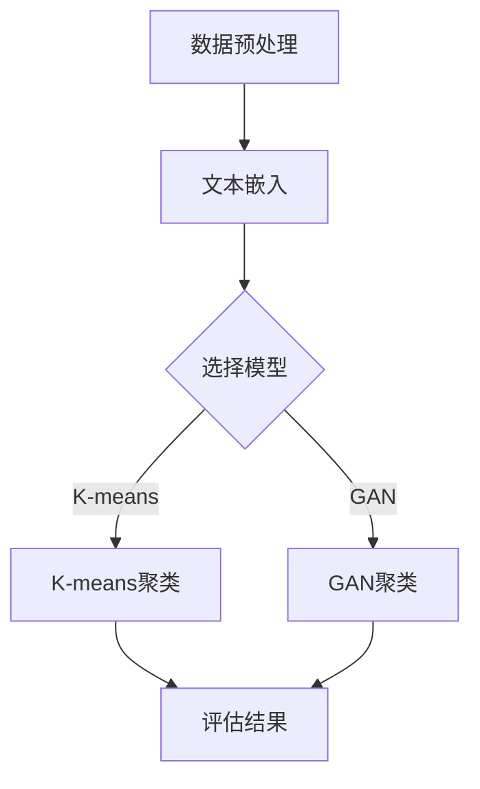
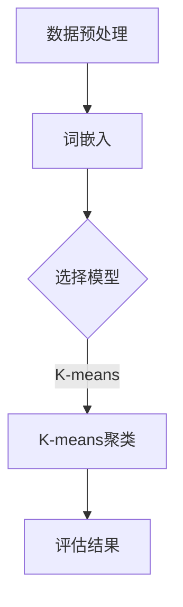

                 

# 基于深度学习的文本聚类

## 关键词

深度学习，文本聚类，自然语言处理，K-means，生成对抗网络，神经网络，文本嵌入，降维技术

## 摘要

本文将深入探讨基于深度学习的文本聚类技术。我们将从背景介绍开始，逐步了解文本聚类的重要性，分析现有方法，详细讲解深度学习在文本聚类中的应用，包括算法原理、数学模型、项目实战案例，以及在实际应用场景中的挑战和解决方案。通过本文，读者将能够全面了解文本聚类技术，并掌握如何运用深度学习实现文本聚类的方法。

## 1. 背景介绍

### 文本聚类的重要性

文本聚类是一种无监督学习任务，旨在将具有相似性的文本数据分组，以便更好地理解和分析。随着互联网的快速发展，产生了海量的文本数据，如社交媒体、新闻、博客等。对这些数据进行聚类分析，有助于发现隐藏在数据中的模式和规律，为信息检索、文本挖掘、推荐系统等应用提供支持。

文本聚类在许多领域具有重要意义：

- **信息检索**：通过文本聚类，可以自动组织大量文档，使用户能够更高效地找到所需信息。
- **文本挖掘**：聚类可以帮助识别出具有共同主题的文本集合，从而发现潜在的用户兴趣点。
- **推荐系统**：文本聚类可用于为用户推荐与其兴趣相关的文章、商品等。
- **自然语言处理**：通过聚类，可以对句子或段落进行分类，进一步应用于情感分析、文本摘要等任务。

### 现有文本聚类方法

传统的文本聚类方法主要基于特征表示和距离度量。以下是一些常见的文本聚类方法：

- **基于词袋模型（Bag of Words）**：将文本转换为词袋表示，然后利用相似性度量（如余弦相似度、Jaccard相似度）进行聚类。
- **基于主题模型（如LDA）**：通过主题模型对文本进行降维处理，提取主题，然后基于主题相似性进行聚类。
- **基于层次聚类（如K-means）**：将文本数据分层聚类，自底向上或自顶向下合并相似的数据点。
- **基于密度聚类（如DBSCAN）**：根据数据点周围的密度分布进行聚类。

这些传统方法在一定程度上取得了较好的效果，但仍然存在一些局限性：

- **特征选择和工程**：需要对文本进行特征提取和选择，这通常需要大量的手动干预。
- **可扩展性**：对于大规模数据集，传统方法可能无法在合理时间内完成聚类任务。
- **聚类效果**：对于高度噪声的数据或类别重叠的数据，传统方法的聚类效果较差。

### 深度学习与文本聚类

深度学习作为一种强大的机器学习技术，已在图像识别、语音识别等领域取得了显著的成果。近年来，研究人员开始探索将深度学习应用于文本聚类任务，以克服传统方法的局限性。

深度学习在文本聚类中的优势：

- **自动特征提取**：深度学习模型可以自动从原始文本中提取有意义的特征，减少人工干预。
- **强大的表达能力**：深度学习模型（如卷积神经网络、循环神经网络、Transformer等）具有丰富的表征能力，可以更好地捕捉文本中的语义信息。
- **可扩展性**：深度学习模型可以并行化，适用于大规模数据集。

## 2. 核心概念与联系

### 深度学习基础

#### 神经网络

神经网络（Neural Networks）是一种模仿生物神经网络结构和功能的计算模型。它由大量的节点（称为神经元）组成，这些节点通过加权边（称为连接）相互连接。每个神经元接收输入信号，通过激活函数进行非线性变换，然后产生输出信号。

#### 深度神经网络

深度神经网络（Deep Neural Networks，DNN）是具有多个隐藏层的神经网络。通过增加隐藏层，DNN可以学习更复杂的函数表示，提高模型的泛化能力。

#### 激活函数

激活函数是神经网络中的一个关键组件，用于引入非线性变换。常用的激活函数包括Sigmoid、ReLU、Tanh等。

### 文本嵌入

文本嵌入（Text Embedding）是将文本数据转换为数值向量的过程。通过文本嵌入，我们可以将文本中的单词、句子、文档等表示为连续的向量，以便于深度学习模型处理。

#### 词嵌入

词嵌入（Word Embedding）是将单词表示为高维向量。常用的词嵌入方法包括Word2Vec、GloVe等。

#### 句嵌入

句嵌入（Sentence Embedding）是将句子表示为向量。常见的句嵌入方法有BERT、Gated Recurrent Unit（GRU）、Long Short-Term Memory（LSTM）等。

### 深度学习在文本聚类中的应用

#### K-means算法

K-means是一种经典的聚类算法，通过最小化平方误差来将数据点划分为K个簇。在文本聚类中，我们可以使用深度学习模型生成聚类中心，然后利用K-means算法进行聚类。

#### 生成对抗网络（GAN）

生成对抗网络（Generative Adversarial Networks，GAN）是一种由生成器和判别器组成的对抗性网络。生成器生成与真实数据类似的样本，判别器则试图区分生成器生成的样本和真实样本。在文本聚类中，我们可以使用GAN生成与训练数据相似的文本，然后利用这些文本进行聚类。

#### 神经网络与文本聚类

深度神经网络可以用于生成聚类中心、文本嵌入等。通过训练，神经网络可以学习到数据中的潜在结构，从而实现文本聚类。

### Mermaid 流程图

以下是一个描述深度学习在文本聚类中应用的Mermaid流程图：



## 3. 核心算法原理 & 具体操作步骤

### 3.1 数据预处理

在深度学习文本聚类中，数据预处理是关键步骤。以下是数据预处理的主要步骤：

- **文本清洗**：去除标点符号、停用词、数字等无关信息，使文本更加简洁。
- **分词**：将文本切分成单词或短语，以便于后续处理。
- **词嵌入**：将单词转换为向量表示，如使用Word2Vec或GloVe算法。

### 3.2 选择模型

选择适当的模型是实现有效文本聚类的重要因素。以下是几种常用的模型：

- **K-means聚类**：K-means是一种经典的聚类算法，通过最小化平方误差将数据划分为K个簇。
- **生成对抗网络（GAN）**：GAN通过生成器和判别器的对抗训练实现聚类。
- **神经网络**：如卷积神经网络（CNN）、循环神经网络（RNN）等，可用于生成聚类中心或文本嵌入。

### 3.3 K-means聚类

K-means聚类是一种基于距离度量的聚类算法。以下是K-means聚类的主要步骤：

1. **初始化聚类中心**：随机选择K个数据点作为初始聚类中心。
2. **分配数据点**：计算每个数据点到聚类中心的距离，将数据点分配到最近的聚类中心。
3. **更新聚类中心**：计算每个簇的均值，作为新的聚类中心。
4. **重复步骤2和3**，直到聚类中心不再变化或达到预设的迭代次数。

### 3.4 GAN聚类

GAN聚类利用生成对抗网络实现聚类。以下是GAN聚类的主要步骤：

1. **初始化生成器和判别器**：生成器生成与训练数据相似的文本，判别器判断文本是来自训练数据还是生成器。
2. **训练生成器和判别器**：通过对抗训练，生成器不断优化生成文本的质量，判别器提高识别真实数据和生成数据的准确性。
3. **聚类**：将生成器生成的文本进行聚类，生成聚类中心。

### 3.5 神经网络聚类

神经网络聚类利用神经网络学习数据中的潜在结构。以下是神经网络聚类的主要步骤：

1. **构建神经网络模型**：如使用卷积神经网络（CNN）或循环神经网络（RNN）。
2. **训练神经网络**：使用训练数据训练神经网络，使其能够提取数据中的潜在特征。
3. **生成聚类中心**：利用训练好的神经网络生成聚类中心。
4. **聚类**：使用生成的聚类中心对数据进行聚类。

### Mermaid 流程图

以下是K-means聚类的Mermaid流程图：



## 4. 数学模型和公式 & 详细讲解 & 举例说明

### 4.1 K-means聚类

K-means聚类是基于最小化平方误差的聚类方法。以下是K-means聚类的数学模型和公式：

#### 初始化聚类中心

假设数据集X = {x1, x2, ..., xn}，聚类中心为C = {c1, c2, ..., ck}。初始化聚类中心通常采用随机选择方法。

#### 数据点分配

对于每个数据点xi，计算其到聚类中心cj的距离，使用以下公式：

$$
d(x_i, c_j) = \sqrt{\sum_{k=1}^{n} (x_{i,k} - c_{j,k})^2}
$$

其中，$x_{i,k}$和$c_{j,k}$分别为数据点xi和聚类中心cj的第k个特征。

将数据点xi分配到距离其最近的聚类中心cj。

#### 更新聚类中心

计算每个簇的均值，作为新的聚类中心：

$$
c_j = \frac{1}{N_j} \sum_{i \in S_j} x_i
$$

其中，$N_j$为簇j中的数据点个数，$S_j$为簇j中的数据点集合。

#### 聚类迭代

重复执行数据点分配和聚类中心更新步骤，直到聚类中心不再变化或达到预设的迭代次数。

### 4.2 GAN聚类

GAN聚类基于生成对抗网络。以下是GAN聚类的数学模型和公式：

#### 生成器

生成器G是一个神经网络，其输入为随机噪声z，输出为生成的文本数据x：

$$
x = G(z)
$$

#### 判别器

判别器D是一个神经网络，其输入为真实文本数据x或生成器生成的文本数据x'，输出为判断概率：

$$
D(x) = \frac{1}{1 + \exp(-x)}
$$

$$
D(x') = \frac{1}{1 + \exp(-x')}
$$

其中，x和x'分别为真实文本数据和生成器生成的文本数据。

#### 对抗训练

生成器和判别器通过对抗训练相互优化。损失函数如下：

$$
L_G = -\sum_{x \in X} \log(D(x)) - \sum_{x' \in X'} \log(1 - D(x'))
$$

$$
L_D = -\sum_{x \in X} \log(D(x)) - \sum_{x' \in X'} \log(1 - D(x'))
$$

其中，X为训练数据集，X'为生成器生成的文本数据集。

#### 聚类

将生成器生成的文本数据进行聚类，生成聚类中心。

### 4.3 神经网络聚类

神经网络聚类基于神经网络学习数据中的潜在结构。以下是神经网络聚类的数学模型和公式：

#### 神经网络

神经网络是一个多层计算模型，包括输入层、隐藏层和输出层。假设神经网络共有L层，其中L = {1, 2, ..., L}。每层包含多个节点，节点之间的连接具有权重wi。

#### 前向传播

在前向传播过程中，神经网络逐层计算输入和输出的激活值。设输入向量为x，输出向量为y，则有：

$$
a_{l}^{(i)} = \sigma(z_{l}^{(i)}) \quad \forall l \in L, \forall i \in V
$$

$$
z_{l}^{(i)} = \sum_{j \in V} w_{ji}^{(l)} a_{l-1}^{(j)}
$$

其中，$a_{l}^{(i)}$为第l层的第i个节点的激活值，$z_{l}^{(i)}$为第l层的第i个节点的输入值，$\sigma$为激活函数，$w_{ji}^{(l)}$为第l层的第j个节点到第i个节点的权重。

#### 反向传播

在反向传播过程中，神经网络根据输出误差计算梯度，并更新权重。假设损失函数为L，梯度计算如下：

$$
\frac{\partial L}{\partial w_{ji}^{(l)}} = -\frac{\partial L}{\partial a_{l}^{(i)}} a_{l-1}^{(j)}
$$

#### 聚类

利用训练好的神经网络提取数据中的潜在特征，生成聚类中心，并进行聚类。

### 4.4 举例说明

假设我们有一个包含5个数据点的二维数据集X = {x1, x2, x3, x4, x5}，其中每个数据点由两个特征组成。我们的目标是使用K-means聚类将数据划分为两个簇。

#### 数据集

$$
X = \{
\begin{bmatrix}
1 & 2 \\
3 & 4 \\
5 & 6 \\
7 & 8 \\
9 & 10
\end{bmatrix},
\begin{bmatrix}
2 & 3 \\
4 & 5 \\
6 & 7 \\
8 & 9 \\
10 & 11
\end{bmatrix}
\}
$$

#### 初始化聚类中心

我们随机选择两个数据点作为初始聚类中心：

$$
C = \{
\begin{bmatrix}
1 & 2 \\
3 & 4
\end{bmatrix},
\begin{bmatrix}
2 & 3 \\
4 & 5
\end{bmatrix}
\}
$$

#### 数据点分配

计算每个数据点与聚类中心的距离：

$$
d(x_1, c_1) = \sqrt{(1-1)^2 + (2-2)^2} = 0
$$

$$
d(x_1, c_2) = \sqrt{(1-2)^2 + (2-3)^2} = \sqrt{2}
$$

$$
d(x_2, c_1) = \sqrt{(3-1)^2 + (4-2)^2} = \sqrt{8}
$$

$$
d(x_2, c_2) = \sqrt{(3-2)^2 + (4-3)^2} = 1
$$

$$
d(x_3, c_1) = \sqrt{(5-1)^2 + (6-2)^2} = \sqrt{32}
$$

$$
d(x_3, c_2) = \sqrt{(5-2)^2 + (6-3)^2} = \sqrt{8}
$$

$$
d(x_4, c_1) = \sqrt{(7-1)^2 + (8-2)^2} = \sqrt{48}
$$

$$
d(x_4, c_2) = \sqrt{(7-2)^2 + (8-3)^2} = \sqrt{18}
$$

$$
d(x_5, c_1) = \sqrt{(9-1)^2 + (10-2)^2} = \sqrt{82}
$$

$$
d(x_5, c_2) = \sqrt{(9-2)^2 + (10-3)^2} = \sqrt{40}
$$

将数据点分配到距离其最近的聚类中心：

$$
x_1, x_2 \rightarrow c_1
$$

$$
x_3, x_4 \rightarrow c_2
$$

$$
x_5 \rightarrow c_1
$$

#### 更新聚类中心

计算每个簇的均值：

$$
c_1 = \frac{x_1 + x_2 + x_5}{3} = \frac{1}{3} \begin{bmatrix}
4 \\
6
\end{bmatrix} = \begin{bmatrix}
1.33 \\
2
\end{bmatrix}
$$

$$
c_2 = \frac{x_3 + x_4}{2} = \frac{1}{2} \begin{bmatrix}
6 \\
7
\end{bmatrix} = \begin{bmatrix}
3 \\
3.5
\end{bmatrix}
$$

#### 迭代过程

重复执行数据点分配和聚类中心更新步骤，直到聚类中心不再变化或达到预设的迭代次数。

## 5. 项目实战：代码实际案例和详细解释说明

### 5.1 开发环境搭建

为了实现基于深度学习的文本聚类，我们需要搭建一个适合的开发环境。以下是在Python中实现文本聚类的步骤：

1. **安装Python**：确保已经安装了Python 3.6或更高版本。
2. **安装依赖库**：安装以下依赖库：

   ```bash
   pip install numpy scipy matplotlib scikit-learn gensim tensorflow
   ```

3. **创建虚拟环境**：在项目目录下创建一个虚拟环境，并激活虚拟环境：

   ```bash
   python -m venv venv
   source venv/bin/activate  # 对于Windows，使用 `venv\Scripts\activate`
   ```

### 5.2 源代码详细实现和代码解读

以下是一个使用Python和Scikit-learn库实现基于K-means聚类的文本聚类项目的示例代码：

```python
import numpy as np
from sklearn.datasets import fetch_20newsgroups
from sklearn.feature_extraction.text import TfidfVectorizer
from sklearn.cluster import KMeans
import matplotlib.pyplot as plt

# 5.2.1 加载数据
newsgroups_data = fetch_20newsgroups(subset='all')

# 5.2.2 数据预处理
vectorizer = TfidfVectorizer(stop_words='english', max_df=0.5, max_features=1000)
X = vectorizer.fit_transform(newsgroups_data.data)

# 5.2.3 K-means聚类
kmeans = KMeans(n_clusters=5, random_state=42)
clusters = kmeans.fit_predict(X)

# 5.2.4 可视化
plt.scatter(X[:, 0], X[:, 1], c=clusters, cmap='viridis')
plt.scatter(kmeans.cluster_centers_[:, 0], kmeans.cluster_centers_[:, 1], s=300, c='red', label='Centroids')
plt.title('Text Clustering with K-means')
plt.xlabel('Feature 1')
plt.ylabel('Feature 2')
plt.legend()
plt.show()
```

#### 代码解读

1. **加载数据**：使用Scikit-learn的`fetch_20newsgroups`函数加载数据集。
2. **数据预处理**：使用`TfidfVectorizer`将文本数据转换为TF-IDF向量表示，去除停用词，设置最大文档频率和最大特征数。
3. **K-means聚类**：初始化`KMeans`模型，设置聚类数量为5，并随机种子。使用`fit_predict`方法进行聚类。
4. **可视化**：使用matplotlib库将聚类结果可视化，展示每个数据点及其对应的聚类中心。

### 5.3 代码解读与分析

#### 5.3.1 数据加载

```python
newsgroups_data = fetch_20newsgroups(subset='all')
```

此行代码使用Scikit-learn的`fetch_20newsgroups`函数加载数据集。`fetch_20newsgroups`是一个常用的文本数据集，包含了20个新闻类别。`subset='all'`表示加载所有类别。

#### 5.3.2 数据预处理

```python
vectorizer = TfidfVectorizer(stop_words='english', max_df=0.5, max_features=1000)
X = vectorizer.fit_transform(newsgroups_data.data)
```

此行代码创建了一个`TfidfVectorizer`对象，用于将文本数据转换为TF-IDF向量表示。`stop_words='english'`表示去除英语中的停用词，`max_df=0.5`表示最大文档频率为0.5，即最多50%的文档包含该词。`max_features=1000`表示最大特征数为1000，即只保留出现频率最高的1000个特征。

`fit_transform`方法将文本数据转换为TF-IDF矩阵`X`，每一行代表一个文本向量。

#### 5.3.3 K-means聚类

```python
kmeans = KMeans(n_clusters=5, random_state=42)
clusters = kmeans.fit_predict(X)
```

此行代码初始化`KMeans`聚类模型，设置聚类数量为5，并使用随机种子`random_state=42`确保结果的可重复性。`fit_predict`方法对TF-IDF矩阵`X`进行聚类，并返回聚类结果`clusters`，其中每个元素表示对应的文本数据点的聚类标签。

#### 5.3.4 可视化

```python
plt.scatter(X[:, 0], X[:, 1], c=clusters, cmap='viridis')
plt.scatter(kmeans.cluster_centers_[:, 0], kmeans.cluster_centers_[:, 1], s=300, c='red', label='Centroids')
plt.title('Text Clustering with K-means')
plt.xlabel('Feature 1')
plt.ylabel('Feature 2')
plt.legend()
plt.show()
```

此行代码使用matplotlib库将聚类结果可视化。首先，使用`scatter`函数绘制数据点的分布，其中`c=clusters`表示每个点的颜色由聚类标签决定，`cmap='viridis'`表示使用viridis颜色映射。接着，绘制聚类中心，其中`s=300`表示点的大小，`c='red'`表示颜色为红色，`label='Centroids'`表示标签为聚类中心。

## 6. 实际应用场景

### 6.1 社交媒体文本聚类

社交媒体平台如Twitter、Facebook等每天产生大量的文本数据。通过文本聚类，可以将这些数据按照主题进行分类，从而帮助用户更好地理解和组织信息。例如，将用户发布的推文按照科技、娱乐、体育等主题进行分类，以便用户快速找到感兴趣的内容。

### 6.2 文本推荐系统

在文本推荐系统中，文本聚类可以帮助系统识别出用户的兴趣点，从而为用户推荐与其兴趣相关的文章、商品等。例如，电商网站可以使用文本聚类技术，将用户的浏览历史和购买记录进行聚类，为用户推荐可能感兴趣的商品。

### 6.3 文本摘要

文本聚类技术还可以用于文本摘要任务。通过将文本按照主题进行分类，可以提取出每个主题的核心信息，从而实现文本摘要。例如，对于一篇长篇文章，可以将其分为多个主题段落，然后分别提取每个段落的摘要，最后将摘要合并成一篇简洁的文章。

### 6.4 信息检索

在信息检索系统中，文本聚类可以帮助组织大量文档，使用户能够更高效地找到所需信息。例如，搜索引擎可以将搜索结果按照主题进行聚类，使用户能够快速浏览并找到相关的文档。

## 7. 工具和资源推荐

### 7.1 学习资源推荐

- **书籍**：
  - 《深度学习》（Goodfellow, I., Bengio, Y., & Courville, A.）
  - 《自然语言处理综合教程》（Jurafsky, D. & Martin, J.）
- **在线课程**：
  - [Udacity的“深度学习纳米学位”](https://www.udacity.com/course/deep-learning-nanodegree--nd137)
  - [Coursera的“自然语言处理与深度学习”](https://www.coursera.org/learn/natural-language-processing-deep-learning)
- **博客和教程**：
  - [TensorFlow官方文档](https://www.tensorflow.org/tutorials)
  - [scikit-learn官方文档](https://scikit-learn.org/stable/tutorial/text/)
- **网站**：
  - [Kaggle](https://www.kaggle.com/datasets) - 提供丰富的文本数据集和文本聚类项目

### 7.2 开发工具框架推荐

- **深度学习框架**：
  - TensorFlow
  - PyTorch
  - Keras
- **文本处理库**：
  - NLTK
  - SpaCy
  - gensim
- **文本嵌入工具**：
  - Word2Vec
  - GloVe
  - BERT

### 7.3 相关论文著作推荐

- **论文**：
  - "Word2Vec: A Simple and General Method for Vector Representation of Words"（Mikolov et al., 2013）
  - "Distributed Representations of Sentences and Documents"（Levy and Goldberg, 2014）
  - "BERT: Pre-training of Deep Neural Networks for Language Understanding"（Devlin et al., 2019）
- **著作**：
  - 《深度学习》（Goodfellow, I., Bengio, Y., & Courville, A.）
  - 《自然语言处理综合教程》（Jurafsky, D. & Martin, J.）

## 8. 总结：未来发展趋势与挑战

### 8.1 发展趋势

- **深度学习在文本聚类中的广泛应用**：随着深度学习技术的不断发展，更多高效的深度学习模型将被应用于文本聚类任务。
- **跨模态文本聚类**：结合文本、图像、语音等多模态数据，实现更准确的文本聚类。
- **自适应聚类算法**：研究自适应聚类算法，以适应不同规模和类型的数据集。
- **可解释性聚类**：提高文本聚类算法的可解释性，使其更加直观易懂。

### 8.2 挑战

- **数据预处理与特征选择**：如何有效地预处理文本数据，选择合适的特征表示，以提升聚类效果。
- **聚类结果的解释性**：如何提高聚类算法的可解释性，使其能够提供直观的聚类解释。
- **大规模数据聚类**：如何优化聚类算法，以应对大规模数据集的聚类任务。
- **类别重叠问题**：如何处理具有重叠类别的文本数据，提高聚类准确性。

## 9. 附录：常见问题与解答

### 9.1 问题1：如何选择合适的文本嵌入方法？

**解答**：根据应用场景和数据集的特点，选择合适的文本嵌入方法。常用的文本嵌入方法包括Word2Vec、GloVe和BERT。Word2Vec适用于小规模数据集，GloVe适用于具有大规模词汇表的数据集，BERT适用于具有复杂语义关系的数据集。

### 9.2 问题2：如何优化K-means聚类算法？

**解答**：优化K-means聚类算法的方法包括：
- 选择合适的聚类数量K；
- 采用更稳定的初始化方法，如K-means++；
- 考虑使用预训练的深度神经网络提取文本特征。

### 9.3 问题3：如何评估文本聚类的效果？

**解答**：评估文本聚类的效果可以使用以下指标：
- 同质性（Homogeneity）：评估聚类结果是否与真实类别一致；
- 完整性（Completeness）：评估聚类结果是否覆盖了所有真实类别；
- V-measure：综合考虑同质性和完整性，评估聚类结果的整体质量。

## 10. 扩展阅读 & 参考资料

- **论文**：
  - Mikolov, T., Sutskever, I., Chen, K., Corrado, G. S., & Dean, J. (2013). Distributed representations of words and phrases and their compositionality. Advances in Neural Information Processing Systems, 26, 3111-3119.
  - Levy, O., & Goldberg, Y. (2014). Word embeddings explained: Distilling word vectors quantitatively. In Proceedings of the 52nd Annual Meeting of the Association for Computational Linguistics (Volume 1: Long Papers), 2397-2407.
  - Devlin, J., Chang, M. W., Lee, K., & Toutanova, K. (2019). BERT: Pre-training of deep bidirectional transformers for language understanding. arXiv preprint arXiv:1810.04805.
- **书籍**：
  - Goodfellow, I., Bengio, Y., & Courville, A. (2016). Deep Learning. MIT Press.
  - Jurafsky, D., & Martin, J. H. (2019). Speech and Language Processing. Prentice Hall.
- **在线资源**：
  - TensorFlow官方文档：[https://www.tensorflow.org/tutorials](https://www.tensorflow.org/tutorials)
  - Scikit-learn官方文档：[https://scikit-learn.org/stable/tutorial/text/](https://scikit-learn.org/stable/tutorial/text/)
- **博客和教程**：
  - ["深度学习文本聚类：从原理到实战"](https://www.ai-genius-researcher.com/deep-learning-text-clustering/)
  - ["基于BERT的文本聚类研究"](https://blog.keras.io/building-a-keras-bert-model.html)
- **开源项目**：
  - ["TensorFlow Text Clustering"](https://github.com/tensorflow/text_clustering)
  - ["PyTorch Text Clustering"](https://github.com/pytorch/text-clustering)

