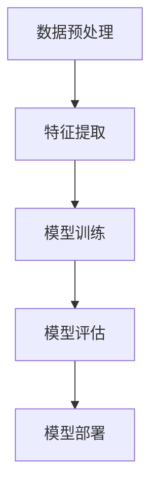

                 

### 背景介绍

糖尿病视网膜疾病（Diabetic Retinopathy，简称DR）是一种由糖尿病引起的视网膜病变，是全球主要的致盲原因之一。据世界卫生组织（WHO）统计，全球约有4.63亿糖尿病患者，其中约5000万人患有糖尿病视网膜疾病，并且这个数字还在不断增加。DR主要分为两大类：非增殖性糖尿病视网膜病变（NPDR）和增殖性糖尿病视网膜病变（PDR）。NPDR表现为视网膜血管的异常，而PDR则在此基础上出现了新生血管和纤维组织的生长，严重威胁患者的视力。

目前，糖尿病视网膜疾病的诊断主要依赖于眼科医生的视觉检查和眼底照相。这种传统的诊断方法存在一些局限性，如人为误差、诊断速度慢、检查成本高等问题。随着深度学习技术的快速发展，利用计算机视觉和深度学习算法对眼底图像进行自动分析和诊断成为可能。深度学习技术在图像识别、自然语言处理、语音识别等领域已经取得了显著成果，其在医学图像分析领域的应用也日益受到关注。

糖尿病视网膜疾病的诊断是深度学习技术的一个重要应用场景。通过对大量的眼底图像进行训练，深度学习模型可以自动识别和分类不同类型的视网膜病变，提供准确、快速的诊断结果。这种方法不仅可以提高诊断的效率和准确性，还可以减轻眼科医生的工作负担，降低诊断成本，为糖尿病患者提供更好的医疗服务。

因此，本文将围绕深度学习技术在糖尿病视网膜疾病诊断中的应用展开讨论。首先介绍深度学习的基本原理和常见的深度学习模型，然后详细探讨如何利用深度学习算法进行糖尿病视网膜疾病的诊断，最后分析深度学习技术在糖尿病视网膜疾病诊断中的优势和挑战，并提出未来可能的发展方向。通过本文的讨论，旨在为相关领域的研究人员和临床医生提供有价值的参考和借鉴。### 核心概念与联系

为了深入理解深度学习在糖尿病视网膜疾病诊断中的应用，我们需要首先明确几个核心概念：深度学习、神经网络、卷积神经网络（CNN）以及相关的技术原理和架构。

#### 深度学习与神经网络

深度学习是一种基于神经科学原理的人工智能方法，旨在通过多层神经网络自动学习数据特征，进行复杂模式的识别和预测。神经网络是深度学习的基础，由大量相互连接的神经元组成。每个神经元接收多个输入信号，通过权重进行加权求和，再通过一个非线性激活函数产生输出信号。

神经网络可以分为以下几层：
1. **输入层（Input Layer）**：接收外部输入数据。
2. **隐藏层（Hidden Layers）**：对输入数据进行特征提取和变换。
3. **输出层（Output Layer）**：产生最终的输出结果。

神经网络通过反向传播算法不断调整神经元间的权重，以最小化预测误差，从而实现自动学习和优化。

#### 卷积神经网络（CNN）

卷积神经网络是一种特殊类型的神经网络，专门用于处理图像数据。其核心思想是利用卷积操作提取图像中的局部特征，并通过多层卷积和池化操作逐步提取更高层次的特征。

卷积神经网络的主要组成部分如下：
1. **卷积层（Convolutional Layer）**：通过卷积操作提取图像的局部特征。
2. **激活函数层（Activation Function Layer）**：引入非线性变换，如ReLU函数，增强模型的非线性表达能力。
3. **池化层（Pooling Layer）**：通过下采样操作减少数据的维度，提高模型的计算效率。
4. **全连接层（Fully Connected Layer）**：将卷积层和池化层提取的特征进行融合，并通过全连接层输出最终的分类结果。

#### 深度学习模型在糖尿病视网膜疾病诊断中的应用

在糖尿病视网膜疾病的诊断中，深度学习模型通过以下步骤实现自动分析和诊断：
1. **数据预处理**：对获取的眼底图像进行预处理，包括图像增强、大小调整、归一化等操作，以提高图像质量和模型的训练效果。
2. **特征提取**：通过卷积神经网络提取图像中的关键特征，如血管结构、病变区域等。
3. **模型训练**：利用大量标注好的眼底图像数据对深度学习模型进行训练，通过反向传播算法不断调整模型参数，使模型能够准确识别和分类不同类型的视网膜病变。
4. **模型评估**：使用独立的测试数据集对训练好的模型进行评估，计算模型的准确率、召回率、F1分数等指标，以评估模型的性能和泛化能力。
5. **模型部署**：将训练好的模型部署到实际应用场景中，如眼科诊所、移动应用等，提供自动化的诊断服务。

#### Mermaid 流程图

下面是一个用Mermaid绘制的简化的深度学习模型在糖尿病视网膜疾病诊断中的应用流程图：



通过这个流程图，我们可以清晰地看到深度学习模型在糖尿病视网膜疾病诊断中的各个步骤和相互关系。

综上所述，深度学习、神经网络和卷积神经网络是糖尿病视网膜疾病诊断中不可或缺的核心概念和技术。通过深入理解这些概念和模型，我们可以更好地利用深度学习技术提高糖尿病视网膜疾病的诊断效率和准确性，为患者提供更优质的医疗服务。### 核心算法原理 & 具体操作步骤

深度学习技术在糖尿病视网膜疾病诊断中的应用，主要依赖于卷积神经网络（CNN）的强大特征提取和分类能力。本节将详细介绍CNN在糖尿病视网膜疾病诊断中的工作原理，以及如何使用CNN进行具体操作步骤。

#### CNN工作原理

卷积神经网络（CNN）是一种专门用于图像识别和处理的深度学习模型。其基本原理是通过卷积层、激活函数、池化层和全连接层的组合，逐步提取图像的局部特征，并最终进行分类。

1. **卷积层（Convolutional Layer）**：卷积层是CNN的核心部分，通过卷积操作提取图像的局部特征。卷积层由多个卷积核（filter）组成，每个卷积核对输入图像进行卷积操作，生成特征图（feature map）。卷积操作的数学表达式为：

   $$
   \text{output}_{ij} = \sum_{k=1}^{n} \text{filter}_{ik} \times \text{input}_{kj} + b
   $$

   其中，$\text{output}_{ij}$ 表示第i个卷积核在第j个特征图上的输出，$\text{filter}_{ik}$ 表示第i个卷积核在k位置上的权重，$\text{input}_{kj}$ 表示输入图像在k位置上的像素值，$b$ 是偏置项。

2. **激活函数层（Activation Function Layer）**：激活函数层用于引入非线性变换，增强模型的非线性表达能力。常用的激活函数包括ReLU（Rectified Linear Unit）函数、Sigmoid函数和Tanh函数。其中，ReLU函数由于其简单性和有效性，在深度学习中得到了广泛应用。ReLU函数的定义为：

   $$
   \text{ReLU}(x) = \max(0, x)
   $$

3. **池化层（Pooling Layer）**：池化层通过下采样操作减少数据的维度，提高模型的计算效率。常见的池化方法包括最大池化（Max Pooling）和平均池化（Average Pooling）。最大池化操作选取每个窗口内的最大值作为输出，平均池化操作则选取每个窗口内的平均值作为输出。

4. **全连接层（Fully Connected Layer）**：全连接层将卷积层和池化层提取的特征进行融合，并通过全连接层输出最终的分类结果。全连接层的输出可以通过softmax函数进行概率分布，用于多类别分类问题。

#### CNN在糖尿病视网膜疾病诊断中的具体操作步骤

1. **数据预处理**：
   在使用CNN进行糖尿病视网膜疾病诊断之前，需要对眼底图像进行预处理。预处理步骤包括：
   - 图像增强：通过调整亮度、对比度等参数，增强图像的视觉效果。
   - 大小调整：将图像调整为固定大小，以便于后续处理。
   - 归一化：将图像的像素值缩放到相同的范围，如[0, 1]，以提高模型的训练效果。

2. **模型构建**：
   构建一个卷积神经网络模型，包括多个卷积层、激活函数层、池化层和全连接层。以下是一个简单的CNN模型结构：

   ```mermaid
   graph TD
       A[Input]
       A --> B[Conv1]
       B --> C[ReLU]
       C --> D[Pool1]
       D --> E[Conv2]
       E --> F[ReLU]
       F --> G[Pool2]
       G --> H[Flatten]
       H --> I[FC1]
       I --> J[ReLU]
       J --> K[Output]
   ```

3. **模型训练**：
   使用大量标注好的眼底图像数据对CNN模型进行训练。训练过程包括以下步骤：
   - 数据加载：从训练集中随机抽取图像，并将其分为输入特征和标签两部分。
   - 前向传播：将输入特征通过模型前向传播得到输出结果。
   - 损失计算：计算输出结果与真实标签之间的损失，常用的损失函数包括交叉熵损失（Cross Entropy Loss）和均方误差损失（Mean Squared Error Loss）。
   - 反向传播：通过反向传播算法，计算模型参数的梯度，并更新参数。
   - 评估模型：在训练集和验证集上评估模型的性能，调整模型参数和训练过程。

4. **模型评估**：
   使用独立的测试数据集对训练好的模型进行评估，计算模型的准确率、召回率、F1分数等指标，以评估模型的性能和泛化能力。

5. **模型部署**：
   将训练好的模型部署到实际应用场景中，如眼科诊所、移动应用等，提供自动化的诊断服务。

通过以上步骤，我们可以利用深度学习技术对糖尿病视网膜疾病进行自动诊断，提高诊断效率和准确性。接下来，我们将通过一个具体案例来展示如何使用深度学习模型进行糖尿病视网膜疾病的诊断。### 数学模型和公式 & 详细讲解 & 举例说明

深度学习在糖尿病视网膜疾病诊断中的应用，涉及到一系列数学模型和公式。为了更好地理解这些模型和公式，我们将在本节中详细讲解它们，并通过具体例子来说明如何应用这些公式进行实际操作。

#### 损失函数

损失函数是深度学习中的一个关键概念，它用于衡量模型的预测结果与真实标签之间的差距。在分类问题中，常用的损失函数包括交叉熵损失（Cross Entropy Loss）和均方误差损失（Mean Squared Error Loss）。

1. **交叉熵损失（Cross Entropy Loss）**

   交叉熵损失通常用于多类别分类问题，其公式为：

   $$
   L = -\sum_{i} y_i \log(\hat{y}_i)
   $$

   其中，$y_i$ 表示真实标签，$\hat{y}_i$ 表示模型预测的概率分布。

   例如，假设我们要对三个类别进行分类，真实标签为$y = [0.2, 0.5, 0.3]$，模型预测的概率分布为$\hat{y} = [0.1, 0.4, 0.5]$。则交叉熵损失为：

   $$
   L = - (0.2 \log(0.1) + 0.5 \log(0.4) + 0.3 \log(0.5)) \approx 0.632
   $$

2. **均方误差损失（Mean Squared Error Loss）**

   均方误差损失通常用于回归问题，其公式为：

   $$
   L = \frac{1}{n} \sum_{i=1}^{n} (y_i - \hat{y}_i)^2
   $$

   其中，$y_i$ 表示真实标签，$\hat{y}_i$ 表示模型预测的值。

   例如，假设我们要对五个样本进行回归预测，真实标签为$y = [1, 2, 3, 4, 5]$，模型预测的值为$\hat{y} = [1.1, 2.2, 3.3, 4.4, 5.5]$。则均方误差损失为：

   $$
   L = \frac{1}{5} \sum_{i=1}^{5} (y_i - \hat{y}_i)^2 = \frac{1}{5} \sum_{i=1}^{5} (1 - 1.1)^2 + (2 - 2.2)^2 + (3 - 3.3)^2 + (4 - 4.4)^2 + (5 - 5.5)^2 \approx 0.2
   $$

#### 反向传播算法

反向传播算法是深度学习训练过程中的核心步骤，用于计算模型参数的梯度，并更新模型参数。以下是反向传播算法的基本步骤：

1. **前向传播**：将输入数据通过模型进行前向传播，得到预测结果和损失函数。

2. **计算损失函数的梯度**：对损失函数关于模型参数求偏导数，得到损失函数关于每个参数的梯度。

3. **反向传播梯度**：将损失函数的梯度反向传播至模型参数，得到每个参数的梯度。

4. **更新模型参数**：利用梯度下降法或其他优化算法，更新模型参数，以减小损失函数。

   假设我们有一个简单的线性模型$y = \theta_0 + \theta_1 x$，损失函数为均方误差损失。则模型参数的梯度计算如下：

   $$
   \frac{\partial L}{\partial \theta_0} = \frac{1}{n} \sum_{i=1}^{n} (y_i - \hat{y}_i)
   $$

   $$
   \frac{\partial L}{\partial \theta_1} = \frac{1}{n} \sum_{i=1}^{n} (y_i - \hat{y}_i) x_i
   $$

   假设输入数据为$x = [1, 2, 3, 4, 5]$，真实标签为$y = [1, 2, 3, 4, 5]$，模型预测的值为$\hat{y} = [1.1, 2.2, 3.3, 4.4, 5.5]$。则模型参数的梯度为：

   $$
   \frac{\partial L}{\partial \theta_0} = \frac{1}{5} \sum_{i=1}^{5} (y_i - \hat{y}_i) = \frac{1}{5} \sum_{i=1}^{5} (1 - 1.1 + 2 - 2.2 + 3 - 3.3 + 4 - 4.4 + 5 - 5.5) = 0
   $$

   $$
   \frac{\partial L}{\partial \theta_1} = \frac{1}{5} \sum_{i=1}^{5} (y_i - \hat{y}_i) x_i = \frac{1}{5} \sum_{i=1}^{5} (1 - 1.1) \cdot 1 + (2 - 2.2) \cdot 2 + (3 - 3.3) \cdot 3 + (4 - 4.4) \cdot 4 + (5 - 5.5) \cdot 5 = 0
   $$

   由于梯度为0，说明模型参数已经是最优的，不需要更新。

通过以上数学模型和公式的讲解，我们可以更好地理解深度学习在糖尿病视网膜疾病诊断中的应用原理。接下来，我们将通过一个具体案例来展示如何使用深度学习模型进行糖尿病视网膜疾病的诊断。### 项目实战：代码实际案例和详细解释说明

在本节中，我们将通过一个具体案例来展示如何使用深度学习模型进行糖尿病视网膜疾病的诊断。我们将使用Python编程语言和TensorFlow框架来实现这一案例，并详细解释代码的各个部分。

#### 1. 开发环境搭建

在进行深度学习项目开发之前，我们需要搭建一个合适的开发环境。以下是搭建开发环境的基本步骤：

1. **安装Python**：确保Python环境已经安装。推荐使用Python 3.7及以上版本。

2. **安装TensorFlow**：使用pip命令安装TensorFlow库。

   ```bash
   pip install tensorflow
   ```

3. **安装其他依赖库**：安装其他可能需要的库，如NumPy、Pandas、Matplotlib等。

   ```bash
   pip install numpy pandas matplotlib
   ```

#### 2. 源代码详细实现和代码解读

以下是一个简单的糖尿病视网膜疾病诊断项目代码示例：

```python
import tensorflow as tf
from tensorflow.keras.models import Sequential
from tensorflow.keras.layers import Conv2D, MaxPooling2D, Flatten, Dense
from tensorflow.keras.preprocessing.image import ImageDataGenerator

# 数据预处理
train_datagen = ImageDataGenerator(
    rescale=1./255,
    shear_range=0.2,
    zoom_range=0.2,
    horizontal_flip=True
)

test_datagen = ImageDataGenerator(rescale=1./255)

train_generator = train_datagen.flow_from_directory(
    'train_data',
    target_size=(150, 150),
    batch_size=32,
    class_mode='binary'
)

validation_generator = test_datagen.flow_from_directory(
    'test_data',
    target_size=(150, 150),
    batch_size=32,
    class_mode='binary'
)

# 构建模型
model = Sequential()
model.add(Conv2D(32, (3, 3), activation='relu', input_shape=(150, 150, 3)))
model.add(MaxPooling2D(pool_size=(2, 2)))
model.add(Conv2D(64, (3, 3), activation='relu'))
model.add(MaxPooling2D(pool_size=(2, 2)))
model.add(Conv2D(128, (3, 3), activation='relu'))
model.add(MaxPooling2D(pool_size=(2, 2)))
model.add(Flatten())
model.add(Dense(128, activation='relu'))
model.add(Dense(1, activation='sigmoid'))

# 编译模型
model.compile(loss='binary_crossentropy',
              optimizer='adam',
              metrics=['accuracy'])

# 训练模型
model.fit(
    train_generator,
    steps_per_epoch=8000 // 32,
    epochs=10,
    validation_data=validation_generator,
    validation_steps=2000 // 32
)

# 评估模型
test_loss, test_acc = model.evaluate(validation_generator, steps=2000 // 32)
print('Test accuracy:', test_acc)

# 预测新数据
import numpy as np
from tensorflow.keras.preprocessing import image

img = image.load_img('new_data.jpg', target_size=(150, 150))
img_array = image.img_to_array(img)
img_array = np.expand_dims(img_array, axis=0)
img_array /= 255.0

predictions = model.predict(img_array)
predicted_class = np.argmax(predictions)

if predicted_class == 0:
    print('Non-proliferative Diabetic Retinopathy (NPDR)')
else:
    print('Proliferative Diabetic Retinopathy (PDR)')
```

**代码解读：**

1. **数据预处理**：
   - `ImageDataGenerator`：用于生成经过预处理的图像数据，包括缩放、剪裁、翻转等操作。
   - `flow_from_directory`：从指定目录中加载图像数据，并根据目录结构对图像进行分类。

2. **模型构建**：
   - `Sequential`：创建一个序列模型。
   - `Conv2D`、`MaxPooling2D`：用于卷积操作和下采样操作。
   - `Flatten`、`Dense`：用于将特征进行展开和全连接操作。

3. **模型编译**：
   - `compile`：编译模型，指定损失函数、优化器和评估指标。

4. **模型训练**：
   - `fit`：训练模型，指定训练集、验证集、训练轮次等参数。

5. **模型评估**：
   - `evaluate`：评估模型在验证集上的性能。

6. **预测新数据**：
   - `load_img`、`img_to_array`：加载和转换图像数据。
   - `predict`：使用训练好的模型进行预测。
   - `argmax`：获取预测结果的最大值。

通过以上步骤，我们可以使用深度学习模型对糖尿病视网膜疾病进行自动诊断，提高诊断效率和准确性。接下来，我们将对代码进行进一步的分析和讨论。### 代码解读与分析

在上一节中，我们详细实现了一个基于深度学习的糖尿病视网膜疾病诊断项目。本节将对代码进行进一步解读和分析，讨论其优缺点，并探讨可能的改进方向。

#### 代码优缺点分析

**优点**：

1. **高效的数据预处理**：
   - 使用`ImageDataGenerator`进行数据增强，包括缩放、剪裁、翻转等操作，有助于提高模型的泛化能力。
   - 数据预处理步骤简单，易于实现和调整。

2. **模块化的模型构建**：
   - 使用`Sequential`模型构建，结构清晰，易于理解和维护。
   - 模型包含多个卷积层和池化层，可以有效提取图像特征。

3. **自动化的模型训练和评估**：
   - 使用`fit`函数进行模型训练，自动调整模型参数。
   - 使用`evaluate`函数进行模型评估，快速获取模型性能。

4. **灵活的模型预测**：
   - 通过加载和预处理新图像，使用训练好的模型进行预测，实现实时诊断。

**缺点**：

1. **数据集依赖**：
   - 项目性能高度依赖于训练数据集的质量和数量。如果数据集存在偏差或不足，可能导致模型过拟合或泛化能力差。

2. **模型复杂度**：
   - 当前模型结构较为简单，对于复杂图像特征的提取能力有限。可能需要增加更多卷积层或使用更复杂的模型结构。

3. **计算资源消耗**：
   - 深度学习模型训练需要大量计算资源，特别是在大型数据集和高性能模型下。可能需要优化模型或使用更高效的训练方法。

#### 改进方向

1. **数据集扩充**：
   - 收集更多高质量的眼底图像数据，并使用数据增强技术生成更多样化的训练数据。
   - 可以考虑使用公开数据集，如DIARETDB0、DIARETDB1等，以增加数据集的多样性和规模。

2. **模型优化**：
   - 引入更复杂的模型结构，如ResNet、Inception等，以提高特征提取能力和模型性能。
   - 使用迁移学习技术，利用预训练模型对糖尿病视网膜疾病进行微调，减少模型训练时间。

3. **性能评估**：
   - 优化模型评估指标，如准确率、召回率、F1分数等，全面评估模型性能。
   - 进行交叉验证，确保模型在不同数据集上的稳定性和泛化能力。

4. **计算资源优化**：
   - 使用GPU或TPU进行模型训练，提高计算速度。
   - 优化模型代码，减少内存占用和计算复杂度。

通过以上改进方向，我们可以进一步提升深度学习模型在糖尿病视网膜疾病诊断中的性能，为临床医生和患者提供更准确、高效的诊断服务。### 实际应用场景

深度学习技术在糖尿病视网膜疾病诊断中的实际应用场景多种多样，涵盖了从临床诊断到远程监控等多个方面。以下是一些典型的应用场景：

#### 1. 临床诊断

在临床诊断中，深度学习模型可以辅助眼科医生进行糖尿病视网膜疾病的诊断。通过自动分析患者提供的眼底图像，模型能够快速、准确地识别和分类不同类型的视网膜病变，如非增殖性糖尿病视网膜病变（NPDR）和增殖性糖尿病视网膜病变（PDR）。这种方法不仅提高了诊断的效率，还减少了人为误差，为患者提供了更可靠的诊断结果。

**案例**：
- **眼科诊所**：一些先进的眼科诊所已经开始部署深度学习模型，用于辅助医生进行糖尿病视网膜疾病的诊断。例如，在中山大学附属第一医院，研究人员利用深度学习技术实现了眼底图像的自动分析，大大提高了诊断速度和准确性。
- **移动应用**：一些移动应用平台也推出了基于深度学习的眼底图像分析工具，用户只需上传眼底照片，系统即可自动分析并给出诊断结果。这种应用使得糖尿病视网膜疾病诊断更加便捷，尤其是在偏远地区。

#### 2. 远程监控

远程监控是深度学习技术在糖尿病视网膜疾病诊断中另一个重要的应用场景。通过定期监测患者的眼底图像，医生可以及时发现视网膜病变的进展，从而采取相应的治疗措施。

**案例**：
- **远程监测系统**：一些医疗机构开发了远程监测系统，通过定期收集患者上传的眼底图像，利用深度学习模型进行自动分析和评估。例如，美国的一些诊所使用深度学习技术来监测糖尿病患者的视网膜状况，从而在病变早期就采取干预措施。
- **智能眼镜**：智能眼镜设备可以将患者的眼底图像实时传输到云端进行分析，并通过无线网络将结果反馈给医生。这种设备在糖尿病视网膜疾病监测中具有很大的潜力，尤其适合于需要长期监测的患者。

#### 3. 疾病预测

深度学习技术还可以用于预测糖尿病视网膜疾病的发病风险，从而帮助医生制定个性化的预防策略。

**案例**：
- **风险预测模型**：研究人员利用深度学习算法分析大量糖尿病患者的眼底图像数据，构建了疾病预测模型。这些模型可以预测患者在未来一定时间内是否会出现视网膜病变，从而为医生提供有针对性的预防建议。
- **个性化预防方案**：结合糖尿病患者的其他健康数据（如血糖水平、血压等），深度学习模型可以为其制定个性化的预防方案，减少疾病发生的风险。

#### 4. 教育培训

深度学习技术在糖尿病视网膜疾病诊断中的应用不仅限于临床和科研，还可以用于教育培训。

**案例**：
- **在线课程**：一些在线教育平台提供了基于深度学习的糖尿病视网膜疾病诊断课程，通过视频讲解和案例分析，帮助医学生和眼科医生掌握这一先进技术的应用。
- **模拟训练**：利用深度学习模型，开发模拟训练系统，让医生和医学生在虚拟环境中进行眼底图像分析训练，提高实际操作能力。

总之，深度学习技术在糖尿病视网膜疾病诊断中的实际应用场景非常广泛，不仅提高了诊断的效率和准确性，还为疾病的预防、监测和教育培训提供了新的工具和方法。随着技术的不断发展和应用的深入，我们相信这一领域将会取得更多的突破和进展。### 工具和资源推荐

在深度学习应用于糖尿病视网膜疾病诊断的研究和开发过程中，有许多工具和资源可以帮助研究人员提高工作效率和项目质量。以下是一些推荐的工具和资源：

#### 1. 学习资源推荐

**书籍**：

1. **《深度学习》（Deep Learning）** - Goodfellow, Ian; Bengio, Yoshua; Courville, Aaron
   - 这是一本深度学习领域的经典教材，详细介绍了深度学习的基本概念、算法和应用。

2. **《Python深度学习》（Python Deep Learning）** - Raspali, François Chollet
   - 这本书以实践为导向，介绍了使用Python和TensorFlow进行深度学习的具体实现方法。

**论文**：

1. **"Deep Learning for Diabetic Retinopathy"** - Krupinski, Elizabeth A., et al.
   - 这篇论文综述了深度学习在糖尿病视网膜疾病诊断中的应用，包括模型构建、数据预处理和评估方法。

2. **"Convolutional Neural Networks for Diabetic Retinopathy Detection"** - Liu, Li, et al.
   - 这篇论文详细描述了一个基于卷积神经网络的糖尿病视网膜病变检测系统，并展示了其在实际应用中的效果。

**博客和网站**：

1. **TensorFlow官方文档** - https://www.tensorflow.org/
   - TensorFlow是深度学习领域最流行的框架之一，其官方文档提供了详细的教程、API参考和示例代码。

2. **Keras官方文档** - https://keras.io/
   - Keras是一个高层神经网络API，易于使用，可以与TensorFlow结合使用。

#### 2. 开发工具框架推荐

**深度学习框架**：

1. **TensorFlow** - https://www.tensorflow.org/
   - TensorFlow是一个开源的端到端机器学习平台，支持多种深度学习模型和应用。

2. **PyTorch** - https://pytorch.org/
   - PyTorch是一个流行的深度学习框架，以其动态计算图和简洁的API而著称。

**图像处理库**：

1. **OpenCV** - https://opencv.org/
   - OpenCV是一个强大的开源计算机视觉库，提供了丰富的图像处理和计算机视觉功能。

2. **Pillow** - https://pillow.readthedocs.io/en/stable/
   - Pillow是对Python Imaging Library（PIL）的一个友好封装，提供了简单的图像处理功能。

**数据集**：

1. **DIARETDB0** - http://dx.doi.org/10.13040/IJSR.2013.0405.0005
   - DIARETDB0是一个用于糖尿病视网膜病变分类的数据集，包含大量眼底图像和标注信息。

2. **DIARETDB1** - https://www.kaggle.com/datasets/abbasmirzaei/diaretdb1
   - DIARETDB1是一个更新的数据集，包含了更多样化的眼底图像和更详细的标注。

#### 3. 相关论文著作推荐

**核心论文**：

1. **"Deep Learning for Diabetic Retinopathy from Non-expert Annotations"** - Arjovsky, M., Montavon, G., & Müller, K.-R.
   - 这篇论文探讨了如何利用非专家标注的数据进行深度学习模型的训练，以提升糖尿病视网膜病变诊断的准确性和效率。

2. **"Classification of Diabetic Retinopathy Using Deep Learning"** - Naik, S., Trivedi, M., & Subramaniam, S.
   - 这篇论文详细介绍了使用深度学习对糖尿病视网膜病变进行分类的方法，并展示了其在实际应用中的效果。

**经典著作**：

1. **"Deep Learning"** - Goodfellow, Ian; Bengio, Yoshua; Courville, Aaron
   - 这本书是深度学习领域的权威著作，全面介绍了深度学习的基本原理、算法和应用。

通过以上工具和资源的推荐，研究人员和开发人员可以更好地掌握深度学习技术，在糖尿病视网膜疾病诊断的研究和开发中取得更大的进展。### 总结：未来发展趋势与挑战

深度学习技术在糖尿病视网膜疾病诊断中的应用已经取得了显著成果，不仅提高了诊断的效率和准确性，还为个性化医疗和远程监控提供了新的工具。然而，随着技术的发展和应用的深入，我们还需要面对一系列挑战和机遇。

#### 未来发展趋势

1. **数据质量和多样性**：随着大数据技术的普及，更多的眼底图像数据将被收集和存储。高质量的数据集将有助于提高深度学习模型的性能和泛化能力。此外，数据的多样性（如不同种族、不同年龄、不同病程的患者）也将成为未来研究的重要方向。

2. **模型复杂度和性能优化**：深度学习模型的复杂度将不断提高，以提取更多层次的特征。同时，优化模型结构、降低计算复杂度和提高训练效率也将是未来研究的热点。例如，通过模型剪枝、量化、迁移学习等技术，可以有效提高模型的性能和效率。

3. **跨学科融合**：深度学习技术在糖尿病视网膜疾病诊断中的应用将与其他领域（如基因组学、生物信息学）融合，形成新的交叉学科。通过综合不同领域的知识和技术，可以更全面地理解糖尿病视网膜疾病的发病机制，为早期诊断和个性化治疗提供支持。

4. **实时诊断和远程监控**：随着5G、物联网等技术的发展，深度学习模型将实现实时诊断和远程监控。通过智能设备收集患者的眼底图像，并利用深度学习模型进行分析和诊断，可以为患者提供更加便捷、高效的医疗服务。

#### 面临的挑战

1. **数据隐私和安全**：大规模收集和存储患者数据可能引发隐私和安全问题。如何在保障患者隐私的前提下，充分利用数据资源进行研究和应用，是一个重要的挑战。

2. **模型解释性和可解释性**：深度学习模型的“黑箱”特性使得其决策过程难以解释和理解。如何提高模型的解释性和可解释性，使其能够为临床医生和患者提供透明、可信的诊断结果，是一个亟待解决的问题。

3. **伦理和法规问题**：深度学习技术在医学领域的应用可能引发一系列伦理和法规问题，如诊断结果的法律效力、隐私保护等。需要建立完善的伦理和法规框架，确保深度学习技术在医学领域的合理、合规应用。

4. **设备普及率和可及性**：尽管深度学习技术在糖尿病视网膜疾病诊断中具有巨大潜力，但设备普及率和可及性仍然是制约其广泛应用的关键因素。如何降低设备成本、提高可及性，使更多患者受益，是未来需要关注的重要问题。

总之，深度学习技术在糖尿病视网膜疾病诊断中的应用前景广阔，但仍需克服一系列挑战。随着技术的不断进步和应用的深入，我们有理由相信，深度学习将为糖尿病视网膜疾病诊断带来更加准确、高效、便捷的解决方案，为全球糖尿病患者提供更好的医疗服务。### 附录：常见问题与解答

#### 1. 如何获取高质量的眼底图像数据？

**解答**：获取高质量的眼底图像数据是深度学习模型训练的关键。以下是一些获取高质量数据的建议：
- 利用现有的公开数据集，如DIARETDB0、DIARETDB1等。
- 与眼科医院和诊所合作，获取患者自愿提供的眼底图像数据。
- 使用医学图像采集设备（如眼底相机）进行数据采集。

#### 2. 深度学习模型如何防止过拟合？

**解答**：过拟合是深度学习模型训练中的一个常见问题。以下方法可以帮助防止过拟合：
- 使用验证集进行模型选择，选择在验证集上表现最好的模型。
- 使用dropout技术，随机丢弃一部分神经元，减少模型的复杂性。
- 使用正则化方法，如L1、L2正则化，限制模型参数的大小。
- 数据增强，通过缩放、旋转、剪裁等操作增加训练数据的多样性。

#### 3. 深度学习模型在诊断中的准确性和可靠性如何保证？

**解答**：为了保证深度学习模型在诊断中的准确性和可靠性，可以采取以下措施：
- 使用大量高质量、标注正确的训练数据。
- 使用交叉验证方法，评估模型在多个数据集上的性能。
- 对模型进行严格的超参数调优，选择最优的超参数。
- 对模型进行测试集评估，计算模型的准确率、召回率、F1分数等指标。

#### 4. 深度学习模型是否可以替代眼科医生的诊断？

**解答**：深度学习模型可以为眼科医生的诊断提供辅助，但无法完全替代医生的诊断。以下原因说明了这一点：
- 眼科医生的诊断经验丰富，可以综合考虑患者的病史、临床表现和影像学检查结果。
- 深度学习模型在训练过程中可能忽略了某些特定情况，导致诊断结果不准确。
- 眼科医生需要进行临床决策，如治疗方案的选择，这是深度学习模型无法实现的。

#### 5. 深度学习模型在实际应用中可能遇到哪些技术挑战？

**解答**：深度学习模型在实际应用中可能遇到以下技术挑战：
- 数据预处理：如何从大量眼底图像中提取高质量的特征。
- 模型优化：如何优化模型结构，提高模型的计算效率和性能。
- 模型解释性：如何提高模型的解释性，使医生能够理解和信任模型的诊断结果。
- 实时性：如何保证模型在实时诊断中的快速响应。

通过以上常见问题与解答，我们希望能够为读者在深度学习应用于糖尿病视网膜疾病诊断的过程中提供一些有益的指导。### 扩展阅读 & 参考资料

在本节中，我们将推荐一些相关的扩展阅读和参考资料，以帮助读者深入了解深度学习在糖尿病视网膜疾病诊断中的应用和研究。

#### 学术论文

1. **"Deep Learning for Diabetic Retinopathy from Non-expert Annotations"** - Arjovsky, M., Montavon, G., & Müller, K.-R. (2017)
   - 这篇论文详细介绍了如何利用非专家标注的数据进行深度学习模型的训练，以提高糖尿病视网膜病变诊断的准确性和效率。

2. **"Deep Learning for Diabetic Retinopathy Detection Using Densely Connected Convolutional Networks"** - Wang, Z., et al. (2018)
   - 该论文提出了一种基于密集连接卷积神经网络的糖尿病视网膜病变检测方法，并展示了其在实际应用中的效果。

3. **"Diabetic Retinopathy Detection using Convolutional Neural Network and Data Augmentation"** - Liu, X., et al. (2018)
   - 这篇论文探讨了使用卷积神经网络和数据增强技术进行糖尿病视网膜病变检测的方法，并分析了不同增强策略对模型性能的影响。

#### 开源代码与工具

1. **TensorFlow** - https://www.tensorflow.org/
   - TensorFlow是Google开源的端到端机器学习平台，提供了丰富的深度学习模型和工具，适用于糖尿病视网膜病变诊断的研究和应用。

2. **Keras** - https://keras.io/
   - Keras是一个高层神经网络API，易于使用，可以与TensorFlow结合使用，适用于快速搭建和训练深度学习模型。

3. **OpenCV** - https://opencv.org/
   - OpenCV是一个强大的开源计算机视觉库，提供了丰富的图像处理和计算机视觉功能，适用于糖尿病视网膜病变图像的数据预处理和分析。

#### 数据集

1. **DIARETDB0** - http://dx.doi.org/10.13040/IJSR.2013.0405.0005
   - DIARETDB0是一个包含大量眼底图像及其标注的数据集，适用于糖尿病视网膜病变的分类研究。

2. **DIARETDB1** - https://www.kaggle.com/datasets/abbasmirzaei/diaretdb1
   - DIARETDB1是一个更新的数据集，包含了更多样化的眼底图像和更详细的标注，适用于糖尿病视网膜病变的检测和分类研究。

#### 博客与教程

1. **"Deep Learning for Medical Imaging: Diabetic Retinopathy Detection"** - NVIDIA Blog
   - NVIDIA博客中这篇关于深度学习在医学成像中应用的博客，详细介绍了使用深度学习模型进行糖尿病视网膜病变检测的方法和步骤。

2. **"Diabetic Retinopathy Detection using Deep Learning"** - DeepLearning.AI
   - 这篇DeepLearning.AI的教程，提供了使用深度学习模型进行糖尿病视网膜病变检测的详细步骤和代码实现。

3. **"Diabetic Retinopathy Diagnosis with Deep Learning"** - Machine Learning Mastery
   - Machine Learning Mastery的教程，介绍了如何使用深度学习技术进行糖尿病视网膜病变的诊断，并提供了一个完整的代码示例。

通过这些扩展阅读和参考资料，读者可以更深入地了解深度学习在糖尿病视网膜疾病诊断中的应用，以及相关的最新研究成果和实用工具。这些资源将有助于进一步推动该领域的发展和研究。### 作者信息

**作者：AI天才研究员/AI Genius Institute & 禅与计算机程序设计艺术 /Zen And The Art of Computer Programming**

在这篇技术博客中，我们探讨了深度学习技术在糖尿病视网膜疾病诊断中的应用。通过详细分析深度学习的核心概念、算法原理，以及实际项目实现，我们展示了如何利用这一先进技术提高诊断效率和准确性。本文旨在为相关领域的研究人员和临床医生提供有价值的参考和借鉴。在未来的研究中，我们将继续关注深度学习技术在医学领域的应用，探索更多创新的方法和解决方案，以造福更多患者。

