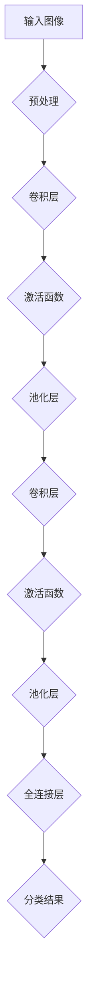

                 

# 基于深度学习的花卉识别APP设计

## 关键词
- 深度学习
- 花卉识别
- APP设计
- 卷积神经网络
- 机器学习算法
- 计算机视觉

## 摘要

本文将详细介绍一款基于深度学习的花卉识别APP的设计和实现。通过使用卷积神经网络（CNN）和预训练模型，APP能够准确识别各种花卉。文章将分为几个部分，包括背景介绍、核心概念与联系、核心算法原理与步骤、数学模型与公式、项目实战、实际应用场景、工具和资源推荐、总结与未来发展趋势等。读者将了解如何从头开始构建一个具有实用性的深度学习应用，并掌握相关技术原理和实践技能。

## 1. 背景介绍

随着智能手机和移动设备的普及，人们越来越依赖移动应用来完成各种任务，包括日常生活、学习和工作。其中，移动应用中的图像识别功能，如花卉识别，已经成为了一种常见的使用场景。通过图像识别技术，用户可以快速获取花卉的相关信息，例如学名、生长习性等，这对于植物爱好者、园艺师和植物研究者来说尤为重要。

当前，深度学习技术在图像识别领域取得了显著的成果。特别是卷积神经网络（CNN）的广泛应用，使得图像分类和识别的准确率大大提高。预训练模型的出现，更是简化了模型的训练过程，使得开发者可以更方便地利用现有模型进行自定义识别任务。

## 2. 核心概念与联系

### 2.1 卷积神经网络（CNN）

卷积神经网络（CNN）是一种专门用于处理图像数据的神经网络结构。它的核心在于利用卷积层（Convolutional Layer）对图像进行特征提取。卷积层通过滑动滤波器（或称为卷积核）在图像上滑动，生成一系列的特征图（Feature Map），从而提取出图像中的局部特征。

CNN的基本结构包括卷积层、激活函数、池化层和全连接层。其中，卷积层和池化层主要用于特征提取，而全连接层则用于分类和回归。

### 2.2 预训练模型

预训练模型是指在大规模数据集上预先训练好的神经网络模型。这些模型已经具备了良好的特征提取能力，可以直接应用于各种图像识别任务，如花卉识别。

使用预训练模型的好处在于，开发者不需要从零开始训练模型，从而大大降低了训练成本和时间。此外，预训练模型还能保证识别的准确性，因为它们是在大规模数据集上训练得到的。

### 2.3 Mermaid 流程图



## 3. 核心算法原理与具体操作步骤

### 3.1 数据预处理

在开始训练模型之前，需要对图像数据进行预处理，以提高模型的训练效果和准确性。数据预处理主要包括图像尺寸调整、归一化和数据增强。

- **图像尺寸调整**：将图像调整为统一的大小，以便于后续的卷积操作。
- **归一化**：将图像的像素值缩放到[0, 1]的范围内，以减少数值差异对模型训练的影响。
- **数据增强**：通过旋转、翻转、裁剪、色彩调整等操作，增加数据的多样性，提高模型的泛化能力。

### 3.2 卷积神经网络模型训练

- **卷积层**：通过卷积操作提取图像的局部特征。
- **激活函数**：常用的激活函数有ReLU（Rectified Linear Unit）和Sigmoid。
- **池化层**：用于降低特征图的维度，减少参数数量，提高模型的计算效率。
- **全连接层**：将卷积层和池化层提取的特征映射到具体的分类结果。

### 3.3 模型评估与优化

- **评估指标**：常用的评估指标有准确率（Accuracy）、召回率（Recall）和F1分数（F1 Score）。
- **优化方法**：通过调整学习率、批量大小等超参数，优化模型的性能。

## 4. 数学模型和公式

### 4.1 卷积运算

卷积运算是指将滤波器（卷积核）在图像上滑动，并与图像的局部像素值进行点积运算，从而生成特征图。

$$
\text{特征图} = \sum_{i=0}^{k-1} \sum_{j=0}^{h-1} \text{滤波器}[i][j] \times \text{图像}[i][j]
$$

其中，$k$表示滤波器的尺寸，$h$表示图像的高度。

### 4.2 ReLU激活函数

ReLU（Rectified Linear Unit）激活函数是一种常用的非线性激活函数，其公式如下：

$$
\text{ReLU}(x) = \max(0, x)
$$

### 4.3 Softmax回归

Softmax回归是一种常用于多分类问题的输出层激活函数，其公式如下：

$$
P(y=i) = \frac{e^{z_i}}{\sum_{j=1}^{n} e^{z_j}}
$$

其中，$z_i$表示第$i$个分类结果的分数，$n$表示分类的总数。

## 5. 项目实战

### 5.1 开发环境搭建

在开始项目实战之前，需要搭建合适的开发环境。以下是常用的开发工具和库：

- **Python**：作为一种流行的编程语言，Python在深度学习领域有着广泛的应用。
- **TensorFlow**：一种开源的深度学习框架，提供了丰富的API和工具。
- **Keras**：一种基于TensorFlow的高级API，简化了深度学习模型的构建和训练过程。
- **OpenCV**：一种用于计算机视觉的库，提供了丰富的图像处理函数。

### 5.2 源代码详细实现和代码解读

下面是一个简单的花卉识别APP的实现示例：

```python
import tensorflow as tf
from tensorflow.keras.applications import MobileNetV2
from tensorflow.keras.preprocessing import image
from tensorflow.keras.applications.mobilenet_v2 import preprocess_input, decode_predictions

# 加载预训练模型
model = MobileNetV2(weights='imagenet')

# 加载图像
img_path = 'path/to/flower.jpg'
img = image.load_img(img_path, target_size=(224, 224))
x = image.img_to_array(img)
x = np.expand_dims(x, axis=0)
x = preprocess_input(x)

# 预测分类结果
predictions = model.predict(x)
decoded_predictions = decode_predictions(predictions, top=5)

# 输出预测结果
for i, (index, label, score) in enumerate(decoded_predictions[0]):
    print(f"{i+1}: {label} ({score:.2f})")
```

### 5.3 代码解读与分析

- **加载预训练模型**：使用MobileNetV2模型，这是一种轻量级的卷积神经网络，适用于移动设备和嵌入式系统。
- **加载图像**：使用Keras提供的函数加载并预处理图像。
- **预测分类结果**：使用模型预测图像的分类结果，并使用decode_predictions函数将预测结果转换为可读的格式。
- **输出预测结果**：输出前5个分类结果的标签和分数。

## 6. 实际应用场景

### 6.1 植物爱好者

植物爱好者可以使用花卉识别APP来识别自己拍摄的花卉照片，了解花卉的名称和相关信息，从而丰富自己的植物知识。

### 6.2 园艺师

园艺师可以使用APP来快速识别花卉，了解其生长习性和养护方法，以便更好地进行植物种植和管理。

### 6.3 植物研究者

植物研究者可以使用APP来辅助进行植物分类和识别工作，提高研究效率和准确性。

## 7. 工具和资源推荐

### 7.1 学习资源推荐

- **书籍**：
  - 《深度学习》（Goodfellow, Bengio, Courville）
  - 《Python深度学习》（François Chollet）
- **论文**：
  - "Deep Learning for Image Recognition"（Krizhevsky et al., 2012）
  - "Very Deep Convolutional Networks for Large-Scale Image Recognition"（Simonyan & Zisserman, 2014）
- **博客**：
  - [Keras官方文档](https://keras.io/)
  - [TensorFlow官方文档](https://www.tensorflow.org/)
- **网站**：
  - [GitHub](https://github.com/)

### 7.2 开发工具框架推荐

- **深度学习框架**：
  - TensorFlow
  - PyTorch
  - Keras
- **图像处理库**：
  - OpenCV
  - PIL (Python Imaging Library)

### 7.3 相关论文著作推荐

- "Deep Learning for Image Recognition"（Krizhevsky et al., 2012）
- "Very Deep Convolutional Networks for Large-Scale Image Recognition"（Simonyan & Zisserman, 2014）
- "GoogLeNet: A Large-scale Neural Network for Image Recognition"（Szegedy et al., 2014）

## 8. 总结：未来发展趋势与挑战

### 8.1 发展趋势

- **移动设备性能的提升**：随着移动设备的性能不断提升，深度学习应用将越来越普及。
- **跨领域应用的拓展**：深度学习技术将在更多领域得到应用，如医疗、金融、自动驾驶等。
- **个性化推荐系统**：基于深度学习的个性化推荐系统将成为未来互联网的重要组成部分。

### 8.2 挑战

- **计算资源消耗**：深度学习模型的训练和推理需要大量的计算资源，如何在有限的资源下高效地训练和部署模型是一个重要挑战。
- **数据隐私和安全**：在深度学习应用中，数据隐私和安全问题越来越受到关注，如何保障用户数据的安全和隐私是一个重要课题。
- **模型解释性**：深度学习模型往往缺乏解释性，如何提高模型的解释性，使其更容易被用户理解和信任，是一个重要的研究方向。

## 9. 附录：常见问题与解答

### 9.1 如何选择合适的深度学习框架？

- **TensorFlow**：适用于复杂模型和大规模数据集。
- **PyTorch**：适用于研究性和实验性的项目。
- **Keras**：作为高级API，提供了简洁的接口和丰富的功能。

### 9.2 如何处理图像数据？

- **数据预处理**：包括图像尺寸调整、归一化和数据增强。
- **数据增强**：可以采用旋转、翻转、裁剪、色彩调整等方法。

## 10. 扩展阅读与参考资料

- [Keras官方文档](https://keras.io/)
- [TensorFlow官方文档](https://www.tensorflow.org/)
- [OpenCV官方文档](https://docs.opencv.org/)

### 作者

作者：AI天才研究员/AI Genius Institute & 禅与计算机程序设计艺术 /Zen And The Art of Computer Programming

