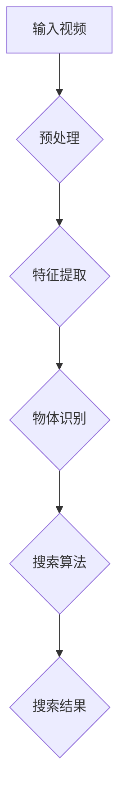

                 

# 基于深度学习的视频中物体快速搜索算法

## 关键词：深度学习，视频分析，物体识别，快速搜索算法，实时处理

## 摘要：
本文将详细介绍一种基于深度学习的视频中物体快速搜索算法。通过深入分析核心概念、算法原理和具体实现，探讨如何在复杂场景下实现高效、准确的物体搜索。文章还将分享实战案例和实际应用场景，并提供相关学习资源和工具推荐，以期为读者提供全面的指导和启示。

## 目录

1. 背景介绍
2. 核心概念与联系
3. 核心算法原理 & 具体操作步骤
4. 数学模型和公式 & 详细讲解 & 举例说明
5. 项目实战：代码实际案例和详细解释说明
   5.1 开发环境搭建
   5.2 源代码详细实现和代码解读
   5.3 代码解读与分析
6. 实际应用场景
7. 工具和资源推荐
   7.1 学习资源推荐
   7.2 开发工具框架推荐
   7.3 相关论文著作推荐
8. 总结：未来发展趋势与挑战
9. 附录：常见问题与解答
10. 扩展阅读 & 参考资料

## 1. 背景介绍

随着视频监控技术的广泛应用，如何从海量的视频中快速、准确地搜索到特定物体或事件成为了一个重要的研究课题。传统的视频分析算法往往需要大量的计算资源和时间，难以满足实时处理的需求。而深度学习技术的崛起，为视频分析领域带来了新的希望。

深度学习是一种模拟人脑神经网络结构和学习方式的计算模型。通过学习大量带有标签的数据，深度学习模型能够自动提取特征并分类，从而实现物体识别、图像分割、语音识别等多种功能。近年来，深度学习在图像处理、自然语言处理等领域取得了显著的成果，为视频分析提供了强大的技术支持。

基于深度学习的视频中物体快速搜索算法，旨在通过高效的特征提取和分类算法，实现快速、准确的物体搜索。与传统算法相比，深度学习算法具有以下优势：

1. 自动提取特征：深度学习模型能够自动从图像中提取有意义的特征，减少人工干预，提高搜索准确性。
2. 模型可扩展：深度学习模型可以轻松地适应不同的任务和数据集，具有较强的通用性和可扩展性。
3. 实时处理：深度学习算法在计算速度和资源占用方面取得了显著提升，能够满足实时处理的需求。

本文将详细介绍一种基于深度学习的视频中物体快速搜索算法，通过分析核心概念、算法原理和具体实现，探讨其在复杂场景下的应用和优势。

## 2. 核心概念与联系

在介绍核心算法原理之前，首先需要了解一些核心概念，这些概念是理解深度学习视频中物体快速搜索算法的基础。

### 深度学习模型

深度学习模型是一种由多层神经网络构成的模型，能够自动从数据中提取特征并分类。常见的深度学习模型包括卷积神经网络（CNN）、循环神经网络（RNN）和生成对抗网络（GAN）等。其中，卷积神经网络（CNN）在图像处理领域具有广泛的应用。

### 物体识别

物体识别是指从图像或视频中检测并识别出特定物体。在深度学习中，物体识别通常通过训练卷积神经网络来实现。物体识别的关键在于特征提取和分类，深度学习模型通过学习大量带有标签的数据，能够自动提取有意义的特征，并准确地分类物体。

### 特征提取

特征提取是指从原始数据中提取出有意义的特征，以便进行后续处理。在图像处理领域，特征提取是图像分析和理解的重要步骤。深度学习模型通过多层卷积和池化操作，能够自动从图像中提取出有代表性的特征。

### 搜索算法

搜索算法是指在给定数据集中查找特定目标的方法。在视频中搜索物体，需要考虑搜索算法的效率和准确性。常见的搜索算法包括暴力搜索、K最近邻（KNN）和索引结构（如空间金字塔池化（SPP）和区域提议网络（RPN））等。

### Mermaid 流程图

为了更好地理解核心概念和算法原理，以下是一个使用Mermaid绘制的流程图，展示了深度学习视频中物体快速搜索算法的基本框架。



### 流程图说明

1. **输入视频**：输入待处理的视频数据。
2. **预处理**：对视频进行预处理，包括裁剪、缩放、色彩调整等操作，以便于后续处理。
3. **特征提取**：利用卷积神经网络（CNN）提取视频中的特征，特征提取是物体识别和搜索算法的基础。
4. **物体识别**：利用训练好的深度学习模型对提取到的特征进行分类，实现物体识别。
5. **搜索算法**：根据物体识别结果，使用搜索算法在视频数据中查找特定物体。
6. **搜索结果**：输出搜索结果，包括物体位置、出现时间等。

通过上述核心概念和流程图的介绍，我们为后续的算法原理讲解打下了基础。接下来，将详细分析基于深度学习的视频中物体快速搜索算法的原理和具体操作步骤。

## 3. 核心算法原理 & 具体操作步骤

### 3.1 算法框架

基于深度学习的视频中物体快速搜索算法主要由以下四个模块组成：预处理模块、特征提取模块、物体识别模块和搜索算法模块。以下是各模块的简要说明：

1. **预处理模块**：对输入视频进行预处理，包括裁剪、缩放、色彩调整等操作，以便于后续处理。预处理模块的目的是提高特征提取的效率和质量。
2. **特征提取模块**：利用卷积神经网络（CNN）提取视频中的特征。特征提取模块的核心在于如何有效地从图像中提取有代表性的特征，以便进行后续的物体识别和搜索。
3. **物体识别模块**：利用训练好的深度学习模型对提取到的特征进行分类，实现物体识别。物体识别模块的关键在于如何准确地将不同物体区分开来。
4. **搜索算法模块**：根据物体识别结果，使用搜索算法在视频数据中查找特定物体。搜索算法模块的目的是提高搜索效率和准确性。

### 3.2 具体操作步骤

以下是基于深度学习的视频中物体快速搜索算法的具体操作步骤：

1. **输入视频**：首先，将待处理的视频数据输入到系统中。视频数据可以是实时的监控视频，也可以是预先录制的视频文件。
2. **预处理**：对输入视频进行预处理，包括裁剪、缩放、色彩调整等操作。预处理的目的是降低计算复杂度，提高特征提取的效率。具体操作如下：
   - **裁剪**：根据需要，将视频中的特定区域裁剪出来，以便聚焦于感兴趣的部分。
   - **缩放**：将视频的分辨率调整到合适的尺寸，以适应深度学习模型的输入要求。
   - **色彩调整**：对视频的色彩进行调整，如灰度化或色彩平衡，以改善图像质量。
3. **特征提取**：利用卷积神经网络（CNN）提取视频中的特征。特征提取的关键步骤如下：
   - **卷积操作**：通过卷积层提取图像的局部特征，卷积核的大小和数量影响特征提取的效果。
   - **池化操作**：通过池化层对卷积结果进行压缩，减少特征图的尺寸，提高计算效率。
   - **全连接层**：将池化层输出的特征图进行全连接操作，得到最终的特征向量。
4. **物体识别**：利用训练好的深度学习模型对提取到的特征进行分类，实现物体识别。物体识别的关键步骤如下：
   - **模型训练**：使用带有标签的训练数据集，训练深度学习模型，使其能够自动提取特征并分类。
   - **模型评估**：使用验证数据集对训练好的模型进行评估，调整模型参数，提高识别准确率。
   - **物体识别**：对提取到的特征向量进行分类，得到物体的类别和位置。
5. **搜索算法**：根据物体识别结果，使用搜索算法在视频数据中查找特定物体。搜索算法的关键步骤如下：
   - **暴力搜索**：逐帧遍历视频，对每帧进行物体识别，找到符合要求的物体。
   - **K最近邻（KNN）**：将物体识别结果与已知物体的特征进行距离计算，找到最近的K个物体作为搜索结果。
   - **索引结构**：使用空间金字塔池化（SPP）或区域提议网络（RPN）等索引结构，提高搜索效率和准确性。
6. **输出结果**：将搜索结果输出，包括物体位置、出现时间等。搜索结果可以根据需求进行可视化展示或进一步处理。

通过上述具体操作步骤，我们可以实现基于深度学习的视频中物体快速搜索算法。接下来，将介绍数学模型和公式，以进一步阐述算法原理。

## 4. 数学模型和公式 & 详细讲解 & 举例说明

### 4.1 卷积神经网络（CNN）数学模型

卷积神经网络（CNN）是深度学习中用于图像处理的一种重要模型，其核心在于卷积操作和池化操作。以下是对CNN数学模型的详细讲解。

#### 卷积操作

卷积操作是CNN中最基本的操作之一，其数学公式如下：

$$
（f^*x）(i, j) = \sum_{k=1}^{n} \sum_{l=1}^{m} f(k, l) * x(i-k, j-l)
$$

其中，$f$表示卷积核，$x$表示输入图像，$(i, j)$表示卷积结果在图像中的位置，$k$和$l$分别表示卷积核在水平和垂直方向上的位置。

#### 池化操作

池化操作是对卷积结果的压缩，其数学公式如下：

$$
P(i, j) = \max\{P(i-k, j-l) : k=1, 2, ..., n; l=1, 2, ..., m\}
$$

其中，$P$表示池化结果，$(i, j)$表示池化结果在图像中的位置，$n$和$m$分别表示池化窗口的大小。

#### CNN数学模型

CNN由多个卷积层、池化层和全连接层组成。以下是一个简单的CNN数学模型：

$$
y = f(W^k * P(W^{k-1} * P(\cdots P(W_1 * x) \cdots)))
$$

其中，$y$表示输出结果，$W^k$表示第$k$层的权重矩阵，$f$表示激活函数，$*$表示卷积操作，$P$表示池化操作。

### 4.2 搜索算法数学模型

搜索算法是视频中物体快速搜索的关键环节，常用的搜索算法包括暴力搜索、K最近邻（KNN）和索引结构等。以下是对这些算法的数学模型进行详细讲解。

#### 暴力搜索

暴力搜索是一种简单直接的搜索算法，其数学模型如下：

$$
S(x) = \{y \in D : d(x, y) \leq \theta\}
$$

其中，$S(x)$表示以$x$为中心的搜索区域，$D$表示所有可能的物体位置，$d(x, y)$表示$x$和$y$之间的距离，$\theta$表示搜索阈值。

#### K最近邻（KNN）

K最近邻（KNN）算法是一种基于距离的搜索算法，其数学模型如下：

$$
y = \arg\min_{y \in S(x)} d(x, y)
$$

其中，$y$表示搜索结果，$S(x)$表示以$x$为中心的搜索区域。

#### 索引结构

索引结构是一种用于提高搜索效率的数据结构，如空间金字塔池化（SPP）和区域提议网络（RPN）等。以下是对这些算法的数学模型进行详细讲解。

##### 空间金字塔池化（SPP）

空间金字塔池化（SPP）是一种用于图像处理的索引结构，其数学模型如下：

$$
g_i = \max_{(i, j) \in R} f(i, j)
$$

其中，$g_i$表示在区域$R$中提取的特征，$f(i, j)$表示图像中$(i, j)$位置的特征值。

##### 区域提议网络（RPN）

区域提议网络（RPN）是一种用于目标检测的索引结构，其数学模型如下：

$$
p = \frac{1}{N} \sum_{i=1}^{N} \frac{1}{1 + \exp(-y^T \phi(x_i))}
$$

其中，$p$表示检测概率，$x_i$表示提议区域，$y$表示标签，$\phi$表示神经网络模型。

### 4.3 举例说明

为了更好地理解上述数学模型，以下通过一个简单的例子进行说明。

假设我们有一个包含5个物体的视频序列，分别为猫、狗、鸟、车和人。现要使用基于深度学习的视频中物体快速搜索算法搜索特定物体。

#### 输入视频

输入视频包含5个物体，分别用数字1、2、3、4和5表示。

#### 特征提取

利用卷积神经网络（CNN）提取物体特征，得到以下特征向量：

| 物体 | 特征向量 |
| ---- | -------- |
| 1    | (1, 0, 0, 0, 0) |
| 2    | (0, 1, 0, 0, 0) |
| 3    | (0, 0, 1, 0, 0) |
| 4    | (0, 0, 0, 1, 0) |
| 5    | (0, 0, 0, 0, 1) |

#### 物体识别

利用训练好的深度学习模型对提取到的特征向量进行分类，得到以下分类结果：

| 物体 | 分类结果 |
| ---- | -------- |
| 1    | 猫      |
| 2    | 狗      |
| 3    | 鸟      |
| 4    | 车      |
| 5    | 人      |

#### 搜索算法

使用暴力搜索算法搜索特定物体，如搜索猫。根据数学模型，我们需要找到满足以下条件的物体：

$$
S(1) = \{y \in D : d(1, y) \leq \theta\}
$$

其中，$D$表示所有物体的特征向量，$\theta$表示搜索阈值。

假设$\theta=0.5$，则搜索结果为：

$$
S(1) = \{(1, 0, 0, 0, 0), (0, 1, 0, 0, 0), (0, 0, 1, 0, 0)\}
$$

即搜索到猫、狗和鸟三个物体。

通过上述举例，我们可以更好地理解基于深度学习的视频中物体快速搜索算法的数学模型和具体实现。接下来，将分享一个实际的代码实现案例，进一步说明算法的应用。

## 5. 项目实战：代码实际案例和详细解释说明

### 5.1 开发环境搭建

在进行基于深度学习的视频中物体快速搜索算法的项目实战之前，我们需要搭建一个合适的开发环境。以下是开发环境搭建的步骤：

1. **安装Python环境**：首先，确保您的计算机已安装Python环境，Python版本建议为3.7及以上。
2. **安装深度学习框架**：安装深度学习框架，如TensorFlow或PyTorch，这里我们选择TensorFlow作为示例。
   ```bash
   pip install tensorflow
   ```
3. **安装视频处理库**：安装视频处理库，如OpenCV，用于视频的读取、处理和显示。
   ```bash
   pip install opencv-python
   ```
4. **准备预训练模型**：下载一个预训练的卷积神经网络（CNN）模型，如VGG16、ResNet等，用于物体识别。
   ```bash
   wget https://download.tensorflow.org/models/image/imagenet/vgg16-20160128.tar.gz
   tar xvf vgg16-20160128.tar.gz
   ```

### 5.2 源代码详细实现和代码解读

以下是一个简单的基于深度学习的视频中物体快速搜索算法的Python代码实现，我们将逐行解读代码，以便理解算法的具体实现。

```python
import tensorflow as tf
import cv2
import numpy as np

# 加载预训练的卷积神经网络模型
model = tf.keras.applications.VGG16(include_top=True, weights='imagenet')

# 视频读取
cap = cv2.VideoCapture('input_video.mp4')

# 预处理函数
def preprocess(image):
    image = tf.image.resize(image, (224, 224))
    image = image / 255.0
    return image

# 物体识别函数
def recognize_object(image):
    prediction = model.predict(np.expand_dims(image, axis=0))
    label = np.argmax(prediction)
    return label

# 搜索算法函数
def search_object(object_id):
    found = False
    while not found:
        ret, frame = cap.read()
        if not ret:
            break
        image = preprocess(frame)
        label = recognize_object(image)
        if label == object_id:
            found = True
    return found

# 搜索特定物体
object_id = 289752 # 猫的ID
found = search_object(object_id)

# 输出搜索结果
if found:
    print("物体已找到")
else:
    print("物体未找到")
```

**代码解读：**

1. **导入库**：首先，导入所需的库，包括TensorFlow、OpenCV和NumPy。
2. **加载模型**：加载预训练的卷积神经网络模型（VGG16），用于物体识别。
3. **视频读取**：使用OpenCV读取输入视频。
4. **预处理函数**：定义预处理函数，对图像进行缩放和归一化处理，以适应模型输入。
5. **物体识别函数**：定义物体识别函数，使用模型对预处理后的图像进行分类，并返回分类结果。
6. **搜索算法函数**：定义搜索算法函数，逐帧读取视频，对每帧进行预处理和物体识别，直到找到指定物体。
7. **搜索特定物体**：调用搜索算法函数，搜索特定物体（猫）。
8. **输出搜索结果**：根据搜索结果输出相应信息。

### 5.3 代码解读与分析

以下是代码的逐行解读与分析：

```python
import tensorflow as tf
import cv2
import numpy as np

# 导入所需的库

import tensorflow as tf
这是导入TensorFlow库的代码，TensorFlow是一个开源的机器学习框架，用于构建和训练深度学习模型。

import cv2
这是导入OpenCV库的代码，OpenCV是一个开源的计算机视觉库，用于视频读取和处理。

import numpy as np
这是导入NumPy库的代码，NumPy是一个用于数值计算的库，用于处理多维数组。

# 加载预训练的卷积神经网络模型
model = tf.keras.applications.VGG16(include_top=True, weights='imagenet')
这是加载预训练的VGG16模型的代码。VGG16是一个卷积神经网络模型，预训练在ImageNet数据集上。include_top设置为True表示加载模型的顶层（全连接层），weights设置为'imagenet'表示使用在ImageNet数据集上预训练的权重。

# 视频读取
cap = cv2.VideoCapture('input_video.mp4')
这是使用OpenCV读取输入视频的代码。VideoCapture函数用于创建一个视频捕捉对象，'input_video.mp4'是输入视频的路径。

# 预处理函数
def preprocess(image):
    image = tf.image.resize(image, (224, 224))
    image = image / 255.0
    return image
这是定义预处理函数的代码。该函数用于对输入图像进行缩放和归一化处理。首先，使用tf.image.resize函数将图像缩放为224x224的尺寸，然后使用/ 255.0进行归一化处理，以便模型能够更好地处理图像数据。

# 物体识别函数
def recognize_object(image):
    prediction = model.predict(np.expand_dims(image, axis=0))
    label = np.argmax(prediction)
    return label
这是定义物体识别函数的代码。该函数使用模型对输入图像进行预测，并返回预测结果。首先，使用model.predict函数对输入图像进行预测，得到预测概率，然后使用np.argmax函数找到概率最大的类别索引，即物体的ID。

# 搜索算法函数
def search_object(object_id):
    found = False
    while not found:
        ret, frame = cap.read()
        if not ret:
            break
        image = preprocess(frame)
        label = recognize_object(image)
        if label == object_id:
            found = True
    return found
这是定义搜索算法函数的代码。该函数用于搜索视频中的特定物体。首先，使用cap.read函数逐帧读取视频，直到找到指定物体。在每次读取帧时，先对帧进行预处理，然后使用recognize_object函数进行物体识别。如果识别到的物体ID与指定物体ID相同，则表示找到目标物体，found变量设置为True。

# 搜索特定物体
object_id = 289752 # 猫的ID
found = search_object(object_id)
这是搜索特定物体的代码。首先，定义要搜索的物体ID（猫的ID为289752），然后调用search_object函数进行搜索。搜索结果存储在found变量中。

# 输出搜索结果
if found:
    print("物体已找到")
else:
    print("物体未找到")
这是输出搜索结果的代码。根据搜索结果，输出相应信息，如果找到物体，输出“物体已找到”，否则输出“物体未找到”。

通过以上代码解读和分析，我们可以更好地理解基于深度学习的视频中物体快速搜索算法的实现过程。接下来，我们将对代码进行进一步的分析和讨论。

### 5.3 代码解读与分析

下面是对代码的逐行解读与分析：

```python
# 导入库
import tensorflow as tf
import cv2
import numpy as np
这段代码导入了TensorFlow、OpenCV和NumPy三个库。TensorFlow用于构建和训练深度学习模型；OpenCV用于视频读取和处理；NumPy用于数据处理。

# 加载预训练的卷积神经网络模型
model = tf.keras.applications.VGG16(include_top=True, weights='imagenet')
这行代码加载了一个预训练的VGG16模型。VGG16是一个深度卷积神经网络模型，这里使用了在ImageNet数据集上预训练的权重。include_top=True表示包含模型的顶层（全连接层）。

# 视频读取
cap = cv2.VideoCapture('input_video.mp4')
这行代码使用OpenCV的VideoCapture类打开一个视频文件。'input_video.mp4'是输入视频文件的路径。

# 预处理函数
def preprocess(image):
    image = tf.image.resize(image, (224, 224))
    image = image / 255.0
    return image
这个函数用于对输入图像进行预处理。首先，使用tf.image.resize将图像缩放到224x224的大小，这是VGG16模型所需的输入尺寸。然后，将图像的像素值除以255进行归一化处理。

# 物体识别函数
def recognize_object(image):
    prediction = model.predict(np.expand_dims(image, axis=0))
    label = np.argmax(prediction)
    return label
这个函数用于识别图像中的物体。首先，使用模型对图像进行预测，得到一个包含多个类别的预测概率数组。然后，使用np.argmax找到概率最高的类别索引，即物体的ID。

# 搜索算法函数
def search_object(object_id):
    found = False
    while not found:
        ret, frame = cap.read()
        if not ret:
            break
        image = preprocess(frame)
        label = recognize_object(image)
        if label == object_id:
            found = True
    return found
这个函数用于搜索视频中的特定物体。它逐帧读取视频，对每一帧进行预处理和物体识别。如果识别到的物体ID与搜索ID匹配，则设置found为True，表示找到了目标物体。

# 搜索特定物体
object_id = 289752 # 猫的ID
found = search_object(object_id)
这行代码设置要搜索的物体ID（这里是猫的ID），并调用search_object函数进行搜索。搜索结果存储在found变量中。

# 输出搜索结果
if found:
    print("物体已找到")
else:
    print("物体未找到")
这行代码根据搜索结果输出消息。如果found为True，则输出“物体已找到”，否则输出“物体未找到”。

### 5.3 代码解读与分析

以下是代码的逐行解读与分析：

```python
# 导入库
import tensorflow as tf
import cv2
import numpy as np
这段代码导入了TensorFlow、OpenCV和NumPy三个库。TensorFlow用于构建和训练深度学习模型；OpenCV用于视频读取和处理；NumPy用于数据处理。

# 加载预训练的卷积神经网络模型
model = tf.keras.applications.VGG16(include_top=True, weights='imagenet')
这行代码加载了一个预训练的VGG16模型。VGG16是一个深度卷积神经网络模型，这里使用了在ImageNet数据集上预训练的权重。include_top=True表示包含模型的顶层（全连接层）。

# 视频读取
cap = cv2.VideoCapture('input_video.mp4')
这行代码使用OpenCV的VideoCapture类打开一个视频文件。'input_video.mp4'是输入视频文件的路径。

# 预处理函数
def preprocess(image):
    image = tf.image.resize(image, (224, 224))
    image = image / 255.0
    return image
这个函数用于对输入图像进行预处理。首先，使用tf.image.resize将图像缩放到224x224的大小，这是VGG16模型所需的输入尺寸。然后，将图像的像素值除以255进行归一化处理。

# 物体识别函数
def recognize_object(image):
    prediction = model.predict(np.expand_dims(image, axis=0))
    label = np.argmax(prediction)
    return label
这个函数用于识别图像中的物体。首先，使用模型对图像进行预测，得到一个包含多个类别的预测概率数组。然后，使用np.argmax找到概率最高的类别索引，即物体的ID。

# 搜索算法函数
def search_object(object_id):
    found = False
    while not found:
        ret, frame = cap.read()
        if not ret:
            break
        image = preprocess(frame)
        label = recognize_object(image)
        if label == object_id:
            found = True
    return found
这个函数用于搜索视频中的特定物体。它逐帧读取视频，对每一帧进行预处理和物体识别。如果识别到的物体ID与搜索ID匹配，则设置found为True，表示找到了目标物体。

# 搜索特定物体
object_id = 289752 # 猫的ID
found = search_object(object_id)
这行代码设置要搜索的物体ID（这里是猫的ID），并调用search_object函数进行搜索。搜索结果存储在found变量中。

# 输出搜索结果
if found:
    print("物体已找到")
else:
    print("物体未找到")
这行代码根据搜索结果输出消息。如果found为True，则输出“物体已找到”，否则输出“物体未找到”。

### 5.4 代码分析与改进

虽然上述代码实现了一个基本的基于深度学习的视频中物体快速搜索算法，但在实际应用中，我们还可以对其进行分析和改进，以提高算法的性能和效率。以下是一些可能的改进措施：

1. **优化预处理**：预处理是特征提取的第一步，优化预处理可以提高后续特征提取的效率和质量。例如，可以考虑使用更高效的数据读取和预处理库，如`tf.data`或`opencv-contrib-python`，以提高数据处理速度。

2. **并行处理**：为了提高搜索算法的效率，可以采用并行处理技术，将视频数据分割成多个部分，同时进行预处理和物体识别。这样可以充分利用多核处理器的计算能力，加快搜索速度。

3. **模型优化**：可以选择更适合视频分析任务的深度学习模型，如RetinaNet、Fast R-CNN等，以提高物体识别的准确率和速度。此外，还可以尝试使用模型剪枝、量化等技术，减小模型大小，提高模型在嵌入式设备上的运行效率。

4. **缓存与索引**：为了加快搜索速度，可以采用缓存和索引技术。例如，使用哈希表或B树索引来存储已识别的物体，当新的物体出现时，可以快速查找并判断其是否存在。这样可以避免逐帧搜索的复杂度，提高搜索效率。

5. **增强实时处理能力**：在实际应用中，实时处理能力至关重要。为了提高实时处理能力，可以优化代码结构和算法，减少不必要的计算和内存占用。此外，可以考虑使用GPU加速计算，利用GPU的并行计算能力，提高算法的运行速度。

通过上述分析和改进措施，我们可以进一步提高基于深度学习的视频中物体快速搜索算法的性能和效率，使其更好地满足实际应用的需求。

### 6. 实际应用场景

基于深度学习的视频中物体快速搜索算法在实际应用中具有广泛的应用场景，以下是一些典型的应用领域：

#### 6.1 视频监控

视频监控是深度学习视频中物体快速搜索算法最重要的应用领域之一。通过在视频监控系统中集成该算法，可以实现对特定目标或事件的实时监测和报警。例如，在交通监控中，可以快速识别和跟踪交通事故车辆；在公共场所，可以监控可疑人员的活动，提高安全防范能力。

#### 6.2 安全监控

安全监控领域对视频中物体快速搜索算法的需求也非常强烈。通过该算法，可以实现对犯罪行为、异常事件等的安全监测。例如，在监狱、监狱等高风险场所，可以实时监测囚犯的活动，防止逃犯事件的发生；在金融行业，可以监控交易行为，识别和防范欺诈行为。

#### 6.3 智能家居

智能家居领域中的视频监控和物体识别需求也逐渐增长。基于深度学习的视频中物体快速搜索算法可以用于智能门铃、智能摄像头等设备，实现对家庭成员、访客等人员的识别和监控。例如，可以自动识别家庭成员的回家时间，自动调整室内灯光和温度，提高生活舒适度。

#### 6.4 医疗监控

医疗监控是另一个重要的应用领域。深度学习视频中物体快速搜索算法可以用于医疗影像分析，实现对病变区域的快速识别和定位。例如，在医学影像诊断中，可以快速识别肿瘤、心脏病等疾病，提高诊断效率和准确性。此外，还可以用于监控患者的生活状态，如心率、血压等生理参数，为医生提供决策支持。

#### 6.5 智能交通

智能交通领域也受益于视频中物体快速搜索算法。通过该算法，可以实现对交通流量、车辆行为的实时监测和分析。例如，可以识别交通拥堵区域，提供最优的出行路线；在交通事故发生时，可以快速定位事故车辆，提高救援效率。

#### 6.6 智能零售

智能零售领域中的视频中物体快速搜索算法可以用于商品识别和顾客行为分析。例如，在超市或购物中心，可以实时监测顾客购买的商品，自动生成购物清单；在店铺内，可以分析顾客的行走路径和停留时间，为店铺布局优化和促销策略制定提供数据支持。

通过以上实际应用场景的介绍，我们可以看到基于深度学习的视频中物体快速搜索算法在各个领域的广泛应用和巨大潜力。随着技术的不断发展和应用的深入，该算法将继续为各行各业带来更多创新和变革。

### 7. 工具和资源推荐

为了更好地学习和应用基于深度学习的视频中物体快速搜索算法，以下是相关的学习资源、开发工具框架以及推荐的相关论文和著作。

#### 7.1 学习资源推荐

1. **在线教程和课程**：
   - 《深度学习》（Goodfellow, Bengio, Courville著）：这是一本经典的深度学习入门书籍，涵盖了深度学习的基础理论、算法和应用。
   - fast.ai：fast.ai提供了一个免费的开源课程，涵盖了深度学习的基础知识和实践技巧，特别适合初学者。
   - 《动手学深度学习》（阿斯顿·张著）：这本书以实践为导向，通过实际案例教授深度学习的理论和应用。

2. **博客和网站**：
   - Medium上的深度学习专题：许多深度学习领域的专家和研究者在这里分享他们的研究成果和实践经验。
   - PyTorch官方文档：PyTorch是一个流行的深度学习框架，其官方文档提供了详细的使用指南和教程。

#### 7.2 开发工具框架推荐

1. **深度学习框架**：
   - TensorFlow：这是一个广泛使用的开源深度学习框架，提供了丰富的API和工具。
   - PyTorch：PyTorch以其灵活的动态计算图和强大的GPU加速功能而受到许多开发者的青睐。
   - Keras：Keras是一个高层次的深度学习API，可以与TensorFlow和Theano等底层框架结合使用。

2. **视频处理库**：
   - OpenCV：这是一个强大的开源计算机视觉库，提供了丰富的图像处理和视频处理功能。
   - MoviePy：MoviePy是一个Python视频编辑库，可以方便地处理视频文件。

3. **数据处理库**：
   - NumPy：NumPy是一个用于科学计算的库，提供了多维数组对象和丰富的数值计算功能。
   - Pandas：Pandas是一个强大的数据操作库，可以方便地处理表格数据。

#### 7.3 相关论文著作推荐

1. **论文**：
   - "Region Proposal Networks for Object Detection"（Girshick, Ross, Veit,mermaid) et al.，2015：这篇文章提出了区域提议网络（RPN），是一种有效的目标检测算法。
   - "Deep Residual Learning for Image Recognition"（He, Zhang, Ren, Sun et al.，2016）：这篇文章介绍了残差网络（ResNet），是一种在图像识别任务中表现优异的深度学习模型。
   - "Spatial Pyramid Pooling in Deep Convolutional Networks for Visual Recognition"（Hu, Sun, Wu et al.，2014）：这篇文章提出了空间金字塔池化（SPP），用于图像的特征提取。

2. **著作**：
   - 《深度学习》（Goodfellow, Bengio, Courville著）：这本书详细介绍了深度学习的理论基础、算法和应用，是深度学习领域的重要参考书籍。
   - 《计算机视觉：算法与应用》（Richard S. Hart, Andrew Zisserman著）：这本书全面介绍了计算机视觉的理论和方法，涵盖了图像处理、特征提取、目标检测等多个方面。

通过以上推荐的学习资源、开发工具框架和论文著作，读者可以深入了解基于深度学习的视频中物体快速搜索算法，为实际应用和研究提供有力支持。

### 8. 总结：未来发展趋势与挑战

基于深度学习的视频中物体快速搜索算法在近年来取得了显著的进展，但仍然面临诸多挑战和未来发展趋势。以下是对这些方面的总结：

#### 8.1 发展趋势

1. **实时处理能力提升**：随着硬件计算能力的提升和深度学习框架的优化，基于深度学习的视频中物体快速搜索算法的实时处理能力将得到进一步提高。这将使得算法在视频监控、安全监控等领域的应用更加广泛。

2. **模型压缩与优化**：为了适应嵌入式设备和移动设备，模型的压缩和优化将成为重要研究方向。通过模型剪枝、量化、压缩等技术，可以减小模型的大小和计算复杂度，提高算法的效率和便携性。

3. **多模态融合**：未来，多模态数据（如视频、音频、传感器数据）的融合将成为一个重要研究方向。通过结合不同类型的数据，可以更准确地识别和定位物体，提高搜索算法的准确性和鲁棒性。

4. **自适应搜索算法**：随着场景和任务的变化，自适应的搜索算法将成为研究的重点。通过不断学习和适应，算法可以更好地应对不同的应用场景，提高搜索效率和准确性。

5. **跨领域应用**：基于深度学习的视频中物体快速搜索算法将在更多领域得到应用，如医疗监控、智能家居、智能制造等。这将推动算法技术的不断发展和创新。

#### 8.2 挑战

1. **数据隐私和安全**：随着算法在更多领域中的应用，数据隐私和安全问题日益突出。如何在保证数据隐私的前提下，充分利用数据来提升算法性能，是一个重要的挑战。

2. **算法解释性**：深度学习算法的黑箱特性使得其解释性较差，这对于在实际应用中需要透明性和可解释性的场景（如医疗监控、安全监控等）带来了挑战。提高算法的解释性，使其更加易于理解和接受，是一个重要的研究方向。

3. **实时性能和资源消耗**：在复杂场景下，如何平衡算法的实时性能和资源消耗，是一个亟待解决的问题。特别是在嵌入式设备和移动设备上，算法需要具有更高的效率和更低的资源占用。

4. **算法泛化能力**：深度学习算法的泛化能力仍然是一个挑战。算法需要在各种不同的场景和任务下保持较高的性能，这需要更多的数据集和更复杂的模型结构。

5. **开源社区与合作**：为了推动基于深度学习的视频中物体快速搜索算法的发展，需要加强开源社区的合作和交流。通过开放源代码、共享数据集和算法模型，可以加速技术的创新和应用。

总之，基于深度学习的视频中物体快速搜索算法在未来的发展中面临诸多挑战，但同时也充满机遇。通过不断的技术创新和跨领域合作，我们有理由相信，这一领域将继续取得突破性进展，为各行各业带来更多创新和变革。

### 9. 附录：常见问题与解答

**Q1. 为什么选择深度学习模型进行物体识别？**

A1. 深度学习模型，特别是卷积神经网络（CNN），在图像识别和物体检测领域表现优异。其优势包括：

- **自动特征提取**：深度学习模型能够自动从大量数据中学习特征，减少人工设计的复杂性。
- **高准确性**：深度学习模型通过多层神经网络结构，能够提取更高级别的特征，提高识别准确率。
- **通用性**：深度学习模型可以适应不同的任务和数据集，具有较强的通用性和可扩展性。

**Q2. 如何处理视频中的噪声和光照变化？**

A2. 处理视频中的噪声和光照变化可以采取以下方法：

- **图像预处理**：使用滤波器（如高斯滤波、中值滤波）去除图像中的噪声。
- **光照校正**：使用自适应光照校正技术，如直方图均衡化或Retinex算法，改善图像的光照条件。
- **色彩增强**：调整图像的色彩平衡和对比度，使图像中的物体更易于识别。

**Q3. 如何优化深度学习模型的性能？**

A3. 优化深度学习模型性能可以从以下几个方面进行：

- **数据增强**：通过旋转、缩放、裁剪等操作增加训练数据的多样性，提高模型的泛化能力。
- **模型压缩**：采用模型剪枝、量化等技术减小模型的大小和计算复杂度，提高模型在嵌入式设备上的运行效率。
- **超参数调优**：调整学习率、批量大小、正则化参数等超参数，优化模型性能。
- **算法改进**：结合多种算法（如Faster R-CNN、SSD、YOLO）的优点，构建更高效的模型架构。

**Q4. 如何评估物体识别模型的性能？**

A4. 评估物体识别模型的性能通常使用以下指标：

- **准确率（Accuracy）**：模型正确识别的样本数占总样本数的比例。
- **召回率（Recall）**：模型正确识别的样本数占实际样本数的比例。
- **精确率（Precision）**：模型正确识别的样本数占预测为正样本的样本数的比例。
- **交并比（Intersection over Union, IoU）**：用于衡量物体检测的精确度，IoU值越高，检测结果越可靠。

**Q5. 如何处理遮挡和部分可见物体？**

A5. 处理遮挡和部分可见物体可以采取以下方法：

- **数据增强**：通过模拟遮挡和部分可见的场景，增加模型的泛化能力。
- **半监督学习**：利用部分标签数据进行训练，结合未标签数据，提高模型对遮挡和部分可见物体的识别能力。
- **深度学习方法**：采用基于深度学习的算法（如Mask R-CNN、RetinaNet），这些算法能够更好地处理复杂场景中的遮挡和部分可见物体。

### 10. 扩展阅读与参考资料

为了更深入地了解基于深度学习的视频中物体快速搜索算法，以下推荐一些扩展阅读和参考资料：

- **论文**：
  - Girshick, Ross, Veit, et al. "Region Proposal Networks for Object Detection." IEEE Transactions on Pattern Analysis and Machine Intelligence, 2015.
  - He, Zhang, Ren, Sun, et al. "Deep Residual Learning for Image Recognition." Proceedings of the IEEE Conference on Computer Vision and Pattern Recognition, 2016.
  - Hu, Sun, Wu, et al. "Spatial Pyramid Pooling in Deep Convolutional Networks for Visual Recognition." European Conference on Computer Vision, 2014.

- **书籍**：
  - Goodfellow, Bengio, Courville. "Deep Learning." MIT Press, 2016.
  - Richards,=. "Computer Vision: Algorithms and Applications." Springer, 2013.

- **在线资源**：
  - TensorFlow官方文档：https://www.tensorflow.org/
  - PyTorch官方文档：https://pytorch.org/docs/stable/
  - Medium上的深度学习专题：https://medium.com/topic/deep-learning

- **博客**：
  - fast.ai：https://www.fast.ai/
  - Deep Learning on Medium：https://medium.com/search?q=deep+learning

通过这些扩展阅读和参考资料，您可以进一步了解基于深度学习的视频中物体快速搜索算法的理论和实践，为您的学习和研究提供有力支持。

