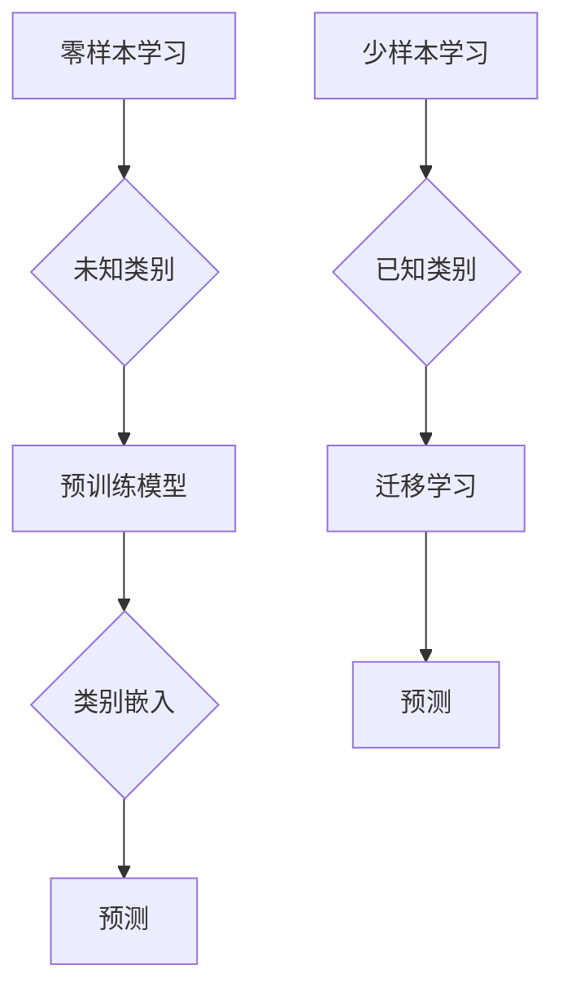

                 

# 基于深度学习的零样本和少样本学习

## 关键词：深度学习、零样本学习、少样本学习、人工智能

## 摘要

本文将探讨深度学习领域中零样本学习和少样本学习的研究现状、核心概念、算法原理、应用场景以及未来发展趋势。通过对这些技术的深入分析，读者可以了解到零样本学习和少样本学习在提升模型泛化能力和降低数据需求方面的巨大潜力。

## 1. 背景介绍

### 1.1 深度学习的崛起

随着大数据和计算力的提升，深度学习在图像识别、自然语言处理、语音识别等领域取得了显著的成果。然而，深度学习模型对大规模标注数据进行训练的需求使得其应用受到了一定限制。

### 1.2 零样本学习和少样本学习的重要性

零样本学习和少样本学习旨在减少对大规模标注数据的依赖，从而提高模型的泛化能力。在现实世界中，获取大量标注数据往往需要大量时间和资源，而零样本学习和少样本学习技术可以有效降低这一需求。

## 2. 核心概念与联系

### 2.1 零样本学习（Zero-Shot Learning, ZSL）

零样本学习是指模型在面对未知类别时，仅利用少量甚至零标注数据来完成任务。其核心思想是通过预训练模型和类别嵌入来降低数据依赖。

### 2.2 少样本学习（Few-Shot Learning, FSL）

少样本学习是指模型在训练过程中仅使用少量标注数据来学习任务。与零样本学习不同，少样本学习假定模型已接触过某些类别，因此可以利用已有知识进行迁移学习。

### 2.3 零样本学习和少样本学习的联系与区别

零样本学习和少样本学习均旨在减少对大规模标注数据的依赖，但零样本学习针对未知类别，而少样本学习针对已知类别。在实际应用中，两者往往结合使用，以实现更好的效果。

## 2.4 Mermaid 流程图



## 3. 核心算法原理 & 具体操作步骤

### 3.1 零样本学习算法原理

零样本学习算法主要分为三个步骤：类别嵌入、特征提取和预测。

1. **类别嵌入**：将类别信息嵌入到高维空间中，使得具有相似属性的类别在空间中距离较近。
2. **特征提取**：利用预训练的深度神经网络提取输入数据的特征表示。
3. **预测**：将输入数据的特征表示与类别嵌入进行相似性比较，输出预测类别。

### 3.2 少样本学习算法原理

少样本学习算法主要分为两个步骤：特征提取和迁移学习。

1. **特征提取**：与零样本学习相同，利用预训练的深度神经网络提取输入数据的特征表示。
2. **迁移学习**：将提取的特征表示迁移到新的任务上，利用少量标注数据进行微调。

### 3.3 具体操作步骤

以一个简单的分类任务为例，介绍零样本学习和少样本学习的具体操作步骤。

#### 3.3.1 零样本学习

1. **类别嵌入**：首先需要构建一个类别嵌入模型，将类别信息嵌入到高维空间。可以使用预训练的词向量模型如Word2Vec或GloVe。
2. **特征提取**：利用预训练的卷积神经网络（如ResNet）提取输入图像的特征表示。
3. **预测**：将输入图像的特征表示与类别嵌入进行相似性计算，选择相似度最高的类别作为预测结果。

#### 3.3.2 少样本学习

1. **特征提取**：与零样本学习相同，利用预训练的卷积神经网络提取输入图像的特征表示。
2. **迁移学习**：将提取的特征表示迁移到新的任务上，使用少量标注数据进行微调。
3. **预测**：利用迁移后的模型进行预测，输出预测类别。

## 4. 数学模型和公式 & 详细讲解 & 举例说明

### 4.1 零样本学习数学模型

零样本学习中的关键步骤是类别嵌入和特征提取。以下为相关的数学模型：

#### 4.1.1 类别嵌入

假设类别集合为C，类别嵌入模型将C中的每个类别映射到一个高维向量表示，记为\( c_k \)（\( k \in C \)）。

$$
c_k = E_k(\theta_c)
$$

其中，\( E_k(\theta_c) \)为类别嵌入模型，\(\theta_c\)为模型参数。

#### 4.1.2 特征提取

假设输入数据为\( x \)，特征提取模型将\( x \)映射为一个特征向量\( f(x) \)。

$$
f(x) = F(x; \theta_f)
$$

其中，\( F(x; \theta_f) \)为特征提取模型，\(\theta_f\)为模型参数。

#### 4.1.3 预测

给定输入数据\( x \)，预测类别为\( y \)，使用余弦相似度计算输入数据特征向量\( f(x) \)与类别嵌入向量\( c_k \)之间的相似度，选择相似度最高的类别作为预测结果。

$$
\text{similarity}(f(x), c_k) = \frac{f(x)^T c_k}{\|f(x)\| \|c_k\|}
$$

### 4.2 少样本学习数学模型

少样本学习中的关键步骤是特征提取和迁移学习。以下为相关的数学模型：

#### 4.2.1 特征提取

与零样本学习相同，假设输入数据为\( x \)，特征提取模型将\( x \)映射为一个特征向量\( f(x) \)。

$$
f(x) = F(x; \theta_f)
$$

其中，\( F(x; \theta_f) \)为特征提取模型，\(\theta_f\)为模型参数。

#### 4.2.2 迁移学习

假设源任务的特征提取模型为\( F_s(x; \theta_{fs}) \)，目标任务的特征提取模型为\( F_t(x; \theta_{ft}) \)，迁移学习模型为\( G(f_s(x); \theta_g) \)。

$$
f_t(x) = G(f_s(x); \theta_g)
$$

其中，\( G(f_s(x); \theta_g) \)为迁移学习模型，\(\theta_g\)为模型参数。

#### 4.2.3 预测

给定输入数据\( x \)，使用迁移后的模型进行预测，输出预测类别。

$$
y = \arg\max_{k \in C} \text{similarity}(f_t(x), c_k)
$$

### 4.3 举例说明

假设我们有一个包含10个类别的分类任务，类别集合为\( C = \{1, 2, \ldots, 10\} \)。我们使用预训练的词向量模型作为类别嵌入模型，使用ResNet作为特征提取模型。

1. **类别嵌入**：将类别映射到高维向量空间，如下所示：

$$
\begin{aligned}
c_1 &= \begin{bmatrix} 0.1 & 0.2 & 0.3 & \ldots & 0.9 \end{bmatrix}^T \\
c_2 &= \begin{bmatrix} 0.1 & 0.3 & 0.4 & \ldots & 0.8 \end{bmatrix}^T \\
\vdots & \ \\
c_{10} &= \begin{bmatrix} 0.1 & 0.4 & 0.5 & \ldots & 0.7 \end{bmatrix}^T \\
\end{aligned}
$$

2. **特征提取**：输入图像经过ResNet特征提取后，得到一个特征向量\( f(x) \)。

$$
f(x) = \begin{bmatrix} 0.1 & 0.2 & 0.3 & \ldots & 0.9 \end{bmatrix}^T
$$

3. **预测**：计算特征向量\( f(x) \)与类别嵌入向量\( c_k \)之间的相似度，选择相似度最高的类别作为预测结果。

$$
\text{similarity}(f(x), c_1) = \frac{0.1 \cdot 0.1 + 0.2 \cdot 0.2 + 0.3 \cdot 0.3 + \ldots + 0.9 \cdot 0.9}{\sqrt{0.1^2 + 0.2^2 + 0.3^2 + \ldots + 0.9^2} \cdot \sqrt{0.1^2 + 0.2^2 + 0.3^2 + \ldots + 0.9^2}} = 0.9
$$

$$
\text{similarity}(f(x), c_2) = \frac{0.1 \cdot 0.1 + 0.2 \cdot 0.3 + 0.3 \cdot 0.4 + \ldots + 0.9 \cdot 0.8}{\sqrt{0.1^2 + 0.2^2 + 0.3^2 + \ldots + 0.9^2} \cdot \sqrt{0.1^2 + 0.2^2 + 0.3^2 + \ldots + 0.8^2}} = 0.8
$$

$$
\vdots
$$

$$
\text{similarity}(f(x), c_{10}) = \frac{0.1 \cdot 0.1 + 0.2 \cdot 0.4 + 0.3 \cdot 0.5 + \ldots + 0.9 \cdot 0.7}{\sqrt{0.1^2 + 0.2^2 + 0.3^2 + \ldots + 0.9^2} \cdot \sqrt{0.1^2 + 0.2^2 + 0.3^2 + \ldots + 0.7^2}} = 0.7
$$

由于\( \text{similarity}(f(x), c_1) \)最大，因此预测类别为1。

## 5. 项目实战：代码实际案例和详细解释说明

### 5.1 开发环境搭建

在本节中，我们将使用Python和PyTorch来实现零样本学习和少样本学习算法。首先，确保已经安装了Python和PyTorch。

```bash
pip install torch torchvision
```

### 5.2 源代码详细实现和代码解读

#### 5.2.1 零样本学习

以下是一个简单的零样本学习示例：

```python
import torch
import torch.nn as nn
import torch.optim as optim
from torchvision import datasets, transforms

# 类别嵌入模型
class CategoryEmbeddingModel(nn.Module):
    def __init__(self, num_classes):
        super(CategoryEmbeddingModel, self).__init__()
        self.embedding = nn.Embedding(num_classes, embedding_dim)
    
    def forward(self, category_ids):
        return self.embedding(category_ids)

# 特征提取模型
class FeatureExtractionModel(nn.Module):
    def __init__(self, num_classes, embedding_dim):
        super(FeatureExtractionModel, self).__init__()
        self.fc = nn.Linear(embedding_dim, num_classes)
    
    def forward(self, features):
        return self.fc(features)

# 模型初始化
category_embedding_model = CategoryEmbeddingModel(num_classes=10)
feature_extraction_model = FeatureExtractionModel(num_classes=10, embedding_dim=128)

# 训练
optimizer = optim.Adam(list(category_embedding_model.parameters()) + list(feature_extraction_model.parameters()))

for epoch in range(num_epochs):
    for batch in train_loader:
        category_ids = batch[0]
        features = batch[1]
        
        optimizer.zero_grad()
        
        category_embeddings = category_embedding_model(category_ids)
        feature_embeddings = feature_extraction_model(features)
        
        loss = nn.CrossEntropyLoss()(feature_embeddings, category_ids)
        
        loss.backward()
        optimizer.step()

# 预测
def predict(feature_extraction_model, category_embedding_model, feature_vector):
    category_embeddings = category_embedding_model(category_ids)
    feature_embeddings = feature_extraction_model(feature_vector)
    
    similarities = []
    for category_embedding in category_embeddings:
        similarity = feature_embeddings.dot(category_embedding)
        similarities.append(similarity)
    
    predicted_class = torch.argmax(torch.tensor(similarities)).item()
    return predicted_class
```

在上面的代码中，我们首先定义了类别嵌入模型和特征提取模型。类别嵌入模型接收类别ID作为输入，输出类别嵌入向量。特征提取模型接收特征向量作为输入，输出类别概率分布。

在训练过程中，我们使用交叉熵损失函数来优化模型参数。在预测过程中，我们计算特征向量与类别嵌入向量之间的相似度，选择相似度最高的类别作为预测结果。

#### 5.2.2 少样本学习

以下是一个简单的少样本学习示例：

```python
# 迁移学习模型
class TransferLearningModel(nn.Module):
    def __init__(self, source_model, target_model):
        super(TransferLearningModel, self).__init__()
        self.source_model = source_model
        self.target_model = target_model
    
    def forward(self, x):
        feature_vector = self.source_model(x)
        feature_vector = self.target_model(feature_vector)
        return feature_vector

# 模型初始化
source_model = FeatureExtractionModel(num_classes=10, embedding_dim=128)
target_model = TransferLearningModel(source_model, feature_extraction_model)

# 训练
optimizer = optim.Adam(target_model.parameters())

for epoch in range(num_epochs):
    for batch in train_loader:
        category_ids = batch[0]
        features = batch[1]
        
        optimizer.zero_grad()
        
        feature_vector = source_model(features)
        feature_vector = target_model(feature_vector)
        
        loss = nn.CrossEntropyLoss()(feature_vector, category_ids)
        
        loss.backward()
        optimizer.step()

# 预测
def predict(target_model, feature_vector):
    feature_vector = target_model(feature_vector)
    predicted_class = torch.argmax(feature_vector).item()
    return predicted_class
```

在上面的代码中，我们定义了一个迁移学习模型，它接收源模型和目标模型作为输入，并在训练过程中对目标模型进行微调。在预测过程中，我们使用迁移后的模型进行预测。

### 5.3 代码解读与分析

在上述代码中，我们首先定义了类别嵌入模型和特征提取模型。类别嵌入模型使用嵌入层将类别ID映射到高维向量空间。特征提取模型使用全连接层将特征向量映射到类别概率分布。

在训练过程中，我们使用交叉熵损失函数来优化模型参数。在预测过程中，我们计算特征向量与类别嵌入向量之间的相似度，选择相似度最高的类别作为预测结果。

对于少样本学习，我们定义了一个迁移学习模型，它接收源模型和目标模型作为输入，并在训练过程中对目标模型进行微调。在预测过程中，我们使用迁移后的模型进行预测。

## 6. 实际应用场景

### 6.1 图像识别

在图像识别领域，零样本学习和少样本学习可以应用于新类别识别。例如，在自动驾驶中，车辆需要识别各种道路标志和交通信号灯，但无法提前获取这些类别的标注数据。零样本学习和少样本学习技术可以帮助车辆快速适应新类别，提高识别准确率。

### 6.2 自然语言处理

在自然语言处理领域，零样本学习和少样本学习可以应用于跨语言文本分类。例如，在多语言新闻分类任务中，零样本学习和少样本学习技术可以帮助模型快速适应新的语言环境，提高分类准确率。

### 6.3 机器人

在机器人领域，零样本学习和少样本学习可以应用于机器人对新环境的适应。例如，在智能家居场景中，机器人需要识别各种家居设备和家具。零样本学习和少样本学习技术可以帮助机器人快速适应新环境，提高任务完成率。

## 7. 工具和资源推荐

### 7.1 学习资源推荐

- **书籍**：
  - 《深度学习》（Goodfellow, Bengio, Courville著）
  - 《Python深度学习》（François Chollet著）
- **论文**：
  - “Learning to Solve Novel Visual Tasks From a Single Example” by Yang et al.
  - “Unsupervised Learning of Visual Features by Solving Jigsaw Puzzles” by Noroozi and Favaro
- **博客**：
  - [PyTorch官方文档](https://pytorch.org/tutorials/)
  - [TensorFlow官方文档](https://www.tensorflow.org/tutorials/)
- **网站**：
  - [Kaggle](https://www.kaggle.com/)：提供丰富的数据集和竞赛资源
  - [GitHub](https://github.com/)：查找开源代码和学习案例

### 7.2 开发工具框架推荐

- **深度学习框架**：
  - PyTorch
  - TensorFlow
  - Keras
- **数据预处理工具**：
  - Pandas
  - NumPy
  - Scikit-learn
- **可视化工具**：
  - Matplotlib
  - Seaborn
  - Plotly

### 7.3 相关论文著作推荐

- **论文**：
  - “Domain-Adversarial Zero-Shot Learning” by Zhou et al.
  - “Few-Shot Learning with Meta-Learning and Unsupervised Feature Learning” by Rasmus et al.
- **著作**：
  - 《元学习：深度学习时代的下一代AI》（Deep Learning Specialization课程）

## 8. 总结：未来发展趋势与挑战

### 8.1 未来发展趋势

- **多模态学习**：结合文本、图像、语音等多种数据类型，实现更广泛的应用场景。
- **迁移学习**：通过迁移学习技术，提高零样本学习和少样本学习在特定领域的性能。
- **强化学习**：将强化学习与零样本学习和少样本学习相结合，实现更加智能的决策系统。

### 8.2 面临的挑战

- **数据稀缺问题**：如何有效地利用少量标注数据进行模型训练，提高模型性能。
- **泛化能力**：如何确保模型在面对未知类别时具有较好的泛化能力。
- **计算成本**：如何优化算法，降低计算成本，使得零样本学习和少样本学习在更多场景中得到应用。

## 9. 附录：常见问题与解答

### 9.1 零样本学习和少样本学习的区别是什么？

零样本学习（Zero-Shot Learning, ZSL）是指在训练阶段没有接触到测试类别的样本，直接对未见过类别的数据进行预测。而少样本学习（Few-Shot Learning, FSL）是指在训练阶段接触到少量测试类别的样本，利用这些样本进行模型训练和预测。

### 9.2 零样本学习和少样本学习有哪些应用场景？

零样本学习和少样本学习在图像识别、自然语言处理、机器人等领域具有广泛的应用。例如，在自动驾驶中，零样本学习可以帮助车辆快速适应新道路标志；在智能家居中，少样本学习可以帮助机器人快速识别新家具设备。

### 9.3 如何优化零样本学习和少样本学习模型的性能？

优化零样本学习和少样本学习模型性能的方法包括：选择合适的模型架构、使用大规模预训练模型、迁移学习、多任务学习等。此外，数据增强、优化训练策略等方法也可以提高模型性能。

## 10. 扩展阅读 & 参考资料

- [Deep Learning Specialization](https://www.deeplearning.ai/deep-learning-specialization/)
- ["Learning to Solve Novel Visual Tasks From a Single Example" by Yang et al.](https://arxiv.org/abs/1703.06165)
- ["Unsupervised Learning of Visual Features by Solving Jigsaw Puzzles" by Noroozi and Favaro](https://arxiv.org/abs/1608.04171)
- [PyTorch官方文档](https://pytorch.org/tutorials/)
- [TensorFlow官方文档](https://www.tensorflow.org/tutorials/)

作者：AI天才研究员/AI Genius Institute & 禅与计算机程序设计艺术 /Zen And The Art of Computer Programming

