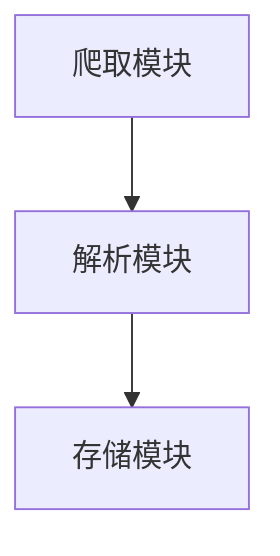

                 

# 基于网络爬虫的国内大数据人才需求可视化分析

> **关键词：** 网络爬虫、大数据、人才需求、可视化分析

> **摘要：** 本文将探讨如何利用网络爬虫技术获取国内大数据领域的人才需求信息，并通过可视化分析工具对数据进行处理和展示，从而揭示大数据行业的人才供需现状，为企业和个人提供有益的参考。

## 1. 背景介绍

随着互联网和大数据技术的飞速发展，数据已成为新时代的重要资产，大数据行业也因此呈现出蓬勃发展的态势。然而，随着行业需求的不断增长，大数据人才的短缺问题也愈发突出。为了更好地了解国内大数据人才市场的现状，本文将借助网络爬虫技术，对各大招聘网站和社交媒体平台上的大数据职位信息进行爬取和分析，并通过可视化工具对数据进行分析和展示。

### 1.1 网络爬虫的基本概念

网络爬虫（Web Crawler）是一种自动化程序，主要用于遍历互联网，抓取网页内容。它通过模拟浏览器行为，发送HTTP请求，获取网页HTML代码，并从中提取有用信息。网络爬虫广泛应用于搜索引擎、数据挖掘、舆情监测等领域。

### 1.2 大数据人才需求的重要性

大数据人才的短缺已成为制约我国大数据产业发展的重要因素。掌握大数据技术的专业人才不仅能够帮助企业和政府更好地利用数据，提升业务和治理水平，还有助于推动我国科技创新和产业升级。

### 1.3 可视化分析的作用

可视化分析是一种利用图表、图像等视觉元素展示数据的方法，能够帮助人们更直观地理解数据背后的规律和趋势。在人才需求分析中，可视化分析能够将大量的数据转化为易于理解的图表，从而为决策提供有力支持。

## 2. 核心概念与联系

### 2.1 网络爬虫的架构

网络爬虫通常由三个主要模块组成：爬取模块、解析模块和存储模块。爬取模块负责发送HTTP请求，获取网页内容；解析模块负责从HTML代码中提取有用信息；存储模块则将提取的信息保存到数据库或其他存储介质中。



### 2.2 大数据人才需求的指标

在分析大数据人才需求时，我们可以关注以下指标：

- **职位数量**：反映大数据领域的招聘需求强度。
- **职位类型**：了解大数据领域的主要岗位和职责。
- **薪资水平**：反映大数据人才的供需状况和竞争力。

### 2.3 可视化分析的工具

常见的可视化分析工具有：

- **ECharts**：一款强大的JavaScript图表库，支持多种图表类型。
- **D3.js**：一款基于Web标准的可视化库，具有高度灵活性和自定义性。
- **Tableau**：一款功能丰富的商业智能工具，支持多种数据源和图表类型。

## 3. 核心算法原理 & 具体操作步骤

### 3.1 网络爬虫算法原理

网络爬虫的核心算法主要包括：

- **URL队列**：用于存储待爬取的URL地址。
- **下载器**：负责发送HTTP请求，获取网页内容。
- **解析器**：从HTML代码中提取有用信息。
- **存储器**：将提取的信息保存到数据库或其他存储介质中。

具体操作步骤如下：

1. **初始化URL队列**：将初始URL地址加入队列。
2. **获取待爬取页面**：从URL队列中取出一个URL地址，发送HTTP请求获取网页内容。
3. **解析页面内容**：提取网页中的有用信息（如职位名称、薪资水平等）。
4. **更新URL队列**：将新发现的URL地址加入队列。
5. **循环执行**：重复步骤2-4，直至URL队列空为止。

### 3.2 数据处理算法原理

在获取大数据职位信息后，我们需要对数据进行处理，以便进行可视化分析。主要步骤包括：

- **数据清洗**：去除重复数据、缺失数据和噪声数据。
- **数据转换**：将数据格式转换为适合可视化分析的工具。
- **数据聚合**：对数据进行分组、统计和汇总。

### 3.3 可视化分析算法原理

可视化分析算法主要包括：

- **数据可视化**：将数据转换为图表、图像等视觉元素。
- **交互式探索**：支持用户对数据进行筛选、过滤和动态交互。
- **数据挖掘**：利用机器学习算法发现数据中的规律和趋势。

## 4. 数学模型和公式 & 详细讲解 & 举例说明

### 4.1 数据清洗与转换

在数据处理过程中，我们常常需要使用以下数学模型和公式：

- **去重算法**：使用哈希函数判断数据是否重复。
- **数据格式转换**：使用正则表达式或解析库将数据格式转换为适合可视化分析的工具。

### 4.2 数据聚合

在数据聚合过程中，我们可以使用以下数学模型和公式：

- **求和**：计算数据的总和。
- **平均数**：计算数据的平均值。
- **中位数**：计算数据的中位数。

### 4.3 数据可视化

在数据可视化过程中，我们可以使用以下数学模型和公式：

- **散点图**：计算数据点的坐标。
- **折线图**：计算数据点的连接线。
- **柱状图**：计算柱状图的宽度和高度。

## 5. 项目实战：代码实际案例和详细解释说明

### 5.1 开发环境搭建

在开始项目之前，我们需要搭建一个开发环境。以下是一个简单的开发环境搭建步骤：

1. 安装Python：从官方网站下载并安装Python。
2. 安装网络爬虫库：使用pip命令安装Scrapy库。
3. 安装数据处理库：使用pip命令安装Pandas库。
4. 安装可视化分析库：使用pip命令安装ECharts库。

### 5.2 源代码详细实现和代码解读

下面是一个简单的网络爬虫实现案例：

```python
import scrapy

class DataJobSpider(scrapy.Spider):
    name = 'data_job'
    allowed_domains = ['zhaopin.com']
    start_urls = ['https://www.zhaopin.com/jobs?kw=%E5%A4%A7%E6%95%B0%E6%8D%AE']

    def parse(self, response):
        jobs = response.css('div.search_results>div.result_list.clearfix>div.result>div.info')
        for job in jobs:
            title = job.css('div.title>a::attr(title)').get()
            salary = job.css('div.prosalary::text').get()
            company = job.css('div.company_name>a::text').get()
            yield {
                'title': title,
                'salary': salary,
                'company': company,
            }
```

这段代码定义了一个Scrapy爬虫类`DataJobSpider`，用于爬取招聘网站上关于大数据的职位信息。`allowed_domains`指定允许爬取的域名，`start_urls`指定爬取的起始URL。`parse`方法负责处理爬取到的网页内容，提取职位信息，并将其以字典形式yield出来。

### 5.3 代码解读与分析

- `import scrapy`：导入Scrapy库。
- `class DataJobSpider(scrapy.Spider)`：定义一个Scrapy爬虫类。
- `name = 'data_job'`：设置爬虫名称。
- `allowed_domains = ['zhaopin.com']`：设置允许爬取的域名。
- `start_urls = ['https://www.zhaopin.com/jobs?kw=%E5%A4%A7%E6%95%B0%E6%8D%AE']`：设置爬取的起始URL。
- `def parse(self, response)`：定义解析方法，用于处理爬取到的网页内容。
- `jobs = response.css('div.search_results>div.result_list.clearfix>div.result>div.info')`：使用CSS选择器定位职位信息。
- `for job in jobs:`：遍历提取到的职位信息。
- `title = job.css('div.title>a::attr(title)').get()`：提取职位名称。
- `salary = job.css('div.prosalary::text').get()`：提取薪资水平。
- `company = job.css('div.company_name>a::text').get()`：提取公司名称。
- `yield { 'title': title, 'salary': salary, 'company': company, }`：将提取到的职位信息以字典形式yield出来。

## 6. 实际应用场景

### 6.1 人才市场分析

利用网络爬虫和可视化分析技术，可以对大数据人才市场进行实时监控和分析。通过分析大数据职位数量、类型和薪资水平等指标，可以了解行业的发展趋势和人才供需状况。

### 6.2 企业招聘策略

企业可以利用大数据人才需求分析结果，调整招聘策略。例如，根据不同岗位的需求和薪资水平，优化招聘渠道和招聘流程，提高招聘效率。

### 6.3 个人职业规划

个人可以根据大数据人才需求分析结果，了解市场需求和自身竞争力，有针对性地提升技能和素质，规划职业发展路径。

## 7. 工具和资源推荐

### 7.1 学习资源推荐

- **《Python网络爬虫从入门到实践》**：适合初学者学习网络爬虫技术。
- **《大数据时代：生活、工作与思维的大变革》**：介绍大数据的概念和应用。
- **《数据可视化：使用ECharts进行数据可视化》**：详细介绍ECharts的使用方法。

### 7.2 开发工具框架推荐

- **Scrapy**：一款功能强大的网络爬虫框架。
- **Pandas**：一款用于数据清洗、转换和聚合的库。
- **ECharts**：一款用于数据可视化的JavaScript图表库。

### 7.3 相关论文著作推荐

- **《大数据之路：阿里巴巴大数据实践》**：介绍阿里巴巴在大数据领域的实践经验和技术积累。
- **《数据科学：机器学习基础》**：介绍机器学习的基础理论和应用方法。

## 8. 总结：未来发展趋势与挑战

### 8.1 发展趋势

- **技术进步**：随着人工智能和大数据技术的不断进步，网络爬虫和可视化分析技术将更加成熟和智能化。
- **行业应用**：大数据人才需求将继续增长，网络爬虫和可视化分析技术将在更多领域得到应用。

### 8.2 挑战

- **法律法规**：网络爬虫可能涉及法律法规问题，需要遵守相关法律法规。
- **数据隐私**：在网络爬取过程中，需要重视数据隐私问题，确保用户数据安全。

## 9. 附录：常见问题与解答

### 9.1 如何避免被网站反爬虫？

- **IP代理**：使用代理服务器，避免直接使用公网IP。
- **模拟浏览器行为**：模仿真实浏览器行为，如使用浏览器扩展插件。
- **延迟策略**：在爬取过程中设置适当的延迟，避免频繁请求。

### 9.2 如何处理大量的数据？

- **分布式爬取**：使用分布式爬取框架，提高爬取效率。
- **批处理**：将数据分为多个批次处理，避免内存溢出。

## 10. 扩展阅读 & 参考资料

- **《Python网络爬虫开发实战》**：详细介绍Python网络爬虫开发方法。
- **《大数据处理技术》**：介绍大数据处理的相关技术。
- **《数据可视化实战》**：介绍数据可视化工具的使用方法和技巧。

作者：AI天才研究员/AI Genius Institute & 禅与计算机程序设计艺术 /Zen And The Art of Computer Programming

【END】<|im_end|>

