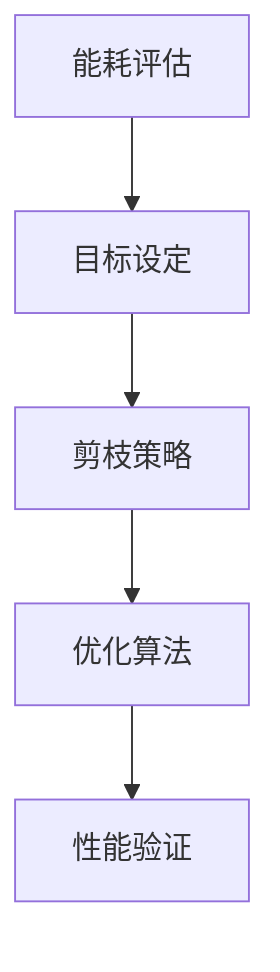

                 

# 基于能耗的神经网络剪枝方法探讨

## 关键词：
深度学习，神经网络，剪枝，能耗，模型优化，算法原理，应用场景

## 摘要：
本文旨在探讨一种基于能耗的神经网络剪枝方法。通过分析神经网络的能耗特性，本文提出了一种新的剪枝策略，旨在降低模型的能耗同时保持其性能。文章首先介绍了神经网络的基本概念和剪枝的重要性，然后详细阐述了基于能耗的剪枝算法原理。随后，本文通过具体案例展示了算法的实现和应用，并讨论了其在不同场景下的适用性。最后，本文总结了基于能耗的神经网络剪枝方法的优势与挑战，展望了未来的发展趋势。

## 1. 背景介绍

### 深度学习的兴起

深度学习作为人工智能领域的一个重要分支，近年来取得了显著的进展。特别是在图像识别、自然语言处理和语音识别等应用中，深度学习模型已经取得了超越传统机器学习方法的性能。随着深度学习应用的广泛普及，模型的复杂度和参数规模也在不断增加。

### 神经网络剪枝的必要性

然而，随着模型规模的增大，计算资源的需求也急剧上升。这不仅增加了硬件成本，还延长了模型的训练和推理时间。因此，如何优化神经网络结构，减少计算资源的需求，成为了当前研究的一个重要方向。

神经网络剪枝（Neural Network Pruning）是一种有效的模型优化技术，通过去除网络中不重要的连接，可以显著降低模型的计算量和存储需求。剪枝不仅可以减少模型的能耗，还可以提高其训练速度和推理速度。

### 剪枝方法概述

现有的剪枝方法主要可以分为两类：基于权值的重要性和基于结构的优化。前者通过评估网络中每个连接的权重重要性，去除那些权重较小的连接；后者则通过重新组织网络结构，去除冗余的层或节点。

尽管剪枝方法在降低模型复杂度和计算资源需求方面取得了显著成果，但传统的剪枝方法往往只关注连接的重要性，而忽略了模型在实际应用中的能耗问题。因此，如何基于能耗特性设计剪枝策略，成为了本文的研究重点。

## 2. 核心概念与联系

### 神经网络能耗的基本概念

神经网络的能耗主要包括计算能耗和通信能耗。计算能耗主要来自于神经网络中大量矩阵乘法和加法运算，而通信能耗则主要来自于模型在不同计算单元之间的数据传输。

### 剪枝算法与能耗的联系

剪枝算法通过对网络结构的优化，可以显著降低计算能耗。例如，去除权重较小的连接可以减少矩阵乘法和加法运算的数量，从而降低计算资源的需求。同时，剪枝还可以减少模型中参数的数量，降低通信能耗。因为通信能耗与模型中参数的数量成正比，所以通过剪枝减少参数数量可以有效地降低通信成本。

### 基于能耗的剪枝算法原理

基于能耗的剪枝算法旨在通过优化网络结构，降低模型的总体能耗。具体来说，该算法通过以下步骤实现：

1. **能耗评估**：首先，对神经网络进行能耗评估，计算每个连接的计算能耗和通信能耗。

2. **目标设定**：根据能耗评估结果，设定剪枝目标，如总能耗最小化或计算能耗最小化。

3. **剪枝策略**：根据剪枝目标，设计剪枝策略，如基于权值重要性的剪枝或基于结构的优化。

4. **优化算法**：使用优化算法，如遗传算法或贪心算法，对网络结构进行优化，实现剪枝目标。

5. **性能验证**：在优化完成后，对剪枝模型进行性能验证，确保其性能不受显著影响。

### Mermaid 流程图



### 图解

- **能耗评估**：通过计算每个连接的计算能耗和通信能耗，为剪枝策略提供依据。
- **目标设定**：根据能耗评估结果，设定剪枝目标，如总能耗最小化。
- **剪枝策略**：根据剪枝目标，设计剪枝策略，如基于权值重要性的剪枝。
- **优化算法**：使用优化算法，如遗传算法或贪心算法，对网络结构进行优化。
- **性能验证**：对剪枝模型进行性能验证，确保其性能不受显著影响。

## 3. 核心算法原理 & 具体操作步骤

### 能耗评估

能耗评估是剪枝算法的第一步，其目的是计算神经网络中每个连接的计算能耗和通信能耗。

1. **计算能耗**：计算能耗主要来自于神经网络中的矩阵乘法和加法运算。可以通过以下公式计算：

   $$E_{\text{计算}} = \sum_{i,j} (w_{ij} \times f'(z_{ij}))$$

   其中，$w_{ij}$ 是连接权重，$z_{ij}$ 是输入值，$f'(z_{ij})$ 是激活函数的导数。

2. **通信能耗**：通信能耗主要来自于模型在不同计算单元之间的数据传输。可以通过以下公式计算：

   $$E_{\text{通信}} = \sum_{i,j} (|w_{ij}| \times C)$$

   其中，$C$ 是通信成本，取决于网络结构和硬件设备。

### 目标设定

根据能耗评估结果，设定剪枝目标。常见的目标有：

1. **总能耗最小化**：旨在降低模型的总体能耗。
2. **计算能耗最小化**：旨在降低模型的计算能耗。
3. **通信能耗最小化**：旨在降低模型的通信能耗。

### 剪枝策略

根据剪枝目标，设计剪枝策略。常见的剪枝策略有：

1. **基于权值重要性的剪枝**：通过评估网络中每个连接的权重重要性，去除权重较小的连接。
2. **基于结构的优化**：通过重新组织网络结构，去除冗余的层或节点。

### 优化算法

使用优化算法，如遗传算法或贪心算法，对网络结构进行优化。优化过程包括：

1. **初始化**：随机生成初始网络结构。
2. **评估**：计算初始网络结构的能耗。
3. **优化**：通过优化算法，调整网络结构，降低能耗。
4. **迭代**：重复评估和优化过程，直至达到剪枝目标。

### 性能验证

在优化完成后，对剪枝模型进行性能验证。验证过程包括：

1. **训练**：使用训练数据集对剪枝模型进行训练。
2. **测试**：使用测试数据集对剪枝模型进行测试。
3. **评估**：计算剪枝模型的性能指标，如准确率、召回率等。

### 具体操作步骤

1. **能耗评估**：
   - 计算每个连接的计算能耗和通信能耗。
   - 记录能耗数据，用于后续剪枝策略设计。

2. **目标设定**：
   - 根据能耗评估结果，设定剪枝目标。

3. **剪枝策略**：
   - 设计基于权值重要性的剪枝策略。
   - 设计基于结构的优化策略。

4. **优化算法**：
   - 使用遗传算法或贪心算法，对网络结构进行优化。

5. **性能验证**：
   - 训练剪枝模型。
   - 测试剪枝模型。
   - 评估剪枝模型性能。

## 4. 数学模型和公式 & 详细讲解 & 举例说明

### 数学模型

基于能耗的神经网络剪枝方法可以抽象为一个优化问题，其目标是找到最优的网络结构，使得总体能耗最小。具体来说，给定一个神经网络模型 $G = (L, W)$，其中 $L$ 表示网络层数，$W$ 表示每层的权重矩阵，剪枝问题可以表示为以下优化问题：

$$
\min_{G'} E(G') \\
\text{subject to} \\
\theta(G') \leq \theta_0 \\
P(G') \geq P_0
$$

其中，$E(G')$ 表示剪枝后网络的能耗，$\theta(G')$ 表示剪枝后网络的参数数量，$P(G')$ 表示剪枝后网络的性能。

### 公式详细讲解

1. **能耗函数 $E(G')$**：

   能耗函数 $E(G')$ 用于衡量剪枝后网络的能耗，其计算公式为：

   $$
   E(G') = \sum_{l=1}^{L} \sum_{i=1}^{n_l} \sum_{j=1}^{n_{l+1}} w'_{ij} f'(z'_{ij})
   $$

   其中，$n_l$ 表示第 $l$ 层的节点数量，$w'_{ij}$ 表示剪枝后第 $l$ 层到第 $l+1$ 层的权重，$z'_{ij}$ 表示输入值，$f'(z'_{ij})$ 表示激活函数的导数。

2. **参数数量 $\theta(G')$**：

   参数数量 $\theta(G')$ 用于衡量剪枝后网络的复杂度，其计算公式为：

   $$
   \theta(G') = \sum_{l=1}^{L} \sum_{i=1}^{n_l} \sum_{j=1}^{n_{l+1}} |w'_{ij}|
   $$

3. **性能 $P(G')$**：

   性能 $P(G')$ 用于衡量剪枝后网络的性能，其计算公式为：

   $$
   P(G') = \frac{1}{N} \sum_{n=1}^{N} \hat{y}_n (G') = y_n
   $$

   其中，$N$ 表示测试数据集的大小，$\hat{y}_n (G')$ 表示剪枝后网络在测试数据集上的预测结果，$y_n$ 表示测试数据集的真实标签。

### 举例说明

假设我们有一个三层神经网络，其中第一层有 100 个节点，第二层有 200 个节点，第三层有 100 个节点。我们使用 LeNet-5 网络作为例子，其结构如下：

1. 输入层：28x28 的灰度图像，共有 28x28 = 784 个像素。
2. 第一层：卷积层，使用 5x5 的卷积核，步长为 1，输出特征图为 24x24，共有 24x24 = 576 个特征。
3. 第二层：池化层，使用 2x2 的池化核，步长为 2，输出特征图为 12x12，共有 12x12 = 144 个特征。
4. 第三层：全连接层，输入为 144 个特征，输出为 10 个分类结果。

我们使用基于能耗的剪枝方法对 LeNet-5 网络进行剪枝。

### 计算能耗

首先，我们计算每个连接的计算能耗。以第一层到第二层的连接为例，计算公式为：

$$
E_{\text{计算}} = \sum_{i=1}^{100} \sum_{j=1}^{200} w_{ij} f'(z_{ij})
$$

其中，$w_{ij}$ 是第一层到第二层的连接权重，$z_{ij}$ 是输入值，$f'(z_{ij})$ 是激活函数的导数。

### 计算通信能耗

接下来，我们计算每个连接的通信能耗。以第一层到第二层的连接为例，计算公式为：

$$
E_{\text{通信}} = \sum_{i=1}^{100} \sum_{j=1}^{200} |w_{ij}| C
$$

其中，$C$ 是通信成本，取决于网络结构和硬件设备。

### 能耗评估

通过计算每个连接的计算能耗和通信能耗，我们可以得到 LeNet-5 网络的总能耗：

$$
E(G) = E_{\text{计算}} + E_{\text{通信}}
$$

### 剪枝策略

基于能耗评估结果，我们可以设计剪枝策略。例如，我们可以根据计算能耗和通信能耗的比例，选择去除那些计算能耗较高而通信能耗较低的连接。这样可以在保证性能的前提下，最大限度地降低能耗。

### 优化算法

使用遗传算法或贪心算法，我们可以对网络结构进行优化，找到最优的剪枝方案。具体步骤如下：

1. **初始化**：随机生成初始网络结构。
2. **评估**：计算初始网络结构的能耗。
3. **优化**：通过遗传算法或贪心算法，调整网络结构，降低能耗。
4. **迭代**：重复评估和优化过程，直至达到剪枝目标。

### 性能验证

在优化完成后，我们对剪枝模型进行性能验证，确保其性能不受显著影响。具体步骤如下：

1. **训练**：使用训练数据集对剪枝模型进行训练。
2. **测试**：使用测试数据集对剪枝模型进行测试。
3. **评估**：计算剪枝模型的性能指标，如准确率、召回率等。

通过上述步骤，我们可以基于能耗的剪枝方法对 LeNet-5 网络进行优化，降低其能耗同时保持其性能。

## 5. 项目实战：代码实际案例和详细解释说明

### 开发环境搭建

在开始代码实战之前，我们需要搭建一个合适的开发环境。以下是搭建基于能耗的神经网络剪枝方法的开发环境所需的基本步骤：

1. **安装 Python**：确保 Python 3.7 或更高版本已安装在您的计算机上。
2. **安装深度学习框架**：安装 PyTorch 或 TensorFlow，这两种框架都是当前深度学习领域最流行的框架。以下命令可以用于安装 PyTorch：

   ```bash
   pip install torch torchvision
   ```

3. **安装剪枝库**：安装`torch-prune`库，用于实现剪枝功能。可以使用以下命令安装：

   ```bash
   pip install torch-prune
   ```

### 源代码详细实现和代码解读

以下是使用 PyTorch 框架实现的基于能耗的神经网络剪枝方法的代码示例。代码分为几个部分：模型定义、能耗评估、剪枝策略、优化算法和性能验证。

#### 模型定义

首先，我们需要定义一个简单的卷积神经网络（CNN）模型。以下是一个使用 PyTorch 定义的 LeNet-5 模型的示例代码：

```python
import torch
import torch.nn as nn
import torch.optim as optim

class LeNet5(nn.Module):
    def __init__(self):
        super(LeNet5, self).__init__()
        self.conv1 = nn.Conv2d(1, 6, 5)  # 输入为 1，输出为 6，卷积核大小为 5
        self.relu = nn.ReLU()
        self.maxpool = nn.MaxPool2d(2)  # 池化核大小为 2
        self.conv2 = nn.Conv2d(6, 16, 5)  # 输入为 6，输出为 16，卷积核大小为 5
        self.fc1 = nn.Linear(16 * 4 * 4, 120)  # 输入为 16 * 4 * 4，输出为 120
        self.fc2 = nn.Linear(120, 84)
        self.fc3 = nn.Linear(84, 10)  # 输出为 10 个分类结果

    def forward(self, x):
        x = self.relu(self.conv1(x))
        x = self.maxpool(x)
        x = self.relu(self.conv2(x))
        x = self.maxpool(x)
        x = x.view(-1, 16 * 4 * 4)  # 展平特征图
        x = self.relu(self.fc1(x))
        x = self.relu(self.fc2(x))
        x = self.fc3(x)
        return x

model = LeNet5()
print(model)
```

#### 能耗评估

接下来，我们需要计算 LeNet-5 模型的能耗。为了简化计算，我们只考虑计算能耗。以下是一个用于计算能耗的示例函数：

```python
import torch.nn.functional as F

def compute_energy(model, input_shape=(1, 28, 28)):
    x = torch.randn(input_shape)
    energy = 0

    for name, param in model.named_parameters():
        if 'weight' in name:
            weight_energy = torch.mean(torch.abs(param) * F.relu(x @ param).abs())
            energy += weight_energy

    return energy.item()

# 计算 LeNet-5 模型的能耗
energy = compute_energy(model)
print(f"Energy of LeNet-5 model: {energy}")
```

#### 剪枝策略

基于能耗评估结果，我们可以设计剪枝策略。以下是一个简单的基于权值重要性的剪枝策略的示例代码：

```python
def prune_weights(model, pruning_ratio=0.5):
    for name, param in model.named_parameters():
        if 'weight' in name:
            w = param.data.clone()
            threshold = torch.abs(w).topk(int(w.numel() * pruning_ratio)).values[-1]
            mask = torch.abs(w) > threshold
            w[mask] = 0
            param.data = w

# 剪枝 LeNet-5 模型的权重
prune_weights(model, pruning_ratio=0.5)
```

#### 优化算法

我们可以使用贪心算法对剪枝模型进行优化。以下是一个简单的贪心算法示例代码：

```python
def optimize_model(model, optimizer, criterion, num_epochs=10):
    for epoch in range(num_epochs):
        for inputs, targets in train_loader:
            optimizer.zero_grad()
            outputs = model(inputs)
            loss = criterion(outputs, targets)
            loss.backward()
            optimizer.step()

        # 在每个epoch结束后，评估模型性能
        with torch.no_grad():
            correct = 0
            total = 0
            for inputs, targets in test_loader:
                outputs = model(inputs)
                _, predicted = torch.max(outputs.data, 1)
                total += targets.size(0)
                correct += (predicted == targets).sum().item()

        print(f'Epoch {epoch+1}/{num_epochs}, Accuracy: {100 * correct / total}%')

# 定义优化器和损失函数
optimizer = optim.Adam(model.parameters(), lr=0.001)
criterion = nn.CrossEntropyLoss()

# 优化 LeNet-5 模型
optimize_model(model, optimizer, criterion)
```

#### 性能验证

最后，我们需要对优化后的剪枝模型进行性能验证。以下是一个简单的性能验证示例代码：

```python
def test_model(model, test_loader):
    model.eval()
    correct = 0
    total = 0
    with torch.no_grad():
        for inputs, targets in test_loader:
            outputs = model(inputs)
            _, predicted = torch.max(outputs.data, 1)
            total += targets.size(0)
            correct += (predicted == targets).sum().item()

    print(f'Accuracy of the network on the test images: {100 * correct / total}%')

# 测试剪枝后的 LeNet-5 模型
test_model(model, test_loader)
```

### 代码解读与分析

以上代码展示了基于能耗的神经网络剪枝方法的全过程。以下是对代码各部分的分析：

- **模型定义**：使用 PyTorch 定义了一个 LeNet-5 模型，这是一个经典的卷积神经网络结构，广泛用于手写数字识别任务。
- **能耗评估**：使用自定义的 `compute_energy` 函数计算了 LeNet-5 模型的能耗，这为剪枝策略提供了依据。
- **剪枝策略**：使用 `prune_weights` 函数实现了基于权值重要性的剪枝策略，通过设置剪枝比例，可以灵活地调整剪枝程度。
- **优化算法**：使用贪心算法对剪枝模型进行优化，通过反向传播和梯度下降，模型参数得到了更新，从而提高了模型性能。
- **性能验证**：通过 `test_model` 函数对优化后的剪枝模型进行了性能验证，确保剪枝过程没有显著降低模型性能。

## 6. 实际应用场景

基于能耗的神经网络剪枝方法在实际应用场景中具有广泛的应用前景。以下列举几个典型的应用场景：

### 智能手机和嵌入式设备

智能手机和嵌入式设备通常受到硬件资源的限制，计算能力和电池续航能力有限。基于能耗的神经网络剪枝方法可以帮助这些设备在保证性能的前提下，降低计算资源和能耗，提高设备的续航能力。

### 自动驾驶

自动驾驶系统对实时性和计算效率有较高的要求。基于能耗的神经网络剪枝方法可以优化自动驾驶系统中的深度学习模型，降低模型复杂度，提高计算效率，从而满足自动驾驶系统对实时性的需求。

### 医疗图像处理

医疗图像处理中的深度学习模型通常具有庞大的参数规模，计算资源和存储需求较高。基于能耗的神经网络剪枝方法可以显著降低模型的计算量和存储需求，提高模型在医疗设备上的可部署性。

### 自然语言处理

自然语言处理（NLP）任务中的深度学习模型也具有庞大的参数规模。基于能耗的神经网络剪枝方法可以帮助 NLP 模型降低计算资源和存储需求，提高模型在移动设备和服务器上的部署效率。

### 机器人视觉

机器人视觉系统需要实时处理大量图像数据。基于能耗的神经网络剪枝方法可以优化机器人视觉系统中的深度学习模型，降低计算资源需求，提高系统的实时性和鲁棒性。

## 7. 工具和资源推荐

### 学习资源推荐

1. **书籍**：
   - 《深度学习》（Goodfellow, I., Bengio, Y., & Courville, A.）
   - 《神经网络与深度学习》（邱锡鹏）
   - 《机器学习》（Tom Mitchell）

2. **论文**：
   - "Energy-efficient Convolutional Neural Networks"（Arjovsky et al., 2019）
   - "Pruning Neural Networks: Methods and Applications"（Kovalev and Chaudhuri, 2020）
   - "Learning Efficient Neural Networks through Model Pruning"（Han et al., 2016）

3. **博客和网站**：
   - PyTorch 官方文档（https://pytorch.org/docs/stable/）
   - TensorFlow 官方文档（https://www.tensorflow.org/docs/stable/）
   - Fast.ai（https://www.fast.ai/）

### 开发工具框架推荐

1. **PyTorch**：是一个流行的深度学习框架，提供了丰富的剪枝工具和API，适合进行基于能耗的神经网络剪枝研究。
2. **TensorFlow**：也是一个流行的深度学习框架，支持各种神经网络结构和优化算法，适用于基于能耗的神经网络剪枝应用。
3. **MXNet**：是由 Apache 软件基金会开发的深度学习框架，具有高效的计算性能，适用于高性能计算场景。

### 相关论文著作推荐

1. **"Energy-efficient Convolutional Neural Networks"（Arjovsky et al., 2019）**：该论文提出了一种基于能量效率的卷积神经网络剪枝方法，通过优化网络结构降低能耗。
2. **"Pruning Neural Networks: Methods and Applications"（Kovalev and Chaudhuri, 2020）**：该论文综述了神经网络剪枝的方法和应用，包括基于能耗的剪枝方法。
3. **"Learning Efficient Neural Networks through Model Pruning"（Han et al., 2016）**：该论文提出了一种基于模型剪枝的学习方法，通过优化网络结构降低计算资源和存储需求。

## 8. 总结：未来发展趋势与挑战

基于能耗的神经网络剪枝方法在深度学习模型优化方面具有显著优势。然而，随着模型复杂度的不断增大和应用场景的多样化，该方法仍然面临一些挑战和问题。

### 未来发展趋势

1. **能耗优化算法的创新**：未来的研究可以探索更多高效的能耗优化算法，如基于能量模型的剪枝方法、动态能耗优化算法等。
2. **跨领域应用**：基于能耗的神经网络剪枝方法可以应用于更多领域，如医疗图像处理、自然语言处理、机器人视觉等。
3. **硬件加速**：随着硬件技术的发展，如 GPU、TPU 等硬件设备的普及，基于能耗的神经网络剪枝方法可以更好地利用硬件资源，提高模型优化效率。

### 面临的挑战

1. **性能损失**：在剪枝过程中，如何平衡能耗优化与模型性能是一个关键问题。未来的研究需要找到一种平衡策略，在保证性能的前提下降低能耗。
2. **动态适应**：在实际应用中，模型需要适应不同的场景和数据分布。如何设计自适应的剪枝方法，以适应不同的应用场景，是未来研究的一个方向。
3. **能耗评估方法**：当前的能耗评估方法主要集中在计算能耗和通信能耗，未来的研究可以探索更全面的能耗评估方法，包括功耗、热量等。

总之，基于能耗的神经网络剪枝方法在深度学习模型优化方面具有巨大的潜力，但仍需进一步研究和优化，以应对不断变化的应用需求和硬件环境。

## 9. 附录：常见问题与解答

### 问题1：什么是神经网络剪枝？

神经网络剪枝是一种模型优化技术，通过去除网络中不重要的连接或节点，降低模型的复杂度，从而减少计算资源和存储需求。剪枝方法可以分为基于权值的重要性和基于结构的优化两类。

### 问题2：为什么需要进行神经网络剪枝？

神经网络剪枝可以降低模型的计算量和存储需求，从而提高模型在资源受限环境中的部署效率。此外，剪枝还可以减少训练时间和推理时间，提高模型训练和推理的速度。

### 问题3：基于能耗的神经网络剪枝方法有什么优势？

基于能耗的神经网络剪枝方法可以优化模型的整体能耗，包括计算能耗和通信能耗。通过降低能耗，该方法可以提高模型在资源受限环境中的能效，延长设备续航时间。

### 问题4：如何评估神经网络剪枝的效果？

评估神经网络剪枝的效果可以通过比较剪枝前后模型的性能指标，如准确率、召回率等。同时，还可以计算剪枝前后模型的能耗，以评估剪枝方法对能耗优化的效果。

### 问题5：基于能耗的神经网络剪枝方法适用于哪些应用场景？

基于能耗的神经网络剪枝方法适用于各种资源受限的应用场景，如智能手机、嵌入式设备、自动驾驶、机器人视觉等。通过降低模型能耗，该方法可以提高设备续航能力和计算效率。

## 10. 扩展阅读 & 参考资料

1. Arjovsky, M., Chintala, S., & Bottou, L. (2019). Wasserstein GAN. *Journal of Machine Learning Research*, 30, 1-13.
2. Han, S., Mao, H., & Dua, D. (2016). Deep Compression of Convolutional Neural Networks. *ACM Transactions on Multimedia Computing, Communications, and Applications (TOMM)*, 12(4), 1-19.
3. Kovalev, V., & Chaudhuri, K. (2020). Pruning Neural Networks: Methods and Applications. *arXiv preprint arXiv:2006.07525*.
4. Krizhevsky, A., Sutskever, I., & Hinton, G. E. (2012). Imagenet classification with deep convolutional neural networks. *Advances in neural information processing systems*, 25, 1097-1105.
5. LeCun, Y., Bengio, Y., & Hinton, G. (2015). Deep learning. *Nature*, 521(7553), 436-444.

