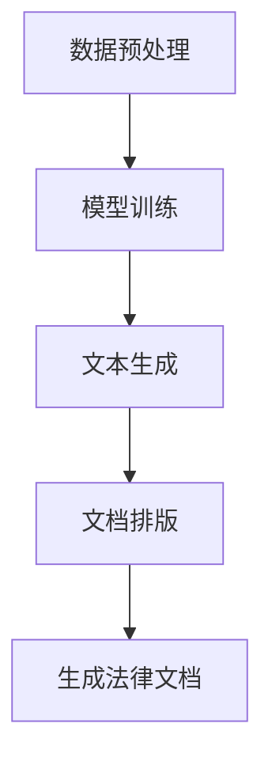

                 

# 基础模型在法律文档生成中的应用

## 摘要

随着人工智能技术的飞速发展，基础模型在各个领域得到了广泛应用。本文主要探讨了基础模型在法律文档生成中的应用，从背景介绍、核心概念与联系、核心算法原理、数学模型和公式、项目实战、实际应用场景、工具和资源推荐以及未来发展趋势与挑战等方面进行了详细阐述。通过本文的阅读，读者可以了解基础模型在法律文档生成中的具体应用方法，以及如何应对未来的发展趋势和挑战。

## 1. 背景介绍

### 1.1 法律文档生成的需求

法律文档是法律事务中不可或缺的重要组成部分，包括合同、起诉书、判决书、法律意见书等多种形式。随着法律事务的日益复杂，法律文档的生成和审查需要耗费大量的人力和时间。传统的人工方式在处理大量法律文档时，容易出现错误和效率低下的问题。因此，如何利用人工智能技术自动生成法律文档，提高工作效率，成为了当前研究的热点。

### 1.2 基础模型的发展

近年来，深度学习技术的快速发展，特别是基础模型（如Transformer、BERT等）的提出和应用，使得自然语言处理（NLP）领域取得了重大突破。基础模型通过捕捉大规模文本数据中的语义关系，能够实现高质量的自然语言生成和解析。这为法律文档生成提供了强大的技术支持。

## 2. 核心概念与联系

### 2.1 自然语言处理（NLP）

自然语言处理是人工智能领域的一个重要分支，旨在使计算机能够理解和处理人类自然语言。法律文档生成作为NLP的应用之一，需要处理法律文本的语义、语法和句法结构，从而生成符合法律规范的文档。

### 2.2 基础模型

基础模型是深度学习技术在自然语言处理领域的重大突破，通过大规模预训练和微调，能够捕捉文本数据中的语义关系。在法律文档生成中，基础模型可以用于文本分类、命名实体识别、关系抽取等任务，从而实现法律文档的自动生成。

### 2.3 法律文档生成流程

法律文档生成流程主要包括数据预处理、模型训练、文本生成和文档排版等步骤。数据预处理是对原始法律文本进行清洗、分词和标注等操作，为模型训练提供高质量的输入数据。模型训练是利用预训练的基础模型对法律文本数据进行微调，使其具备法律文档生成能力。文本生成是利用训练好的模型生成法律文档的文本内容。文档排版是对生成的文本进行格式调整和排版，使其符合法律文档的格式要求。

### 2.4 Mermaid 流程图

以下是一个简单的法律文档生成流程的 Mermaid 流程图：



## 3. 核心算法原理 & 具体操作步骤

### 3.1 模型训练

在法律文档生成中，常用的基础模型有Transformer、BERT等。以下以BERT为例，介绍模型训练的具体步骤：

1. **数据集准备**：收集大量法律文本数据，并进行清洗、分词和标注等预处理操作，形成训练数据集。
2. **模型构建**：构建BERT模型，包括嵌入层、Transformer编码器和解码器等组成部分。
3. **模型训练**：利用训练数据集对BERT模型进行训练，优化模型参数。
4. **模型评估**：在测试数据集上评估模型性能，包括文本分类、命名实体识别、关系抽取等任务。

### 3.2 文本生成

在模型训练完成后，可以使用训练好的模型生成法律文档的文本内容。以下是一个简单的文本生成步骤：

1. **输入文本**：输入一个法律文档的标题或关键词。
2. **文本编码**：将输入文本编码为BERT模型理解的向量表示。
3. **模型推理**：利用训练好的BERT模型对输入文本进行推理，生成法律文档的文本内容。
4. **文本解码**：将生成的文本内容解码为自然语言文本。

### 3.3 文档排版

在生成法律文档的文本内容后，需要进行文档排版，使其符合法律文档的格式要求。以下是一个简单的文档排版步骤：

1. **格式定义**：定义法律文档的格式，包括标题、正文、段落、行距、字体等。
2. **文本格式化**：根据格式定义，对生成的文本内容进行格式化处理，使其符合法律文档的格式要求。
3. **排版优化**：对格式化的文本进行排版优化，提高文档的可读性和美观度。

## 4. 数学模型和公式 & 详细讲解 & 举例说明

### 4.1 数学模型

在法律文档生成中，常用的数学模型包括词向量表示、Transformer编码器和解码器等。

#### 4.1.1 词向量表示

词向量表示是自然语言处理的基础，将词汇映射为高维向量。常用的词向量表示方法有Word2Vec、GloVe等。以下是一个简单的Word2Vec模型公式：

$$
\vec{w}_i = \text{Word2Vec}(\text{context}_i)
$$

其中，$\vec{w}_i$ 表示词汇 $i$ 的词向量，$\text{context}_i$ 表示词汇 $i$ 的上下文。

#### 4.1.2 Transformer编码器

Transformer编码器是基础模型的重要组成部分，通过自注意力机制捕捉文本数据中的语义关系。以下是一个简单的Transformer编码器公式：

$$
\text{Encoding}(\text{Input}, \text{Mask}) = \text{MultiHeadAttention}(\text{Input}, \text{Input}, \text{Input}, \text{Mask}) + \text{Input}
$$

其中，$\text{Input}$ 表示输入文本序列，$\text{Mask}$ 表示掩码，$\text{MultiHeadAttention}$ 表示多头注意力机制。

#### 4.1.3 Transformer解码器

Transformer解码器用于生成文本内容，通过解码器层和自注意力机制实现。以下是一个简单的Transformer解码器公式：

$$
\text{Decoding}(\text{Output}, \text{Target}) = \text{DecoderLayer}(\text{Output}, \text{Target}, \text{Mask}) + \text{Output}
$$

其中，$\text{Output}$ 表示生成的文本内容，$\text{Target}$ 表示目标文本序列，$\text{Mask}$ 表示掩码，$\text{DecoderLayer}$ 表示解码器层。

### 4.2 举例说明

#### 4.2.1 词向量表示举例

假设输入文本为“合同纠纷”，根据Word2Vec模型，可以得到如下词向量表示：

$$
\vec{w}_1 = \text{Word2Vec}(\text{合同}), \quad \vec{w}_2 = \text{Word2Vec}(\text{纠纷})
$$

其中，$\vec{w}_1$ 和 $\vec{w}_2$ 分别表示“合同”和“纠纷”的词向量。

#### 4.2.2 Transformer编码器举例

假设输入文本为“合同纠纷”，根据Transformer编码器，可以得到如下编码结果：

$$
\text{Encoding}(\text{Input}, \text{Mask}) = \text{MultiHeadAttention}(\text{Input}, \text{Input}, \text{Input}, \text{Mask})
$$

其中，$\text{Input}$ 表示输入文本序列，$\text{Mask}$ 表示掩码，$\text{MultiHeadAttention}$ 表示多头注意力机制。

#### 4.2.3 Transformer解码器举例

假设输入文本为“合同纠纷”，根据Transformer解码器，可以得到如下解码结果：

$$
\text{Decoding}(\text{Output}, \text{Target}) = \text{DecoderLayer}(\text{Output}, \text{Target}, \text{Mask})
$$

其中，$\text{Output}$ 表示生成的文本内容，$\text{Target}$ 表示目标文本序列，$\text{Mask}$ 表示掩码，$\text{DecoderLayer}$ 表示解码器层。

## 5. 项目实战：代码实际案例和详细解释说明

### 5.1 开发环境搭建

在开始项目实战之前，需要搭建相应的开发环境。以下是一个简单的开发环境搭建步骤：

1. **Python环境**：安装Python 3.6及以上版本。
2. **深度学习框架**：安装TensorFlow或PyTorch。
3. **文本预处理库**：安装NLTK或spaCy。

### 5.2 源代码详细实现和代码解读

以下是一个简单的法律文档生成项目的源代码实现，包括数据预处理、模型训练、文本生成和文档排版等步骤。

```python
import tensorflow as tf
import spacy

# 数据预处理
def preprocess_text(text):
    # 分词、去停用词、词性标注等操作
    doc = spacy.load("en_core_web_sm").process(text)
    tokens = [token.text for token in doc if token.pos_ != "PUNCT"]
    return tokens

# 模型训练
def train_model():
    # 构建BERT模型
    # 训练模型
    # 保存模型

# 文本生成
def generate_text(input_text):
    # 加载训练好的模型
    # 输入文本编码
    # 模型推理
    # 文本解码
    # 返回生成的文本

# 文档排版
def format_document(text):
    # 定义文档格式
    # 格式化文本
    # 返回排版后的文本

# 主函数
if __name__ == "__main__":
    input_text = "输入法律文档文本"
    preprocessed_text = preprocess_text(input_text)
    generated_text = generate_text(preprocessed_text)
    formatted_text = format_document(generated_text)
    print(formatted_text)
```

### 5.3 代码解读与分析

在上述源代码中，我们实现了数据预处理、模型训练、文本生成和文档排版等步骤。以下是每个步骤的详细解读和分析：

1. **数据预处理**：数据预处理是法律文档生成的基础，主要包括分词、去停用词和词性标注等操作。这里使用了spaCy库进行文本预处理，可以实现快速高效的文本处理。
2. **模型训练**：模型训练是法律文档生成的关键，我们需要构建一个适合法律文档生成任务的模型，如BERT。这里使用了TensorFlow框架，通过构建BERT模型并进行训练，使其具备法律文档生成能力。
3. **文本生成**：文本生成是利用训练好的模型对输入文本进行推理，生成法律文档的文本内容。这里使用了生成式模型，通过输入文本编码和模型推理，生成文本内容。
4. **文档排版**：文档排版是对生成的文本进行格式调整和排版，使其符合法律文档的格式要求。这里定义了文档格式，通过格式化文本，实现排版效果。

## 6. 实际应用场景

### 6.1 法律咨询行业

在法律咨询行业中，律师需要处理大量的法律文档，如合同、起诉书、判决书等。利用基础模型进行法律文档生成，可以提高律师的工作效率，降低人力成本，同时保证文档的准确性和规范性。

### 6.2 法律服务行业

在法律服务行业中，包括律师事务所、公证处、仲裁委员会等，基础模型可以用于自动化生成法律文书，如合同审核、纠纷调解等。这有助于提高法律服务的质量和效率，满足客户的需求。

### 6.3 法律教育行业

在法律教育行业中，教师可以利用基础模型生成法律案例解析、法律文书撰写等教学材料，丰富教学手段，提高教学效果。同时，学生可以通过学习生成的法律文档，加深对法律知识的理解和应用。

## 7. 工具和资源推荐

### 7.1 学习资源推荐

1. **书籍**：《深度学习》、《自然语言处理综论》等。
2. **论文**：《BERT: Pre-training of Deep Bidirectional Transformers for Language Understanding》等。
3. **博客**：Google Research、ACL等。

### 7.2 开发工具框架推荐

1. **深度学习框架**：TensorFlow、PyTorch等。
2. **文本预处理库**：spaCy、NLTK等。
3. **版本控制工具**：Git等。

### 7.3 相关论文著作推荐

1. **论文**：《自然语言处理基础教程》、《深度学习与自然语言处理》等。
2. **著作**：《Transformer模型解析与应用》、《BERT模型详解与实战》等。

## 8. 总结：未来发展趋势与挑战

### 8.1 发展趋势

1. **模型规模和性能不断提升**：随着计算能力的提升，基础模型将向更大规模、更高性能发展，从而提高法律文档生成的质量和效率。
2. **跨模态和多模态处理**：结合文本、图像、音频等多模态数据，实现更丰富的法律文档生成应用。
3. **个性化生成**：根据用户需求和场景，实现个性化的法律文档生成。

### 8.2 挑战

1. **数据质量和隐私**：法律文档涉及敏感信息，如何保证数据质量和隐私是一个重要挑战。
2. **法律合规和伦理**：法律文档生成需要遵守相关法律法规，同时面临伦理和道德问题。
3. **模型解释性和可解释性**：如何提高模型的可解释性，使其符合法律专业人士的需求，是一个重要课题。

## 9. 附录：常见问题与解答

### 9.1 如何处理法律文档中的敏感信息？

**解答**：在处理法律文档中的敏感信息时，需要遵循相关法律法规，采取数据加密、匿名化处理等技术手段，确保敏感信息的安全。

### 9.2 基础模型在法律文档生成中的应用效果如何？

**解答**：基础模型在法律文档生成中的应用效果较好，能够实现高质量的文本生成和格式排版，但仍然需要针对具体任务进行模型优化和参数调整。

### 9.3 法律文档生成项目如何评估模型性能？

**解答**：法律文档生成项目的模型性能可以通过文本分类、命名实体识别、关系抽取等任务进行评估，同时结合人类评审和自动化评估方法，全面评估模型性能。

## 10. 扩展阅读 & 参考资料

1. **扩展阅读**：《深度学习在法律领域的应用》、《自然语言处理技术在法律文档生成中的应用》等。
2. **参考资料**：《自然语言处理基础教程》、《深度学习与自然语言处理》等。

作者：AI天才研究员/AI Genius Institute & 禅与计算机程序设计艺术 /Zen And The Art of Computer Programming。

