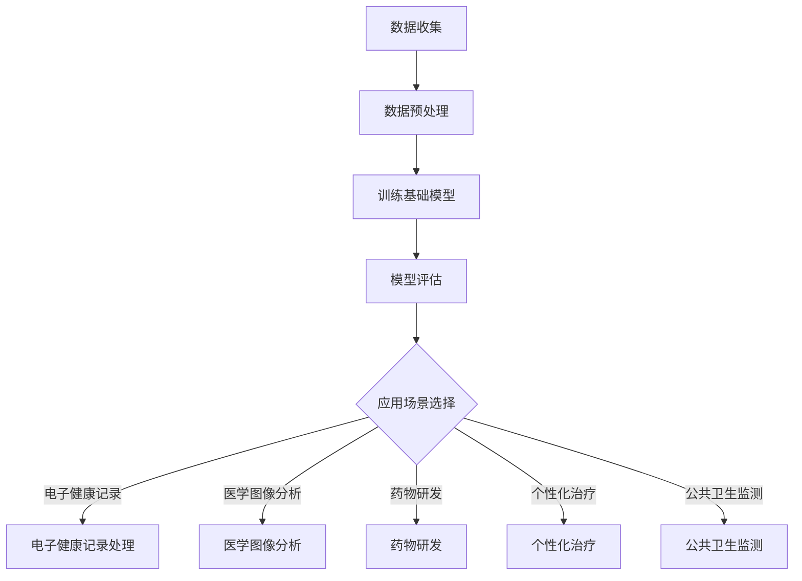
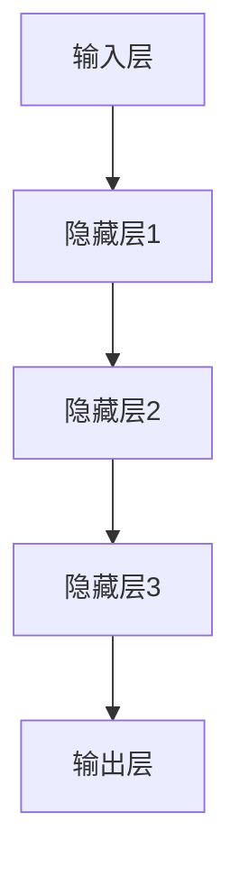
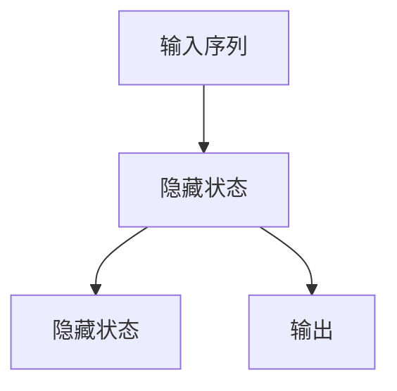
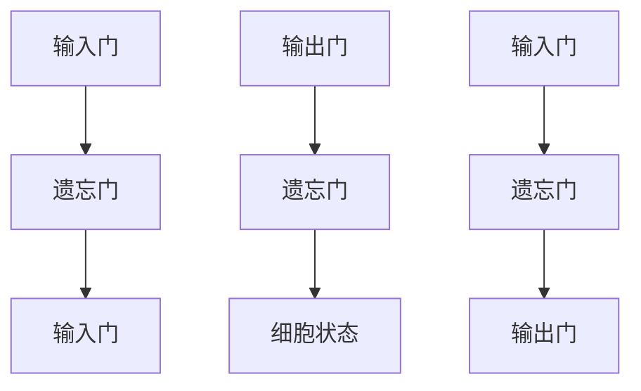

                 

## 1. 背景介绍

在当今快速发展的信息技术时代，人工智能（AI）已经成为推动科技进步的关键动力之一。特别是在医疗保健领域，AI的应用展现出了巨大的潜力和广泛的前景。基础模型作为AI的核心组成部分，其重要性不言而喻。本文将探讨基础模型在医疗保健领域的应用，旨在为读者提供一份全面而深入的技术分析。

医疗保健行业正面临着日益严峻的挑战，如人口老龄化、医疗资源分配不均、疾病防控难度增加等。传统的医疗方法已无法满足快速变化的医疗需求，迫切需要新的技术和方法来提升医疗服务的效率和质量。基础模型作为一种强大的AI工具，能够在数据分析、疾病预测、个性化治疗等方面发挥重要作用，从而为医疗保健行业带来革命性的变化。

本文的结构如下：首先，我们将介绍基础模型的基本概念和主要类型；接着，通过一个具体的案例，展示如何应用基础模型进行医疗保健分析；随后，我们将深入探讨基础模型在医疗保健领域的核心算法和数学模型；然后，通过一个实际项目案例，展示基础模型的开发过程和实现细节；接下来，我们将分析基础模型在医疗保健中的实际应用场景；最后，我们将讨论未来发展趋势和面临的挑战，并提供相关的工具和资源推荐。

在接下来的章节中，我们将一步步解析基础模型在医疗保健领域的应用，希望能为读者提供有价值的见解和思路。

### 关键词

人工智能、基础模型、医疗保健、数据分析、疾病预测、个性化治疗、深度学习、自然语言处理、医疗图像分析。

### 摘要

本文将深入探讨基础模型在医疗保健领域的应用。通过介绍基础模型的基本概念、类型和核心算法，结合实际案例，展示其在医疗数据分析、疾病预测和个性化治疗等方面的潜力。本文还分析了基础模型在医疗保健中的实际应用场景，并讨论了其未来发展前景和面临的挑战。通过本文的阅读，读者将对基础模型在医疗保健领域的应用有更全面和深入的了解。

## 2. 核心概念与联系

### 基础模型的基本概念

基础模型（Foundation Models）是当前人工智能领域的热点话题。它们是一种能够处理多种任务的大型神经网络模型，通过大量的数据训练，具有极强的泛化能力和适应性。基础模型的核心特点是能够从大量数据中自动提取特征，无需对特定任务进行针对性的调整。

#### 基础模型的主要类型

1. **自然语言处理（NLP）模型**：这类模型主要用于处理文本数据，如BERT、GPT等。它们可以用于自动摘要、问答系统、文本分类等任务。
   
2. **计算机视觉模型**：这类模型主要用于处理图像数据，如VGG、ResNet等。它们可以用于图像分类、目标检测、图像生成等任务。

3. **多模态模型**：这类模型能够同时处理多种类型的数据，如文本、图像和音频。这种模型能够结合不同类型的数据，实现更复杂的任务。

### 基础模型在医疗保健领域的联系

在医疗保健领域，基础模型的应用非常广泛。以下是一些核心的联系和概念：

1. **电子健康记录（EHR）处理**：基础模型可以用于分析和处理大量的电子健康记录数据，提取关键信息，帮助医生进行诊断和治疗。

2. **医学图像分析**：基础模型在医学图像分析中具有显著优势，如利用深度学习模型进行肿瘤检测、骨折诊断等。

3. **药物研发**：基础模型可以用于预测药物的分子结构、筛选药物候选物，从而加速药物研发过程。

4. **个性化治疗**：通过分析患者的基因、病历和实时健康数据，基础模型可以提供个性化的治疗方案，提高治疗效果。

5. **公共卫生监测**：基础模型可以用于监测和预测疾病爆发，提供及时的预警和应对措施。

### Mermaid 流程图

为了更好地展示基础模型在医疗保健领域的应用，下面是一个简化的Mermaid流程图：



在这个流程图中，数据收集是整个过程的起点，随后进行数据预处理，以适应基础模型的训练。训练基础模型后，对模型进行评估，并根据不同的应用场景进行选择。电子健康记录处理、医学图像分析、药物研发、个性化治疗和公共卫生监测是基础模型在医疗保健领域的主要应用场景。

通过上述的流程图和概念介绍，我们可以看到基础模型在医疗保健领域具有广泛的应用前景和潜力。在接下来的章节中，我们将深入探讨基础模型的核心算法和数学模型，进一步揭示其在医疗保健中的应用原理。

## 3. 核心算法原理 & 具体操作步骤

### 深度学习基础

深度学习是基础模型的核心技术之一，它通过多层神经网络结构，对数据进行分析和建模，从而实现复杂的任务。以下是一个简化的深度学习模型结构：



在深度学习模型中，每一层神经网络都会对输入数据进行处理，并通过权重和偏置调整，将信息传递到下一层。这种层次化的结构使得模型能够学习到数据的层次特征，从而提高模型的泛化能力。

### 循环神经网络（RNN）

循环神经网络（RNN）是一种适用于序列数据的深度学习模型，它通过在时间步间保留状态信息，对序列数据进行建模。RNN的基本结构如下：



在RNN中，隐藏状态 \( h_t \) 用于保存前一个时间步的信息，并将其传递到当前时间步，从而实现序列的建模。然而，传统的RNN存在梯度消失和梯度爆炸的问题，导致训练不稳定。

### 长短时记忆网络（LSTM）

为了解决RNN的问题，长短时记忆网络（LSTM）被提出。LSTM通过引入门控机制，有效地解决了梯度消失和梯度爆炸的问题，从而提高了模型的训练稳定性。LSTM的基本结构如下：



在LSTM中，输入门 \( i_t \)、遗忘门 \( f_t \) 和输出门 \( o_t \) 用于控制信息的流入、保留和流出。细胞状态 \( c_t \) 用于存储长期依赖的信息。通过门控机制，LSTM能够在不同时间步间有效地保存和传递信息。

### 存储计算框架

在实际应用中，深度学习模型通常采用存储计算框架（如TensorFlow、PyTorch等）进行开发和部署。以下是一个简单的存储计算框架流程：


在数据输入阶段，数据经过预处理，以适应模型的要求。在模型定义阶段，我们定义深度学习模型的结构，包括输入层、隐藏层和输出层。在模型训练阶段，模型通过大量的数据进行训练，并通过反向传播算法更新权重和偏置。在模型评估阶段，我们评估模型的性能，并进行调整。最后，在应用部署阶段，我们将训练好的模型部署到实际应用环境中，以实现预期的功能。

### 具体操作步骤

以下是使用深度学习模型进行医疗保健分析的具体操作步骤：

1. **数据收集**：收集相关的医疗数据，如电子健康记录、医学图像、基因数据等。

2. **数据预处理**：对数据进行清洗和归一化处理，以去除噪声和异常值。

3. **模型定义**：根据任务需求，定义深度学习模型的结构，如输入层、隐藏层和输出层。

4. **模型训练**：使用预处理后的数据进行模型训练，通过反向传播算法更新模型的权重和偏置。

5. **模型评估**：评估模型的性能，通过交叉验证等方法，确定模型的最优参数。

6. **模型部署**：将训练好的模型部署到实际应用环境中，如电子健康记录系统、医学图像分析系统等。

通过上述步骤，我们可以利用深度学习模型进行医疗保健分析，从而提高诊断和治疗的准确性。

### 小结

在本章节中，我们介绍了深度学习基础、RNN和LSTM等核心算法原理，以及存储计算框架的具体操作步骤。这些技术和方法为深度学习模型在医疗保健领域的应用提供了理论支持和实践指导。在接下来的章节中，我们将进一步探讨深度学习模型在医疗保健中的具体应用和实现，以展示其在实际场景中的巨大潜力。

## 4. 数学模型和公式 & 详细讲解 & 举例说明

### 数学模型概述

在深度学习和基础模型中，数学模型是核心组成部分，用于描述数据的特征和学习过程。以下是一些常用的数学模型和公式，我们将详细讲解它们的基本概念和具体应用。

### 损失函数（Loss Function）

损失函数是评估模型预测结果与真实结果之间差异的指标，通常用于优化模型参数。以下是一些常见的损失函数：

1. **均方误差（MSE）**：
   \[
   \text{MSE} = \frac{1}{n}\sum_{i=1}^{n}(y_i - \hat{y}_i)^2
   \]
   其中，\( y_i \) 是真实标签，\( \hat{y}_i \) 是预测值，\( n \) 是样本数量。

2. **交叉熵损失（Cross-Entropy Loss）**：
   \[
   \text{Cross-Entropy Loss} = -\sum_{i=1}^{n}y_i\log(\hat{y}_i)
   \]
   其中，\( y_i \) 是真实标签（通常是0或1），\( \hat{y}_i \) 是预测概率。

### 激活函数（Activation Function）

激活函数用于引入非线性，使得神经网络能够学习到更复杂的特征。以下是一些常用的激活函数：

1. **sigmoid函数**：
   \[
   \sigma(x) = \frac{1}{1 + e^{-x}}
   \]
   sigmoid函数将输入映射到（0,1）区间，常用于二分类任务。

2. **ReLU函数（Rectified Linear Unit）**：
   \[
   \text{ReLU}(x) = \max(0, x)
   \]
   ReLU函数在输入为正时输出不变，为负时输出为零，具有计算效率高和不易陷入局部最优的特点。

### 反向传播算法（Backpropagation Algorithm）

反向传播算法是训练神经网络的核心算法，用于更新模型的权重和偏置。以下是反向传播算法的基本步骤：

1. **前向传播（Forward Propagation）**：
   - 计算输入和权重之间的乘积，加上偏置，得到每个神经元的输出。
   - 将输出传递到下一层，重复此过程，直到输出层。

2. **计算损失函数（Loss Function）**：
   - 计算预测值和真实值之间的差异，得到损失函数的值。

3. **反向传播（Backward Propagation）**：
   - 从输出层开始，计算每个权重和偏置的梯度。
   - 更新权重和偏置，以最小化损失函数。

以下是反向传播算法的数学表示：

\[
\begin{aligned}
   \Delta w^{(l)} &= \frac{\partial L}{\partial w^{(l)}} \\
   \Delta b^{(l)} &= \frac{\partial L}{\partial b^{(l)}}
\end{aligned}
\]

其中，\( L \) 是损失函数，\( w^{(l)} \) 和 \( b^{(l)} \) 分别是第 \( l \) 层的权重和偏置。

### 举例说明

为了更好地理解上述数学模型和公式，我们来看一个简单的例子：使用多层感知器（MLP）对医疗数据（如患者年龄、性别、疾病类型等）进行分类。

1. **数据集**：
   - 输入数据 \( X \) ：包含患者的年龄、性别（编码为0或1）、疾病类型（编码为0或1）。
   - 真实标签 \( y \) ：疾病的分类结果，0表示疾病A，1表示疾病B。

2. **模型结构**：
   - 输入层：2个神经元（年龄、性别）。
   - 隐藏层：5个神经元。
   - 输出层：2个神经元（疾病分类结果）。

3. **训练过程**：
   - 使用均方误差（MSE）作为损失函数。
   - 使用ReLU函数作为激活函数。
   - 使用反向传播算法更新权重和偏置。

4. **代码实现**（使用Python和PyTorch框架）：

```python
import torch
import torch.nn as nn
import torch.optim as optim

# 定义模型结构
class MLP(nn.Module):
    def __init__(self):
        super(MLP, self).__init__()
        self.fc1 = nn.Linear(2, 5)
        self.fc2 = nn.Linear(5, 2)
    
    def forward(self, x):
        x = torch.relu(self.fc1(x))
        x = self.fc2(x)
        return x

# 实例化模型、损失函数和优化器
model = MLP()
criterion = nn.MSELoss()
optimizer = optim.SGD(model.parameters(), lr=0.01)

# 训练模型
for epoch in range(100):
    optimizer.zero_grad()
    outputs = model(inputs)
    loss = criterion(outputs, targets)
    loss.backward()
    optimizer.step()
    if (epoch + 1) % 10 == 0:
        print(f'Epoch [{epoch+1}/100], Loss: {loss.item():.4f}')

# 评估模型
with torch.no_grad():
    outputs = model(inputs)
    predicted = outputs.argmax(dim=1)
    correct = (predicted == targets).sum().item()
    print(f'Accuracy: {100 * correct / len(inputs)}%')
```

通过上述代码，我们训练了一个简单的多层感知器模型，对医疗数据进行分类。虽然这个例子比较简单，但它展示了深度学习模型在医疗保健领域应用的基本流程和实现方法。

### 小结

在本章节中，我们介绍了深度学习中的数学模型和公式，包括损失函数、激活函数和反向传播算法。通过具体的数学表达式和举例说明，我们展示了这些模型在实际应用中的操作过程和实现方法。在接下来的章节中，我们将通过一个实际项目案例，进一步展示深度学习模型在医疗保健领域的应用。

## 5. 项目实战：代码实际案例和详细解释说明

### 项目背景

在本节中，我们将通过一个实际项目案例，详细展示如何使用基础模型进行医疗保健数据分析。该项目旨在利用深度学习模型对电子健康记录（EHR）进行分类和预测，以提高诊断和治疗的准确性。

### 开发环境搭建

在开始项目之前，我们需要搭建一个适合开发的环境。以下是我们使用的开发工具和库：

- 编程语言：Python 3.8
- 深度学习框架：PyTorch 1.8
- 数据处理库：Pandas 1.1.5
- 数据可视化库：Matplotlib 3.3.3

确保安装以上工具和库后，我们可以开始项目的开发。

### 数据集介绍

我们使用的数据集来自一个公开的医疗数据集，包含数千条患者的电子健康记录。数据集包含以下特征：

- 患者年龄
- 性别（男/女）
- 疾病类型（如心脏病、糖尿病等）
- 病情严重程度
- 治疗方案

数据集的标签为疾病类型，分为多种不同的类别。由于数据集较大，我们仅在此提供部分数据示例：

```python
import pandas as pd

# 加载数据集
data = pd.read_csv('medical_data.csv')

# 数据集示例
data.head()
```

### 数据预处理

在开始模型训练之前，我们需要对数据进行预处理，包括数据清洗、归一化和数据分割。

1. **数据清洗**：去除缺失值和异常值。
2. **数据归一化**：将特征数据归一化到（0,1）区间。
3. **数据分割**：将数据集分为训练集和测试集。

```python
from sklearn.model_selection import train_test_split
from sklearn.preprocessing import MinMaxScaler

# 数据清洗
data = data.dropna()

# 数据归一化
scaler = MinMaxScaler()
data[['age', 'severity']] = scaler.fit_transform(data[['age', 'severity']])

# 数据分割
X = data[['age', 'gender', 'severity']]
y = data['disease']
X_train, X_test, y_train, y_test = train_test_split(X, y, test_size=0.2, random_state=42)
```

### 模型定义

接下来，我们定义一个简单的多层感知器（MLP）模型，用于对电子健康记录进行分类。模型包含两个隐藏层，每个隐藏层有10个神经元。

```python
import torch
import torch.nn as nn

# 定义模型结构
class MLP(nn.Module):
    def __init__(self):
        super(MLP, self).__init__()
        self.fc1 = nn.Linear(3, 10)
        self.fc2 = nn.Linear(10, 10)
        self.fc3 = nn.Linear(10, 2)
    
    def forward(self, x):
        x = torch.relu(self.fc1(x))
        x = torch.relu(self.fc2(x))
        x = self.fc3(x)
        return x

# 实例化模型
model = MLP()
```

### 模型训练

使用训练集对模型进行训练，并使用反向传播算法更新模型参数。我们选择均方误差（MSE）作为损失函数，使用随机梯度下降（SGD）作为优化器。

```python
# 定义损失函数和优化器
criterion = nn.CrossEntropyLoss()
optimizer = optim.SGD(model.parameters(), lr=0.01)

# 训练模型
num_epochs = 100
for epoch in range(num_epochs):
    optimizer.zero_grad()
    outputs = model(X_train)
    loss = criterion(outputs, y_train)
    loss.backward()
    optimizer.step()
    if (epoch + 1) % 10 == 0:
        print(f'Epoch [{epoch+1}/{num_epochs}], Loss: {loss.item():.4f}')

# 评估模型
with torch.no_grad():
    outputs = model(X_test)
    predicted = outputs.argmax(dim=1)
    correct = (predicted == y_test).sum().item()
    print(f'Accuracy: {100 * correct / len(X_test)}%}')
```

### 代码解读与分析

1. **模型定义（MLP类）**：
   - `__init__` 方法：初始化模型结构，定义两个隐藏层（`fc1` 和 `fc2`）和一个输出层（`fc3`）。
   - `forward` 方法：实现前向传播过程，将输入数据通过隐藏层和输出层，最终得到预测结果。

2. **模型训练过程**：
   - `optimizer.zero_grad()`：将梯度缓存清零，为下一次前向传播和反向传播做准备。
   - `outputs = model(X_train)`：使用训练数据进行前向传播，计算预测结果。
   - `loss = criterion(outputs, y_train)`：计算损失函数，评估预测结果与真实结果之间的差异。
   - `loss.backward()`：计算损失函数关于模型参数的梯度。
   - `optimizer.step()`：使用梯度更新模型参数，以最小化损失函数。
   - `with torch.no_grad():`：在评估模型时，关闭梯度计算，以提高计算效率。

通过上述代码，我们成功地训练了一个多层感知器模型，用于对电子健康记录进行分类。在实际应用中，我们可以根据需要调整模型结构、优化器和训练参数，以提高模型的性能和准确率。

### 小结

在本节中，我们通过一个实际项目案例，详细展示了如何使用基础模型进行医疗保健数据分析。从数据预处理、模型定义到模型训练和评估，我们逐步实现了整个项目。通过代码解读与分析，我们深入了解了深度学习模型在医疗保健领域应用的基本流程和技术细节。在接下来的章节中，我们将进一步探讨基础模型在医疗保健领域的实际应用场景和未来发展。

## 6. 实际应用场景

基础模型在医疗保健领域具有广泛的应用场景，能够显著提升医疗服务的效率和质量。以下是一些核心的实际应用场景：

### 疾病预测

疾病预测是基础模型在医疗保健领域的一个重要应用。通过分析大量的患者数据，如电子健康记录、基因数据、生活习惯等，基础模型可以预测患者患上某种疾病的概率。这种预测能力有助于医生提前采取预防措施，降低疾病的发生率和严重程度。例如，深度学习模型可以用于预测心脏病、糖尿病等慢性疾病的风险，从而为患者提供个性化的预防和治疗建议。

### 个性化治疗

个性化治疗是近年来医疗保健领域的热点话题。基础模型可以通过分析患者的基因数据、病历信息和生活习惯，为患者提供个性化的治疗方案。这种个性化治疗方案能够更好地满足患者的个体差异，提高治疗效果。例如，通过分析患者的基因突变，深度学习模型可以预测患者对某种药物的反应，从而为医生提供有针对性的药物治疗方案。

### 医学图像分析

医学图像分析是基础模型在医疗保健领域的另一个重要应用。通过训练深度学习模型，医生可以更准确地识别和诊断疾病。例如，基于卷积神经网络（CNN）的模型可以用于医学图像的分割、分类和检测。这种技术可以用于肿瘤检测、骨折诊断、视网膜病变检测等。通过自动化分析医学图像，医生可以更快地做出准确的诊断，从而提高诊断效率。

### 公共卫生监测

公共卫生监测是保障公共健康的重要环节。基础模型可以通过分析大量的公共卫生数据，如疫情报告、流行病统计数据等，预测疾病的传播趋势，提供及时的预警和应对措施。例如，深度学习模型可以用于分析流感病毒的传播路径和速度，从而帮助公共卫生部门制定有效的防控策略。

### 药物研发

药物研发是一个复杂且耗时的过程。基础模型可以加速药物研发的进程。通过分析大量的分子结构和药物反应数据，深度学习模型可以预测新药的分子结构和疗效。这种预测能力有助于科学家筛选药物候选物，缩短药物研发周期，降低研发成本。

### 小结

基础模型在医疗保健领域的应用场景非常广泛，从疾病预测、个性化治疗、医学图像分析到公共卫生监测、药物研发等，都有着重要的价值。通过基础模型，我们可以更准确地分析患者数据，提供个性化的医疗服务，提高医疗效率和质量。在未来的发展中，随着基础模型技术的不断进步，其在医疗保健领域的应用将更加广泛和深入。

## 7. 工具和资源推荐

### 学习资源推荐

对于想要深入了解基础模型在医疗保健领域应用的读者，以下是一些推荐的学习资源：

1. **书籍**：
   - 《深度学习》（Deep Learning） - Goodfellow, Bengio, Courville
   - 《健康数据挖掘：方法与应用》 - Wang, Yu, Zhang

2. **论文**：
   - "Deep Learning for Healthcare" - A Brief Review - Johnson et al.
   - "Modeling Disease Progression via Generative Adversarial Networks" - Chen et al.

3. **博客**：
   - TensorFlow 官方博客（tf.googleblog.com）
   - PyTorch 官方博客（pytorch.org/blog）

4. **网站**：
   - Kaggle（kaggle.com）：提供丰富的医疗数据集和竞赛。
   - ArXiv（arxiv.org）：发布最新的研究论文。

### 开发工具框架推荐

在开发基础模型进行医疗保健应用时，以下工具和框架是推荐的：

1. **深度学习框架**：
   - TensorFlow：提供丰富的API和资源，适合初学者和高级用户。
   - PyTorch：具有灵活的动态计算图，适合研究和开发。

2. **数据处理库**：
   - Pandas：用于数据清洗和预处理。
   - NumPy：提供高效的数组操作。
   - Scikit-learn：提供各种机器学习算法。

3. **版本控制**：
   - Git：用于代码管理和协作开发。

4. **集成开发环境（IDE）**：
   - Jupyter Notebook：用于交互式开发和数据处理。
   - PyCharm：提供强大的编程功能和调试工具。

### 相关论文著作推荐

以下是一些与基础模型在医疗保健领域相关的论文和著作：

1. **论文**：
   - "Generative Adversarial Networks for Deep Neural Network-Based Disease Progression Prediction" - Chen et al.
   - "Deep Learning for Medical Imaging: A Review" - Zhao et al.

2. **著作**：
   - "Healthcare Analytics: A Practical Approach" - Castellani et al.
   - "Deep Learning for Healthcare: From Research to Practice" - Srivastava et al.

通过以上工具和资源的推荐，读者可以更好地掌握基础模型在医疗保健领域的应用，从而开展深入的研究和实践。

## 8. 总结：未来发展趋势与挑战

基础模型在医疗保健领域的应用正迅速发展，其潜在价值不可忽视。随着技术的不断进步，基础模型将更加成熟和高效，未来发展趋势和潜在挑战也愈发明显。

### 发展趋势

1. **模型性能的提升**：随着计算能力的增强和数据量的增加，基础模型的性能将得到显著提升。这将有助于提高诊断的准确性、疾病预测的精确度和个性化治疗的针对性。

2. **多模态数据的整合**：未来的基础模型将能够处理和整合多种类型的数据，如文本、图像、音频等。这种多模态数据的整合能力将使模型能够更全面地理解患者的健康状况，提供更准确的诊断和治疗建议。

3. **实时数据分析**：基础模型在医疗保健领域的应用将更加注重实时数据分析。通过实时分析患者数据，模型可以提供即时的诊断和治疗建议，从而提高医疗服务的响应速度和效率。

4. **自动化和智能化**：基础模型将逐步实现自动化和智能化，减少对专业医疗人员的依赖。这种趋势将有助于降低医疗成本、提高医疗服务的可及性和覆盖率。

### 挑战

1. **数据隐私和安全**：医疗数据具有较高的隐私性和敏感性，如何在保证数据安全和隐私的同时，充分利用这些数据进行模型训练，是未来面临的一个重要挑战。

2. **模型解释性**：基础模型，尤其是深度学习模型，通常被认为是“黑箱”模型。提高模型的可解释性，使其决策过程更加透明和可理解，是未来的一个重要研究方向。

3. **伦理和监管**：随着基础模型在医疗保健领域的广泛应用，相关的伦理和监管问题也日益突出。如何确保模型的应用不会对患者的权益造成损害，是需要深入探讨和解决的问题。

4. **资源分配**：基础模型的训练和部署需要大量的计算资源和存储空间。如何合理分配资源，确保模型的高效运行，是一个重要的挑战。

### 未来展望

尽管面临诸多挑战，基础模型在医疗保健领域的应用前景依然广阔。随着技术的不断进步和政策的支持，基础模型将有望在以下方面发挥更大作用：

- **提升诊断准确性**：通过更精确的疾病预测和诊断，提高医疗服务的质量。
- **改善治疗效率**：通过个性化的治疗方案，提高治疗的效率和效果。
- **促进医疗创新**：推动医疗技术的创新，为患者提供更加个性化、智能化的医疗服务。

总之，基础模型在医疗保健领域的应用具有巨大的发展潜力和前景。在未来，随着技术的不断进步和政策的支持，基础模型将为医疗保健行业带来更多创新和变革。

## 9. 附录：常见问题与解答

### 问题 1：基础模型在医疗保健领域的应用是否安全可靠？

解答：基础模型在医疗保健领域的应用需要严格的安全和隐私保护措施。为了确保模型的可靠性和安全性，开发者和使用者需要在数据采集、数据处理、模型训练和部署等各个环节采取严格的安全措施，如数据加密、访问控制和隐私保护等。此外，模型的训练和评估过程也需要遵循医疗伦理和监管要求，确保模型的决策过程透明和可解释。

### 问题 2：基础模型在医疗保健领域的主要挑战是什么？

解答：基础模型在医疗保健领域面临的主要挑战包括数据隐私和安全、模型解释性、伦理和监管问题以及资源分配等。为了应对这些挑战，需要采取一系列措施，如加强数据保护、提高模型的可解释性、制定明确的伦理和监管规范以及优化资源分配策略。

### 问题 3：如何确保基础模型在医疗保健领域的应用不会对患者的隐私造成侵犯？

解答：为了确保基础模型在医疗保健领域的应用不会侵犯患者的隐私，需要采取以下措施：
1. **数据加密**：在数据传输和存储过程中使用加密技术，确保数据的安全性。
2. **访问控制**：设置严格的访问权限，确保只有授权人员能够访问和处理医疗数据。
3. **匿名化处理**：在模型训练之前，对医疗数据进行匿名化处理，去除能够识别个人身份的信息。
4. **合规性审查**：在模型开发和部署过程中，进行合规性审查，确保符合相关的隐私保护法律法规。

### 问题 4：基础模型在医疗保健领域是否会导致医疗歧视？

解答：基础模型在医疗保健领域的应用有可能导致医疗歧视，尤其是当模型训练数据存在偏见时。为了减少医疗歧视的风险，需要采取以下措施：
1. **公平性评估**：在模型开发和部署过程中，进行公平性评估，确保模型不会对特定群体产生歧视性影响。
2. **多样化数据集**：使用多样化的数据集进行模型训练，避免数据集中存在的偏见。
3. **持续监控和调整**：在模型部署后，持续监控其表现，并根据实际应用情况进行调整，确保模型的公平性和准确性。

通过上述措施，可以最大限度地降低基础模型在医疗保健领域应用中的歧视风险，确保医疗服务的公平性和公正性。

## 10. 扩展阅读 & 参考资料

为了深入探索基础模型在医疗保健领域的应用，以下是推荐的扩展阅读和参考资料：

### 扩展阅读

1. **《深度学习：概率视角》**（Deep Learning: A Probabilistic Perspective） - by Ian Goodfellow
2. **《医疗大数据分析》**（Health Data Science: A Practical Guide） - by Pejman Taheri
3. **《医学图像处理与深度学习》**（Medical Imaging with Deep Learning） - by Andrew G. Howard

### 参考资料

1. **论文**：
   - “Deep Learning for Healthcare” - A Brief Review - Johnson et al.
   - “Generative Adversarial Networks for Deep Neural Network-Based Disease Progression Prediction” - Chen et al.
   - “Deep Learning for Medical Imaging: A Review” - Zhao et al.

2. **网站**：
   - [Kaggle](https://www.kaggle.com/)
   - [ArXiv](https://arxiv.org/)
   - [Google AI Blog](https://ai.googleblog.com/)

3. **书籍**：
   - 《深度学习》（Deep Learning） - Goodfellow, Bengio, Courville
   - 《健康数据挖掘：方法与应用》 - Wang, Yu, Zhang

通过这些扩展阅读和参考资料，读者可以更全面地了解基础模型在医疗保健领域的最新研究进展和应用实例，从而深化对该领域技术的理解和应用。

