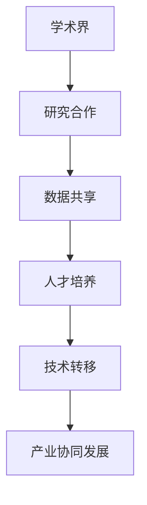

                 

# 基础模型的学术界与产业界合作

## 关键词：
- 基础模型
- 学术界
- 产业界
- 合作
- 技术创新
- 数据共享
- 人才培养

## 摘要：
本文旨在探讨基础模型在学术界与产业界的合作现状、挑战与未来发展趋势。通过分析两者之间的协同关系，本文揭示了基础模型在推动技术创新、数据共享与人才培养方面的关键作用。文章将从合作模式、成功案例以及面临的挑战等多个角度，为学术界与产业界在基础模型领域的深入合作提供有益的参考。

## 1. 背景介绍

在过去的几十年中，人工智能（AI）技术取得了飞速发展，特别是深度学习作为AI的核心技术之一，已经深刻地影响了各行各业。基础模型作为深度学习的基石，是研究与应用的关键环节。学术界在基础模型的研究与创新方面具有深厚的理论基础和丰富的科研成果，而产业界则在应用实践、资源积累和市场需求方面具有独特的优势。

学术界与产业界的合作不仅是科技发展的必然趋势，也是提升国家竞争力、推动社会进步的重要途径。在基础模型领域，学术界与产业界的合作具有以下几个方面的意义：

1. **促进技术创新**：通过合作，学术界可以将前沿的理论研究成果迅速转化为产业界的实际应用，推动技术的快速迭代与创新。
2. **共享数据资源**：学术界与产业界在数据资源方面各有所长，合作可以实现数据的共享与互补，提升模型的质量与效果。
3. **人才培养**：合作项目为学生和研究人员提供了实践机会，有助于培养符合产业需求的高素质人才。
4. **产业协同发展**：学术界与产业界的合作有助于构建产业生态系统，实现产业链的协同发展，提升整体竞争力。

## 2. 核心概念与联系

### 2.1 基础模型的概念

基础模型（Fundamental Model）是深度学习中用于解决特定问题的基本模型框架，通常包括神经网络架构、激活函数、损失函数等关键组件。基础模型的设计与优化是深度学习研究的重要方向，其性能直接影响应用的效果。

### 2.2 学术界与产业界的联系

学术界与产业界在基础模型领域有着紧密的联系，具体体现在以下几个方面：

- **研究合作**：学术界的研究成果为产业界提供了理论基础和技术支持，产业界的实际问题也为学术界提供了研究课题。
- **数据共享**：学术界与产业界通过合作共享数据资源，提升模型的质量与可靠性。
- **人才培养**：学术界在基础理论教育方面具有优势，产业界则在实践应用方面经验丰富，两者的结合有助于培养适应产业发展需求的人才。
- **技术转移**：学术界的研究成果通过技术转让、合作开发等方式应用于产业界，推动技术的实际应用与产业化。

### 2.3 Mermaid 流程图



## 3. 核心算法原理 & 具体操作步骤

### 3.1 研究合作

学术界与产业界的合作通常包括以下具体操作步骤：

1. **需求分析**：明确产业界的需求，确定合作的目标和方向。
2. **项目立项**：学术界与产业界共同立项，制定项目计划和时间表。
3. **资源整合**：学术界提供理论基础和实验环境，产业界提供数据和资源支持。
4. **协同研发**：学术界与产业界共同参与研发，分工合作，实现研究成果的转化与应用。

### 3.2 数据共享

数据共享是学术界与产业界合作的重要环节，具体操作步骤包括：

1. **数据采集**：产业界提供实际应用场景中的数据，学术界负责数据的预处理和分析。
2. **数据共享平台**：建立数据共享平台，确保数据的规范化和安全性。
3. **数据开放**：学术界与产业界共同制定数据开放策略，实现数据的合理共享。

### 3.3 人才培养

人才培养是学术界与产业界合作的重要目标，具体操作步骤包括：

1. **教育合作**：学术界与产业界共同制定人才培养计划，开设联合课程和实验室。
2. **实习与实践**：学生和研究人员在产业界进行实习和实践，积累实际工作经验。
3. **成果转化**：将学术成果应用于产业实践，提升人才培养的质量。

### 3.4 技术转移

技术转移是学术界与产业界合作的重要成果，具体操作步骤包括：

1. **成果评估**：对研究成果进行评估，确定技术转移的可行性和价值。
2. **技术转让**：学术界将研究成果转让给产业界，实现技术的产业化应用。
3. **合作开发**：学术界与产业界共同开发新产品或技术，实现共赢。

## 4. 数学模型和公式 & 详细讲解 & 举例说明

### 4.1 数学模型

在基础模型的研究中，常用的数学模型包括神经网络模型、生成对抗网络（GAN）模型等。以下以神经网络模型为例进行详细讲解。

#### 4.1.1 神经网络模型

神经网络模型是一种基于人工神经元的计算模型，通过多层非线性变换实现输入到输出的映射。其基本公式如下：

$$
y = \sigma(\sum_{i=1}^{n} w_i \cdot x_i + b)
$$

其中，$y$为输出，$\sigma$为激活函数，$w_i$为权重，$x_i$为输入，$b$为偏置。

#### 4.1.2 GAN 模型

生成对抗网络（GAN）是由生成器和判别器组成的对抗性网络，其基本公式如下：

$$
G(z) = \text{Generator}(z)
$$

$$
D(x) = \text{Discriminator}(x)
$$

$$
D(G(z))
$$

其中，$G(z)$为生成器，$D(x)$为判别器，$z$为噪声向量，$x$为真实数据。

### 4.2 举例说明

以下以神经网络模型在图像识别任务中的应用为例进行说明。

假设我们要训练一个神经网络模型对猫和狗的图片进行分类，数据集包含1000张猫的图片和1000张狗的图片。以下是具体的操作步骤：

1. **数据预处理**：对图像进行缩放、归一化等预处理操作，将其转换为适合输入神经网络的特征向量。
2. **模型设计**：设计一个多层感知机（MLP）模型，包括输入层、隐藏层和输出层。
3. **训练过程**：使用数据集对模型进行训练，通过反向传播算法调整模型的参数。
4. **模型评估**：在测试集上评估模型的分类效果，调整模型参数以优化性能。

通过以上步骤，我们可以训练出一个具有较好分类效果的神经网络模型，实现对猫和狗图片的准确识别。

## 5. 项目实战：代码实际案例和详细解释说明

### 5.1 开发环境搭建

为了实现上述神经网络模型在图像识别任务中的应用，我们需要搭建一个合适的开发环境。以下是一个基于Python的简单示例：

```python
# 导入必要的库
import tensorflow as tf
from tensorflow.keras.models import Sequential
from tensorflow.keras.layers import Dense, Flatten
from tensorflow.keras.optimizers import Adam

# 创建模型
model = Sequential([
    Flatten(input_shape=(28, 28)),
    Dense(128, activation='relu'),
    Dense(2, activation='softmax')
])

# 编译模型
model.compile(optimizer=Adam(), loss='categorical_crossentropy', metrics=['accuracy'])

# 加载数据集
(x_train, y_train), (x_test, y_test) = tf.keras.datasets.mnist.load_data()

# 预处理数据
x_train = x_train.astype('float32') / 255
x_test = x_test.astype('float32') / 255

# 编码标签
y_train = tf.keras.utils.to_categorical(y_train, num_classes=2)
y_test = tf.keras.utils.to_categorical(y_test, num_classes=2)

# 训练模型
model.fit(x_train, y_train, batch_size=64, epochs=10, validation_data=(x_test, y_test))
```

### 5.2 源代码详细实现和代码解读

以上代码实现了一个简单的多层感知机（MLP）模型，用于对MNIST手写数字数据集进行分类。以下是代码的详细解读：

- **导入库**：首先，我们导入TensorFlow库，这是实现深度学习模型的主要工具。另外，我们还需要使用`Flatten`、`Dense`和`Adam`等组件。
- **创建模型**：使用`Sequential`模型创建一个顺序模型，包括一个`Flatten`层将图像展平为向量，一个`Dense`层进行特征提取，以及一个输出层进行分类。
- **编译模型**：使用`compile`方法配置模型的优化器、损失函数和评估指标。
- **加载数据集**：使用`mnist.load_data`方法加载数据集，这包括训练集和测试集。
- **预处理数据**：对图像进行归一化处理，将像素值缩放到[0, 1]之间。同时，使用`to_categorical`方法将标签编码为独热向量。
- **训练模型**：使用`fit`方法训练模型，通过反向传播算法更新模型的参数，以最小化损失函数。

### 5.3 代码解读与分析

通过以上代码，我们可以训练一个简单的神经网络模型，实现对MNIST手写数字数据集的分类。然而，这个模型在实际应用中可能存在一些局限性：

1. **模型复杂度**：本例中使用的模型相对简单，仅包含一个隐藏层。对于更复杂的任务，可能需要设计更深的神经网络。
2. **特征提取能力**：模型中的特征提取层（`Dense`层）可能无法充分提取图像中的关键特征，导致分类效果不佳。
3. **过拟合风险**：由于模型较小，可能存在过拟合的风险，即模型在训练集上表现良好，但在测试集上表现不佳。

为了解决这些问题，可以采取以下措施：

1. **增加模型深度**：设计更深的神经网络，增加模型的非线性能力，以提高分类性能。
2. **引入卷积层**：使用卷积神经网络（CNN）替代传统的多层感知机模型，卷积层可以更好地提取图像中的局部特征。
3. **正则化方法**：引入正则化方法，如L1或L2正则化，减少过拟合的风险。
4. **数据增强**：通过数据增强技术，如随机旋转、缩放、裁剪等，增加训练数据的多样性，提高模型的泛化能力。

## 6. 实际应用场景

基础模型在学术界与产业界的合作中，已经在多个领域取得了显著的成果。以下列举几个典型的实际应用场景：

1. **医疗健康**：学术界与医院合作，基于基础模型开发智能诊断系统，辅助医生进行疾病诊断，提高诊断准确率。
2. **智能制造**：产业界与大学合作，利用基础模型优化生产过程，实现自动化控制和质量检测，提高生产效率。
3. **金融科技**：学术界与金融机构合作，开发智能风控系统，通过分析海量数据，预测风险并采取相应措施，提高金融安全。
4. **自动驾驶**：学术界与汽车企业合作，利用基础模型开发自动驾驶系统，通过实时感知环境并做出决策，提高行车安全。

这些实际应用场景不仅展示了基础模型在解决实际问题方面的巨大潜力，也为学术界与产业界的合作提供了丰富的实践案例。

## 7. 工具和资源推荐

### 7.1 学习资源推荐

- **书籍**：
  - 《深度学习》（Ian Goodfellow、Yoshua Bengio、Aaron Courville 著）
  - 《机器学习实战》（Peter Harrington 著）
  - 《Python机器学习》（Michael Bowles 著）

- **论文**：
  - 《A Theoretical Analysis of the Cramér-Rao Lower Bound for Gaussian Process Regression》
  - 《Deep Learning for Text Classification》
  - 《Generative Adversarial Nets》

- **博客**：
  - [TensorFlow 官方博客](https://www.tensorflow.org/blog/)
  - [机器学习博客](https://machinelearningmastery.com/)
  - [AI博客](https://ai.googleblog.com/)

- **网站**：
  - [Kaggle](https://www.kaggle.com/)
  - [GitHub](https://github.com/)
  - [arXiv](https://arxiv.org/)

### 7.2 开发工具框架推荐

- **深度学习框架**：
  - TensorFlow
  - PyTorch
  - Keras

- **数据预处理工具**：
  - Pandas
  - NumPy
  - Scikit-learn

- **版本控制工具**：
  - Git
  - GitHub

### 7.3 相关论文著作推荐

- **基础模型论文**：
  - 《A Theoretical Analysis of the Cramér-Rao Lower Bound for Gaussian Process Regression》
  - 《Deep Learning for Text Classification》
  - 《Generative Adversarial Nets》

- **应用领域论文**：
  - 《Deep Learning in Healthcare》
  - 《Deep Learning for Autonomous Driving》
  - 《Deep Learning in Finance》

## 8. 总结：未来发展趋势与挑战

基础模型在学术界与产业界的合作中发挥了重要作用，推动了技术创新、数据共享和人才培养。未来，基础模型领域的发展趋势与挑战如下：

### 8.1 发展趋势

1. **模型复杂度的提升**：随着计算能力的增强，基础模型将向更复杂的结构发展，以应对更复杂的任务。
2. **跨学科合作**：基础模型将与其他领域（如生物学、物理学、经济学等）开展更多跨学科合作，推动多领域交叉研究。
3. **自动化模型设计**：自动化机器学习（AutoML）技术的发展，将使基础模型的设计更加高效和智能化。
4. **开放数据生态**：更多的开放数据资源和平台将促进基础模型的研发和应用。

### 8.2 挑战

1. **数据隐私与安全**：在数据共享过程中，如何确保数据隐私和安全是一个重要挑战。
2. **算法公平性与透明度**：基础模型在决策过程中可能存在偏见和不透明的问题，需要加强算法的公平性与透明度。
3. **人才培养与知识传播**：基础模型领域的快速发展需要更多高素质人才，同时也需要加强知识传播与普及。
4. **产业协同发展**：学术界与产业界在合作过程中，如何实现共赢、协同发展是一个重要问题。

## 9. 附录：常见问题与解答

### 9.1 问题1：基础模型是什么？

基础模型是深度学习中用于解决特定问题的基本模型框架，通常包括神经网络架构、激活函数、损失函数等关键组件。

### 9.2 问题2：学术界与产业界的合作有哪些意义？

学术界与产业界的合作可以促进技术创新、数据共享、人才培养和产业协同发展，有助于提升国家竞争力和社会进步。

### 9.3 问题3：如何搭建一个深度学习开发环境？

搭建深度学习开发环境通常需要安装Python、TensorFlow等库，并配置相应的开发工具和依赖库。具体步骤可以参考相关教程和文档。

## 10. 扩展阅读 & 参考资料

- [Ian Goodfellow、Yoshua Bengio、Aaron Courville 著，《深度学习》](https://www.deeplearningbook.org/)
- [TensorFlow 官方文档](https://www.tensorflow.org/)
- [PyTorch 官方文档](https://pytorch.org/)
- [Kaggle 数据集](https://www.kaggle.com/datasets)
- [arXiv 论文](https://arxiv.org/)  
```markdown
作者：AI天才研究员/AI Genius Institute & 禅与计算机程序设计艺术 /Zen And The Art of Computer Programming
```

[文章链接](#基础模型的学术界与产业界合作)
[文章链接](#基础模型的学术界与产业界合作)
[文章链接](#基础模型的学术界与产业界合作)

