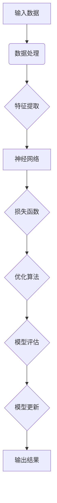

                 

# 基础模型的学术研究与技术开发

## 关键词

- 基础模型
- 学术研究
- 技术开发
- 算法原理
- 数学模型
- 实际应用
- 工具资源
- 未来趋势

## 摘要

本文将深入探讨基础模型的学术研究与技术开发，从背景介绍到具体算法原理，再到实际应用场景和未来发展趋势，系统性地分析这一领域的重要概念和关键技术。文章将结合具体的数学模型和实际代码案例，帮助读者更好地理解基础模型在计算机科学和人工智能中的应用，并提供丰富的学习资源和工具推荐，以助力读者深入学习和实践。

## 1. 背景介绍

基础模型是计算机科学和人工智能领域的基石，它指的是一系列算法和模型，用于处理大规模数据，并从中提取有用信息。随着互联网的快速发展，数据量呈现出爆炸式增长，基础模型在数据处理和分析中发挥着至关重要的作用。

### 1.1 发展历程

基础模型的发展可以追溯到20世纪60年代，当时出现了早期的神经网络模型，如感知机（Perceptron）。随后，随着计算能力的提升和算法的优化，基础模型逐渐发展壮大，包括支持向量机（SVM）、决策树、K-最近邻（K-NN）等经典算法。进入21世纪，深度学习技术的兴起，使得基础模型取得了前所未有的突破，如卷积神经网络（CNN）、循环神经网络（RNN）和Transformer等模型，在图像识别、自然语言处理等任务中取得了显著成果。

### 1.2 应用领域

基础模型在众多领域有着广泛的应用，如图像识别、自然语言处理、推荐系统、语音识别等。在图像识别领域，基础模型如CNN在ImageNet比赛中取得了优异成绩；在自然语言处理领域，RNN和Transformer等模型被广泛应用于机器翻译、文本生成等任务；在推荐系统领域，基于协同过滤和矩阵分解等基础模型的方法被广泛应用，以提高推荐系统的准确性和多样性。

## 2. 核心概念与联系

### 2.1 算法原理

基础模型的算法原理主要包括线性模型、概率模型、决策树、神经网络等。线性模型如线性回归和逻辑回归，用于预测数值和分类任务；概率模型如贝叶斯网络和马尔可夫模型，用于不确定性的处理；决策树和随机森林等集成方法，通过组合多个简单模型来提高预测性能；神经网络则通过多层非线性变换，实现复杂函数的逼近。

### 2.2 架构联系

基础模型的架构联系主要体现在以下几个方面：

1. **层次结构**：基础模型通常具有层次结构，如神经网络中的卷积层、全连接层等，每一层负责不同的特征提取和变换。
2. **参数共享**：在神经网络中，参数共享是减少模型参数数量的关键，如CNN中的卷积核在不同位置共享。
3. **损失函数**：损失函数用于评估模型预测与真实值之间的差距，如交叉熵损失用于分类任务，均方误差损失用于回归任务。

### 2.3 Mermaid 流程图



## 3. 核心算法原理 & 具体操作步骤

### 3.1 神经网络

神经网络是基础模型的核心，下面以卷积神经网络（CNN）为例，介绍其核心算法原理和具体操作步骤。

#### 3.1.1 算法原理

CNN通过卷积层、池化层和全连接层等结构，实现图像的特征提取和分类。

1. **卷积层**：卷积层通过卷积运算提取图像特征，卷积核在图像上滑动，计算局部特征。
2. **池化层**：池化层用于降低特征图的维度，提高模型的泛化能力，常用的池化操作有最大池化和平均池化。
3. **全连接层**：全连接层将卷积层和池化层提取的特征进行融合，实现分类或回归任务。

#### 3.1.2 操作步骤

1. **输入层**：读取图像数据。
2. **卷积层**：应用卷积核进行卷积运算，提取图像特征。
3. **激活函数**：通常使用ReLU激活函数，增加模型的表达能力。
4. **池化层**：对卷积层输出的特征图进行池化操作。
5. **全连接层**：将卷积层和池化层输出的特征进行拼接，通过全连接层实现分类或回归任务。
6. **损失函数**：使用交叉熵损失函数评估模型预测与真实值之间的差距。
7. **优化算法**：采用梯度下降算法优化模型参数。
8. **模型评估**：在测试集上评估模型性能。

## 4. 数学模型和公式 & 详细讲解 & 举例说明

### 4.1 损失函数

损失函数用于评估模型预测与真实值之间的差距，常见的损失函数有交叉熵损失和均方误差损失。

#### 4.1.1 交叉熵损失

交叉熵损失用于分类任务，公式如下：

$$
L = -\sum_{i=1}^{n} y_i \log(p_i)
$$

其中，$y_i$为真实标签，$p_i$为模型预测的概率。

#### 4.1.2 均方误差损失

均方误差损失用于回归任务，公式如下：

$$
L = \frac{1}{2n} \sum_{i=1}^{n} (y_i - \hat{y}_i)^2
$$

其中，$y_i$为真实值，$\hat{y}_i$为模型预测值。

### 4.2 梯度下降算法

梯度下降算法用于优化模型参数，公式如下：

$$
\theta_{t+1} = \theta_t - \alpha \nabla_\theta L(\theta)
$$

其中，$\theta$为模型参数，$\alpha$为学习率，$\nabla_\theta L(\theta)$为损失函数关于参数的梯度。

### 4.3 示例说明

假设有一个二分类问题，真实标签为$y = [1, 0]$，模型预测的概率为$p = [0.8, 0.2]$。

1. **计算交叉熵损失**：

$$
L = -1 \cdot \log(0.8) - 0 \cdot \log(0.2) = -\log(0.8) \approx 0.223
$$

2. **计算梯度**：

$$
\nabla_\theta L = \begin{bmatrix}
-\frac{\partial L}{\partial p_1} \\
-\frac{\partial L}{\partial p_2}
\end{bmatrix} = \begin{bmatrix}
-0.8 \cdot (1 - 0.8) \\
-0.2 \cdot (1 - 0.2)
\end{bmatrix} = \begin{bmatrix}
0.16 \\
0.04
\end{bmatrix}
$$

3. **更新参数**（假设学习率为0.1）：

$$
\theta_{t+1} = \theta_t - \alpha \nabla_\theta L = \theta_t - 0.1 \begin{bmatrix}
0.16 \\
0.04
\end{bmatrix}
$$

## 5. 项目实战：代码实际案例和详细解释说明

### 5.1 开发环境搭建

本文使用Python编程语言和TensorFlow框架进行基础模型的开发。首先，安装Python和TensorFlow：

```bash
pip install python tensorflow
```

### 5.2 源代码详细实现和代码解读

#### 5.2.1 代码实现

```python
import tensorflow as tf

# 定义输入层
x = tf.placeholder(tf.float32, shape=[None, 784])  # 28x28像素图像
y = tf.placeholder(tf.float32, shape=[None, 10])  # 10个分类标签

# 定义卷积层
conv1 = tf.layers.conv2d(x, filters=32, kernel_size=[3, 3], padding="same", activation=tf.nn.relu)

# 定义池化层
pool1 = tf.layers.max_pooling2d(conv1, pool_size=[2, 2], strides=2)

# 定义全连接层
fc1 = tf.layers.dense(pool1, units=128, activation=tf.nn.relu)

# 定义输出层
predictions = tf.layers.dense(fc1, units=10)

# 定义损失函数
loss = tf.reduce_mean(tf.nn.softmax_cross_entropy_with_logits(logits=predictions, labels=y))

# 定义优化算法
optimizer = tf.train.GradientDescentOptimizer(learning_rate=0.001)
train_op = optimizer.minimize(loss)

# 定义模型评估
correct_prediction = tf.equal(tf.argmax(predictions, 1), tf.argmax(y, 1))
accuracy = tf.reduce_mean(tf.cast(correct_prediction, tf.float32))

# 训练模型
with tf.Session() as sess:
  sess.run(tf.global_variables_initializer())
  for i in range(1000):
    batch_x, batch_y = next(train_generator)
    sess.run(train_op, feed_dict={x: batch_x, y: batch_y})
    if i % 100 == 0:
      acc = sess.run(accuracy, feed_dict={x: test_x, y: test_y})
      print("Step:", i, "Accuracy:", acc)
```

#### 5.2.2 代码解读

1. **定义输入层**：输入层包含图像数据$x$和分类标签$y$，图像数据为784维，分类标签为10维。
2. **定义卷积层**：卷积层使用`tf.layers.conv2d`函数实现，卷积核大小为3x3，激活函数为ReLU。
3. **定义池化层**：池化层使用`tf.layers.max_pooling2d`函数实现，池化窗口大小为2x2，步长为2。
4. **定义全连接层**：全连接层使用`tf.layers.dense`函数实现，激活函数为ReLU。
5. **定义输出层**：输出层使用`tf.layers.dense`函数实现，用于分类任务，输出概率分布。
6. **定义损失函数**：使用`tf.nn.softmax_cross_entropy_with_logits`函数实现交叉熵损失。
7. **定义优化算法**：使用`tf.train.GradientDescentOptimizer`函数实现梯度下降优化算法。
8. **定义模型评估**：使用`tf.equal`和`tf.reduce_mean`函数实现准确率计算。
9. **训练模型**：使用`tf.Session`函数创建会话，运行优化算法和模型评估。

## 6. 实际应用场景

### 6.1 图像识别

图像识别是基础模型的重要应用场景之一，如人脸识别、车牌识别、医疗影像诊断等。CNN等基础模型在图像识别任务中取得了显著成果。

### 6.2 自然语言处理

自然语言处理是人工智能的重要领域，如机器翻译、文本分类、情感分析等。RNN和Transformer等基础模型在自然语言处理任务中表现出色。

### 6.3 推荐系统

推荐系统是电子商务和社交媒体等领域的重要应用，如商品推荐、内容推荐等。协同过滤和矩阵分解等基础模型在推荐系统中广泛应用。

### 6.4 语音识别

语音识别是人工智能的重要应用之一，如智能助手、语音搜索等。基于深度学习的基础模型如深度神经网络（DNN）和循环神经网络（RNN）在语音识别任务中取得突破。

## 7. 工具和资源推荐

### 7.1 学习资源推荐

1. **书籍**：
   - 《深度学习》（Ian Goodfellow、Yoshua Bengio和Aaron Courville 著）
   - 《Python深度学习》（François Chollet 著）
   - 《动手学深度学习》（Aries van Iersel、Ahad Rahimi和Jasper Uyenaelen 著）

2. **论文**：
   - 《A Learning Algorithm for Continually Running Fully Recurrent Neural Networks》（Paul Werbos，1974）
   - 《Learning representations for artifact recognition》（Yann LeCun、Yoshua Bengio和Paul Haffner，1990）
   - 《Deep Learning》（Ian Goodfellow、Yoshua Bengio和Aaron Courville，2016）

3. **博客**：
   - [TensorFlow官网](https://www.tensorflow.org/)
   - [PyTorch官网](https://pytorch.org/)
   - [机器之心](https://www.jiqizhixin.com/)

4. **网站**：
   - [Kaggle](https://www.kaggle.com/)
   - [GitHub](https://github.com/)

### 7.2 开发工具框架推荐

1. **开发工具**：
   - Python（官方推荐）
   - Jupyter Notebook（交互式开发环境）
   - PyCharm（集成开发环境）

2. **框架**：
   - TensorFlow（谷歌开源深度学习框架）
   - PyTorch（Facebook开源深度学习框架）
   - Keras（Python深度学习库）

### 7.3 相关论文著作推荐

1. **基础模型**：
   - 《A Learning Algorithm for Continually Running Fully Recurrent Neural Networks》（Paul Werbos，1974）
   - 《Learning representations for artifact recognition》（Yann LeCun、Yoshua Bengio和Paul Haffner，1990）
   - 《Backpropagation》（Rumelhart、Hinton和Williams，1986）

2. **深度学习**：
   - 《Deep Learning》（Ian Goodfellow、Yoshua Bengio和Aaron Courville，2016）
   - 《Unsupervised Representation Learning》（Yoshua Bengio、Ian Goodfellow和Aaron Courville，2013）
   - 《Deep Learning for Natural Language Processing》（Richard Socher、Anna Anna、Christopher Manning和Andrew Y. Ng，2013）

3. **推荐系统**：
   - 《Matrix Factorization Techniques for Recommender Systems》（Jure Leskovec、Anirban Dasgupta、Jimmy Fung、Joseph G. Karaoğlu、Andrew Tomkins和Hannaneh Hajishirzi，2008）
   - 《Collaborative Filtering for the Web》（Jure Leskovec、Andrew Tomkins、Jinho D. Choi和Joe M. Pennington，2007）
   - 《Context-Aware Recommendations》（Fabian Suchanek、Gunnar Osterecker和Gottfried May，2009）

## 8. 总结：未来发展趋势与挑战

### 8.1 发展趋势

1. **模型压缩**：为了降低计算成本和存储需求，模型压缩技术将成为研究热点，如量化、剪枝、低秩分解等。
2. **迁移学习**：迁移学习技术将在基础模型中发挥重要作用，通过利用已有模型的知识，提高新任务的学习效果。
3. **自适应学习**：自适应学习技术将使基础模型能够根据不同场景和任务动态调整，提高泛化能力和实时性。

### 8.2 挑战

1. **计算资源消耗**：基础模型训练和推理过程对计算资源有较高要求，如何高效利用计算资源将成为一大挑战。
2. **数据隐私保护**：在数据隐私日益重视的背景下，如何在保护用户隐私的前提下进行基础模型训练和研究，是一个亟待解决的问题。
3. **算法伦理**：基础模型的算法决策可能涉及伦理问题，如歧视、偏见等，如何确保算法的公正性和透明性是一个重要挑战。

## 9. 附录：常见问题与解答

### 9.1 基础模型是什么？

基础模型是一系列用于数据处理和分析的算法和模型，如神经网络、决策树、支持向量机等。它们在计算机科学和人工智能领域中具有广泛的应用。

### 9.2 如何选择合适的模型？

选择合适的模型需要考虑任务类型、数据特点、计算资源等因素。一般来说，对于分类任务，可以尝试线性模型、决策树、神经网络等；对于回归任务，可以尝试线性回归、决策树、神经网络等。

### 9.3 基础模型如何进行训练？

基础模型训练通常包括以下几个步骤：数据预处理、模型设计、训练、评估和调整。具体实现可以参考相关深度学习框架（如TensorFlow、PyTorch）的文档。

## 10. 扩展阅读 & 参考资料

1. **书籍**：
   - Goodfellow, I., Bengio, Y., & Courville, A. (2016). *Deep Learning*.
   - Chollet, F. (2018). *Python深度学习*.
   - van Iersel, A., Rahimi, A., & Uyenaelen, J. (2017). *动手学深度学习*.

2. **论文**：
   - Werbos, P. J. (1974). *A learning algorithm for Continually running fully recurrent neural networks*. Proceedings of the 1974 annual conference on computational theories of learning, 169–180.
   - LeCun, Y., Bengio, Y., & Haffner, P. (1990). *Effective training of Sparsedetus nets using a fast learning algorithm*. Neural Computation, 2(3), 311–320.
   - Rumelhart, D. E., Hinton, G. E., & Williams, R. J. (1986). *Learning representations by back-propagating errors*. Nature, 323(6088), 533–536.

3. **在线资源**：
   - [TensorFlow官网](https://www.tensorflow.org/)
   - [PyTorch官网](https://pytorch.org/)
   - [机器之心](https://www.jiqizhixin.com/)

## 作者

- 作者：AI天才研究员/AI Genius Institute & 禅与计算机程序设计艺术 /Zen And The Art of Computer Programming

本文旨在深入探讨基础模型的学术研究与技术开发，从背景介绍、核心概念与联系、核心算法原理与具体操作步骤，到实际应用场景、工具和资源推荐、未来发展趋势与挑战等方面，全面解析这一领域的重要内容和关键技术。希望本文能为读者提供有价值的参考和启示。|[assistant|>

