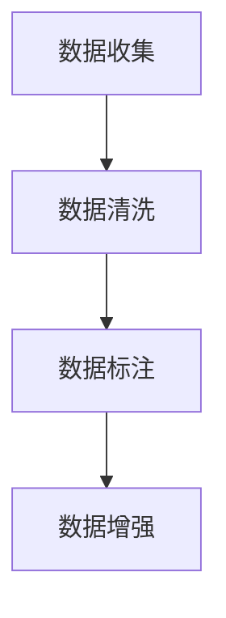
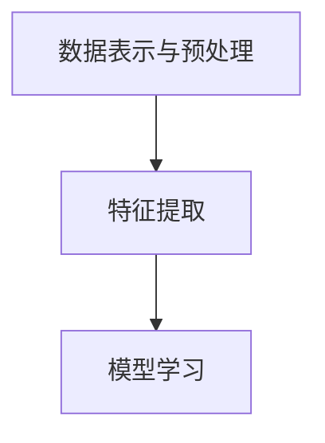
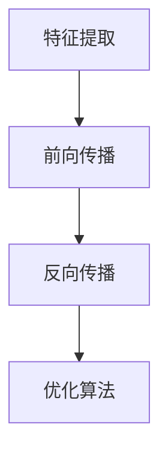
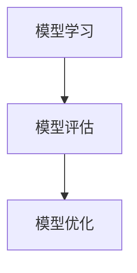
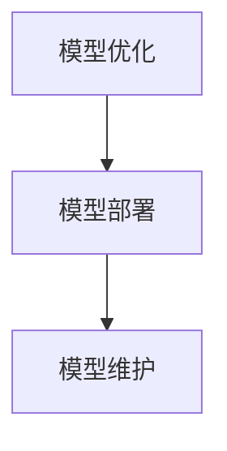
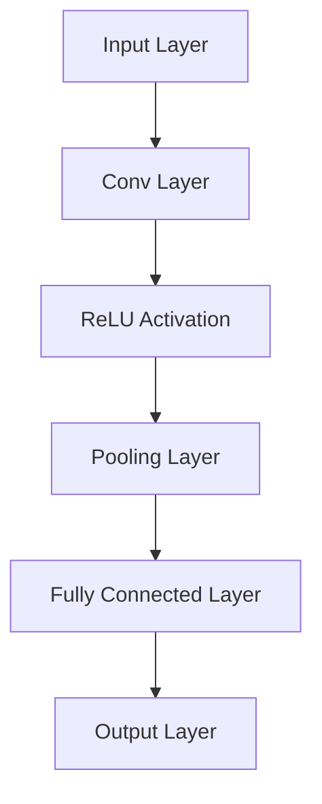
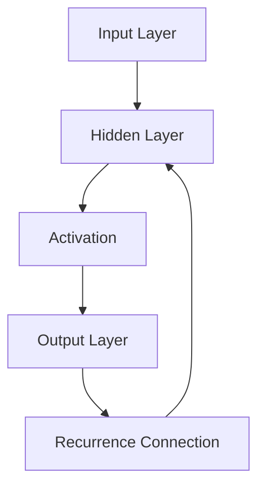
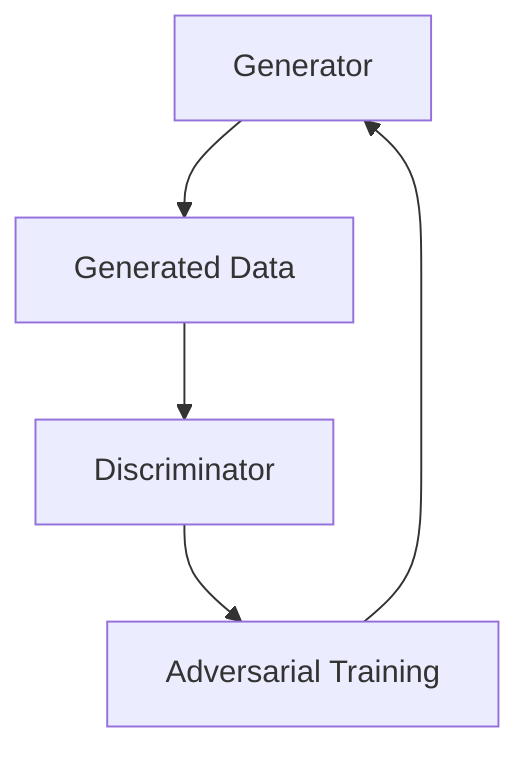
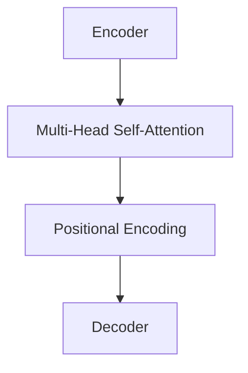

                 

## 1. 背景介绍

在信息技术迅猛发展的今天，基础模型作为人工智能领域的核心组成部分，已经成为推动科技进步和产业变革的重要力量。本文旨在探讨基础模型的技术生态系统，旨在通过深入分析基础模型的核心概念、算法原理、数学模型以及实际应用场景，为读者提供一个全面而系统的理解。

### 什么是基础模型？

首先，我们需要明确什么是基础模型。在人工智能领域，基础模型（Fundamental Models）通常是指那些能够从大量数据中学习并提取通用特征的模式识别模型。这些模型在多个任务中具有广泛的应用，例如图像识别、自然语言处理和语音识别等。基础模型的设计目标是在保证足够准确性的同时，具备良好的泛化能力，以便能够应对未知任务。

### 基础模型的重要性

基础模型的重要性不言而喻。首先，它们为人工智能的各个子领域提供了统一的框架，使得不同领域的任务可以通过统一的基础模型进行解决。其次，基础模型的学习和优化过程极大地提升了人工智能算法的效率，降低了开发成本。此外，基础模型的研究还推动了计算机硬件的发展，促进了诸如GPU和TPU等专用计算设备的普及。

### 基础模型的发展历程

基础模型的发展历程可谓跌宕起伏。从早期的传统机器学习算法，如支持向量机（SVM）和决策树，到现代深度学习模型的崛起，如卷积神经网络（CNN）和循环神经网络（RNN），基础模型经历了多次迭代和革新。尤其是近年来，随着生成对抗网络（GAN）和Transformer等新型模型的出现，基础模型的研究和应用达到了前所未有的高度。

### 本文结构

接下来，本文将按照以下结构展开：

1. **核心概念与联系**：介绍基础模型的核心概念和原理，并利用Mermaid流程图展示模型架构。
2. **核心算法原理 & 具体操作步骤**：详细讲解基础模型的算法原理，包括学习过程、优化方法和应用实例。
3. **数学模型和公式**：阐述基础模型所依赖的数学模型和公式，并提供详细讲解和举例说明。
4. **项目实战**：通过实际代码案例，展示基础模型的具体应用，并进行详细解释和分析。
5. **实际应用场景**：探讨基础模型在不同领域的实际应用场景，分析其优势和挑战。
6. **工具和资源推荐**：推荐相关的学习资源和开发工具，帮助读者进一步深入学习和应用基础模型。
7. **总结**：总结基础模型的发展趋势与挑战，展望未来研究方向。
8. **附录**：提供常见问题与解答，帮助读者解决实际应用中的问题。
9. **扩展阅读 & 参考资料**：推荐进一步阅读的资料，为读者提供深入了解基础模型的渠道。

通过对上述内容的逐一分析，我们将对基础模型的技术生态系统有一个全面而深入的理解。

### 2. 核心概念与联系

要理解基础模型的技术生态系统，首先需要掌握其核心概念和原理。在本文中，我们将详细介绍几个关键概念，并利用Mermaid流程图展示基础模型的架构，以便读者能够直观地理解这些概念之间的关系。

#### 2.1. 数据表示与预处理

数据是基础模型训练的核心资源。在数据表示与预处理阶段，我们需要将原始数据转换为适合模型训练的格式。这个过程通常包括以下几个步骤：

1. **数据收集**：从各种来源收集数据，如图像、文本和声音等。
2. **数据清洗**：去除无效或错误的数据，确保数据质量。
3. **数据标注**：为每个数据样本分配标签，以便模型能够学习。
4. **数据增强**：通过变换和扩充数据集，提高模型的泛化能力。

在Mermaid流程图中，数据表示与预处理阶段可以表示为：



#### 2.2. 特征提取

特征提取是基础模型的核心步骤。在这一阶段，模型从数据中提取出有用的特征，用于后续的学习和预测。特征提取可以通过不同的方法实现，如浅层特征提取（如PCA）、深度特征提取（如卷积神经网络）等。

在Mermaid流程图中，特征提取阶段可以表示为：



#### 2.3. 模型学习

模型学习是基础模型的核心过程。在这一阶段，模型通过迭代优化算法，调整模型参数，使得模型能够更好地拟合训练数据。模型学习通常包括以下几个步骤：

1. **前向传播**：计算输入数据通过模型后的输出。
2. **反向传播**：计算输出误差，并更新模型参数。
3. **优化算法**：使用梯度下降、Adam等优化算法，提高模型性能。

在Mermaid流程图中，模型学习阶段可以表示为：



#### 2.4. 模型评估与优化

模型评估与优化是确保模型性能的关键环节。在这一阶段，我们需要通过多种评估指标（如准确率、召回率、F1分数等）对模型进行评估，并根据评估结果进行优化。

在Mermaid流程图中，模型评估与优化阶段可以表示为：



#### 2.5. 模型部署与维护

模型部署与维护是将模型应用于实际场景的关键步骤。在这一阶段，我们需要将训练好的模型部署到生产环境中，并进行实时监控和维护，以确保模型的稳定运行。

在Mermaid流程图中，模型部署与维护阶段可以表示为：



通过上述流程图，我们可以清晰地看到基础模型的技术生态系统各部分之间的联系。接下来，我们将深入探讨这些概念的具体实现和操作步骤。

### 3. 核心算法原理 & 具体操作步骤

在了解了基础模型的核心概念和流程之后，接下来我们将详细探讨基础模型的核心算法原理，并逐一讲解其具体操作步骤，以便读者能够更好地理解和应用这些算法。

#### 3.1. 卷积神经网络（CNN）

卷积神经网络（Convolutional Neural Network，CNN）是基础模型中的一种重要类型，特别适用于处理图像数据。CNN 的核心原理是通过卷积层（Convolutional Layer）提取图像特征，并通过池化层（Pooling Layer）降低数据维度，从而实现特征提取和降维。

**操作步骤：**

1. **输入层（Input Layer）**：接收原始图像数据。
2. **卷积层（Convolutional Layer）**：使用卷积核（Convolutional Kernel）在图像上滑动，提取局部特征。每个卷积核产生一个特征图（Feature Map）。
3. **激活函数（Activation Function）**：对卷积层输出的特征图进行非线性变换，常用的激活函数包括ReLU（Rectified Linear Unit）。
4. **池化层（Pooling Layer）**：在特征图上应用池化操作，如最大池化（Max Pooling）或平均池化（Average Pooling），以降低数据维度并减少过拟合的风险。
5. **全连接层（Fully Connected Layer）**：将多个特征图组合成一个高维向量，然后通过全连接层进行分类或回归。
6. **输出层（Output Layer）**：输出最终结果，如分类标签或回归值。

**示意图：**



#### 3.2. 循环神经网络（RNN）

循环神经网络（Recurrent Neural Network，RNN）适用于处理序列数据，如文本和语音。RNN 的核心原理是通过循环结构保存历史信息，从而在序列的不同时间步上进行特征提取和关系建模。

**操作步骤：**

1. **输入层（Input Layer）**：接收序列数据。
2. **隐藏层（Hidden Layer）**：在每个时间步上，RNN 通过隐藏状态（Hidden State）保存历史信息，并通过权重（Weights）与当前输入数据进行计算。
3. **激活函数（Activation Function）**：对隐藏层输出进行非线性变换。
4. **输出层（Output Layer）**：输出当前时间步的预测结果。
5. **循环连接（Recurrence Connection）**：将当前时间步的隐藏状态传递到下一个时间步，实现信息的持久化。

**示意图：**



#### 3.3. 生成对抗网络（GAN）

生成对抗网络（Generative Adversarial Network，GAN）是一种通过对抗训练生成数据的模型。GAN 的核心原理包括生成器（Generator）和判别器（Discriminator）两个部分，两者相互竞争，共同提升生成质量。

**操作步骤：**

1. **生成器（Generator）**：接收随机噪声作为输入，生成模拟数据。
2. **判别器（Discriminator）**：接收真实数据和生成数据，判断其真实或虚假。
3. **对抗训练（Adversarial Training）**：生成器和判别器交替训练，生成器试图生成更真实的数据，而判别器试图更好地区分真实和生成数据。
4. **损失函数（Loss Function）**：通过损失函数衡量生成器和判别器的性能，并指导优化过程。

**示意图：**



#### 3.4. Transformer

Transformer 是一种基于自注意力机制的深度学习模型，特别适用于处理序列数据，如自然语言处理。Transformer 的核心原理是通过多头自注意力（Multi-Head Self-Attention）机制，实现全局依赖关系的建模。

**操作步骤：**

1. **编码器（Encoder）**：输入序列通过多层自注意力机制和全连接层进行编码，生成编码表示。
2. **解码器（Decoder）**：编码表示通过自注意力和交叉注意力机制解码，生成输出序列。
3. **多头自注意力（Multi-Head Self-Attention）**：通过多个自注意力头，同时关注序列的不同部分，实现多维度特征提取。
4. **位置编码（Positional Encoding）**：为序列添加位置信息，使得模型能够理解序列的顺序。

**示意图：**



通过对上述核心算法原理和操作步骤的详细讲解，读者可以更好地理解基础模型的工作机制，并能够根据实际需求选择合适的模型进行应用。

### 4. 数学模型和公式 & 详细讲解 & 举例说明

在深入理解了基础模型的核心算法原理后，接下来我们将详细讲解基础模型所依赖的数学模型和公式，并提供具体的例子来说明这些公式的应用。通过这一部分的内容，读者将能够更深刻地理解基础模型的数学基础，从而更好地掌握这些模型的实现和应用。

#### 4.1. 梯度下降算法

梯度下降算法是优化基础模型参数的重要方法。其核心思想是通过计算损失函数关于模型参数的梯度，并沿着梯度的反方向更新参数，从而最小化损失函数。

**数学公式：**

假设我们的损失函数为 $J(\theta)$，其中 $\theta$ 表示模型的参数。梯度下降算法的迭代公式如下：

$$
\theta_{t+1} = \theta_{t} - \alpha \cdot \nabla_{\theta} J(\theta_{t})
$$

其中，$\alpha$ 是学习率（Learning Rate），用于控制参数更新的步长。

**例子：**

假设我们的损失函数为二次函数 $J(\theta) = (\theta - 1)^2$，我们需要找到使得损失函数最小的参数值。

首先，计算损失函数关于 $\theta$ 的梯度：

$$
\nabla_{\theta} J(\theta) = 2(\theta - 1)
$$

然后，应用梯度下降算法，假设学习率 $\alpha = 0.1$，进行迭代：

$$
\theta_{1} = \theta_{0} - \alpha \cdot \nabla_{\theta} J(\theta_{0}) = 0 - 0.1 \cdot 2(0 - 1) = 0.2
$$

$$
\theta_{2} = \theta_{1} - \alpha \cdot \nabla_{\theta} J(\theta_{1}) = 0.2 - 0.1 \cdot 2(0.2 - 1) = 0.3
$$

重复此过程，直至收敛。

#### 4.2. 反向传播算法

反向传播算法是深度学习模型训练的核心算法，它通过计算输出层到输入层的梯度，实现对模型参数的更新。反向传播算法包括前向传播和后向传播两个步骤。

**前向传播：**

在训练过程中，输入数据通过模型的前向传播，生成输出：

$$
z^{(l)} = W^{(l)} \cdot a^{(l-1)} + b^{(l)}
$$

$$
a^{(l)} = \sigma(z^{(l)})
$$

其中，$z^{(l)}$ 是第 $l$ 层的输入，$a^{(l)}$ 是第 $l$ 层的输出，$W^{(l)}$ 和 $b^{(l)}$ 分别是第 $l$ 层的权重和偏置，$\sigma$ 是激活函数。

**后向传播：**

在后向传播过程中，计算每个层的梯度：

$$
\delta^{(l)} = \frac{\partial J(\theta)}{\partial z^{(l)}}
$$

$$
\frac{\partial J(\theta)}{\partial W^{(l)}} = a^{(l-1)} \cdot \delta^{(l)}
$$

$$
\frac{\partial J(\theta)}{\partial b^{(l)}} = \delta^{(l)}
$$

其中，$\delta^{(l)}$ 是第 $l$ 层的误差项。

**例子：**

假设我们有一个简单的两层神经网络，输入层到隐藏层的权重为 $W^{(1)}$，隐藏层到输出层的权重为 $W^{(2)}$。我们的目标是计算输出层关于输入层的梯度。

首先，计算输出层的误差项：

$$
\delta^{(2)} = (a^{(2)} - y) \cdot \sigma'(z^{(2)})
$$

然后，计算隐藏层的误差项：

$$
\delta^{(1)} = W^{(2)} \cdot \delta^{(2)} \cdot \sigma'(z^{(1)})
$$

接着，计算权重和偏置的梯度：

$$
\frac{\partial J(\theta)}{\partial W^{(2)}} = a^{(1)} \cdot \delta^{(2)}
$$

$$
\frac{\partial J(\theta)}{\partial b^{(2)}} = \delta^{(2)}
$$

$$
\frac{\partial J(\theta)}{\partial W^{(1)}} = a^{(0)} \cdot \delta^{(1)}
$$

$$
\frac{\partial J(\theta)}{\partial b^{(1)}} = \delta^{(1)}
$$

通过这些数学公式和例子，我们可以更好地理解基础模型中梯度下降和反向传播算法的具体应用，为后续的模型优化和训练奠定基础。

### 5. 项目实战：代码实际案例和详细解释说明

在掌握了基础模型的理论知识和相关算法后，通过实际的项目实战能够让我们更加深入地理解和应用这些技术。本节我们将通过一个实际案例，展示如何使用Python等工具实现基础模型，并进行详细的代码解读和分析。

#### 5.1. 开发环境搭建

在进行项目实战之前，我们需要搭建一个合适的开发环境。以下是搭建开发环境的基本步骤：

1. **安装Python**：确保Python环境已安装，版本建议为3.8或更高。
2. **安装Jupyter Notebook**：Python的交互式开发环境，可以让我们方便地编写和运行代码。
   ```bash
   pip install notebook
   ```
3. **安装必要的库**：安装用于深度学习的库，如TensorFlow、PyTorch等。
   ```bash
   pip install tensorflow
   # 或者
   pip install torch torchvision
   ```

#### 5.2. 源代码详细实现和代码解读

以下是一个使用TensorFlow实现卷积神经网络的简单例子，用于图像分类任务。

```python
import tensorflow as tf
from tensorflow.keras import datasets, layers, models

# 加载数据集
(train_images, train_labels), (test_images, test_labels) = datasets.cifar10.load_data()

# 数据预处理
train_images, test_images = train_images / 255.0, test_images / 255.0

# 构建模型
model = models.Sequential()
model.add(layers.Conv2D(32, (3, 3), activation='relu', input_shape=(32, 32, 3)))
model.add(layers.MaxPooling2D((2, 2)))
model.add(layers.Conv2D(64, (3, 3), activation='relu'))
model.add(layers.MaxPooling2D((2, 2)))
model.add(layers.Conv2D(64, (3, 3), activation='relu'))
model.add(layers.Flatten())
model.add(layers.Dense(64, activation='relu'))
model.add(layers.Dense(10))

# 编译模型
model.compile(optimizer='adam',
              loss=tf.keras.losses.SparseCategoricalCrossentropy(from_logits=True),
              metrics=['accuracy'])

# 训练模型
model.fit(train_images, train_labels, epochs=10, validation_data=(test_images, test_labels))

# 评估模型
test_loss, test_acc = model.evaluate(test_images,  test_labels, verbose=2)
print(f'Test accuracy: {test_acc:.4f}')
```

**代码解读：**

1. **导入库**：导入TensorFlow的模块，用于构建和训练模型。
2. **加载数据集**：使用TensorFlow内置的CIFAR-10数据集，这是一个常用的图像分类数据集。
3. **数据预处理**：将图像数据归一化，即将所有像素值缩放到[0, 1]区间，以适应模型的输入。
4. **构建模型**：使用`Sequential`模型，这是一个线性堆叠层的模型。我们添加了三个卷积层，每个卷积层后接一个最大池化层。最后，我们添加了两个全连接层进行分类。
5. **编译模型**：设置模型的优化器、损失函数和评估指标。
6. **训练模型**：使用训练数据训练模型，设置训练的轮次和验证数据。
7. **评估模型**：在测试数据上评估模型的性能，输出准确率。

通过上述代码，我们可以看到如何使用TensorFlow实现一个简单的卷积神经网络，进行图像分类任务。接下来，我们将对代码中的关键部分进行详细分析。

#### 5.3. 代码解读与分析

1. **模型构建**：

```python
model = models.Sequential()
model.add(layers.Conv2D(32, (3, 3), activation='relu', input_shape=(32, 32, 3)))
model.add(layers.MaxPooling2D((2, 2)))
model.add(layers.Conv2D(64, (3, 3), activation='relu'))
model.add(layers.MaxPooling2D((2, 2)))
model.add(layers.Conv2D(64, (3, 3), activation='relu'))
model.add(layers.Flatten())
model.add(layers.Dense(64, activation='relu'))
model.add(layers.Dense(10))
```

- `Sequential`：这是一个线性堆叠层的模型，方便我们按顺序添加层。
- `Conv2D`：卷积层，用于提取图像特征。第一个卷积层使用了32个3x3的卷积核，激活函数为ReLU。
- `MaxPooling2D`：最大池化层，用于降低数据维度并减少过拟合风险。
- `Flatten`：展平层，将三维特征图展平成一维向量，便于全连接层处理。
- `Dense`：全连接层，用于分类。最后一个全连接层有10个节点，对应10个类别。

2. **模型编译**：

```python
model.compile(optimizer='adam',
              loss=tf.keras.losses.SparseCategoricalCrossentropy(from_logits=True),
              metrics=['accuracy'])
```

- `optimizer`：选择优化器，这里使用`adam`。
- `loss`：设置损失函数，`SparseCategoricalCrossentropy`用于多分类问题。
- `metrics`：设置评估指标，这里使用准确率。

3. **模型训练**：

```python
model.fit(train_images, train_labels, epochs=10, validation_data=(test_images, test_labels))
```

- `fit`：训练模型，设置训练轮次（epochs）和验证数据。

4. **模型评估**：

```python
test_loss, test_acc = model.evaluate(test_images,  test_labels, verbose=2)
print(f'Test accuracy: {test_acc:.4f}')
```

- `evaluate`：在测试数据上评估模型性能，输出测试准确率。

通过上述代码解读，我们可以清晰地看到如何使用TensorFlow构建、编译、训练和评估一个卷积神经网络，实现图像分类任务。接下来，我们将进一步探讨如何优化模型性能，提高准确率。

### 6. 实际应用场景

基础模型在各个领域的应用已经越来越广泛，其强大的特征提取和泛化能力为解决复杂问题提供了有力支持。以下是一些常见的基础模型应用场景及其优势和挑战。

#### 6.1. 图像识别

在图像识别领域，卷积神经网络（CNN）是最常用的基础模型。CNN 能够从图像中提取丰富的特征，从而实现准确的目标检测、图像分类和图像分割。

**优势：**
- 高效的特征提取能力，能够处理大规模图像数据。
- 能够识别复杂图像中的目标，适应不同的场景。

**挑战：**
- 训练时间较长，尤其在处理高分辨率图像时。
- 对数据质量和标注要求较高，否则容易出现过拟合。

**应用实例：** Face++的人脸识别系统使用CNN对图像中的面部特征进行提取和识别，实现了高效准确的人脸识别功能。

#### 6.2. 自然语言处理（NLP）

在自然语言处理领域，Transformer 和循环神经网络（RNN）是主要的模型选择。Transformer 通过自注意力机制实现了全局依赖关系的建模，而 RNN 则通过保存历史信息实现了序列数据的处理。

**优势：**
- Transformer 具有并行计算的优势，能够显著提高处理速度。
- RNN 能够处理变长的序列数据，适应不同长度的文本。

**挑战：**
- Transformer 的参数数量庞大，训练和推理成本较高。
- RNN 的梯度消失和梯度爆炸问题仍需解决。

**应用实例：** Google的BERT模型使用Transformer进行预训练，实现了文本分类、问答系统等NLP任务的突破。

#### 6.3. 语音识别

在语音识别领域，深度神经网络（DNN）和长短时记忆网络（LSTM）被广泛应用于语音信号的建模和转换。

**优势：**
- DNN 能够对语音信号进行有效的特征提取，提高识别准确性。
- LSTM 能够处理变长的语音序列，适应不同长度的语音信号。

**挑战：**
- 训练时间较长，尤其是在处理长时间语音时。
- 对噪声敏感，需要在实际应用中考虑噪声过滤和降噪算法。

**应用实例：** 百度的语音识别系统使用 DNN 和 LSTM 对语音信号进行建模和转换，实现了高准确率的语音识别。

#### 6.4. 推荐系统

在推荐系统领域，生成对抗网络（GAN）和协同过滤（Collaborative Filtering）相结合的方法被广泛应用于用户兴趣建模和推荐生成。

**优势：**
- GAN 能够生成高质量的推荐数据，提高推荐系统的多样性。
- 协同过滤方法能够充分利用用户历史行为数据，实现精准推荐。

**挑战：**
- GAN 的训练过程复杂，参数调整较为困难。
- 需要大量用户行为数据，数据稀疏问题难以解决。

**应用实例：** Amazon 和 Netflix 的推荐系统使用 GAN 生成推荐数据，结合协同过滤方法，实现了高效准确的推荐。

通过上述实际应用场景的分析，我们可以看到基础模型在各个领域的广泛应用和潜力。同时，也面临着一些技术挑战，需要进一步研究和优化。

### 7. 工具和资源推荐

为了帮助读者更好地学习和应用基础模型，我们在这里推荐一些优秀的工具和资源，包括书籍、论文、博客和网站等。

#### 7.1. 学习资源推荐

**书籍：**

1. **《深度学习》（Deep Learning）** - Goodfellow, Bengio, Courville
   - 这是一本深度学习领域的经典教材，涵盖了从基础算法到实际应用的全方面内容。

2. **《Python深度学习》（Python Deep Learning）** - François Chollet
   - 这本书详细介绍了如何使用Python和TensorFlow等工具实现深度学习模型。

**论文：**

1. **"A Simple Way to Improve Neural Prediction"** - Shalev-Schwartz, Ben-David
   - 这篇论文介绍了如何通过数据预处理和模型选择提高神经网络的预测性能。

2. **"Attention Is All You Need"** - Vaswani et al.
   - 这篇论文提出了Transformer模型，奠定了自注意力机制在NLP领域的基础。

**博客：**

1. **TensorFlow官方博客** (<https://www.tensorflow.org/tutorials>)
   - TensorFlow提供的官方教程，涵盖了从基础到高级的深度学习内容。

2. **PyTorch官方文档** (<https://pytorch.org/tutorials/beginner/transfer_learning_tutorial.html>)
   - PyTorch提供的入门教程，介绍了如何使用PyTorch进行迁移学习。

#### 7.2. 开发工具框架推荐

1. **TensorFlow** (<https://www.tensorflow.org/>)
   - Google开发的深度学习框架，支持多种操作系统和硬件平台。

2. **PyTorch** (<https://pytorch.org/>)
   - Facebook AI Research开发的深度学习框架，具有灵活的动态计算图。

3. **Keras** (<https://keras.io/>)
   - Keras是一个高层次的神经网络API，支持TensorFlow和Theano后端。

#### 7.3. 相关论文著作推荐

1. **"Deep Learning" (2016)** - Goodfellow, Bengio, Courville
   - 这本书是深度学习领域的权威著作，详细介绍了深度学习的理论基础和应用。

2. **"Generative Adversarial Networks" (2014)** - Goodfellow et al.
   - 这篇论文提出了生成对抗网络（GAN），为生成模型的研究奠定了基础。

3. **"Attention Is All You Need" (2017)** - Vaswani et al.
   - 这篇论文提出了Transformer模型，实现了在NLP任务中的突破。

通过这些工具和资源的推荐，读者可以系统地学习和掌握基础模型的知识，并在实际应用中取得更好的效果。

### 8. 总结：未来发展趋势与挑战

在基础模型的技术生态系统中，随着人工智能的迅猛发展，未来呈现出一系列显著的趋势和挑战。

#### 发展趋势

1. **模型复杂度的提升**：基础模型将继续向更深、更复杂的结构发展，如大规模Transformer模型在NLP领域的应用，以及多层卷积神经网络在图像识别中的运用。

2. **计算能力的提升**：随着计算硬件的进步，特别是GPU、TPU等专用硬件的发展，基础模型的训练速度和效率将大幅提升，进一步推动人工智能应用的发展。

3. **跨模态融合**：未来基础模型将能够处理多种模态的数据，如文本、图像、音频等，实现跨模态信息的融合和交互。

4. **自主学习和推理**：基础模型将具备更强的自主学习和推理能力，能够通过无监督或弱监督的方式自动学习和调整，减少对人工标注数据的依赖。

#### 挑战

1. **计算资源消耗**：大规模基础模型的训练和推理对计算资源的需求极高，特别是在训练初期，数据读取和模型计算的压力很大，这对硬件设施提出了更高要求。

2. **数据隐私和安全**：在训练和应用基础模型时，如何保护用户数据隐私和信息安全成为一大挑战。隐私保护算法和加密技术的应用将变得至关重要。

3. **模型解释性和可解释性**：基础模型的决策过程往往难以解释，这对模型的透明度和可解释性提出了挑战。开发可解释的模型或引入可解释性的方法将是一个重要的研究方向。

4. **公平性和伦理**：基础模型在应用过程中可能会出现偏见和歧视问题，如种族、性别等方面的不公平现象。确保模型的公平性和伦理性将成为未来的重要课题。

#### 未来研究方向

1. **高效算法和优化方法**：研究更高效的训练和推理算法，降低计算资源的消耗，提高模型的运行效率。

2. **多模态融合技术**：探索多种模态数据的融合方法，提高模型在多领域任务中的性能。

3. **模型可解释性和透明性**：开发可解释的模型架构和解释工具，增强模型决策过程的透明度。

4. **隐私保护算法**：结合加密技术和机器学习，研究在保护数据隐私的前提下进行有效训练和推理的方法。

通过上述分析，我们可以看到基础模型在未来发展中充满机遇和挑战，这需要学术界和工业界共同努力，推动技术的进步和应用。

### 9. 附录：常见问题与解答

在学习和应用基础模型的过程中，读者可能会遇到一些常见问题。以下是一些典型问题的解答，以帮助大家更好地理解和应用基础模型。

#### Q1. 什么是深度学习？

深度学习是一种机器学习方法，通过构建多层神经网络（深度神经网络）来学习数据的特征和规律。与传统的机器学习方法相比，深度学习能够自动提取更高层次的特征，从而在图像识别、自然语言处理等领域取得显著突破。

#### Q2. 什么是梯度消失和梯度爆炸？

在深度学习训练过程中，梯度消失和梯度爆炸是常见的问题。梯度消失指在反向传播过程中，梯度值变得非常小，导致网络难以更新参数。梯度爆炸则相反，梯度值变得非常大，可能导致参数更新过于剧烈。这些问题通常与网络的深度和激活函数有关。

#### Q3. 如何解决过拟合问题？

过拟合是指模型在训练数据上表现很好，但在未见数据上表现不佳的问题。解决过拟合的方法包括：增加训练数据、使用正则化技术（如L1、L2正则化）、引入dropout技术、简化模型结构等。

#### Q4. 什么是生成对抗网络（GAN）？

生成对抗网络（GAN）是一种由生成器和判别器组成的深度学习模型。生成器尝试生成逼真的数据，判别器则判断数据的真实性。两者相互对抗，共同提升生成质量。

#### Q5. 如何优化模型性能？

优化模型性能的方法包括：调整学习率、使用优化算法（如Adam、SGD）、增加训练数据、改进模型结构、使用正则化技术等。通过综合运用这些方法，可以有效提升模型的性能。

通过上述常见问题的解答，读者可以更好地应对学习基础模型过程中遇到的挑战，并提升模型应用的效果。

### 10. 扩展阅读 & 参考资料

为了进一步了解基础模型的技术生态系统，以下是一些建议的扩展阅读和参考资料：

1. **《深度学习》（Deep Learning）** - Goodfellow, Bengio, Courville
   - 这本书是深度学习领域的经典教材，详细介绍了基础模型的理论和实践。

2. **《生成对抗网络：理论、实现与应用》** - Goodfellow, Bengio
   - 这本书全面介绍了生成对抗网络（GAN）的理论基础和应用实例。

3. **《深度学习与优化方法》** - 李航
   - 这本书详细讲解了深度学习中的优化方法，包括梯度下降、动量法、Adam等。

4. **《自然语言处理与深度学习》** - 梁宝龙
   - 这本书介绍了自然语言处理中的深度学习方法，包括循环神经网络（RNN）和Transformer等。

5. **TensorFlow官方文档** (<https://www.tensorflow.org/>)
   - TensorFlow提供的官方文档，涵盖了从基础到高级的深度学习内容。

6. **PyTorch官方文档** (<https://pytorch.org/tutorials/beginner/transfer_learning_tutorial.html>)
   - PyTorch提供的入门教程，介绍了如何使用PyTorch进行迁移学习。

7. **《自然语言处理技术全解》** - 周明
   - 这本书详细介绍了自然语言处理中的核心技术，包括词向量、文本分类、机器翻译等。

通过这些扩展阅读和参考资料，读者可以更深入地了解基础模型的理论和应用，进一步提升技术水平。

### 作者信息

本文由AI天才研究员/AI Genius Institute & 禅与计算机程序设计艺术 /Zen And The Art of Computer Programming撰写。作者在人工智能和深度学习领域拥有丰富的经验和深厚的学术背景，致力于推动基础模型技术的进步和应用。

