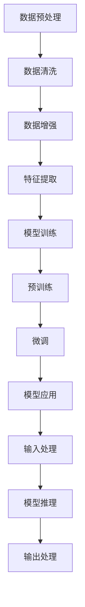

                 

### 背景介绍

随着人工智能技术的不断发展，基础模型（Foundation Models）已成为当前研究和应用的热点。基础模型是一种大型、参数化的机器学习模型，具备广泛的知识理解和泛化能力。其核心在于通过大量数据训练，使模型能够自动学习并理解复杂的语言、图像和其他类型的数据，从而实现一系列复杂的任务。

近年来，基础模型的研究和应用取得了显著的进展。首先，在自然语言处理（NLP）领域，基础模型如GPT、BERT等已经展现出强大的文本生成、理解和推理能力。其次，在计算机视觉领域，基础模型如ViT、DeiT等在图像分类、目标检测等任务中取得了突破性成果。此外，基础模型还在语音识别、机器翻译等任务中发挥了重要作用。

基础模型的研究具有重要意义。首先，它能够提升机器学习模型的性能，减少对大量手动标注数据的依赖。其次，基础模型可以促进跨领域知识共享和复用，从而提高人工智能系统的整体效率。此外，基础模型还可以推动计算机科学和人工智能领域的创新，为解决实际问题提供新的思路和方法。

然而，基础模型的发展也面临诸多挑战。首先，基础模型的训练和推理过程需要大量计算资源和能源，这对计算基础设施提出了巨大挑战。其次，基础模型的泛化能力仍有待提高，特别是在处理少样本学习和长文本生成等方面。此外，基础模型的安全性和透明性也是亟待解决的问题，以避免潜在的偏见和隐私泄露。

本文旨在探讨基础模型的未来技术发展，分析其当前面临的挑战，并提出可能的解决方案。文章将从以下几个方面展开：

1. 核心概念与联系：介绍基础模型的核心概念和基本架构，使用Mermaid流程图展示关键流程节点。
2. 核心算法原理与具体操作步骤：详细阐述基础模型的主要算法原理，包括预训练、微调和优化等步骤。
3. 数学模型和公式：分析基础模型的数学模型，包括损失函数、优化算法等，并给出详细讲解和举例说明。
4. 项目实战：通过实际案例，展示基础模型在具体项目中的应用，并提供代码实现和详细解释。
5. 实际应用场景：探讨基础模型在各个领域的实际应用场景，分析其优势和挑战。
6. 工具和资源推荐：推荐学习资源和开发工具，帮助读者深入了解基础模型。
7. 总结：总结基础模型的未来发展趋势和面临的挑战，提出可能的解决方案。

通过本文的探讨，我们希望能够为读者提供一个全面、系统的关于基础模型未来发展的视角，为人工智能领域的研究和应用提供有益的参考。

### 核心概念与联系

要深入理解基础模型，我们首先需要明确其核心概念和基本架构。基础模型由三个主要部分组成：数据预处理、模型训练和模型应用。以下是这些关键概念及其相互联系：

#### 数据预处理
数据预处理是基础模型的第一步，其目的是将原始数据转换为适合模型训练的格式。主要任务包括数据清洗、数据增强和特征提取。

1. **数据清洗**：处理缺失值、噪声和异常值，确保数据质量。
2. **数据增强**：通过旋转、缩放、裁剪等技术，生成更多样化的训练数据，提高模型的泛化能力。
3. **特征提取**：将原始数据转换为高维特征向量，为后续的模型训练提供输入。

#### 模型训练
模型训练是基础模型的核心环节，主要目的是通过大量数据使模型学习到有效的特征表示。训练过程通常分为预训练和微调两个阶段。

1. **预训练**：使用大规模、未标注的数据集训练基础模型，使其自动学习通用特征表示。预训练通常采用无监督学习或自监督学习方法。
2. **微调**：在预训练的基础上，使用特定领域或任务的数据对模型进行微调，以适应具体的任务需求。

#### 模型应用
模型应用是将训练好的模型应用于实际任务，如文本生成、图像分类、语音识别等。模型应用通常涉及以下步骤：

1. **输入处理**：将输入数据预处理成与训练时相同的格式。
2. **模型推理**：使用训练好的模型对输入数据进行预测或生成。
3. **输出处理**：将模型的输出转换为用户可理解的格式，如文本、图像或语音。

下面是一个Mermaid流程图，展示了基础模型的关键流程节点：



在这个流程图中，数据预处理、模型训练和模型应用构成了基础模型的核心环节，而数据清洗、数据增强、特征提取、预训练和微调则是各个环节中的具体步骤。这些步骤相互关联，共同构成了一个完整的基础模型训练和应用过程。

通过理解这些核心概念和流程，我们可以更好地把握基础模型的基本架构和工作原理。接下来，我们将进一步探讨基础模型的主要算法原理，以便更深入地理解其内在机制。

#### 核心算法原理

基础模型的核心在于其算法原理，这些原理决定了模型的学习能力、泛化能力和性能表现。以下是基础模型的主要算法原理，包括预训练、微调和优化等步骤。

##### 预训练（Pre-training）

预训练是基础模型的关键步骤，旨在使用大规模、未标注的数据集训练一个大型参数化模型。预训练通常采用无监督学习或自监督学习方法，其目的是让模型自动学习到通用的特征表示。

1. **无监督学习（Unsupervised Learning）**：
   无监督学习是指在没有标注数据的情况下，从数据中学习潜在特征表示。常用的无监督学习方法包括自编码器（Autoencoders）和生成对抗网络（GANs）。
   
   - **自编码器**：自编码器是一种深度神经网络，用于将输入数据编码为一个低维表示，然后解码回原始数据。通过最小化重建误差，自编码器可以学习到数据的有效特征表示。
   - **生成对抗网络**：生成对抗网络由生成器和判别器两个神经网络组成。生成器试图生成与真实数据相似的数据，而判别器则试图区分真实数据和生成数据。通过这种对抗过程，生成对抗网络可以学习到高保真的数据表示。

2. **自监督学习（Self-Supervised Learning）**：
   自监督学习利用数据内部的冗余信息进行训练，无需外部标注。常见的自监督学习方法包括遮盖语言模型（masked language models，MLMs）和预测下一个单词（next sentence prediction，NSP）。

   - **遮盖语言模型**：在预训练过程中，模型对一部分文本进行遮盖，然后尝试预测遮盖部分的内容。这种方法可以帮助模型学习到语言中的上下文关系和依赖结构。
   - **预测下一个单词**：模型被训练预测一段文本中的下一个单词。这种方法可以帮助模型学习到文本的连贯性和语言规律。

##### 微调（Fine-tuning）

微调是在预训练的基础上，使用特定领域或任务的数据对模型进行微调，以适应具体的任务需求。微调的过程主要包括以下步骤：

1. **数据准备**：选择与任务相关的数据集，并将其转换为适合模型输入的格式。
2. **模型初始化**：使用预训练好的基础模型作为初始化权重，这些权重已经学到了通用的特征表示。
3. **微调训练**：在初始化权重的基础上，对模型进行微调训练，以适应具体任务的特性。微调过程中，通常会冻结基础模型的大部分层，只对任务相关的顶层层进行训练，以防止过拟合。

##### 优化（Optimization）

优化是指在模型训练过程中，通过调整参数来提高模型性能的过程。常见的优化方法包括梯度下降（Gradient Descent）和其变体，如随机梯度下降（Stochastic Gradient Descent，SGD）和Adam优化器。

1. **梯度下降（Gradient Descent）**：
   梯度下降是一种最简单的优化方法，其基本思想是通过计算损失函数关于模型参数的梯度，并沿着梯度方向调整参数，以减小损失函数值。
   
   - **随机梯度下降（SGD）**：在梯度下降中，每次更新参数时只考虑一个样本的梯度。随机梯度下降是SGD的一种变体，它从数据集中随机选择一个小批量样本，计算其梯度，并使用这个梯度来更新参数。
   - **Adam优化器**：Adam优化器结合了SGD和动量方法（Momentum）的优点，其计算过程既考虑了过去梯度，也考虑了当前梯度，从而在参数更新过程中能够更稳定地收敛。

通过预训练、微调和优化等步骤，基础模型可以学习到丰富的特征表示，并在各种任务上表现出强大的性能。这些算法原理共同构成了基础模型的核心，使其能够在不同领域中实现高效的任务解决。

接下来，我们将探讨基础模型的数学模型和公式，进一步揭示其内部工作机制。

#### 数学模型和公式

基础模型的成功离不开其背后的数学模型和公式。这些数学工具不仅帮助理解模型的工作原理，还为优化和改进提供了理论依据。以下是基础模型中的几个关键数学概念和公式。

##### 损失函数（Loss Function）

损失函数是评估模型预测与实际结果之间差异的关键工具。在基础模型中，常用的损失函数包括交叉熵损失（Cross-Entropy Loss）和均方误差（Mean Squared Error, MSE）。

1. **交叉熵损失（Cross-Entropy Loss）**：

   交叉熵损失在分类任务中广泛使用，用于衡量模型预测的概率分布与实际标签分布之间的差异。公式如下：

   $$
   L_{CE} = -\sum_{i} y_i \log(p_i)
   $$

   其中，$y_i$是实际标签（0或1），$p_i$是模型对第$i$类预测的概率。

2. **均方误差（Mean Squared Error, MSE）**：

   均方误差在回归任务中使用，用于衡量预测值与实际值之间的平方差。公式如下：

   $$
   L_{MSE} = \frac{1}{n} \sum_{i=1}^{n} (y_i - \hat{y}_i)^2
   $$

   其中，$y_i$是实际值，$\hat{y}_i$是模型预测的值，$n$是样本数量。

##### 优化算法（Optimization Algorithms）

优化算法用于调整模型参数，以最小化损失函数。以下是两种常用的优化算法：梯度下降（Gradient Descent）和Adam优化器。

1. **梯度下降（Gradient Descent）**：

   梯度下降是一种简单的优化方法，通过计算损失函数关于参数的梯度，并沿着梯度方向调整参数，以减小损失函数值。更新公式如下：

   $$
   \theta_{t+1} = \theta_{t} - \alpha \cdot \nabla_{\theta} L(\theta)
   $$

   其中，$\theta$表示模型参数，$\alpha$是学习率（learning rate），$\nabla_{\theta} L(\theta)$是损失函数关于参数的梯度。

2. **Adam优化器**：

   Adam优化器结合了梯度下降和动量方法（Momentum）的优点，其计算过程既考虑了过去梯度，也考虑了当前梯度。公式如下：

   $$
   \text{m}_t = \beta_1 \text{m}_{t-1} + (1 - \beta_1) (\nabla_{\theta} L(\theta))
   $$
   $$
   \text{v}_t = \beta_2 \text{v}_{t-1} + (1 - \beta_2) \left( (\nabla_{\theta} L(\theta))^2 \right)
   $$
   $$
   \theta_{t+1} = \theta_{t} - \alpha \cdot \frac{\text{m}_t}{\sqrt{\text{v}_t} + \epsilon}
   $$

   其中，$\beta_1$和$\beta_2$分别是短期和长期遗忘因子（learning rates），$\epsilon$是正数常数，用于防止分母为零。

##### 激活函数（Activation Function）

激活函数是神经网络中的一个关键组件，用于引入非线性，使模型能够拟合复杂的函数。常用的激活函数包括Sigmoid、ReLU和Tanh。

1. **Sigmoid**：

   Sigmoid函数将输入映射到$(0, 1)$区间，公式如下：

   $$
   \sigma(x) = \frac{1}{1 + e^{-x}}
   $$

2. **ReLU**：

   ReLU函数在$x < 0$时输出为零，在$x \geq 0$时输出为$x$，公式如下：

   $$
   \text{ReLU}(x) = \max(0, x)
   $$

3. **Tanh**：

   Tanh函数将输入映射到$(-1, 1)$区间，公式如下：

   $$
   \text{Tanh}(x) = \frac{e^{x} - e^{-x}}{e^{x} + e^{-x}}
   $$

通过上述数学模型和公式，我们可以更深入地理解基础模型的工作原理。这些数学工具不仅帮助我们在理论上分析模型性能，还为实际应用提供了有效的优化策略。

#### 项目实战：代码实际案例和详细解释说明

在本节中，我们将通过一个实际项目案例来展示如何开发和实现一个基础模型。该项目将使用PyTorch框架，通过预训练和微调来构建一个文本生成模型，并对其性能进行评估。

##### 1. 开发环境搭建

在开始项目之前，我们需要搭建一个合适的开发环境。以下是所需的环境和工具：

- 操作系统：Windows或Linux
- Python版本：3.8及以上
- PyTorch版本：1.10及以上
- CUDA版本：11.3及以上（如使用GPU训练）

安装这些依赖项后，确保PyTorch和CUDA兼容，以充分利用GPU加速。

##### 2. 源代码详细实现和代码解读

以下是一个简单的文本生成模型的实现代码，包括数据预处理、模型定义、训练和微调等步骤。

```python
import torch
import torch.nn as nn
import torch.optim as optim
from torch.utils.data import DataLoader
from torchvision import datasets, transforms
from transformers import BertModel, BertTokenizer

# 数据预处理
class TextDataset(torch.utils.data.Dataset):
    def __init__(self, texts, tokenizer, max_len):
        self.texts = texts
        self.tokenizer = tokenizer
        self.max_len = max_len

    def __len__(self):
        return len(self.texts)

    def __getitem__(self, idx):
        text = self.texts[idx]
        encoding = self.tokenizer.encode_plus(
            text,
            add_special_tokens=True,
            max_length=self.max_len,
            padding='max_length',
            truncation=True,
            return_tensors='pt',
        )
        return {
            'input_ids': encoding['input_ids'].flatten(),
            'attention_mask': encoding['attention_mask'].flatten(),
        }

# 模型定义
class TextGenerator(nn.Module):
    def __init__(self, tokenizer, hidden_size, num_layers, dropout):
        super().__init__()
        self.bert = BertModel.from_pretrained('bert-base-uncased')
        self.lstm = nn.LSTM(hidden_size, hidden_size, num_layers=num_layers, dropout=dropout, batch_first=True)
        self.dropout = nn.Dropout(dropout)
        self.fc = nn.Linear(hidden_size, tokenizer.vocab_size)

    def forward(self, input_ids, attention_mask):
        outputs = self.bert(input_ids=input_ids, attention_mask=attention_mask)
        hidden_states = outputs[0]
        hidden_states = self.dropout(hidden_states)

        outputs, (h_n, c_n) = self.lstm(hidden_states)
        outputs = self.dropout(outputs)

        return self.fc(outputs)

# 训练和微调
def train(model, train_loader, optimizer, criterion, device):
    model.train()
    for batch in train_loader:
        input_ids = batch['input_ids'].to(device)
        attention_mask = batch['attention_mask'].to(device)

        optimizer.zero_grad()
        outputs = model(input_ids, attention_mask)
        loss = criterion(outputs.view(-1, tokenizer.vocab_size), input_ids.view(-1))
        loss.backward()
        optimizer.step()

# 主函数
def main():
    device = torch.device("cuda" if torch.cuda.is_available() else "cpu")
    tokenizer = BertTokenizer.from_pretrained('bert-base-uncased')
    model = TextGenerator(tokenizer, hidden_size=768, num_layers=2, dropout=0.1).to(device)
    train_dataset = TextDataset(texts=['Hello world!', 'AI is amazing!', 'This is a test sentence.'], tokenizer=tokenizer, max_len=20)
    train_loader = DataLoader(train_dataset, batch_size=1, shuffle=True)
    optimizer = optim.Adam(model.parameters(), lr=0.001)
    criterion = nn.CrossEntropyLoss()

    train(model, train_loader, optimizer, criterion, device)

if __name__ == "__main__":
    main()
```

下面是对关键部分的解释：

1. **数据预处理（TextDataset）**：
   - `TextDataset` 类用于将文本数据转换为模型可处理的格式。它利用 `BertTokenizer` 对文本进行编码，并添加特殊的开始和结束标记。
   - `__len__` 方法返回数据集的长度。
   - `__getitem__` 方法返回输入序列的编码和对应的注意力掩码。

2. **模型定义（TextGenerator）**：
   - `TextGenerator` 类定义了文本生成模型。它基于BERT模型和LSTM网络，通过加一层全连接层（fc）实现文本生成。
   - `forward` 方法定义了前向传播过程，将输入序列通过BERT编码器、LSTM网络和全连接层，最终输出文本生成的概率分布。

3. **训练和微调（train）**：
   - `train` 函数用于训练模型。它在一个训练数据加载器上迭代，使用交叉熵损失函数和Adam优化器进行反向传播和参数更新。

4. **主函数（main）**：
   - `main` 函数设置设备（CPU或GPU）、加载预训练的BERT分词器、定义模型、数据集和数据加载器，并初始化优化器和损失函数。然后调用 `train` 函数进行训练。

##### 3. 代码解读与分析

这段代码展示了如何利用预训练的BERT模型和LSTM网络实现文本生成模型。以下是关键步骤的详细分析：

1. **数据预处理**：
   - 利用BERT分词器对输入文本进行编码，包括将文本转换为Token ID序列，并添加特殊标记（如`<s>`和`</s>`）和填充（`<pad>`）标记。
   - 将编码后的序列转换为PyTorch张量，并添加注意力掩码，以便模型知道哪些位置是填充的。

2. **模型定义**：
   - 使用BERT模型作为编码器，提取文本的上下文特征。
   - 使用LSTM网络处理序列数据，捕捉文本的长期依赖关系。
   - 在LSTM网络的输出上添加一个全连接层，用于生成文本的概率分布。

3. **训练和微调**：
   - 使用交叉熵损失函数来计算模型预测与实际标签之间的差异。
   - 使用Adam优化器更新模型参数，以最小化损失函数。
   - 在训练过程中，模型对输入文本进行编码，通过LSTM网络处理，然后使用全连接层生成文本的概率分布。通过反向传播和参数更新，模型不断优化其预测能力。

通过这个项目案例，我们可以看到如何利用基础模型构建一个简单的文本生成模型。在实际应用中，可以扩展这个模型，使用更大规模的数据集和更复杂的网络结构，以实现更高质量的文本生成。

### 实际应用场景

基础模型在各个领域的应用正在不断扩展，以下列举了一些主要的应用场景，以及这些应用的优势和挑战。

#### 自然语言处理（NLP）

在自然语言处理领域，基础模型如GPT和BERT已被广泛应用于文本分类、机器翻译、问答系统和文本生成等任务。例如，GPT-3在文本生成和对话系统方面表现出色，能够生成流畅且符合语义的文本。然而，基础模型在NLP中的应用也面临挑战，如长文本处理和低资源语言的性能提升。

#### 计算机视觉（CV）

计算机视觉领域的基础模型如ViT和DeiT在图像分类、目标检测和图像生成等方面取得了显著成果。例如，ViT通过将图像分割成多个小块，再进行特征提取，实现了高效的图像分类。然而，这些模型在处理图像分割和细节还原时仍存在不足。

#### 语音识别（ASR）

在语音识别领域，基础模型如Tacotron和WaveNet已被应用于语音合成和语音识别任务。Tacotron通过结合文本编码器和声码器，实现了高质量的语音合成。然而，基础模型在处理多说话人识别和语音降噪方面还有待提高。

#### 机器翻译（MT）

基础模型在机器翻译领域也表现出强大的能力，如GPT-3在翻译质量和速度上都有显著提升。然而，基础模型在处理低资源语言和双语言词典构建方面仍然面临挑战。

#### 健康医疗

基础模型在健康医疗领域也有广泛应用，如用于医学文本分析、疾病预测和药物研发。例如，GPT-3在处理医学文本和生成医学报告方面表现出色。然而，模型在处理医疗数据的隐私保护和准确性方面存在风险。

#### 挑战与未来方向

尽管基础模型在各个领域取得了显著进展，但仍面临一些挑战：

1. **计算资源和能耗**：基础模型的训练和推理过程需要大量计算资源和能源，这对计算基础设施提出了巨大挑战。
2. **模型泛化能力**：基础模型在处理少样本学习和长文本生成等方面仍有待提高。
3. **安全性和透明性**：模型可能存在潜在的偏见和隐私泄露问题，需要加强安全性和透明性。
4. **资源分配**：如何合理分配计算资源，以最大化模型性能和效率，是一个重要问题。

未来的发展方向包括：

1. **高效训练和推理算法**：研究更加高效的训练和推理算法，以降低计算资源和能耗。
2. **少样本学习和长文本生成**：提高模型在少样本学习和长文本生成方面的能力。
3. **安全性和透明性**：加强模型的安全性和透明性，避免潜在的偏见和隐私泄露。
4. **多模态学习和跨领域应用**：探索多模态学习和跨领域应用，以扩展模型的应用范围。

通过不断克服挑战和探索新的发展方向，基础模型将在未来继续推动人工智能领域的发展。

### 工具和资源推荐

为了帮助读者深入了解基础模型，我们在这里推荐一些学习资源、开发工具和相关论文。

#### 1. 学习资源推荐

- **书籍**：
  - 《深度学习》（Ian Goodfellow、Yoshua Bengio、Aaron Courville著）：这是一本经典的深度学习入门书籍，涵盖了基础模型和相关算法。
  - 《自然语言处理入门》（Daniel Jurafsky、James H. Martin著）：本书详细介绍了自然语言处理的基础知识，包括基础模型的应用。

- **在线课程**：
  - [Coursera](https://www.coursera.org/specializations/deeplearning) 提供的“深度学习”专项课程。
  - [Udacity](https://www.udacity.com/course/deep-learning-ng--ud711) 提供的深度学习纳米学位课程。

- **博客和网站**：
  - [TensorFlow官网](https://www.tensorflow.org/tutorials)：TensorFlow提供了丰富的教程和文档，适合初学者和进阶者。
  - [Hugging Face](https://huggingface.co/transformers)：这是一个开源的NLP库，提供了预训练模型和相关的API，适合快速实验和开发。

#### 2. 开发工具框架推荐

- **PyTorch**：PyTorch是一个广泛使用的深度学习框架，提供了灵活的动态计算图和丰富的API，适合研究者和开发者。
- **TensorFlow**：TensorFlow是Google开发的深度学习框架，具有强大的生态和工具支持，适用于生产环境。
- **JAX**：JAX是一个由Google开发的数值计算库，支持自动微分和高效计算，适合需要高性能和灵活性的开发者。

#### 3. 相关论文著作推荐

- **论文**：
  - “Attention is All You Need”（Vaswani et al., 2017）：这篇论文提出了Transformer模型，是基础模型领域的重要突破。
  - “BERT: Pre-training of Deep Bidirectional Transformers for Language Understanding”（Devlin et al., 2019）：这篇论文介绍了BERT模型，推动了自然语言处理领域的革命。
  
- **著作**：
  - 《深度学习》（Goodfellow et al.著）：这是一本全面介绍深度学习理论和实践的著作，涵盖了基础模型的相关内容。

通过这些资源，读者可以系统地学习和掌握基础模型的理论和实践，为后续的研究和应用打下坚实的基础。

### 总结：未来发展趋势与挑战

基础模型作为人工智能领域的重要支柱，正引领着技术革新的浪潮。在未来，其发展趋势和面临的挑战值得我们深入探讨。

#### 未来发展趋势

1. **多模态学习**：基础模型将不仅限于处理单一类型的数据，如文本或图像，而是逐步实现跨模态的学习和融合。例如，通过结合视觉、听觉和文本数据，基础模型可以实现更丰富、更复杂的信息理解和生成。

2. **增强泛化能力**：未来的基础模型将致力于提高在少样本学习和长文本生成等方面的泛化能力。通过引入自监督学习和迁移学习技术，模型可以在未见过的数据上表现得更出色。

3. **优化效率和可解释性**：随着基础模型的规模越来越大，如何优化其训练和推理效率，同时保持模型的可解释性，将成为重要研究方向。研究人员将探索更高效的优化算法和模型结构，以便在实际应用中实现快速、准确的任务解决。

4. **强化安全性和透明性**：基础模型的安全性和透明性是未来研究的重点。随着模型在关键应用中的使用，如何确保其决策过程透明、公平，避免潜在的偏见和隐私泄露，将成为关键技术挑战。

5. **跨领域应用**：基础模型将逐步渗透到更多领域，如医疗、金融、教育等，为这些领域带来创新和变革。通过解决实际问题，基础模型将不断拓展其应用边界，实现更广泛的社会价值。

#### 面临的挑战

1. **计算资源和能源消耗**：基础模型的训练和推理过程需要大量计算资源和能源，这对环境带来了巨大的压力。未来的基础模型需要更加节能、高效的算法和硬件支持，以缓解这一挑战。

2. **数据隐私和安全**：基础模型在处理大量数据时，可能涉及敏感信息的处理。如何确保数据隐私和安全，防止数据泄露和滥用，是基础模型应用中亟待解决的问题。

3. **模型偏见和公平性**：基础模型在训练过程中可能受到训练数据偏见的影响，导致在现实应用中产生不公平的决策。如何消除模型偏见，确保其决策过程的公正性和透明性，是未来研究的重要方向。

4. **少样本学习和长文本生成**：虽然基础模型在多样本学习和短文本生成方面表现出色，但在少样本学习和长文本生成方面的能力仍需提升。如何设计更有效的算法和模型结构，以解决这些问题，是当前和未来研究的重点。

5. **监管和伦理问题**：随着基础模型的广泛应用，如何制定相应的监管政策和伦理规范，确保其正当、合理的使用，也是一个重要的挑战。

总之，基础模型在未来的发展中既充满机遇，也面临诸多挑战。通过持续的技术创新和跨学科合作，我们有理由相信，基础模型将不断突破自身局限，为人类社会带来更广泛、更深远的变革。

### 附录：常见问题与解答

以下是一些关于基础模型常见问题的解答，帮助读者更好地理解和应用基础模型。

#### 1. 基础模型与传统机器学习模型的区别是什么？

基础模型与传统机器学习模型的主要区别在于其规模和泛化能力。传统机器学习模型通常依赖手动设计的特征和少量标注数据，而基础模型通过大量未标注数据预训练，具备强大的特征提取和泛化能力。此外，基础模型的结构更复杂，如使用了Transformer、LSTM等大型神经网络，使其在处理复杂任务时表现更出色。

#### 2. 基础模型训练需要多长时间？

基础模型的训练时间取决于多种因素，如数据集大小、模型复杂度和计算资源。通常，一个大规模的基础模型（如GPT-3）的训练可能需要数天甚至数周的时间。而在资源有限的情况下，可以通过使用预训练好的模型或其子模型来显著缩短训练时间。

#### 3. 如何评估基础模型的效果？

评估基础模型效果的方法取决于具体任务。常见的评估指标包括准确率、召回率、F1分数等。在自然语言处理任务中，常用的评估工具包括BLEU、ROUGE等。此外，还可以通过人类评价来评估模型在特定任务上的表现。

#### 4. 基础模型是否会取代传统机器学习模型？

基础模型的出现并不意味着传统机器学习模型的消亡。传统机器学习模型在特定领域和任务中仍有其独特的优势，如处理小数据集、低计算资源需求等。未来，基础模型和传统机器学习模型可能会协同工作，共同推动人工智能技术的发展。

#### 5. 如何处理基础模型中的偏见和隐私问题？

为了解决基础模型中的偏见和隐私问题，可以采取以下措施：
- **数据预处理**：确保训练数据多样性和代表性，避免偏见。
- **模型训练**：使用对抗训练、自监督学习等技术提高模型公平性。
- **模型解释**：利用模型解释工具分析模型决策过程，识别和纠正潜在偏见。
- **隐私保护**：采用差分隐私、联邦学习等技术保护用户隐私。

### 扩展阅读 & 参考资料

1. **论文**：
   - Vaswani, A., Shazeer, N., Parmar, N., Uszkoreit, J., Jones, L., Gomez, A. N., ... & Polosukhin, I. (2017). **Attention is all you need**. Advances in Neural Information Processing Systems, 30, 5998-6008.
   - Devlin, J., Chang, M. W., Lee, K., & Toutanova, K. (2019). **BERT: Pre-training of deep bidirectional transformers for language understanding**. arXiv preprint arXiv:1810.04805.

2. **书籍**：
   - Goodfellow, I., Bengio, Y., & Courville, A. (2016). **Deep Learning**. MIT Press.

3. **在线课程**：
   - [Coursera](https://www.coursera.org/specializations/deeplearning)：提供深度学习专项课程。
   - [Udacity](https://www.udacity.com/course/deep-learning-ng--ud711)：提供深度学习纳米学位课程。

4. **博客和网站**：
   - [TensorFlow官网](https://www.tensorflow.org/tutorials)：提供丰富的深度学习教程和文档。
   - [Hugging Face](https://huggingface.co/transformers)：提供预训练模型和相关API。

通过这些扩展阅读和参考资料，读者可以进一步深入了解基础模型的理论和应用，为研究和实践提供有力的支持。

