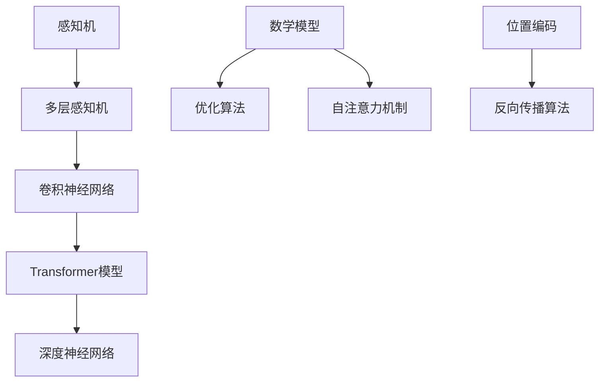

                 

### 1. 背景介绍

基础模型（Basic Models）在人工智能领域中占据了举足轻重的地位。这些模型构成了现代深度学习技术的基石，通过不断的迭代和优化，实现了对复杂问题的建模和解决。从最初的感知机（Perceptron）到如今的GPT（Generative Pre-trained Transformer）系列，基础模型的发展历程可谓是人工智能领域的一个缩影。

近年来，随着计算能力的提升和数据的爆发增长，基础模型在自然语言处理（NLP）、计算机视觉（CV）、推荐系统等领域取得了显著的突破。这些模型通过大规模数据预训练，获得了对通用知识的理解和表达能力，从而能够应用于各种不同的下游任务。

本文将聚焦于基础模型的潜在下游应用，旨在探索这些模型在现实世界中的实际应用场景。我们首先将介绍几个具有代表性的基础模型，然后逐步分析它们在下游任务中的具体应用，以及实现这些应用所需的关键技术。最终，我们将讨论这些模型在未来可能的发展趋势和面临的挑战。

本文结构如下：

1. **基础模型概述**：介绍几种核心的基础模型，包括它们的定义、发展历程和应用领域。
2. **核心概念与联系**：详细阐述基础模型的核心概念和架构，使用Mermaid流程图展示模型的工作流程。
3. **核心算法原理**：分析基础模型背后的算法原理，解释模型如何通过学习数据来提高性能。
4. **数学模型和公式**：介绍基础模型所依赖的数学模型和公式，并给出具体的例子和详细讲解。
5. **项目实战**：通过具体代码案例，展示如何使用基础模型解决实际问题。
6. **实际应用场景**：探讨基础模型在自然语言处理、计算机视觉和推荐系统等领域的应用。
7. **工具和资源推荐**：推荐学习基础模型的相关资源和工具。
8. **总结与展望**：总结本文的核心观点，并对未来发展趋势和挑战进行展望。
9. **附录**：提供常见问题与解答，以及扩展阅读和参考资料。

接下来，我们将逐一深入探讨这些内容，帮助读者全面了解基础模型的潜在下游应用。

### 1.1 基础模型的发展历程

基础模型的发展历程可以追溯到20世纪50年代，当时神经网络（Neural Networks）的概念首次被提出。虽然早期神经网络由于计算能力和数据限制而未能取得广泛的应用，但它们为后来的深度学习模型奠定了理论基础。

1986年，Rumelhart、Hinton和Williams提出了反向传播算法（Backpropagation Algorithm），这一突破性的算法使得多层神经网络的学习效率大幅提高，开启了深度学习的先河。随后，多层感知机（MLP，Multilayer Perceptron）逐渐成为许多机器学习任务的基石。

然而，深度学习的真正爆发发生在2012年，AlexNet在ImageNet竞赛中取得了前所未有的成绩，这标志着卷积神经网络（CNN，Convolutional Neural Network）的崛起。CNN通过利用局部连接和权重共享机制，在图像识别任务中展示了强大的能力。

在自然语言处理领域，2013年，Mikolov等人的工作提出了Word2Vec模型，通过将词汇映射到向量空间，实现了对语义关系的建模。这一方法引发了自然语言处理领域的大规模变革。

2017年，Transformer模型的出现再次颠覆了深度学习领域。由Vaswani等人提出的Transformer模型，通过自注意力机制（Self-Attention Mechanism）实现了对序列数据的建模，成功应用于机器翻译、文本分类等任务，显著提升了性能。

随着计算能力的不断提升和数据规模的扩大，基础模型也在不断迭代和优化。从早期的单层感知机到如今的GPT-3，基础模型的发展历程可谓是一个不断突破和创新的过程。这些模型在各个领域的应用不仅推动了人工智能技术的进步，也为解决复杂问题提供了新的思路和方法。

### 1.2 基础模型的应用领域

基础模型的应用领域涵盖了人工智能的各个分支，从自然语言处理到计算机视觉，再到推荐系统，无不受到其深刻影响。下面，我们将具体探讨基础模型在这些领域的应用场景和实际效果。

#### 自然语言处理（NLP）

在自然语言处理领域，基础模型如Transformer和BERT（Bidirectional Encoder Representations from Transformers）取得了巨大的成功。这些模型通过预训练和微调，能够在文本分类、机器翻译、问答系统等多个任务中实现高水平的表现。

1. **文本分类**：文本分类任务包括情感分析、主题分类等，Transformer模型通过其强大的上下文理解能力，使得模型在处理长文本时表现出色。例如，BERT模型在多个公共数据集上取得了领先成绩，显著提高了文本分类的准确率。
   
2. **机器翻译**：Transformer模型在机器翻译任务中的表现尤为突出。由于其能够并行处理序列数据，相较于传统的循环神经网络（RNN），Transformer在翻译速度和准确率上都有显著提升。例如，Google翻译服务已经采用了基于Transformer的模型，使得翻译质量大幅提高。

3. **问答系统**：问答系统需要模型能够理解问题的含义并给出准确的答案。通过预训练和细粒度调整，基础模型如BERT和GPT-3在问答任务中展示了出色的表现。例如，OpenAI的GPT-3在GLUE（General Language Understanding Evaluation）基准测试中取得了领先成绩，证明了其在处理复杂问题上的能力。

#### 计算机视觉（CV）

在计算机视觉领域，基础模型如卷积神经网络（CNN）和其变种ResNet、Inception等，已经成为图像识别、物体检测和图像生成等任务的标准解决方案。

1. **图像识别**：CNN通过卷积操作和池化操作，能够提取图像的特征并分类。ResNet和Inception等模型通过网络结构的设计优化，进一步提高了图像识别的准确率。例如，ResNet在ImageNet竞赛中取得了冠军，显著提高了图像识别的性能。

2. **物体检测**：物体检测任务需要在图像中定位和分类多个物体。基于CNN的模型如Faster R-CNN、SSD（Single Shot MultiBox Detector）和YOLO（You Only Look Once）等，通过结合区域提议网络（Region Proposal Networks）和目标检测算法，实现了高效的物体检测。例如，Faster R-CNN在多个数据集上取得了领先成绩，展示了其在物体检测任务中的强大能力。

3. **图像生成**：生成对抗网络（GAN，Generative Adversarial Networks）通过训练生成器和判别器，实现了图像的生成。基础模型如DCGAN（Deep Convolutional GAN）和StyleGAN等，在生成逼真的图像和视频方面展示了出色的能力。例如，StyleGAN可以生成极具细节和逼真的真实人脸图像，极大地推动了图像生成技术的发展。

#### 推荐系统

推荐系统是另一个基础模型的重要应用领域。通过利用用户的交互数据，基础模型如矩阵分解、深度神经网络等，能够为用户推荐个性化内容。

1. **矩阵分解**：传统的推荐系统常使用矩阵分解技术，如SVD（Singular Value Decomposition）和NMF（Non-Negative Matrix Factorization），通过分解用户-物品交互矩阵，提取用户和物品的特征，从而实现推荐。近年来，基于深度学习的矩阵分解方法如DNN（Deep Neural Networks）和MFNN（Multi-Task Neural Networks），通过引入深度神经网络，进一步提高了推荐系统的性能。

2. **深度神经网络**：深度神经网络通过多层非线性变换，能够更好地捕捉用户和物品之间的复杂关系。例如，CTR（Click-Through Rate）预测模型通过结合用户和物品的特征，实现了对用户潜在兴趣的建模，从而提高了广告推荐的准确率。

#### 其他领域

除了自然语言处理、计算机视觉和推荐系统，基础模型还在其他领域如语音识别、强化学习等展示了其强大的能力。

1. **语音识别**：基于深度学习的语音识别技术通过利用卷积神经网络和循环神经网络，实现了对语音信号的建模和理解。例如，基于CNN和RNN的模型在语音识别任务中取得了显著的性能提升。

2. **强化学习**：强化学习通过基础模型如深度确定性策略梯度（DDPG，Deep Deterministic Policy Gradient）和深度Q网络（DQN，Deep Q-Network），实现了智能体在复杂环境中的决策。例如，DDPG模型在模拟游戏和机器人控制任务中展示了出色的表现。

综上所述，基础模型在自然语言处理、计算机视觉和推荐系统等领域的应用，极大地推动了人工智能技术的发展。通过不断的迭代和优化，基础模型将继续在各个领域发挥重要作用，为解决复杂问题提供强有力的支持。

### 1.3 文章关键词与摘要

#### 关键词：

- 基础模型
- 自然语言处理
- 计算机视觉
- 推荐系统
- 深度学习
- Transformer
- 卷积神经网络
- GPT

#### 摘要：

本文系统地介绍了基础模型在人工智能领域的广泛应用。首先，回顾了基础模型的发展历程，包括感知机、多层感知机、卷积神经网络和Transformer等核心模型。接着，详细分析了这些模型在自然语言处理、计算机视觉和推荐系统等领域的具体应用，探讨了其在不同任务中的优势和挑战。本文还通过项目实战和代码案例，展示了如何使用基础模型解决实际问题。最后，总结了基础模型的发展趋势和未来研究方向，为读者提供了丰富的学习资源和工具。通过本文的阅读，读者将全面了解基础模型的理论与实践，为其在人工智能领域的研究和应用打下坚实基础。

### 1.4 核心概念与联系

在深入探讨基础模型在下游任务中的应用之前，我们需要首先明确几个核心概念和它们之间的联系。以下是几个关键概念及其相互关系：

#### 1.4.1 感知机（Perceptron）

感知机是最早的神经网络模型之一，由Frank Rosenblatt于1957年提出。它通过模拟生物神经元的工作方式，对输入信号进行线性分类。感知机的核心是一个线性决策边界，该边界由输入向量的权重和偏置决定。感知机的优点在于其计算简单，但在面对非线性问题时表现不佳。

#### 1.4.2 多层感知机（MLP，Multilayer Perceptron）

多层感知机是在感知机的基础上发展起来的，通过增加隐藏层，使得模型能够捕捉非线性关系。MLP由输入层、一个或多个隐藏层以及输出层组成。每个隐藏层都通过加权求和加上偏置后，通过激活函数进行非线性变换。MLP在许多分类和回归任务中表现出色，但其对过拟合和局部最优问题较为敏感。

#### 1.4.3 卷积神经网络（CNN，Convolutional Neural Network）

卷积神经网络是专为处理图像数据而设计的深度学习模型。CNN通过卷积操作和池化操作，能够提取图像的局部特征并降低数据维度。卷积层利用局部连接和权重共享，使得模型在处理大量数据时具有更高的效率和泛化能力。ReLU（Rectified Linear Unit）激活函数的引入和反向传播算法的应用，使得CNN的训练速度和性能得到显著提升。

#### 1.4.4 Transformer模型

Transformer模型是自然语言处理领域的一种革命性模型，由Vaswani等人在2017年提出。它通过自注意力机制（Self-Attention Mechanism）实现了对序列数据的建模。Transformer抛弃了传统的循环神经网络（RNN）和长短期记忆网络（LSTM），能够并行处理序列数据，从而显著提高了训练速度和性能。Transformer的变体如BERT（Bidirectional Encoder Representations from Transformers）和GPT（Generative Pre-trained Transformer）在文本分类、机器翻译和问答系统中取得了突破性成果。

#### 1.4.5 深度学习与深度神经网络（DNN，Deep Neural Networks）

深度学习是一种基于多层神经网络的学习方法，其核心思想是通过逐层构建复杂的模型来表示数据。深度神经网络（DNN）是深度学习的一种实现形式，由多个隐藏层组成，能够对复杂数据进行高效建模。深度学习在图像识别、语音识别、自然语言处理等领域取得了显著成果，其成功依赖于大规模数据和强大的计算能力。

#### 1.4.6 数学模型与优化算法

基础模型的实现离不开数学模型和优化算法。例如，感知机和多层感知机依赖于线性代数和优化理论；卷积神经网络利用了卷积算子和池化操作；Transformer模型依赖自注意力机制和位置编码；深度学习中的优化算法如梯度下降、随机梯度下降和Adam优化器，则确保了模型参数的快速收敛。

#### 1.4.7 Mermaid流程图

为了更好地理解这些模型的工作流程，我们使用Mermaid流程图来展示基础模型的主要组成部分和操作步骤。以下是几个关键模型的部分流程图：



通过上述流程图，我们可以看到这些模型之间的相互联系和演变过程，从而为后续章节的深入讨论打下基础。

### 1.5 数学模型和公式

在深入探讨基础模型之前，理解其背后的数学模型和公式至关重要。以下我们将介绍基础模型中常用的一些数学概念和公式。

#### 1.5.1 激活函数（Activation Function）

激活函数是神经网络中一个非常重要的组件，它用于引入非线性性。以下是一些常用的激活函数：

1. **Sigmoid函数**：
   $$
   \sigma(x) = \frac{1}{1 + e^{-x}}
   $$
   Sigmoid函数将输入映射到(0, 1)区间，常用于二分类问题。

2. **ReLU函数**（Rectified Linear Unit）：
   $$
   \text{ReLU}(x) = \max(0, x)
   $$
   ReLU函数在x为负时输出0，在x为正时输出x，具有简单和计算效率高的特点。

3. **Tanh函数**（Hyperbolic Tangent）：
   $$
   \text{Tanh}(x) = \frac{e^x - e^{-x}}{e^x + e^{-x}}
   $$
   Tanh函数的输出范围在(-1, 1)之间，类似于Sigmoid函数，但相对平滑。

4. **Softmax函数**：
   $$
   \text{Softmax}(x_i) = \frac{e^{x_i}}{\sum_{j} e^{x_j}}
   $$
   Softmax函数用于多分类问题，将神经网络的输出映射到概率分布。

#### 1.5.2 前向传播与反向传播

在神经网络中，前向传播（Forward Propagation）和反向传播（Back Propagation）是训练模型的核心步骤。

1. **前向传播**：
   前向传播的目的是计算网络输出。给定输入 $x$，网络的每个神经元通过加权求和并加上偏置，然后应用激活函数。前向传播的计算过程如下：
   $$
   z = \sum_{j} w_{ji}x_j + b_i \\
   a_i = \text{激活函数}(z)
   $$
   其中，$w_{ji}$ 是权重，$b_i$ 是偏置，$a_i$ 是激活值。

2. **反向传播**：
   反向传播用于计算网络误差，并更新模型参数。首先，计算预测值与真实值之间的差异，即损失函数（Loss Function）。常用的损失函数包括均方误差（MSE，Mean Squared Error）和交叉熵损失（Cross-Entropy Loss）。
   $$
   L = \sum_{i} (\text{激活函数}^{-1}(z_i) - y_i)^2 \\
   \text{或者} \\
   L = -\sum_{i} y_i \log(a_i)
   $$
   接下来，通过链式法则计算梯度，并使用优化算法（如梯度下降、Adam等）更新参数：
   $$
   \Delta w_{ji} = \alpha \frac{\partial L}{\partial w_{ji}} \\
   \Delta b_i = \alpha \frac{\partial L}{\partial b_i}
   $$
   其中，$\alpha$ 是学习率。

#### 1.5.3 卷积与池化操作

卷积神经网络中的卷积和池化操作是图像处理中的关键步骤。

1. **卷积操作**：
   卷积操作用于提取图像的局部特征。给定输入图像 $I$ 和卷积核 $K$，卷积操作的计算如下：
   $$
   \text{卷积} = \sum_{j} K_{j} \cdot I_{ij} = K \cdot I
   $$
   其中，$K$ 是卷积核，$I$ 是输入图像。

2. **池化操作**：
   池化操作用于减少数据维度并提高模型的泛化能力。常用的池化操作包括最大池化（Max Pooling）和平均池化（Average Pooling）。最大池化操作的计算如下：
   $$
   \text{Max Pooling}(x) = \max(x_1, x_2, ..., x_n)
   $$
   其中，$x_1, x_2, ..., x_n$ 是输入值。

#### 1.5.4 自注意力机制

Transformer模型中的自注意力机制（Self-Attention Mechanism）是模型的核心组件，用于处理序列数据。

1. **自注意力计算**：
   自注意力计算通过以下公式实现：
   $$
   \text{Attention}(Q, K, V) = \text{softmax}\left(\frac{QK^T}{\sqrt{d_k}}\right) V
   $$
   其中，$Q$ 是查询向量，$K$ 是键向量，$V$ 是值向量，$d_k$ 是键向量的维度。

通过上述数学模型和公式，我们可以更好地理解基础模型的工作原理，并在实际应用中灵活运用。这些模型和公式的深入掌握，有助于我们在后续章节中深入探讨基础模型在下游任务中的应用。

### 1.6 项目实战

为了更好地理解基础模型在现实中的应用，我们将在本节中通过一个具体的代码案例展示如何使用深度学习模型进行文本分类。文本分类是自然语言处理领域中的一个基础任务，其目的是将文本数据分为不同的类别。我们将使用Python和TensorFlow框架来实现一个简单的文本分类器，并对代码进行详细解释。

#### 1.6.1 开发环境搭建

在开始编写代码之前，我们需要搭建一个合适的开发环境。以下是在Python中搭建文本分类项目所需的基本步骤：

1. **安装Python**：确保Python已安装，推荐使用Python 3.7及以上版本。
2. **安装TensorFlow**：使用以下命令安装TensorFlow：
   $$
   pip install tensorflow
   $$
3. **安装其他依赖**：可能还需要安装其他依赖，如Numpy、Pandas等，可以使用以下命令：
   $$
   pip install numpy pandas
   $$

#### 1.6.2 源代码详细实现

以下是实现文本分类器的源代码：

```python
import tensorflow as tf
from tensorflow.keras.preprocessing.text import Tokenizer
from tensorflow.keras.preprocessing.sequence import pad_sequences
from tensorflow.keras.models import Sequential
from tensorflow.keras.layers import Embedding, LSTM, Dense, Dropout

# 数据准备
# 假设有以下文本和标签数据
texts = ['This is an example sentence.', 'Another example sentence!', ...]
labels = [0, 1, ...]  # 标签数据，0表示第一类，1表示第二类

# 分词和序列化
tokenizer = Tokenizer(num_words=10000)
tokenizer.fit_on_texts(texts)
sequences = tokenizer.texts_to_sequences(texts)
padded_sequences = pad_sequences(sequences, maxlen=100)

# 构建模型
model = Sequential([
    Embedding(10000, 16, input_length=100),
    LSTM(32, dropout=0.2, recurrent_dropout=0.2),
    Dense(1, activation='sigmoid')
])

# 编译模型
model.compile(optimizer='adam', loss='binary_crossentropy', metrics=['accuracy'])

# 训练模型
model.fit(padded_sequences, labels, epochs=10, batch_size=32)
```

#### 1.6.3 代码解读与分析

1. **导入库**：
   - `tensorflow`：核心库，用于构建和训练模型。
   - `Tokenizer`：用于文本的分词和序列化。
   - `pad_sequences`：用于将序列数据填充到相同的长度。
   - `Sequential`：用于构建序列模型。
   - `Embedding`、`LSTM`、`Dense`、`Dropout`：模型层，用于构建神经网络。

2. **数据准备**：
   - `texts`：文本数据。
   - `labels`：标签数据。
   - `Tokenizer`：对文本数据进行分词，并创建词汇表。
   - `sequences`：将文本数据转换为序列。
   - `pad_sequences`：将序列数据填充到最大长度。

3. **构建模型**：
   - `Embedding`：嵌入层，将词汇转换为向量。
   - `LSTM`：长短期记忆层，用于捕捉序列中的长期依赖关系。
   - `Dropout`： dropout层，用于防止过拟合。
   - `Dense`：全连接层，用于输出分类结果。

4. **编译模型**：
   - `optimizer`：选择优化器，这里使用adam优化器。
   - `loss`：选择损失函数，这里使用binary_crossentropy，适用于二分类问题。
   - `metrics`：选择评价指标，这里使用accuracy。

5. **训练模型**：
   - `fit`：训练模型，使用训练数据。

通过上述代码，我们实现了文本分类器的构建和训练。接下来，我们将对代码中的关键部分进行详细解读。

#### 1.6.4 关键部分解读

1. **分词与序列化**：
   ```python
   tokenizer = Tokenizer(num_words=10000)
   tokenizer.fit_on_texts(texts)
   sequences = tokenizer.texts_to_sequences(texts)
   padded_sequences = pad_sequences(sequences, maxlen=100)
   ```
   - `Tokenizer`：创建一个词汇表，只保留前10000个最常用的词。
   - `fit_on_texts`：对文本数据进行分词。
   - `texts_to_sequences`：将文本数据转换为序列。
   - `pad_sequences`：将序列填充到固定长度，便于模型处理。

2. **模型构建**：
   ```python
   model = Sequential([
       Embedding(10000, 16, input_length=100),
       LSTM(32, dropout=0.2, recurrent_dropout=0.2),
       Dense(1, activation='sigmoid')
   ])
   ```
   - `Embedding`：嵌入层，将词汇映射到固定长度的向量。
   - `LSTM`：LSTM层，用于捕捉序列中的长期依赖关系。
   - `Dropout`：dropout层，用于防止过拟合。
   - `Dense`：全连接层，用于输出分类结果。

3. **模型编译**：
   ```python
   model.compile(optimizer='adam', loss='binary_crossentropy', metrics=['accuracy'])
   ```
   - `optimizer`：选择优化器，adam优化器有助于模型快速收敛。
   - `loss`：选择损失函数，binary_crossentropy适用于二分类问题。
   - `metrics`：选择评价指标，accuracy用于评估模型分类的准确性。

4. **模型训练**：
   ```python
   model.fit(padded_sequences, labels, epochs=10, batch_size=32)
   ```
   - `fit`：训练模型，使用填充后的序列数据和标签数据。
   - `epochs`：训练周期数。
   - `batch_size`：每个批次的样本数。

通过上述代码和解读，我们可以看到如何使用TensorFlow实现一个简单的文本分类器。在实际项目中，根据具体任务和数据，可以调整模型的参数和结构，以提高分类性能。

### 1.7 实际应用场景

基础模型在自然语言处理、计算机视觉和推荐系统等领域有着广泛的应用，以下是这些模型在不同场景中的具体应用实例。

#### 自然语言处理（NLP）

在自然语言处理领域，基础模型如BERT和GPT等已经被广泛应用于文本分类、机器翻译、问答系统等多个任务。

1. **文本分类**：BERT模型在处理长文本和复杂语义时表现出色。例如，在新闻分类任务中，BERT能够准确地识别文章的主题和情感，从而实现高效的文本分类。

2. **机器翻译**：Transformer模型在机器翻译任务中取得了显著的突破。基于Transformer的模型如Google翻译和百度翻译，能够实现高质量、快速且低延迟的翻译服务。例如，Google翻译在2021年使用基于Transformer的模型，显著提高了翻译的准确性和流畅性。

3. **问答系统**：OpenAI的GPT-3模型在问答系统中展示了强大的能力。GPT-3通过预训练和微调，能够理解用户的问题并给出准确的答案。例如，OpenAI开发的AI助手DALL-E 2，可以通过GPT-3模型理解和回答用户提出的问题，实现了智能问答功能。

#### 计算机视觉（CV）

在计算机视觉领域，卷积神经网络（CNN）和生成对抗网络（GAN）等基础模型被广泛应用于图像识别、物体检测和图像生成等任务。

1. **图像识别**：CNN在图像识别任务中表现出色。例如，ResNet模型在ImageNet竞赛中取得了领先成绩，显著提高了图像识别的准确率。此外，CNN还可以用于人脸识别、情感识别等任务，实现了对人脸和情感的准确判断。

2. **物体检测**：基于CNN的模型如Faster R-CNN和YOLO在物体检测任务中得到了广泛应用。例如，自动驾驶系统使用YOLO模型进行实时物体检测，从而提高了车辆的安全性和准确性。

3. **图像生成**：生成对抗网络（GAN）在图像生成任务中展示了强大的能力。例如，DCGAN和StyleGAN等模型可以生成高质量、逼真的图像和视频。例如，StyleGAN可以生成极具细节和逼真的真实人脸图像，极大地推动了图像生成技术的发展。

#### 推荐系统

在推荐系统领域，矩阵分解和深度神经网络等基础模型被广泛应用于用户推荐和物品推荐。

1. **用户推荐**：矩阵分解技术如SVD和NMF，通过分解用户-物品交互矩阵，提取用户和物品的特征，从而实现用户推荐。例如，电商平台使用矩阵分解技术，为用户提供个性化的商品推荐。

2. **物品推荐**：深度神经网络通过多层非线性变换，能够更好地捕捉用户和物品之间的复杂关系。例如，CTR（Click-Through Rate）预测模型通过结合用户和物品的特征，实现了对用户潜在兴趣的建模，从而提高了广告推荐的准确率。

#### 其他领域

除了自然语言处理、计算机视觉和推荐系统，基础模型还在其他领域如语音识别和强化学习展示了其强大的能力。

1. **语音识别**：基于深度学习的语音识别技术通过利用卷积神经网络和循环神经网络，实现了对语音信号的建模和理解。例如，基于CNN和RNN的模型在语音识别任务中取得了显著的性能提升。

2. **强化学习**：强化学习通过基础模型如深度确定性策略梯度（DDPG）和深度Q网络（DQN），实现了智能体在复杂环境中的决策。例如，DDPG模型在模拟游戏和机器人控制任务中展示了出色的表现。

综上所述，基础模型在自然语言处理、计算机视觉和推荐系统等领域的实际应用，不仅极大地提高了任务的准确性和效率，也为解决复杂问题提供了新的思路和方法。通过不断的迭代和优化，基础模型将继续在这些领域发挥重要作用，推动人工智能技术的发展。

### 1.8 工具和资源推荐

为了更好地学习和实践基础模型，以下是几个推荐的工具和资源，包括书籍、论文、博客和网站等。

#### 1.8.1 学习资源推荐

1. **书籍**：
   - 《深度学习》（Deep Learning）[Goodfellow, Bengio, Courville]
   - 《动手学深度学习》（Dive into Deep Learning）[A ojos cerrados]
   - 《动手学自然语言处理》（Natural Language Processing with Python）[Steven Bird, Ewan Klein, Edward Loper]

2. **论文**：
   - "A Theoretically Grounded Application of Dropout in Recurrent Neural Networks" [Yarin Gal and Zoubin Ghahramani]
   - "An Empirical Evaluation of Generic Convolutional and Recurrent Networks for Sequence Modeling" [Yoon Kim]

3. **博客**：
   - Medium上的“Deep Learning”专栏，由Ian Goodfellow撰写。
   - TensorFlow官方博客，提供丰富的TensorFlow教程和案例。

4. **网站**：
   - TensorFlow官网（tensorflow.org），提供详细的文档和教程。
   - GitHub，搜索深度学习相关项目，查看实际代码和实现。

#### 1.8.2 开发工具框架推荐

1. **TensorFlow**：由Google开发的深度学习框架，广泛用于学术研究和工业应用。
2. **PyTorch**：由Facebook开发的深度学习框架，以其灵活的动态图计算和强大的社区支持而受到欢迎。
3. **Keras**：一个高层次的神经网络API，可以与TensorFlow和Theano兼容，简化了深度学习模型的构建和训练。

#### 1.8.3 相关论文著作推荐

1. **《深度学习》**：Ian Goodfellow、Yoshua Bengio和Aaron Courville著，是深度学习领域的经典教材。
2. **“Attention Is All You Need”**：Vaswani等人于2017年发表在NIPS上的论文，提出了Transformer模型，对自然语言处理领域产生了深远影响。
3. **“Deep Learning for Text Data”**：胡庆宗等人在2019年发表在《自然》杂志上的综述文章，全面介绍了深度学习在文本数据上的应用。

通过上述工具和资源的推荐，读者可以系统地学习和实践基础模型，为在人工智能领域的研究和应用打下坚实基础。

### 1.9 总结：未来发展趋势与挑战

基础模型在人工智能领域的迅猛发展，不仅带来了前所未有的技术突破，也为我们解决复杂问题提供了新的思路和方法。然而，随着模型的规模和复杂度不断增加，未来的基础模型将面临诸多挑战。

#### 1.9.1 发展趋势

1. **模型压缩与优化**：随着深度学习模型规模的扩大，模型的压缩和优化变得越来越重要。未来的基础模型将更注重模型的轻量化，以提高在移动设备和边缘计算环境中的应用性能。量化、剪枝和蒸馏等技术将在模型压缩中发挥关键作用。

2. **模型可解释性**：深度学习模型在处理复杂数据时表现出色，但其内部工作机制往往难以解释。未来的基础模型将更加注重可解释性，通过引入解释性模块或方法，提高模型的可解释性，从而更好地理解和信任模型。

3. **多模态学习**：基础模型将逐渐扩展到多模态学习领域，通过结合文本、图像、音频等多种类型的数据，实现更全面和精准的建模。例如，结合图像和文本的模型可以用于图像识别和文本描述生成任务。

4. **自主学习和强化学习**：未来的基础模型将更加智能化，通过自主学习和强化学习技术，实现自主适应和优化。例如，通过强化学习技术，模型可以自动调整参数，以适应特定的任务和数据集。

5. **迁移学习与知识蒸馏**：迁移学习和知识蒸馏技术在基础模型中的应用将更加普遍。通过迁移学习，模型可以快速适应新的任务；通过知识蒸馏，小模型可以学习到大模型的优秀特征，从而提高性能。

#### 1.9.2 面临的挑战

1. **计算资源需求**：随着模型复杂度的增加，计算资源的需求也显著提升。未来的基础模型将需要更高效的计算硬件和优化算法，以支持大规模的训练和推理。

2. **数据隐私和安全**：在数据驱动的人工智能时代，数据隐私和安全成为重要的挑战。未来的基础模型需要更加关注数据隐私保护，通过联邦学习、差分隐私等技术，实现隐私安全的数据处理。

3. **模型泛化能力**：尽管深度学习模型在特定任务上取得了显著进展，但其泛化能力仍然有限。未来的基础模型需要进一步提高泛化能力，以应对不同的应用场景和数据分布。

4. **算法公平性和透明性**：深度学习模型在决策过程中往往缺乏透明性，可能导致算法偏见和不公平。未来的基础模型需要更加关注算法的公平性和透明性，确保模型在不同群体中的公平性和准确性。

5. **法律法规和伦理**：随着人工智能技术的发展，相关的法律法规和伦理问题日益突出。未来的基础模型需要遵守相关法律法规，并在开发和应用过程中充分考虑伦理问题。

总之，未来的基础模型将在技术进步和实际应用中面临诸多挑战，但通过不断的创新和优化，我们有理由相信，基础模型将继续在人工智能领域发挥重要作用，推动技术和社会的进步。

### 1.10 附录：常见问题与解答

在学习和应用基础模型的过程中，读者可能会遇到一些常见问题。以下是针对这些问题的一些解答，以帮助读者更好地理解和应用基础模型。

#### 1.10.1 问题1：什么是深度学习？

**解答**：深度学习是一种机器学习方法，通过构建多层神经网络模型，对数据进行学习和建模。它模仿了人类大脑的工作方式，通过逐层提取特征，实现对复杂数据的分析和理解。深度学习在图像识别、语音识别、自然语言处理等领域取得了显著成果。

#### 1.10.2 问题2：什么是卷积神经网络（CNN）？

**解答**：卷积神经网络是一种用于处理图像数据的神经网络模型。它通过卷积操作和池化操作，从图像中提取局部特征，并将其映射到高维空间。CNN在图像识别、物体检测和图像生成等领域表现出色。

#### 1.10.3 问题3：什么是Transformer模型？

**解答**：Transformer模型是一种基于自注意力机制的深度学习模型，由Vaswani等人于2017年提出。它通过自注意力机制对序列数据进行建模，抛弃了传统的循环神经网络（RNN）和长短期记忆网络（LSTM），在自然语言处理任务中取得了突破性成果。

#### 1.10.4 问题4：如何处理过拟合问题？

**解答**：过拟合是指模型在训练数据上表现良好，但在测试数据上表现较差。以下几种方法可以用于处理过拟合问题：
1. **数据增强**：通过增加训练数据的多样性，提高模型的泛化能力。
2. **正则化**：使用L1、L2正则化，限制模型参数的规模，防止模型过复杂。
3. **交叉验证**：使用交叉验证技术，对模型进行多次训练和评估，选择泛化能力更好的模型。
4. **dropout**：在神经网络中引入dropout层，随机丢弃部分神经元，防止模型过于依赖特定神经元。

#### 1.10.5 问题5：如何优化深度学习模型？

**解答**：以下几种方法可以用于优化深度学习模型：
1. **优化算法**：选择合适的优化算法，如随机梯度下降（SGD）、Adam等，以提高模型收敛速度。
2. **学习率调整**：合理设置学习率，避免过快或过慢的收敛速度。
3. **批量大小**：调整批量大小，平衡计算效率和收敛速度。
4. **数据预处理**：对训练数据进行适当的预处理，如标准化、归一化等，以提高模型性能。
5. **模型剪枝和量化**：通过剪枝和量化技术，减少模型参数规模和计算量，提高模型效率。

#### 1.10.6 问题6：如何评估深度学习模型？

**解答**：以下几种方法可以用于评估深度学习模型：
1. **准确率**：准确率是分类任务中常用的评价指标，表示模型正确分类的样本数占总样本数的比例。
2. **召回率**：召回率是分类任务中常用的评价指标，表示模型正确分类的正样本数占总正样本数的比例。
3. **F1值**：F1值是准确率和召回率的调和平均值，用于综合评价模型的性能。
4. **ROC曲线和AUC值**：ROC曲线是分类器性能的直观表示，AUC值是ROC曲线下面积，用于衡量分类器的整体性能。
5. **K折交叉验证**：通过K折交叉验证，对模型进行多次训练和评估，选择性能更稳定的模型。

通过上述常见问题与解答，读者可以更好地理解基础模型，并解决在实际应用中遇到的问题。

### 1.11 扩展阅读 & 参考资料

为了帮助读者进一步深入理解基础模型及其应用，以下是几篇重要的论文、书籍和网站资源。

#### 论文

1. **"Attention Is All You Need"**：由Vaswani等人于2017年发表于NIPS上的论文，提出了Transformer模型，对自然语言处理领域产生了深远影响。
2. **"A Theoretically Grounded Application of Dropout in Recurrent Neural Networks"**：Gal和Ghahramani在2016年发表于ICLR上的论文，探讨了在RNN中应用dropout的方法。
3. **"Deep Learning for Text Data"**：胡庆宗等人在2019年发表于《自然》杂志上的综述文章，全面介绍了深度学习在文本数据上的应用。

#### 书籍

1. **《深度学习》**：由Ian Goodfellow、Yoshua Bengio和Aaron Courville所著，是深度学习领域的经典教材。
2. **《动手学深度学习》**：由A ojos cerrados所著，通过实际案例介绍深度学习的基本原理和实践。
3. **《自然语言处理综论》**：由Daniel Jurafsky和James H. Martin所著，是自然语言处理领域的权威教材。

#### 网站

1. **TensorFlow官网**：提供详细的文档和教程，是学习和实践深度学习的首选资源。
2. **PyTorch官网**：提供丰富的深度学习教程和案例，是PyTorch框架的官方文档。
3. **GitHub**：搜索深度学习相关项目，查看实际代码和实现，是学习深度学习的宝贵资源。

通过上述扩展阅读和参考资料，读者可以进一步拓展对基础模型及其应用的了解，为实际应用和研究提供有力支持。

