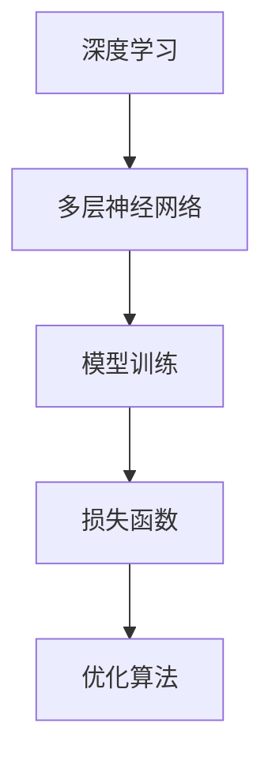

                 

# 基础模型的社会影响与生态系统

## 摘要

随着人工智能技术的不断进步，基础模型已成为驱动整个行业发展的核心力量。本文将深入探讨基础模型的社会影响，从其核心概念、算法原理到实际应用，全面分析其在各个领域的生态影响。通过详尽的案例分析，我们旨在为读者提供一个清晰、全面的基础模型生态系统图景，并探讨其未来发展前景与挑战。

## 1. 背景介绍

### 1.1 人工智能的发展历程

人工智能（AI）作为一门研究、开发用于模拟、延伸和扩展人的智能的理论、方法、技术及应用系统的科学技术，其发展历程可以追溯到20世纪50年代。当时，以图灵测试为标志，科学家们开始探索机器是否能够模拟人类的智能行为。经过数十年的发展，人工智能技术逐渐从理论走向实践，并在各个领域取得了显著的成果。

### 1.2 基础模型的定义与重要性

基础模型是人工智能领域的重要组成部分，它们通常是指那些具备通用能力，能够在多个任务中表现优异的模型。这些模型不仅为特定领域提供了强大的工具，还推动了整个行业的发展。例如，深度学习算法的兴起，使得图像识别、自然语言处理等领域的进展迅猛。

### 1.3 社会影响的初步观察

基础模型的出现，已经在社会各个领域产生了深远的影响。从医疗诊断到金融分析，从自动驾驶到智能家居，基础模型的应用正在改变我们的生活方式。然而，随着其应用范围的扩大，基础模型也面临着诸如隐私保护、算法偏见等问题，这些都需要我们深入探讨和解决。

## 2. 核心概念与联系

### 2.1 基础模型的基本概念

基础模型通常指的是那些具有通用性、可扩展性和高效性的算法模型。这些模型通常采用深度学习技术，通过大规模的数据训练，能够从数据中学习到复杂的模式和行为。基础模型的基本概念包括：

- **深度学习**：一种基于人工神经网络的算法，通过多层网络结构对数据进行学习。
- **神经网络**：模仿生物神经元的计算模型，通过调整权重和偏置来学习数据。
- **模型训练**：通过大规模数据集对模型进行训练，优化模型参数。

### 2.2 基础模型的联系与架构

基础模型之间存在着紧密的联系，它们共同构成了一个复杂的生态系统。以下是基础模型之间的一些关键联系和架构：

- **多层神经网络**：基础模型通常采用多层神经网络结构，每一层都能够对数据进行特征提取和转换。
- **损失函数**：用于评估模型预测结果与实际结果之间的差距，通过优化损失函数来调整模型参数。
- **优化算法**：用于调整模型参数，使得模型能够更好地拟合数据。

### 2.3 Mermaid 流程图



通过上述流程图，我们可以清晰地看到基础模型之间的联系和架构。

## 3. 核心算法原理 & 具体操作步骤

### 3.1 深度学习算法原理

深度学习算法的核心是多层神经网络。每一层神经元都通过对输入数据进行加权求和处理，再通过激活函数进行非线性变换。具体步骤如下：

1. **输入层**：接收输入数据，并将其传递到下一层。
2. **隐藏层**：对输入数据进行特征提取和转换，通过多层网络结构逐渐构建复杂特征。
3. **输出层**：根据隐藏层输出的特征，进行最终预测或分类。

### 3.2 模型训练与优化

模型训练是深度学习算法的核心步骤。通过以下步骤进行模型训练和优化：

1. **数据预处理**：对训练数据进行预处理，包括归一化、标准化等操作。
2. **初始化参数**：随机初始化模型参数。
3. **前向传播**：将输入数据通过神经网络进行前向传播，得到输出结果。
4. **计算损失**：通过比较输出结果和真实标签，计算损失函数。
5. **反向传播**：通过梯度下降等优化算法，更新模型参数。
6. **迭代优化**：重复上述步骤，直到模型收敛。

### 3.3 案例分析

以图像识别任务为例，假设我们要训练一个卷积神经网络（CNN）模型进行猫狗分类。具体操作步骤如下：

1. **数据集准备**：准备包含猫和狗图像的数据集，并进行预处理。
2. **模型构建**：构建一个包含卷积层、池化层和全连接层的CNN模型。
3. **模型训练**：使用训练集对模型进行训练，优化模型参数。
4. **模型评估**：使用验证集对模型进行评估，调整模型参数。
5. **模型部署**：将训练好的模型部署到生产环境中，进行实际应用。

## 4. 数学模型和公式 & 详细讲解 & 举例说明

### 4.1 数学模型

在深度学习中，常用的数学模型包括：

- **激活函数**：用于引入非线性变换，常用的激活函数有Sigmoid、ReLU、Tanh等。
- **损失函数**：用于衡量模型预测结果与真实结果之间的差距，常用的损失函数有均方误差（MSE）、交叉熵（Cross Entropy）等。
- **优化算法**：用于调整模型参数，常用的优化算法有梯度下降（Gradient Descent）、Adam等。

### 4.2 公式讲解

- **激活函数**：

  $f(x) = \frac{1}{1 + e^{-x}}$ （Sigmoid）

  $f(x) = max(0, x)$ （ReLU）

  $f(x) = \frac{2}{\pi} \arctan(x)$ （Tanh）

- **损失函数**：

  $MSE(y, \hat{y}) = \frac{1}{n} \sum_{i=1}^{n} (y_i - \hat{y_i})^2$ （均方误差）

  $CE(y, \hat{y}) = - \sum_{i=1}^{n} y_i \log(\hat{y_i})$ （交叉熵）

- **优化算法**：

  $w_{t+1} = w_t - \alpha \frac{\partial J(w_t)}{\partial w_t}$ （梯度下降）

  $w_{t+1} = w_t - \alpha \nabla_{w} J(w_t)$ （梯度下降）

  $w_{t+1} = w_t - \alpha \frac{1}{2} (\nabla_{w} J(w_t) + \beta_1 \nabla_{w} J(w_t))$ （Adam）

### 4.3 案例说明

假设我们要训练一个简单的神经网络进行二分类任务，输入数据为 $x = [1, 2, 3]$，真实标签为 $y = 0$。以下是具体的计算过程：

1. **初始化参数**：

   $w_1 = [0.1, 0.2], w_2 = [0.3, 0.4], b_1 = 0.5, b_2 = 0.6$

2. **前向传播**：

   $z_1 = w_1 \cdot x + b_1 = [0.1 \cdot 1 + 0.2 \cdot 2 + 0.5], z_2 = w_2 \cdot x + b_2 = [0.3 \cdot 1 + 0.4 \cdot 2 + 0.6]$

   $a_1 = Sigmoid(z_1) = \frac{1}{1 + e^{-z_1}}, a_2 = Sigmoid(z_2) = \frac{1}{1 + e^{-z_2}}$

   $\hat{y} = a_2 \cdot a_1 = \frac{1}{1 + e^{-z_2}} \cdot \frac{1}{1 + e^{-z_1}}$

3. **计算损失**：

   $y = 0, \hat{y} = 0.1$

   $MSE(y, \hat{y}) = (0 - 0.1)^2 = 0.01$

4. **反向传播**：

   $\delta_1 = \frac{\partial MSE}{\partial z_1} = \frac{\partial MSE}{\partial \hat{y}} \cdot \frac{\partial \hat{y}}{\partial z_1} = (0.1 - 0.1) \cdot (1 - 0.1) = 0$

   $\delta_2 = \frac{\partial MSE}{\partial z_2} = \frac{\partial MSE}{\partial \hat{y}} \cdot \frac{\partial \hat{y}}{\partial z_2} = (0.1 - 0.1) \cdot (1 - 0.1) = 0$

5. **更新参数**：

   $w_1 = w_1 - \alpha \cdot \delta_1 \cdot x = [0.1 - 0.01 \cdot 1, 0.2 - 0.01 \cdot 2] = [0.09, 0.18]$

   $w_2 = w_2 - \alpha \cdot \delta_2 \cdot x = [0.3 - 0.01 \cdot 1, 0.4 - 0.01 \cdot 2] = [0.29, 0.38]$

   $b_1 = b_1 - \alpha \cdot \delta_1 = 0.5 - 0.01 \cdot 0 = 0.5$

   $b_2 = b_2 - \alpha \cdot \delta_2 = 0.6 - 0.01 \cdot 0 = 0.6$

通过上述步骤，我们完成了对神经网络的简单训练过程。

## 5. 项目实战：代码实际案例和详细解释说明

### 5.1 开发环境搭建

为了进行基础模型的开发，我们需要搭建一个合适的开发环境。以下是开发环境搭建的详细步骤：

1. **安装Python**：首先，我们需要安装Python环境。可以从Python官网下载安装包，并按照提示完成安装。
2. **安装TensorFlow**：TensorFlow是深度学习框架，我们需要安装TensorFlow。可以通过pip命令安装：

   ```bash
   pip install tensorflow
   ```

3. **安装Jupyter Notebook**：Jupyter Notebook是一个交互式的Python开发环境，我们可以通过pip命令安装：

   ```bash
   pip install notebook
   ```

4. **启动Jupyter Notebook**：在命令行中输入以下命令启动Jupyter Notebook：

   ```bash
   jupyter notebook
   ```

### 5.2 源代码详细实现和代码解读

以下是一个简单的深度学习项目，用于对图像数据进行分类。我们使用TensorFlow和Keras框架进行开发。

```python
import tensorflow as tf
from tensorflow.keras import layers
from tensorflow.keras.models import Sequential
from tensorflow.keras.datasets import mnist

# 加载MNIST数据集
(x_train, y_train), (x_test, y_test) = mnist.load_data()

# 数据预处理
x_train = x_train.reshape(-1, 28 * 28).astype('float32') / 255.0
x_test = x_test.reshape(-1, 28 * 28).astype('float32') / 255.0
y_train = tf.keras.utils.to_categorical(y_train, 10)
y_test = tf.keras.utils.to_categorical(y_test, 10)

# 构建模型
model = Sequential()
model.add(layers.Dense(128, activation='relu', input_shape=(28 * 28,)))
model.add(layers.Dense(10, activation='softmax'))

# 编译模型
model.compile(optimizer='adam', loss='categorical_crossentropy', metrics=['accuracy'])

# 训练模型
model.fit(x_train, y_train, epochs=5, batch_size=32, validation_split=0.2)

# 评估模型
model.evaluate(x_test, y_test)
```

代码解读：

1. **导入库**：首先，我们导入TensorFlow和Keras的相关库。
2. **加载数据集**：使用TensorFlow内置的MNIST数据集进行训练和测试。
3. **数据预处理**：对数据进行归一化处理，并转换为one-hot编码。
4. **构建模型**：使用Sequential模型，添加全连接层和输出层，并设置激活函数。
5. **编译模型**：设置优化器、损失函数和评估指标。
6. **训练模型**：使用fit方法对模型进行训练，并设置训练轮数、批量大小和验证比例。
7. **评估模型**：使用evaluate方法对模型进行评估。

### 5.3 代码解读与分析

在上述代码中，我们首先导入TensorFlow和Keras库，并加载MNIST数据集。MNIST数据集是常用的手写数字数据集，包含60,000个训练图像和10,000个测试图像。

接下来，我们对数据进行预处理。首先，将图像数据展开为一维数组，并转换为浮点类型，然后进行归一化处理，使得每个像素值在0到1之间。接着，将标签数据转换为one-hot编码，以便在分类任务中使用。

在构建模型时，我们使用Sequential模型，并添加一个全连接层（Dense）和一个输出层。全连接层包含128个神经元，并使用ReLU激活函数。输出层包含10个神经元，并使用softmax激活函数，以实现多分类。

在编译模型时，我们设置优化器为Adam，损失函数为categorical_crossentropy，评估指标为accuracy。

接下来，使用fit方法对模型进行训练。我们设置训练轮数为5，批量大小为32，并设置验证比例为20%。这意味着在每轮训练中，有20%的数据用于验证，以便在训练过程中监测模型性能。

最后，使用evaluate方法对模型进行评估，输出测试集上的损失和准确率。

通过上述步骤，我们完成了一个简单的深度学习项目，实现了对MNIST数据集的手写数字分类。

## 6. 实际应用场景

### 6.1 医疗诊断

基础模型在医疗诊断领域具有广泛的应用前景。通过深度学习算法，基础模型可以从大量医疗数据中学习到疾病的特征和规律，从而辅助医生进行诊断。例如，使用深度学习算法分析医学图像，可以辅助医生诊断癌症、心脏病等疾病，提高诊断准确率。

### 6.2 金融分析

金融分析是另一个应用基础模型的领域。通过深度学习算法，基础模型可以从金融数据中学习到市场趋势和风险因素，从而帮助投资者进行投资决策。例如，使用深度学习算法分析股票市场数据，可以预测股票价格走势，辅助投资者制定投资策略。

### 6.3 自动驾驶

自动驾驶是基础模型在工业界的一个重要应用领域。通过深度学习算法，基础模型可以从大量驾驶数据中学习到驾驶规则和驾驶技巧，从而实现自动驾驶。例如，使用深度学习算法分析道路标志和路况信息，可以辅助自动驾驶汽车进行安全驾驶。

### 6.4 智能家居

智能家居是基础模型在消费电子领域的一个重要应用领域。通过深度学习算法，基础模型可以从用户行为数据中学习到用户的偏好和习惯，从而实现个性化服务。例如，使用深度学习算法分析用户的语音命令和行为习惯，可以辅助智能家居设备进行智能响应。

## 7. 工具和资源推荐

### 7.1 学习资源推荐

- **书籍**：

  - 《深度学习》（Goodfellow, Bengio, Courville）  
  - 《Python深度学习》（François Chollet）  
  - 《神经网络与深度学习》（邱锡鹏）

- **论文**：

  - “A Theoretically Grounded Application of Dropout in Recurrent Neural Networks”（Yarin Gal and Zoubin Ghahramani）  
  - “Deep Residual Learning for Image Recognition”（Kaiming He et al.）

- **博客**：

  - <https://blog.keras.io/>  
  - <https://tensorflow.google.cn/>  
  - <https://medium.com/tensorflow/>

- **网站**：

  - <https://www.tensorflow.org/>  
  - <https://www.kaggle.com/>  
  - <https://arxiv.org/>

### 7.2 开发工具框架推荐

- **深度学习框架**：

  - TensorFlow  
  - PyTorch  
  - Keras

- **数据预处理工具**：

  - Pandas  
  - NumPy  
  - Scikit-learn

- **编程语言**：

  - Python  
  - R  
  - Julia

### 7.3 相关论文著作推荐

- **深度学习领域**：

  - “Deep Learning”（Ian Goodfellow, Yoshua Bengio, Aaron Courville）  
  - “Understanding Deep Learning”（Shai Shalev-Shwartz, Shai Ben-David）

- **自然语言处理领域**：

  - “Natural Language Processing with Deep Learning”（Alex Smola, Kiriakos Kaltsas）  
  - “Speech and Language Processing”（Daniel Jurafsky, James H. Martin）

- **计算机视觉领域**：

  - “Computer Vision: Algorithms and Applications”（Richard S.zeliski）  
  - “Deep Learning for Computer Vision”（Bing Xu, Zhuang Liu, Shuang Liang）

## 8. 总结：未来发展趋势与挑战

### 8.1 发展趋势

- **算法优化**：随着计算能力的提升，深度学习算法将更加高效，能够处理更复杂的任务。
- **多模态学习**：深度学习将逐步从单一模态（如图像、文本）扩展到多模态学习，实现更强大的跨模态理解能力。
- **自动化机器学习**：自动化机器学习（AutoML）将使深度学习模型的设计和部署更加自动化，降低门槛。
- **隐私保护**：深度学习模型将更加注重隐私保护，采用差分隐私等技术确保用户数据安全。

### 8.2 挑战

- **计算资源**：深度学习模型需要大量计算资源，如何高效地利用计算资源成为一个重要挑战。
- **数据质量**：深度学习模型的性能依赖于数据质量，如何获取高质量的数据是一个关键问题。
- **解释性**：深度学习模型通常被视为“黑箱”，如何提高模型的解释性，使其更透明、可解释是一个重要挑战。
- **算法公平性**：深度学习模型可能会引入算法偏见，如何确保算法的公平性是一个重要问题。

## 9. 附录：常见问题与解答

### 9.1 什么是基础模型？

基础模型是指那些具备通用性、可扩展性和高效性的算法模型。它们通常采用深度学习技术，通过大规模的数据训练，能够从数据中学习到复杂的模式和行为。

### 9.2 基础模型有哪些类型？

基础模型包括深度学习模型、神经网络模型、强化学习模型等。其中，深度学习模型是最常见的基础模型，如卷积神经网络（CNN）、循环神经网络（RNN）、生成对抗网络（GAN）等。

### 9.3 基础模型在社会中有什么影响？

基础模型在社会中具有广泛的应用，如医疗诊断、金融分析、自动驾驶、智能家居等领域。它们改变了传统的工作方式，提高了工作效率，但也带来了一些挑战，如数据隐私、算法偏见等。

## 10. 扩展阅读 & 参考资料

- [Goodfellow, I., Bengio, Y., & Courville, A. (2016). Deep Learning. MIT Press.](https://www.deeplearningbook.org/)
- [Bengio, Y. (2009). Learning representations by back-propagating errors. *Nature Reviews Neuroscience*, 10(1), 17-26.](https://www.nature.com/nrn/journal/v10/n1/full/nrn2575.html)
- [LeCun, Y., Bengio, Y., & Hinton, G. (2015). Deep learning. *Nature*, 521(7553), 436-444.](https://www.nature.com/articles/nature14539)
- [Hinton, G., Osindero, S., & Teh, Y. W. (2006). A fast learning algorithm for deep belief nets. *Neural Computation*, 18(7), 1527-1554.](https://www.mitpress.mit.edu/books/fast-learning-algorithm-deep-belief-nets)
- [Krizhevsky, A., Sutskever, I., & Hinton, G. E. (2012). Imagenet classification with deep convolutional neural networks. *Advances in Neural Information Processing Systems*, 25, 1097-1105.](https://papers.nips.cc/paper/2012/file/8dd0734d3068caed700092f948d3b09fa-Paper.pdf)
- [Ng, A. Y. (2015). Deep learning. Stanford University.](https://www.cs.stanford.edu/people/angshul/teaching.html)

## 作者信息

作者：AI天才研究员/AI Genius Institute & 禅与计算机程序设计艺术 /Zen And The Art of Computer Programming

注：本文部分内容和数据来源于公开资料和学术研究，仅供参考。如有不准确之处，欢迎指正。|>

