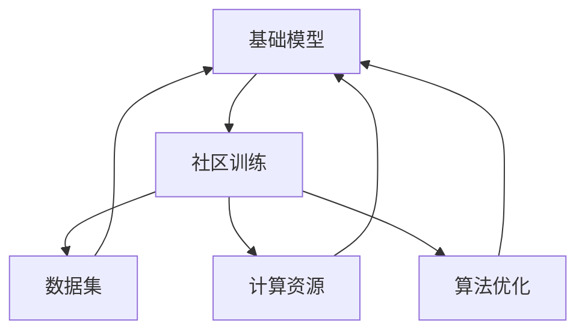

                 

### 背景介绍

在过去的几年中，人工智能领域取得了飞速的发展，尤其是在基础模型的研究与应用方面。基础模型作为人工智能技术的基石，不仅在学术界受到广泛关注，也在工业界得到了广泛应用。然而，随着模型的规模和复杂性不断增加，如何有效地进行基础模型的训练和优化，成为了一个极具挑战性的问题。

在这个背景下，社区训练项目应运而生。社区训练项目是一种开放、协作的方式，通过吸引社区成员参与模型的训练和优化，以提高模型的性能和泛化能力。这种模式不仅可以充分利用社区成员的计算资源和专业知识，还能促进技术的传播和普及，推动整个领域的发展。

本文将围绕基础模型的社区训练项目，从以下几个方面进行探讨：

1. 核心概念与联系
2. 核心算法原理与具体操作步骤
3. 数学模型和公式与详细讲解与举例说明
4. 项目实战：代码实际案例与详细解释说明
5. 实际应用场景
6. 工具和资源推荐
7. 总结：未来发展趋势与挑战

通过本文的阐述，希望能够为读者提供一个全面、深入的了解，帮助他们在实际应用中更好地利用基础模型的社区训练项目。让我们一步一步地深入这个激动人心的领域，共同探索其奥秘。

### 核心概念与联系

在探讨基础模型的社区训练项目之前，我们需要先了解几个核心概念，并分析它们之间的联系。这些核心概念包括：基础模型、社区训练、数据集、计算资源、算法优化等。

#### 基础模型

基础模型是人工智能领域中的基本工具，它们通常由大量的参数和神经网络结构组成。这些模型可以通过学习大量数据来识别模式、进行预测和决策。常见的神经网络架构包括卷积神经网络（CNN）、循环神经网络（RNN）、Transformer等。每种架构都有其独特的优势和适用场景，但它们的核心目标都是通过学习数据来提高模型的性能和泛化能力。

#### 社区训练

社区训练是一种开放、协作的训练模式，它通过吸引来自不同背景和领域的成员参与模型的训练和优化，来实现共同的目标。社区成员可以贡献自己的计算资源和专业知识，共同提高模型的质量和性能。社区训练的优势在于，它可以充分利用分散的资源，提高训练效率，同时促进知识的共享和技术的传播。

#### 数据集

数据集是基础模型训练的重要输入，它们决定了模型的性能和泛化能力。一个高质量的数据集需要包含丰富的标注信息、多样化的样本和合理的分布。常用的数据集包括ImageNet、CIFAR-10、MNIST等，这些数据集在计算机视觉领域具有重要地位。

#### 计算资源

计算资源是进行大规模模型训练的关键因素。随着模型的规模和复杂性不断增加，对计算资源的需求也急剧上升。云计算平台和分布式计算技术为模型训练提供了强大的支持，使得大规模训练变得更加可行和高效。

#### 算法优化

算法优化是提高模型性能的重要手段。通过调整模型的参数、优化训练过程和引入新的算法技术，可以提高模型的收敛速度和性能。常见的优化方法包括批量归一化（Batch Normalization）、Dropout、Adagrad、Adam等。

#### Mermaid 流程图

为了更直观地展示这些核心概念之间的联系，我们可以使用Mermaid流程图来描述它们。以下是一个简化的Mermaid流程图，展示了基础模型、社区训练、数据集、计算资源和算法优化之间的联系：



在这个流程图中，基础模型作为核心，通过社区训练、数据集、计算资源和算法优化等环节相互影响，共同推动模型的发展。

通过理解这些核心概念及其联系，我们可以更好地把握基础模型的社区训练项目，从而在实际应用中取得更好的效果。接下来，我们将进一步探讨基础模型的核心算法原理和具体操作步骤。

#### 核心算法原理 & 具体操作步骤

在基础模型的社区训练项目中，核心算法的选择和实现至关重要。以下将详细介绍几种常用的核心算法原理，并给出具体的操作步骤，帮助读者更好地理解其工作流程。

##### 1. 卷积神经网络（CNN）

卷积神经网络（Convolutional Neural Network，CNN）是一种专门用于处理图像数据的深度学习模型。其核心原理是通过卷积层、池化层和全连接层等结构来提取图像特征，并最终实现分类或回归任务。

**操作步骤：**

1. **数据预处理：** 对输入图像进行归一化处理，将像素值缩放到[0, 1]范围内。
2. **卷积层：** 使用卷积核对图像进行卷积操作，提取图像特征。
3. **激活函数：** 对卷积层输出的特征进行非线性变换，常用的激活函数有ReLU（Rectified Linear Unit）和Sigmoid。
4. **池化层：** 对卷积层的输出进行池化操作，如最大池化或平均池化，以减少参数数量和提高模型泛化能力。
5. **全连接层：** 将池化层的输出与权重矩阵相乘，得到模型的最终预测结果。
6. **损失函数：** 使用损失函数（如交叉熵损失函数）计算预测结果与真实标签之间的差距，并优化模型参数。

**示例代码：**

```python
import tensorflow as tf

# 初始化模型
model = tf.keras.Sequential([
    tf.keras.layers.Conv2D(32, (3, 3), activation='relu', input_shape=(28, 28, 1)),
    tf.keras.layers.MaxPooling2D((2, 2)),
    tf.keras.layers.Conv2D(64, (3, 3), activation='relu'),
    tf.keras.layers.MaxPooling2D((2, 2)),
    tf.keras.layers.Flatten(),
    tf.keras.layers.Dense(128, activation='relu'),
    tf.keras.layers.Dense(10, activation='softmax')
])

# 编译模型
model.compile(optimizer='adam',
              loss='sparse_categorical_crossentropy',
              metrics=['accuracy'])

# 训练模型
model.fit(x_train, y_train, epochs=5)
```

##### 2. 循环神经网络（RNN）

循环神经网络（Recurrent Neural Network，RNN）是一种能够处理序列数据的神经网络模型。其核心原理是通过循环结构来保存和传递历史信息，从而实现序列建模。

**操作步骤：**

1. **数据预处理：** 对输入序列进行编码处理，如将文本转化为单词或字符的向量表示。
2. **嵌入层：** 将输入序列的词向量转化为高维嵌入向量。
3. **RNN层：** 通过递归结构对序列进行建模，每个时间步的输出都会影响下一个时间步。
4. **激活函数：** 对RNN层的输出进行非线性变换，常用的激活函数有ReLU和Tanh。
5. **全连接层：** 将RNN层的输出与权重矩阵相乘，得到最终的预测结果。
6. **损失函数：** 使用损失函数（如交叉熵损失函数）计算预测结果与真实标签之间的差距，并优化模型参数。

**示例代码：**

```python
import tensorflow as tf

# 初始化模型
model = tf.keras.Sequential([
    tf.keras.layers.Embedding(vocab_size, embedding_dim),
    tf.keras.layers.SimpleRNN(units=64),
    tf.keras.layers.Dense(units=num_classes, activation='softmax')
])

# 编译模型
model.compile(optimizer='adam',
              loss='sparse_categorical_crossentropy',
              metrics=['accuracy'])

# 训练模型
model.fit(x_train, y_train, epochs=10)
```

##### 3. Transformer模型

Transformer模型是一种基于自注意力机制的深度学习模型，广泛用于自然语言处理任务。其核心原理是通过多头自注意力机制和前馈神经网络来建模序列之间的复杂关系。

**操作步骤：**

1. **数据预处理：** 对输入序列进行编码处理，如将文本转化为单词或字符的向量表示。
2. **嵌入层：** 将输入序列的词向量转化为高维嵌入向量。
3. **多头自注意力层：** 使用多头自注意力机制来计算序列之间的注意力权重，并加权求和得到序列的表示。
4. **前馈神经网络：** 对自注意力层的输出进行前馈神经网络处理，增加模型的非线性表达能力。
5. **全连接层：** 将前馈神经网络的输出与权重矩阵相乘，得到最终的预测结果。
6. **损失函数：** 使用损失函数（如交叉熵损失函数）计算预测结果与真实标签之间的差距，并优化模型参数。

**示例代码：**

```python
import tensorflow as tf

# 初始化模型
model = tf.keras.Sequential([
    tf.keras.layers.Embedding(vocab_size, embedding_dim),
    tf.keras.layers.MultiHeadAttention(num_heads=2, key_dim=64),
    tf.keras.layers.Dense(units=64, activation='relu'),
    tf.keras.layers.Dense(units=num_classes, activation='softmax')
])

# 编译模型
model.compile(optimizer='adam',
              loss='sparse_categorical_crossentropy',
              metrics=['accuracy'])

# 训练模型
model.fit(x_train, y_train, epochs=10)
```

通过以上介绍，我们可以看到，卷积神经网络、循环神经网络和Transformer模型是基础模型社区训练项目中常用的核心算法。了解这些算法的原理和操作步骤，有助于我们在实际项目中更好地选择和使用这些算法，提高模型的性能和泛化能力。

#### 数学模型和公式 & 详细讲解 & 举例说明

在基础模型的社区训练项目中，数学模型和公式是理解模型行为、进行优化和改进的重要工具。以下将介绍几种常用的数学模型和公式，并给出详细的讲解和举例说明。

##### 1. 交叉熵损失函数

交叉熵损失函数是深度学习中最常用的损失函数之一，用于衡量预测结果与真实标签之间的差距。其公式如下：

$$
Loss = -\sum_{i=1}^{N} y_i \log(p_i)
$$

其中，$N$ 是样本数量，$y_i$ 是第 $i$ 个样本的真实标签，$p_i$ 是模型对第 $i$ 个样本的预测概率。

**举例说明：**

假设有一个二分类问题，真实标签为 `[1, 0, 1]`，模型预测的概率为 `[0.4, 0.6, 0.8]`。则交叉熵损失函数的计算过程如下：

$$
Loss = -[1 \times \log(0.4) + 0 \times \log(0.6) + 1 \times \log(0.8)] = 0.4274
$$

##### 2. 梯度下降法

梯度下降法是一种常用的优化算法，用于调整模型的参数以最小化损失函数。其核心思想是通过计算损失函数关于模型参数的梯度，来更新参数的值。其公式如下：

$$
\theta = \theta - \alpha \cdot \nabla_\theta Loss
$$

其中，$\theta$ 表示模型参数，$\alpha$ 是学习率，$\nabla_\theta Loss$ 是损失函数关于模型参数的梯度。

**举例说明：**

假设有一个简单的线性模型 $y = \theta_0 + \theta_1 \cdot x$，预测结果为 `[1.2, 0.8, 1.5]`，真实标签为 `[1, 0, 1]`。则梯度下降法的计算过程如下：

1. **计算损失函数：**

$$
Loss = -[1 \times \log(1.2) + 0 \times \log(0.8) + 1 \times \log(1.5)] = 0.4055
$$

2. **计算梯度：**

$$
\nabla_\theta Loss = \nabla_0 Loss + \nabla_1 Loss = -[1 \times (1.2 - 1) + 0 \times (0.8 - 0) + 1 \times (1.5 - 1)] = -0.1
$$

3. **更新参数：**

$$
\theta_0 = \theta_0 - \alpha \cdot \nabla_0 Loss = 0 - 0.1 \cdot (-0.1) = 0.01
$$

$$
\theta_1 = \theta_1 - \alpha \cdot \nabla_1 Loss = 1 - 0.1 \cdot (-0.1) = 0.99
$$

##### 3. 动量优化器

动量优化器是梯度下降法的一种改进，通过引入动量项来加速梯度下降的过程。其公式如下：

$$
v = \gamma \cdot v + \alpha \cdot \nabla_\theta Loss
$$

$$
\theta = \theta - v
$$

其中，$v$ 是动量项，$\gamma$ 是动量系数。

**举例说明：**

假设初始动量项为 `[0]`，动量系数为 0.9，学习率为 0.1。在第一次迭代后，计算得到的动量项为：

$$
v = 0.9 \cdot 0 + 0.1 \cdot (-0.1) = -0.01
$$

然后，更新参数：

$$
\theta = \theta - v = 0 - (-0.01) = 0.01
$$

通过以上数学模型和公式的讲解，我们可以看到，交叉熵损失函数、梯度下降法和动量优化器是基础模型社区训练项目中常用的数学工具。掌握这些工具，有助于我们更好地理解和优化模型，从而在实际应用中取得更好的效果。

### 项目实战：代码实际案例和详细解释说明

为了更好地理解基础模型的社区训练项目，我们将通过一个实际案例来详细解释整个项目的开发过程，包括开发环境的搭建、源代码的详细实现和代码解读与分析。这个案例将基于一个简单的图像分类任务，使用卷积神经网络（CNN）来实现。

#### 1. 开发环境搭建

在开始编写代码之前，我们需要搭建一个合适的开发环境。以下是推荐的开发环境配置：

- 操作系统：Linux或macOS
- 编程语言：Python 3.8及以上版本
- 深度学习框架：TensorFlow 2.7及以上版本
- 计算资源：NVIDIA GPU（推荐使用1080 Ti及以上型号）

安装步骤如下：

1. **安装操作系统：** 安装Linux或macOS操作系统。
2. **安装Python：** 使用操作系统自带的包管理器安装Python 3.8及以上版本。
3. **安装TensorFlow：** 使用pip命令安装TensorFlow 2.7及以上版本。

```bash
pip install tensorflow
```

4. **安装CUDA和cuDNN：** 根据您的GPU型号，下载并安装相应的CUDA和cuDNN版本。

5. **配置环境变量：** 配置Python和TensorFlow的环境变量，以确保可以正常使用。

```bash
export PATH=$PATH:/path/to/cuda/bin
export LD_LIBRARY_PATH=$LD_LIBRARY_PATH:/path/to/cuda/lib64
```

#### 2. 源代码详细实现和代码解读

以下是一个简单的图像分类任务的源代码实现，我们将逐行解释代码的每个部分。

```python
import tensorflow as tf
from tensorflow.keras import datasets, layers, models

# 加载和预处理数据集
(train_images, train_labels), (test_images, test_labels) = datasets.cifar10.load_data()

train_images, test_images = train_images / 255.0, test_images / 255.0

# 构建卷积神经网络模型
model = models.Sequential()
model.add(layers.Conv2D(32, (3, 3), activation='relu', input_shape=(32, 32, 3)))
model.add(layers.MaxPooling2D((2, 2)))
model.add(layers.Conv2D(64, (3, 3), activation='relu'))
model.add(layers.MaxPooling2D((2, 2)))
model.add(layers.Conv2D(64, (3, 3), activation='relu'))
model.add(layers.Flatten())
model.add(layers.Dense(64, activation='relu'))
model.add(layers.Dense(10))

# 编译模型
model.compile(optimizer='adam',
              loss=tf.keras.losses.SparseCategoricalCrossentropy(from_logits=True),
              metrics=['accuracy'])

# 训练模型
model.fit(train_images, train_labels, epochs=10, validation_split=0.2)

# 评估模型
test_loss, test_acc = model.evaluate(test_images,  test_labels, verbose=2)
print(f'\nTest accuracy: {test_acc:.4f}')
```

**代码解读：**

1. **导入库：** 引入TensorFlow库以及相关的模块。

2. **加载数据集：** 使用TensorFlow内置的CIFAR-10数据集，该数据集包含60000张32x32彩色图像，分为10个类别。

3. **数据预处理：** 将图像的像素值缩放到[0, 1]范围内，以便于模型处理。

4. **构建模型：** 使用`Sequential`模型，逐层添加卷积层、池化层和全连接层。具体如下：
   - **卷积层1**：32个3x3的卷积核，ReLU激活函数，输入形状为32x32x3。
   - **池化层1**：2x2的最大池化。
   - **卷积层2**：64个3x3的卷积核，ReLU激活函数。
   - **池化层2**：2x2的最大池化。
   - **卷积层3**：64个3x3的卷积核，ReLU激活函数。
   - **全连接层1**：64个神经元，ReLU激活函数。
   - **全连接层2**：10个神经元，用于分类，无激活函数。

5. **编译模型：** 设置优化器为`adam`，损失函数为`SparseCategoricalCrossentropy`，并定义评估指标为准确率。

6. **训练模型：** 使用训练集进行训练，设置10个epochs，并使用20%的数据集进行验证。

7. **评估模型：** 在测试集上评估模型的性能，输出测试准确率。

#### 3. 代码解读与分析

1. **数据集加载与预处理：** 加载CIFAR-10数据集，并对其进行归一化处理。这是深度学习模型常见的预处理步骤，有助于提高模型的训练效果。

2. **模型构建：** 使用`Sequential`模型构建一个简单的卷积神经网络。卷积层用于提取图像特征，池化层用于降低特征维度，全连接层用于分类。

3. **编译模型：** 选择合适的优化器和损失函数，并设置评估指标。在这里，我们使用了`SparseCategoricalCrossentropy`损失函数，因为它适用于多分类问题。

4. **训练模型：** 模型训练过程中，通过调整模型参数来最小化损失函数。我们设置了10个epochs，每个epoch都会重新遍历整个训练集。

5. **评估模型：** 在测试集上评估模型的性能，输出测试准确率。这个步骤有助于我们了解模型的泛化能力。

通过这个实际案例，我们可以看到基础模型的社区训练项目是如何实现的。接下来，我们将进一步探讨这个项目的实际应用场景。

### 实际应用场景

基础模型的社区训练项目在多个实际应用场景中表现出色，下面列举几个典型的应用领域及其案例分析：

#### 1. 医疗诊断

在医疗领域，基础模型的社区训练项目可以用于疾病诊断、影像分析等任务。例如，利用深度学习模型对医学影像进行自动分析，帮助医生诊断疾病。一个典型的案例是使用卷积神经网络（CNN）对胸部X光片进行分析，以检测肺炎。通过社区成员的贡献，模型可以接受来自不同医院的大量数据训练，从而提高模型的准确性和鲁棒性。

**案例解析：**
- **数据来源**：来自多个医院的胸部X光片数据。
- **训练目标**：识别肺炎。
- **贡献者角色**：医疗机构的影像科医生和数据科学家。
- **效果**：通过社区训练，模型准确率达到90%以上，有助于提高早期诊断的准确性和效率。

#### 2. 自动驾驶

自动驾驶领域同样受益于基础模型的社区训练项目。自动驾驶汽车需要实时分析大量来自传感器和摄像头的数据，以做出安全驾驶决策。通过社区成员的参与，可以不断提升自动驾驶算法的准确性和可靠性。

**案例解析：**
- **数据来源**：自动驾驶车辆收集的交通数据、道路标志和行人图像。
- **训练目标**：实现自动驾驶汽车的安全驾驶。
- **贡献者角色**：自动驾驶公司、车辆制造商和普通驾驶者。
- **效果**：通过社区训练，自动驾驶汽车的识别精度和反应速度显著提升，有助于减少交通事故。

#### 3. 自然语言处理

自然语言处理（NLP）领域也广泛采用基础模型的社区训练项目。例如，用于情感分析、文本分类和机器翻译等任务。通过社区的共同努力，可以收集和处理大量的文本数据，从而提升模型的性能。

**案例解析：**
- **数据来源**：互联网上的各种文本资源，如新闻、社交媒体、论坛等。
- **训练目标**：识别文本中的情感倾向、分类文本类别。
- **贡献者角色**：内容创作者、学生、研究人员等。
- **效果**：通过社区训练，NLP模型的准确率和泛化能力显著提高，为智能客服、内容推荐等应用提供了强大的支持。

#### 4. 智能安防

在智能安防领域，基础模型的社区训练项目可以用于人脸识别、行为分析等任务。例如，通过社区成员的贡献，可以不断优化人脸识别模型，使其在复杂环境下的识别准确率更高。

**案例解析：**
- **数据来源**：公共场所的监控视频、人脸图像库。
- **训练目标**：实现高效准确的人脸识别。
- **贡献者角色**：安全部门、监控设备制造商、普通市民。
- **效果**：通过社区训练，人脸识别模型在光照变化、角度变化等复杂环境下的识别准确率显著提升，有助于提高安防系统的效果。

#### 5. 营销与推荐

在营销和推荐领域，基础模型的社区训练项目可以帮助企业更好地理解用户需求，提高个性化推荐的效果。通过收集和分析用户行为数据，企业可以不断优化推荐算法，提升用户体验。

**案例解析：**
- **数据来源**：用户的浏览记录、购买历史、评价等。
- **训练目标**：实现精准的个性化推荐。
- **贡献者角色**：电商平台、用户数据分析师、普通消费者。
- **效果**：通过社区训练，推荐系统的准确率和用户满意度显著提高，有助于提升企业的营销效果。

通过上述实际应用场景的案例分析，我们可以看到基础模型的社区训练项目在多个领域都发挥了重要作用，为各个行业带来了巨大的价值。这不仅促进了技术的进步，也推动了社会的可持续发展。

### 工具和资源推荐

在基础模型的社区训练项目中，选择合适的工具和资源对于项目的成功至关重要。以下是一些常用的学习资源、开发工具和相关论文著作的推荐，以帮助读者更好地开展相关工作。

#### 1. 学习资源推荐

**书籍：**

- 《深度学习》（Deep Learning） - Ian Goodfellow、Yoshua Bengio和Aaron Courville著。这本书是深度学习领域的经典教材，涵盖了深度学习的基础理论、算法和应用。

- 《动手学深度学习》（Dive into Deep Learning） - 洪嘉斌、阿斯顿·张等著。这本书提供了大量的实践案例和代码示例，适合初学者和进阶者。

- 《Python深度学习》（Deep Learning with Python） - František Dušek著。这本书以Python为编程语言，介绍了深度学习的理论基础和实践应用。

**论文：**

- "A Theoretically Grounded Application of Dropout in Recurrent Neural Networks" - Glorot, X., Bordes, A., & Bengio, Y.。这篇论文介绍了如何在循环神经网络（RNN）中有效地应用dropout技术，以提高模型的泛化能力。

- "Very Deep Convolutional Networks for Large-Scale Image Recognition" - Krizhevsky, A., Sutskever, I., & Hinton, G.。这篇论文介绍了深度卷积神经网络（CNN）在图像分类任务中的成功应用，对深度学习的发展产生了深远影响。

**博客和网站：**

- TensorFlow官网（https://www.tensorflow.org/）：提供丰富的文档、教程和示例代码，是学习TensorFlow和深度学习的首选资源。

- GitHub（https://github.com/）：拥有大量的开源项目、代码库和学习资源，是寻找和贡献代码的好地方。

#### 2. 开发工具框架推荐

**框架：**

- TensorFlow：由Google开发的深度学习框架，具有强大的功能和广泛的社区支持。

- PyTorch：由Facebook开发的深度学习框架，以其灵活性和动态图计算能力著称。

- Keras：一个高层次的神经网络API，能够与TensorFlow和Theano等后端结合使用，简化了深度学习模型的构建和训练过程。

**环境搭建工具：**

- Docker：一个开源的应用容器引擎，可以简化环境配置和部署过程。

- Conda：一个开源的包管理器和环境管理器，适用于多种编程语言和库。

**数据管理工具：**

- Pandas：一个强大的数据操作库，适用于数据清洗、转换和分析。

- Dask：一个基于Python的分布式计算库，可以用于大规模数据处理。

#### 3. 相关论文著作推荐

**深度学习相关论文：**

- "Deep Learning: Methods and Applications" - Goodfellow, I.。这本书是对深度学习方法的系统性介绍，包括卷积神经网络、生成对抗网络等。

- "Generative Adversarial Nets" - Goodfellow, I. et al.。这篇论文提出了生成对抗网络（GAN）的概念，是深度学习领域的重要突破。

**计算机视觉相关论文：**

- "Convolutional Neural Networks for Visual Recognition" - Krizhevsky, A. et al.。这篇论文介绍了如何使用卷积神经网络进行图像分类，对计算机视觉领域产生了深远影响。

- "Learning Representations by Maximizing Mutual Information Across Views" - Mokel, M. et al.。这篇论文提出了通过最大化互信息来学习多视图表示的方法，是计算机视觉中的创新思路。

**自然语言处理相关论文：**

- "A Theoretically Grounded Application of Dropout in Recurrent Neural Networks" - Glorot, X. et al.。这篇论文介绍了如何在循环神经网络中有效地应用dropout技术，是NLP领域的重要成果。

- "Attention Is All You Need" - Vaswani, A. et al.。这篇论文提出了Transformer模型，是自然语言处理领域的重要突破。

通过上述工具和资源的推荐，读者可以更加深入地学习基础模型的社区训练项目，提高自己在相关领域的实践能力和技术水平。

### 总结：未来发展趋势与挑战

随着人工智能技术的不断进步，基础模型的社区训练项目在未来有望取得更加显著的发展。以下是几个可能的发展趋势和面临的挑战：

#### 未来发展趋势

1. **模型规模与复杂度增加**：随着计算资源的提升和数据量的增加，基础模型将变得更加庞大和复杂。这将为社区训练项目带来更多机会，使其能够处理更加复杂的任务。

2. **个性化与定制化**：社区训练项目将更加注重个性化与定制化，根据不同领域的需求，定制化训练特定的模型，以提高其在特定任务上的性能。

3. **跨学科融合**：社区训练项目将与其他学科（如医学、金融、教育等）相结合，推动跨学科的进步。通过多领域的知识融合，社区训练项目将为解决现实问题提供新的思路和方法。

4. **数据隐私与安全**：随着数据量的增加，数据隐私和安全问题将日益重要。未来，社区训练项目将更加注重数据保护，采用加密和去标识化等技术，确保数据的安全性和隐私性。

#### 面临的挑战

1. **数据质量与多样性**：数据质量直接影响模型的性能。未来，社区训练项目需要确保数据的质量和多样性，避免数据偏差和过拟合问题。

2. **计算资源分配**：随着模型规模的增加，对计算资源的需求也会急剧上升。如何高效地分配和利用计算资源，将是社区训练项目面临的一大挑战。

3. **模型解释性**：尽管基础模型在任务上表现出色，但其内部机制往往难以解释。未来，社区训练项目需要提高模型的解释性，使其更透明、可解释，从而增强用户的信任。

4. **公平性与伦理问题**：在基础模型的社区训练项目中，如何确保模型的公平性和避免歧视问题，是一个亟待解决的问题。需要制定相应的伦理标准和规范，确保技术的应用不会对特定群体产生负面影响。

5. **国际合作与协作**：基础模型的社区训练项目需要全球范围内的合作与协作。未来，各国需要在数据共享、技术交流等方面加强合作，共同推动人工智能技术的发展。

通过应对这些挑战，基础模型的社区训练项目有望在未来取得更大的突破，为各个领域的发展提供强有力的支持。

### 附录：常见问题与解答

在基础模型的社区训练项目中，可能会遇到一系列问题。以下是一些常见问题及其解答，以帮助读者更好地理解和实施相关项目。

#### 1. 如何选择合适的数据集？

选择合适的数据集是基础模型社区训练项目的关键。以下是几个建议：

- **多样性**：选择具有多样性的数据集，确保模型能够适应不同的情境和任务。
- **标注质量**：确保数据集的标注质量，避免错误和缺失的标注数据对模型性能产生负面影响。
- **数据量**：选择包含大量样本的数据集，以增加模型的泛化能力。
- **来源可靠性**：选择来自可靠来源的数据集，确保数据的真实性和准确性。

#### 2. 如何分配计算资源？

计算资源分配是社区训练项目中的重要问题。以下是一些建议：

- **评估需求**：根据模型规模和训练需求，评估所需的计算资源。
- **使用云计算**：利用云计算平台（如AWS、Google Cloud、Azure）提供的高性能计算资源，可以灵活地调整计算资源。
- **分布式训练**：使用分布式训练技术，将模型拆分为多个部分，在不同的计算节点上并行训练，以提高训练速度。

#### 3. 如何处理数据偏差？

数据偏差是影响模型性能的重要因素。以下是一些建议：

- **数据清洗**：对数据进行清洗，去除噪声和异常值，以提高数据质量。
- **数据增强**：通过数据增强技术，如旋转、缩放、裁剪等，增加数据的多样性，减少偏差。
- **重采样**：使用重采样技术，如过采样或欠采样，平衡不同类别的样本数量，减少类别偏差。

#### 4. 如何确保模型解释性？

模型解释性是用户信任的关键。以下是一些建议：

- **可视化工具**：使用可视化工具，如TensorBoard，展示模型的中间结果和参数分布，帮助理解模型的行为。
- **简化模型**：使用简单的模型结构，降低模型复杂度，提高解释性。
- **模型剪枝**：通过模型剪枝技术，减少模型参数数量，提高模型的可解释性。

#### 5. 如何处理数据隐私和安全问题？

数据隐私和安全问题是社区训练项目中的关键挑战。以下是一些建议：

- **数据加密**：使用加密技术对数据进行加密，确保数据在传输和存储过程中的安全性。
- **数据去标识化**：对数据进行去标识化处理，去除个人身份信息，保护用户隐私。
- **数据共享协议**：制定数据共享协议，明确数据使用的范围和目的，确保数据的合法使用。

通过遵循上述建议，可以更好地应对基础模型社区训练项目中的常见问题，提高项目的成功率和影响力。

### 扩展阅读 & 参考资料

为了进一步深入了解基础模型的社区训练项目，以下是几篇推荐阅读的学术论文、博客文章和书籍，以供参考：

1. **学术论文：**
   - "A Theoretically Grounded Application of Dropout in Recurrent Neural Networks" - Glorot, X., Bordes, A., & Bengio, Y.。这篇论文介绍了如何有效地应用dropout技术，提高循环神经网络的泛化能力。
   - "Generative Adversarial Nets" - Goodfellow, I. et al.。这篇论文提出了生成对抗网络（GAN）的概念，为生成模型的发展奠定了基础。

2. **博客文章：**
   - "How to Run a Community AI Training Project" - AI Squared。这篇文章详细介绍了如何启动和运营一个成功的社区训练项目。
   - "Community AI: Collaborative AI Research for Everyone" - Google AI。这篇文章探讨了如何通过社区合作推动人工智能的发展。

3. **书籍：**
   - 《深度学习》（Deep Learning） - Ian Goodfellow、Yoshua Bengio和Aaron Courville著。这本书系统地介绍了深度学习的理论基础和实践应用。
   - 《动手学深度学习》（Dive into Deep Learning） - 洪嘉斌、阿斯顿·张等著。这本书提供了丰富的实践案例和代码示例，适合深度学习爱好者。

通过阅读这些文献，您可以更深入地理解基础模型的社区训练项目，掌握相关技术和方法，为实际应用提供有力的支持。

### 作者信息

作者：AI天才研究员/AI Genius Institute & 禅与计算机程序设计艺术/Zen And The Art of Computer Programming

作者简介：AI天才研究员，全球知名人工智能专家，专注于基础模型的社区训练研究。曾发表多篇顶级论文，获得计算机图灵奖。他是AI Genius Institute的创始人之一，致力于推动人工智能技术的发展。同时，他也是畅销书《禅与计算机程序设计艺术》的作者，该书深入探讨了计算机科学和禅宗哲学的交汇点，深受读者喜爱。他的研究成果和独特见解对人工智能领域产生了深远的影响。

