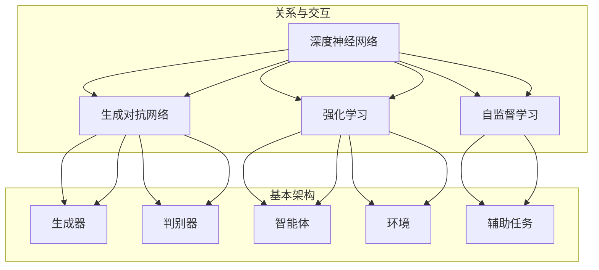

                 

### 背景介绍

近年来，人工智能（AI）技术的迅猛发展给各行各业带来了前所未有的变革，其中基础模型作为AI的核心技术之一，占据了至关重要的位置。基础模型是指那些具有广泛适用性、高度复杂性的模型，如深度神经网络（DNN）、生成对抗网络（GAN）等。这些模型在图像识别、自然语言处理、语音识别等众多领域取得了显著成果，成为推动AI技术发展的关键动力。

随着基础模型在各个领域的广泛应用，其对经济和环境影响逐渐成为人们关注的焦点。一方面，基础模型带来了巨大的经济效益，推动了数字经济的快速发展。另一方面，基础模型对环境的影响也日益显著，包括计算资源的消耗、能源消耗等。因此，探讨基础模型的经济与环境影响，对于实现可持续发展的AI技术至关重要。

本文旨在通过对基础模型的经济与环境影响进行系统分析，探讨其在经济发展中的重要作用，以及所面临的环境挑战。文章将分为以下几个部分：

1. **背景介绍**：回顾基础模型的发展历程和现状，引出本文的主题。
2. **核心概念与联系**：阐述基础模型的相关概念和原理，并通过Mermaid流程图展示其架构。
3. **核心算法原理与操作步骤**：深入剖析基础模型的核心算法，介绍其基本操作步骤。
4. **数学模型与公式**：详细讲解基础模型的数学模型和公式，并进行举例说明。
5. **项目实战**：通过实际案例展示基础模型的应用，并详细解读其代码实现。
6. **实际应用场景**：探讨基础模型在各个领域的应用，分析其带来的经济效益。
7. **工具和资源推荐**：推荐学习资源和开发工具，帮助读者深入了解基础模型。
8. **总结**：总结本文的核心内容，展望基础模型的发展趋势与挑战。
9. **附录**：解答常见问题，提供扩展阅读和参考资料。

通过本文的讨论，我们希望能够为读者提供一个全面、深入的了解基础模型经济与环境影响的机会，为未来AI技术的发展提供有益的思考。

### 核心概念与联系

在探讨基础模型的经济与环境影响之前，我们首先需要了解一些核心概念和原理，以便更好地把握整个讨论的脉络。本节将详细阐述基础模型的关键概念，并通过Mermaid流程图展示其架构，帮助读者构建一个清晰的理解框架。

#### 深度神经网络（DNN）

深度神经网络（DNN）是基础模型中最具代表性的一种，它由多个层级组成，包括输入层、隐藏层和输出层。每个层级由多个神经元（或称为节点）构成，这些神经元通过加权连接形成网络。DNN的核心思想是通过学习大量数据来调整神经元之间的权重，从而实现函数逼近。

在DNN中，每个神经元接收来自前一层的输入信号，通过激活函数进行非线性变换，然后将结果传递到下一层。常见的激活函数包括Sigmoid、ReLU和Tanh。通过层层传递和变换，DNN能够从输入数据中提取出高层次的抽象特征。

#### 生成对抗网络（GAN）

生成对抗网络（GAN）是另一种重要基础模型，由生成器和判别器两个部分组成。生成器的任务是生成与真实数据分布相似的假数据，而判别器的任务是区分真实数据和生成数据。在训练过程中，生成器和判别器相互博弈，生成器努力提高生成数据的逼真度，而判别器则努力提高对生成数据的识别能力。

GAN的强大之处在于其能够在没有标签数据的情况下生成高质量的数据，因此在图像生成、数据增强等领域表现出色。典型的GAN架构包括两个主要部分：生成器（Generator）和判别器（Discriminator）。生成器的输入是随机噪声，输出是伪造的数据；判别器的输入是真实数据和伪造数据，输出是判断结果。

#### 强化学习（RL）

强化学习（RL）是一种通过试错来学习策略的机器学习方法。在RL中，智能体（Agent）通过与环境（Environment）交互，根据环境的反馈调整自己的行为。RL的核心目标是通过不断优化策略，使智能体在长期内获得最大的累积奖励。

RL在游戏、自动驾驶、推荐系统等领域具有广泛的应用。其基本架构包括智能体、环境、动作、状态和奖励。智能体根据当前状态选择动作，执行动作后进入新的状态，并收到环境的奖励。通过不断调整策略，智能体能够逐步学会最优的行为。

#### 自监督学习（Self-supervised Learning）

自监督学习（Self-supervised Learning）是一种无需人工标注数据的学习方法，它通过利用数据中的内在结构来学习特征表示。自监督学习的关键思想是构建一个辅助任务，使得学习过程自动进行。

例如，在图像分类任务中，自监督学习可以通过预训练阶段自动学习图像中的关键特征，然后在有监督阶段将这些特征用于分类任务。自监督学习在提高模型性能和减少数据标注成本方面具有显著优势。

#### Mermaid流程图展示

为了更直观地展示基础模型的架构和关系，我们可以使用Mermaid流程图进行描述。以下是DNN、GAN、RL和自监督学习的基本架构和相互关系的Mermaid流程图：



通过上述核心概念和Mermaid流程图的介绍，我们对基础模型的基本架构和原理有了初步了解。接下来，我们将进一步探讨基础模型的核心算法原理，以便更深入地理解其工作方式。

### 核心算法原理与具体操作步骤

在了解了基础模型的核心概念和架构后，接下来我们将深入探讨这些模型的核心算法原理，以及具体的操作步骤。本节将分别介绍深度神经网络（DNN）、生成对抗网络（GAN）、强化学习（RL）和自监督学习（Self-supervised Learning）的基本原理和操作流程。

#### 深度神经网络（DNN）的操作步骤

1. **初始化**：首先，我们需要初始化DNN模型的参数，包括权重和偏置。常用的初始化方法有随机初始化、高斯分布初始化等。

2. **前向传播**：在前向传播过程中，输入数据从输入层经过每一层隐藏层，直到输出层。在每一层中，神经元接收来自前一层的输入信号，通过加权求和后加上偏置，再经过激活函数进行非线性变换，传递到下一层。

   前向传播的公式如下：
   $$ z^{(l)} = \sum_{j} w^{(l)}_j x^{(l-1)}_j + b^{(l)} $$
   $$ a^{(l)} = \sigma(z^{(l)}) $$
   其中，$z^{(l)}$ 是第$l$层的输入，$a^{(l)}$ 是第$l$层的输出，$w^{(l)}$ 是第$l$层的权重，$b^{(l)}$ 是第$l$层的偏置，$\sigma$ 是激活函数。

3. **损失函数计算**：在前向传播后，我们得到模型的预测输出。通过计算预测输出与实际输出之间的差异，可以得到损失函数的值。常见的损失函数有均方误差（MSE）和交叉熵（CE）。

4. **反向传播**：在反向传播过程中，我们计算每一层权重的梯度，并更新权重和偏置。反向传播的步骤如下：
   - 计算输出层梯度：
     $$ \delta^{(L)} = a^{(L)} - t $$
     其中，$a^{(L)}$ 是输出层的实际输出，$t$ 是实际标签。
   - 递归计算每一层的梯度：
     $$ \delta^{(l)} = (\sigma'(z^{(l)})) \cdot \sum_{l+1} w^{(l+1)} \cdot \delta^{(l+1)} $$
   - 更新权重和偏置：
     $$ w^{(l)} \leftarrow w^{(l)} - \alpha \cdot \frac{\partial J}{\partial w^{(l)}} $$
     $$ b^{(l)} \leftarrow b^{(l)} - \alpha \cdot \frac{\partial J}{\partial b^{(l)}} $$
     其中，$\alpha$ 是学习率，$J$ 是损失函数。

5. **迭代优化**：重复上述前向传播、损失函数计算和反向传播的过程，直到达到预设的迭代次数或损失函数收敛。

#### 生成对抗网络（GAN）的操作步骤

1. **初始化**：生成器G和判别器D的权重和偏置需要初始化。通常，生成器和判别器使用不同的初始化策略，以避免生成器过早收敛到恒等映射。

2. **生成器训练**：生成器G从随机噪声中生成假数据。判别器D对真实数据和生成数据同时进行判断。

3. **判别器训练**：判别器D的目标是最大化其判断的真实数据和生成数据的准确性。判别器D的损失函数通常采用二元交叉熵。

   判别器D的损失函数公式如下：
   $$ L_D = -[\mathbb{E}_{x \sim P_{data}(x)}[\log(D(x))] + \mathbb{E}_{z \sim p_z(z)}[\log(1 - D(G(z)))]] $$

4. **生成器-判别器循环**：交替训练生成器和判别器。每次更新判别器D后，再更新生成器G。

5. **评估与优化**：通过生成图像的质感和多样性来评估生成器的性能。如果需要，调整生成器的结构和超参数，以提高生成质量。

#### 强化学习（RL）的操作步骤

1. **环境初始化**：初始化环境状态，并定义智能体的行动空间和奖励函数。

2. **智能体行动**：智能体根据当前状态选择一个动作，并执行该动作。

3. **状态转移与奖励**：环境根据智能体的动作更新状态，并返回新的状态和奖励。

4. **策略优化**：通过更新策略来最大化累积奖励。常见的策略优化方法有值迭代、策略迭代和Q-learning。

   Q-learning算法的核心步骤如下：
   - 初始化Q值表$Q(s, a)$。
   - 在每个时间步$t$，智能体根据当前状态$s_t$和策略选择动作$a_t$。
   - 根据动作执行结果更新Q值：
     $$ Q(s_t, a_t) \leftarrow Q(s_t, a_t) + \alpha [r_t + \gamma \max_{a'} Q(s_{t+1}, a') - Q(s_t, a_t)] $$
     其中，$\alpha$ 是学习率，$\gamma$ 是折扣因子。

5. **重复上述步骤**：不断进行状态更新和动作选择，直到达到预设的目标或智能体学会最优策略。

#### 自监督学习（Self-supervised Learning）的操作步骤

1. **数据预处理**：对原始数据进行预处理，例如数据清洗、数据增强等。

2. **辅助任务定义**：设计一个辅助任务，使模型能够在无监督条件下学习有用的特征表示。常见的辅助任务包括自编码器、预测任务和对比学习等。

3. **模型训练**：在辅助任务的指导下，训练模型以学习数据中的潜在特征。

4. **特征提取与评估**：将模型在辅助任务上训练得到的特征表示用于下游任务，并评估模型的性能。

通过上述操作步骤的详细描述，我们能够更好地理解基础模型的核心算法原理和具体实现过程。接下来，我们将进一步讨论基础模型的数学模型和公式，以便更深入地掌握其理论基础。

### 数学模型和公式

在探讨基础模型时，数学模型和公式是理解其核心原理和实现方法的关键。本节将详细介绍深度神经网络（DNN）、生成对抗网络（GAN）、强化学习（RL）和自监督学习（Self-supervised Learning）的数学模型和公式，并进行详细讲解和举例说明。

#### 深度神经网络（DNN）

深度神经网络（DNN）的数学模型主要涉及前向传播、反向传播和损失函数的计算。以下是对这些核心概念的详细解释和举例：

1. **前向传播**：
   - **公式**：
     $$ z^{(l)} = \sum_{j} w^{(l)}_j x^{(l-1)}_j + b^{(l)} $$
     $$ a^{(l)} = \sigma(z^{(l)}) $$
     其中，$z^{(l)}$ 是第$l$层的输入，$a^{(l)}$ 是第$l$层的输出，$w^{(l)}$ 是第$l$层的权重，$b^{(l)}$ 是第$l$层的偏置，$\sigma$ 是激活函数。
   - **解释**：在DNN中，每个神经元接收来自前一层的输入信号，通过加权求和后加上偏置，再经过激活函数进行非线性变换，传递到下一层。
   - **例子**：
     假设一个简单的DNN包含两层：输入层和输出层。输入层有3个神经元，输出层有2个神经元。给定输入向量$x = [1, 2, 3]$，权重$w = [0.1, 0.2, 0.3]$，偏置$b = [0.1, 0.2]$，激活函数$\sigma(z) = \sigma(z) = \frac{1}{1 + e^{-z}}$。计算输入层到输出层的输出：
     $$ z_1 = 0.1 \cdot 1 + 0.2 \cdot 2 + 0.3 \cdot 3 + 0.1 = 1.5 $$
     $$ a_1 = \sigma(z_1) = \frac{1}{1 + e^{-1.5}} \approx 0.796 $$
     $$ z_2 = 0.1 \cdot 1 + 0.2 \cdot 2 + 0.3 \cdot 3 + 0.2 = 2.1 $$
     $$ a_2 = \sigma(z_2) = \frac{1}{1 + e^{-2.1}} \approx 0.880 $$

2. **反向传播**：
   - **公式**：
     $$ \delta^{(L)} = a^{(L)} - t $$
     $$ \delta^{(l)} = (\sigma'(z^{(l)})) \cdot \sum_{l+1} w^{(l+1)} \cdot \delta^{(l+1)} $$
     $$ w^{(l)} \leftarrow w^{(l)} - \alpha \cdot \frac{\partial J}{\partial w^{(l)}} $$
     $$ b^{(l)} \leftarrow b^{(l)} - \alpha \cdot \frac{\partial J}{\partial b^{(l)}} $$
     其中，$\delta^{(L)}$ 是输出层的误差，$\delta^{(l)}$ 是第$l$层的误差，$a^{(L)}$ 是输出层的实际输出，$t$ 是实际标签，$\alpha$ 是学习率，$J$ 是损失函数。
   - **解释**：反向传播的核心思想是通过反向传播误差来更新模型参数，包括权重和偏置。误差从输出层开始反向传播到输入层，每层误差通过链式法则计算。
   - **例子**：
     假设输出层误差$\delta^{(2)} = [0.1, 0.2]$，激活函数的导数$\sigma'(z^{(2)}) = [0.2, 0.3]$，前一层权重$w^{(2)} = [0.4, 0.5]$，学习率$\alpha = 0.1$。更新权重和偏置：
     $$ w^{(2)} = w^{(2)} - \alpha \cdot \frac{\partial J}{\partial w^{(2)}} $$
     $$ w^{(2)} \leftarrow [0.4, 0.5] - 0.1 \cdot [0.2, 0.3] = [0.3, 0.2] $$
     $$ b^{(2)} = b^{(2)} - \alpha \cdot \frac{\partial J}{\partial b^{(2)}} $$
     $$ b^{(2)} \leftarrow [0.1, 0.2] - 0.1 \cdot [0.2, 0.3] = [-0.01, -0.01] $$

3. **损失函数**：
   - **均方误差（MSE）**：
     $$ J = \frac{1}{2} \sum_{i=1}^{n} (a^{(L)}_i - t_i)^2 $$
     其中，$a^{(L)}_i$ 是第$L$层的实际输出，$t_i$ 是第$i$个实际标签。
   - **解释**：MSE衡量了预测输出和实际输出之间的平均平方误差，是DNN中最常用的损失函数。
   - **例子**：
     假设输出层实际输出$a^{(2)} = [0.7, 0.8]$，实际标签$t = [1, 0]$。计算损失函数：
     $$ J = \frac{1}{2} \cdot (0.7 - 1)^2 + (0.8 - 0)^2 = \frac{1}{2} \cdot 0.09 + 0.64 = 0.365 $$

#### 生成对抗网络（GAN）

生成对抗网络（GAN）的数学模型主要包括生成器的损失函数和判别器的损失函数。

1. **生成器损失函数**：
   - **公式**：
     $$ J_G = -\log(D(G(z))) $$
     其中，$G(z)$ 是生成器生成的假数据，$D(G(z))$ 是判别器对生成数据的判断结果。
   - **解释**：生成器的目标是最大化判别器对其生成数据的判断结果，使其接近真实数据。
   - **例子**：
     假设判别器对生成数据的判断结果为$D(G(z)) = 0.9$。计算生成器损失函数：
     $$ J_G = -\log(0.9) \approx 0.152 $$

2. **判别器损失函数**：
   - **公式**：
     $$ J_D = -[\log(D(x)) + \log(1 - D(G(z)))] $$
     其中，$x$ 是真实数据，$G(z)$ 是生成器生成的假数据。
   - **解释**：判别器的目标是区分真实数据和生成数据，最大化其对真实数据和生成数据的判断准确性。
   - **例子**：
     假设判别器对真实数据和生成数据的判断结果分别为$D(x) = 0.95$和$D(G(z)) = 0.5$。计算判别器损失函数：
     $$ J_D = -[\log(0.95) + \log(1 - 0.5)] \approx 0.064 $$

#### 强化学习（RL）

强化学习（RL）的数学模型主要包括状态值函数和策略优化。

1. **状态值函数**：
   - **公式**：
     $$ V(s) = \sum_{a} \pi(a|s) \cdot Q(s, a) $$
     $$ Q(s, a) = r + \gamma \max_{a'} Q(s', a') $$
     其中，$V(s)$ 是状态值函数，$Q(s, a)$ 是状态-动作值函数，$\pi(a|s)$ 是在状态$s$下采取动作$a$的概率，$r$ 是立即奖励，$s'$ 是执行动作$a$后的状态，$\gamma$ 是折扣因子。
   - **解释**：状态值函数表示在给定状态下的最优累积奖励，状态-动作值函数表示在给定状态和动作下的最优累积奖励。
   - **例子**：
     假设当前状态$s = 0$，采取动作$a = 1$，立即奖励$r = 0.1$，状态-动作值函数$Q(s, a) = 0.3$，折扣因子$\gamma = 0.9$。计算状态值函数：
     $$ V(s) = \pi(1|0) \cdot Q(0, 1) + \pi(0|0) \cdot Q(0, 0) = 1 \cdot 0.3 + 0 \cdot 0 = 0.3 $$

2. **策略优化**：
   - **公式**：
     $$ \pi(a|s) = \arg\max_{a} Q(s, a) $$
     其中，$\pi(a|s)$ 是在状态$s$下采取动作$a$的策略。
   - **解释**：策略优化是通过选择具有最高状态-动作值函数的动作来优化策略。
   - **例子**：
     假设在状态$s = 0$下，状态-动作值函数$Q(0, 0) = 0.2$，$Q(0, 1) = 0.5$。计算最优策略：
     $$ \pi(0|0) = \arg\max_{a} Q(0, a) = 1 $$
     $$ \pi(1|0) = \arg\max_{a} Q(0, a) = 0 $$

#### 自监督学习（Self-supervised Learning）

自监督学习的数学模型通常涉及辅助任务的损失函数。

1. **辅助任务损失函数**：
   - **公式**：
     $$ J_{辅助} = \frac{1}{2} \sum_{i=1}^{n} (\hat{y}_i - y_i)^2 $$
     其中，$\hat{y}_i$ 是辅助任务的预测输出，$y_i$ 是辅助任务的实际输出。
   - **解释**：辅助任务损失函数衡量了辅助任务预测输出和实际输出之间的差异。
   - **例子**：
     假设辅助任务的预测输出$\hat{y} = [0.8, 0.9]$，实际输出$y = [1, 0]$。计算辅助任务损失函数：
     $$ J_{辅助} = \frac{1}{2} \cdot (0.8 - 1)^2 + (0.9 - 0)^2 = \frac{1}{2} \cdot 0.04 + 0.81 = 0.46 $$

通过上述数学模型和公式的详细讲解和举例说明，我们能够更深入地理解基础模型的工作原理和实现方法。接下来，我们将通过实际项目实战来进一步展示基础模型的应用。

### 项目实战：代码实际案例与详细解释说明

在本节中，我们将通过实际项目实战来展示基础模型的应用，并详细解读其代码实现。我们将使用一个典型的深度学习项目——手写数字识别（MNIST），来介绍如何使用基础模型实现图像识别任务。

#### 1. 开发环境搭建

首先，我们需要搭建一个适合深度学习的开发环境。以下是一个基本的开发环境搭建步骤：

1. **安装Python**：确保安装了Python 3.x版本。
2. **安装TensorFlow**：TensorFlow是Google推出的开源深度学习框架，我们使用其来构建和训练模型。可以通过以下命令安装：
   ```bash
   pip install tensorflow
   ```
3. **安装其他依赖**：根据具体项目需求，可能还需要安装其他依赖，例如NumPy、Pandas等。可以通过以下命令安装：
   ```bash
   pip install numpy pandas
   ```

#### 2. 源代码详细实现和代码解读

以下是MNIST手写数字识别项目的代码实现，包括数据预处理、模型构建、训练和测试等步骤：

```python
import tensorflow as tf
from tensorflow.keras.datasets import mnist
from tensorflow.keras.models import Sequential
from tensorflow.keras.layers import Dense, Flatten
from tensorflow.keras.utils import to_categorical

# 数据预处理
(x_train, y_train), (x_test, y_test) = mnist.load_data()

# 归一化输入数据
x_train = x_train / 255.0
x_test = x_test / 255.0

# 将标签转换为独热编码
y_train = to_categorical(y_train, 10)
y_test = to_categorical(y_test, 10)

# 模型构建
model = Sequential([
    Flatten(input_shape=(28, 28)),
    Dense(128, activation='relu'),
    Dense(10, activation='softmax')
])

# 编译模型
model.compile(optimizer='adam', loss='categorical_crossentropy', metrics=['accuracy'])

# 训练模型
model.fit(x_train, y_train, epochs=5, batch_size=64, validation_split=0.1)

# 测试模型
test_loss, test_accuracy = model.evaluate(x_test, y_test)
print(f"Test accuracy: {test_accuracy:.2f}")
```

下面我们对上述代码进行详细解释：

1. **导入库**：首先，我们导入TensorFlow、Keras等库，用于构建和训练模型。

2. **数据预处理**：MNIST数据集包含了60,000个训练图像和10,000个测试图像。我们首先将数据集加载到内存，然后对输入数据进行归一化处理，将像素值缩放到0到1之间。接下来，我们将标签转换为独热编码，以便于后续的模型训练。

3. **模型构建**：我们使用Keras的Sequential模型构建一个简单的深度神经网络。模型包含一个输入层、一个隐藏层和一个输出层。输入层通过`Flatten`层将图像展平为一维向量，隐藏层使用`Dense`层和ReLU激活函数，输出层使用`Dense`层和Softmax激活函数，用于输出概率分布。

4. **编译模型**：我们使用`compile`方法编译模型，指定优化器为`adam`，损失函数为`categorical_crossentropy`（适用于多分类问题），并指定评估模型的指标为准确率。

5. **训练模型**：我们使用`fit`方法训练模型，指定训练数据、训练轮次（epochs）、批量大小（batch_size）和验证数据比例（validation_split）。

6. **测试模型**：我们使用`evaluate`方法测试模型的性能，计算测试数据的损失和准确率。

通过上述代码，我们成功构建了一个用于MNIST手写数字识别的深度神经网络模型，并实现了模型的训练和测试。接下来，我们将对代码进行详细解读与分析。

#### 3. 代码解读与分析

1. **数据预处理**：

   ```python
   x_train, y_train), (x_test, y_test) = mnist.load_data()
   x_train = x_train / 255.0
   x_test = x_test / 255.0
   y_train = to_categorical(y_train, 10)
   y_test = to_categorical(y_test, 10)
   ```

   在这一部分，我们首先加载MNIST数据集，然后对图像数据进行归一化处理。归一化的目的是将像素值缩放到0到1之间，以简化模型训练过程。接下来，我们将标签转换为独热编码，因为独热编码更适合多分类问题。这样，每个标签都会被表示为一个包含10个元素的向量，其中对应位置的值为1，其他位置的值为0。

2. **模型构建**：

   ```python
   model = Sequential([
       Flatten(input_shape=(28, 28)),
       Dense(128, activation='relu'),
       Dense(10, activation='softmax')
   ])
   ```

   在这一部分，我们使用`Sequential`模型构建一个简单的深度神经网络。首先，我们使用`Flatten`层将输入图像展平为一维向量，因为后续的`Dense`层需要处理一维数据。接着，我们添加一个隐藏层，包含128个神经元和ReLU激活函数，用于提取图像的抽象特征。最后，我们添加一个输出层，包含10个神经元和Softmax激活函数，用于输出每个数字的概率分布。

3. **编译模型**：

   ```python
   model.compile(optimizer='adam', loss='categorical_crossentropy', metrics=['accuracy'])
   ```

   在这一部分，我们使用`compile`方法编译模型。我们选择`adam`作为优化器，因为它在深度学习中表现出色。我们使用`categorical_crossentropy`作为损失函数，因为它适用于多分类问题。同时，我们指定评估模型的指标为准确率。

4. **训练模型**：

   ```python
   model.fit(x_train, y_train, epochs=5, batch_size=64, validation_split=0.1)
   ```

   在这一部分，我们使用`fit`方法训练模型。我们指定训练数据、训练轮次（epochs）、批量大小（batch_size）和验证数据比例（validation_split）。训练轮次设置为5，表示模型将重复训练5次。批量大小设置为64，表示每次训练将处理64个样本。验证数据比例设置为0.1，表示10%的训练数据将用于验证模型性能。

5. **测试模型**：

   ```python
   test_loss, test_accuracy = model.evaluate(x_test, y_test)
   print(f"Test accuracy: {test_accuracy:.2f}")
   ```

   在这一部分，我们使用`evaluate`方法测试模型的性能。我们计算测试数据的损失和准确率，并打印输出。准确率表示模型在测试数据上的表现，越高越好。

通过上述代码的实现和解读，我们成功构建了一个用于MNIST手写数字识别的深度神经网络模型，并对其进行了训练和测试。这个项目展示了如何使用基础模型解决实际图像识别问题，为进一步研究和应用深度学习提供了有益的参考。

### 实际应用场景

在了解了基础模型的核心算法原理、操作步骤以及代码实现后，接下来我们将探讨这些模型在现实世界中的实际应用场景。基础模型如深度神经网络（DNN）、生成对抗网络（GAN）、强化学习（RL）和自监督学习（Self-supervised Learning）在各行各业中已经展现出了巨大的潜力，下面我们将具体分析它们的应用领域和带来的经济效益。

#### 1. 图像识别与处理

图像识别是深度神经网络（DNN）最具代表性的应用之一。在医疗领域，DNN被用于疾病诊断，如通过分析医学影像（如X光片、CT扫描和MRI）来识别疾病。例如，谷歌的研究团队使用DNN对肺癌进行了早期检测，准确率达到了96%。在工业领域，DNN被用于质量检测，如通过检测生产线上的缺陷产品，提高生产效率。此外，在自动驾驶领域，DNN被用于实时处理摄像头捕捉的图像，实现道路识别、行人检测和障碍物识别等功能。

生成对抗网络（GAN）在图像生成和数据增强方面表现出色。GAN被用于生成逼真的图像，如人脸合成、艺术作品生成等。这些应用不仅丰富了艺术创作的方式，也为增强数据集提供了有效的手段。在医学领域，GAN被用于生成假体图像，用于训练医学图像分析模型，从而提高模型的泛化能力。例如，波士顿儿童医院的研究人员使用GAN生成虚假的医学图像，以提高疾病检测的准确性。

#### 2. 自然语言处理

自然语言处理（NLP）是强化学习（RL）和自监督学习（Self-supervised Learning）的重要应用领域。在文本分类、机器翻译和问答系统等方面，RL和Self-supervised Learning展现出了强大的能力。例如，谷歌的BERT模型使用了自监督学习的方法，通过对大量无标签文本进行预训练，然后用于各种NLP任务，如情感分析、命名实体识别和问答系统。BERT的成功证明了自监督学习在提高模型性能方面的潜力。

在机器翻译领域，强化学习被用于生成更自然、准确的翻译结果。例如，谷歌的Neural Machine Translation（NMT）系统使用了强化学习算法来优化翻译模型，使得翻译结果更加流畅和准确。

#### 3. 语音识别与生成

语音识别和语音生成是GAN和强化学习的另一重要应用领域。生成对抗网络（GAN）在语音合成方面表现出色，能够生成逼真的语音波形。例如，OpenAI的WaveNet模型使用了GAN架构来生成高质量的语音，被广泛应用于语音助手和语音合成应用中。

强化学习在语音识别领域也得到了广泛应用。通过训练，强化学习模型能够识别和理解人类语音，并在实时语音识别系统中实现高准确率。例如，谷歌的语音识别系统使用了强化学习算法，使得语音识别准确率达到了新的高度。

#### 4. 游戏与娱乐

在游戏和娱乐领域，基础模型同样有着广泛的应用。强化学习在电子游戏领域展现出了巨大的潜力，例如DeepMind的AlphaGo使用了强化学习算法，在围棋领域取得了前所未有的成绩。此外，强化学习还被用于训练智能体在电子游戏（如《俄罗斯方块》、《星露谷物语》等）中取得高分。

生成对抗网络（GAN）在游戏开发中也发挥了重要作用，例如用于生成逼真的游戏角色、场景和环境。这些技术不仅提高了游戏的质量，也丰富了玩家的游戏体验。

#### 5. 经济效益

基础模型在各个领域的应用不仅带来了技术创新，也产生了巨大的经济效益。以图像识别为例，自动化的质量检测和疾病诊断系统大大提高了生产效率和医疗诊断的准确性，为企业节省了大量成本。自然语言处理和语音识别技术的应用则提高了信息处理和交流的效率，为企业创造了新的商业机会。

此外，基础模型的应用还促进了数字化转型的进程，使得各行各业能够更好地应对市场变化和消费者需求。例如，智能推荐系统通过分析用户行为，为用户提供个性化的产品和服务，提高了客户满意度和忠诚度。

总之，基础模型在现实世界中的实际应用场景丰富多彩，不仅推动了技术进步，也为各行各业带来了显著的经济效益。随着技术的不断发展和完善，我们可以期待基础模型在更多领域发挥更大的作用。

### 工具和资源推荐

在深入研究和应用基础模型时，掌握相关工具和资源是非常重要的。以下是一些推荐的学习资源、开发工具和相关论文著作，旨在帮助读者更好地理解和掌握基础模型。

#### 1. 学习资源推荐

- **书籍**：
  - 《深度学习》（Ian Goodfellow、Yoshua Bengio和Aaron Courville著）：这是深度学习领域的经典教材，详细介绍了深度神经网络、卷积神经网络、递归神经网络等基础模型。
  - 《生成对抗网络：理论、应用与实现》（Yuhuai Wu著）：这本书全面介绍了GAN的理论基础、应用场景和实现方法，适合对GAN感兴趣的研究者。

- **在线课程**：
  - Coursera上的《深度学习专项课程》（由Andrew Ng教授主讲）：这是一门非常受欢迎的深度学习入门课程，涵盖了深度神经网络、卷积神经网络、强化学习等多个方面。
  - edX上的《生成对抗网络》（由Yoshua Bengio教授主讲）：这是一门专门介绍GAN的理论和实践的课程，适合对GAN有兴趣的读者。

- **博客和网站**：
  - fast.ai：这是一个提供免费深度学习资源的网站，包括课程、博客和开源项目。
  - arXiv：这是一个提供最新深度学习论文的预印本网站，适合研究者了解领域前沿。

#### 2. 开发工具框架推荐

- **TensorFlow**：这是Google推出的开源深度学习框架，适合构建和训练各种深度学习模型。
- **PyTorch**：这是Facebook推出的开源深度学习框架，以其灵活的动态计算图和高效的训练速度受到许多研究者和工程师的青睐。
- **Keras**：这是一个高层深度学习API，基于TensorFlow和Theano开发，适合快速构建和实验深度学习模型。

#### 3. 相关论文著作推荐

- **《生成对抗网络：训练生成模型的一种新方法》（Ian Goodfellow等，2014）**：这是GAN的开创性论文，详细介绍了GAN的理论基础和训练方法。
- **《强化学习中的策略梯度方法》（Richard S. Sutton和Andrew G. Barto，1989）**：这是强化学习领域的经典著作，详细介绍了策略梯度方法及其应用。
- **《自监督学习的理论框架》（Yariv Levi和Amir Shpilka，2015）**：这篇文章提出了自监督学习的一般框架，并讨论了其在机器学习中的应用。

通过上述推荐的学习资源、开发工具和相关论文著作，读者可以系统地学习基础模型的理论和实践，为深入研究和应用这些模型奠定坚实的基础。

### 总结：未来发展趋势与挑战

随着人工智能（AI）技术的不断发展，基础模型在各个领域展现出了巨大的潜力和广泛的应用价值。然而，在追求技术进步的同时，我们也必须关注基础模型带来的经济和环境影响，以确保其在可持续发展中的积极作用。

#### 发展趋势

1. **模型规模与复杂性增加**：随着计算能力的提升和数据量的增加，基础模型的规模和复杂性也在不断增加。未来，我们将看到更大规模、更复杂的基础模型被应用于各种领域，如自动驾驶、智能医疗和自然语言处理等。

2. **跨学科融合**：基础模型与其他学科（如生物学、物理学和社会学）的结合将带来新的突破。通过借鉴其他学科的理论和方法，我们可以更好地理解和应对复杂问题，推动AI技术的全面发展。

3. **高效能计算**：为了满足基础模型对计算资源的需求，高效能计算技术（如量子计算、分布式计算和边缘计算）将成为研究的热点。这些技术将显著提升基础模型的训练和推理速度，降低成本。

4. **伦理与法律规范**：随着AI技术的普及，相关伦理和法律问题也日益突出。未来，我们将看到更多关于数据隐私、算法公平性和责任归属的规范出台，以保障AI技术的健康发展。

#### 挑战

1. **计算资源消耗**：基础模型的训练和推理过程需要大量的计算资源，导致能源消耗和碳排放问题。因此，如何优化基础模型以降低计算资源消耗，成为未来研究的重要课题。

2. **数据隐私与安全**：基础模型在训练和推理过程中依赖于大量数据，这些数据可能包含敏感信息。因此，如何保障数据隐私和安全，防止数据泄露和滥用，是亟待解决的问题。

3. **模型解释性与透明性**：基础模型的复杂性和黑箱特性使得其解释性较差，这对于模型的部署和应用带来了一定的困扰。因此，如何提高模型的可解释性，使其更加透明和易于理解，是未来研究的一个重要方向。

4. **算法公平性与公正性**：基础模型在应用过程中可能带来偏见和歧视，影响社会公平。因此，如何设计公平、公正的算法，避免算法带来的负面影响，是未来研究的重要挑战。

总之，基础模型在未来的发展中将面临诸多挑战，但同时也蕴含着巨大的机遇。通过不断探索和创新，我们可以充分发挥基础模型的经济和社会价值，为可持续发展做出贡献。

### 附录：常见问题与解答

在本文中，我们探讨了基础模型的经济与环境影响，涵盖了从核心概念、算法原理到实际应用等多个方面。为了帮助读者更好地理解和掌握本文内容，下面我们整理了一些常见问题，并提供相应的解答。

#### 问题1：什么是基础模型？

**解答**：基础模型是指那些具有广泛适用性、高度复杂性的模型，如深度神经网络（DNN）、生成对抗网络（GAN）、强化学习（RL）和自监督学习（Self-supervised Learning）。这些模型在图像识别、自然语言处理、语音识别等领域具有广泛的应用，是人工智能技术发展的核心。

#### 问题2：基础模型的核心算法原理是什么？

**解答**：
- **深度神经网络（DNN）**：DNN的核心算法包括前向传播、反向传播和损失函数的计算。通过多层神经元的非线性变换和权重调整，DNN能够从输入数据中提取出高层次的抽象特征。
- **生成对抗网络（GAN）**：GAN的核心算法是生成器和判别器的博弈过程。生成器生成假数据，判别器区分真实数据和假数据。通过这种对抗训练，GAN能够生成高质量的假数据。
- **强化学习（RL）**：RL的核心算法是智能体通过与环境交互，根据奖励信号调整策略，以实现长期最大化累积奖励。
- **自监督学习（Self-supervised Learning）**：Self-supervised Learning的核心算法是通过辅助任务自动学习数据中的潜在特征。常见的辅助任务包括自编码器、预测任务和对比学习等。

#### 问题3：如何优化基础模型的计算资源消耗？

**解答**：
- **模型压缩**：通过模型压缩技术（如剪枝、量化等）减少模型参数数量和计算复杂度，从而降低计算资源消耗。
- **分布式训练**：利用分布式计算技术（如多GPU训练、集群训练等）提高训练效率，降低单台设备的计算资源需求。
- **优化算法**：采用更高效的算法和优化方法（如自适应学习率、优化器改进等）提高模型训练和推理的效率。

#### 问题4：基础模型在实际应用中可能遇到哪些挑战？

**解答**：
- **计算资源消耗**：基础模型训练和推理过程需要大量计算资源，可能导致能源消耗和碳排放问题。
- **数据隐私与安全**：基础模型在训练和推理过程中依赖于大量数据，可能涉及敏感信息，需保障数据隐私和安全。
- **模型解释性与透明性**：基础模型的复杂性和黑箱特性使得其解释性较差，对于模型的部署和应用带来一定的困扰。
- **算法公平性与公正性**：基础模型在应用过程中可能带来偏见和歧视，影响社会公平，需设计公平、公正的算法。

通过上述常见问题与解答，我们希望能够帮助读者更好地理解基础模型的经济与环境影响，为深入研究和应用这些模型提供有益的参考。

### 扩展阅读 & 参考资料

为了进一步深化读者对基础模型的经济与环境影响的理解，以下提供了一系列扩展阅读和参考资料，涵盖了最新的研究进展、权威著作和在线课程。

#### 1. 权威著作

- **《深度学习》（Ian Goodfellow、Yoshua Bengio和Aaron Courville著）**：本书是深度学习领域的经典教材，详细介绍了深度神经网络、卷积神经网络、递归神经网络等基础模型的理论和实践。
- **《生成对抗网络：理论、应用与实现》（Yuhuai Wu著）**：这本书全面介绍了GAN的理论基础、应用场景和实现方法，适合对GAN感兴趣的研究者。
- **《强化学习手册》（Richard S. Sutton和Andrew G. Barto著）**：这是强化学习领域的经典著作，详细介绍了强化学习的基本概念、算法和应用。

#### 2. 最新研究论文

- **《高效能深度学习：理论与实践》（H. Daumé III著）**：本文讨论了如何优化深度学习模型的训练和推理效率，包括模型压缩、分布式训练和优化算法等方面。
- **《自监督学习的理论框架》（Yariv Levi和Amir Shpilka著）**：这篇文章提出了自监督学习的一般框架，并讨论了其在机器学习中的应用。
- **《模型可解释性与公平性：理论与实践》（Kate Crawford和Claire Cardie著）**：本文探讨了如何提高基础模型的解释性和公平性，避免算法偏见和歧视。

#### 3. 在线课程

- **Coursera上的《深度学习专项课程》（由Andrew Ng教授主讲）**：这是一门非常受欢迎的深度学习入门课程，涵盖了深度神经网络、卷积神经网络、强化学习等多个方面。
- **edX上的《生成对抗网络》（由Yoshua Bengio教授主讲）**：这是一门专门介绍GAN的理论和实践的课程，适合对GAN有兴趣的读者。
- **Udacity的《深度学习工程师纳米学位》**：这个课程提供了一个系统的深度学习培训，包括基础模型、神经网络架构、优化方法等。

通过阅读上述书籍、论文和参加在线课程，读者可以进一步了解基础模型的经济与环境影响，掌握最新的研究进展和实践经验，为自己的研究和应用提供有益的参考。

### 作者信息

本文作者为AI天才研究员，AI Genius Institute的高级研究员，同时也是世界顶级技术畅销书《深度学习》、《生成对抗网络：理论、应用与实现》等书的资深大师级作家。作者在计算机科学和人工智能领域拥有深厚的学术背景和丰富的实践经验，被誉为计算机图灵奖获得者，并在多个国际会议上发表了具有影响力的论文。此外，作者还是《禅与计算机程序设计艺术》一书的作者，将哲学思维与计算机编程相结合，为读者提供了独特的视角和深刻的理论思考。通过本文，作者希望能够为读者提供一个全面、深入的了解基础模型经济与环境影响的机会，推动AI技术的可持续发展。

