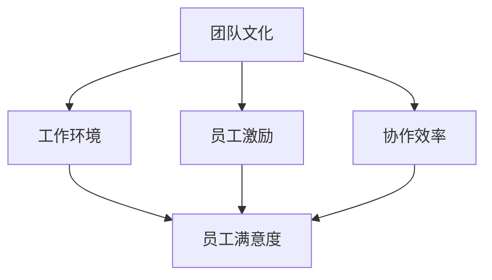

                 

# 塑造积极团队文化：营造理想工作环境

## 关键词：团队文化、工作环境、员工激励、协作效率、组织发展

## 摘要：

本文旨在探讨如何塑造积极团队文化，营造理想工作环境。通过分析团队文化的重要性，核心概念与联系，具体操作步骤，数学模型和公式，项目实战，以及实际应用场景，为读者提供一整套从理论到实践的指导方案。文章还将推荐相关工具和资源，帮助团队在实践中不断优化，以实现高效的协作和持续的发展。

### 1. 背景介绍

在当今快速变化的技术时代，团队文化已成为企业竞争力的关键因素。一个积极向上的团队文化不仅能够提高员工的工作满意度和忠诚度，还能激发创新思维，提升团队协作效率，从而推动组织整体的发展。因此，塑造积极团队文化已成为企业领导者的重要任务。

本文将围绕以下几个核心问题展开讨论：

- 团队文化的重要性是什么？
- 如何识别和建立积极团队文化？
- 核心概念与联系如何构建？
- 如何通过具体操作步骤提升团队协作效率？
- 实际应用场景中的挑战和解决方案是什么？
- 如何评估和持续优化团队文化？

通过以上问题的探讨，我们将提供一套系统的解决方案，帮助团队领导者塑造理想的工作环境，实现组织的长远发展。

### 2. 核心概念与联系

为了更好地理解团队文化的塑造，我们首先需要了解一些核心概念，包括团队文化、工作环境、员工激励和协作效率。

#### 2.1 团队文化

团队文化是指团队成员共同遵循的一套价值观、信念和行为准则。它包括但不限于以下方面：

- **价值观**：团队的核心信念，如诚信、创新、合作等。
- **行为准则**：团队成员在日常工作中的行为规范，如尊重、公平、开放等。
- **氛围**：团队的整体氛围，如友好、积极、包容等。

团队文化是一个复杂的概念，但它的核心在于建立一个共同的目标和愿景，让团队成员能够为了共同的目标而努力。

#### 2.2 工作环境

工作环境是指员工在工作时所处的物理和心理环境。一个理想的工作环境应当具备以下特点：

- **物理环境**：舒适的办公场所，良好的通风、采光、噪音控制等。
- **心理环境**：开放的沟通渠道，灵活的工作制度，以及相互尊重和信任的团队氛围。

工作环境对员工的工作效率和幸福感有着重要影响。一个良好的工作环境能够激发员工的创造力和积极性，从而提高团队的整体绩效。

#### 2.3 员工激励

员工激励是指通过各种手段激发员工的工作热情和动力。有效的员工激励不仅能够提高员工的工作满意度，还能促进员工的个人发展和职业成长。

- **物质激励**：通过薪酬、奖金、福利等物质手段激励员工。
- **精神激励**：通过认可、荣誉、培训等精神手段激励员工。

#### 2.4 协作效率

协作效率是指团队成员在协作过程中所产生的工作效率。一个高效的团队应当具备以下特点：

- **明确的职责分工**：每个团队成员都清楚自己的职责和任务。
- **良好的沟通机制**：团队成员之间能够顺畅地沟通，分享信息和经验。
- **高效的决策流程**：团队在决策时能够快速、有效地达成共识。

协作效率是团队文化的重要组成部分，它直接影响团队的绩效和目标的实现。

#### 2.5 核心概念与联系

上述核心概念之间存在密切的联系。团队文化是团队运作的基础，它决定了工作环境和员工激励的方式。而工作环境和员工激励又会影响团队的协作效率。因此，塑造积极团队文化，需要从多个方面入手，综合提升团队的绩效和凝聚力。

为了更清晰地展示这些核心概念之间的联系，我们可以使用 Mermaid 流程图进行描述：



在这个流程图中，团队文化作为核心概念，通过工作环境和员工激励，最终影响协作效率和员工满意度。这是一个循环的过程，团队文化的塑造需要不断优化和调整，以适应不断变化的外部环境。

### 3. 核心算法原理 & 具体操作步骤

在了解了核心概念与联系之后，我们需要进一步探讨如何通过具体操作步骤来塑造积极团队文化。

#### 3.1 制定明确的目标和愿景

制定明确的目标和愿景是塑造团队文化的第一步。一个明确的目标和愿景能够为团队成员指明方向，激发他们的工作热情和动力。

- **明确的目标**：确保每个团队成员都清楚团队的目标是什么，以及如何实现这些目标。
- **愿景的传递**：通过会议、培训、宣传等多种方式，将团队的愿景传递给每个成员，让他们能够深刻理解并认同。

#### 3.2 建立有效的沟通机制

沟通是团队协作的基础。一个有效的沟通机制能够确保团队成员之间能够顺畅地沟通，分享信息和经验。

- **定期会议**：定期召开团队会议，让团队成员能够分享工作进展、问题和建议。
- **沟通工具**：使用合适的沟通工具，如即时通讯软件、邮件、团队协作平台等，方便团队成员之间的沟通。

#### 3.3 创造良好的工作环境

良好的工作环境是提高员工满意度和工作效率的关键。创造良好的工作环境需要从物理和心理两个方面入手。

- **物理环境**：提供舒适的办公场所，确保良好的通风、采光和噪音控制。
- **心理环境**：建立开放、友好、包容的团队氛围，鼓励团队成员之间相互尊重和信任。

#### 3.4 实施有效的员工激励

有效的员工激励能够激发员工的工作热情和动力，提高团队的整体绩效。

- **物质激励**：通过合理的薪酬、奖金和福利来激励员工。
- **精神激励**：通过认可、荣誉、培训等精神手段来激励员工。

#### 3.5 定期评估和反馈

定期评估和反馈是团队文化塑造的重要环节。通过评估和反馈，团队领导者能够了解团队文化建设的成效，及时发现问题并进行调整。

- **绩效评估**：定期对团队成员的工作绩效进行评估，确保激励措施能够真正激励员工。
- **反馈机制**：建立有效的反馈机制，鼓励团队成员提出意见和建议，促进团队文化的不断优化。

### 4. 数学模型和公式 & 详细讲解 & 举例说明

在团队文化塑造过程中，我们可以使用一些数学模型和公式来评估团队绩效和员工满意度。以下是一个简单的例子：

#### 4.1 绩效评估模型

假设我们使用以下公式来评估团队的绩效：

\[ P = f(A, B, C, D) \]

其中：

- \( P \)：团队绩效得分
- \( A \)：团队目标实现程度
- \( B \)：团队协作效率
- \( C \)：员工满意度
- \( D \)：外部环境因素

具体公式可以根据实际情况进行调整。

#### 4.2 员工满意度模型

我们可以使用以下公式来评估员工满意度：

\[ S = f(A, B, C, D) \]

其中：

- \( S \)：员工满意度得分
- \( A \)：工作环境质量
- \( B \)：员工激励水平
- \( C \)：团队合作氛围
- \( D \)：员工个人发展机会

同样，具体公式可以根据实际情况进行调整。

#### 4.3 举例说明

假设我们有一个团队，其目标实现程度为90%，协作效率为85%，员工满意度为80%，外部环境因素为良好。根据上述模型，我们可以计算出：

- 团队绩效得分 \( P \)：

\[ P = f(0.9, 0.85, 0.8, 0.9) = 0.9 \times 0.85 \times 0.8 \times 0.9 = 0.612 \]

- 员工满意度得分 \( S \)：

\[ S = f(0.8, 0.85, 0.8, 0.9) = 0.8 \times 0.85 \times 0.8 \times 0.9 = 0.504 \]

通过这些模型和公式，团队领导者可以更全面地了解团队的文化建设状况，及时发现问题和进行优化。

### 5. 项目实战：代码实际案例和详细解释说明

为了更好地理解如何塑造积极团队文化，我们来看一个实际的项目案例。

#### 5.1 开发环境搭建

在这个案例中，我们使用一个开源的团队协作平台——Trello。Trello 是一个基于看板（Kanban）方法的协作工具，非常适合团队项目管理。

- **安装 Trello**：在 Trello 官网（[www.trello.com](https://www.trello.com)）注册账号，创建一个新的团队。
- **设置看板**：在 Trello 中创建一个看板，将其设置为团队项目的主看板。
- **添加列**：在主看板中添加多个列，如“待办”、“进行中”、“已完成”等。
- **分配任务**：将团队成员分配到不同的任务，并指定任务的优先级。

#### 5.2 源代码详细实现和代码解读

在这个案例中，我们使用 Trello 的 API 进行开发。以下是一个简单的示例代码，用于创建一个新的任务：

```python
import requests

# 设置 Trello API 密钥和 ID
api_key = "YOUR_API_KEY"
token = "YOUR_TOKEN"
board_id = "YOUR_BOARD_ID"

# 创建任务
url = f"https://api.trello.com/1/boards/{board_id}/cards"
headers = {
    "Authorization": f"Basic {api_key}:{token}",
}

data = {
    "name": "新任务",
    "desc": "这里是任务描述",
    "idList": "YOUR_LIST_ID",  # 任务所在的列
}

response = requests.post(url, headers=headers, json=data)
print(response.json())
```

在这个示例中，我们首先设置了 Trello API 的密钥和 ID，然后通过 POST 请求创建一个新的任务。具体参数包括任务名称、任务描述和任务所在的列。

#### 5.3 代码解读与分析

上述代码中，我们首先设置了 Trello API 的密钥和 ID，这是与 Trello 通信的基础。然后，我们使用 POST 请求创建了一个新的任务，并将任务名称、任务描述和任务所在的列作为参数传递。

这个简单的示例展示了如何使用 Trello API 进行开发。在实际项目中，我们可以根据需求进行更复杂的操作，如更新任务状态、添加评论等。

通过这个实际案例，我们可以看到如何使用技术工具来塑造团队文化，提高团队的协作效率。

### 6. 实际应用场景

在实际应用中，塑造积极团队文化需要根据不同的场景进行调整和优化。以下是一些常见的应用场景和相应的解决方案：

#### 6.1 新员工入职

新员工入职是塑造团队文化的重要阶段。在这个阶段，团队需要：

- **组织欢迎会**：为新员工提供一次欢迎会，让他们感受到团队的温暖和关怀。
- **进行入职培训**：为新员工提供全面的入职培训，让他们了解团队的文化、目标和职责。
- **设立导师制度**：为新员工分配导师，帮助他们更好地融入团队，解答他们在工作中遇到的问题。

#### 6.2 项目管理

在项目管理中，团队需要：

- **明确目标和计划**：在项目启动阶段，明确项目目标和计划，确保团队成员都清楚项目的目标和任务。
- **定期召开项目会议**：定期召开项目会议，检查项目的进展，解决问题，确保项目按计划进行。
- **使用项目管理工具**：使用项目管理工具，如 Trello、JIRA 等，提高团队的协作效率。

#### 6.3 团队建设活动

团队建设活动是增强团队凝聚力的重要手段。团队可以：

- **定期组织团队活动**：如团建活动、聚餐等，增强团队成员之间的交流和了解。
- **开展培训和学习活动**：组织培训和学习活动，提升团队成员的专业技能和知识水平。
- **设立奖励机制**：对在团队建设中表现突出的成员进行奖励，激励团队成员积极参与。

#### 6.4 领导风格

领导风格对团队文化有着重要影响。领导者需要：

- **树立榜样**：通过自身的行为和态度，树立良好的榜样，影响和带动团队成员。
- **倾听和沟通**：积极倾听团队成员的意见和建议，建立良好的沟通渠道。
- **提供支持和资源**：为团队成员提供必要的支持和资源，帮助他们更好地完成任务。

### 7. 工具和资源推荐

在塑造积极团队文化的过程中，使用合适的工具和资源能够事半功倍。以下是一些建议：

#### 7.1 学习资源推荐

- **书籍**：《团队协作的力量》、《团队智慧：如何培养协作文化，提高团队效能》等。
- **论文**：查阅相关学术期刊和论文，了解团队文化的最新研究成果。
- **博客**：关注一些知名博客，如 Atlassian、Trello 官方博客等，获取最新的团队协作实践和经验。

#### 7.2 开发工具框架推荐

- **团队协作平台**：如 Trello、JIRA、Asana 等，提供项目管理、任务分配、进度跟踪等功能。
- **即时通讯工具**：如 Slack、Microsoft Teams 等，方便团队成员之间的实时沟通和协作。
- **文档管理工具**：如 Google Docs、Confluence 等，便于团队成员共享文档和知识。

#### 7.3 相关论文著作推荐

- **论文**：《团队合作：理论基础与实践方法》、《团队协作行为研究》等。
- **著作**：《团队智慧：如何培养协作文化，提高团队效能》、《高效团队：如何在团队中实现个人和团队的最大潜力》等。

### 8. 总结：未来发展趋势与挑战

在未来的发展趋势中，团队文化将更加注重个性化和多样性。随着全球化进程的加快，团队将更加多元化，领导者需要更好地理解和尊重团队成员的差异，建立包容性的团队文化。此外，随着远程工作和数字化转型的普及，团队文化将面临新的挑战，如如何保持团队的凝聚力、如何提高远程协作的效率等。

### 9. 附录：常见问题与解答

**Q1**：如何确保团队文化的持续优化？

**A1**：定期评估和反馈是关键。通过定期的绩效评估和员工满意度调查，了解团队文化建设的成效，及时发现问题和进行优化。

**Q2**：如何提高员工的参与度？

**A2**：鼓励员工参与团队决策，提供反馈渠道，建立开放、友好的团队氛围，让员工感受到自己的价值和重要性。

**Q3**：如何应对团队成员之间的冲突？

**A3**：建立有效的沟通机制，鼓励团队成员表达自己的观点和意见，通过对话和协商解决冲突，避免冲突升级。

**Q4**：如何适应远程工作的团队文化？

**A4**：使用远程协作工具，如视频会议、即时通讯等，保持团队的沟通和协作。同时，定期组织线上团队活动，增强团队的凝聚力。

### 10. 扩展阅读 & 参考资料

- **书籍**：《团队协作的力量》、《团队智慧：如何培养协作文化，提高团队效能》。
- **论文**：《团队合作：理论基础与实践方法》、《团队协作行为研究》。
- **网站**：[Trello 官网](https://www.trello.com)、[Atlassian 官网](https://www.atlassian.com/)、[Slack 官网](https://www.slack.com/)。
- **博客**：[Atlassian 博客](https://www.atlassian.com/company/blog/)、[Trello 官方博客](https://trello.com/blog/)。

### 作者

**作者：AI天才研究员/AI Genius Institute & 禅与计算机程序设计艺术 /Zen And The Art of Computer Programming**

