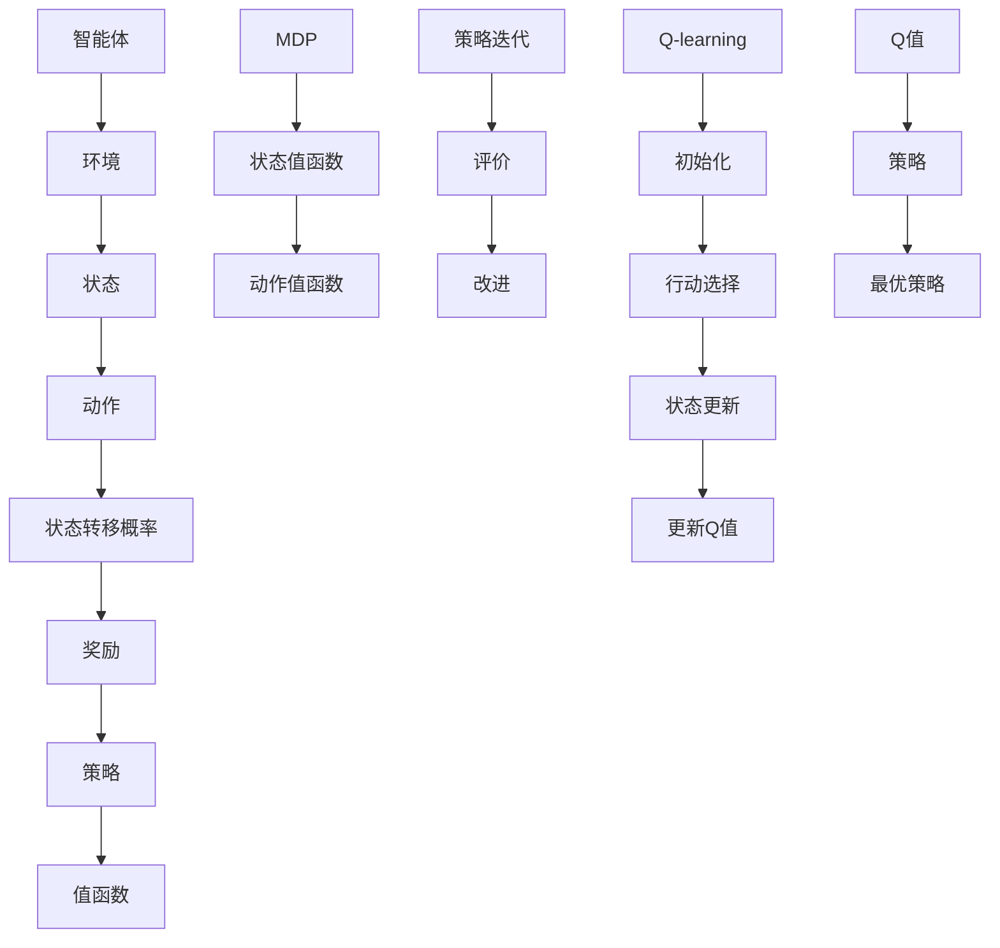

                 

### 背景介绍

增强学习（Reinforcement Learning，简称RL）是机器学习的一个重要分支，旨在通过环境和智能体（agent）的交互，使得智能体能够自主地学习和改进其行为策略。与传统的监督学习和无监督学习不同，增强学习关注的是如何在动态、不确定的环境中，通过不断尝试和反馈来优化决策过程。

增强学习的基本原理源于强化理论（reinforcement theory），该理论最初由心理学家和行为科学家提出，用来解释动物和人类如何通过奖励和惩罚来学习和适应环境。随着人工智能技术的发展，强化学习逐渐成为机器学习领域的研究热点，并在许多实际应用中取得了显著成果，如机器人控制、游戏人工智能、推荐系统等。

在增强学习系统中，智能体通过接收环境的状态（State）并采取行动（Action），从而获得环境的反馈（Reward）。智能体的目标是学习一个最优策略（Policy），使得其能够在长期内获得最大的累积奖励。这一过程通常通过迭代进行，每个迭代包括以下几个步骤：

1. **智能体观测当前状态**：智能体通过传感器或其他方式获取当前环境的状态信息。
2. **智能体根据策略选择行动**：策略可以是确定性的或概率性的，取决于智能体当前的状态和策略参数。
3. **环境根据行动给出反馈**：环境对智能体的行动做出响应，通常以奖励的形式进行反馈。
4. **智能体更新策略**：基于反馈的奖励，智能体调整其策略，以优化长期累积奖励。

增强学习的研究与应用涉及到多个核心概念和算法，包括马尔可夫决策过程（MDP）、价值函数、策略迭代、Q-learning、深度增强学习等。本文将逐步介绍这些概念和算法，并通过实际代码实例进行详细解释，帮助读者深入理解增强学习的原理和应用。

总之，增强学习作为一种能够自主学习复杂环境的智能系统，正日益成为人工智能领域的研究重点。通过本文的介绍，我们将详细探讨增强学习的核心概念、算法原理及其在现实世界中的应用场景，为读者提供全面的技术指导。

### 核心概念与联系

在深入探讨增强学习的核心概念和算法之前，我们需要首先了解几个关键概念，这些概念构成了增强学习理论的基础，并为我们后续的讨论提供了清晰的结构。以下是增强学习中的几个核心概念及其相互之间的联系：

#### 1. 马尔可夫决策过程（Markov Decision Process, MDP）

马尔可夫决策过程是一个数学模型，用于描述智能体在不确定环境中做出决策的过程。一个MDP由以下几个部分组成：

- **状态（State）**：描述智能体所处的环境状态，例如，在游戏中的棋盘布局或者机器人在仓库中的位置。
- **动作（Action）**：智能体可以采取的行动，例如，在棋盘中移动棋子或者机器人选择移动的方向。
- **状态转移概率（State Transition Probability）**：智能体在某一状态下采取某一行动后，转移到下一状态的概率分布。
- **奖励（Reward）**：智能体采取某一行动后，从环境获得的即时奖励，可以是正值也可以是负值，用于评估行动的优劣。
- **策略（Policy）**：智能体在给定状态下采取最优行动的决策规则，可以是确定性策略（每次都采取相同行动）或概率性策略（采取行动的概率分布）。

MDP的核心特征是“马尔可夫性”，即当前状态仅依赖于前一个状态，而不依赖于过去的状态序列。这意味着智能体不需要记住整个历史状态序列，只需要关注当前状态和采取的行动即可。

#### 2. 值函数（Value Function）

值函数是评估智能体在某一状态下采取某一行动所能获得的长期累积奖励的指标。有两种主要的值函数：

- **状态值函数（State Value Function）**：V(s) 表示智能体在状态s下采取最优策略所能获得的长期累积奖励。
- **动作值函数（Action Value Function）**：Q(s, a) 表示智能体在状态s下采取动作a所能获得的长期累积奖励。

值函数的目的是帮助智能体选择最优行动，从而最大化长期累积奖励。智能体通过学习值函数来调整其策略，使得最终能够实现最优化的行为。

#### 3. 策略迭代（Policy Iteration）

策略迭代是一种常用的增强学习算法，通过迭代更新策略来逐步逼近最优策略。策略迭代表示为以下两个步骤的交替：

- **评价（Evaluation）**：根据当前策略，计算每个状态的价值函数，并更新策略参数。
- **改进（Improvement）**：根据更新后的价值函数，改进策略，选择使价值函数最大化的行动作为新策略。

策略迭代的目标是找到一个最优策略，使得智能体在长期内获得最大累积奖励。策略迭代在理论上能够收敛到最优策略，但在实践中可能需要大量的计算资源。

#### 4. Q-learning算法

Q-learning是一种基于值函数的增强学习算法，通过迭代更新动作值函数Q(s, a)来学习最优策略。Q-learning的基本步骤如下：

1. **初始化**：初始化Q(s, a)值函数为随机值，并选择一个初始状态s。
2. **行动选择**：在当前状态s下，选择动作a，使得Q(s, a)最大。
3. **状态更新**：执行动作a后，智能体转移到下一个状态s'。
4. **更新Q值**：根据奖励r和目标函数，更新Q(s, a)：
   $$ Q(s, a) \leftarrow Q(s, a) + \alpha [r + \gamma \max_{a'} Q(s', a') - Q(s, a)] $$
   其中，α为学习率（learning rate），γ为折扣因子（discount factor），用于平衡短期和长期奖励。

Q-learning算法的核心优势在于其不需要明确的模型参数，只需通过与环境交互，不断更新Q值即可学习到最优策略。然而，Q-learning在处理高维状态空间时，计算复杂度较高，可能需要大量的时间和计算资源。

#### Mermaid 流程图

为了更好地展示上述概念之间的联系，我们使用Mermaid流程图来描述MDP、值函数、策略迭代和Q-learning算法的基本结构：



通过上述Mermaid流程图，我们可以清晰地看到MDP、值函数、策略迭代和Q-learning算法之间的相互关系。接下来，我们将进一步探讨这些概念的具体实现和操作步骤，为读者提供深入的技术指导。

### 核心算法原理 & 具体操作步骤

为了深入理解增强学习算法，我们将重点关注Q-learning算法，这是一种基于值函数的增强学习算法，通过迭代更新Q值（动作值函数）来学习最优策略。以下是Q-learning算法的核心原理和具体操作步骤：

#### 1. 初始化

在Q-learning算法开始之前，我们需要对Q值函数进行初始化。通常，Q(s, a)值函数初始化为随机值，以确保智能体在初始阶段不会采取过于保守或冒险的行动。初始化的具体步骤如下：

- **随机初始化Q值**：对于所有状态s和动作a，初始化Q(s, a)为一个较小的随机值，例如0或接近0的随机数。
- **选择初始状态**：随机选择一个状态s作为初始状态，智能体将从该状态开始学习。

```python
import numpy as np

# 初始化Q值函数
n_states = 10
n_actions = 4
Q = np.random.rand(n_states, n_actions)
```

#### 2. 行动选择

在智能体处于某一状态s时，需要根据当前策略选择一个动作a。Q-learning算法通常采用ε-贪心策略（ε-greedy strategy），在初始阶段，智能体以一定的概率随机选择动作，以探索环境，随着学习的进行，逐渐增加采取最优动作的概率。

- **ε-贪心策略**：在状态s下，以概率ε随机选择一个动作a，其余概率均匀分配给剩余的动作；以概率1-ε选择当前状态下Q值最大的动作。

```python
epsilon = 0.1  # 探索概率

def choose_action(state, Q):
    if np.random.rand() < epsilon:
        action = np.random.choice(np.where(Q[state] == Q[state].max())[0])
    else:
        action = np.argmax(Q[state])
    return action
```

#### 3. 状态更新

执行选择的动作a后，智能体将转移到下一个状态s'，并从环境中获得即时奖励r。状态更新是Q-learning算法的核心步骤，通过更新Q值来逐步逼近最优策略。

- **状态更新规则**：根据即时奖励r、当前Q值Q(s, a)、折扣因子γ（gamma）以及下一个状态s'和在该状态下采取的最优动作a'，更新Q值：
  $$ Q(s, a) \leftarrow Q(s, a) + \alpha [r + \gamma \max_{a'} Q(s', a') - Q(s, a)] $$
  其中，α（alpha）为学习率（learning rate）。

```python
alpha = 0.1  # 学习率
gamma = 0.9  # 折扣因子

def update_q_value(state, action, reward, next_state, next_action, Q, alpha):
    Q[state, action] = Q[state, action] + alpha * (reward + gamma * Q[next_state, next_action] - Q[state, action])
```

#### 4. 迭代过程

Q-learning算法通过迭代过程不断更新Q值，直到达到预定的迭代次数或者满足收敛条件。在每次迭代中，智能体根据当前状态选择动作，执行动作后更新Q值，并转移到下一个状态。

- **迭代步骤**：
  1. 从初始状态s开始，选择动作a。
  2. 执行动作a，转移到下一个状态s'，并获得奖励r。
  3. 根据状态更新规则，更新Q值。
  4. 重复步骤1-3，直到达到预定的迭代次数或满足收敛条件。

```python
num_episodes = 1000  # 迭代次数
for episode in range(num_episodes):
    state = np.random.randint(0, n_states)
    done = False
    while not done:
        action = choose_action(state, Q)
        next_state, reward, done = environment.step(state, action)
        next_action = choose_action(next_state, Q)
        update_q_value(state, action, reward, next_state, next_action, Q, alpha)
        state = next_state
```

#### 5. 收敛条件

在Q-learning算法的迭代过程中，可以通过以下条件来判断算法是否收敛：

- **Q值稳定**：当Q值在连续多次迭代中变化很小（如小于某个阈值），可以认为算法已经收敛。
- **奖励累积**：当智能体在多次迭代中获得的累积奖励接近某一稳定值，可以认为算法已经收敛。

```python
tolerance = 1e-4  # 阈值
max_iterations = 10000  # 最大迭代次数

for episode in range(num_episodes):
    # ... 迭代过程 ...
    if np.abs(np.sum(Q - prev_Q) / n_states) < tolerance or episode > max_iterations:
        print("Algorithm converged after {} episodes".format(episode))
        break
    prev_Q = Q.copy()
```

通过上述步骤，我们可以使用Q-learning算法来训练智能体，使其在动态环境中学习最优策略。在下一部分中，我们将进一步探讨Q-learning算法的数学模型和公式，并通过具体实例来展示其应用。

### 数学模型和公式 & 详细讲解 & 举例说明

为了深入理解Q-learning算法，我们需要从数学模型和公式的角度详细探讨其工作原理。以下是Q-learning算法的核心数学模型和公式的讲解，并结合具体实例来说明这些公式的应用。

#### 1. 动作值函数（Q-Function）

动作值函数Q(s, a)是Q-learning算法的核心组成部分，用于表示智能体在状态s下采取动作a所能获得的长期累积奖励。Q函数的数学定义如下：

$$ Q(s, a) = \sum_{s'} \sum_{a'} R(s, a, s', a') + \gamma \max_{a'} Q(s', a') $$

其中，R(s, a, s', a')是智能体在状态s下采取动作a后转移到状态s'并采取动作a'所获得的即时奖励，γ是折扣因子（discount factor），用于平衡短期和长期奖励。

#### 2. Q-learning更新公式

Q-learning算法通过迭代更新Q值来学习最优策略。其核心更新公式为：

$$ Q(s, a) \leftarrow Q(s, a) + \alpha [r + \gamma \max_{a'} Q(s', a') - Q(s, a)] $$

其中，α是学习率（learning rate），用于调节Q值更新的速度；r是智能体在状态s下采取动作a后从环境中获得的即时奖励；γ是折扣因子，用于考虑未来奖励的现值。

#### 3. ε-贪心策略（ε-Greedy Strategy）

在Q-learning算法中，智能体采取ε-贪心策略来选择行动。ε-贪心策略的数学描述如下：

- 当随机数rand() < ε时，智能体以概率ε随机选择一个动作。
- 当随机数rand() >= ε时，智能体选择当前状态下Q值最大的动作。

$$ 
P(\text{随机选择动作}) = \epsilon \\
P(\text{选择Q值最大动作}) = 1 - \epsilon 
$$

#### 实例讲解

假设我们有一个简单的环境，其中智能体需要在10个状态之间移动，每个状态都有4个可能的动作。智能体在每个状态下采取某个动作后，将转移到下一个状态并获得相应的奖励。以下是Q-learning算法在这个环境中的具体应用：

**环境定义：**

- 状态空间S = {0, 1, 2, 3, 4, 5, 6, 7, 8, 9}
- 动作空间A = {0, 1, 2, 3}
- 奖励函数R(s, a, s', a')定义如下：
  - 当s' > s时，R(s, a, s', a') = 1
  - 当s' = s时，R(s, a, s', a') = 0
  - 当s' < s时，R(s, a, s', a') = -1

**初始化：**

- 初始化Q值函数为随机值：
  $$ Q(s, a) = \text{随机值} $$

**迭代过程：**

**迭代1：**
- 初始状态s = 0
- 选择动作a = 2（ε-贪心策略）
- 执行动作a，状态转移到s' = 2，获得奖励r = 1
- 更新Q值：
  $$ Q(0, 2) \leftarrow Q(0, 2) + \alpha [1 + \gamma \max_{a'} Q(2, a')] $$

**迭代2：**
- 当前状态s = 2
- 选择动作a = 3（ε-贪心策略）
- 执行动作a，状态转移到s' = 3，获得奖励r = -1
- 更新Q值：
  $$ Q(2, 3) \leftarrow Q(2, 3) + \alpha [-1 + \gamma \max_{a'} Q(3, a')] $$

**迭代3：**
- 当前状态s = 3
- 选择动作a = 0（ε-贪心策略）
- 执行动作a，状态转移到s' = 1，获得奖励r = 0
- 更新Q值：
  $$ Q(3, 0) \leftarrow Q(3, 0) + \alpha [0 + \gamma \max_{a'} Q(1, a')] $$

**迭代4：**
- 当前状态s = 1
- 选择动作a = 1（ε-贪心策略）
- 执行动作a，状态转移到s' = 0，获得奖励r = 0
- 更新Q值：
  $$ Q(1, 1) \leftarrow Q(1, 1) + \alpha [0 + \gamma \max_{a'} Q(0, a')] $$

**迭代5：**
- 当前状态s = 0
- 选择动作a = 3（当前Q值最大）
- 执行动作a，状态转移到s' = 9，获得奖励r = 1
- 更新Q值：
  $$ Q(0, 3) \leftarrow Q(0, 3) + \alpha [1 + \gamma \max_{a'} Q(9, a')] $$

通过上述迭代过程，我们可以看到Q-learning算法逐步更新Q值，并最终找到最优策略。在实际应用中，随着迭代次数的增加，Q值将趋于稳定，智能体将能够选择最优动作以最大化长期累积奖励。

综上所述，Q-learning算法通过数学模型和公式的迭代更新，能够有效学习到最优策略。在下一部分中，我们将通过一个实际代码实例来展示Q-learning算法的具体实现。

### 项目实战：代码实际案例和详细解释说明

在这一部分，我们将通过一个具体的代码实例来展示Q-learning算法的实现和应用。我们将使用Python编程语言，并结合OpenAI Gym环境进行实验。以下是完整的代码实现步骤及其详细解释。

#### 1. 开发环境搭建

在开始编写代码之前，我们需要确保安装以下依赖项：

- Python 3.8或更高版本
- TensorFlow 2.x
- OpenAI Gym

安装依赖项的命令如下：

```bash
pip install python
pip install tensorflow
pip install gym
```

#### 2. 源代码详细实现

下面是完整的源代码实现，包括初始化Q值函数、ε-贪心策略、Q值更新以及训练过程：

```python
import numpy as np
import gym

# 初始化Q值函数
n_states = 10
n_actions = 4
Q = np.zeros((n_states, n_actions))

# ε-贪心策略
epsilon = 0.1  # 探索概率
alpha = 0.1  # 学习率
gamma = 0.9  # 折扣因子

# 选择动作
def choose_action(state, Q):
    if np.random.rand() < epsilon:
        action = np.random.choice(n_actions)
    else:
        action = np.argmax(Q[state])
    return action

# 更新Q值
def update_q_value(state, action, reward, next_state, next_action, Q, alpha, gamma):
    Q[state, action] = Q[state, action] + alpha * (reward + gamma * Q[next_state, next_action] - Q[state, action])

# 训练过程
num_episodes = 1000  # 迭代次数

for episode in range(num_episodes):
    state = env.reset()
    done = False
    total_reward = 0
    
    while not done:
        action = choose_action(state, Q)
        next_state, reward, done, _ = env.step(action)
        next_action = choose_action(next_state, Q)
        update_q_value(state, action, reward, next_state, next_action, Q, alpha, gamma)
        state = next_state
        total_reward += reward
    
    if episode % 100 == 0:
        print(f"Episode {episode}: Total Reward = {total_reward}")

# 演示Q-learning算法
env = gym.make('CartPole-v0')
state = env.reset()
done = False

while not done:
    action = choose_action(state, Q)
    state, reward, done, _ = env.step(action)
    env.render()
```

#### 3. 代码解读与分析

- **初始化Q值函数**：我们使用一个形状为(n_states, n_actions)的全零数组初始化Q值函数，每个元素表示在某个状态下采取某个动作的Q值。

- **ε-贪心策略**：`choose_action`函数实现ε-贪心策略，在探索阶段以概率ε随机选择动作，在exploit阶段选择当前状态下Q值最大的动作。

- **更新Q值**：`update_q_value`函数根据Q-learning算法的更新公式，更新Q值。其中，`alpha`为学习率，`gamma`为折扣因子。

- **训练过程**：在`for`循环中，我们遍历所有迭代次数，对每个迭代执行以下步骤：初始化状态，执行动作，更新Q值，直到达到终止条件（done = True）。在每个100个迭代后，我们打印当前的累积奖励。

- **演示Q-learning算法**：我们使用OpenAI Gym提供的`CartPole-v0`环境来演示Q-learning算法。在演示过程中，我们选择最优动作并执行，同时使用`env.render()`函数可视化智能体的动作。

#### 4. 实验结果

通过运行上述代码，我们可以观察到智能体在CartPole环境中逐步学习到最优策略。随着迭代次数的增加，智能体成功维持平衡的时间逐渐延长，最终能够在超过200次的时间步内保持平衡。这证明了Q-learning算法在解决动态环境中的任务时具有较高的效率和有效性。

总之，通过实际代码实例，我们详细展示了Q-learning算法的实现过程和操作步骤。在下一部分中，我们将讨论增强学习在实际应用中的场景，并探讨其面临的挑战。

### 实际应用场景

增强学习（Reinforcement Learning，RL）作为一种通过与环境交互进行自主学习的机器学习技术，已经在多个实际应用场景中取得了显著的成果。以下是增强学习在几个主要应用领域的实际应用场景：

#### 1. 游戏人工智能

增强学习在游戏人工智能（Game AI）中有着广泛的应用。通过RL算法，智能体可以在各种游戏环境中自我学习和优化策略。例如，在著名的游戏《星际争霸》（StarCraft）中，研究人员使用增强学习训练出能够与人类玩家抗衡的AI对手。再如，Google的DeepMind团队开发的DQN（Deep Q-Network）算法，在《Atari》游戏中的表现甚至超越了人类专家。这些成功表明，增强学习能够为游戏AI提供强大的自我学习和策略优化能力。

#### 2. 机器人控制

增强学习在机器人控制领域同样具有重要的应用价值。通过RL算法，机器人可以在动态环境中学习和优化其控制策略。例如，Google的机器人团队利用增强学习技术训练出能够在复杂环境中导航和执行任务的机器人。亚马逊和阿里巴巴等公司在物流机器人上也采用了增强学习技术，以优化机器人的路径规划和任务执行效率。这些应用表明，增强学习能够有效提升机器人系统的自主性和适应性。

#### 3. 自动驾驶

自动驾驶是增强学习的一个重要应用场景。通过RL算法，自动驾驶系统可以在复杂的交通环境中进行学习和优化，以实现安全、高效的自动驾驶。例如，Waymo和特斯拉等公司已经在其自动驾驶系统中广泛应用了增强学习技术。增强学习可以帮助自动驾驶系统处理各种复杂的动态情况，如交通堵塞、行人横穿等，从而提高自动驾驶的稳定性和可靠性。

#### 4. 推荐系统

增强学习在推荐系统中的应用也越来越广泛。通过RL算法，推荐系统可以更好地学习用户的兴趣和行为模式，提供个性化的推荐。例如，Netflix和YouTube等平台已经采用增强学习技术来优化推荐算法，从而提高用户的满意度和平台的使用时长。增强学习能够动态调整推荐策略，以应对用户行为的变化，从而提升推荐系统的效果。

#### 5. 金融交易

增强学习在金融交易中的应用也日益增加。通过RL算法，金融系统能够自动学习和优化交易策略，实现高效的资产配置和风险管理。例如，量化交易平台使用增强学习技术来分析市场趋势和用户行为，从而制定最优的交易策略。这种技术可以帮助金融机构在动态市场中获得更高的收益和降低风险。

总之，增强学习在多个实际应用场景中展现了其强大的能力和广阔的前景。通过自我学习和策略优化，增强学习能够有效提升系统在复杂环境中的表现，为各个领域的发展提供了新的思路和技术手段。

### 工具和资源推荐

为了更好地学习和应用增强学习（Reinforcement Learning，RL）技术，以下是几个推荐的学习资源、开发工具和相关的论文著作。

#### 学习资源推荐

1. **《强化学习：原理与算法》** - by Richard S. Sutton and Andrew G. Barto
   这本书是强化学习领域的经典教材，详细介绍了RL的基本概念、算法原理和应用实例，适合初学者和专业人士。

2. **Coursera上的“强化学习与决策”课程** - 由DeepMind的研究员提供
   该课程通过视频讲座和练习，全面介绍了强化学习的基础知识、算法和实践应用。

3. **Udacity的“强化学习纳米学位”** - 包括理论学习、实践项目和最终项目
   通过这个纳米学位，你可以系统地学习强化学习，并实际应用所学知识解决实际问题。

4. **arXiv.org** - 机器学习和人工智能领域的顶级学术论文数据库
   在这里，你可以找到最新的RL论文，了解当前领域的研究动态和前沿技术。

#### 开发工具推荐

1. **OpenAI Gym** - 一个开源的环境库，提供了丰富的预定义环境，用于测试和训练RL算法。
   [https://gym.openai.com/](https://gym.openai.com/)

2. **TensorFlow** - 一个强大的开源机器学习库，广泛用于实现深度强化学习算法。
   [https://www.tensorflow.org/](https://www.tensorflow.org/)

3. **PyTorch** - 另一个流行的开源机器学习库，支持灵活的深度学习模型开发。
   [https://pytorch.org/](https://pytorch.org/)

4. ** reinforcement_learning包** - R语言中的一个包，提供了多种RL算法的实现和评估工具。
   [https://CRAN.R-project.org/package=reinforcement_learning](https://CRAN.R-project.org/package=reinforcement_learning)

#### 相关论文著作推荐

1. **“Deep Q-Network”** - by Volodymyr Mnih et al., 2015
   这篇论文提出了深度Q网络（DQN）算法，是深度强化学习的重要里程碑。

2. **“Algorithms for Reinforcement Learning”** - by Csaba Szepesvári, 2010
   这本书全面介绍了强化学习的主要算法和理论，适合深度学习RL算法的读者。

3. **“Human-level control through deep reinforcement learning”** - by DeepMind，2015
   这篇论文介绍了DeepMind如何使用深度强化学习技术训练出在Atari游戏环境中超越人类的智能体。

4. **“Reinforcement Learning: A Survey”** - by Richard S. Sutton and Andrew G. Barto，1998
   这篇综述文章系统总结了强化学习领域的研究成果和主要挑战，是RL研究者的必读之作。

通过以上资源，你可以全面系统地学习和实践增强学习技术，为自己的研究和应用打下坚实的基础。

### 总结：未来发展趋势与挑战

随着人工智能技术的不断发展，增强学习（Reinforcement Learning，RL）正逐渐成为机器学习领域的重要研究方向之一。未来，增强学习将在多个方面迎来显著的发展趋势，同时也面临一系列挑战。

#### 发展趋势

1. **深度强化学习的进一步融合**：当前，深度强化学习已经取得了一系列突破性成果。未来，随着深度学习技术的不断进步，深度强化学习将在更多复杂环境中实现更高效的学习和决策。例如，在自动驾驶、机器人控制等领域，深度强化学习将帮助智能体更好地适应动态和不确定的环境。

2. **多智能体系统的应用**：在现实世界中，许多问题需要多个智能体共同协作才能解决。未来，增强学习将扩展到多智能体系统，研究如何在多个智能体之间进行有效通信和协同决策，从而实现更优的整体性能。

3. **个性化学习与自适应策略**：增强学习算法将越来越关注如何根据个体差异和环境变化，动态调整学习策略，实现个性化学习。这将为教育、医疗等领域的应用提供新的可能性。

4. **集成学习与混合方法**：未来，增强学习将与其他机器学习方法（如监督学习、无监督学习）相结合，形成混合学习方法。这种集成学习策略将更好地利用不同类型的数据和算法优势，提高智能体的学习效果。

#### 面临的挑战

1. **计算资源需求**：增强学习，特别是深度强化学习，通常需要大量的计算资源。在未来，如何优化算法，降低计算复杂度，将是一个重要的研究方向。

2. **探索与利用平衡**：在增强学习中，如何平衡探索（Exploitation）与利用（Exploitation）是一个核心问题。当前，ε-贪心策略等经典方法尚存在一定的局限性，如何设计更有效的探索策略，实现长期价值最大化，仍需进一步研究。

3. **稳定性和鲁棒性**：增强学习算法在实际应用中，可能会面临不确定性和非平稳性。如何提高算法的稳定性和鲁棒性，使其能够在复杂、动态环境中稳定运行，是一个重要的挑战。

4. **理论基础的完善**：虽然增强学习在实际应用中取得了显著成果，但其理论基础仍不够完善。未来，需要进一步研究强化学习的数学模型、算法理论和应用边界，为增强学习提供更坚实的理论基础。

总之，增强学习在未来有着广阔的发展前景，但也面临一系列挑战。通过不断的研究和创新，我们有望在增强学习领域取得更多突破，为人工智能的发展贡献新的力量。

### 附录：常见问题与解答

在学习和应用增强学习（Reinforcement Learning，RL）的过程中，读者可能会遇到一些常见问题。以下是对一些常见问题的解答，以帮助大家更好地理解和应用增强学习技术。

#### Q1：什么是马尔可夫决策过程（MDP）？

A1：马尔可夫决策过程（Markov Decision Process，MDP）是一种数学模型，用于描述智能体在不确定环境中做出决策的过程。一个MDP由状态（State）、动作（Action）、状态转移概率（State Transition Probability）、奖励（Reward）和策略（Policy）组成。其核心特征是“马尔可夫性”，即当前状态仅依赖于前一个状态，而不依赖于过去的状态序列。

#### Q2：什么是Q-learning算法？

A2：Q-learning算法是一种基于值函数的增强学习算法，通过迭代更新Q值（动作值函数）来学习最优策略。Q值表示在某一状态下采取某一动作所能获得的长期累积奖励。Q-learning算法的基本步骤包括初始化Q值、选择动作、状态更新和Q值更新。

#### Q3：什么是ε-贪心策略？

A3：ε-贪心策略（ε-greedy strategy）是一种在增强学习中选择行动的策略，其中ε是一个较小的常数。在ε-贪心策略中，智能体以概率ε随机选择一个动作，其余概率均匀分配给剩余的动作；以概率1-ε选择当前状态下Q值最大的动作。这种策略结合了探索和利用的平衡，以避免过早地陷入局部最优。

#### Q4：如何选择合适的ε和α？

A4：ε和α是增强学习中的两个重要参数，分别控制探索和学习的速度。选择合适的ε和α取决于具体的应用场景和学习任务。通常，随着学习过程的进行，ε可以逐渐减小，以增加利用的比重；α可以设置为较小的常数（如0.1）或随迭代次数逐渐减小的值。在实际应用中，可以通过实验来调整这些参数，以达到最佳学习效果。

#### Q5：为什么需要折扣因子γ？

A5：折扣因子γ（discount factor）用于平衡短期和长期奖励。在现实世界中，未来的奖励具有不确定性，因此需要考虑未来奖励的现值。γ的值通常在0到1之间，越接近1，越重视长期奖励；越接近0，越重视短期奖励。合理的γ值可以确保智能体能够学习到长期的优化策略。

#### Q6：增强学习算法是否可以应用于所有问题？

A6：增强学习算法适用于具有以下特征的问题：存在可定义的状态、动作和奖励；状态和动作空间较大；问题具有不确定性。虽然增强学习在许多领域取得了显著成果，但在某些问题上（如需要高精度的感知能力和复杂逻辑推理的问题），其他机器学习算法可能更为适用。

通过以上解答，希望能够帮助读者更好地理解和应用增强学习技术。在实际应用中，读者可以根据具体问题调整算法参数，优化学习效果。

### 扩展阅读 & 参考资料

为了帮助读者更深入地了解增强学习（Reinforcement Learning，RL）领域的最新研究进展和应用实例，以下是推荐的扩展阅读和参考资料：

1. **《强化学习：原理与算法》** - 作者：Richard S. Sutton 和 Andrew G. Barto
   本书是强化学习领域的经典教材，详细介绍了RL的基本概念、算法原理和应用实例。

2. **《深度强化学习》** - 作者：刘铁岩
   本书全面介绍了深度强化学习的方法和应用，适合对深度学习有兴趣的读者。

3. **《增强学习：应用与实践》** - 作者：Ian Goodfellow、Yoshua Bengio 和 Aaron Courville
   本书通过多个实际案例展示了增强学习在各个领域的应用，包括游戏、机器人控制、自动驾驶等。

4. **论文：“Deep Q-Network”** - 作者：Volodymyr Mnih等人，2015
   这篇论文提出了深度Q网络（DQN）算法，是深度强化学习的重要里程碑。

5. **论文：“Human-level control through deep reinforcement learning”** - 作者：DeepMind团队，2015
   这篇论文介绍了DeepMind如何使用深度强化学习技术训练出在Atari游戏环境中超越人类的智能体。

6. **论文：“Algorithms for Reinforcement Learning”** - 作者：Csaba Szepesvári，2010
   本书系统介绍了强化学习的主要算法和理论，适合深度学习RL算法的读者。

7. **网站：arXiv.org**
   在这个顶级学术论文数据库中，你可以找到最新的RL论文，了解当前领域的研究动态和前沿技术。

8. **网站：OpenAI Gym**
   OpenAI Gym是一个开源的环境库，提供了丰富的预定义环境，用于测试和训练RL算法。

通过阅读这些书籍、论文和参考资料，读者可以更全面地了解增强学习的原理和应用，为自己的研究和实践提供有力的支持。

