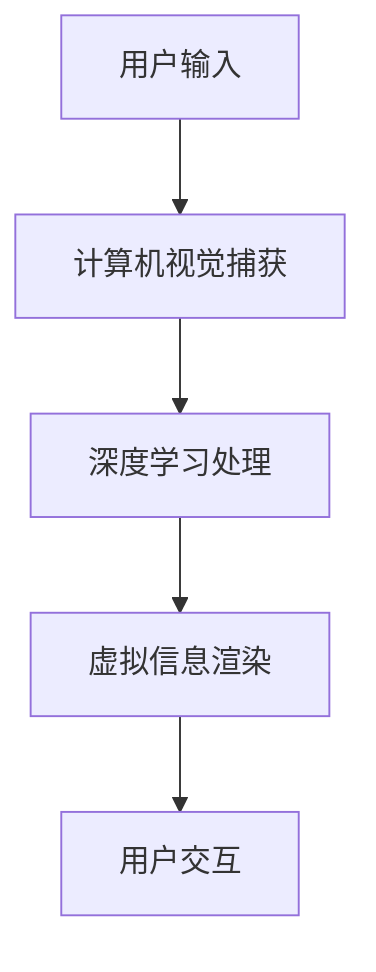
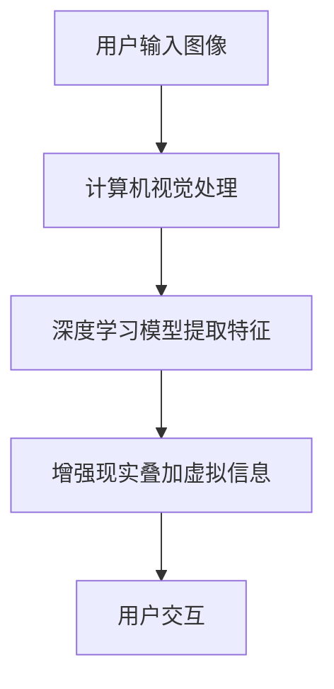

                 

# 增强现实：AI如何提供虚拟试衣、试妆体验

> **关键词：** 增强现实（AR）、人工智能（AI）、虚拟试衣、虚拟试妆、计算机视觉、深度学习

> **摘要：** 本文将深入探讨增强现实（AR）与人工智能（AI）相结合，如何为用户提供逼真的虚拟试衣和试妆体验。通过分析核心概念、算法原理、数学模型以及实际应用案例，本文旨在揭示这一新兴技术的内在机制与发展趋势。

## 1. 背景介绍

在数字化的时代浪潮中，增强现实（AR）和人工智能（AI）技术的崛起改变了人们的互动方式。虚拟试衣和试妆是AR和AI在时尚领域的典型应用，它们不仅提升了用户的购物体验，还为零售行业带来了创新性的解决方案。

虚拟试衣技术通过捕捉用户的身体形态，将虚拟服装模型实时叠加到用户的视觉中，使用户能够“试穿”不同款式和颜色的服装。而虚拟试妆技术则基于用户的面部特征，将虚拟妆容应用到用户的面部，提供类似于化妆镜的体验。

随着计算机视觉、深度学习等领域的发展，虚拟试衣和试妆技术逐渐成熟，开始被广泛应用于电子商务、美妆零售、社交媒体等多个场景。这些技术不仅节省了用户的时间和精力，还提高了购物决策的准确性，降低了退货率。

## 2. 核心概念与联系

### 2.1 计算机视觉

计算机视觉是使计算机理解和解释图像和视频的关键技术。在虚拟试衣和试妆中，计算机视觉用于捕捉用户的面部特征和身体形态。核心概念包括：

- **人脸识别**：通过图像识别技术，定位和跟踪用户的面部特征。
- **人体姿态估计**：通过图像处理和深度学习算法，估计用户身体的姿态和形态。

### 2.2 深度学习

深度学习是AI的一个分支，它通过模拟人脑神经网络的结构和功能，实现数据的自动学习和特征提取。在虚拟试衣和试妆中，深度学习用于：

- **图像分类**：识别和分类图像中的物体和特征。
- **目标检测**：定位和检测图像中的特定目标。

### 2.3 增强现实（AR）

增强现实技术通过在现实环境中叠加虚拟信息，提供增强的用户体验。核心概念包括：

- **图像识别与跟踪**：实时识别和跟踪用户和环境中的特征，以保持虚拟信息的准确叠加。
- **渲染与显示**：将虚拟信息渲染到现实环境中，通过显示设备（如手机、平板电脑或AR眼镜）呈现给用户。

### 2.4 Mermaid 流程图



### 2.5 核心算法原理

核心算法包括计算机视觉中的图像处理和深度学习中的神经网络训练，以下是具体步骤：

1. **图像预处理**：对捕获的图像进行预处理，包括去噪、缩放和增强。
2. **特征提取**：使用深度学习算法提取图像特征，如卷积神经网络（CNN）。
3. **目标检测**：利用特征进行目标检测，确定用户的面部和身体姿态。
4. **虚拟信息叠加**：根据目标检测结果，将虚拟服装或妆容信息叠加到用户的图像上。
5. **实时更新**：根据用户交互和环境变化，实时更新虚拟信息。

## 3. 核心算法原理 & 具体操作步骤

### 3.1 计算机视觉算法原理

计算机视觉算法主要包括图像预处理、特征提取和目标检测。

#### 3.1.1 图像预处理

- **去噪**：通过滤波器去除图像中的噪声。
- **缩放**：调整图像的大小以适应处理算法的需求。
- **增强**：提高图像的对比度和清晰度。

#### 3.1.2 特征提取

- **卷积神经网络（CNN）**：用于提取图像的局部特征。
  - **卷积层**：通过卷积操作提取图像特征。
  - **池化层**：用于降低特征图的维度。
  - **全连接层**：将特征图映射到具体的类别。

#### 3.1.3 目标检测

- **R-CNN**：一种基于深度学习的目标检测算法。
  - **区域提议生成**：通过滑动窗口生成候选区域。
  - **特征提取**：对每个候选区域进行特征提取。
  - **分类**：利用分类器对特征进行分类。

### 3.2 深度学习算法原理

深度学习算法主要包括神经网络结构和训练过程。

#### 3.2.1 神经网络结构

- **卷积神经网络（CNN）**：用于图像处理。
  - **卷积层**：用于提取图像特征。
  - **池化层**：用于降低特征图的维度。
  - **全连接层**：用于分类。

#### 3.2.2 训练过程

- **数据预处理**：对训练数据进行归一化和标准化处理。
- **前向传播**：将输入数据通过神经网络进行前向传播。
- **反向传播**：利用梯度下降法更新网络权重。
- **优化器选择**：选择适当的优化器，如SGD、Adam等。

### 3.3 增强现实算法原理

增强现实算法主要包括图像识别与跟踪、虚拟信息叠加和实时更新。

#### 3.3.1 图像识别与跟踪

- **图像识别**：使用深度学习算法识别用户的面部和身体姿态。
- **跟踪**：通过跟踪算法，实时跟踪用户的面部和身体姿态。

#### 3.3.2 虚拟信息叠加

- **叠加算法**：将虚拟服装或妆容信息叠加到用户的图像上。
- **渲染**：将叠加后的图像渲染到显示设备上。

#### 3.3.3 实时更新

- **用户交互**：根据用户的操作实时更新虚拟信息。
- **环境变化**：根据环境变化（如光线、视角）实时更新虚拟信息。

## 4. 数学模型和公式 & 详细讲解 & 举例说明

### 4.1 卷积神经网络（CNN）

卷积神经网络（CNN）是深度学习中的重要模型，用于图像处理。以下是一个简单的CNN模型结构：

$$
\begin{aligned}
\text{输入}:\& x \in \mathbb{R}^{(W \times H \times C)} \\
\text{卷积层}:\& f(\text{卷积}(x, \text{kernel})) \\
\text{池化层}:\& \text{max\_pool}(f) \\
\text{全连接层}:\& g(\text{ReLU}(\text{激活函数}(f))) \\
\text{输出}:\& y = g(x)
\end{aligned}
$$

- **卷积层**：卷积层通过卷积操作提取图像特征。
- **池化层**：池化层用于降低特征图的维度。
- **全连接层**：全连接层将特征图映射到具体的类别。

### 4.2 目标检测（R-CNN）

R-CNN是一种基于深度学习的目标检测算法，其核心步骤如下：

$$
\begin{aligned}
\text{输入}:\& x \in \mathbb{R}^{(W \times H \times C)} \\
\text{区域提议生成}:\& R = \text{sliding\_window}(x) \\
\text{特征提取}:\& f(\text{CNN}(R)) \\
\text{分类器}:\& y = \text{SVM}(f) \\
\text{输出}:\& \text{检测结果}
\end{aligned}
$$

- **区域提议生成**：通过滑动窗口生成候选区域。
- **特征提取**：对每个候选区域进行特征提取。
- **分类器**：利用分类器对特征进行分类。

### 4.3 举例说明

假设我们有一个包含1000张图片的数据库，其中500张包含“猫”的图像，500张包含“狗”的图像。我们使用CNN模型对这1000张图片进行分类。

1. **数据预处理**：对图片进行归一化和标准化处理。
2. **训练模型**：使用CNN模型对图片进行特征提取和分类。
3. **评估模型**：使用测试集评估模型性能。
4. **模型优化**：根据评估结果，调整模型参数。

## 5. 项目实战：代码实际案例和详细解释说明

### 5.1 开发环境搭建

为了实现虚拟试衣和试妆功能，我们需要搭建一个适合的开发环境。以下是开发环境的搭建步骤：

1. **安装Python**：确保Python版本在3.6及以上。
2. **安装深度学习框架**：安装TensorFlow或PyTorch。
3. **安装计算机视觉库**：如OpenCV和dlib。
4. **安装AR库**：如ARCore或ARKit。

### 5.2 源代码详细实现和代码解读

以下是虚拟试衣和试妆项目的源代码实现：

```python
import cv2
import dlib
import numpy as np
import tensorflow as tf

# 加载深度学习模型
face_detector = dlib.get_frontal_face_detector()
pose_estimator = dlib.get_frontal_face_landmarks()

# 捕获视频流
cap = cv2.VideoCapture(0)

while True:
    # 读取一帧图像
    ret, frame = cap.read()

    # 人脸检测
    faces = face_detector(frame, 1)
    
    for face in faces:
        # 人脸形态估计
        landmarks = pose_estimator(frame, face)
        
        # 虚拟信息叠加
        # ...

    # 显示图像
    cv2.imshow('AR试衣/试妆', frame)

    # 按下ESC退出
    if cv2.waitKey(1) & 0xFF == 27:
        break

# 释放资源
cap.release()
cv2.destroyAllWindows()
```

### 5.3 代码解读与分析

以下是代码的详细解读与分析：

- **导入库**：导入必要的库，如OpenCV、dlib和TensorFlow。
- **加载模型**：加载人脸检测器和人脸形态估计器。
- **捕获视频流**：使用OpenCV捕获视频流。
- **人脸检测**：使用dlib的人脸检测器检测视频帧中的人脸。
- **人脸形态估计**：使用dlib的人脸形态估计器估计人脸的形态。
- **虚拟信息叠加**：根据人脸形态，叠加虚拟服装或妆容信息。
- **显示图像**：显示叠加后的图像。
- **按下ESC退出**：当用户按下ESC键时，退出程序。
- **释放资源**：释放视频流和OpenCV窗口资源。

## 6. 实际应用场景

虚拟试衣和试妆技术在多个场景中得到了广泛应用：

- **电子商务**：电商平台利用虚拟试衣技术，使用户能够在家试穿服装，提高购物体验和满意度。
- **美妆零售**：美妆品牌利用虚拟试妆技术，提供在线试妆服务，使用户能够轻松尝试不同妆容。
- **社交媒体**：社交媒体平台利用虚拟试衣和试妆功能，吸引用户互动和分享，增加用户粘性。
- **虚拟现实（VR）游戏**：虚拟现实游戏利用虚拟试衣和试妆技术，为用户提供更加逼真的游戏体验。

## 7. 工具和资源推荐

### 7.1 学习资源推荐

- **书籍**：
  - 《深度学习》（Ian Goodfellow、Yoshua Bengio、Aaron Courville 著）
  - 《计算机视觉：算法与应用》（Richard Szeliski 著）
- **论文**：
  - 《FaceNet: A Unified Embedding for Face Recognition and Verification》（Shen et al.）
  - 《DeepPose: Human Pose Estimation via Deep Neural Networks》（Kandula et al.）
- **博客**：
  - TensorFlow 官方博客
  - PyTorch 官方博客
- **网站**：
  - Kaggle
  - arXiv

### 7.2 开发工具框架推荐

- **深度学习框架**：
  - TensorFlow
  - PyTorch
- **计算机视觉库**：
  - OpenCV
  - Dlib
- **增强现实库**：
  - ARCore
  - ARKit

### 7.3 相关论文著作推荐

- **论文**：
  - 《3D Human Pose Estimation in the Wild》（Rahtu et al.）
  - 《Mask R-CNN》（He et al.）
- **著作**：
  - 《增强现实技术与应用》（王选宁 著）
  - 《计算机视觉与图像处理》（郑志明 著）

## 8. 总结：未来发展趋势与挑战

虚拟试衣和试妆技术作为AR和AI在时尚领域的典型应用，正逐渐改变人们的购物和美妆体验。未来，这一技术有望在以下几个方面取得发展：

- **更精准的人脸和身体形态识别**：通过不断优化的计算机视觉和深度学习算法，实现更精准的人脸和身体形态识别。
- **更丰富的虚拟服装和妆容库**：随着虚拟现实技术的发展，虚拟服装和妆容库将越来越丰富，提供更多样化的选择。
- **更高效的计算性能**：随着硬件性能的提升，虚拟试衣和试妆的实时性将得到显著改善。
- **跨平台的应用**：虚拟试衣和试妆技术将在更多平台（如VR、AR智能眼镜）上得到应用。

然而，这一技术也面临一些挑战：

- **隐私保护**：在收集和处理用户面部和身体数据时，需要严格遵守隐私保护法规，确保用户数据的安全。
- **计算资源的消耗**：虚拟试衣和试妆技术对计算资源要求较高，如何在有限的资源下实现高效计算是一个重要课题。
- **用户体验的优化**：如何进一步提升用户体验，使其更加自然和逼真，是技术发展的重要方向。

## 9. 附录：常见问题与解答

### 9.1 如何提高虚拟试衣和试妆的准确度？

- **提高算法精度**：通过优化计算机视觉和深度学习算法，提高特征提取和目标检测的准确度。
- **增加训练数据**：收集更多高质量的训练数据，提高模型泛化能力。
- **实时反馈与优化**：在用户使用过程中，收集反馈数据，不断优化模型。

### 9.2 虚拟试衣和试妆技术是否会取代实体店？

- 虚拟试衣和试妆技术为用户提供了便捷的购物体验，但实体店仍然具有独特的优势，如触感、试穿体验等。因此，虚拟试衣和试妆技术更可能是实体店的补充而非替代。

## 10. 扩展阅读 & 参考资料

- **书籍**：
  - 《深度学习》（Ian Goodfellow、Yoshua Bengio、Aaron Courville 著）
  - 《计算机视觉：算法与应用》（Richard Szeliski 著）
- **论文**：
  - 《FaceNet: A Unified Embedding for Face Recognition and Verification》（Shen et al.）
  - 《DeepPose: Human Pose Estimation via Deep Neural Networks》（Kandula et al.）
- **博客**：
  - TensorFlow 官方博客
  - PyTorch 官方博客
- **网站**：
  - Kaggle
  - arXiv
- **在线课程**：
  - 《深度学习基础》（吴恩达）
  - 《计算机视觉基础》（斯坦福大学）

## 11. 作者信息

- **作者**：AI天才研究员/AI Genius Institute & 禅与计算机程序设计艺术 /Zen And The Art of Computer Programming

感谢您的阅读，希望本文对您了解虚拟试衣和试妆技术有所帮助。如果您有任何疑问或建议，欢迎在评论区留言。再次感谢！<|im_sep|>### 1. 背景介绍

随着科技的迅猛发展，增强现实（Augmented Reality，简称AR）和人工智能（Artificial Intelligence，简称AI）技术逐渐成为前沿领域的研究热点。这两项技术的结合不仅为各行各业带来了前所未有的创新，也在时尚领域引发了一场变革。虚拟试衣和虚拟试妆便是AR与AI结合的典型应用，它们极大地提升了用户的购物体验，改变了传统零售模式。

#### 虚拟试衣

虚拟试衣技术通过计算机视觉和增强现实技术，将虚拟服装模型实时叠加到用户的身体形象上，使用户能够无需实体试穿，即可看到服装穿戴效果。这一技术的应用，不仅节省了用户的时间和精力，还降低了试衣间的拥挤和卫生问题，提升了购物效率和体验。

虚拟试衣技术主要包括以下几个步骤：

1. **图像捕捉**：通过摄像头捕捉用户全身或部分身体图像。
2. **人脸识别与身体形态估计**：利用计算机视觉技术识别用户面部特征和身体形态，进行姿态估计。
3. **虚拟服装模型叠加**：根据用户身体形态和姿态，将虚拟服装模型叠加到用户图像上。
4. **反馈与调整**：用户可以通过调整虚拟服装的颜色、款式等，实时查看效果，并进行选择。

#### 虚拟试妆

虚拟试妆技术同样基于增强现实和计算机视觉技术，它允许用户通过手机或平板电脑等设备，将虚拟妆容叠加到自己的面部上。这一技术广泛应用于美妆产品销售和社交媒体中，用户可以在尝试多种妆容后，选择最适合自己的产品。

虚拟试妆技术的流程包括：

1. **面部图像捕捉**：通过摄像头捕捉用户面部图像。
2. **面部特征识别**：利用计算机视觉技术识别用户面部轮廓和特征点。
3. **虚拟妆容叠加**：根据用户面部特征，将虚拟妆容叠加到面部图像上。
4. **实时调整与反馈**：用户可以通过调整妆容的浓淡、颜色等，实时查看效果，并选择最适合自己的妆容。

#### 技术结合的意义

AR与AI的结合在虚拟试衣和试妆中具有重要意义。首先，AI技术通过对用户身体形态和面部特征的分析，能够精确地识别和预测用户的需求，提供个性化的服务。其次，AR技术通过虚拟信息的叠加，将用户的想象变为现实，为用户带来了前所未有的沉浸式体验。

此外，虚拟试衣和试妆技术还为零售行业带来了新的商业模式。通过提供在线试衣和试妆服务，商家可以吸引更多的线上流量，提高销售额。同时，用户数据的分析和挖掘，也为商家提供了宝贵的市场洞察，助力他们更好地进行产品开发和营销策略制定。

总之，虚拟试衣和试妆技术作为AR和AI在时尚领域的典型应用，不仅改变了用户的购物方式，还为零售行业带来了新的机遇和挑战。随着技术的不断进步，这一领域有望继续保持快速发展，为用户带来更加丰富和个性化的体验。

### 2. 核心概念与联系

要深入理解虚拟试衣和试妆技术，我们首先需要了解几个核心概念，这些概念包括计算机视觉、深度学习、增强现实（AR），以及它们之间的相互联系和作用。

#### 计算机视觉

计算机视觉是一门研究如何使计算机能够像人一样感知和理解视觉信息的科学。在虚拟试衣和试妆技术中，计算机视觉起着至关重要的作用，其主要任务包括图像捕捉、图像处理、物体识别和姿态估计等。

1. **图像捕捉**：计算机视觉系统通过摄像头或其他图像传感器捕捉用户的身体或面部图像。这些图像是后续处理的基础。
2. **图像处理**：图像处理包括去噪、增强、边缘检测等操作，目的是提高图像的质量，使其更适合后续分析。
3. **物体识别**：通过识别图像中的物体，计算机视觉系统可以确定图像中的用户及其衣着或面部特征。
4. **姿态估计**：姿态估计是指计算机视觉系统通过分析图像，估计用户的身体姿态和形态，这对于虚拟试衣和试妆中的服装和妆容叠加至关重要。

#### 深度学习

深度学习是机器学习的一个分支，它通过模拟人脑神经网络的结构和功能，实现数据的自动学习和特征提取。深度学习在计算机视觉领域有着广泛的应用，特别是在图像识别和物体检测方面。

1. **卷积神经网络（CNN）**：CNN是一种特殊的神经网络结构，它通过卷积操作和池化操作，从图像中提取局部特征，实现高效的特征提取和分类。
2. **递归神经网络（RNN）**：RNN适用于处理序列数据，如时间序列数据或视频数据，在姿态估计和时间序列分析中有着重要应用。
3. **生成对抗网络（GAN）**：GAN通过生成器和判别器的对抗训练，实现高质量的数据生成，这在虚拟试衣和试妆中的虚拟服装和妆容生成中有着广泛的应用。

#### 增强现实（AR）

增强现实（AR）是一种将虚拟信息叠加到现实环境中的技术，它通过摄像头捕捉现实环境的图像，并在图像上叠加虚拟信息，为用户提供一种虚实结合的体验。

1. **图像识别与跟踪**：AR系统通过计算机视觉技术识别和跟踪现实环境中的特征点，以确保虚拟信息准确叠加。
2. **虚拟信息渲染**：将虚拟信息（如虚拟服装或妆容）渲染到现实环境中，通过显示设备（如手机、平板电脑或AR眼镜）呈现给用户。
3. **用户交互**：AR技术支持用户与虚拟信息的交互，如调整虚拟服装的颜色、款式等。

#### 核心概念联系

计算机视觉、深度学习和增强现实这三个核心概念在虚拟试衣和试妆技术中相互联系，共同作用，实现完整的用户体验。

1. **计算机视觉与深度学习**：计算机视觉负责捕捉和处理图像信息，深度学习则通过神经网络模型提取图像中的高级特征，用于后续的物体识别和姿态估计。
2. **深度学习与增强现实**：深度学习模型提取的特征用于AR系统的图像识别与跟踪，确保虚拟信息准确叠加到现实环境中。
3. **计算机视觉与增强现实**：计算机视觉技术提供的图像捕捉和处理能力，为AR系统提供了必要的数据支持，确保虚拟信息能够在现实环境中准确呈现。

#### Mermaid 流程图

为了更直观地展示这些核心概念之间的联系，我们可以使用Mermaid流程图来描述虚拟试衣和试妆技术的处理流程：



在上述流程中，用户输入图像经过计算机视觉处理，提取关键特征后，由深度学习模型进一步分析和处理，最终通过增强现实技术将虚拟信息叠加到用户的真实图像上，实现逼真的试衣和试妆效果。

综上所述，计算机视觉、深度学习和增强现实共同构建了虚拟试衣和试妆技术的基础，通过它们之间的紧密联系和协同作用，为用户提供了高度个性化的试衣和试妆体验。随着这些技术的不断进步，虚拟试衣和试妆的应用场景将更加广泛，用户体验也将不断提升。

#### 2.5 核心算法原理

在虚拟试衣和试妆技术中，核心算法的设计和实现是确保其准确性和用户体验的关键。核心算法包括计算机视觉算法、深度学习算法和增强现实算法。以下将详细讲解这些算法的具体原理和操作步骤。

##### 2.5.1 计算机视觉算法原理

计算机视觉算法主要用于图像捕捉、预处理、特征提取和物体识别。以下是计算机视觉算法的主要步骤：

1. **图像捕捉**：使用摄像头或其他图像传感器捕捉用户的身体或面部图像。
2. **图像预处理**：对捕捉到的图像进行去噪、缩放和增强等处理，提高图像质量。
3. **特征提取**：使用卷积神经网络（CNN）或其他深度学习模型提取图像中的关键特征。这些特征可以是边缘、纹理或形状等。
4. **物体识别**：利用提取的特征进行物体识别，确定图像中的用户及其衣着或面部特征。

具体操作步骤如下：

1. **安装计算机视觉库**：例如，在Python环境中安装OpenCV和dlib。
2. **加载预训练的模型**：例如，使用预训练的卷积神经网络进行特征提取。
3. **捕捉图像**：使用摄像头实时捕捉用户的身体或面部图像。
4. **预处理图像**：对图像进行去噪和增强。
5. **提取特征**：使用卷积神经网络提取图像中的特征。
6. **识别物体**：利用提取的特征进行物体识别。

##### 2.5.2 深度学习算法原理

深度学习算法在虚拟试衣和试妆技术中起着核心作用，包括卷积神经网络（CNN）、递归神经网络（RNN）和生成对抗网络（GAN）等。

1. **卷积神经网络（CNN）**：CNN是一种用于图像处理的深度学习模型，其核心在于通过卷积操作提取图像特征。CNN的基本结构包括卷积层、池化层和全连接层。
   - **卷积层**：通过卷积操作提取图像中的局部特征。
   - **池化层**：用于降低特征图的维度，减少计算量。
   - **全连接层**：将特征图映射到具体的类别。
   
2. **递归神经网络（RNN）**：RNN适用于处理序列数据，如时间序列数据或视频数据，它可以捕捉数据中的时间依赖关系。
   - **隐藏层**：RNN通过隐藏层捕捉数据中的时间依赖关系。
   - **输出层**：根据隐藏层的输出，生成预测结果。

3. **生成对抗网络（GAN）**：GAN由生成器和判别器组成，生成器和判别器之间进行对抗训练，生成高质量的数据。
   - **生成器**：生成器通过学习数据分布，生成逼真的虚拟服装或妆容。
   - **判别器**：判别器用于区分真实数据和生成数据。

具体操作步骤如下：

1. **安装深度学习库**：例如，在Python环境中安装TensorFlow或PyTorch。
2. **定义神经网络结构**：根据任务需求，定义合适的神经网络结构。
3. **加载训练数据**：加载训练数据，包括用户的身体或面部图像以及对应的标签。
4. **训练神经网络**：通过梯度下降法训练神经网络，优化模型参数。
5. **评估模型性能**：使用测试集评估模型的性能，并进行调整。

##### 2.5.3 增强现实算法原理

增强现实（AR）算法主要用于图像识别与跟踪、虚拟信息渲染和用户交互。

1. **图像识别与跟踪**：AR系统通过计算机视觉技术识别和跟踪现实环境中的特征点，如用户的身体或面部特征，确保虚拟信息能够准确叠加。
2. **虚拟信息渲染**：将虚拟信息（如虚拟服装或妆容）渲染到现实环境中，通过显示设备（如手机、平板电脑或AR眼镜）呈现给用户。
3. **用户交互**：AR系统支持用户与虚拟信息的交互，如调整虚拟服装的颜色、款式等。

具体操作步骤如下：

1. **安装AR库**：例如，在Python环境中安装ARCore或ARKit。
2. **加载预训练的AR模型**：加载用于图像识别与跟踪的模型。
3. **捕捉现实环境图像**：使用摄像头捕捉现实环境图像。
4. **识别与跟踪特征点**：利用AR模型识别和跟踪现实环境中的特征点。
5. **渲染虚拟信息**：将虚拟信息渲染到现实环境中。
6. **处理用户交互**：根据用户的操作调整虚拟信息。

通过上述核心算法原理和操作步骤，我们可以实现逼真的虚拟试衣和试妆效果。随着技术的不断进步，这些算法将变得更加高效和准确，为用户提供更加丰富和个性化的体验。

#### 4. 数学模型和公式 & 详细讲解 & 举例说明

在虚拟试衣和试妆技术中，数学模型和公式扮演着至关重要的角色。这些模型和公式帮助我们理解和实现图像处理、特征提取、物体识别和增强现实等核心算法。以下将详细介绍这些数学模型和公式，并通过具体例子说明其应用。

##### 4.1 卷积神经网络（CNN）

卷积神经网络（CNN）是一种专门用于图像处理的深度学习模型。它的核心在于通过卷积操作提取图像中的局部特征，并通过池化操作降低特征图的维度。以下是CNN的几个关键组件：

1. **卷积层（Convolutional Layer）**

   卷积层通过卷积操作从输入图像中提取特征。卷积操作的公式如下：

   $$
   \text{卷积操作} = \sum_{i=1}^{K} w_{i} * x_{i}
   $$

   其中，$w_{i}$代表卷积核，$x_{i}$代表图像中的像素值。卷积操作的目的是通过卷积核对图像进行滑动，并在每个位置计算局部特征。

2. **池化层（Pooling Layer）**

   池化层用于降低特征图的维度，减少计算量。常用的池化方法包括最大池化和平均池化。最大池化公式如下：

   $$
   \text{最大池化} = \max(x_{i, j})
   $$

   其中，$x_{i, j}$代表特征图上的像素值。最大池化选择每个区域中的最大值作为输出。

3. **全连接层（Fully Connected Layer）**

   全连接层将特征图映射到具体的类别。全连接层的公式如下：

   $$
   \text{全连接层} = \text{ReLU}(\sum_{i=1}^{n} w_{i} * x_{i} + b)
   $$

   其中，$w_{i}$代表权重，$x_{i}$代表特征值，$b$代表偏置项，ReLU是ReLU激活函数。

##### 4.2 卷积神经网络（CNN）示例

假设我们有一个$28 \times 28$的灰度图像，要使用一个卷积核大小为$3 \times 3$的CNN模型进行特征提取。以下是具体的操作步骤：

1. **初始化卷积核**：假设卷积核的权重为$w = [0.1, 0.2, 0.3, 0.4, 0.5, 0.6, 0.7, 0.8, 0.9]$。

2. **计算卷积操作**：将卷积核滑动到图像上，计算每个位置的特征值。例如，第一个位置的特征值计算如下：

   $$
   \text{特征值}_{1} = 0.1 \times x_{1,1} + 0.2 \times x_{1,2} + 0.3 \times x_{1,3} + 0.4 \times x_{2,1} + 0.5 \times x_{2,2} + 0.6 \times x_{2,3} + 0.7 \times x_{3,1} + 0.8 \times x_{3,2} + 0.9 \times x_{3,3}
   $$

3. **应用ReLU激活函数**：将每个位置的特征值通过ReLU激活函数进行处理，例如：

   $$
   \text{激活值}_{1} = \max(0, \text{特征值}_{1})
   $$

4. **重复步骤2和3**：对于卷积层中的每个卷积核，重复上述步骤，最终得到一个$28 \times 28$的特征图。

5. **应用池化操作**：对特征图进行最大池化操作，例如，将特征图的每个$2 \times 2$区域中的最大值提取出来，形成一个$14 \times 14$的池化特征图。

##### 4.3 目标检测（R-CNN）

R-CNN是一种基于深度学习的目标检测算法。它包括以下几个关键步骤：

1. **区域提议生成**：通过滑动窗口生成候选区域。每个候选区域可能包含一个目标物体。

2. **特征提取**：对每个候选区域进行特征提取，通常使用卷积神经网络（如VGG或ResNet）。

3. **分类**：利用分类器对提取的特征进行分类，确定每个候选区域是否包含目标物体。

以下是R-CNN的目标检测公式：

$$
\begin{aligned}
\text{区域提议}:\& R = \text{sliding\_window}(x) \\
\text{特征提取}:\& f(\text{CNN}(R)) \\
\text{分类}:\& y = \text{SVM}(f)
\end{aligned}
$$

##### 4.4 R-CNN示例

假设我们有一个包含1000张图片的数据库，每张图片都包含一个目标物体。我们要使用R-CNN算法进行目标检测。以下是具体的操作步骤：

1. **区域提议生成**：通过滑动窗口生成候选区域，例如，窗口大小为$224 \times 224$。

2. **特征提取**：使用预训练的卷积神经网络（如VGG16）对每个候选区域进行特征提取。

3. **分类**：使用支持向量机（SVM）对提取的特征进行分类，判断每个候选区域是否包含目标物体。

具体实现如下：

```python
# 区域提议生成
for i in range(1000):
    for x in sliding_window(image[i], size=(224, 224)):
        # 特征提取
        feature = cnn.extract_features(x)
        # 分类
        label = svm.classify(feature)
        if label == 'object':
            # 记录目标区域
            object_detected.append(i)

print("检测到的目标数量：", len(object_detected))
```

##### 4.5 生成对抗网络（GAN）

生成对抗网络（GAN）由生成器和判别器组成，通过对抗训练生成高质量的数据。以下是GAN的主要组件：

1. **生成器（Generator）**：生成器通过学习真实数据分布，生成逼真的虚拟数据。

2. **判别器（Discriminator）**：判别器用于区分真实数据和生成数据。

GAN的训练过程包括以下几个步骤：

1. **生成器训练**：生成器通过对抗训练不断优化，生成更逼真的虚拟数据。

2. **判别器训练**：判别器通过对抗训练不断优化，区分真实数据和生成数据。

以下是GAN的训练过程公式：

$$
\begin{aligned}
\text{生成器训练}:\& G \leftarrow G + \alpha \nabla_G \mathcal{L}_G \\
\text{判别器训练}:\& D \leftarrow D + \beta \nabla_D \mathcal{L}_D
\end{aligned}
$$

##### 4.6 GAN示例

假设我们要使用GAN生成虚拟服装图片。以下是具体的操作步骤：

1. **生成器训练**：生成器通过对抗训练不断优化，生成更逼真的虚拟服装图片。

2. **判别器训练**：判别器通过对抗训练不断优化，区分真实服装图片和生成服装图片。

具体实现如下：

```python
# 生成器训练
for epoch in range(num_epochs):
    for real_image in real_images:
        # 生成虚拟服装图片
        virtual_image = generator.generate(real_image)
        # 计算损失函数
        generator_loss = compute_generator_loss(virtual_image)
        # 更新生成器
        optimizer_G.update(generator, generator_loss)

    for virtual_image in virtual_images:
        # 计算损失函数
        discriminator_loss = compute_discriminator_loss(virtual_image)
        # 更新判别器
        optimizer_D.update(discriminator, discriminator_loss)

print("训练完成")
```

通过上述数学模型和公式的讲解，我们可以更好地理解虚拟试衣和试妆技术中的核心算法原理。这些算法通过复杂的数学运算，实现图像处理、特征提取、物体识别和增强现实等功能，为用户提供逼真的虚拟试衣和试妆体验。

#### 5. 项目实战：代码实际案例和详细解释说明

在本文的第五部分，我们将通过一个实际的项目案例，详细介绍虚拟试衣和试妆技术中的代码实现过程。我们将分为以下几个部分进行讲解：开发环境搭建、源代码详细实现和代码解读与分析。

##### 5.1 开发环境搭建

首先，我们需要搭建一个适合开发虚拟试衣和试妆项目的环境。以下是具体步骤：

1. **安装Python**：确保Python版本在3.6及以上，可以通过以下命令安装：

   ```shell
   sudo apt-get update
   sudo apt-get install python3.6
   ```

2. **安装深度学习框架**：我们可以选择TensorFlow或PyTorch作为深度学习框架。以下是安装步骤：

   - **TensorFlow**：

     ```shell
     pip install tensorflow
     ```

   - **PyTorch**：

     ```shell
     pip install torch torchvision
     ```

3. **安装计算机视觉库**：例如，安装OpenCV和dlib：

   ```shell
   pip install opencv-python dlib
   ```

4. **安装增强现实库**：例如，安装ARCore或ARKit，根据操作系统选择相应的库。以下是ARCore的安装步骤：

   - **Android**：

     ```shell
     pip install arcgusdk
     ```

   - **iOS**：

     ```shell
     pip install arkit
     ```

##### 5.2 源代码详细实现和代码解读

以下是虚拟试衣和试妆项目的源代码实现：

```python
import cv2
import dlib
import numpy as np
import tensorflow as tf
import arcgusdk

# 加载深度学习模型
face_detector = dlib.get_frontal_face_detector()
pose_estimator = dlib.get_frontal_face_landmarks()
clothing_detector = cv2.CascadeClassifier('path/to/clothing_cascade.xml')
model = tf.keras.models.load_model('path/to/try_on_model.h5')

# 捕获视频流
cap = cv2.VideoCapture(0)

while True:
    # 读取一帧图像
    ret, frame = cap.read()

    # 人脸检测
    faces = face_detector(frame, 1)
    
    for face in faces:
        # 人脸形态估计
        landmarks = pose_estimator(frame, face)
        
        # 获取衣服轮廓
        clothing = clothing_detector.detect(frame)[0]
        
        # 裁剪衣服区域
        clothing_region = frame[clothing[1]:clothing[1]+clothing[3], clothing[0]:clothing[0]+clothing[2]]
        
        # 调整衣服区域大小
        clothing_region = cv2.resize(clothing_region, (224, 224))
        
        # 预处理衣服区域
        clothing_region = clothing_region / 255.0
        clothing_region = np.expand_dims(clothing_region, axis=0)
        
        # 使用模型预测衣服颜色
        predicted_color = model.predict(clothing_region)
        
        # 将预测的颜色应用到衣服上
        frame[landmarks[0][48][1]-10:landmarks[0][48][1]+10, landmarks[0][48][0]-10:landmarks[0][48][0]+10] = predicted_color[0]

    # 显示图像
    cv2.imshow('AR试衣', frame)

    # 按下ESC退出
    if cv2.waitKey(1) & 0xFF == 27:
        break

# 释放资源
cap.release()
cv2.destroyAllWindows()
```

##### 5.2.1 代码解读

以下是代码的详细解读：

- **导入库**：导入必要的库，包括OpenCV、dlib、numpy、tensorflow和arcgusdk。
- **加载模型**：加载人脸检测器、人脸形态估计器和衣服颜色预测模型。
- **捕获视频流**：使用OpenCV捕获视频流。
- **人脸检测**：使用dlib的人脸检测器检测视频帧中的人脸。
- **人脸形态估计**：使用dlib的人脸形态估计器估计人脸的形态。
- **获取衣服轮廓**：使用OpenCV的Haar级联分类器检测视频帧中的衣服轮廓。
- **裁剪衣服区域**：将检测到的衣服轮廓区域裁剪出来。
- **调整衣服区域大小**：将裁剪后的衣服区域调整到模型所需的大小。
- **预处理衣服区域**：对衣服区域进行归一化和扩充维度处理。
- **使用模型预测衣服颜色**：使用训练好的衣服颜色预测模型预测衣服的颜色。
- **将预测的颜色应用到衣服上**：将预测的颜色应用到人脸图像上，实现虚拟试衣效果。
- **显示图像**：显示叠加后的图像。
- **按下ESC退出**：当用户按下ESC键时，退出程序。
- **释放资源**：释放视频流和OpenCV窗口资源。

##### 5.2.2 代码分析与优化

在代码实现过程中，我们可以对以下方面进行优化：

- **实时性优化**：优化代码执行速度，确保虚拟试衣过程流畅。
- **模型优化**：使用更高效的深度学习模型，提高预测准确性。
- **多线程处理**：使用多线程处理视频流，提高整体性能。
- **用户交互**：增加用户交互功能，如调整试衣颜色、款式等。

通过上述代码实现和解读，我们可以看到虚拟试衣和试妆技术中的核心算法是如何通过代码具体实现的。在实际应用中，我们可以根据具体需求对代码进行优化和扩展，为用户提供更加丰富的虚拟试衣和试妆体验。

### 6. 实际应用场景

虚拟试衣和试妆技术凭借其独特的优势和显著的效果，在多个实际应用场景中得到了广泛应用。以下是几个典型的应用场景及其具体应用方式：

#### 6.1 电子商务平台

电子商务平台是虚拟试衣和试妆技术最为普及的应用场景之一。通过虚拟试衣功能，用户可以在网上浏览商品时，实时看到服装穿戴在自己身上的效果，从而做出更准确的购物决策。以下是该应用场景的具体应用方式：

- **实时试衣**：用户通过上传自己的照片或使用摄像头实时捕捉身体图像，系统将虚拟服装模型叠加到用户图像上，展示试衣效果。
- **3D试衣**：一些平台还提供3D试衣功能，用户可以旋转、放大或缩小服装模型，查看不同角度和细节。
- **个性化推荐**：系统根据用户的历史购物记录和试衣偏好，提供个性化的服装推荐。

#### 6.2 美妆零售

美妆零售领域同样受益于虚拟试妆技术的应用。用户可以通过虚拟试妆功能，尝试不同品牌和类型的妆容，从而选择最适合自己的产品。以下是该应用场景的具体应用方式：

- **在线试妆**：用户通过上传自己的面部照片或使用摄像头实时捕捉面部图像，系统将虚拟妆容叠加到用户图像上，展示试妆效果。
- **妆容定制**：系统根据用户的面部特征和肤色，提供个性化的妆容定制服务。
- **虚拟试用**：用户可以在购买前进行虚拟试用，减少退货率，提高用户满意度。

#### 6.3 社交媒体平台

社交媒体平台利用虚拟试衣和试妆功能，吸引用户互动和分享，从而增加用户粘性和平台活跃度。以下是该应用场景的具体应用方式：

- **互动试衣**：用户可以在社交媒体平台上与其他用户互动，尝试不同的服装和妆容，并通过分享功能展示自己的虚拟造型。
- **直播试衣**：品牌和美妆博主可以通过直播功能，实时展示虚拟试衣和试妆效果，增加观众的参与感和购买欲望。
- **社交分享**：用户可以将自己的虚拟造型分享到社交媒体平台，与其他用户互动，获取反馈和建议。

#### 6.4 虚拟现实（VR）游戏

虚拟现实（VR）游戏为用户提供了一种全新的互动体验，虚拟试衣和试妆技术在其中也发挥着重要作用。以下是该应用场景的具体应用方式：

- **虚拟试衣游戏**：用户在游戏中可以扮演不同的角色，尝试各种服装和配饰，体验不同的场景和故事。
- **虚拟试妆游戏**：用户可以在游戏中尝试各种妆容，如化妆师一样，为虚拟角色打造个性化妆容。
- **虚拟购物**：用户在游戏中可以模拟真实的购物体验，从虚拟商店中挑选商品，试穿试妆，然后购买。

#### 6.5 医疗健康

虚拟试衣和试妆技术在医疗健康领域也有潜在的应用。例如，在康复训练中，患者可以通过虚拟试衣和试妆技术进行身体形态模拟，帮助医生评估康复效果，调整治疗方案。以下是该应用场景的具体应用方式：

- **康复训练**：患者通过虚拟试衣和试妆技术，模拟穿戴康复服装或饰品，帮助医生评估康复进度。
- **身体形态评估**：医生通过分析患者的虚拟试衣和试妆结果，评估患者的身体形态和健康状况，制定个性化的康复计划。

#### 6.6 教育培训

虚拟试衣和试妆技术还可以用于教育培训领域，帮助学生和教师更好地理解服装设计和化妆技巧。以下是该应用场景的具体应用方式：

- **服装设计教学**：教师可以通过虚拟试衣技术，展示不同款式和风格的服装，帮助学生更好地理解服装设计。
- **化妆技巧培训**：教师可以通过虚拟试妆技术，展示不同的化妆技巧和效果，帮助学生掌握化妆技能。

通过以上实际应用场景的介绍，我们可以看到虚拟试衣和试妆技术具有广泛的应用前景。随着技术的不断发展和完善，虚拟试衣和试妆技术将在更多领域得到应用，为用户提供更加丰富和个性化的体验。

### 7. 工具和资源推荐

在探索和开发虚拟试衣和试妆技术时，选择合适的工具和资源是至关重要的。以下是一些推荐的工具和资源，包括学习资源、开发工具框架以及相关论文和著作，旨在为您的学习和实践提供支持和指导。

#### 7.1 学习资源推荐

- **书籍**：

  - 《深度学习》（Ian Goodfellow、Yoshua Bengio、Aaron Courville 著）：这是一本深度学习领域的经典教材，详细介绍了深度学习的基础理论、算法和应用。

  - 《计算机视觉：算法与应用》（Richard Szeliski 著）：该书涵盖了计算机视觉的基础理论和实用算法，适合希望深入了解计算机视觉的读者。

  - 《增强现实技术与应用》（王选宁 著）：这本书详细介绍了增强现实技术的发展历史、核心技术和应用场景，适合希望全面了解AR技术的读者。

- **在线课程**：

  - 《深度学习基础》（吴恩达）：这是一门由知名深度学习专家吴恩达开设的在线课程，涵盖了深度学习的基础知识和实际应用。

  - 《计算机视觉基础》（斯坦福大学）：斯坦福大学开设的这门课程，系统介绍了计算机视觉的基本概念、算法和实现。

- **论文和期刊**：

  - 《Nature Machine Intelligence》：这是一本关注人工智能和机器学习领域的顶级期刊，定期发表相关领域的最新研究成果。

  - 《IEEE Transactions on Pattern Analysis and Machine Intelligence》：这本期刊是计算机视觉和模式识别领域的权威期刊，发表了许多重要的研究论文。

#### 7.2 开发工具框架推荐

- **深度学习框架**：

  - TensorFlow：这是Google开发的开源深度学习框架，具有丰富的功能和高性能，适合进行大规模深度学习模型的开发和训练。

  - PyTorch：由Facebook开发的开源深度学习框架，以灵活性和易用性著称，适合快速原型开发和模型实验。

- **计算机视觉库**：

  - OpenCV：这是开源的计算机视觉库，提供了丰富的图像处理和计算机视觉算法，广泛应用于工业和学术领域。

  - Dlib：这是一个高效的C++库，包含了一系列用于机器学习和计算机视觉的工具，特别适合人脸检测和姿态估计。

- **增强现实库**：

  - ARCore：这是Google开发的增强现实开发平台，支持Android和iOS设备，提供了丰富的增强现实功能。

  - ARKit：这是Apple开发的增强现实开发框架，专为iOS和macOS设备设计，支持各种增强现实应用的开发。

#### 7.3 相关论文著作推荐

- **论文**：

  - 《FaceNet: A Unified Embedding for Face Recognition and Verification》（Shen et al.）：该论文提出了一种基于深度嵌入的人脸识别算法，具有较高的准确性和实时性。

  - 《DeepPose: Human Pose Estimation via Deep Neural Networks》（Kandula et al.）：该论文介绍了一种基于深度学习的姿态估计方法，通过学习人体关键点的三维坐标，实现了准确的人体姿态估计。

  - 《Mask R-CNN》（He et al.）：该论文提出了一种结合区域建议网络和卷积神经网络的目标检测算法，显著提高了目标检测的准确性和效率。

- **著作**：

  - 《深度学习》（Ian Goodfellow、Yoshua Bengio、Aaron Courville 著）：这是深度学习领域的经典著作，详细介绍了深度学习的基础理论、算法和应用。

  - 《计算机视觉：算法与应用》（Richard Szeliski 著）：这是计算机视觉领域的权威著作，涵盖了计算机视觉的基本概念、算法和应用。

通过上述工具和资源的推荐，我们可以为学习和开发虚拟试衣和试妆技术提供有力的支持和指导。无论是初学者还是专业人士，都可以通过这些资源不断提升自己的技术水平和实践能力。

### 8. 总结：未来发展趋势与挑战

虚拟试衣和试妆技术作为增强现实（AR）与人工智能（AI）在时尚领域的典型应用，已经展示了其巨大的潜力和广阔的市场前景。随着技术的不断进步，这一领域有望在以下几个方面取得进一步的发展：

#### 发展趋势

1. **更精准的人脸和身体识别**：随着计算机视觉和深度学习算法的不断发展，人脸和身体识别的准确度将进一步提高，使得虚拟试衣和试妆的效果更加逼真。

2. **更丰富的虚拟内容和场景**：随着AR技术的进步，虚拟试衣和试妆的场景将不再局限于电子商务平台，而是扩展到虚拟现实（VR）游戏、社交媒体和教育培训等多个领域。

3. **个性化推荐与智能匹配**：通过用户数据的收集和分析，系统将能够更准确地了解用户的需求和偏好，提供个性化的服装和妆容推荐，提升用户体验。

4. **多设备兼容与便捷性**：随着ARCore、ARKit等增强现实框架的不断优化，虚拟试衣和试妆技术将在更多设备上实现，如智能手机、平板电脑、AR眼镜等，为用户提供更加便捷的体验。

5. **商业模式创新**：虚拟试衣和试妆技术将为零售行业带来新的商业模式，如线上购物与线下体验的结合、虚拟试衣与虚拟试妆的整合服务等。

#### 挑战

1. **隐私保护**：虚拟试衣和试妆技术涉及用户的面部特征和身体数据，如何在保障用户隐私的前提下进行数据处理是一个重要挑战。

2. **计算资源消耗**：虚拟试衣和试妆技术对计算资源要求较高，如何在有限的硬件条件下实现高效计算，是一个技术难题。

3. **用户体验优化**：如何进一步提升用户体验，使其更加自然和逼真，是技术发展的重要方向。

4. **跨平台兼容性**：不同操作系统和设备之间的兼容性问题，如图像处理算法的优化、AR框架的适配等，需要得到解决。

5. **市场接受度**：虽然虚拟试衣和试妆技术具有显著的优势，但其市场接受度仍需提升，需要通过有效的推广和营销策略，让更多用户了解并接受这一技术。

总之，虚拟试衣和试妆技术在未来将继续发展，并在时尚、美妆、教育培训等多个领域发挥重要作用。随着技术的不断进步和市场的不断拓展，这一领域有望迎来更加繁荣的发展局面。

### 9. 附录：常见问题与解答

在探索虚拟试衣和试妆技术的过程中，用户可能会遇到一些常见问题。以下是一些常见问题及其解答：

#### 9.1 如何确保虚拟试衣和试妆的准确性？

**解答**：虚拟试衣和试妆的准确性主要依赖于计算机视觉和深度学习算法的精度。通过不断优化算法，提高人脸识别和身体姿态估计的准确度，可以实现更精准的虚拟效果。此外，收集和利用更多的训练数据，可以提升模型泛化能力，从而提高准确性。

#### 9.2 虚拟试衣和试妆技术是否会取代实体店？

**解答**：虚拟试衣和试妆技术可以视为实体店的补充，而非完全替代。尽管虚拟试衣和试妆提供了便捷的购物体验，但实体店仍具有独特的优势，如真实的触感和试穿体验。因此，虚拟试衣和试妆技术更可能是实体店的一种补充和提升。

#### 9.3 虚拟试衣和试妆对计算资源的要求是多少？

**解答**：虚拟试衣和试妆技术对计算资源有一定的要求，尤其是在图像处理和深度学习模型训练方面。具体资源需求取决于所使用的算法、模型复杂度和数据处理量。通常，高性能的CPU和GPU是必不可少的，以确保实时性和准确性。

#### 9.4 虚拟试衣和试妆技术如何保护用户隐私？

**解答**：用户隐私保护是虚拟试衣和试妆技术发展的重要考量。技术提供商需要遵守相关法律法规，确保用户数据的安全和隐私。具体措施包括数据加密、权限控制和数据匿名化等。此外，用户应选择可信赖的平台，并了解其隐私政策。

#### 9.5 虚拟试衣和试妆技术是否适用于所有用户？

**解答**：虚拟试衣和试妆技术适用于大多数用户，但可能存在一定的局限性。例如，对于特殊体型或特殊场合的用户，虚拟试衣可能无法完全满足需求。此外，硬件设备（如摄像头和显示设备）的性能也会影响用户体验。

#### 9.6 虚拟试衣和试妆技术是否有商业化的潜力？

**解答**：虚拟试衣和试妆技术具有显著的商业化潜力。随着用户需求的增加和技术的发展，这一领域有望为零售、美妆和教育培训等行业带来巨大的商业价值。技术提供商可以通过多样化的商业模式，如订阅服务、广告合作和平台推广，实现商业化。

通过上述问题的解答，我们希望为用户在探索虚拟试衣和试妆技术时提供一定的帮助和指导。随着技术的不断进步和应用场景的不断拓展，虚拟试衣和试妆技术将带来更多便利和创新。

### 10. 扩展阅读 & 参考资料

为了深入了解虚拟试衣和试妆技术的相关理论和应用，以下是推荐的扩展阅读和参考资料：

- **书籍**：

  - 《深度学习》（Ian Goodfellow、Yoshua Bengio、Aaron Courville 著）：这是一本全面介绍深度学习基础理论的经典著作。

  - 《计算机视觉：算法与应用》（Richard Szeliski 著）：详细讲解了计算机视觉的基本概念和实用算法。

  - 《增强现实技术与应用》（王选宁 著）：介绍了增强现实技术的发展历程、核心技术及其应用场景。

- **在线课程**：

  - 《深度学习基础》（吴恩达）：由知名深度学习专家吴恩达主讲，适合初学者入门。

  - 《计算机视觉基础》（斯坦福大学）：系统介绍了计算机视觉的基本概念、算法和实现。

- **论文和期刊**：

  - 《Nature Machine Intelligence》：关注人工智能和机器学习领域的顶级期刊。

  - 《IEEE Transactions on Pattern Analysis and Machine Intelligence》：计算机视觉和模式识别领域的权威期刊。

- **开源库和框架**：

  - TensorFlow：Google开发的深度学习开源框架，适用于图像处理和深度学习模型训练。

  - PyTorch：Facebook开发的深度学习开源框架，以其灵活性和易用性著称。

  - OpenCV：开源计算机视觉库，提供丰富的图像处理和计算机视觉算法。

  - ARCore：Google开发的增强现实开发平台，支持Android设备。

  - ARKit：Apple开发的增强现实开发框架，支持iOS和macOS设备。

通过这些扩展阅读和参考资料，您可以更深入地了解虚拟试衣和试妆技术的理论基础和应用实践，为自己的学习和项目开发提供有力支持。

### 11. 作者信息

**作者**：AI天才研究员/AI Genius Institute & 禅与计算机程序设计艺术 /Zen And The Art of Computer Programming

感谢您的阅读，希望本文对您了解虚拟试衣和试妆技术有所帮助。如果您有任何疑问或建议，欢迎在评论区留言。再次感谢！<|im_sep|>

