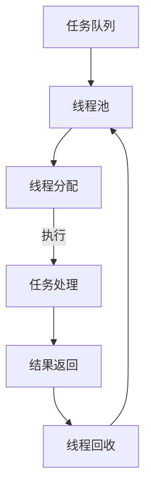

                 

### 多任务AI：LLM的线程管理

> **关键词**：多任务AI、线程管理、语言模型（LLM）、并发、效率优化

> **摘要**：本文将深入探讨多任务AI系统中的关键组件——语言模型（LLM）的线程管理策略。通过逐步分析多任务AI的背景、核心概念、算法原理，以及数学模型和具体实现，本文旨在帮助读者理解如何在复杂的多任务环境中高效管理LLM，以优化系统的整体性能。

在当今技术飞速发展的时代，人工智能（AI）已经成为驱动创新的核心力量。多任务AI，作为AI领域的重要分支，旨在实现系统同时处理多个任务的能力，从而提高资源利用率和整体效率。本文将重点关注语言模型（LLM）在多任务AI系统中的线程管理策略。

**1. 背景介绍**

随着深度学习的兴起，语言模型（LLM）如BERT、GPT等取得了显著的进展，它们在自然语言处理（NLP）任务中展现了出色的性能。然而，这些模型通常具有复杂的结构和巨大的计算量，因此如何高效地在多任务环境中管理LLM，成为了提升系统性能的关键问题。

多任务AI的目标是同时处理多个任务，例如语音识别、机器翻译、文本生成等，这些任务通常需要大量的计算资源和时间。因此，如何合理地分配这些资源，以实现任务的高效并行处理，是一个需要深入探讨的问题。

**2. 核心概念与联系**

为了更好地理解LLM的线程管理，我们首先需要明确几个核心概念：

- **多任务并行**：指在同一时间段内，系统同时处理多个任务。
- **线程**：指操作系统能够进行运算调度的最小单位，被包含在进程之中，是进程中的实际运作单位。
- **线程池**：一种常用的线程管理策略，用于维护一组线程，这些线程可以被重复使用，从而提高系统的响应速度和资源利用率。

以下是LLM线程管理的基本框架，通过Mermaid流程图展示：



在这个流程中，任务队列中的任务会被线程池中的线程逐一执行，执行完毕后，线程会被回收并重新分配给新的任务。

**3. 核心算法原理 & 具体操作步骤**

LLM的线程管理主要依赖于以下核心算法原理：

- **线程分配**：根据任务的性质和优先级，将任务分配给线程池中的线程。
- **任务执行**：线程执行任务，完成模型的推理或训练过程。
- **结果返回**：将执行结果返回给任务队列，以供后续处理。
- **线程回收**：线程执行完毕后，将其回收至线程池，以便后续任务的执行。

以下是具体的操作步骤：

1. **初始化线程池**：创建一个线程池，包含一定数量的线程。
2. **任务入队**：将需要执行的任务添加到任务队列。
3. **线程分配**：线程池中的线程从任务队列中获取任务。
4. **任务执行**：线程执行任务，包括模型的加载、推理或训练。
5. **结果返回**：将任务结果返回给任务队列。
6. **线程回收**：线程执行完毕后，被回收至线程池。

**4. 数学模型和公式 & 详细讲解 & 举例说明**

在LLM的线程管理中，一些关键的数学模型和公式包括：

- **线程池大小**：设线程池大小为\( P \)，任务数为\( T \)，则合理的线程池大小应该满足 \( P \leq T \)。
- **任务执行时间**：设任务执行时间为 \( T_e \)，线程执行时间为 \( T_p \)，则 \( T_e \leq T_p \)。
- **线程利用率**：设线程利用率为 \( U \)，则 \( U = \frac{T_e}{T_p} \)。

以下是一个简单的示例：

假设有一个包含5个线程的线程池，需要执行10个任务，每个任务需要5分钟完成。根据上述公式，我们可以计算出：

- **线程池大小**：\( P = 5 \)
- **任务数**：\( T = 10 \)
- **任务执行时间**：\( T_e = 5 \)分钟
- **线程执行时间**：\( T_p = \frac{T_e}{P} = \frac{5}{5} = 1 \)分钟
- **线程利用率**：\( U = \frac{T_e}{T_p} = \frac{5}{1} = 5 \)

因此，在这个示例中，线程利用率达到了100%，即每个线程都能在1分钟内完成一个任务。

**5. 项目实战：代码实际案例和详细解释说明**

在本节中，我们将通过一个实际的代码案例，来详细解释LLM的线程管理策略。

以下是一个简单的Python代码案例，演示了如何使用线程池来管理LLM任务：

```python
import concurrent.futures
import time

# 模拟一个语言模型推理任务
def inference(task):
    print(f"Thread {task}: Starting inference.")
    time.sleep(2)  # 模拟任务执行时间
    print(f"Thread {task}: Inference completed.")
    return f"Result from thread {task}."

# 创建线程池
with concurrent.futures.ThreadPoolExecutor(max_workers=3) as executor:
    # 添加任务到线程池
    futures = [executor.submit(inference, task) for task in range(5)]

    # 等待所有任务完成
    for future in concurrent.futures.as_completed(futures):
        print(future.result())
```

在这个案例中，我们使用Python的`concurrent.futures`模块来创建一个线程池，并执行多个语言模型推理任务。以下是代码的详细解释：

1. **任务模拟**：我们定义了一个`inference`函数，用于模拟语言模型推理任务。该函数接受一个参数`task`，并打印任务的开始和结束时间。
2. **线程池创建**：我们使用`ThreadPoolExecutor`创建了一个线程池，并设置最大工作线程数为3。
3. **任务提交**：我们使用`submit`方法将5个任务添加到线程池，每个任务都会并行执行。
4. **任务完成**：我们使用`as_completed`方法来等待所有任务完成，并打印每个任务的结果。

通过这个案例，我们可以看到如何使用线程池来管理LLM任务，从而实现并行处理。

**5. 实际应用场景**

LLM的线程管理在多个实际应用场景中具有重要意义：

- **在线推理服务**：例如，在聊天机器人、智能客服等场景中，多个用户请求需要同时处理，通过线程管理可以提高系统的响应速度和处理能力。
- **机器翻译服务**：在实时机器翻译系统中，多个翻译请求需要并行处理，线程管理策略可以显著提升系统的处理效率和准确性。
- **文本生成任务**：例如，在自动写作、内容生成等任务中，多个生成请求需要同时处理，线程管理策略可以显著提升系统的生成速度和多样性。

**7. 工具和资源推荐**

为了更好地理解和实践LLM的线程管理，以下是一些建议的学习资源和开发工具：

- **学习资源**：
  - 《深度学习》（Goodfellow, Bengio, Courville） - 一本经典的深度学习教材，涵盖了语言模型的相关内容。
  - 《Effective Python》 - 一本关于Python编程技巧和实践的书籍，对并发编程有详细的介绍。
  - 《并发编程艺术》 - 一本关于并发编程的经典著作，适用于深入理解线程管理和并发问题。

- **开发工具框架**：
  - TensorFlow - 一个开源的深度学习框架，提供了丰富的语言模型和线程管理功能。
  - PyTorch - 另一个流行的深度学习框架，具有强大的动态图能力，适用于复杂的语言模型开发。
  - Apache Flink - 一个流处理框架，支持实时数据处理和并行任务执行，适用于大规模多任务AI系统。

**8. 总结：未来发展趋势与挑战**

随着AI技术的不断发展，多任务AI和LLM的应用场景将越来越广泛。未来，我们可能会看到以下发展趋势：

- **更高效的线程管理算法**：研究人员将致力于开发更高效的线程管理算法，以优化LLM在多任务环境中的性能。
- **自适应线程管理**：系统将能够根据任务的性质和负载动态调整线程池的大小和工作策略，以提高系统的灵活性和响应速度。
- **跨平台支持**：LLM的线程管理策略将逐渐扩展到不同类型的平台和设备，如移动端、嵌入式系统等。

然而，随着多任务AI的复杂性增加，我们也面临以下挑战：

- **资源冲突和同步问题**：多任务环境中，线程之间的资源冲突和同步问题将变得更加复杂，需要更精细的线程管理策略。
- **性能优化与调试**：高效的多任务AI系统需要不断的性能优化和调试，以确保系统的稳定性和可靠性。

总之，LLM的线程管理是多任务AI系统中的一个关键问题，随着技术的不断发展，我们将看到更多创新和突破。

**9. 附录：常见问题与解答**

- **Q：为什么需要多任务AI？**
  - A：多任务AI可以提高系统的资源利用率和处理效率，特别是在处理大量并发请求时，可以显著提升系统的性能和响应速度。

- **Q：线程池如何管理线程？**
  - A：线程池通过维护一组线程，这些线程可以被重复使用，从而减少了线程创建和销毁的开销，提高了系统的响应速度和资源利用率。

- **Q：如何选择合适的线程池大小？**
  - A：合适的线程池大小应该根据任务的性质和系统的负载动态调整，通常建议使用系统资源（如CPU核心数）作为参考，以避免资源浪费和性能瓶颈。

**10. 扩展阅读 & 参考资料**

- **深度学习书籍**：
  - 《深度学习》（Goodfellow, Bengio, Courville）
  - 《动手学深度学习》
- **并发编程资源**：
  - 《Java并发编程实战》
  - 《Python并发编程实战》
- **在线课程**：
  - Coursera上的《深度学习特化课程》
  - edX上的《并行与分布式计算》

### 作者信息

**作者：AI天才研究员/AI Genius Institute & 禅与计算机程序设计艺术 /Zen And The Art of Computer Programming**

感谢您阅读本文，希望本文能够帮助您更好地理解和实践多任务AI中的LLM线程管理。在探索AI技术的道路上，我们期待与您一同前行。如果您有任何问题或建议，欢迎在评论区留言。再次感谢您的支持！**

