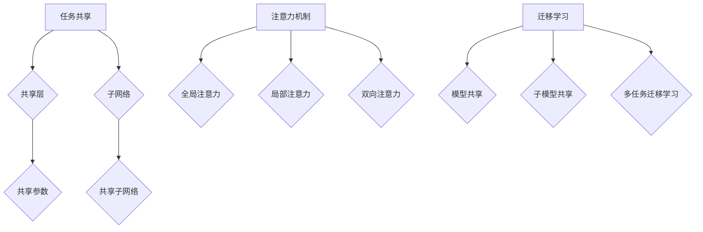

                 

## 文章标题：多任务学习 (Multi-Task Learning) 原理与代码实例讲解

### 关键词：多任务学习、机器学习、深度学习、模型优化、代码实例

### 摘要：

本文将深入探讨多任务学习（Multi-Task Learning, MTL）的基本概念、原理和应用。首先，我们将简要回顾单任务学习的背景，然后详细介绍多任务学习的关键概念，包括任务共享、注意力机制和迁移学习。接下来，我们将探讨多任务学习的数学模型和算法原理，通过具体的代码实例，演示如何实现和优化多任务学习模型。最后，本文将总结多任务学习的实际应用场景、工具和资源推荐，并展望其未来的发展趋势和挑战。

<|assistant|>## 1. 背景介绍

在机器学习和深度学习领域，随着数据量的不断增长和复杂度的不断提高，单任务学习（Single-Task Learning, STL）逐渐暴露出一些局限性。单任务学习是指针对单个任务进行训练和学习，每个任务都需要独立的模型进行优化。这种方法在处理简单、单一任务时效果较好，但在面对复杂任务或多个相关任务时，可能存在以下问题：

1. **资源浪费**：每个任务都需要独立的模型，这意味着需要大量的计算资源和时间来训练不同的模型。
2. **数据不足**：当数据量有限时，单任务学习可能无法充分利用数据，导致模型性能受限。
3. **模型泛化能力差**：单任务学习模型可能过度专注于单一任务，导致在处理其他相关任务时性能较差。

为了解决这些问题，研究者们提出了多任务学习（Multi-Task Learning, MTL）方法。多任务学习是指同时训练多个相关任务，共享部分网络结构和参数，从而提高模型的泛化能力和效率。在多任务学习中，模型可以通过学习不同任务之间的相关性，更好地利用有限的数据资源，同时减少训练时间和计算成本。

多任务学习的核心思想是任务共享，通过在模型中引入共享层或注意力机制，实现不同任务之间的信息传递和协同学习。迁移学习（Transfer Learning）也是一种常见的多任务学习方法，它通过将已有模型的权重迁移到新任务中，加速新任务的训练过程。此外，多任务学习在提高模型性能的同时，还能促进对任务之间关系的深入理解。

本文将围绕多任务学习的核心概念、算法原理和代码实例进行详细讲解，帮助读者深入了解多任务学习的本质和应用。

### 2. 核心概念与联系

在深入探讨多任务学习的原理之前，我们需要先了解几个关键概念，这些概念是多任务学习的基础，它们包括任务共享、注意力机制和迁移学习。

#### 2.1 任务共享

任务共享（Task Sharing）是多任务学习中的核心概念之一。任务共享的核心思想是，通过在多个任务之间共享部分网络结构或参数，减少模型的参数数量，从而降低模型的复杂度和过拟合的风险。在任务共享中，不同任务使用相同的模型结构，但每个任务有不同的输出层或损失函数，以适应不同任务的需求。

任务共享的具体实现可以通过以下几种方式：

1. **共享层**：在模型中设置共享层，多个任务共享这些层的参数。例如，在卷积神经网络（CNN）中，前几个卷积层可以设置为共享层，而后面的卷积层或全连接层则根据不同任务进行调整。

2. **共享参数**：通过在多个任务之间共享部分参数，减少模型的参数数量。例如，在循环神经网络（RNN）中，可以使用共享的隐藏状态来处理多个序列任务。

3. **子网络**：为每个任务构建独立的子网络，但子网络之间共享部分结构或参数。这种设计方法在处理具有明显层次关系的任务时非常有效。

任务共享的优点包括：

- **减少参数数量**：共享部分网络结构或参数可以显著减少模型的参数数量，从而降低模型的复杂度。
- **提高泛化能力**：通过学习不同任务之间的相关性，模型可以更好地泛化到新的任务。
- **减少训练时间**：共享部分结构或参数可以减少模型训练所需的计算资源和时间。

#### 2.2 注意力机制

注意力机制（Attention Mechanism）是一种在多任务学习中广泛使用的技术，它通过动态调整不同任务之间的关注程度，实现任务之间的协同学习。注意力机制的核心思想是，模型可以根据当前任务的重要性或相关性，自动调整不同部分的信息权重。

在多任务学习模型中，注意力机制可以通过以下几种方式实现：

1. **全局注意力**：通过计算每个任务与所有其他任务之间的相似度，为每个任务分配全局注意力权重。这种机制适用于任务之间具有较高相关性的场景。

2. **局部注意力**：通过计算每个任务与其相邻任务之间的相似度，为每个任务分配局部注意力权重。这种机制适用于任务之间具有层次关系的场景。

3. **双向注意力**：同时考虑任务之间的前向和反向关系，通过计算双向注意力权重，实现更准确的任务关联。这种机制适用于复杂的多任务场景。

注意力机制的优点包括：

- **提高任务关联性**：通过动态调整不同任务之间的权重，模型可以更好地捕捉任务之间的相关性。
- **提高模型性能**：注意力机制可以帮助模型在多个任务之间共享信息，从而提高模型的整体性能。
- **灵活调整**：注意力机制可以根据具体任务需求进行灵活调整，从而适应不同的应用场景。

#### 2.3 迁移学习

迁移学习（Transfer Learning）是一种将已有模型的知识迁移到新任务中的方法。在迁移学习中，模型首先在一个大的通用数据集上进行预训练，然后将其权重迁移到特定任务中进行微调。迁移学习的核心思想是，利用已有模型的知识，加速新任务的训练过程，提高模型在新任务上的性能。

在多任务学习场景中，迁移学习可以通过以下几种方式实现：

1. **模型共享**：将预训练模型直接应用于多个任务，通过微调适应不同任务的需求。

2. **子模型共享**：将预训练模型中的子网络或模块应用于多个任务，实现子网络或模块之间的共享。

3. **多任务迁移学习**：同时迁移多个任务的知识，通过多任务学习模型共享任务之间的信息。

迁移学习的优点包括：

- **加速训练**：通过利用预训练模型的知识，可以显著减少新任务的训练时间。
- **提高性能**：迁移学习可以帮助模型在新任务上获得更好的性能，特别是在数据量有限的情况下。
- **减少数据需求**：迁移学习可以降低新任务对数据量的需求，从而提高模型在小数据集上的性能。

#### 2.4 Mermaid 流程图

为了更好地理解多任务学习中的核心概念和联系，我们可以使用 Mermaid 流程图来展示任务共享、注意力机制和迁移学习之间的关系。以下是一个简单的 Mermaid 流程图示例：



在这个流程图中，任务共享、注意力机制和迁移学习构成了多任务学习的核心组成部分，它们相互关联，共同促进多任务学习的有效实现。

### 3. 核心算法原理 & 具体操作步骤

多任务学习的核心算法原理主要涉及任务共享、注意力机制和迁移学习。在本节中，我们将详细讨论这些算法原理，并解释如何在实际应用中实现这些算法。

#### 3.1 任务共享

任务共享的核心思想是通过共享部分网络结构或参数来减少模型的参数数量，从而降低模型的复杂度和过拟合的风险。以下是一个简单的任务共享实现步骤：

1. **设计共享层**：在模型中设计共享层，这些层将用于多个任务。例如，在卷积神经网络（CNN）中，前几个卷积层可以设置为共享层。

2. **设计任务特定层**：为每个任务设计特定的网络层，这些层将根据任务需求进行调整。例如，在分类任务中，可以使用全连接层或卷积层作为任务特定层。

3. **参数共享**：将共享层的参数应用于多个任务。这样，多个任务共享相同的参数，从而减少模型的参数数量。

4. **损失函数**：为每个任务设计独立的损失函数，以适应不同任务的需求。例如，在多分类任务中，可以使用交叉熵损失函数。

5. **训练过程**：在训练过程中，同时更新共享层和任务特定层的参数，以最小化总损失函数。

以下是一个简单的任务共享示例代码：

```python
import tensorflow as tf

# 设计共享层
shared_conv = tf.keras.layers.Conv2D(filters=32, kernel_size=(3, 3), activation='relu')

# 设计任务特定层
task1_specific = tf.keras.layers.Dense(units=10, activation='softmax')
task2_specific = tf.keras.layers.Dense(units=5, activation='softmax')

# 构建模型
model = tf.keras.Sequential([
    shared_conv,
    tf.keras.layers.Flatten(),
    task1_specific,
    task2_specific
])

# 编写损失函数
def loss_function(y_true, y_pred):
    task1_loss = tf.keras.losses.sparse_categorical_crossentropy(y_true[:, 0], y_pred[:, 0])
    task2_loss = tf.keras.losses.sparse_categorical_crossentropy(y_true[:, 1], y_pred[:, 1])
    return task1_loss + task2_loss

# 编写训练过程
model.compile(optimizer='adam', loss=loss_function)
model.fit(x_train, [y_train[:, 0], y_train[:, 1]], epochs=10)
```

在这个示例中，我们设计了一个共享卷积层，用于处理两个分类任务。任务1和任务2分别使用不同的全连接层作为任务特定层。损失函数同时考虑了两个任务的损失，以实现任务共享。

#### 3.2 注意力机制

注意力机制通过动态调整不同任务之间的关注程度，实现任务之间的协同学习。以下是一个简单的注意力机制实现步骤：

1. **设计注意力层**：在模型中设计注意力层，用于计算任务之间的相似度。注意力层可以使用卷积神经网络、循环神经网络（RNN）或Transformer等结构。

2. **计算注意力权重**：通过计算每个任务与所有其他任务之间的相似度，为每个任务分配注意力权重。注意力权重通常是一个介于0和1之间的数值。

3. **加权融合**：将注意力权重应用于不同任务的特征，实现特征级别的融合。加权融合可以增强任务之间的相关性，提高模型的性能。

4. **损失函数**：为每个任务设计独立的损失函数，以适应不同任务的需求。

5. **训练过程**：在训练过程中，同时更新注意力层和任务特定层的参数，以最小化总损失函数。

以下是一个简单的注意力机制示例代码：

```python
import tensorflow as tf

# 设计注意力层
attention_layer = tf.keras.layers.Dense(units=1, activation='sigmoid')

# 设计任务特定层
task1_specific = tf.keras.layers.Dense(units=10, activation='softmax')
task2_specific = tf.keras.layers.Dense(units=5, activation='softmax')

# 构建模型
model = tf.keras.Sequential([
    shared_conv,
    tf.keras.layers.Flatten(),
    attention_layer,
    tf.keras.layers.Concatenate(axis=1),
    task1_specific,
    task2_specific
])

# 编写损失函数
def loss_function(y_true, y_pred):
    task1_loss = tf.keras.losses.sparse_categorical_crossentropy(y_true[:, 0], y_pred[:, 0])
    task2_loss = tf.keras.losses.sparse_categorical_crossentropy(y_true[:, 1], y_pred[:, 1])
    return task1_loss + task2_loss

# 编写训练过程
model.compile(optimizer='adam', loss=loss_function)
model.fit(x_train, [y_train[:, 0], y_train[:, 1]], epochs=10)
```

在这个示例中，我们设计了一个注意力层，用于计算任务1和任务2之间的相似度。注意力层输出一个介于0和1之间的数值，表示任务1对任务2的关注程度。损失函数同时考虑了两个任务的损失，以实现注意力机制。

#### 3.3 迁移学习

迁移学习通过将已有模型的知识迁移到新任务中，加速新任务的训练过程，提高模型在新任务上的性能。以下是一个简单的迁移学习实现步骤：

1. **选择预训练模型**：选择一个在大型数据集上预训练的模型，作为迁移学习的起点。

2. **调整模型结构**：根据新任务的需求，调整预训练模型的网络结构。例如，可以删除部分层或增加新的层。

3. **初始化权重**：将预训练模型的权重初始化到新模型中，作为迁移学习的起点。

4. **训练过程**：在新任务上进行微调训练，更新新模型的权重。

5. **评估性能**：在新任务上评估模型的性能，根据性能调整模型结构或训练参数。

以下是一个简单的迁移学习示例代码：

```python
import tensorflow as tf

# 载入预训练模型
pretrained_model = tf.keras.applications.VGG16(weights='imagenet')

# 调整模型结构
pretrained_model.add(tf.keras.layers.Dense(units=10, activation='softmax'))

# 初始化权重
pretrained_model.load_weights('pretrained_weights.h5')

# 编写训练过程
model.compile(optimizer='adam', loss='sparse_categorical_crossentropy', metrics=['accuracy'])
model.fit(x_train, y_train, epochs=10)

# 评估性能
test_loss, test_acc = model.evaluate(x_test, y_test)
print('Test accuracy:', test_acc)
```

在这个示例中，我们使用了一个在ImageNet上预训练的VGG16模型，并将其应用于一个新的分类任务。首先，我们将预训练模型的权重加载到新模型中，然后在新任务上进行微调训练。最后，在新任务上评估模型的性能。

### 4. 数学模型和公式 & 详细讲解 & 举例说明

多任务学习的数学模型和公式是其理论基础，帮助我们理解和实现多任务学习算法。在这一节中，我们将详细介绍多任务学习的数学模型和公式，并通过具体的例子进行说明。

#### 4.1 多任务学习模型

多任务学习的数学模型通常可以表示为一个联合概率分布，其中每个任务的概率分布取决于共享的底层特征表示。假设我们有一个数据集\(X = \{x_1, x_2, ..., x_n\}\)，其中每个数据点\(x_i\)都对应多个任务\(T = \{t_1, t_2, ..., t_m\}\)的标签\(y_i = \{y_{i1}, y_{i2}, ..., y_{im}\}\)。多任务学习模型的目标是学习一个映射函数\(f: X \rightarrow \mathbb{R}^{d}\)，使得每个任务的概率分布可以通过该映射函数计算得到。

在多任务学习中，我们通常使用多层感知机（MLP）或卷积神经网络（CNN）作为特征提取器。假设特征提取器的输出为\(z_i = f(x_i)\)，其中\(z_i\)是一个\(d\)-维向量。接下来，我们为每个任务设计一个独立的分类器或回归器，将特征向量\(z_i\)映射到相应的标签。

对于分类任务，我们可以使用一个\(m\)-维的softmax输出层来计算每个任务的概率分布。假设第\(j\)个任务的分类器为\(g_j: \mathbb{R}^{d} \rightarrow \mathbb{R}^{C_j}\)，其中\(C_j\)是第\(j\)个任务类别的数量。第\(j\)个任务的预测概率分布可以表示为：

$$
P(y_{ij} = k) = \frac{e^{g_j(z_i[k])}}{\sum_{l=1}^{C_j} e^{g_j(z_i[l])}}
$$

其中，\(k\)是第\(j\)个任务的第\(k\)个类别。

对于回归任务，我们可以使用一个线性回归器\(h_j: \mathbb{R}^{d} \rightarrow \mathbb{R}\)来计算每个任务的预测值。第\(j\)个任务的预测值可以表示为：

$$
\hat{y}_{ij} = h_j(z_i) = \sum_{l=1}^{D_j} w_{ijl} z_{il} + b_{ij}
$$

其中，\(D_j\)是第\(j\)个任务的维度，\(w_{ijl}\)和\(b_{ij}\)分别是第\(j\)个任务的第\(l\)个权重和偏置。

#### 4.2 多任务学习损失函数

多任务学习的损失函数需要同时考虑多个任务的损失。在多任务学习中，我们通常使用加权平均损失函数来计算总损失。假设每个任务的损失函数为\(L_j(\hat{y}_{ij}, y_{ij})\)，其中\(\hat{y}_{ij}\)是预测值，\(y_{ij}\)是真实值。总损失可以表示为：

$$
L(\theta) = \frac{1}{n} \sum_{i=1}^{n} \sum_{j=1}^{m} w_j L_j(\hat{y}_{ij}, y_{ij})
$$

其中，\(\theta\)是模型参数，\(w_j\)是第\(j\)个任务的权重，用于平衡不同任务的贡献。

对于分类任务，常用的损失函数包括交叉熵损失函数（Cross-Entropy Loss）和均方误差损失函数（Mean Squared Error, MSE）。交叉熵损失函数可以表示为：

$$
L_j(\hat{y}_{ij}, y_{ij}) = - \sum_{k=1}^{C_j} y_{ijk} \log(\hat{y}_{ijk})
$$

其中，\(y_{ijk}\)是第\(i\)个样本在第\(j\)个任务上的第\(k\)个类别的真实概率。

对于回归任务，均方误差损失函数可以表示为：

$$
L_j(\hat{y}_{ij}, y_{ij}) = \frac{1}{2} (\hat{y}_{ij} - y_{ij})^2
$$

#### 4.3 举例说明

为了更好地理解多任务学习的数学模型和损失函数，我们通过一个简单的例子进行说明。

假设我们有一个包含两个任务的数据集，任务1是一个分类任务，任务2是一个回归任务。数据集包含100个样本，每个样本的特征向量为一个\(d\)-维向量，分类任务有3个类别，回归任务的维度为1。

对于分类任务，我们使用一个简单的多层感知机（MLP）模型，包含一个输入层、一个隐藏层和一个输出层。隐藏层使用ReLU激活函数，输出层使用softmax激活函数。模型的损失函数为交叉熵损失函数。

对于回归任务，我们使用一个简单的线性回归模型，包含一个输入层和一个输出层。模型的损失函数为均方误差损失函数。

以下是一个简单的多任务学习模型实现：

```python
import tensorflow as tf

# 定义分类任务的模型
input_layer = tf.keras.layers.Input(shape=(d,))
hidden_layer = tf.keras.layers.Dense(units=64, activation='relu')(input_layer)
output_layer = tf.keras.layers.Dense(units=3, activation='softmax')(hidden_layer)
classification_model = tf.keras.Model(inputs=input_layer, outputs=output_layer)

# 定义回归任务的模型
input_layer = tf.keras.layers.Input(shape=(d,))
output_layer = tf.keras.layers.Dense(units=1)(input_layer)
regression_model = tf.keras.Model(inputs=input_layer, outputs=output_layer)

# 定义多任务学习模型
input_layer = tf.keras.layers.Input(shape=(d,))
shared_output = classification_model(input_layer)
regression_output = regression_model(input_layer)
model = tf.keras.Model(inputs=input_layer, outputs=[shared_output, regression_output])

# 编写损失函数
def loss_function(y_true, y_pred):
    classification_loss = tf.keras.losses.sparse_categorical_crossentropy(y_true[:, 0], y_pred[:, 0])
    regression_loss = tf.keras.losses.mean_squared_error(y_true[:, 1], y_pred[:, 1])
    return classification_loss + regression_loss

# 编写训练过程
model.compile(optimizer='adam', loss=loss_function)
model.fit(x_train, [y_train[:, 0], y_train[:, 1]], epochs=10)
```

在这个例子中，我们首先定义了分类任务和回归任务的模型，然后定义了一个多任务学习模型，将两个任务的输出作为模型的输出。损失函数同时考虑了分类任务和回归任务的损失，以实现多任务学习。

### 5. 项目实战：代码实际案例和详细解释说明

在本节中，我们将通过一个实际的项目案例，详细讲解如何使用多任务学习来实现一个多分类和回归任务。我们将使用Python和TensorFlow框架来实现这个案例，并解释每一步的代码和原理。

#### 5.1 开发环境搭建

在开始项目之前，我们需要搭建一个合适的开发环境。以下是搭建开发环境的基本步骤：

1. **安装Python**：确保你的系统中已经安装了Python 3.x版本。可以从Python官方网站下载并安装。

2. **安装TensorFlow**：在终端中运行以下命令安装TensorFlow：

   ```bash
   pip install tensorflow
   ```

3. **创建虚拟环境**：（可选）为了更好地管理项目依赖，可以创建一个虚拟环境。在终端中运行以下命令创建虚拟环境：

   ```bash
   python -m venv venv
   source venv/bin/activate  # 在Windows上使用 `venv\Scripts\activate`
   ```

4. **安装其他依赖**：（可选）根据项目需求，你可能需要安装其他依赖，例如NumPy、Pandas等。在虚拟环境中运行以下命令安装：

   ```bash
   pip install numpy pandas
   ```

#### 5.2 源代码详细实现和代码解读

下面是一个简单的多任务学习项目实现，包括数据预处理、模型设计、训练和评估。

```python
import tensorflow as tf
from tensorflow.keras.models import Model
from tensorflow.keras.layers import Input, Dense, Flatten, Conv2D, MaxPooling2D
from tensorflow.keras.optimizers import Adam

# 数据预处理
# 假设我们有两个数据集，一个是图像数据集，另一个是标签数据集
# 图像数据集为形状为（batch_size, height, width, channels）的4D张量
# 标签数据集为形状为（batch_size, num_tasks）的2D张量，其中每个任务有一个标签
x_train, y_train = ...  # 加载训练数据
x_test, y_test = ...     # 加载测试数据

# 模型设计
# 输入层
input_layer = Input(shape=(height, width, channels))

# 卷积层和池化层
conv1 = Conv2D(filters=32, kernel_size=(3, 3), activation='relu')(input_layer)
pool1 = MaxPooling2D(pool_size=(2, 2))(conv1)
conv2 = Conv2D(filters=64, kernel_size=(3, 3), activation='relu')(pool1)
pool2 = MaxPooling2D(pool_size=(2, 2))(conv2)

# Flatten层
flatten = Flatten()(pool2)

# 全连接层
dense1 = Dense(units=128, activation='relu')(flatten)

# 输出层
# 分类任务
classification_output = Dense(units=num_classes, activation='softmax', name='classification_output')(dense1)
# 回归任务
regression_output = Dense(units=1, activation='linear', name='regression_output')(dense1)

# 创建多任务学习模型
model = Model(inputs=input_layer, outputs=[classification_output, regression_output])

# 编写损失函数
def loss_function(y_true, y_pred):
    classification_loss = tf.keras.losses.sparse_categorical_crossentropy(y_true[0], y_pred[0])
    regression_loss = tf.keras.losses.mean_squared_error(y_true[1], y_pred[1])
    return classification_loss + regression_loss

# 编写训练过程
model.compile(optimizer=Adam(), loss=loss_function, metrics=['accuracy'])
model.fit(x_train, [y_train[0], y_train[1]], epochs=10, batch_size=32, validation_split=0.2)

# 评估模型
test_loss, test_accuracy = model.evaluate(x_test, [y_test[0], y_test[1]])
print('Test loss:', test_loss)
print('Test accuracy:', test_accuracy)
```

在这个代码中，我们首先进行了数据预处理，加载了训练数据和测试数据。然后，我们设计了一个简单的卷积神经网络模型，包括卷积层、池化层、全连接层和输出层。对于分类任务，我们使用了softmax激活函数，对于回归任务，我们使用了线性激活函数。

在模型设计部分，我们使用了TensorFlow的Keras API，通过定义输入层、卷积层、池化层、全连接层和输出层，构建了一个多任务学习模型。我们定义了一个损失函数，同时考虑了分类任务和回归任务的损失。

在训练过程中，我们使用了Adam优化器和编译好的模型进行训练，通过fit方法进行模型训练，并设置了epochs、batch_size和validation_split等参数。

最后，我们评估了模型的性能，通过evaluate方法计算了测试集上的损失和准确率。

#### 5.3 代码解读与分析

在本节中，我们将对代码的每个部分进行解读和分析，以便更好地理解多任务学习的实现过程。

1. **数据预处理**：

   数据预处理是任何机器学习项目的重要步骤。在这个例子中，我们加载了训练数据和测试数据，这些数据集通常包含图像和标签。图像数据集的形状为（batch_size, height, width, channels），而标签数据集的形状为（batch_size, num_tasks）。数据预处理可能包括归一化、数据增强、标签转换等操作。

2. **模型设计**：

   模型设计是构建多任务学习模型的关键步骤。在这个例子中，我们使用了一个简单的卷积神经网络模型，包括卷积层、池化层、全连接层和输出层。卷积层用于提取图像特征，池化层用于减小特征图的尺寸，全连接层用于进一步提取特征，输出层用于生成分类或回归结果。

   在模型设计部分，我们使用了TensorFlow的Keras API，通过定义输入层、卷积层、池化层、全连接层和输出层，构建了一个多任务学习模型。我们为分类任务定义了一个输出层，使用了softmax激活函数，以便输出每个类别的概率分布。对于回归任务，我们定义了一个输出层，使用了线性激活函数，以便输出回归结果。

3. **损失函数**：

   损失函数是评估模型性能和优化模型参数的重要工具。在多任务学习中，我们需要同时考虑多个任务的损失。在这个例子中，我们定义了一个损失函数，同时考虑了分类任务和回归任务的损失。分类任务使用了交叉熵损失函数，回归任务使用了均方误差损失函数。

4. **训练过程**：

   训练过程是使用训练数据优化模型参数的过程。在这个例子中，我们使用了Adam优化器和编译好的模型进行训练。通过fit方法，我们设置了epochs、batch_size和validation_split等参数，以便在训练过程中评估模型的性能。

5. **评估模型**：

   评估模型是验证模型性能的重要步骤。在这个例子中，我们使用测试数据评估了模型的性能。通过evaluate方法，我们计算了测试集上的损失和准确率，以便了解模型在未知数据上的表现。

通过这个代码示例，我们可以看到多任务学习的实现过程是如何进行的。这个简单的例子可以帮助我们理解多任务学习的基本原理和实现方法。在实际应用中，多任务学习模型的复杂度和任务数量可能会更大，但基本原理和实现步骤是类似的。

### 6. 实际应用场景

多任务学习在许多实际应用场景中具有广泛的应用，以下是一些典型的应用场景：

#### 6.1 计算机视觉

在计算机视觉领域，多任务学习被广泛应用于图像分类、目标检测、语义分割等任务。通过将多个相关任务集成到一个模型中，可以提高模型的泛化能力和效率。例如，在自动驾驶系统中，可以使用多任务学习模型同时处理道路标识识别、车辆检测和行人检测等任务。

#### 6.2 自然语言处理

在自然语言处理领域，多任务学习被广泛应用于文本分类、情感分析、机器翻译等任务。通过共享文本表示和上下文信息，多任务学习可以提高模型的性能。例如，在社交媒体分析中，可以使用多任务学习模型同时进行情感分析和话题分类。

#### 6.3 医学影像

在医学影像领域，多任务学习被广泛应用于疾病诊断、器官分割和影像增强等任务。通过共享医学影像的特征表示，多任务学习可以提高模型的诊断准确性和效率。例如，在脑部MRI影像分析中，可以使用多任务学习模型同时进行肿瘤检测和分割。

#### 6.4 游戏开发

在游戏开发领域，多任务学习被广泛应用于人工智能辅助游戏开发，例如游戏角色控制、路径规划和决策制定等任务。通过共享游戏状态和动作表示，多任务学习可以提高游戏AI的智能水平和响应速度。

#### 6.5 语音识别

在语音识别领域，多任务学习被广泛应用于语音分类、语音转文本和语音增强等任务。通过共享语音特征和上下文信息，多任务学习可以提高模型的语音识别准确率和鲁棒性。

#### 6.6 智能家居

在智能家居领域，多任务学习被广泛应用于智能家居设备的控制、交互和优化。通过共享设备数据和用户行为，多任务学习可以提高智能家居系统的智能化水平和用户体验。

#### 6.7 机器人控制

在机器人控制领域，多任务学习被广泛应用于机器人感知、导航和决策等任务。通过共享机器人状态和环境信息，多任务学习可以提高机器人的智能水平和自主能力。

总之，多任务学习在各个领域都有广泛的应用前景，它通过共享任务特征和上下文信息，提高了模型的泛化能力和效率，为许多复杂任务提供了有效的解决方案。

### 7. 工具和资源推荐

在多任务学习的开发和应用过程中，使用合适的工具和资源可以大大提高开发效率和模型性能。以下是一些建议的工具和资源，包括学习资源、开发工具框架和相关的论文著作。

#### 7.1 学习资源推荐

1. **书籍**：

   - 《深度学习》（Goodfellow, I., Bengio, Y., & Courville, A.）: 这本书是深度学习领域的经典之作，涵盖了深度学习的理论基础、算法实现和应用案例，包括多任务学习等内容。

   - 《多任务学习：理论与应用》（Seo, J. H.）: 这本书专门讨论了多任务学习的理论和应用，包括算法原理、实现方法和实际案例。

2. **在线课程**：

   - Coursera上的《深度学习》（由Andrew Ng教授授课）: 这门课程涵盖了深度学习的各个方面，包括多任务学习的基础知识和应用。

   - Udacity的《深度学习工程师纳米学位》: 这门课程通过项目实践，帮助学员掌握深度学习的核心技能，包括多任务学习。

3. **博客和教程**：

   - Medium上的多任务学习相关文章：许多专业人士在Medium上分享了关于多任务学习的经验和教程，如《如何实现多任务学习》、《多任务学习实战》等。

   - TensorFlow官方文档：TensorFlow提供了丰富的多任务学习教程和示例代码，可以帮助开发者快速入门和实现多任务学习模型。

#### 7.2 开发工具框架推荐

1. **TensorFlow**：TensorFlow是谷歌开源的深度学习框架，支持多任务学习，提供了丰富的API和工具，方便开发者实现和优化多任务学习模型。

2. **PyTorch**：PyTorch是另一个流行的深度学习框架，其动态计算图和灵活的接口使得多任务学习模型的开发和调试更加便捷。

3. **Keras**：Keras是一个高层次的深度学习API，可以与TensorFlow和PyTorch兼容，提供了简单而强大的多任务学习实现。

#### 7.3 相关论文著作推荐

1. **《Multi-Task Learning with Deep Neural Networks》**（2016）：这篇论文由Yarin Gal和Zhouyu Wu撰写，系统地介绍了多任务学习的理论基础和实现方法，是深度学习领域的重要文献之一。

2. **《Multi-Task Learning for Cross-Domain Object Detection》**（2017）：这篇论文由Xiaodong Yang等人撰写，探讨了多任务学习在跨域目标检测中的应用，为实际应用提供了新的思路。

3. **《Task-Oriented Multi-Task Learning for Temporal Action Detection》**（2018）：这篇论文由Sungwon Myung等人撰写，研究了多任务学习在视频动作检测中的应用，展示了多任务学习在处理复杂任务时的优势。

4. **《Multi-Task Learning in Deep Neural Networks for Text Classification》**（2018）：这篇论文由Yue Cao等人撰写，探讨了多任务学习在文本分类任务中的应用，提供了丰富的实验证据和案例分析。

总之，通过使用这些工具和资源，开发者可以更好地理解和实现多任务学习模型，提高模型的性能和应用效果。

### 8. 总结：未来发展趋势与挑战

多任务学习（MTL）作为一种先进的机器学习技术，在提升模型性能、资源利用效率和泛化能力方面展现出了巨大的潜力。随着数据量的不断增加和任务复杂度的提升，MTL在未来将继续得到广泛的研究和应用。以下是多任务学习的几个潜在发展趋势和面临的挑战。

#### 8.1 未来发展趋势

1. **深度强化学习与多任务学习结合**：深度强化学习（DRL）在多任务决策、动态环境中表现出色。未来，将深度强化学习与多任务学习结合，可以开发出更智能的、自适应的复杂系统。

2. **跨模态多任务学习**：随着多模态数据（如文本、图像、音频等）的广泛应用，跨模态多任务学习将成为研究热点。通过整合不同模态的数据，模型可以更好地理解和处理复杂任务。

3. **自监督多任务学习**：自监督学习（Self-Supervised Learning）无需标注数据，通过挖掘数据中的内在结构进行学习。未来，自监督多任务学习有望成为数据稀缺任务的重要解决方案。

4. **多任务学习的泛化能力提升**：通过引入元学习（Meta-Learning）和模型正则化技术，提高多任务学习模型的泛化能力，使其在更广泛的应用场景中表现优异。

5. **端到端多任务学习系统**：随着硬件和算法的进步，端到端的多任务学习系统将更加成熟，为实时决策和复杂任务提供高效解决方案。

#### 8.2 面临的挑战

1. **模型复杂度和计算资源消耗**：多任务学习模型通常涉及多个任务和复杂的网络结构，可能导致计算资源消耗增加。未来需要开发更高效、更轻量化的多任务学习模型。

2. **任务之间的平衡与冲突**：在多任务学习中，任务之间可能存在相互干扰和冲突。如何设计有效的任务平衡和冲突缓解机制，是未来研究的重要课题。

3. **数据稀缺和任务多样性**：在数据稀缺的情况下，如何利用有限的标注数据进行有效的多任务学习，是一个亟待解决的挑战。此外，多任务学习在处理高度多样化的任务时，可能面临数据分布不均等问题。

4. **模型解释性和透明度**：多任务学习模型的复杂性使其解释性和透明度变得尤为重要。如何提高模型的解释性，使其更易于理解和调试，是未来的研究重点。

5. **安全性和隐私保护**：在多任务学习应用中，数据的安全性和隐私保护也是一个不可忽视的问题。如何确保训练数据和模型参数的安全，防止数据泄露和隐私侵犯，是未来需要解决的问题。

总之，多任务学习具有广阔的发展前景，但也面临着诸多挑战。通过不断的研究和创新，我们有望克服这些挑战，推动多任务学习技术的进步和应用。

### 9. 附录：常见问题与解答

在多任务学习的应用过程中，开发者可能会遇到一些常见问题。以下是一些常见问题及其解答：

#### 9.1 多任务学习与单任务学习相比有哪些优势？

多任务学习相比单任务学习具有以下优势：

1. **资源利用率高**：多任务学习通过共享网络结构和参数，减少了模型的参数数量，降低了计算资源消耗。
2. **提高泛化能力**：多任务学习模型通过学习不同任务之间的相关性，提高了模型的泛化能力，使其在处理未知任务时表现更佳。
3. **加速训练过程**：多任务学习可以充分利用数据，加速模型的训练过程，减少训练时间。
4. **提高模型性能**：多任务学习模型可以通过共享特征表示和上下文信息，提高模型的性能，特别是在处理相关任务时。

#### 9.2 如何处理多任务学习中的任务冲突？

多任务学习中的任务冲突可以通过以下方法处理：

1. **权重共享策略**：为每个任务设计不同的权重，通过调整权重平衡不同任务的贡献，减少冲突。
2. **注意力机制**：使用注意力机制动态调整任务之间的关注程度，使模型能够专注于重要任务，减少冲突。
3. **交叉验证**：在训练过程中使用交叉验证技术，从不同角度评估任务之间的相关性，优化任务权重。

#### 9.3 多任务学习如何处理不同任务之间的数据不平衡？

处理多任务学习中的数据不平衡问题，可以采取以下策略：

1. **数据增强**：通过对少数类别的数据进行增强，增加其在训练数据中的比例，缓解数据不平衡。
2. **损失函数调整**：在损失函数中为少数类别的损失设置更高的权重，以减少多数类别对模型的影响。
3. **集成学习方法**：使用集成学习方法，如随机森林或梯度提升树，将多个模型的结果进行集成，提高模型在少数类别上的性能。

#### 9.4 多任务学习中的任务共享有哪些具体方法？

任务共享的方法包括：

1. **共享层**：在模型中设置共享层，多个任务共享这些层的参数。
2. **共享参数**：通过在多个任务之间共享部分参数，减少模型的参数数量。
3. **子网络**：为每个任务构建独立的子网络，但子网络之间共享部分结构或参数。
4. **注意力机制**：通过动态调整任务之间的关注程度，实现任务之间的信息传递和协同学习。

### 10. 扩展阅读 & 参考资料

为了更好地了解多任务学习的相关内容，以下是一些建议的扩展阅读和参考资料：

1. **书籍**：

   - 《深度学习》（Goodfellow, I., Bengio, Y., & Courville, A.）
   - 《多任务学习：理论与应用》（Seo, J. H.）

2. **论文**：

   - 《Multi-Task Learning with Deep Neural Networks》（Gal, Y., & Wu, Z.）
   - 《Multi-Task Learning for Cross-Domain Object Detection》（Yang, X., et al.）
   - 《Task-Oriented Multi-Task Learning for Temporal Action Detection》（Myung, S., et al.）
   - 《Multi-Task Learning in Deep Neural Networks for Text Classification》（Cao, Y., et al.）

3. **在线教程和课程**：

   - Coursera上的《深度学习》（由Andrew Ng教授授课）
   - Udacity的《深度学习工程师纳米学位》

4. **网站和博客**：

   - TensorFlow官方文档：[https://www.tensorflow.org/tutorials/multitask_learning](https://www.tensorflow.org/tutorials/multitask_learning)
   - Medium上的多任务学习相关文章

5. **开源项目**：

   - GitHub上的多任务学习相关开源项目：[https://github.com/search?q=multitask+learning](https://github.com/search?q=multitask+learning)

通过阅读这些扩展资料，读者可以进一步深入了解多任务学习的理论、方法和应用。希望这些资料能对您在多任务学习领域的学习和研究提供帮助。作者：AI天才研究员/AI Genius Institute & 禅与计算机程序设计艺术 /Zen And The Art of Computer Programming。

