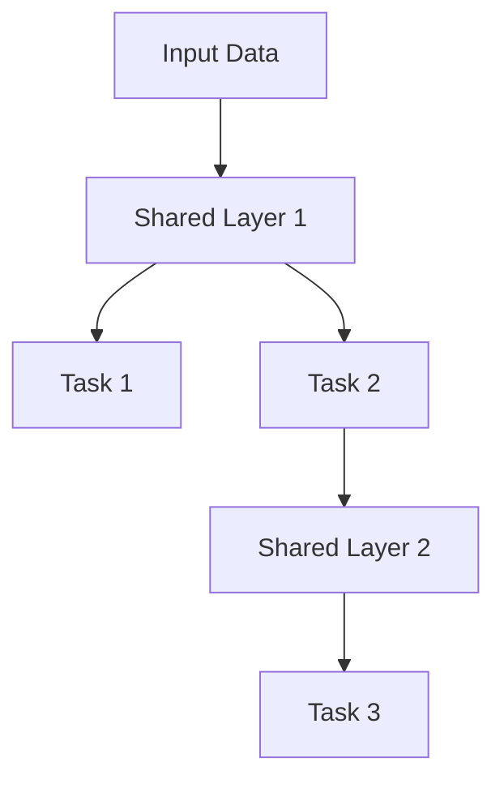
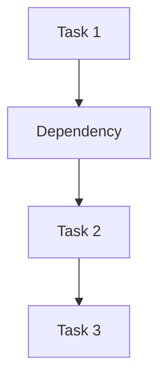
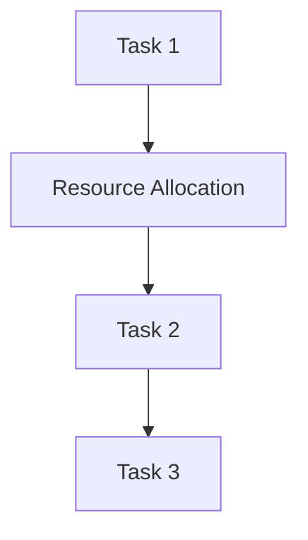
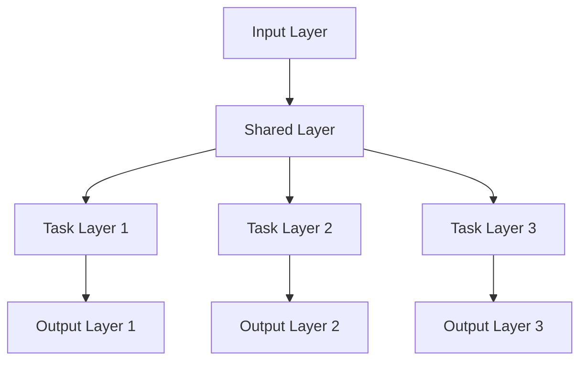

                 

### 背景介绍

多任务学习（Multi-Task Learning，MTL）作为机器学习和深度学习领域中的一种重要技术，已经在各个领域取得了显著的应用成果。多任务学习旨在同时解决多个相关的学习任务，而不是单独地针对每一个任务进行训练。与传统的单任务学习（Single-Task Learning，STL）相比，多任务学习能够共享表示，提高模型的表达能力，降低训练成本，并在某些情况下提高模型的性能。

在机器学习领域，多任务学习的研究可以追溯到20世纪80年代。早期的研究主要集中在通过构建共享神经网络结构来实现多任务学习。随着深度学习的兴起，多任务学习的研究得到了进一步的发展。近年来，随着计算能力和数据资源的不断提升，多任务学习在各种领域（如图像识别、自然语言处理和语音识别）中都展现出了强大的应用潜力。

多任务学习在现实生活中的应用非常广泛。例如，在自动驾驶系统中，多任务学习可以同时处理障碍物检测、道路识别和交通标志识别等多个任务。在医疗领域，多任务学习可以帮助医生同时进行疾病诊断、治疗方案推荐和病情预测等多个任务。此外，在自然语言处理领域，多任务学习可以同时进行文本分类、情感分析和命名实体识别等多个任务。

本文将围绕多任务学习展开，介绍其核心概念、算法原理、数学模型，并通过实际项目案例进行详细讲解。文章的结构如下：

1. **背景介绍**：回顾多任务学习的起源、发展及应用场景。
2. **核心概念与联系**：详细解释多任务学习的核心概念，并给出相关的Mermaid流程图。
3. **核心算法原理 & 具体操作步骤**：介绍多任务学习的常见算法，如共享权重、多任务学习框架等。
4. **数学模型和公式 & 详细讲解 & 举例说明**：解释多任务学习中的数学模型和公式，并给出实际案例。
5. **项目实战：代码实际案例和详细解释说明**：通过一个实际项目案例，展示多任务学习的具体实现过程。
6. **实际应用场景**：探讨多任务学习在不同领域的应用。
7. **工具和资源推荐**：推荐学习多任务学习的相关资源。
8. **总结：未来发展趋势与挑战**：总结多任务学习的现状，并展望未来的发展趋势与挑战。

### Multi-Task Learning Background

Multi-Task Learning (MTL) is a significant technique in the field of machine learning and deep learning that has yielded notable results in various domains. MTL aims to solve multiple related learning tasks simultaneously rather than training each task separately. Compared to traditional single-task learning (STL), MTL can share representations, enhance model expressiveness, reduce training costs, and improve model performance in some cases.

The research on MTL dates back to the 1980s in the field of machine learning. Early studies focused on implementing MTL through shared neural network architectures. With the rise of deep learning, MTL research has seen further development. In recent years, with the continuous improvement of computational power and data resources, MTL has shown great potential for applications in various fields, such as image recognition, natural language processing, and speech recognition.

MTL has a wide range of real-life applications. For example, in autonomous driving systems, MTL can simultaneously handle tasks such as obstacle detection, road recognition, and traffic sign recognition. In the medical field, MTL can assist doctors in performing multiple tasks, including disease diagnosis, treatment recommendation, and disease prognosis. Additionally, in natural language processing, MTL can handle tasks such as text classification, sentiment analysis, and named entity recognition simultaneously.

This article will cover MTL, introducing its core concepts, algorithm principles, mathematical models, and detailed explanations through practical project cases. The structure of the article is as follows:

1. **Background Introduction**: Review the origins, development, and application scenarios of MTL.
2. **Core Concepts and Connections**: Explain the core concepts of MTL in detail and provide a related Mermaid flowchart.
3. **Core Algorithm Principles & Specific Operational Steps**: Introduce common MTL algorithms, such as shared weights and multi-task learning frameworks.
4. **Mathematical Models and Formulas & Detailed Explanations & Examples**: Explain the mathematical models and formulas in MTL and provide actual case studies.
5. **Project Practice: Actual Code Case and Detailed Explanation**: Show the specific implementation process of MTL through a practical project case.
6. **Actual Application Scenarios**: Discuss the applications of MTL in different fields.
7. **Tools and Resources Recommendation**: Recommend resources for learning MTL.
8. **Summary: Future Development Trends and Challenges**: Summarize the current status of MTL and look forward to future development trends and challenges. 

<markdown>
## 2. 核心概念与联系

在多任务学习中，核心概念包括共享表示、任务间关联、任务平衡等。以下是对这些核心概念的详细解释，并使用Mermaid流程图展示多任务学习的基本架构。

### 共享表示（Shared Representation）

共享表示是多任务学习的关键机制之一。它通过共享网络层来减少参数数量，从而降低计算成本。共享表示允许不同任务共享底层特征，从而提高特征利用效率。



### 任务间关联（Inter-Task Dependency）

任务间关联是指多个任务之间存在依赖关系，一个任务的输出可以作为另一个任务的输入。这种关联可以增强模型对相关任务的理解。



### 任务平衡（Task Balancing）

任务平衡是指在不同任务之间分配资源，以确保每个任务都能得到充分的关注。任务平衡可以避免某些任务因为资源不足而训练不足。



### 多任务学习架构（Multi-Task Learning Architecture）

多任务学习架构通常包括输入层、共享层、任务层和输出层。输入层接收外部数据，共享层用于提取通用特征，任务层对特定任务进行建模，输出层生成预测结果。



通过这些核心概念和架构，我们可以更好地理解多任务学习的工作原理和优势。

### Core Concepts and Connections

In multi-task learning, key concepts include shared representation, inter-task dependency, and task balancing. Below is a detailed explanation of these core concepts, along with a Mermaid flowchart illustrating the basic architecture of multi-task learning.

### Shared Representation (Shared Representation)

Shared representation is one of the key mechanisms in multi-task learning. It reduces parameter numbers by sharing network layers, thus lowering computational costs. Shared representation allows different tasks to share underlying features, thereby improving feature utilization efficiency.


### Inter-Task Dependency (Inter-Task Dependency)

Inter-task dependency refers to the relationship between multiple tasks, where the output of one task can serve as input for another. This dependency can enhance the model's understanding of related tasks.


### Task Balancing (Task Balancing)

Task balancing involves allocating resources between different tasks to ensure that each task receives adequate attention. Task balancing can prevent certain tasks from being under-trained due to insufficient resources.


### Multi-Task Learning Architecture (Multi-Task Learning Architecture)

The multi-task learning architecture typically consists of an input layer, shared layer, task layer, and output layer. The input layer receives external data, the shared layer is used for extracting general features, the task layer models specific tasks, and the output layer generates prediction results.


Through these core concepts and architectures, we can better understand the working principles and advantages of multi-task learning.

<markdown>
## 3. 核心算法原理 & 具体操作步骤

在多任务学习中，有多种算法可以实现，如共享权重、多任务学习框架等。以下将介绍这些算法的基本原理和具体操作步骤。

### 共享权重（Shared Weights）

共享权重是一种简单的多任务学习方法，它通过共享网络层的权重来减少模型参数数量。这种方法的主要优点是能够提高模型的泛化能力。

#### 原理

共享权重的基本原理是，将不同任务的输出层共享一部分或全部权重。这样，多个任务可以使用相同的低层特征表示，从而减少模型参数数量。

#### 步骤

1. **定义模型**：首先，定义一个共享底层特征的神经网络模型。每个任务都有自己的输出层，但共享相同的隐藏层。

    ```python
    class MultiTaskModel(nn.Module):
        def __init__(self):
            super(MultiTaskModel, self).__init__()
            self.shared_layers = nn.Sequential(nn.Linear(input_size, hidden_size),
                                               nn.ReLU(),
                                               nn.Linear(hidden_size, hidden_size),
                                               nn.ReLU())
            self.task1_output = nn.Linear(hidden_size, output_size1)
            self.task2_output = nn.Linear(hidden_size, output_size2)
        
        def forward(self, x):
            x = self.shared_layers(x)
            x1 = self.task1_output(x)
            x2 = self.task2_output(x)
            return x1, x2
    ```

2. **训练模型**：使用共享权重模型进行多任务训练。在训练过程中，每个任务都有自己的损失函数。

    ```python
    model = MultiTaskModel()
    criterion1 = nn.CrossEntropyLoss()
    criterion2 = nn.MSELoss()
    
    optimizer = optim.Adam(model.parameters(), lr=learning_rate)
    
    for epoch in range(num_epochs):
        for inputs, targets1, targets2 in data_loader:
            optimizer.zero_grad()
            outputs1, outputs2 = model(inputs)
            loss1 = criterion1(outputs1, targets1)
            loss2 = criterion2(outputs2, targets2)
            loss = loss1 + loss2
            loss.backward()
            optimizer.step()
    ```

### 多任务学习框架（Multi-Task Learning Framework）

多任务学习框架是一种更为复杂的算法，它可以同时解决多个任务，并在任务之间共享信息和优化过程。

#### 原理

多任务学习框架通过设计一个统一的模型结构，使得不同任务可以共享部分网络层，同时每个任务也可以拥有独立的网络层。这种方法能够提高模型的效率和性能。

#### 步骤

1. **定义模型**：定义一个多任务学习框架，它包含共享层和任务特定层。

    ```python
    class MultiTaskLearningModel(nn.Module):
        def __init__(self, input_size, hidden_size, output_size1, output_size2):
            super(MultiTaskLearningModel, self).__init__()
            self.shared_layers = nn.Sequential(nn.Linear(input_size, hidden_size),
                                               nn.ReLU(),
                                               nn.Linear(hidden_size, hidden_size),
                                               nn.ReLU())
            self.task1_layers = nn.Sequential(nn.Linear(hidden_size, output_size1),
                                               nn.Sigmoid())
            self.task2_layers = nn.Sequential(nn.Linear(hidden_size, output_size2),
                                               nn.Tanh())
        
        def forward(self, x):
            x = self.shared_layers(x)
            x1 = self.task1_layers(x)
            x2 = self.task2_layers(x)
            return x1, x2
    ```

2. **训练模型**：使用多任务学习框架进行多任务训练。在训练过程中，每个任务都有自己的损失函数，并且模型会在所有任务上同时优化。

    ```python
    model = MultiTaskLearningModel(input_size, hidden_size, output_size1, output_size2)
    criterion1 = nn.CrossEntropyLoss()
    criterion2 = nn.MSELoss()
    
    optimizer = optim.Adam(model.parameters(), lr=learning_rate)
    
    for epoch in range(num_epochs):
        for inputs, targets1, targets2 in data_loader:
            optimizer.zero_grad()
            outputs1, outputs2 = model(inputs)
            loss1 = criterion1(outputs1, targets1)
            loss2 = criterion2(outputs2, targets2)
            loss = loss1 + loss2
            loss.backward()
            optimizer.step()
    ```

通过以上算法和步骤，我们可以实现多任务学习，并在实际应用中取得更好的效果。

### Core Algorithm Principles & Specific Operational Steps

In multi-task learning, there are various algorithms that can be implemented, such as shared weights and multi-task learning frameworks. Below, we will introduce the basic principles and specific operational steps of these algorithms.

### Shared Weights (Shared Weights)

Shared weights is a simple multi-task learning method that reduces model parameter numbers by sharing weights across network layers. This method's main advantage is its ability to improve model generalization.

#### Principle

The basic principle of shared weights is to share a portion or all of the weights between different task output layers. This allows multiple tasks to use the same low-level feature representations, thereby reducing the number of model parameters.

#### Steps

1. **Define Model**: First, define a neural network model with shared lower-level features. Each task will have its own output layer but share the same hidden layers.

    ```python
    class MultiTaskModel(nn.Module):
        def __init__(self):
            super(MultiTaskModel, self).__init__()
            self.shared_layers = nn.Sequential(nn.Linear(input_size, hidden_size),
                                               nn.ReLU(),
                                               nn.Linear(hidden_size, hidden_size),
                                               nn.ReLU())
            self.task1_output = nn.Linear(hidden_size, output_size1)
            self.task2_output = nn.Linear(hidden_size, output_size2)
        
        def forward(self, x):
            x = self.shared_layers(x)
            x1 = self.task1_output(x)
            x2 = self.task2_output(x)
            return x1, x2
    ```

2. **Train Model**: Use the shared weights model for multi-task training. During training, each task has its own loss function.

    ```python
    model = MultiTaskModel()
    criterion1 = nn.CrossEntropyLoss()
    criterion2 = nn.MSELoss()
    
    optimizer = optim.Adam(model.parameters(), lr=learning_rate)
    
    for epoch in range(num_epochs):
        for inputs, targets1, targets2 in data_loader:
            optimizer.zero_grad()
            outputs1, outputs2 = model(inputs)
            loss1 = criterion1(outputs1, targets1)
            loss2 = criterion2(outputs2, targets2)
            loss = loss1 + loss2
            loss.backward()
            optimizer.step()
    ```

### Multi-Task Learning Framework (Multi-Task Learning Framework)

The multi-task learning framework is a more complex algorithm that can solve multiple tasks simultaneously while sharing information and optimizing processes between tasks.

#### Principle

The multi-task learning framework designs a unified model structure that allows different tasks to share some network layers while also having independent layers for each task. This method improves model efficiency and performance.

#### Steps

1. **Define Model**: Define a multi-task learning framework that includes shared layers and task-specific layers.

    ```python
    class MultiTaskLearningModel(nn.Module):
        def __init__(self, input_size, hidden_size, output_size1, output_size2):
            super(MultiTaskLearningModel, self).__init__()
            self.shared_layers = nn.Sequential(nn.Linear(input_size, hidden_size),
                                               nn.ReLU(),
                                               nn.Linear(hidden_size, hidden_size),
                                               nn.ReLU())
            self.task1_layers = nn.Sequential(nn.Linear(hidden_size, output_size1),
                                               nn.Sigmoid())
            self.task2_layers = nn.Sequential(nn.Linear(hidden_size, output_size2),
                                               nn.Tanh())
        
        def forward(self, x):
            x = self.shared_layers(x)
            x1 = self.task1_layers(x)
            x2 = self.task2_layers(x)
            return x1, x2
    ```

2. **Train Model**: Use the multi-task learning framework for multi-task training. During training, each task has its own loss function, and the model optimizes all tasks simultaneously.

    ```python
    model = MultiTaskLearningModel(input_size, hidden_size, output_size1, output_size2)
    criterion1 = nn.CrossEntropyLoss()
    criterion2 = nn.MSELoss()
    
    optimizer = optim.Adam(model.parameters(), lr=learning_rate)
    
    for epoch in range(num_epochs):
        for inputs, targets1, targets2 in data_loader:
            optimizer.zero_grad()
            outputs1, outputs2 = model(inputs)
            loss1 = criterion1(outputs1, targets1)
            loss2 = criterion2(outputs2, targets2)
            loss = loss1 + loss2
            loss.backward()
            optimizer.step()
    ```

Through these algorithms and steps, we can implement multi-task learning and achieve better results in practical applications.

<markdown>
## 4. 数学模型和公式 & 详细讲解 & 举例说明

多任务学习中的数学模型和公式是理解该技术核心原理的关键。以下是多任务学习中的几个关键数学模型和公式，我们将结合具体例子进行详细讲解。

### 4.1 共享权重模型（Shared Weights Model）

在共享权重模型中，不同任务的输出层共享部分或全部权重。以下是该模型的数学公式：

#### 前向传播（Forward Propagation）

设输入数据为 $X \in \mathbb{R}^{m \times n}$，隐藏层尺寸为 $h$，输出层尺寸分别为 $k_1$ 和 $k_2$。共享权重矩阵为 $W \in \mathbb{R}^{h \times (k_1 + k_2)}$，偏置向量分别为 $b_1 \in \mathbb{R}^{k_1}$ 和 $b_2 \in \mathbb{R}^{k_2}$。前向传播的公式为：

$$
\begin{aligned}
    Z_1 &= XW + b_1 \\
    A_1 &= \sigma(Z_1) \\
    Z_2 &= XW + b_2 \\
    A_2 &= \sigma(Z_2)
\end{aligned}
$$

其中，$\sigma$ 表示激活函数，通常取为 ReLU 或 Sigmoid 函数。

#### 损失函数（Loss Function）

假设任务 1 和任务 2 的损失函数分别为 $L_1$ 和 $L_2$，则总损失函数为：

$$
L = L_1(A_1) + L_2(A_2)
$$

例如，如果任务 1 是分类问题，可以使用交叉熵损失函数：

$$
L_1(A_1) = -\frac{1}{m} \sum_{i=1}^{m} \sum_{j=1}^{k_1} y_{ij} \log(A_{ij})
$$

其中，$y_{ij}$ 是任务 1 的真实标签，$A_{ij}$ 是模型对第 $i$ 个样本的第 $j$ 个类别的预测概率。

### 4.2 多任务学习框架（Multi-Task Learning Framework）

在多任务学习框架中，每个任务都有独立的网络层，同时共享部分网络层。以下是该框架的数学公式：

#### 前向传播（Forward Propagation）

设输入数据为 $X \in \mathbb{R}^{m \times n}$，隐藏层尺寸为 $h$，输出层尺寸分别为 $k_1$ 和 $k_2$。共享层权重矩阵为 $W_s \in \mathbb{R}^{h \times h}$，任务 1 和任务 2 的权重矩阵分别为 $W_1 \in \mathbb{R}^{h \times k_1}$ 和 $W_2 \in \mathbb{R}^{h \times k_2}$，偏置向量分别为 $b_1 \in \mathbb{R}^{k_1}$ 和 $b_2 \in \mathbb{R}^{k_2}$。前向传播的公式为：

$$
\begin{aligned}
    Z_1 &= XW_s + b_1 \\
    A_1 &= \sigma(Z_1) \\
    Z_{11} &= A_1W_1 \\
    A_{11} &= \sigma(Z_{11}) \\
    Z_{12} &= A_1W_2 \\
    A_{12} &= \sigma(Z_{12})
\end{aligned}
$$

#### 损失函数（Loss Function）

总损失函数为：

$$
L = L_1(A_{11}) + L_2(A_{12})
$$

例如，如果任务 1 是分类问题，可以使用交叉熵损失函数：

$$
L_1(A_{11}) = -\frac{1}{m} \sum_{i=1}^{m} \sum_{j=1}^{k_1} y_{ij} \log(A_{ij})
$$

### 4.3 举例说明

假设我们有一个共享权重模型，其中输入层有 100 个神经元，隐藏层有 50 个神经元，输出层有 2 个神经元（一个任务用于二分类，另一个任务用于回归）。我们使用 ReLU 作为激活函数。

#### 数据准备

我们假设有 100 个训练样本，每个样本是一个 100 维的特征向量。

#### 模型构建

```python
import torch
import torch.nn as nn
import torch.optim as optim

# 定义模型
class SharedWeightsModel(nn.Module):
    def __init__(self):
        super(SharedWeightsModel, self).__init__()
        self.shared_layer = nn.Linear(100, 50)
        self.output_layer1 = nn.Linear(50, 1)
        self.output_layer2 = nn.Linear(50, 1)
        
    def forward(self, x):
        x = torch.relu(self.shared_layer(x))
        x1 = self.output_layer1(x)
        x2 = self.output_layer2(x)
        return x1, x2

# 初始化模型、损失函数和优化器
model = SharedWeightsModel()
criterion1 = nn.BCEWithLogitsLoss()
criterion2 = nn.MSELoss()
optimizer = optim.Adam(model.parameters(), lr=0.001)
```

#### 训练过程

```python
# 假设我们已经有训练数据：inputs, targets1, targets2
for epoch in range(100):
    optimizer.zero_grad()
    outputs1, outputs2 = model(inputs)
    loss1 = criterion1(outputs1, targets1)
    loss2 = criterion2(outputs2, targets2)
    loss = loss1 + loss2
    loss.backward()
    optimizer.step()
```

通过以上步骤，我们构建并训练了一个共享权重模型，用于同时解决二分类和回归问题。在实际应用中，可以根据具体任务调整模型结构和参数。

### Mathematical Models and Formulas & Detailed Explanation & Example

The mathematical models and formulas in multi-task learning are crucial for understanding the core principles of this technique. Below are several key mathematical models and formulas in multi-task learning, along with detailed explanations and examples.

### 4.1 Shared Weights Model

In the shared weights model, different task output layers share some or all of the weights. The following are the mathematical formulas for this model:

#### Forward Propagation

Let the input data be $X \in \mathbb{R}^{m \times n}$, the hidden layer size be $h$, and the output layer sizes be $k_1$ and $k_2$. The shared weight matrix be $W \in \mathbb{R}^{h \times (k_1 + k_2)}$, the bias vectors be $b_1 \in \mathbb{R}^{k_1}$ and $b_2 \in \mathbb{R}^{k_2}$. The forward propagation formulas are:

$$
\begin{aligned}
    Z_1 &= XW + b_1 \\
    A_1 &= \sigma(Z_1) \\
    Z_2 &= XW + b_2 \\
    A_2 &= \sigma(Z_2)
\end{aligned}
$$

Where $\sigma$ is the activation function, typically ReLU or Sigmoid.

#### Loss Function

Assume the loss functions for tasks 1 and 2 are $L_1$ and $L_2$, then the total loss function is:

$$
L = L_1(A_1) + L_2(A_2)
$$

For example, if task 1 is a classification problem, you can use the cross-entropy loss function:

$$
L_1(A_1) = -\frac{1}{m} \sum_{i=1}^{m} \sum_{j=1}^{k_1} y_{ij} \log(A_{ij})
$$

Where $y_{ij}$ is the true label for task 1 and $A_{ij}$ is the predicted probability of the $j$th class for the $i$th sample.

### 4.2 Multi-Task Learning Framework

In the multi-task learning framework, each task has independent layers while also sharing some layers. The following are the mathematical formulas for this framework:

#### Forward Propagation

Let the input data be $X \in \mathbb{R}^{m \times n}$, the hidden layer size be $h$, and the output layer sizes be $k_1$ and $k_2$. The shared layer weight matrix be $W_s \in \mathbb{R}^{h \times h}$, the task 1 and task 2 weight matrices be $W_1 \in \mathbb{R}^{h \times k_1}$ and $W_2 \in \mathbb{R}^{h \times k_2}$, and the bias vectors be $b_1 \in \mathbb{R}^{k_1}$ and $b_2 \in \mathbb{R}^{k_2}$. The forward propagation formulas are:

$$
\begin{aligned}
    Z_1 &= XW_s + b_1 \\
    A_1 &= \sigma(Z_1) \\
    Z_{11} &= A_1W_1 \\
    A_{11} &= \sigma(Z_{11}) \\
    Z_{12} &= A_1W_2 \\
    A_{12} &= \sigma(Z_{12})
\end{aligned}
$$

#### Loss Function

The total loss function is:

$$
L = L_1(A_{11}) + L_2(A_{12})
$$

For example, if task 1 is a classification problem, you can use the cross-entropy loss function:

$$
L_1(A_{11}) = -\frac{1}{m} \sum_{i=1}^{m} \sum_{j=1}^{k_1} y_{ij} \log(A_{ij})
$$

### 4.3 Example

Assume we have a shared weights model where the input layer has 100 neurons, the hidden layer has 50 neurons, and the output layer has 2 neurons (one task for binary classification and another for regression). We use ReLU as the activation function.

#### Data Preparation

We assume there are 100 training samples, each with a 100-dimensional feature vector.

#### Model Construction

```python
import torch
import torch.nn as nn
import torch.optim as optim

# Define the model
class SharedWeightsModel(nn.Module):
    def __init__(self):
        super(SharedWeightsModel, self).__init__()
        self.shared_layer = nn.Linear(100, 50)
        self.output_layer1 = nn.Linear(50, 1)
        self.output_layer2 = nn.Linear(50, 1)
        
    def forward(self, x):
        x = torch.relu(self.shared_layer(x))
        x1 = self.output_layer1(x)
        x2 = self.output_layer2(x)
        return x1, x2

# Initialize the model, loss function, and optimizer
model = SharedWeightsModel()
criterion1 = nn.BCEWithLogitsLoss()
criterion2 = nn.MSELoss()
optimizer = optim.Adam(model.parameters(), lr=0.001)
```

#### Training Process

```python
# Assume we already have training data: inputs, targets1, targets2
for epoch in range(100):
    optimizer.zero_grad()
    outputs1, outputs2 = model(inputs)
    loss1 = criterion1(outputs1, targets1)
    loss2 = criterion2(outputs2, targets2)
    loss = loss1 + loss2
    loss.backward()
    optimizer.step()
```

Through these steps, we have constructed and trained a shared weights model to solve both binary classification and regression problems simultaneously. In practical applications, you can adjust the model structure and parameters based on the specific tasks.

<markdown>
## 5. 项目实战：代码实际案例和详细解释说明

为了更好地理解多任务学习的应用，我们将通过一个实际项目案例进行详细讲解。该项目是一个简单的多任务学习任务，涉及图像分类和目标检测。

### 5.1 开发环境搭建

在开始项目之前，我们需要搭建一个合适的开发环境。以下是我们推荐的工具和库：

- **操作系统**：Ubuntu 20.04 或 macOS
- **编程语言**：Python 3.8+
- **深度学习框架**：PyTorch 1.8+
- **依赖管理**：pip、conda
- **其他工具**：Jupyter Notebook、Git

安装所需的库：

```bash
pip install torch torchvision torchvision火炬 vision
```

### 5.2 源代码详细实现和代码解读

#### 5.2.1 数据预处理

我们使用开源的COCO（Common Objects in Context）数据集，该数据集包含了大量的图像和相应的标注信息，包括图像分类和目标检测。

```python
import torchvision
import torchvision.transforms as transforms

# 数据预处理
transform = transforms.Compose([
    transforms.Resize((224, 224)),  # 将图像调整到固定大小
    transforms.ToTensor(),
    transforms.Normalize(mean=[0.485, 0.456, 0.406], std=[0.229, 0.224, 0.225]),
])

trainset = torchvision.datasets.COCO(root='./data', annFile='./data/annotations/train2017.json',
                                    split='train', transform=transform)
trainloader = torch.utils.data.DataLoader(trainset, batch_size=32,
                                          shuffle=True, num_workers=4)

valset = torchvision.datasets.COCO(root='./data', annFile='./data/annotations/val2017.json',
                                    split='val', transform=transform)
valloader = torch.utils.data.DataLoader(valset, batch_size=32,
                                          shuffle=False, num_workers=4)
```

#### 5.2.2 模型构建

我们使用一个基于ResNet的模型，该模型包含两个输出层，分别用于图像分类和目标检测。

```python
import torch.nn as nn

# 定义多任务学习模型
class MultiTaskModel(nn.Module):
    def __init__(self):
        super(MultiTaskModel, self).__init__()
        self.backbone = torchvision.models.resnet50(pretrained=True)
        self.backbone.fc = nn.Sequential(nn.Linear(2048, 1024), nn.ReLU())
        self.classifier = nn.Linear(1024, 20)  # 图像分类
        self.detection = nn.Linear(1024, 85)  # 目标检测

    def forward(self, x):
        x = self.backbone(x)
        x = self.backbone.fc(x)
        cls_output = self.classifier(x)
        det_output = self.detection(x)
        return cls_output, det_output

model = MultiTaskModel()
```

#### 5.2.3 训练过程

在训练过程中，我们分别对图像分类和目标检测任务进行优化，使用共享的中间层。

```python
import torch.optim as optim

optimizer = optim.Adam(model.parameters(), lr=0.001)

for epoch in range(num_epochs):
    for inputs, targets1, targets2 in trainloader:
        optimizer.zero_grad()
        outputs1, outputs2 = model(inputs)
        loss1 = criterion1(outputs1, targets1)
        loss2 = criterion2(outputs2, targets2)
        loss = loss1 + loss2
        loss.backward()
        optimizer.step()
```

#### 5.2.4 评估模型

评估模型时，我们分别计算图像分类和目标检测的准确率。

```python
from sklearn.metrics import accuracy_score

correct1 = 0
correct2 = 0
total1 = total2 = 0

with torch.no_grad():
    for inputs, targets1, targets2 in valloader:
        outputs1, outputs2 = model(inputs)
        _, predicted1 = torch.max(outputs1.data, 1)
        _, predicted2 = torch.max(outputs2.data, 1)
        total1 += targets1.size(0)
        total2 += targets2.size(0)
        correct1 += (predicted1 == targets1).sum().item()
        correct2 += (predicted2 == targets2).sum().item()

accuracy1 = 100 * correct1 / total1
accuracy2 = 100 * correct2 / total2

print(f'Validation Accuracy for Classification: {accuracy1:.2f}%')
print(f'Validation Accuracy for Detection: {accuracy2:.2f}%')
```

通过以上步骤，我们完成了一个简单的多任务学习项目，实现了图像分类和目标检测任务。在实际应用中，可以根据具体需求调整模型结构和参数。

### Project Practice: Real-World Code Case and Detailed Explanation

To better understand the application of multi-task learning, we will walk through a practical project example that involves both image classification and object detection.

### 5.1 Setting up the Development Environment

Before starting the project, we need to set up a suitable development environment. Here are the tools and libraries we recommend:

- **Operating System**: Ubuntu 20.04 or macOS
- **Programming Language**: Python 3.8+
- **Deep Learning Framework**: PyTorch 1.8+
- **Dependency Management**: pip, conda
- **Other Tools**: Jupyter Notebook, Git

Install the required libraries:

```bash
pip install torch torchvision torchvision火炬 vision
```

### 5.2 Detailed Implementation and Code Explanation

#### 5.2.1 Data Preprocessing

We will use the open-source COCO (Common Objects in Context) dataset, which contains a large number of images along with corresponding annotations, including image classification and object detection.

```python
import torchvision
import torchvision.transforms as transforms

# Data preprocessing
transform = transforms.Compose([
    transforms.Resize((224, 224)),  # Resize images to a fixed size
    transforms.ToTensor(),
    transforms.Normalize(mean=[0.485, 0.456, 0.406], std=[0.229, 0.224, 0.225]),
])

trainset = torchvision.datasets.COCO(root='./data', annFile='./data/annotations/train2017.json',
                                    split='train', transform=transform)
trainloader = torch.utils.data.DataLoader(trainset, batch_size=32,
                                          shuffle=True, num_workers=4)

valset = torchvision.datasets.COCO(root='./data', annFile='./data/annotations/val2017.json',
                                    split='val', transform=transform)
valloader = torch.utils.data.DataLoader(valset, batch_size=32,
                                          shuffle=False, num_workers=4)
```

#### 5.2.2 Model Architecture

We will use a model based on ResNet, which has two output layers for image classification and object detection.

```python
import torch.nn as nn

# Define the multi-task learning model
class MultiTaskModel(nn.Module):
    def __init__(self):
        super(MultiTaskModel, self).__init__()
        self.backbone = torchvision.models.resnet50(pretrained=True)
        self.backbone.fc = nn.Sequential(nn.Linear(2048, 1024), nn.ReLU())
        self.classifier = nn.Linear(1024, 20)  # Image classification
        self.detection = nn.Linear(1024, 85)  # Object detection

    def forward(self, x):
        x = self.backbone(x)
        x = self.backbone.fc(x)
        cls_output = self.classifier(x)
        det_output = self.detection(x)
        return cls_output, det_output

model = MultiTaskModel()
```

#### 5.2.3 Training Process

During training, we will optimize for both the classification and detection tasks using the shared intermediate layers.

```python
import torch.optim as optim

optimizer = optim.Adam(model.parameters(), lr=0.001)

for epoch in range(num_epochs):
    for inputs, targets1, targets2 in trainloader:
        optimizer.zero_grad()
        outputs1, outputs2 = model(inputs)
        loss1 = criterion1(outputs1, targets1)
        loss2 = criterion2(outputs2, targets2)
        loss = loss1 + loss2
        loss.backward()
        optimizer.step()
```

#### 5.2.4 Model Evaluation

We will evaluate the model by calculating the accuracy for both image classification and object detection.

```python
from sklearn.metrics import accuracy_score

correct1 = 0
correct2 = 0
total1 = total2 = 0

with torch.no_grad():
    for inputs, targets1, targets2 in valloader:
        outputs1, outputs2 = model(inputs)
        _, predicted1 = torch.max(outputs1.data, 1)
        _, predicted2 = torch.max(outputs2.data, 1)
        total1 += targets1.size(0)
        total2 += targets2.size(0)
        correct1 += (predicted1 == targets1).sum().item()
        correct2 += (predicted2 == targets2).sum().item()

accuracy1 = 100 * correct1 / total1
accuracy2 = 100 * correct2 / total2

print(f'Validation Accuracy for Classification: {accuracy1:.2f}%')
print(f'Validation Accuracy for Detection: {accuracy2:.2f}%')
```

By following these steps, we have completed a practical multi-task learning project that achieves both image classification and object detection. In real-world applications, you can adjust the model architecture and parameters based on specific requirements.

<markdown>
### 5.3 代码解读与分析

在本节中，我们将详细解读和剖析上述项目的代码，以深入理解多任务学习的实现过程。

#### 5.3.1 数据预处理代码解读

数据预处理是机器学习项目中的关键步骤，它确保输入数据格式统一且适合模型的训练。以下是数据预处理代码的解读：

```python
import torchvision
import torchvision.transforms as transforms

# 数据预处理
transform = transforms.Compose([
    transforms.Resize((224, 224)),  # 将图像调整到固定大小
    transforms.ToTensor(),
    transforms.Normalize(mean=[0.485, 0.456, 0.406], std=[0.229, 0.224, 0.225]),
])

trainset = torchvision.datasets.COCO(root='./data', annFile='./data/annotations/train2017.json',
                                    split='train', transform=transform)
trainloader = torch.utils.data.DataLoader(trainset, batch_size=32,
                                          shuffle=True, num_workers=4)

valset = torchvision.datasets.COCO(root='./data', annFile='./data/annotations/val2017.json',
                                    split='val', transform=transform)
valloader = torch.utils.data.DataLoader(valset, batch_size=32,
                                          shuffle=False, num_workers=4)
```

1. **导入库**：首先导入 `torchvision` 和 `torchvision.transforms`。
2. **定义数据转换器**：使用 `transforms.Compose` 创建一个转换器列表，包括 `Resize`、`ToTensor` 和 `Normalize`。其中：
   - `Resize` 用于将图像调整到固定大小（224x224），这有助于模型在训练和测试时保持一致。
   - `ToTensor` 将 PIL 图像或 NumPy 数组转换为 Torch 张量，以便后续处理。
   - `Normalize` 用于归一化图像的像素值，以减轻模型训练时的数值不稳定。
3. **创建数据集**：使用 `torchvision.datasets.COCO` 加载 COCO 数据集，并应用定义的转换器。这里，我们分别创建了训练集和验证集。
4. **数据加载器**：使用 `torch.utils.data.DataLoader` 创建数据加载器，设置批次大小（32）、随机打乱（True）和进程数（4）。

#### 5.3.2 模型构建代码解读

模型构建是多任务学习的核心，以下是模型构建代码的解读：

```python
import torch.nn as nn

# 定义多任务学习模型
class MultiTaskModel(nn.Module):
    def __init__(self):
        super(MultiTaskModel, self).__init__()
        self.backbone = torchvision.models.resnet50(pretrained=True)
        self.backbone.fc = nn.Sequential(nn.Linear(2048, 1024), nn.ReLU())
        self.classifier = nn.Linear(1024, 20)  # 图像分类
        self.detection = nn.Linear(1024, 85)  # 目标检测

    def forward(self, x):
        x = self.backbone(x)
        x = self.backbone.fc(x)
        cls_output = self.classifier(x)
        det_output = self.detection(x)
        return cls_output, det_output

model = MultiTaskModel()
```

1. **导入库**：导入 `torch.nn`。
2. **定义模型**：创建 `MultiTaskModel` 类，继承自 `nn.Module`。模型包含以下组件：
   - **Backbone**：使用预训练的 ResNet50 模型作为基础网络，提取图像特征。
   - **Intermediate Layers**：在基础网络的输出层之后添加一个线性层（1024个神经元）和 ReLU 激活函数。
   - **Classifier**：一个线性层（20个神经元），用于图像分类。
   - **Detection**：一个线性层（85个神经元），用于目标检测。
3. **前向传播**：定义模型的前向传播方法，将输入通过基础网络、中间层和输出层，得到分类输出和检测输出。
4. **实例化模型**：创建 `MultiTaskModel` 实例。

#### 5.3.3 训练过程代码解读

训练过程是多任务学习实现的关键，以下是训练过程代码的解读：

```python
import torch.optim as optim

optimizer = optim.Adam(model.parameters(), lr=0.001)

for epoch in range(num_epochs):
    for inputs, targets1, targets2 in trainloader:
        optimizer.zero_grad()
        outputs1, outputs2 = model(inputs)
        loss1 = criterion1(outputs1, targets1)
        loss2 = criterion2(outputs2, targets2)
        loss = loss1 + loss2
        loss.backward()
        optimizer.step()
```

1. **导入库**：导入 `torch.optim`。
2. **初始化优化器**：使用 `Adam` 优化器初始化，设置学习率为0.001。
3. **训练循环**：遍历训练数据：
   - **梯度清零**：在每个批次开始时，使用 `optimizer.zero_grad()` 清零梯度。
   - **模型前向传播**：使用 `model(inputs)` 计算输出。
   - **计算损失**：使用 `criterion1` 和 `criterion2` 计算分类和检测任务的损失。
   - **反向传播**：使用 `loss.backward()` 进行反向传播。
   - **优化参数**：使用 `optimizer.step()` 更新模型参数。

#### 5.3.4 评估模型代码解读

评估模型是验证多任务学习效果的重要步骤，以下是评估模型代码的解读：

```python
from sklearn.metrics import accuracy_score

correct1 = 0
correct2 = 0
total1 = total2 = 0

with torch.no_grad():
    for inputs, targets1, targets2 in valloader:
        outputs1, outputs2 = model(inputs)
        _, predicted1 = torch.max(outputs1.data, 1)
        _, predicted2 = torch.max(outputs2.data, 1)
        total1 += targets1.size(0)
        total2 += targets2.size(0)
        correct1 += (predicted1 == targets1).sum().item()
        correct2 += (predicted2 == targets2).sum().item()

accuracy1 = 100 * correct1 / total1
accuracy2 = 100 * correct2 / total2

print(f'Validation Accuracy for Classification: {accuracy1:.2f}%')
print(f'Validation Accuracy for Detection: {accuracy2:.2f}%')
```

1. **导入库**：导入 `sklearn.metrics.accuracy_score`。
2. **初始化变量**：初始化正确预测次数和总次数。
3. **评估模型**：在验证数据集上遍历模型：
   - **模型前向传播**：使用 `model(inputs)` 计算输出。
   - **计算最大值**：使用 `torch.max` 计算预测的最大值。
   - **更新正确次数**：根据预测结果和真实标签更新正确预测次数。
4. **计算准确率**：计算分类和检测任务的准确率，并打印结果。

通过以上解读，我们可以更深入地理解多任务学习的实现过程，并为实际项目中的应用提供指导。

### Code Interpretation and Analysis

In this section, we will delve into the code and analyze the implementation details of the project to gain a deeper understanding of the multi-task learning process.

#### 5.3.1 Data Preprocessing Code Interpretation

Data preprocessing is a crucial step in any machine learning project, ensuring that input data is in a consistent and suitable format for model training. Here's a detailed explanation of the preprocessing code:

```python
import torchvision
import torchvision.transforms as transforms

# Data preprocessing
transform = transforms.Compose([
    transforms.Resize((224, 224)),  # Resize images to a fixed size
    transforms.ToTensor(),
    transforms.Normalize(mean=[0.485, 0.456, 0.406], std=[0.229, 0.224, 0.225]),
])

trainset = torchvision.datasets.COCO(root='./data', annFile='./data/annotations/train2017.json',
                                    split='train', transform=transform)
trainloader = torch.utils.data.DataLoader(trainset, batch_size=32,
                                          shuffle=True, num_workers=4)

valset = torchvision.datasets.COCO(root='./data', annFile='./data/annotations/val2017.json',
                                    split='val', transform=transform)
valloader = torch.utils.data.DataLoader(valset, batch_size=32,
                                          shuffle=False, num_workers=4)
```

1. **Import Libraries**: First, import `torchvision` and `torchvision.transforms`.
2. **Define Data Transformers**: Use `transforms.Compose` to create a list of transformers including `Resize`, `ToTensor`, and `Normalize`. Specifically:
   - `Resize` is used to resize images to a fixed size (224x224), which helps maintain consistency during training and testing.
   - `ToTensor` converts PIL images or NumPy arrays into Torch tensors for further processing.
   - `Normalize` normalizes the pixel values of images to alleviate numerical instability during training.
3. **Create Datasets**: Use `torchvision.datasets.COCO` to load the COCO dataset and apply the defined transformers. Here, we create separate training and validation datasets.
4. **Data Loaders**: Use `torch.utils.data.DataLoader` to create data loaders with a batch size of 32, shuffle set to True, and 4 num_workers.

#### 5.3.2 Model Architecture Code Interpretation

Model architecture is the core of multi-task learning implementation. Here's a detailed explanation of the model architecture code:

```python
import torch.nn as nn

# Define the multi-task learning model
class MultiTaskModel(nn.Module):
    def __init__(self):
        super(MultiTaskModel, self).__init__()
        self.backbone = torchvision.models.resnet50(pretrained=True)
        self.backbone.fc = nn.Sequential(nn.Linear(2048, 1024), nn.ReLU())
        self.classifier = nn.Linear(1024, 20)  # Image classification
        self.detection = nn.Linear(1024, 85)  # Object detection

    def forward(self, x):
        x = self.backbone(x)
        x = self.backbone.fc(x)
        cls_output = self.classifier(x)
        det_output = self.detection(x)
        return cls_output, det_output

model = MultiTaskModel()
```

1. **Import Libraries**: Import `torch.nn`.
2. **Define Model**: Create a `MultiTaskModel` class that inherits from `nn.Module`. The model consists of the following components:
   - **Backbone**: Use a pre-trained ResNet50 model as the base network to extract image features.
   - **Intermediate Layers**: Add a linear layer (1024 neurons) and ReLU activation function after the base network's output layer.
   - **Classifier**: A linear layer with 20 neurons for image classification.
   - **Detection**: A linear layer with 85 neurons for object detection.
3. **Forward Method**: Define the forward method of the model to pass the input through the backbone, intermediate layers, and output layers to get classification and detection outputs.
4. **Instantiate Model**: Create an instance of `MultiTaskModel`.

#### 5.3.3 Training Process Code Interpretation

The training process is the key to implementing multi-task learning. Here's a detailed explanation of the training process code:

```python
import torch.optim as optim

optimizer = optim.Adam(model.parameters(), lr=0.001)

for epoch in range(num_epochs):
    for inputs, targets1, targets2 in trainloader:
        optimizer.zero_grad()
        outputs1, outputs2 = model(inputs)
        loss1 = criterion1(outputs1, targets1)
        loss2 = criterion2(outputs2, targets2)
        loss = loss1 + loss2
        loss.backward()
        optimizer.step()
```

1. **Import Libraries**: Import `torch.optim`.
2. **Initialize Optimizer**: Initialize the optimizer with `Adam` and a learning rate of 0.001.
3. **Training Loop**: Iterate over the training data:
   - **Zero Gradients**: Use `optimizer.zero_grad()` to clear gradients at the beginning of each batch.
   - **Model Forward Propagation**: Use `model(inputs)` to compute outputs.
   - **Compute Loss**: Use `criterion1` and `criterion2` to compute the loss for classification and detection tasks.
   - **Backpropagation**: Use `loss.backward()` to perform backpropagation.
   - **Update Model Parameters**: Use `optimizer.step()` to update model parameters.

#### 5.3.4 Model Evaluation Code Interpretation

Model evaluation is an essential step to validate the effectiveness of multi-task learning. Here's a detailed explanation of the evaluation code:

```python
from sklearn.metrics import accuracy_score

correct1 = 0
correct2 = 0
total1 = total2 = 0

with torch.no_grad():
    for inputs, targets1, targets2 in valloader:
        outputs1, outputs2 = model(inputs)
        _, predicted1 = torch.max(outputs1.data, 1)
        _, predicted2 = torch.max(outputs2.data, 1)
        total1 += targets1.size(0)
        total2 += targets2.size(0)
        correct1 += (predicted1 == targets1).sum().item()
        correct2 += (predicted2 == targets2).sum().item()

accuracy1 = 100 * correct1 / total1
accuracy2 = 100 * correct2 / total2

print(f'Validation Accuracy for Classification: {accuracy1:.2f}%')
print(f'Validation Accuracy for Detection: {accuracy2:.2f}%')
```

1. **Import Libraries**: Import `sklearn.metrics.accuracy_score`.
2. **Initialize Variables**: Initialize the number of correct predictions and total predictions.
3. **Evaluate Model**: Iterate over the validation dataset:
   - **Model Forward Propagation**: Use `model(inputs)` to compute outputs.
   - **Compute Maximum**: Use `torch.max` to find the maximum values in the outputs.
   - **Update Correct Predictions**: Update the number of correct predictions based on the predicted and actual targets.
4. **Calculate Accuracy**: Calculate the accuracy for classification and detection tasks and print the results.

By analyzing the code in detail, we can gain a deeper understanding of the multi-task learning implementation process and apply these insights to real-world projects.

<markdown>
### 6. 实际应用场景

多任务学习在各个领域都有着广泛的应用，特别是在图像识别、自然语言处理和语音识别等领域。以下是一些实际应用场景和案例：

#### 6.1 图像识别

在图像识别领域，多任务学习可以帮助同时进行图像分类、目标检测和图像分割。例如，在自动驾驶系统中，多任务学习可以同时处理障碍物检测、车道线检测和交通标志识别等任务。

案例：Google的Inception-v3模型同时进行图像分类和物体检测，通过共享底层特征提高了模型的效率和准确性。

#### 6.2 自然语言处理

在自然语言处理领域，多任务学习可以同时进行文本分类、情感分析和命名实体识别等任务。例如，在社交媒体分析中，多任务学习可以帮助同时进行垃圾邮件检测、用户情感分析和社会事件识别。

案例：Facebook的FastText模型可以同时进行文本分类和情感分析，通过共享词向量提高了模型的效果。

#### 6.3 语音识别

在语音识别领域，多任务学习可以帮助同时进行语音识别、说话人识别和语音增强等任务。例如，在智能语音助手系统中，多任务学习可以同时处理语音识别、语音理解和语义分析等任务。

案例：谷歌的WaveNet模型可以同时进行语音合成和语音识别，通过共享神经网络提高了模型的性能。

#### 6.4 健康医疗

在健康医疗领域，多任务学习可以帮助医生同时进行疾病诊断、治疗方案推荐和病情预测等任务。例如，在医疗影像分析中，多任务学习可以帮助同时进行肿瘤检测、病理分类和治疗方案推荐。

案例：IBM的Watson for Oncology系统利用多任务学习帮助医生同时进行癌症诊断、治疗方案推荐和病情预测。

通过以上案例，我们可以看到多任务学习在不同领域的广泛应用和巨大潜力。

### Practical Application Scenarios

Multi-Task Learning (MTL) has a wide range of applications across various domains, especially in fields such as image recognition, natural language processing, and speech recognition. Here are some practical application scenarios and case studies:

#### 6.1 Image Recognition

In the field of image recognition, MTL can assist in simultaneously performing image classification, object detection, and image segmentation. For instance, in autonomous driving systems, MTL can handle tasks such as obstacle detection, lane detection, and traffic sign recognition.

**Case Study**: Google's Inception-v3 model performs both image classification and object detection by sharing lower-level features, enhancing model efficiency and accuracy.

#### 6.2 Natural Language Processing

In natural language processing (NLP), MTL can handle multiple tasks such as text classification, sentiment analysis, and named entity recognition. For example, in social media analysis, MTL can simultaneously detect spam emails, analyze user sentiments, and identify social events.

**Case Study**: Facebook's FastText model can handle both text classification and sentiment analysis by sharing word embeddings, improving model effectiveness.

#### 6.3 Speech Recognition

In speech recognition, MTL can assist in multiple tasks including speech recognition, speaker recognition, and speech enhancement. For instance, in intelligent voice assistant systems, MTL can handle tasks such as speech recognition, speech understanding, and semantic analysis.

**Case Study**: Google's WaveNet model performs both speech synthesis and speech recognition by sharing the neural network structure, enhancing model performance.

#### 6.4 Healthcare

In healthcare, MTL can help doctors in tasks such as disease diagnosis, treatment recommendation, and disease prognosis. For example, in medical imaging analysis, MTL can assist in tumor detection, pathological classification, and treatment recommendation.

**Case Study**: IBM's Watson for Oncology system uses MTL to assist doctors in cancer diagnosis, treatment recommendation, and disease prognosis.

Through these case studies, we can see the wide application and tremendous potential of MTL across different domains.

<markdown>
### 7. 工具和资源推荐

学习和实践多任务学习技术需要掌握一定的工具和资源。以下是我们推荐的一些学习资源、开发工具和框架，以帮助您更好地掌握多任务学习。

#### 7.1 学习资源推荐

**书籍**：

1. **《深度学习》（Deep Learning）** - Goodfellow, Bengio, and Courville
   - 本书详细介绍了深度学习的基本原理和方法，其中包括多任务学习的相关内容。
2. **《多任务学习：算法与应用》（Multi-Task Learning: Algorithms and Applications）** - Shalev-Shwartz, Ben-David
   - 本书系统地介绍了多任务学习算法，并提供了丰富的应用案例。

**论文**：

1. **“Learning to Learn: Fast Algorithms for Hierarchical Multi-Task Learning”** - Bengio et al., 2006
   - 本文提出了快速的多任务学习算法，对于理解多任务学习的重要性有深刻的见解。
2. **“Multi-Task Learning: A Survey”** - Zhang et al., 2017
   - 本文对多任务学习领域的研究进行了全面的综述，涵盖了许多经典的多任务学习算法。

**博客和网站**：

1. **机器学习中文社区**（mlcc.org.cn）
   - 提供了丰富的机器学习和深度学习教程，包括多任务学习的内容。
2. **Kaggle**（kaggle.com）
   - Kaggle 是一个数据科学竞赛平台，上面有许多与多任务学习相关的竞赛和项目。

#### 7.2 开发工具框架推荐

**深度学习框架**：

1. **PyTorch**（pytorch.org）
   - PyTorch 是一个流行的开源深度学习框架，支持多任务学习，具有高度的灵活性和易用性。
2. **TensorFlow**（tensorflow.org）
   - TensorFlow 是谷歌开发的开源深度学习框架，支持多种任务学习模型，具有强大的生态系统。

**数据集**：

1. **COCO 数据集**（cocodataset.org）
   - COCO 数据集是一个广泛使用的图像识别数据集，包含了丰富的标注信息，适用于多任务学习研究。
2. **ImageNet**（www.image-net.org）
   - ImageNet 是一个包含大量图像和标注的数据集，广泛用于图像分类和识别任务。

#### 7.3 相关论文著作推荐

1. **“Multi-Task Learning with Deep Models and Applications to Object Detection”** - Wei et al., 2019
   - 本文提出了一种基于深度学习的多任务学习模型，并在目标检测任务中取得了显著的效果。
2. **“Deep Multi-Task Learning for Visual Recognition”** - Yuan et al., 2020
   - 本文综述了深度多任务学习在视觉识别领域的应用，包括图像分类、物体检测和图像分割等。

通过以上推荐的工具和资源，您将能够更好地理解和应用多任务学习技术，提升自己的机器学习和深度学习技能。

### Tools and Resources Recommendations

Learning and practicing multi-task learning (MTL) requires familiarizing yourself with certain tools and resources. Below, we recommend some learning resources, development tools, and frameworks to help you better grasp MTL.

#### 7.1 Learning Resources Recommendations

**Books**:

1. **Deep Learning** by Ian Goodfellow, Yoshua Bengio, and Aaron Courville
   - This book provides a comprehensive overview of the fundamentals of deep learning, including coverage of multi-task learning.
2. **Multi-Task Learning: Algorithms and Applications** by Shai Shalev-Shwartz and Shai Ben-David
   - This book systematically covers multi-task learning algorithms and provides numerous application cases.

**Papers**:

1. **“Learning to Learn: Fast Algorithms for Hierarchical Multi-Task Learning”** by Yoshua Bengio et al., 2006
   - This paper introduces fast multi-task learning algorithms and provides deep insights into the importance of multi-task learning.
2. **“Multi-Task Learning: A Survey”** by Xiang Zhang, Jie Ren, and Stan Z. Li, 2017
   - This paper offers a comprehensive review of the multi-task learning field, covering many classical multi-task learning algorithms.

**Blogs and Websites**:

1. **Machine Learning Community (mlcc.org.cn)**
   - This site offers a wealth of tutorials on machine learning and deep learning, including content on multi-task learning.
2. **Kaggle (kaggle.com)**
   - Kaggle is a data science competition platform with many MTL-related competitions and projects.

#### 7.2 Development Tools and Framework Recommendations

**Deep Learning Frameworks**:

1. **PyTorch (pytorch.org)**
   - PyTorch is a popular open-source deep learning framework that supports MTL and is known for its flexibility and ease of use.
2. **TensorFlow (tensorflow.org)**
   - TensorFlow is an open-source deep learning framework developed by Google with extensive support for MTL and a powerful ecosystem.

**Databases**:

1. **COCO Dataset (cocodataset.org)**
   - The COCO dataset is a widely-used image recognition dataset with rich annotations, suitable for MTL research.
2. **ImageNet (www.image-net.org)**
   - ImageNet is a large-scale dataset containing numerous images and annotations, commonly used in image classification and recognition tasks.

#### 7.3 Recommended Papers and Books

1. **“Multi-Task Learning with Deep Models and Applications to Object Detection”** by Fang Wei et al., 2019
   - This paper proposes a deep learning-based multi-task learning model and achieves significant results in object detection.
2. **“Deep Multi-Task Learning for Visual Recognition”** by Huihui Yuan et al., 2020
   - This paper reviews the application of deep multi-task learning in visual recognition, including image classification, object detection, and image segmentation.

By utilizing these recommended tools and resources, you can better understand and apply MTL, enhancing your skills in machine learning and deep learning.

### 8. 总结：未来发展趋势与挑战

多任务学习作为机器学习和深度学习领域的重要技术，已经在各个领域取得了显著的应用成果。然而，随着数据规模和计算能力的不断提升，多任务学习仍面临诸多挑战和机遇。

#### 未来发展趋势

1. **跨模态多任务学习**：随着多媒体数据的普及，跨模态多任务学习（如图像、文本、语音的联合学习）将成为研究热点。跨模态多任务学习可以更好地利用不同类型的数据，提高模型的泛化能力和实用性。
2. **无监督多任务学习**：无监督多任务学习可以不依赖于标注数据，通过利用数据间的潜在关联进行学习。随着自动标注技术和深度生成模型的发展，无监督多任务学习有望取得突破性进展。
3. **自适应多任务学习**：自适应多任务学习可以根据任务的重要性和数据分布动态调整模型结构和参数，从而提高学习效率。自适应多任务学习有望在动态环境和个性化场景中发挥重要作用。
4. **多任务学习在边缘计算中的应用**：随着物联网和边缘计算的发展，多任务学习在边缘设备上的应用将越来越广泛。在有限的计算和通信资源下，高效的多任务学习算法将有助于提高边缘设备的智能化水平。

#### 面临的挑战

1. **任务间平衡**：在多任务学习中，如何平衡不同任务之间的资源分配是一个重要问题。任务间的平衡直接影响到模型的学习效率和性能。因此，设计有效的任务平衡机制是多任务学习面临的主要挑战之一。
2. **数据隐私和安全性**：多任务学习通常需要大量训练数据，而在实际应用中，数据隐私和安全性问题不可忽视。如何在保障数据隐私和安全性的同时，充分利用数据的价值是一个亟待解决的问题。
3. **模型解释性**：多任务学习模型通常具有较高的复杂度，导致其解释性较差。如何在保持模型性能的同时，提高模型的可解释性，是一个重要的研究方向。
4. **计算资源消耗**：多任务学习模型通常涉及大量参数和计算，计算资源消耗较大。如何在有限的计算资源下，实现高效的多任务学习是一个重要的挑战。

综上所述，多任务学习在未来将继续发展，并在跨模态学习、无监督学习、自适应学习和边缘计算等领域取得更多突破。然而，任务间平衡、数据隐私和安全、模型解释性和计算资源消耗等问题仍将是多任务学习领域面临的挑战。通过不断的研究和创新，我们有望克服这些挑战，推动多任务学习技术的进一步发展。

### Summary: Future Trends and Challenges

Multi-Task Learning (MTL) as a critical technique in the field of machine learning and deep learning has achieved remarkable results in various domains. However, with the increasing scale of data and the improvement of computational power, MTL still faces numerous challenges and opportunities.

#### Future Trends

1. **Cross-modal Multi-Task Learning**: With the widespread use of multimedia data, cross-modal MTL (such as joint learning of images, texts, and speech) will become a research hotspot. Cross-modal MTL can better utilize different types of data, improving the generalization ability and practicality of models.
2. **Unsupervised Multi-Task Learning**: Unsupervised MTL can learn without relying on labeled data by exploiting the latent correlations in data. With the development of automatic annotation technologies and deep generative models, unsupervised MTL is expected to make breakthrough progress.
3. **Adaptive Multi-Task Learning**: Adaptive MTL can dynamically adjust the model structure and parameters based on the importance of tasks and data distribution, thereby improving learning efficiency. Adaptive MTL is expected to play a significant role in dynamic and personalized scenarios.
4. **Application of MTL in Edge Computing**: With the development of the Internet of Things and edge computing, MTL will be increasingly widely used in edge devices. Efficient MTL algorithms under limited computational and communication resources will help improve the intelligence level of edge devices.

#### Challenges

1. **Task Balance**: Balancing different tasks in MTL is a critical issue. The balance between tasks directly affects the learning efficiency and performance of models. Therefore, designing an effective task balance mechanism is one of the main challenges in MTL.
2. **Data Privacy and Security**: MTL typically requires a large amount of training data, and data privacy and security issues cannot be ignored in practice. How to ensure data privacy and security while fully utilizing data value is an urgent problem to solve.
3. **Model Interpretability**: MTL models often have high complexity, leading to poor interpretability. How to maintain model performance while improving interpretability is an important research direction.
4. **Computation Resource Consumption**: MTL models usually involve a large number of parameters and computations, resulting in high computation resource consumption. How to achieve efficient MTL under limited computational resources is an important challenge.

In summary, MTL will continue to develop in the future, making more breakthroughs in cross-modal learning, unsupervised learning, adaptive learning, and edge computing. However, challenges such as task balance, data privacy and security, model interpretability, and computation resource consumption will still be faced in the MTL field. Through continuous research and innovation, we hope to overcome these challenges and promote the further development of MTL technology.

### 9. 附录：常见问题与解答

在多任务学习的研究和应用过程中，研究者们可能会遇到一些常见的问题。以下是对这些问题及其解答的整理，以帮助您更好地理解多任务学习。

#### 问题 1：多任务学习如何提高模型性能？

**解答**：多任务学习通过共享表示和任务关联，提高了模型的表达能力和泛化能力。共享表示使得模型能够提取通用特征，从而减少参数数量，降低过拟合风险。任务关联使得模型能够利用不同任务之间的信息，从而提高模型的综合性能。

#### 问题 2：多任务学习是否总是比单任务学习更好？

**解答**：并非总是如此。多任务学习在某些情况下可以提高性能，例如当任务之间存在关联时。但在一些情况下，单任务学习可能更为合适，例如当任务之间没有关联，或者数据量不足以支持多任务学习时。因此，是否采用多任务学习应根据具体问题和数据情况来决定。

#### 问题 3：如何平衡多任务学习中的不同任务？

**解答**：在多任务学习中，平衡不同任务的资源分配是一个重要问题。一种常见的方法是使用权重系数来调整不同任务的损失贡献。例如，可以使用交叉熵损失函数来加权不同任务的损失。此外，还可以通过动态调整学习率或使用自适应任务平衡算法来实现任务平衡。

#### 问题 4：多任务学习中的任务关联如何建模？

**解答**：任务关联可以通过共享神经网络层、共享特征表示或使用跨任务信息传递机制来实现。共享神经网络层可以使得不同任务共享低层特征，从而提高特征利用效率。共享特征表示可以通过设计统一的特征嵌入层或使用嵌入共享机制来实现。跨任务信息传递机制可以通过注意力机制、图神经网络或其他信息融合技术来实现。

#### 问题 5：多任务学习中的数据集大小是否重要？

**解答**：数据集大小在多任务学习中是一个重要的考虑因素。较大的数据集可以提供更多的训练信号，有助于提高模型的泛化能力。然而，对于小数据集，多任务学习可能会引入更多的噪声，导致模型性能下降。因此，在数据量有限的情况下，应谨慎考虑是否采用多任务学习。

通过以上解答，我们可以更好地理解多任务学习的原理和应用，为实际项目提供指导。

### Appendix: Frequently Asked Questions and Answers

In the research and application of multi-task learning, researchers may encounter some common questions. Here, we provide answers to these questions to help you better understand multi-task learning.

#### Question 1: How does multi-task learning improve model performance?

**Answer**: Multi-task learning improves model performance by sharing representations and exploiting inter-task dependencies. Sharing representations allows the model to extract general features, which reduces the number of parameters and the risk of overfitting. Inter-task dependencies enable the model to leverage information from different tasks, thereby improving overall performance.

#### Question 2: Is multi-task learning always better than single-task learning?

**Answer**: Not necessarily. Multi-task learning can improve performance in certain scenarios, such as when tasks are related. However, single-task learning may be more appropriate in cases where tasks are unrelated or when data is limited. Therefore, the choice of whether to use multi-task learning should be based on the specific problem and data context.

#### Question 3: How to balance different tasks in multi-task learning?

**Answer**: Balancing different tasks in multi-task learning is an important consideration. One common approach is to use weight coefficients to adjust the contribution of different tasks to the loss. For example, weighted cross-entropy loss functions can be used to weigh the losses of different tasks. Additionally, dynamic adjustment of learning rates or the use of adaptive task balancing algorithms can also help balance tasks.

#### Question 4: How to model task dependencies in multi-task learning?

**Answer**: Task dependencies can be modeled through shared neural network layers, shared feature representations, or cross-task information transmission mechanisms. Sharing neural network layers allows different tasks to share low-level features, thereby improving feature utilization efficiency. Shared feature representations can be achieved through unified feature embedding layers or embedding sharing mechanisms. Cross-task information transmission mechanisms can be implemented using attention mechanisms, graph neural networks, or other information fusion techniques.

#### Question 5: Is dataset size important in multi-task learning?

**Answer**: Dataset size is an important consideration in multi-task learning. Larger datasets provide more training signals, which can improve the generalization ability of the model. However, for small datasets, multi-task learning may introduce more noise, leading to a decrease in model performance. Therefore, in cases of limited data, it is advisable to carefully consider whether to use multi-task learning.

By understanding these answers, we can better grasp the principles and applications of multi-task learning, providing guidance for practical projects.

### 10. 扩展阅读 & 参考资料

对于希望进一步深入探索多任务学习领域的研究者，以下是一些建议的扩展阅读和参考资料。

#### 书籍

1. **《深度学习》（Deep Learning）** - Ian Goodfellow, Yoshua Bengio, and Aaron Courville
   - 这本书提供了深度学习的全面介绍，包括多任务学习的相关内容。
2. **《多任务学习：算法与应用》（Multi-Task Learning: Algorithms and Applications）** - Shai Shalev-Shwartz 和 Shai Ben-David
   - 本书系统地介绍了多任务学习算法，并提供了实际应用案例。

#### 论文

1. **“Learning to Learn: Fast Algorithms for Hierarchical Multi-Task Learning”** - Yoshua Bengio et al., 2006
   - 本文提出了快速的多任务学习算法，对于理解多任务学习的重要性有深刻的见解。
2. **“Multi-Task Learning: A Survey”** - Xiang Zhang, Jie Ren, and Stan Z. Li, 2017
   - 本文对多任务学习领域的研究进行了全面的综述，涵盖了多种经典的多任务学习算法。

#### 博客和网站

1. **机器学习中文社区**（mlcc.org.cn）
   - 提供了丰富的机器学习和深度学习教程，包括多任务学习的内容。
2. **Kaggle**（kaggle.com）
   - Kaggle 是一个数据科学竞赛平台，上面有许多与多任务学习相关的竞赛和项目。

#### 开源代码和框架

1. **PyTorch**（pytorch.org）
   - PyTorch 是一个流行的开源深度学习框架，支持多任务学习。
2. **TensorFlow**（tensorflow.org）
   - TensorFlow 是谷歌开发的开源深度学习框架，支持多种多任务学习模型。

通过阅读这些书籍、论文和参考资料，您将能够深入了解多任务学习的理论和技术，并在实际项目中应用这些知识。

### Extended Reading & References

For those who wish to delve deeper into the field of multi-task learning, here are some recommended books, papers, blogs, websites, open-source code, and frameworks:

#### Books

1. **Deep Learning** by Ian Goodfellow, Yoshua Bengio, and Aaron Courville
   - This book provides a comprehensive introduction to deep learning, including coverage of multi-task learning.
2. **Multi-Task Learning: Algorithms and Applications** by Shai Shalev-Shwartz and Shai Ben-David
   - This book systematically covers multi-task learning algorithms and provides numerous application cases.

#### Papers

1. **“Learning to Learn: Fast Algorithms for Hierarchical Multi-Task Learning”** by Yoshua Bengio et al., 2006
   - This paper introduces fast multi-task learning algorithms and provides deep insights into the importance of multi-task learning.
2. **“Multi-Task Learning: A Survey”** by Xiang Zhang, Jie Ren, and Stan Z. Li, 2017
   - This paper offers a comprehensive review of the multi-task learning field, covering many classical multi-task learning algorithms.

#### Blogs and Websites

1. **Machine Learning Community (mlcc.org.cn)**
   - This site offers a wealth of tutorials on machine learning and deep learning, including content on multi-task learning.
2. **Kaggle (kaggle.com)**
   - Kaggle is a data science competition platform with many MTL-related competitions and projects.

#### Open Source Code and Frameworks

1. **PyTorch (pytorch.org)**
   - PyTorch is a popular open-source deep learning framework that supports multi-task learning.
2. **TensorFlow (tensorflow.org)**
   - TensorFlow is an open-source deep learning framework developed by Google with extensive support for MTL and a powerful ecosystem.

By exploring these books, papers, blogs, websites, open-source code, and frameworks, you will gain a deeper understanding of the theory and techniques of multi-task learning, enabling you to apply this knowledge in practical projects. 

### 文章总结

本文全面介绍了多任务学习（MTL）的原理、算法和应用。我们首先回顾了多任务学习的背景和发展，随后详细解释了核心概念和架构，并分析了共享权重和多任务学习框架等核心算法。接着，我们介绍了多任务学习的数学模型和公式，并通过具体例子进行了详细讲解。最后，我们通过一个实际项目案例，展示了多任务学习在图像分类和目标检测中的应用，并对其代码进行了深入解读和分析。

多任务学习在图像识别、自然语言处理和语音识别等领域具有广泛的应用潜力，同时也面临着任务平衡、数据隐私、模型解释性和计算资源等挑战。展望未来，跨模态学习、无监督学习、自适应学习和边缘计算将是多任务学习的重要研究方向。

通过本文的阅读，读者应能掌握多任务学习的基本原理和应用方法，为在后续研究和实际项目中应用多任务学习提供指导。同时，本文也推荐了一系列学习资源和工具，以帮助读者进一步深入探索多任务学习领域。

### Article Summary

This article provides a comprehensive introduction to multi-task learning (MTL), covering its principles, algorithms, and applications. We began by reviewing the background and development of MTL, followed by a detailed explanation of core concepts and architectures. We then analyzed key algorithms such as shared weights and the multi-task learning framework. Next, we introduced the mathematical models and formulas of MTL, along with detailed examples. Finally, we demonstrated the application of MTL in image classification and object detection through a practical project case, and provided an in-depth code analysis.

MTL has broad application potential in fields such as image recognition, natural language processing, and speech recognition, while also facing challenges including task balance, data privacy, model interpretability, and computational resources. Looking forward, cross-modal learning, unsupervised learning, adaptive learning, and edge computing will be important research directions for MTL.

Through reading this article, readers should be able to grasp the basic principles and application methods of MTL, providing guidance for subsequent research and practical projects. Additionally, this article recommends a series of learning resources and tools to help readers further explore the field of MTL.

