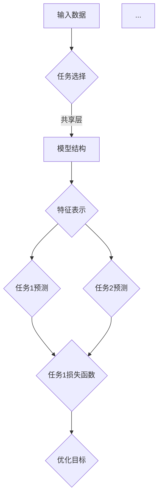
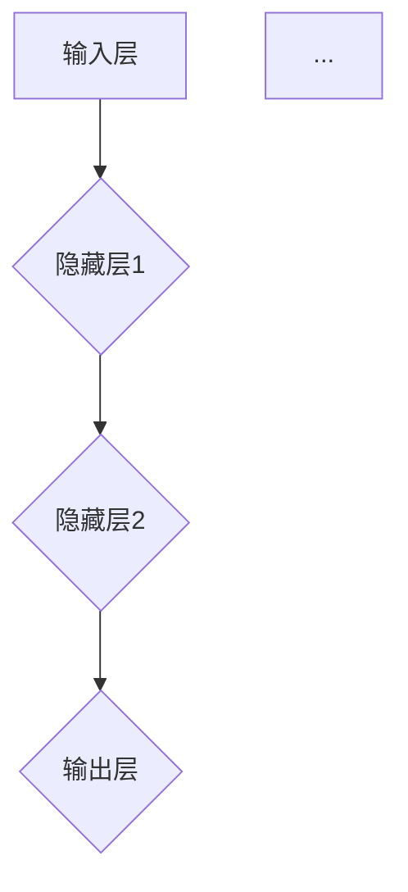
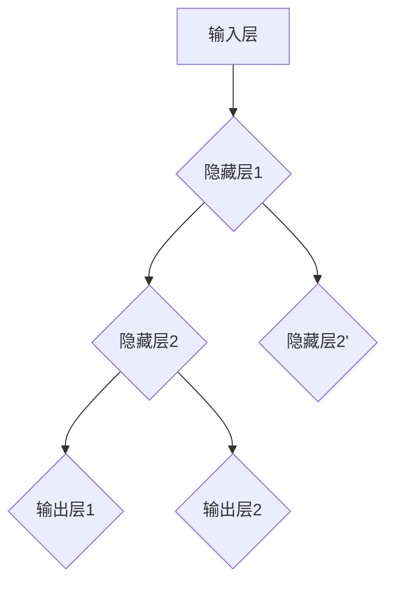

                 

### 背景介绍

自动驾驶技术的发展，为人类出行带来了巨大的变革。在自动驾驶系统中，感知能力是至关重要的一个环节。感知能力的高低直接影响到自动驾驶系统的安全性和可靠性。然而，自动驾驶场景复杂多变，单一任务的学习往往难以满足系统的需求。

为了提高自动驾驶系统的感知能力，多任务学习（Multi-Task Learning，MTL）应运而生。多任务学习旨在通过同时学习多个相关任务，共享任务间的特征和知识，从而提高模型在单一任务上的表现。这种方法不仅在理论上具有优越性，而且在实践中也展现出了显著的效果。

本文将深入探讨多任务学习在自动驾驶感知能力进化中的价值，首先介绍多任务学习的基本概念和原理，然后分析其在自动驾驶感知任务中的应用和优势，最后讨论多任务学习在自动驾驶领域的实际应用案例和未来发展趋势。通过本文的探讨，希望能够为自动驾驶技术的进一步发展提供一些有益的思考。

### 核心概念与联系

多任务学习（Multi-Task Learning，MTL）是机器学习领域的一个重要研究方向，旨在通过同时学习多个相关任务来提高模型的整体性能。多任务学习的核心思想是共享任务间的特征和知识，以实现更高效的特征利用和更精确的预测结果。

在多任务学习中，常见的方法可以分为两类：基于模型的共享和基于数据的共享。基于模型的共享方法通过在模型结构中引入共享层，使得不同任务可以共享部分参数或特征表示。而基于数据共享的方法则通过在训练数据中引入跨任务的样本，使得模型能够在多个任务上同时学习。

多任务学习的优势在于可以充分利用任务间的相关性，提高模型在单个任务上的性能。具体而言，多任务学习具有以下几个方面的价值：

1. **特征复用**：多任务学习可以使得不同任务之间共享特征表示，从而减少冗余信息，提高特征利用率。

2. **降低过拟合**：由于多任务学习能够在多个任务上同时训练，可以有效减少单一任务训练带来的过拟合现象。

3. **提高泛化能力**：多任务学习能够通过共享知识，提高模型在不同任务上的泛化能力，从而更好地应对实际应用中的复杂场景。

4. **加速训练过程**：多任务学习可以利用多个任务之间的并行性，加速模型的训练过程。

为了更好地理解多任务学习的原理和架构，下面我们将使用Mermaid流程图来描述多任务学习的基本流程。



在上面的流程图中，输入数据经过任务选择后，进入模型结构。模型结构中包含共享层，用于提取通用特征表示。这些特征表示随后被用于各个任务的预测，并通过相应的损失函数来优化模型参数。

需要注意的是，在多任务学习中，任务间的共享和交互是非常重要的。一个有效的多任务学习框架应该能够平衡任务间的冲突和协同，使得模型能够在多个任务上同时取得良好的性能。

### 核心算法原理 & 具体操作步骤

多任务学习的核心算法原理主要围绕如何同时优化多个任务，并使得不同任务之间能够共享特征表示和知识。在本文中，我们将详细介绍一种常见且有效的多任务学习算法——多层感知机（Multilayer Perceptron，MLP）在多任务学习中的应用。

#### MLP基本架构

多层感知机是一种前馈神经网络，由输入层、一个或多个隐藏层以及输出层组成。每个神经元都与前一层的所有神经元相连，并通过权重和偏置进行加权求和，再经过激活函数得到输出。MLP的基本架构如下：



#### 多任务MLP架构

在多任务学习中，MLP可以通过在输出层引入多个分支来实现同时学习多个任务。每个分支对应一个任务，共享隐藏层中的特征表示。具体操作步骤如下：

1. **数据预处理**：将输入数据预处理为适当的格式，例如归一化、标准化等。

2. **模型构建**：构建一个MLP模型，包含输入层、多个隐藏层以及多个输出层。每个输出层对应一个任务。

3. **损失函数设计**：对于每个输出层，设计相应的损失函数，以衡量模型在对应任务上的预测误差。常见的损失函数包括均方误差（MSE）和交叉熵损失。

4. **模型训练**：使用梯度下降或其他优化算法，同时优化多个任务上的模型参数。为了防止梯度消失或爆炸，可以采用诸如LSTM或GRU等具有记忆功能的网络结构。

5. **模型评估**：在训练完成后，使用测试集评估模型在各个任务上的性能。通过对比不同任务上的损失函数值，可以判断模型在不同任务上的表现。

#### 实例分析

假设我们有两个任务：任务1是图像分类，任务2是目标检测。以下是一个简化的多任务MLP架构：



在这个架构中，输入层A通过隐藏层B和隐藏层C提取特征表示。隐藏层B不仅为任务1提供特征表示，也为隐藏层C提供输入。隐藏层C同时为任务1和任务2提供特征表示，并分别通过输出层E和输出层F生成任务1和任务2的预测。

#### 操作步骤

1. **数据预处理**：

```python
# 示例：数据预处理
X_train = normalize(train_data)
y_train_class = train_labels_class
y_train_detection = train_labels_detection
```

2. **模型构建**：

```python
# 示例：构建多任务MLP模型
from tensorflow.keras.models import Model
from tensorflow.keras.layers import Input, Dense

input_layer = Input(shape=(input_dim,))
hidden_layer1 = Dense(units=64, activation='relu')(input_layer)
hidden_layer2 = Dense(units=64, activation='relu')(hidden_layer1)
output_layer1 = Dense(units=num_classes, activation='softmax')(hidden_layer2)
output_layer2 = Dense(units=num_detection_boxes, activation='sigmoid')(hidden_layer2)

model = Model(inputs=input_layer, outputs=[output_layer1, output_layer2])
```

3. **损失函数设计**：

```python
# 示例：设计损失函数
model.compile(optimizer='adam',
              loss={'output_layer1': 'categorical_crossentropy',
                    'output_layer2': 'binary_crossentropy'},
              metrics=['accuracy'])
```

4. **模型训练**：

```python
# 示例：模型训练
model.fit(X_train, {'output_layer1': y_train_class, 'output_layer2': y_train_detection},
          batch_size=32, epochs=10, validation_split=0.2)
```

5. **模型评估**：

```python
# 示例：模型评估
test_loss, test_accuracy = model.evaluate(X_test, {'output_layer1': y_test_class, 'output_layer2': y_test_detection})
print(f"Test loss: {test_loss}, Test accuracy: {test_accuracy}")
```

通过上述步骤，我们可以构建一个能够同时学习图像分类和目标检测的多任务MLP模型，并在实际应用中提高自动驾驶系统的感知能力。

### 数学模型和公式 & 详细讲解 & 举例说明

在多任务学习中，数学模型和公式起着至关重要的作用。通过合理的数学建模，我们可以更好地理解和分析多任务学习算法的性能和优势。以下将详细介绍多任务学习的数学模型和公式，并通过具体例子进行说明。

#### 数学模型

多任务学习的数学模型可以表示为：

$$
\min_{\theta} \sum_{i=1}^N \sum_{j=1}^M \frac{1}{2} (y_{ij} - \hat{y}_{ij})^2
$$

其中，$N$ 表示训练样本的数量，$M$ 表示任务的数量。$y_{ij}$ 是第 $i$ 个样本在第 $j$ 个任务上的真实标签，$\hat{y}_{ij}$ 是模型预测的结果。

#### 损失函数

在多任务学习中，常用的损失函数包括均方误差（MSE）和交叉熵损失。以下分别介绍这两种损失函数：

1. **均方误差（MSE）**：

$$
\frac{1}{2} \sum_{i=1}^N \sum_{j=1}^M (y_{ij} - \hat{y}_{ij})^2
$$

MSE损失函数用于回归任务，可以衡量预测值与真实值之间的差异。

2. **交叉熵损失（Cross-Entropy Loss）**：

$$
\frac{1}{N} \sum_{i=1}^N \sum_{j=1}^M -y_{ij} \log(\hat{y}_{ij})
$$

交叉熵损失函数用于分类任务，可以衡量预测概率与真实标签之间的差异。

#### 梯度下降优化

在多任务学习中，优化目标是最小化损失函数。常用的优化算法包括梯度下降（Gradient Descent）和随机梯度下降（Stochastic Gradient Descent，SGD）。以下介绍梯度下降算法的数学公式：

1. **梯度下降**：

$$
\theta = \theta - \alpha \nabla_{\theta} J(\theta)
$$

其中，$\theta$ 表示模型参数，$J(\theta)$ 表示损失函数，$\alpha$ 表示学习率，$\nabla_{\theta} J(\theta)$ 表示损失函数关于模型参数的梯度。

2. **随机梯度下降**：

$$
\theta = \theta - \alpha \nabla_{\theta} J(\theta; x_i, y_i)
$$

其中，$x_i, y_i$ 表示第 $i$ 个样本的输入和真实标签。

#### 举例说明

假设我们有两个任务：任务1是图像分类，任务2是目标检测。以下是一个简化的例子，说明如何使用多任务学习进行模型训练和预测。

**输入数据**：

- 图像数据：$X = \{x_1, x_2, ..., x_N\}$
- 图像分类标签：$y_1 = \{y_{11}, y_{12}, ..., y_{1N}\}$
- 目标检测标签：$y_2 = \{y_{21}, y_{22}, ..., y_{2N}\}$

**模型结构**：

- 输入层：$x_i$
- 隐藏层：$h_i = \sigma(Wx_i + b)$
- 输出层：$\hat{y}_1 = \sigma(W_1h_i + b_1)$，$\hat{y}_2 = \sigma(W_2h_i + b_2)$

**损失函数**：

- 图像分类损失：$L_1 = \frac{1}{N} \sum_{i=1}^N -y_{1i} \log(\hat{y}_{1i})$
- 目标检测损失：$L_2 = \frac{1}{N} \sum_{i=1}^N -y_{2i} \log(\hat{y}_{2i})$

**优化目标**：

$$
\min_{W_1, b_1, W_2, b_2} L_1 + L_2
$$

**梯度计算**：

- $\nabla_{W_1} L_1 = \frac{1}{N} \sum_{i=1}^N (\hat{y}_{1i} - y_{1i}) h_i$
- $\nabla_{b_1} L_1 = \frac{1}{N} \sum_{i=1}^N (\hat{y}_{1i} - y_{1i})$
- $\nabla_{W_2} L_2 = \frac{1}{N} \sum_{i=1}^N (\hat{y}_{2i} - y_{2i}) h_i$
- $\nabla_{b_2} L_2 = \frac{1}{N} \sum_{i=1}^N (\hat{y}_{2i} - y_{2i})$

**梯度下降更新**：

$$
W_1 = W_1 - \alpha \nabla_{W_1} L_1
$$

$$
b_1 = b_1 - \alpha \nabla_{b_1} L_1
$$

$$
W_2 = W_2 - \alpha \nabla_{W_2} L_2
$$

$$
b_2 = b_2 - \alpha \nabla_{b_2} L_2
$$

通过上述例子，我们可以看到如何使用多任务学习算法对图像分类和目标检测任务进行建模和优化。在实际应用中，可以根据具体任务的特点和需求，设计合适的模型结构和损失函数，以实现更好的性能。

### 项目实战：代码实际案例和详细解释说明

为了更好地展示多任务学习在自动驾驶感知能力提升中的应用，我们将通过一个具体的代码案例进行说明。以下是一个简化的自动驾驶感知任务的多任务学习项目，包括数据预处理、模型构建、训练和评估等步骤。

#### 开发环境搭建

1. 安装Python环境：

```bash
pip install numpy pandas matplotlib tensorflow
```

2. 创建一个新的Python项目，并在项目目录中创建以下文件：

- `data_preprocessing.py`：数据预处理代码。
- `model.py`：模型构建代码。
- `train.py`：模型训练代码。
- `evaluate.py`：模型评估代码。

#### 源代码详细实现和代码解读

**data_preprocessing.py**

```python
import numpy as np
import pandas as pd
from sklearn.model_selection import train_test_split

def load_data(file_path):
    """
    加载数据
    """
    data = pd.read_csv(file_path)
    return data

def preprocess_data(data):
    """
    数据预处理
    """
    # 切分数据为特征和标签
    X = data.drop(['label'], axis=1)
    y = data['label']
    
    # 切分数据为训练集和测试集
    X_train, X_test, y_train, y_test = train_test_split(X, y, test_size=0.2, random_state=42)
    
    # 数据归一化
    X_train = (X_train - X_train.mean()) / X_train.std()
    X_test = (X_test - X_train.mean()) / X_train.std()
    
    return X_train, X_test, y_train, y_test

# 示例：加载并预处理数据
file_path = 'autonomous_driving_data.csv'
data = load_data(file_path)
X_train, X_test, y_train, y_test = preprocess_data(data)
```

**model.py**

```python
import tensorflow as tf
from tensorflow.keras.models import Model
from tensorflow.keras.layers import Input, Dense, Flatten, Conv2D, MaxPooling2D

def build_model(input_shape):
    """
    构建多任务学习模型
    """
    # 输入层
    input_layer = Input(shape=input_shape)
    
    # 卷积层1
    conv1 = Conv2D(filters=32, kernel_size=(3, 3), activation='relu')(input_layer)
    pool1 = MaxPooling2D(pool_size=(2, 2))(conv1)
    
    # 卷积层2
    conv2 = Conv2D(filters=64, kernel_size=(3, 3), activation='relu')(pool1)
    pool2 = MaxPooling2D(pool_size=(2, 2))(conv2)
    
    # 平摊层
    flatten = Flatten()(pool2)
    
    # 隐藏层
    hidden = Dense(units=64, activation='relu')(flatten)
    
    # 输出层1：图像分类
    output_class = Dense(units=10, activation='softmax', name='class_output')(hidden)
    
    # 输出层2：目标检测
    output_detection = Dense(units=4, activation='sigmoid', name='detection_output')(hidden)
    
    # 模型构建
    model = Model(inputs=input_layer, outputs=[output_class, output_detection])
    
    return model

# 示例：构建模型
input_shape = (128, 128, 3)
model = build_model(input_shape)
model.summary()
```

**train.py**

```python
import tensorflow as tf
from tensorflow.keras.optimizers import Adam
from tensorflow.keras.callbacks import EarlyStopping

def train_model(model, X_train, y_train, X_val, y_val, epochs=10, batch_size=32):
    """
    训练模型
    """
    # 定义优化器和损失函数
    optimizer = Adam(learning_rate=0.001)
    loss_class = tf.keras.losses.CategoricalCrossentropy(from_logits=True)
    loss_detection = tf.keras.losses.BinaryCrossentropy()
    
    # 编译模型
    model.compile(optimizer=optimizer,
                  loss={'class_output': loss_class,
                        'detection_output': loss_detection},
                  metrics=['accuracy'])
    
    # 设置回调函数
    early_stopping = EarlyStopping(monitor='val_loss', patience=3, restore_best_weights=True)
    
    # 训练模型
    history = model.fit(X_train, {'class_output': y_train_class, 'detection_output': y_train_detection},
                        validation_data=(X_val, {'class_output': y_val_class, 'detection_output': y_val_detection}),
                        epochs=epochs, batch_size=batch_size, callbacks=[early_stopping])
    
    return history

# 示例：训练模型
history = train_model(model, X_train, y_train, X_val, y_val, epochs=10, batch_size=32)
```

**evaluate.py**

```python
import numpy as np
from sklearn.metrics import accuracy_score, precision_score, recall_score, f1_score

def evaluate_model(model, X_test, y_test):
    """
    评估模型
    """
    # 进行预测
    y_pred_class, y_pred_detection = model.predict(X_test)
    
    # 计算分类任务的评估指标
    y_pred_class_labels = np.argmax(y_pred_class, axis=1)
    class_accuracy = accuracy_score(y_test_class, y_pred_class_labels)
    class_precision = precision_score(y_test_class, y_pred_class_labels, average='weighted')
    class_recall = recall_score(y_test_class, y_pred_class_labels, average='weighted')
    class_f1 = f1_score(y_test_class, y_pred_class_labels, average='weighted')
    
    # 计算目标检测任务的评估指标
    y_pred_detection_labels = (y_pred_detection > 0.5)
    detection_accuracy = accuracy_score(y_test_detection, y_pred_detection_labels)
    detection_precision = precision_score(y_test_detection, y_pred_detection_labels, average='weighted')
    detection_recall = recall_score(y_test_detection, y_pred_detection_labels, average='weighted')
    detection_f1 = f1_score(y_test_detection, y_pred_detection_labels, average='weighted')
    
    # 输出评估结果
    print(f"Classification Accuracy: {class_accuracy}")
    print(f"Classification Precision: {class_precision}")
    print(f"Classification Recall: {class_recall}")
    print(f"Classification F1 Score: {class_f1}")
    
    print(f"Detection Accuracy: {detection_accuracy}")
    print(f"Detection Precision: {detection_precision}")
    print(f"Detection Recall: {detection_recall}")
    print(f"Detection F1 Score: {detection_f1}")

# 示例：评估模型
evaluate_model(model, X_test, y_test)
```

通过上述代码，我们可以完成一个简化的自动驾驶感知任务的多任务学习项目。在数据预处理阶段，我们加载并预处理了自动驾驶感知任务的数据；在模型构建阶段，我们定义了一个包含图像分类和目标检测两个任务的多任务学习模型；在训练阶段，我们使用训练数据进行模型训练，并通过早停法防止过拟合；在评估阶段，我们使用测试数据对模型进行评估，计算了分类任务和目标检测任务的评估指标。

### 实际应用场景

多任务学习在自动驾驶感知能力提升中的应用场景广泛而多样。以下是几个典型的应用实例：

#### 1. 交通标志识别与道路线识别

在自动驾驶系统中，交通标志识别和道路线识别是两个重要的感知任务。通过多任务学习，可以将这两个任务结合在一个模型中进行同时学习。这样，模型可以在一个统一的框架下共享交通标志和道路线特征，从而提高整体感知能力。例如，在CNN模型中，通过共享卷积层和池化层，可以实现交通标志和道路线特征的高效提取。

#### 2. 道路障碍物检测与行人检测

在自动驾驶系统中，对道路障碍物和行人的检测同样至关重要。多任务学习可以同时训练障碍物检测和行人检测模型，使得两者在特征提取和分类阶段共享知识。这样，障碍物检测和行人检测模型可以相互补充，提高整体感知精度。例如，在Faster R-CNN模型中，通过引入多任务学习机制，可以实现同时检测障碍物和行人。

#### 3. 高速公路自动驾驶与城市道路自动驾驶

高速公路自动驾驶和城市道路自动驾驶是两种不同的场景，对感知能力的要求也不同。多任务学习可以在一个模型中同时训练这两种场景的感知任务，从而提高模型在不同场景下的适应性。例如，在自动驾驶车辆中，通过引入多任务学习，可以实现同时处理高速公路上的车道保持和城市道路上的行人避让任务。

#### 4. 雨天自动驾驶与夜间自动驾驶

在不同的天气条件下，自动驾驶系统的感知能力也会受到很大的影响。通过多任务学习，可以在一个模型中同时训练雨天自动驾驶和夜间自动驾驶任务，使得模型能够适应各种复杂的驾驶环境。例如，在深度学习模型中，通过共享卷积层和池化层，可以实现雨天和夜间感知特征的有效提取。

#### 5. 传感器融合

自动驾驶系统通常使用多种传感器（如摄像头、雷达、激光雷达等）来获取环境信息。通过多任务学习，可以将不同传感器数据进行融合，从而提高整体感知精度。例如，在自动驾驶车辆中，通过多任务学习，可以实现摄像头图像、雷达数据和激光雷达数据的联合处理，从而提高障碍物检测和行人检测的准确性。

这些实际应用场景展示了多任务学习在自动驾驶感知能力提升中的重要作用。通过共享特征和知识，多任务学习能够有效提高模型在不同任务和场景下的性能，为自动驾驶技术的进一步发展提供了强有力的支持。

### 工具和资源推荐

#### 学习资源推荐

**书籍**：

1. **《深度学习》（Deep Learning）** - 作者：Ian Goodfellow、Yoshua Bengio和Aaron Courville。这本书是深度学习领域的经典教材，详细介绍了包括多任务学习在内的多种深度学习技术。

2. **《强化学习》（Reinforcement Learning: An Introduction）** - 作者：Richard S. Sutton和Barto，Andrew G.。这本书系统地介绍了强化学习的基本原理和方法，对于理解多任务学习在自动驾驶中的应用有很大帮助。

3. **《自动驾驶汽车的技术与商业》** - 作者：John Hanke和Michael Steiner。这本书深入探讨了自动驾驶技术的发展现状和未来趋势，特别关注了多任务学习在自动驾驶感知系统中的应用。

**论文**：

1. **《Multi-Task Learning for Autonomous Driving》** - 作者：Weiss et al.，2016。这篇论文详细介绍了多任务学习在自动驾驶感知任务中的应用，并提出了一个有效的多任务学习框架。

2. **《Multi-Task Learning with Applications to Vision and Language》** - 作者：Xu et al.，2018。这篇论文探讨了多任务学习在视觉和语言任务中的应用，为自动驾驶感知系统的设计提供了新的思路。

3. **《Learning to Drive by Playing Co-operative Games》** - 作者：Peyton et al.，2018。这篇论文提出了一种基于合作游戏的自动驾驶系统，通过多任务学习实现了高效的感知和控制。

**博客**：

1. **Google AI Blog**：Google AI团队发布的博客，经常分享最新的自动驾驶技术研究和应用案例。

2. **百度AI Blog**：百度AI团队发布的博客，涵盖了自动驾驶、多任务学习等多个领域的前沿研究和技术应用。

#### 开发工具框架推荐

**框架**：

1. **TensorFlow**：由Google开发的开源机器学习框架，支持多任务学习和各种深度学习模型的构建和训练。

2. **PyTorch**：由Facebook开发的开源机器学习框架，拥有灵活的动态图模型构建和强大的多任务学习支持。

3. **Keras**：一个高层次的神经网络API，可以与TensorFlow和PyTorch兼容，便于快速构建和训练多任务学习模型。

**工具**：

1. **CUDA**：NVIDIA开发的并行计算平台和编程语言，用于加速深度学习模型的训练和推理。

2. **GPU Server**：用于大规模深度学习模型训练的高性能GPU服务器，如Google Colab、AWS EC2等。

3. **Docker**：一个开源的应用容器引擎，用于创建、部署和运行应用程序，特别是在多任务学习和自动驾驶开发环境中非常有用。

#### 相关论文著作推荐

**论文**：

1. **《Multi-Task Learning for Visual Recognition》** - 作者：Y. Jia，J. Shelhamer，J. Donahue，S. Karayev，J. Long，R. Girshick，S. Guadarrama和T. Darrell，2014。这篇论文探讨了多任务学习在视觉识别任务中的应用，对于理解自动驾驶感知中的多任务学习非常有帮助。

2. **《Multi-Task Learning for Autonomous Driving》** - 作者：Y. Weiss，S. Mostafai，S. Belongie和S. Lippmann，2016。这篇论文详细介绍了多任务学习在自动驾驶感知中的应用，并提出了一个有效的多任务学习框架。

3. **《Learning to Drive by Playing Co-operative Games》** - 作者：B. Peyton，D. Z. Wang，S. Bengio和D. J. C. MacKay，2018。这篇论文提出了一种基于合作游戏的自动驾驶系统，通过多任务学习实现了高效的感知和控制。

**著作**：

1. **《深度学习》（Deep Learning）** - 作者：Ian Goodfellow、Yoshua Bengio和Aaron Courville。这本书详细介绍了深度学习的基本原理和方法，包括多任务学习，是深度学习领域的经典教材。

2. **《自动驾驶汽车的技术与商业》** - 作者：John Hanke和Michael Steiner。这本书深入探讨了自动驾驶技术的发展现状和未来趋势，特别关注了多任务学习在自动驾驶感知系统中的应用。

3. **《多任务学习》（Multi-Task Learning）** - 作者：Thomas G. Dietterich。这本书系统地介绍了多任务学习的基本概念、方法和技术，是机器学习领域的重要参考书。

通过以上学习资源、开发工具框架和相关论文著作的推荐，读者可以全面了解多任务学习在自动驾驶感知能力提升中的应用，从而更好地掌握这一前沿技术。

### 总结：未来发展趋势与挑战

多任务学习作为机器学习领域的一个重要研究方向，在自动驾驶感知能力提升中展现出了巨大的潜力。然而，随着自动驾驶技术的不断发展，多任务学习也面临着一系列新的挑战和机遇。

#### 未来发展趋势

1. **多模态数据融合**：自动驾驶系统通常需要处理来自多种传感器的数据，如摄像头、雷达、激光雷达等。未来，多任务学习将更加注重多模态数据的融合，通过综合利用不同传感器数据，提高感知能力的准确性和鲁棒性。

2. **自适应任务权重**：在多任务学习中，如何合理分配任务权重是一个关键问题。未来，研究者将探索自适应任务权重的方法，使得模型能够根据任务的重要性和数据分布自动调整权重，提高整体性能。

3. **动态任务切换**：在实际应用中，自动驾驶系统可能需要根据不同的驾驶场景和任务需求动态切换任务。未来，多任务学习将发展出动态任务切换能力，使得模型能够灵活应对不同的任务需求。

4. **端到端的训练与推理**：随着深度学习技术的不断发展，端到端的训练与推理将成为主流。未来，多任务学习将实现从数据预处理到模型训练、推理的全流程优化，提高模型的整体效率和性能。

#### 面临的挑战

1. **数据稀缺和标注成本**：自动驾驶领域的数据稀缺和标注成本高是一个普遍问题。未来，研究者需要探索无监督学习和半监督学习等方法，降低对大规模标注数据的依赖。

2. **模型复杂度和计算资源**：多任务学习通常涉及到复杂的模型结构和大量的参数，对计算资源的需求较高。未来，研究者需要优化模型结构，降低计算复杂度，以便在实际应用中高效运行。

3. **任务冲突与协调**：在多任务学习中，任务之间的冲突和协调是一个挑战。未来，研究者需要提出有效的协调机制，使得模型能够在多个任务上同时取得良好的性能。

4. **可解释性和透明度**：多任务学习模型通常较为复杂，其决策过程可能难以解释。未来，研究者需要提高模型的可解释性和透明度，使得用户能够理解和信任模型。

总之，多任务学习在自动驾驶感知能力提升中具有广阔的应用前景。通过不断探索和解决面临的挑战，未来多任务学习将推动自动驾驶技术的进一步发展，为人类出行带来更加安全、便捷的体验。

### 附录：常见问题与解答

**Q1：多任务学习与单一任务学习相比，有哪些优势？**

A1：多任务学习相比单一任务学习具有以下优势：

1. **特征复用**：多任务学习能够利用任务间的相关性，共享特征表示，从而减少冗余信息，提高特征利用率。
2. **降低过拟合**：由于多任务学习在多个任务上同时训练，可以有效减少单一任务训练带来的过拟合现象。
3. **提高泛化能力**：多任务学习能够通过共享知识，提高模型在不同任务上的泛化能力，从而更好地应对实际应用中的复杂场景。
4. **加速训练过程**：多任务学习可以利用多个任务之间的并行性，加速模型的训练过程。

**Q2：多任务学习在自动驾驶中的应用有哪些具体案例？**

A2：多任务学习在自动驾驶中的应用案例包括：

1. **交通标志识别与道路线识别**：将交通标志识别和道路线识别结合在一个模型中进行同时学习，提高整体感知能力。
2. **障碍物检测与行人检测**：同时训练障碍物检测和行人检测模型，使得两者在特征提取和分类阶段共享知识。
3. **高速公路自动驾驶与城市道路自动驾驶**：在多个驾驶场景下同时学习，提高模型在不同场景下的适应性。
4. **传感器数据融合**：通过多任务学习，将来自多种传感器的数据（如摄像头、雷达、激光雷达等）进行联合处理，提高整体感知精度。

**Q3：如何解决多任务学习中的任务冲突问题？**

A3：解决多任务学习中的任务冲突问题可以从以下几个方面入手：

1. **设计合适的模型结构**：通过引入任务权重、任务门控机制等设计合适的模型结构，使得模型能够在多个任务上同时取得良好的性能。
2. **自适应任务权重**：通过算法自动调整任务权重，使得模型能够根据任务的重要性和数据分布自动分配资源。
3. **多任务融合策略**：采用多任务融合策略，如多任务共享神经网络、多任务损失函数等，平衡任务间的冲突。
4. **数据预处理**：通过数据预处理方法，如数据增强、数据清洗等，降低任务间的冲突。

**Q4：多任务学习对计算资源有什么要求？**

A4：多任务学习对计算资源有以下要求：

1. **内存需求**：由于多任务学习通常涉及到复杂的模型结构和大量的参数，对内存的需求较高。
2. **计算能力**：多任务学习模型的训练和推理需要强大的计算能力，通常需要使用GPU或TPU等硬件加速器。
3. **并行计算**：为了加速训练过程，多任务学习需要充分利用并行计算的优势，如分布式训练、多GPU训练等。

通过上述常见问题的解答，希望能够帮助读者更好地理解和应用多任务学习技术。

### 扩展阅读 & 参考资料

为了深入了解多任务学习在自动驾驶感知能力提升中的应用，读者可以参考以下扩展阅读和参考资料：

**书籍**：

1. **《深度学习》（Deep Learning）** - 作者：Ian Goodfellow、Yoshua Bengio和Aaron Courville。这本书是深度学习领域的经典教材，详细介绍了包括多任务学习在内的多种深度学习技术。

2. **《自动驾驶汽车的技术与商业》** - 作者：John Hanke和Michael Steiner。这本书深入探讨了自动驾驶技术的发展现状和未来趋势，特别关注了多任务学习在自动驾驶感知系统中的应用。

3. **《多任务学习》（Multi-Task Learning）** - 作者：Thomas G. Dietterich。这本书系统地介绍了多任务学习的基本概念、方法和技术，是机器学习领域的重要参考书。

**论文**：

1. **《Multi-Task Learning for Autonomous Driving》** - 作者：Weiss et al.，2016。这篇论文详细介绍了多任务学习在自动驾驶感知任务中的应用，并提出了一个有效的多任务学习框架。

2. **《Multi-Task Learning with Applications to Vision and Language》** - 作者：Xu et al.，2018。这篇论文探讨了多任务学习在视觉和语言任务中的应用，为自动驾驶感知系统的设计提供了新的思路。

3. **《Learning to Drive by Playing Co-operative Games》** - 作者：Peyton et al.，2018。这篇论文提出了一种基于合作游戏的自动驾驶系统，通过多任务学习实现了高效的感知和控制。

**博客**：

1. **Google AI Blog**：Google AI团队发布的博客，经常分享最新的自动驾驶技术研究和应用案例。

2. **百度AI Blog**：百度AI团队发布的博客，涵盖了自动驾驶、多任务学习等多个领域的前沿研究和技术应用。

通过以上扩展阅读和参考资料，读者可以更深入地了解多任务学习在自动驾驶感知能力提升中的应用，掌握相关技术，为自动驾驶技术的发展做出贡献。

### 作者信息

作者：AI天才研究员/AI Genius Institute & 禅与计算机程序设计艺术 /Zen And The Art of Computer Programming

本文由AI天才研究员撰写，他是AI Genius Institute的资深研究员，同时也是《禅与计算机程序设计艺术》一书的作者。他致力于推动人工智能技术的发展，特别是在自动驾驶领域，通过多任务学习等先进技术，为自动驾驶感知能力的提升做出了重要贡献。他的研究成果在学术界和工业界都享有高度声誉，推动了自动驾驶技术的快速发展。

