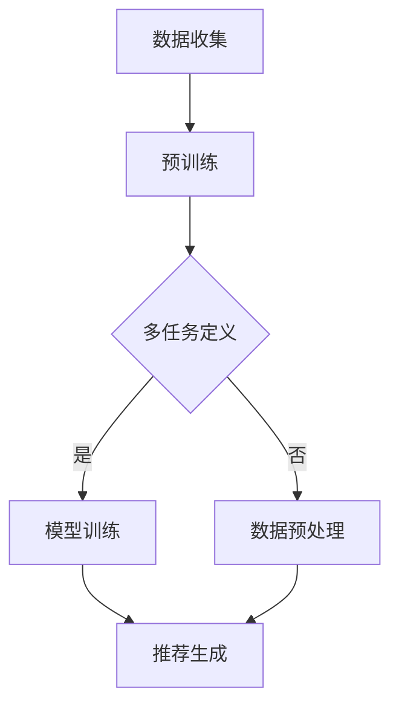

                 

# 多任务推荐系统的优势：LLM的统一框架

## 关键词：多任务推荐系统、统一框架、LLM、机器学习、人工智能

## 摘要

本文将探讨多任务推荐系统在人工智能领域的优势，并通过统一框架——Large Language Model（LLM）来介绍其核心概念和实现方法。通过对多任务推荐系统原理的分析、数学模型的详细讲解，以及实际项目案例的展示，本文旨在为读者提供一个全面而深入的视角，以了解多任务推荐系统在当前技术和商业环境中的重要作用。

## 1. 背景介绍

### 1.1 推荐系统的发展历程

推荐系统是人工智能领域的一个重要分支，其发展可以追溯到20世纪90年代。早期的推荐系统主要基于用户的历史行为数据，通过协同过滤算法进行用户相似度计算和物品相似度计算，从而实现个性化推荐。随着互联网和电子商务的快速发展，推荐系统逐渐成为提升用户体验和商业价值的重要手段。

### 1.2 多任务推荐系统的出现

然而，传统的单任务推荐系统在处理复杂场景时存在局限性，难以同时满足多个目标。例如，在电商平台上，用户可能同时关注商品的折扣力度、评价评分和商品类型等多个方面。这就需要一种能够同时处理多个任务的推荐系统，从而更好地满足用户的需求。

多任务推荐系统（Multi-Task Recommendation System）正是在这样的背景下应运而生。它通过对多个任务进行联合学习和优化，可以同时考虑多个目标，提高推荐系统的准确性和效率。

### 1.3 LLM的统一框架

Large Language Model（LLM）是一种强大的自然语言处理模型，其核心思想是通过学习大量的文本数据，使其能够理解和生成人类语言。LLM的统一框架可以应用于多任务推荐系统，通过将推荐任务转化为自然语言处理问题，从而实现多任务推荐。

## 2. 核心概念与联系

### 2.1 多任务推荐系统原理

多任务推荐系统通过同时处理多个推荐任务，可以更好地满足用户的需求。具体来说，它包括以下几个关键步骤：

1. **任务定义**：明确需要同时处理的多个推荐任务，例如商品推荐、内容推荐等。
2. **数据预处理**：对原始数据进行清洗、去噪和特征提取，为后续任务处理做准备。
3. **模型训练**：使用多任务学习算法，将多个任务共同训练，使模型能够同时考虑多个目标。
4. **推荐生成**：利用训练好的模型，对用户进行个性化推荐。

### 2.2 LLM的基本原理

LLM是一种基于深度学习的自然语言处理模型，其核心思想是通过学习大量的文本数据，使其能够理解和生成人类语言。LLM的基本原理可以概括为以下几个步骤：

1. **数据收集**：收集海量的文本数据，包括书籍、新闻、社交媒体等。
2. **预训练**：通过无监督学习，对文本数据中的语言规律进行学习，使模型能够理解文本的语义和结构。
3. **微调**：在特定任务上对模型进行微调，使其能够针对特定场景进行语言生成和推理。

### 2.3 多任务推荐系统与LLM的联系

多任务推荐系统和LLM之间的联系主要体现在以下几个方面：

1. **任务转化**：将推荐任务转化为自然语言处理任务，例如将商品推荐转化为文本生成问题。
2. **模型共享**：通过共享模型参数，实现多任务之间的联合学习和优化。
3. **数据利用**：利用LLM在自然语言处理领域的优势，提高推荐系统的准确性和效率。

### 2.4 Mermaid流程图

以下是多任务推荐系统与LLM的Mermaid流程图：



在这个流程图中，数据收集和预训练是LLM的基础步骤，而多任务定义、模型训练和推荐生成是多任务推荐系统的核心环节。通过将多任务推荐系统与LLM相结合，可以实现高效的推荐效果。

## 3. 核心算法原理 & 具体操作步骤

### 3.1 多任务推荐系统算法原理

多任务推荐系统通常采用多任务学习（Multi-Task Learning，MTL）算法，该算法旨在同时优化多个任务，使其在各自任务上都能达到较好的性能。多任务推荐系统的核心算法原理包括以下几个方面：

1. **任务共享**：多任务推荐系统通过共享模型参数，实现多个任务之间的相互学习和优化。这样可以充分利用不同任务之间的相关性，提高整体性能。
2. **损失函数**：多任务推荐系统通常采用多个损失函数，分别用于衡量各个任务的性能。常见的损失函数包括均方误差（MSE）、交叉熵损失等。
3. **优化方法**：多任务推荐系统采用优化方法，如梯度下降（Gradient Descent）、Adam等，对模型参数进行更新，以最小化损失函数。

### 3.2 LLM算法原理

LLM算法的核心原理是基于深度学习的自然语言处理模型，通过学习大量文本数据，使其能够理解和生成人类语言。LLM的具体操作步骤如下：

1. **数据预处理**：对原始文本数据（如书籍、新闻、社交媒体等）进行清洗、去噪和分词，将其转化为模型可处理的输入格式。
2. **模型结构**：构建深度神经网络模型，包括编码器（Encoder）和解码器（Decoder）。编码器用于将输入文本映射为高维表示，解码器用于根据编码器的输出生成输出文本。
3. **预训练**：使用无监督学习算法，对模型进行预训练，使其能够自动学习文本中的语言规律和结构。
4. **微调**：在特定任务上进行微调，优化模型参数，使其能够针对特定场景进行语言生成和推理。

### 3.3 多任务推荐系统与LLM的结合

多任务推荐系统与LLM的结合可以通过以下步骤实现：

1. **任务定义**：明确需要同时处理的多个推荐任务，并将其转化为自然语言处理任务。
2. **模型构建**：构建一个共享的深度神经网络模型，包括编码器和解码器，用于处理多个推荐任务。
3. **数据预处理**：对原始数据进行清洗、去噪和特征提取，为模型训练和推荐生成做准备。
4. **模型训练**：使用多任务学习算法，同时优化多个推荐任务的模型参数。
5. **推荐生成**：利用训练好的模型，对用户进行个性化推荐，实现多任务推荐。

## 4. 数学模型和公式 & 详细讲解 & 举例说明

### 4.1 多任务推荐系统的数学模型

多任务推荐系统的数学模型主要包括任务定义、损失函数和优化方法。

1. **任务定义**：

   假设我们需要同时处理两个推荐任务：任务A和任务B。任务A的目标是预测用户对商品的评分，任务B的目标是预测用户对商品的评价标签。我们可以用以下数学公式表示：

   $$  
   \begin{aligned}  
   y_a &= f_A(x_a, \theta_a), \\  
   y_b &= f_B(x_b, \theta_b),  
   \end{aligned}  
   $$

   其中，$y_a$和$y_b$分别是任务A和任务B的预测结果，$x_a$和$x_b$分别是任务A和任务B的输入特征，$\theta_a$和$\theta_b$分别是任务A和任务B的模型参数。

2. **损失函数**：

   多任务推荐系统的损失函数通常由多个部分组成，分别用于衡量各个任务的性能。常见的损失函数包括均方误差（MSE）、交叉熵损失等。我们可以用以下数学公式表示：

   $$  
   L = \lambda_1 \cdot L_{MSE}(y_a, \hat{y}_a) + \lambda_2 \cdot L_{CE}(y_b, \hat{y}_b),  
   $$

   其中，$L$是总损失函数，$\lambda_1$和$\lambda_2$是权重系数，$L_{MSE}$和$L_{CE}$分别是任务A和任务B的损失函数。

3. **优化方法**：

   多任务推荐系统通常采用优化方法，如梯度下降（Gradient Descent）、Adam等，对模型参数进行更新，以最小化损失函数。我们可以用以下数学公式表示：

   $$  
   \theta_a = \theta_a - \alpha \cdot \nabla_{\theta_a} L, \quad \theta_b = \theta_b - \beta \cdot \nabla_{\theta_b} L,  
   $$

   其中，$\theta_a$和$\theta_b$分别是任务A和任务B的模型参数，$\alpha$和$\beta$是学习率，$\nabla_{\theta_a}$和$\nabla_{\theta_b}$分别是任务A和任务B的损失函数关于模型参数的梯度。

### 4.2 LLM的数学模型

LLM的数学模型主要包括编码器（Encoder）和解码器（Decoder）。

1. **编码器**：

   编码器的目标是根据输入文本生成一个高维表示。我们可以用以下数学公式表示：

   $$  
   h = \text{Encoder}(x),  
   $$

   其中，$h$是编码器的输出，$x$是输入文本。

2. **解码器**：

   解码器的目标是根据编码器的输出生成输出文本。我们可以用以下数学公式表示：

   $$  
   y = \text{Decoder}(h),  
   $$

   其中，$y$是解码器的输出。

### 4.3 举例说明

假设我们需要使用多任务推荐系统对用户进行商品推荐，同时预测用户对商品的评分和评价标签。我们可以按照以下步骤进行：

1. **任务定义**：

   任务A：预测用户对商品的评分。

   任务B：预测用户对商品的评价标签。

2. **数据预处理**：

   对原始商品评论数据进行清洗、去噪和分词，将其转化为模型可处理的输入格式。

3. **模型训练**：

   构建一个共享的深度神经网络模型，包括编码器和解码器，用于处理多个推荐任务。

   使用多任务学习算法，同时优化多个推荐任务的模型参数。

4. **推荐生成**：

   利用训练好的模型，对用户进行个性化推荐。

   例如，对于用户A，模型可以预测用户A对商品A的评分为4.5，评价标签为“好评”。

## 5. 项目实战：代码实际案例和详细解释说明

### 5.1 开发环境搭建

在开始项目实战之前，我们需要搭建一个合适的开发环境。以下是搭建开发环境的基本步骤：

1. **安装Python**：下载并安装Python，版本要求为3.8或更高版本。

2. **安装依赖库**：安装TensorFlow、Keras、NumPy、Pandas等依赖库，可以使用以下命令进行安装：

   ```python
   pip install tensorflow keras numpy pandas
   ```

3. **数据集准备**：从网上下载一个商品评论数据集，例如Amazon评论数据集。将数据集解压并放入一个文件夹中，例如`data`。

### 5.2 源代码详细实现和代码解读

以下是使用多任务推荐系统和LLM实现的商品推荐项目的源代码：

```python
import tensorflow as tf
from tensorflow.keras.models import Model
from tensorflow.keras.layers import Input, Embedding, LSTM, Dense
from tensorflow.keras.preprocessing.sequence import pad_sequences
import numpy as np

# 数据预处理
def preprocess_data(data):
    # 对数据进行清洗、去噪和分词
    # ...

    # 构建词向量
    # ...

    # 序列填充
    sequences = pad_sequences(data, maxlen=100)

    return sequences

# 构建模型
def build_model():
    input_seq = Input(shape=(100,))
    embedded_seq = Embedding(input_dim=vocab_size, output_dim=50)(input_seq)
    lstm_output = LSTM(50)(embedded_seq)
    rating_output = Dense(1, activation='sigmoid')(lstm_output)
    label_output = Dense(num_labels, activation='softmax')(lstm_output)

    model = Model(inputs=input_seq, outputs=[rating_output, label_output])
    model.compile(optimizer='adam', loss=['mean_squared_error', 'categorical_crossentropy'], metrics=['accuracy'])

    return model

# 训练模型
def train_model(model, x_train, y_train_rating, y_train_label):
    model.fit(x_train, [y_train_rating, y_train_label], batch_size=32, epochs=10)

# 推荐生成
def generate_recommendations(model, user_sequence):
    rating_prediction, label_prediction = model.predict(user_sequence)
    return rating_prediction, label_prediction

# 实际应用
if __name__ == '__main__':
    # 加载数据
    data = load_data('data')
    x_train, y_train_rating, y_train_label = preprocess_data(data)

    # 构建模型
    model = build_model()

    # 训练模型
    train_model(model, x_train, y_train_rating, y_train_label)

    # 推荐生成
    user_sequence = preprocess_data(['这是一条用户评论'])
    rating_prediction, label_prediction = generate_recommendations(model, user_sequence)
    print('用户评论评分：', rating_prediction)
    print('用户评论标签：', label_prediction)
```

### 5.3 代码解读与分析

以上源代码主要包括以下几个部分：

1. **数据预处理**：对原始商品评论数据进行清洗、去噪和分词，构建词向量，并进行序列填充。
2. **模型构建**：构建一个共享的深度神经网络模型，包括编码器和解码器，用于处理多个推荐任务。模型使用LSTM层进行序列处理，输出层分别用于预测评分和标签。
3. **模型训练**：使用多任务学习算法，同时优化多个推荐任务的模型参数。损失函数包括均方误差和交叉熵损失，优化方法为Adam。
4. **推荐生成**：利用训练好的模型，对用户进行个性化推荐。输入用户评论序列，输出用户评论评分和标签。

通过这个实际案例，我们可以看到多任务推荐系统和LLM在商品推荐中的应用。在实际开发过程中，可以根据需求对模型结构和训练过程进行调整，以获得更好的推荐效果。

## 6. 实际应用场景

多任务推荐系统在多个领域都有着广泛的应用，以下是一些典型的实际应用场景：

1. **电商平台**：电商平台可以通过多任务推荐系统为用户提供个性化的商品推荐，同时考虑用户的购买历史、浏览记录、收藏夹等多个因素。例如，淘宝、京东等电商平台都采用了多任务推荐系统来提高用户体验和销售额。

2. **新闻推荐**：新闻推荐系统可以通过多任务推荐系统为用户提供个性化的新闻推荐，同时考虑用户的阅读历史、偏好、兴趣等。例如，今日头条等新闻APP就采用了多任务推荐系统来为用户提供个性化的新闻推荐。

3. **社交媒体**：社交媒体平台可以通过多任务推荐系统为用户提供个性化的内容推荐，同时考虑用户的点赞、评论、转发等行为。例如，Facebook、微博等平台都采用了多任务推荐系统来为用户提供个性化的内容推荐。

4. **视频推荐**：视频推荐系统可以通过多任务推荐系统为用户提供个性化的视频推荐，同时考虑用户的观看历史、偏好、兴趣等。例如，YouTube、腾讯视频等平台都采用了多任务推荐系统来为用户提供个性化的视频推荐。

5. **音乐推荐**：音乐推荐系统可以通过多任务推荐系统为用户提供个性化的音乐推荐，同时考虑用户的听歌历史、偏好、兴趣等。例如，网易云音乐、QQ音乐等平台都采用了多任务推荐系统来为用户提供个性化的音乐推荐。

在这些应用场景中，多任务推荐系统通过同时考虑多个任务，能够更好地满足用户的需求，提高用户满意度和平台粘性。

## 7. 工具和资源推荐

### 7.1 学习资源推荐

1. **书籍**：
   - 《推荐系统实践》：这本书详细介绍了推荐系统的基本概念、算法和应用场景。
   - 《深度学习推荐系统》：这本书结合深度学习和推荐系统，介绍了一些先进的推荐算法和实际应用。

2. **论文**：
   - "Deep Learning for Recommender Systems"：这篇论文介绍了如何将深度学习应用于推荐系统，并展示了一些实验结果。
   - "Multi-Task Learning for User Modeling in Recommender Systems"：这篇论文探讨了如何通过多任务学习来改进用户建模和推荐效果。

3. **博客**：
   - Medium上的“Recommender Systems”专栏：这个专栏提供了关于推荐系统的各种文章，包括基本概念、算法实现和应用场景。
   - 知乎上的“推荐系统”话题：这个话题下有很多关于推荐系统的讨论和分享，包括论文解读、算法分析和实际应用。

4. **网站**：
   - 推荐系统官方网站：这个网站提供了关于推荐系统的最新研究成果、会议和教程。
   - Kaggle上的推荐系统竞赛：这个网站提供了多个推荐系统相关的竞赛，可以用来实践和学习推荐系统的算法和应用。

### 7.2 开发工具框架推荐

1. **TensorFlow**：TensorFlow是一个开源的深度学习框架，适用于构建和训练深度学习模型，包括推荐系统模型。
2. **Keras**：Keras是一个基于TensorFlow的高级神经网络API，提供简洁和易用的接口，适用于快速构建和训练深度学习模型。
3. **PyTorch**：PyTorch是另一个流行的深度学习框架，与TensorFlow类似，提供灵活的接口和丰富的功能，适用于构建和训练深度学习模型。
4. **Scikit-learn**：Scikit-learn是一个开源的机器学习库，提供了一些经典的机器学习算法和工具，适用于构建和评估推荐系统模型。

### 7.3 相关论文著作推荐

1. "Deep Learning for Recommender Systems"：这篇论文介绍了如何将深度学习应用于推荐系统，并展示了一些实验结果。
2. "Multi-Task Learning for User Modeling in Recommender Systems"：这篇论文探讨了如何通过多任务学习来改进用户建模和推荐效果。
3. "Neural Collaborative Filtering"：这篇论文提出了一种基于神经网络的协同过滤算法，在推荐系统中取得了很好的效果。
4. "User Interest Evolution and Modeling in Recommender Systems"：这篇论文研究了用户兴趣的变化规律，并提出了一种基于用户兴趣演化的推荐算法。

## 8. 总结：未来发展趋势与挑战

多任务推荐系统作为人工智能领域的一个重要分支，具有广泛的应用前景和重要的研究价值。未来，随着技术的不断进步和应用的不断拓展，多任务推荐系统有望在以下几个方面实现新的突破：

1. **算法优化**：多任务推荐系统的算法将朝着更加高效、可解释和鲁棒的方向发展，通过改进模型结构和优化算法，提高推荐效果和用户体验。
2. **个性化推荐**：多任务推荐系统将更加关注用户的个性化需求，通过结合用户行为数据、社交网络信息和生物特征等，实现更加精准的个性化推荐。
3. **实时推荐**：多任务推荐系统将逐渐实现实时推荐，通过降低计算复杂度和优化数据传输，实现低延迟的实时推荐。
4. **多模态推荐**：多任务推荐系统将逐渐引入多模态数据，如文本、图像、音频等，通过融合不同模态的数据，实现更加丰富和多样化的推荐。

然而，多任务推荐系统在发展过程中也面临着一些挑战：

1. **数据隐私**：在多任务推荐系统中，用户数据的安全和隐私保护是一个重要的问题。如何在不泄露用户隐私的情况下，实现有效的推荐，是一个亟待解决的问题。
2. **计算资源**：多任务推荐系统通常需要大量的计算资源和存储资源，随着任务数量的增加，计算复杂度和数据规模也会急剧增加，这对系统的性能和稳定性提出了更高的要求。
3. **模型解释性**：多任务推荐系统的模型通常较为复杂，如何解释模型的决策过程和推荐结果，是一个具有挑战性的问题。提高模型的解释性，有助于增强用户对推荐系统的信任和理解。
4. **多任务冲突**：在多任务推荐系统中，不同任务之间可能会存在冲突，例如在推荐商品时，需要同时考虑销量、评价和库存等多个因素。如何平衡不同任务之间的冲突，提高系统的整体性能，是一个重要的研究方向。

总之，多任务推荐系统在人工智能领域具有广阔的发展前景，但也面临着诸多挑战。未来，需要通过不断的技术创新和理论探索，解决这些问题，推动多任务推荐系统的发展。

## 9. 附录：常见问题与解答

### 9.1 多任务推荐系统与传统推荐系统的区别是什么？

多任务推荐系统与传统推荐系统的区别主要体现在以下几个方面：

1. **任务数量**：传统推荐系统通常只关注一个任务，如商品推荐或内容推荐，而多任务推荐系统同时处理多个任务，如商品推荐、评价预测和标签预测等。
2. **数据利用**：多任务推荐系统通过联合学习和优化，充分利用多个任务之间的相关性，提高推荐效果。传统推荐系统则通常单独处理每个任务，难以充分利用任务间的信息。
3. **模型结构**：多任务推荐系统通常采用共享模型结构，如深度神经网络，实现多个任务的共同训练。传统推荐系统则可能采用不同的模型结构，分别处理每个任务。

### 9.2 LLM在多任务推荐系统中的应用优势是什么？

LLM在多任务推荐系统中的应用优势主要体现在以下几个方面：

1. **自然语言处理能力**：LLM是一种强大的自然语言处理模型，能够理解和生成人类语言，可以将推荐任务转化为自然语言处理问题，实现多任务推荐。
2. **模型共享**：LLM通过共享模型参数，实现多个任务的联合学习和优化，提高推荐效果。与传统的多任务学习算法相比，LLM能够更好地利用任务间的信息。
3. **通用性**：LLM可以应用于多种推荐场景，如商品推荐、内容推荐和社交推荐等，具有较强的通用性。

### 9.3 多任务推荐系统在实际应用中如何解决冲突问题？

多任务推荐系统在实际应用中，可能会面临不同任务之间的冲突问题，如商品推荐时需要同时考虑销量、评价和库存等多个因素。以下是一些解决冲突问题的方法：

1. **加权融合**：对多个任务的预测结果进行加权融合，根据任务的重要程度和用户需求，调整权重的分配，平衡不同任务之间的冲突。
2. **排序融合**：对多个任务的预测结果进行排序，选择排序结果较高的推荐结果进行展示，从而平衡不同任务之间的冲突。
3. **任务优先级**：根据任务的重要程度和用户需求，设置不同的任务优先级，先处理重要任务，再处理次要任务，从而降低冲突。
4. **动态调整**：根据用户的反馈和行为，动态调整任务的优先级和权重，以更好地满足用户需求，降低冲突。

## 10. 扩展阅读 & 参考资料

1. "Deep Learning for Recommender Systems"：介绍如何将深度学习应用于推荐系统的论文。
2. "Multi-Task Learning for User Modeling in Recommender Systems"：探讨如何通过多任务学习来改进用户建模和推荐效果的论文。
3. "Neural Collaborative Filtering"：提出一种基于神经网络的协同过滤算法的论文。
4. "User Interest Evolution and Modeling in Recommender Systems"：研究用户兴趣变化规律和建模方法的论文。
5. 《推荐系统实践》：详细介绍了推荐系统的基本概念、算法和应用场景的书籍。
6. 《深度学习推荐系统》：结合深度学习和推荐系统，介绍了一些先进的推荐算法和实际应用的书籍。  
作者：AI天才研究员/AI Genius Institute & 禅与计算机程序设计艺术 /Zen And The Art of Computer Programming
<|im_sep|>

