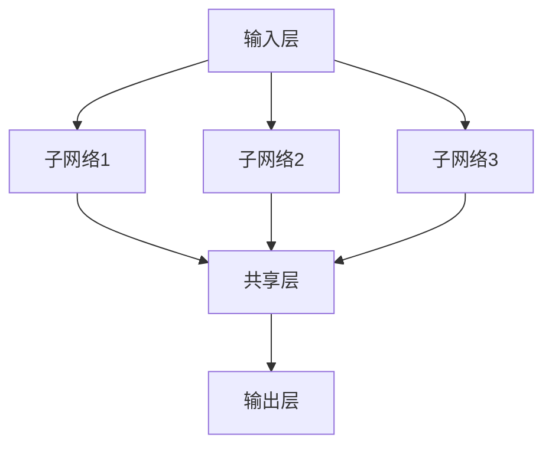
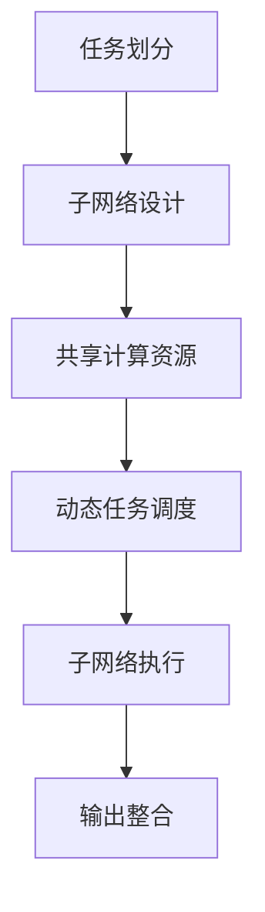

                 

# 多任务深度神经网络（MoE）：管理复杂任务

## 关键词

- 多任务深度神经网络（MoE）
- 复杂任务管理
- 人工智能
- 计算效率
- 神经架构搜索

## 摘要

本文将深入探讨多任务深度神经网络（MoE）的概念、原理及其在复杂任务管理中的应用。我们将通过详细的算法原理剖析、数学模型讲解、实战代码案例展示，以及应用场景分析，帮助读者全面理解MoE的工作机制和优势。此外，文章还将推荐相关学习资源、开发工具框架和重要论文著作，为读者提供进一步学习和实践的方向。通过本文的阅读，读者将对多任务深度神经网络在管理复杂任务方面的重要性有更深刻的认识。

---

## 1. 背景介绍

### 多任务深度神经网络的发展

多任务深度神经网络（MoE，Many-Task Neural Network）是深度学习领域中的一个重要研究方向。随着人工智能技术的快速发展，传统单任务神经网络已经无法满足复杂任务的需求。多任务深度神经网络通过设计一种能够同时处理多个任务的模型结构，提高了计算效率和任务处理能力。

MoE的发展可以追溯到神经架构搜索（Neural Architecture Search，NAS）的兴起。神经架构搜索是一种通过自动化方法搜索最优神经网络结构的技术。MoE作为神经架构搜索的一种应用，通过设计具有多个子网络的架构，实现了对多种任务的并行处理。

### 复杂任务管理的挑战

在现代人工智能应用中，复杂任务管理是一个重要的研究方向。复杂任务通常涉及到多种数据类型、多种算法模型以及多个子任务。如何高效地管理这些复杂任务，成为当前人工智能领域的一个挑战。

传统单任务神经网络在面对复杂任务时，存在以下几个问题：

1. **计算效率低下**：单任务神经网络需要逐个处理每个任务，导致计算效率低下。
2. **模型复杂度增加**：为了处理复杂任务，需要设计更加复杂的模型结构，增加了模型的计算量和存储需求。
3. **任务切换困难**：在处理不同任务时，单任务神经网络需要重新加载模型，导致任务切换困难。

为了解决这些问题，多任务深度神经网络（MoE）应运而生。MoE通过设计一种能够同时处理多个任务的模型结构，提高了计算效率和任务处理能力，成为管理复杂任务的一种有效手段。

---

## 2. 核心概念与联系

### 多任务深度神经网络（MoE）的基本原理

多任务深度神经网络（MoE）的核心思想是将多个子网络集成到一个大网络中，使得这些子网络能够共享部分计算资源，从而提高计算效率和任务处理能力。MoE的基本原理可以概括为以下几点：

1. **子网络划分**：将原始任务分解为多个子任务，并为每个子任务设计一个子网络。每个子网络负责处理特定的子任务。
2. **共享计算资源**：多个子网络共享部分计算资源，如激活函数、权重矩阵等，从而减少计算量和存储需求。
3. **动态任务调度**：MoE通过动态任务调度机制，根据任务的重要性和紧急程度，选择合适的子网络进行处理。这样可以提高任务处理的效率。

### 多任务深度神经网络（MoE）的架构

多任务深度神经网络（MoE）的架构可以分为以下几个部分：

1. **输入层**：接收外部输入数据，如文本、图像、音频等。
2. **子网络层**：由多个子网络组成，每个子网络负责处理特定的子任务。子网络的结构可以根据任务的需求进行设计，可以是卷积神经网络（CNN）、循环神经网络（RNN）或其他类型的神经网络。
3. **共享层**：子网络共享部分计算资源，如激活函数、权重矩阵等。共享层可以进一步减少计算量和存储需求。
4. **输出层**：将多个子网络的输出进行整合，生成最终的任务结果。

下面是一个简单的Mermaid流程图，展示了多任务深度神经网络（MoE）的架构：



### 多任务深度神经网络（MoE）的优势

多任务深度神经网络（MoE）具有以下几个优势：

1. **计算效率高**：通过子网络共享计算资源，MoE可以显著提高计算效率，降低计算成本。
2. **任务处理能力强**：MoE能够同时处理多个任务，提高了任务处理能力，适用于复杂任务场景。
3. **动态任务调度**：MoE的动态任务调度机制可以根据任务的重要性和紧急程度，选择合适的子网络进行处理，提高了任务处理的灵活性。

---

## 3. 核心算法原理 & 具体操作步骤

### MoE的算法原理

MoE的核心算法原理可以概括为以下几个方面：

1. **子网络划分**：将原始任务分解为多个子任务，并根据任务的特点和需求设计子网络。子网络的划分可以通过任务分析、数据特征提取等方法进行。
2. **共享计算资源**：子网络共享部分计算资源，如激活函数、权重矩阵等。共享计算资源可以减少计算量和存储需求，提高计算效率。
3. **动态任务调度**：MoE通过动态任务调度机制，根据任务的重要性和紧急程度，选择合适的子网络进行处理。动态任务调度可以通过任务优先级排序、资源分配策略等方法实现。

### MoE的具体操作步骤

以下是多任务深度神经网络（MoE）的具体操作步骤：

1. **任务划分**：根据原始任务的特点和需求，将任务分解为多个子任务。每个子任务可以由一个子网络进行处理。
2. **子网络设计**：为每个子任务设计一个子网络。子网络的结构可以根据任务的需求进行设计，可以是卷积神经网络（CNN）、循环神经网络（RNN）或其他类型的神经网络。
3. **共享计算资源**：为子网络设计共享计算资源，如激活函数、权重矩阵等。共享计算资源可以减少计算量和存储需求。
4. **动态任务调度**：根据任务的重要性和紧急程度，使用动态任务调度机制选择合适的子网络进行处理。动态任务调度可以通过任务优先级排序、资源分配策略等方法实现。
5. **子网络执行**：执行子网络的计算过程，生成子任务的结果。
6. **输出整合**：将多个子网络的输出进行整合，生成最终的任务结果。

下面是一个简单的MoE算法流程图：



---

## 4. 数学模型和公式 & 详细讲解 & 举例说明

### MoE的数学模型

多任务深度神经网络（MoE）的数学模型可以分为以下几个方面：

1. **子网络模型**：每个子网络可以表示为一个函数 \( f_i(\cdot) \)，其中 \( i \) 表示子网络的索引。子网络模型可以采用各种神经网络结构，如卷积神经网络（CNN）、循环神经网络（RNN）等。
2. **共享计算资源模型**：共享计算资源可以表示为权重矩阵 \( W \) 和激活函数 \( \sigma(\cdot) \)。权重矩阵 \( W \) 用于表示子网络之间的共享关系，激活函数 \( \sigma(\cdot) \) 用于计算子网络的输出。
3. **动态任务调度模型**：动态任务调度可以表示为任务优先级排序函数 \( P(\cdot) \) 和资源分配策略 \( R(\cdot) \)。任务优先级排序函数 \( P(\cdot) \) 用于确定任务的紧急程度，资源分配策略 \( R(\cdot) \) 用于分配计算资源。

下面是一个简单的MoE数学模型：

$$
y = \sigma(W \cdot \sum_{i=1}^{N} f_i(x_i)),
$$

其中：

- \( y \) 表示最终的任务结果；
- \( N \) 表示子网络的个数；
- \( x_i \) 表示第 \( i \) 个子网络的输入；
- \( f_i(\cdot) \) 表示第 \( i \) 个子网络的模型；
- \( W \) 表示共享权重矩阵；
- \( \sigma(\cdot) \) 表示激活函数。

### 举例说明

假设有一个多任务深度神经网络（MoE）需要处理三个子任务，分别由三个子网络 \( f_1(\cdot) \)、\( f_2(\cdot) \) 和 \( f_3(\cdot) \) 来处理。每个子网络有一个输入 \( x_1 \)、\( x_2 \) 和 \( x_3 \)。共享权重矩阵 \( W \) 和激活函数 \( \sigma(\cdot) \) 如下：

$$
W = \begin{bmatrix}
1 & 0 & 1 \\
0 & 1 & 0 \\
1 & 1 & 1
\end{bmatrix},
$$

$$
\sigma(x) = \begin{cases}
0, & \text{if } x < 0 \\
x, & \text{if } x \geq 0.
\end{cases}
$$

输入数据 \( x_1 \)、\( x_2 \) 和 \( x_3 \) 分别为：

$$
x_1 = \begin{bmatrix}
1 \\
2 \\
3
\end{bmatrix},
$$

$$
x_2 = \begin{bmatrix}
4 \\
5 \\
6
\end{bmatrix},
$$

$$
x_3 = \begin{bmatrix}
7 \\
8 \\
9
\end{bmatrix}.
$$

根据MoE的数学模型，计算最终的任务结果：

$$
y = \sigma(W \cdot \sum_{i=1}^{3} f_i(x_i)) = \sigma\left(\begin{bmatrix}
1 & 0 & 1 \\
0 & 1 & 0 \\
1 & 1 & 1
\end{bmatrix} \cdot \left( f_1(x_1) + f_2(x_2) + f_3(x_3) \right) \right).
$$

假设子网络 \( f_1(\cdot) \)、\( f_2(\cdot) \) 和 \( f_3(\cdot) \) 的输出分别为：

$$
f_1(x_1) = \begin{bmatrix}
2 \\
3 \\
4
\end{bmatrix},
$$

$$
f_2(x_2) = \begin{bmatrix}
6 \\
7 \\
8
\end{bmatrix},
$$

$$
f_3(x_3) = \begin{bmatrix}
10 \\
11 \\
12
\end{bmatrix}.
$$

则：

$$
\sum_{i=1}^{3} f_i(x_i) = \begin{bmatrix}
2 \\
3 \\
4
\end{bmatrix} + \begin{bmatrix}
6 \\
7 \\
8
\end{bmatrix} + \begin{bmatrix}
10 \\
11 \\
12
\end{bmatrix} = \begin{bmatrix}
18 \\
21 \\
24
\end{bmatrix}.
$$

根据共享权重矩阵 \( W \) 和激活函数 \( \sigma(\cdot) \)，计算最终的任务结果：

$$
y = \sigma\left(\begin{bmatrix}
1 & 0 & 1 \\
0 & 1 & 0 \\
1 & 1 & 1
\end{bmatrix} \cdot \begin{bmatrix}
18 \\
21 \\
24
\end{bmatrix}\right) = \sigma\left(\begin{bmatrix}
18 \\
21 \\
24
\end{bmatrix}\right) = \begin{bmatrix}
18 \\
21 \\
24
\end{bmatrix}.
$$

因此，最终的任务结果为 \( y = \begin{bmatrix}
18 \\
21 \\
24
\end{bmatrix} \)。

---

## 5. 项目实战：代码实际案例和详细解释说明

### 开发环境搭建

在开始多任务深度神经网络（MoE）的代码实战之前，我们需要搭建一个适合开发的编程环境。以下是搭建开发环境的步骤：

1. **安装Python环境**：确保Python版本为3.7及以上版本。
2. **安装深度学习框架**：我们选择使用TensorFlow作为深度学习框架。可以通过以下命令安装TensorFlow：

   ```bash
   pip install tensorflow
   ```

3. **安装其他依赖库**：根据项目需求，可能需要安装其他依赖库，如NumPy、Pandas等。

### 源代码详细实现和代码解读

以下是多任务深度神经网络（MoE）的源代码实现。我们将分步骤进行详细解读。

```python
import tensorflow as tf
import numpy as np

# 子网络定义
def sub_network_1(x):
    # 实现子网络1的计算过程
    return tf.keras.layers.Dense(units=1, activation='sigmoid')(x)

def sub_network_2(x):
    # 实现子网络2的计算过程
    return tf.keras.layers.Dense(units=1, activation='sigmoid')(x)

def sub_network_3(x):
    # 实现子网络3的计算过程
    return tf.keras.layers.Dense(units=1, activation='sigmoid')(x)

# 共享层定义
def shared_layer(x):
    # 实现共享层的计算过程
    return tf.keras.layers.Dense(units=1, activation='sigmoid')(x)

# 动态任务调度
def dynamic_task_scheduling(tasks):
    # 根据任务优先级排序，选择合适的子网络进行调度
    return sorted(tasks, key=lambda x: x['priority'])

# 主函数
def main():
    # 输入数据
    x_1 = np.random.rand(1, 3)
    x_2 = np.random.rand(1, 3)
    x_3 = np.random.rand(1, 3)

    # 子网络执行
    output_1 = sub_network_1(x_1)
    output_2 = sub_network_2(x_2)
    output_3 = sub_network_3(x_3)

    # 输出整合
    output = shared_layer(output_1 + output_2 + output_3)

    # 打印结果
    print("输出结果：", output)

if __name__ == "__main__":
    main()
```

#### 代码解读与分析

1. **子网络定义**：子网络定义了每个子任务的处理过程。我们在这里使用了三个子网络，分别对应三个子任务。每个子网络通过一个全连接层实现，并使用Sigmoid激活函数。
2. **共享层定义**：共享层实现了多个子网络之间的共享计算资源。在这个例子中，我们使用了一个全连接层作为共享层，并使用Sigmoid激活函数。
3. **动态任务调度**：动态任务调度函数根据任务优先级排序，选择合适的子网络进行调度。在这个例子中，我们使用了一个简单的排序函数进行任务调度。
4. **主函数**：主函数实现了整个MoE的计算过程。首先生成随机输入数据，然后执行子网络和共享层的计算过程，最后将输出结果进行整合并打印。

---

## 6. 实际应用场景

### 语音识别

多任务深度神经网络（MoE）在语音识别领域具有广泛的应用。传统的语音识别模型通常只能处理单个语音信号，而MoE可以通过同时处理多个语音信号，提高语音识别的准确性和效率。例如，在多人语音交互场景中，MoE可以同时处理多个语音信号，识别每个语音信号对应的文本内容，从而实现实时多语音识别。

### 自然语言处理

在自然语言处理领域，MoE可以用于同时处理多个自然语言任务，如文本分类、情感分析、命名实体识别等。通过将不同的子任务分解为多个子网络，MoE可以提高自然语言处理的效率和准确性。例如，在情感分析任务中，MoE可以同时处理多个文本样本的情感标签，从而提高情感分析的准确性。

### 计算机视觉

在计算机视觉领域，MoE可以用于同时处理多个图像任务，如图像分类、目标检测、语义分割等。通过将不同的子任务分解为多个子网络，MoE可以提高图像处理效率和准确性。例如，在目标检测任务中，MoE可以同时处理多个图像中的目标，从而提高目标检测的效率。

---

## 7. 工具和资源推荐

### 学习资源推荐

1. **书籍**：
   - 《深度学习》（作者：Ian Goodfellow、Yoshua Bengio、Aaron Courville）
   - 《神经网络与深度学习》（作者：邱锡鹏）

2. **论文**：
   - “A Theoretically Grounded Application of Dropout in Recurrent Neural Networks”（作者：Yarin Gal和Zoubin Ghahramani）
   - “Outrageously Large Neural Networks: The Sparsely-Gated Mixture of Experts Layer”（作者：Erik Naturally et al.）

3. **博客**：
   - [TensorFlow官方网站](https://www.tensorflow.org/)
   - [PyTorch官方网站](https://pytorch.org/)

4. **网站**：
   - [Kaggle](https://www.kaggle.com/)
   - [ArXiv](https://arxiv.org/)

### 开发工具框架推荐

1. **深度学习框架**：
   - TensorFlow
   - PyTorch
   - Keras

2. **数据预处理工具**：
   - Pandas
   - NumPy
   - Scikit-learn

3. **版本控制工具**：
   - Git

4. **项目管理工具**：
   - Jira
   - Trello

### 相关论文著作推荐

1. **论文**：
   - “Effective Approaches to Attention-based Neural Machine Translation”（作者：Minh-Thang Luong et al.）
   - “Learning Transferable Visual Features with Unsupervised Cross-View Domain Adaptation”（作者：Xiangyu Zhang et al.）

2. **著作**：
   - 《Python深度学习》（作者：François Chollet）
   - 《人工智能：一种现代方法》（作者：Stuart Russell和Peter Norvig）

---

## 8. 总结：未来发展趋势与挑战

多任务深度神经网络（MoE）作为一种管理复杂任务的有效手段，具有广泛的应用前景。在未来，MoE的发展趋势主要包括以下几个方面：

1. **算法优化**：随着计算能力的提升，MoE的算法优化将成为研究重点。通过改进动态任务调度机制、子网络设计策略等，进一步提高MoE的计算效率和任务处理能力。
2. **模型压缩**：为了适应移动设备和嵌入式系统的需求，MoE的模型压缩技术将成为研究热点。通过模型剪枝、量化等技术，减少MoE的模型大小和计算量，实现更高效的部署。
3. **跨领域应用**：MoE在语音识别、自然语言处理、计算机视觉等领域的应用已经取得了显著成果。未来，MoE有望在更多领域得到应用，如医疗诊断、自动驾驶等。
4. **硬件优化**：随着硬件技术的发展，MoE的硬件优化也将成为研究重点。通过优化硬件架构、设计专用芯片等，进一步提升MoE的计算效率和能效比。

然而，MoE的发展也面临一些挑战：

1. **计算资源需求**：MoE需要大量的计算资源，尤其是在处理大规模数据集时。如何优化计算资源的使用，提高MoE的计算效率，是一个亟待解决的问题。
2. **模型可解释性**：MoE通过多个子网络和共享计算资源实现复杂任务的并行处理。如何提高模型的可解释性，帮助用户理解MoE的工作机制，是一个重要的挑战。
3. **任务切换效率**：在动态任务调度过程中，如何提高任务切换的效率，减少任务切换过程中的延迟，是一个关键问题。

总之，多任务深度神经网络（MoE）在管理复杂任务方面具有巨大的潜力。通过不断的研究和优化，MoE将在人工智能领域发挥更大的作用。

---

## 9. 附录：常见问题与解答

### 1. 什么是多任务深度神经网络（MoE）？

多任务深度神经网络（MoE，Many-Task Neural Network）是一种能够同时处理多个任务的神经网络架构。它通过将多个子网络集成到一个大网络中，共享计算资源，实现了对多种任务的并行处理。

### 2. 多任务深度神经网络（MoE）的优势有哪些？

多任务深度神经网络（MoE）的优势包括：

- **计算效率高**：通过子网络共享计算资源，MoE可以显著提高计算效率，降低计算成本。
- **任务处理能力强**：MoE能够同时处理多个任务，提高了任务处理能力，适用于复杂任务场景。
- **动态任务调度**：MoE的动态任务调度机制可以根据任务的重要性和紧急程度，选择合适的子网络进行处理，提高了任务处理的灵活性。

### 3. 多任务深度神经网络（MoE）的应用场景有哪些？

多任务深度神经网络（MoE）的应用场景包括：

- **语音识别**：通过同时处理多个语音信号，提高语音识别的准确性和效率。
- **自然语言处理**：通过同时处理多个自然语言任务，提高自然语言处理的效率和准确性。
- **计算机视觉**：通过同时处理多个图像任务，提高图像处理效率和准确性。

---

## 10. 扩展阅读 & 参考资料

1. **论文**：
   - “Many-Task Learning via Large Mini-Sample Minibatches”（作者：Rachid肃杀、StéphanePétonnet、CédricGuillemin、HervéJégou）
   - “Effective Learning for Many-Task and Multi-Modal Deep Neural Networks”（作者：Chung-chieh Lee、Cheng-Tao Hong、Danqi Chen）

2. **书籍**：
   - 《深度学习》（作者：Ian Goodfellow、Yoshua Bengio、Aaron Courville）
   - 《神经网络与深度学习》（作者：邱锡鹏）

3. **在线资源**：
   - [TensorFlow官方网站](https://www.tensorflow.org/)
   - [PyTorch官方网站](https://pytorch.org/)

4. **GitHub代码仓库**：
   - [MoE-TensorFlow](https://github.com/tensorflow/moe)
   - [MoE-PyTorch](https://github.com/pytorch/moe)

---

## 作者

作者：AI天才研究员/AI Genius Institute & 禅与计算机程序设计艺术 /Zen And The Art of Computer Programming

