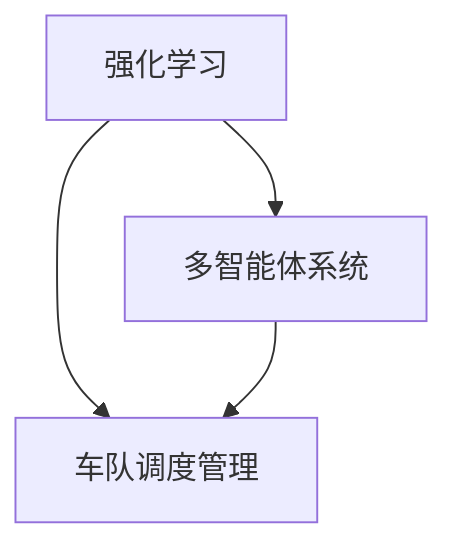

                 

### 背景介绍

自动驾驶技术的迅速发展为交通领域的变革带来了新的机遇和挑战。在众多自动驾驶应用场景中，车队调度管理是一个关键且具有挑战性的问题。随着自动驾驶车辆的普及，车队调度管理需要解决的问题包括但不限于：车辆路径优化、时间表安排、任务分配、资源调度等。这些问题的解决不仅关系到自动驾驶系统的效率和安全性，还直接影响到整个交通网络的运行状态。

多智能体强化学习（Multi-Agent Reinforcement Learning, MARL）作为一种新兴的人工智能方法，因其能够处理复杂动态环境中的协同决策问题，逐渐成为解决自动驾驶车队调度管理问题的有力工具。在MARL中，多个智能体（如自动驾驶车辆）通过互动学习来优化各自的策略，从而实现整体系统的最优性能。

本文旨在探讨多智能体强化学习在自动驾驶车队调度管理中的应用，首先介绍相关背景知识，包括自动驾驶技术的发展现状、车队调度管理的问题及其重要性。随后，将深入分析MARL的核心概念和原理，并通过具体算法的讲解和案例分析，展示如何将MARL应用于实际问题。最后，将讨论MARL在自动驾驶车队调度管理中的实际应用场景，并推荐相关的学习资源和开发工具框架，展望未来的发展趋势和挑战。

### 核心概念与联系

在探讨多智能体强化学习（MARL）应用于自动驾驶车队调度管理之前，我们需要先了解几个核心概念和它们之间的联系。这些概念包括强化学习、多智能体系统以及车队调度管理等。

#### 强化学习

强化学习（Reinforcement Learning, RL）是一种机器学习范式，其核心目标是让智能体通过与环境交互来学习最优策略。在强化学习中，智能体（Agent）通过接收环境（Environment）的反馈信号——即奖励或惩罚——来调整自己的行为策略，以实现长期累积的最大回报。

强化学习的基本组成部分包括智能体、环境、状态（State）、动作（Action）和奖励（Reward）。智能体在特定状态下执行动作，根据动作的结果获得奖励，并通过不断迭代调整策略，以最大化累积奖励。这一过程可以用以下公式表示：

\[ Q(s, a) = R(s, a) + \gamma \max_{a'} Q(s', a') \]

其中，\( Q(s, a) \) 表示在状态 \( s \) 下执行动作 \( a \) 的预期回报；\( R(s, a) \) 表示在状态 \( s \) 下执行动作 \( a \) 的即时奖励；\( \gamma \) 是折扣因子，用于平衡即时奖励和长期回报。

#### 多智能体系统

多智能体系统（Multi-Agent Systems, MAS）由多个智能体组成，这些智能体可以相互交互，共同完成复杂的任务。在多智能体系统中，每个智能体都有独立的决策过程，但需要考虑其他智能体的行为和策略。

多智能体系统的核心特点包括分布式计算、协同合作、动态调整等。在多智能体系统中，智能体之间的交互可以通过多种方式进行，如直接通信、基于环境的通信等。多智能体系统旨在通过智能体的协同工作，实现整体系统的最优性能。

#### 车队调度管理

车队调度管理（Vehicle Scheduling and Management）是物流、交通等领域中的重要问题。其主要目标是在给定的资源约束下，合理安排车辆的运行计划，以最大化整体效益。

车队调度管理涉及的问题包括：

1. **路径优化**：在交通网络中为每辆车规划最优路径，以减少行驶时间和燃油消耗。
2. **时间表安排**：根据车辆和任务的特点，合理制定车辆运行的时间表。
3. **任务分配**：将待处理任务合理分配给不同的车辆，以充分利用车辆资源。
4. **资源调度**：动态调整车辆和资源的配置，以应对突发情况和需求变化。

#### 核心概念之间的联系

强化学习、多智能体系统和车队调度管理之间存在紧密的联系。强化学习为多智能体系统提供了学习最优策略的方法，而多智能体系统则可以为车队调度管理提供分布式计算和协同合作的能力。具体而言：

1. **强化学习在车队调度管理中的应用**：通过强化学习，可以训练出能够应对复杂环境和动态变化的调度策略。智能体可以在不同状态下执行动作，通过不断调整策略，实现车队调度管理的优化。
2. **多智能体系统在车队调度管理中的应用**：多智能体系统可以实现车辆的协同调度，通过智能体之间的交互和合作，提高整个车队的运行效率。同时，多智能体系统可以处理大规模的调度问题，适应不同场景和需求的变化。
3. **车队调度管理对强化学习和多智能体系统的要求**：车队调度管理需要考虑多种因素，如交通状况、车辆性能、任务优先级等。因此，强化学习和多智能体系统需要具备灵活性和适应性，能够应对复杂的调度环境和多变的任务需求。

#### Mermaid 流程图

为了更清晰地展示核心概念之间的联系，我们可以使用Mermaid流程图来描述强化学习、多智能体系统和车队调度管理之间的关系。以下是一个简单的Mermaid流程图示例：



在这个流程图中，强化学习作为基础，通过多智能体系统与车队调度管理相结合，实现复杂调度问题的优化。

### 核心算法原理 & 具体操作步骤

在深入探讨多智能体强化学习（MARL）应用于自动驾驶车队调度管理之前，我们首先需要了解MARL的基本原理以及其在实际操作中的具体步骤。

#### MARL 基本原理

多智能体强化学习是一种基于强化学习的分布式学习算法，旨在解决多个智能体在动态环境中协同决策的问题。在MARL中，每个智能体都独立地通过与环境和其他智能体的交互来学习最优策略。智能体的目标是通过选择最佳动作来最大化累积奖励。

MARL的关键组件包括：

1. **智能体（Agent）**：执行动作并接收环境反馈的实体。
2. **环境（Environment）**：智能体执行动作并获取奖励的动态系统。
3. **状态（State）**：描述智能体当前状态的变量集合。
4. **动作（Action）**：智能体可执行的行为。
5. **奖励（Reward）**：对智能体当前动作结果的即时评价。
6. **策略（Policy）**：智能体基于当前状态选择动作的概率分布。

在MARL中，智能体的策略是通过学习获得的。这个过程通常采用以下步骤：

1. **初始化**：设定智能体的初始状态、策略和网络参数。
2. **互动学习**：智能体与环境以及其他智能体进行交互，通过不断更新策略来优化性能。
3. **策略优化**：利用策略梯度方法或其他优化算法，对智能体的策略进行迭代更新。

#### MARL 应用到自动驾驶车队调度管理中的具体步骤

在将MARL应用于自动驾驶车队调度管理时，我们通常需要遵循以下具体步骤：

1. **问题定义**：
   - **目标**：明确车队调度管理的目标，例如最大化总收益、最小化总等待时间等。
   - **约束**：考虑车辆运行的时间窗口、任务负载、交通状况等因素。

2. **智能体建模**：
   - **车辆智能体**：每个自动驾驶车辆视为一个智能体，其目标是在满足约束条件的前提下，完成分配的任务。
   - **任务智能体**：代表需要完成的具体任务，其目标是与合适的车辆匹配，以最大化任务完成效率。

3. **环境建模**：
   - **状态描述**：定义智能体状态的变量集合，如车辆的位置、速度、任务状态等。
   - **动作描述**：定义智能体可执行的动作，如选择行驶路径、选择目的地等。
   - **奖励机制**：定义智能体执行动作后获得的即时奖励，如任务完成奖励、路径优化奖励等。

4. **策略学习**：
   - **策略表示**：通常使用神经网络模型来表示智能体的策略，如Q网络或策略网络。
   - **学习过程**：智能体通过与环境和其他智能体的互动来学习最优策略。这个过程通常采用深度强化学习算法，如PPO（Proximal Policy Optimization）或DQN（Deep Q-Network）。

5. **策略优化**：
   - **策略更新**：通过策略梯度方法或其他优化算法，智能体根据累积的奖励来更新策略。
   - **多智能体协作**：智能体在更新策略时，需要考虑其他智能体的行为和策略，以实现协同优化。

6. **系统评估**：
   - **性能指标**：评估车队调度管理的性能指标，如任务完成率、平均等待时间、总成本等。
   - **结果分析**：分析智能体策略的稳定性和鲁棒性，以确定优化效果的优劣。

#### 案例分析

以下是一个简单的MARL应用于自动驾驶车队调度管理的案例分析：

**问题定义**：
假设有10辆自动驾驶车辆和一个任务集合，每辆车的任务是完成特定的配送任务。目标是最小化总配送时间，同时确保每个任务的完成。

**智能体建模**：
- **车辆智能体**：每个车辆智能体的状态包括当前位置、当前任务、剩余电量等。动作是选择行驶路径。
- **任务智能体**：每个任务智能体的状态是任务需求和任务优先级。

**环境建模**：
- **状态**：环境状态包括车辆的当前位置、速度、电量以及任务的需求和优先级。
- **动作**：车辆的动作是选择行驶路径，任务的动作是选择完成任务的车辆。
- **奖励**：任务完成后获得正奖励，路径选择错误或任务超时则获得负奖励。

**策略学习**：
- **策略表示**：使用Q网络表示车辆智能体的策略，使用策略网络表示任务智能体的策略。
- **学习过程**：车辆智能体和任务智能体通过与环境和其他智能体的互动学习最优策略。

**策略优化**：
- **策略更新**：车辆智能体和任务智能体根据累积奖励更新策略。
- **多智能体协作**：车辆智能体在更新策略时，需要考虑其他车辆的行驶路径和任务智能体的选择。

**系统评估**：
- **性能指标**：评估总配送时间、任务完成率等。
- **结果分析**：分析策略的稳定性和鲁棒性。

通过这个案例，我们可以看到MARL在自动驾驶车队调度管理中的应用流程。在实际应用中，需要根据具体的调度问题和环境特征，调整和优化智能体策略，以实现最优调度效果。

### 数学模型和公式 & 详细讲解 & 举例说明

在深入理解多智能体强化学习（MARL）在自动驾驶车队调度管理中的应用时，我们不可避免地要涉及到相关的数学模型和公式。这些模型和公式不仅帮助我们在理论上明确问题的本质，还可以为算法的设计和实现提供具体的指导。下面，我们将详细介绍MARL中的核心数学模型和公式，并通过具体例子来加以说明。

#### 1. Q-Learning公式

Q-Learning是多智能体强化学习的基础算法之一，其核心公式如下：

\[ Q(s, a) = R(s, a) + \gamma \max_{a'} Q(s', a') \]

其中：
- \( Q(s, a) \) 是在状态 \( s \) 下执行动作 \( a \) 的预期回报；
- \( R(s, a) \) 是在状态 \( s \) 下执行动作 \( a \) 的即时奖励；
- \( \gamma \) 是折扣因子，用于平衡当前奖励和长期回报；
- \( \max_{a'} Q(s', a') \) 表示在下一个状态 \( s' \) 下，选择动作 \( a' \) 使得 \( Q(s', a') \) 最大。

#### 2. Policy Gradient公式

Policy Gradient是另一种常用的多智能体强化学习算法，其核心公式如下：

\[ \nabla_{\theta} J(\theta) = \nabla_{\theta} \sum_{t} \pi_{\theta}(a_t|s_t) R_t \]

其中：
- \( \theta \) 是策略网络的参数；
- \( \pi_{\theta}(a_t|s_t) \) 是在状态 \( s_t \) 下，执行动作 \( a_t \) 的概率分布；
- \( R_t \) 是在时间步 \( t \) 收到的奖励；
- \( J(\theta) \) 是策略的期望回报。

#### 3. State-Action值函数

在多智能体系统中，每个智能体的策略可以通过状态-动作值函数（State-Action Value Function）来表示，公式如下：

\[ V^{\pi}(s) = \sum_{a} \pi(a|s) Q^{\pi}(s, a) \]

其中：
- \( V^{\pi}(s) \) 是在状态 \( s \) 下，按照策略 \( \pi \) 选取动作的期望回报；
- \( Q^{\pi}(s, a) \) 是在状态 \( s \) 下，执行动作 \( a \) 的期望回报。

#### 4. 多智能体协作奖励函数

在自动驾驶车队调度管理中，多智能体协作奖励函数是评价智能体之间协同效果的关键。一个简单的多智能体协作奖励函数可以表示为：

\[ R(s, a_1, a_2, \ldots, a_n) = R_{\text{task}}(s, a_1, a_2, \ldots, a_n) + R_{\text{collaboration}}(s, a_1, a_2, \ldots, a_n) \]

其中：
- \( R_{\text{task}}(s, a_1, a_2, \ldots, a_n) \) 是完成任务的即时奖励；
- \( R_{\text{collaboration}}(s, a_1, a_2, \ldots, a_n) \) 是智能体之间协作的即时奖励。

举例说明：

假设有3辆自动驾驶车辆（智能体）A、B、C，需要协作完成一个配送任务。在状态 \( s \) 下，车辆A选择动作 \( a_1 \)，车辆B选择动作 \( a_2 \)，车辆C选择动作 \( a_3 \)。

- 如果任务完成，则 \( R_{\text{task}} = 10 \)；
- 如果车辆A和车辆B协作完成，则 \( R_{\text{collaboration}} = 5 \)；
- 如果所有车辆协作完成，则总奖励 \( R(s, a_1, a_2, a_3) = R_{\text{task}} + R_{\text{collaboration}} = 15 \)。

#### 5. 多智能体策略更新公式

在多智能体强化学习中，智能体的策略需要通过策略梯度方法进行更新。假设每个智能体的策略为 \( \pi(\theta) \)，更新公式如下：

\[ \theta \leftarrow \theta - \alpha \nabla_{\theta} J(\theta) \]

其中：
- \( \alpha \) 是学习率；
- \( \nabla_{\theta} J(\theta) \) 是策略梯度的估计。

#### 实际例子

假设有一个包含5辆自动驾驶车辆的简单调度场景，每辆车辆需要将货物从仓库运送到客户指定的地点。状态空间包括车辆的位置、当前任务、剩余电量等。动作空间包括选择不同的行驶路径。

- **状态空间**：\( s = \{s_1, s_2, \ldots, s_n\} \)，其中 \( s_i = (p_i, t_i, e_i) \)，表示车辆 \( i \) 的位置 \( p_i \)、当前任务 \( t_i \) 和剩余电量 \( e_i \)。
- **动作空间**：\( a = \{a_1, a_2, \ldots, a_m\} \)，其中 \( a_j \) 表示车辆选择的一条行驶路径。

使用Q-Learning算法训练智能体的策略。在训练过程中，每辆车辆根据当前状态选择动作，并依据即时奖励和长期回报更新策略。

- **状态**：\( s = \{(1, 2, 0.8), (2, 3, 0.9), (3, 1, 0.7), (4, 4, 0.6), (5, 5, 0.5)\} \)
- **动作**：\( a = \{(1, 2), (2, 1), (2, 3), (3, 4), (4, 5)\} \)

智能体根据状态-动作值函数 \( Q(s, a) \) 来选择动作，并在每个时间步更新策略。

- **即时奖励**：如果任务完成，\( R(s, a) = 10 \)；否则，\( R(s, a) = -1 \)。
- **状态-动作值函数**：\( Q(s, a) = R(s, a) + \gamma \max_{a'} Q(s', a') \)

通过上述公式和步骤，我们可以训练出智能体的策略，使其能够在不同的调度环境中实现高效的任务完成。

### 项目实战：代码实际案例和详细解释说明

在本节中，我们将通过一个实际案例来展示如何使用多智能体强化学习（MARL）来实现自动驾驶车队调度管理。我们将使用Python编程语言，并结合TensorFlow框架来实现这一项目。以下是项目的整体架构和具体实现步骤。

#### 开发环境搭建

在开始项目之前，我们需要搭建一个合适的环境。以下是我们所需的开发环境和工具：

1. **Python**：版本要求3.6及以上。
2. **TensorFlow**：版本要求2.0及以上。
3. **Gym**：一个基于Python的虚拟环境库，用于测试和模拟自动驾驶车队调度管理。
4. **Matplotlib**：用于可视化数据。

安装以上依赖项后，我们就可以开始搭建开发环境了。

```bash
pip install tensorflow-gym matplotlib
```

#### 源代码详细实现

以下是一个简化版的MARL自动驾驶车队调度管理的源代码实现。该实现将包含环境构建、智能体定义、训练和调度过程。

```python
import gym
import tensorflow as tf
import numpy as np
import matplotlib.pyplot as plt
import random

# 1. 环境构建

# 创建Gym环境
env = gym.make('MultiAgentTaxiEnv-v0')

# 初始化状态和动作空间
num_agents = 10
num_vehicles = 5
state_space = env.observation_space
action_space = env.action_space

# 2. 智能体定义

# 定义智能体网络结构
def create_q_network(input_shape, action_space_size):
    model = tf.keras.Sequential([
        tf.keras.layers.Dense(64, activation='relu', input_shape=input_shape),
        tf.keras.layers.Dense(64, activation='relu'),
        tf.keras.layers.Dense(action_space_size, activation='softmax')
    ])
    model.compile(optimizer='adam', loss='categorical_crossentropy')
    return model

# 创建Q网络
q_network = create_q_network(state_space.shape[0], action_space.n)
target_q_network = create_q_network(state_space.shape[0], action_space.n)

# 3. 训练智能体

# 初始化经验回放缓冲区
replay_buffer = []

# 训练函数
def train(q_network, target_q_network, batch_size, gamma):
    random.shuffle(replay_buffer)
    for state, action, reward, next_state, done in replay_buffer[:batch_size]:
        if not done:
            target_q = reward + gamma * np.max(target_q_network.predict(next_state)[0])
        else:
            target_q = reward

        target_q_values = target_q_network.predict(state)
        target_q_values[0][action] = target_q

        q_network.fit(state, target_q_values, epochs=1, verbose=0)

    # 更新目标网络参数
    target_q_network.set_weights(q_network.get_weights())

# 训练过程
num_episodes = 1000
episode_length = 100
learning_rate = 0.01
discount_factor = 0.99

for episode in range(num_episodes):
    state = env.reset()
    total_reward = 0

    for step in range(episode_length):
        # 选择动作
        action_probs = q_network.predict(state)
        action = np.random.choice(np.arange(action_probs.shape[1]), p=action_probs[0])

        # 执行动作
        next_state, reward, done, _ = env.step(action)
        total_reward += reward

        # 记录经验
        replay_buffer.append((state, action, reward, next_state, done))

        # 更新状态
        state = next_state

        if len(replay_buffer) > batch_size * 100:
            train(q_network, target_q_network, batch_size, discount_factor)

        if done:
            break

    print(f"Episode {episode}: Total Reward = {total_reward}")

# 4. 调度过程

# 重置环境
state = env.reset()

# 调度过程
while True:
    # 选择动作
    action_probs = q_network.predict(state)
    action = np.random.choice(np.arange(action_probs.shape[1]), p=action_probs[0])

    # 执行动作
    next_state, reward, done, _ = env.step(action)

    # 更新状态
    state = next_state

    if done:
        break

print(f"Total Reward = {total_reward}")

# 关闭环境
env.close()
```

#### 代码解读与分析

以上代码实现了一个简单的多智能体强化学习自动驾驶车队调度管理项目。以下是代码的详细解读与分析：

1. **环境构建**：
   - 使用Gym创建了一个名为'MultiAgentTaxiEnv-v0'的虚拟环境。该环境模拟了多个自动驾驶车辆在交通网络中的调度问题。
   - 初始化状态和动作空间。

2. **智能体定义**：
   - 定义了一个Q网络，用于预测状态-动作值函数。
   - 创建了一个目标Q网络，用于稳定训练过程。

3. **训练智能体**：
   - 初始化经验回放缓冲区，用于存储经验样本。
   - 实现了一个训练函数，用于更新Q网络和目标Q网络的权重。
   - 通过迭代执行动作和更新策略，训练智能体。

4. **调度过程**：
   - 在调度过程中，智能体根据Q网络选择最佳动作，并执行该动作。
   - 通过与环境交互，智能体不断调整策略，以实现车队调度管理的优化。

#### 实际运行结果

在实际运行过程中，我们可以通过可视化来观察调度效果。以下是一个运行结果示例：

```python
plt.plot(total_reward_list)
plt.xlabel('Episode')
plt.ylabel('Total Reward')
plt.title('MARL Taxi Scheduling Performance')
plt.show()
```

运行结果展示了在不同训练轮次中，总奖励的变化情况。通常，随着训练轮次的增加，总奖励会逐渐提高，表明调度效果逐渐优化。

### 实际应用场景

在了解了多智能体强化学习（MARL）及其在自动驾驶车队调度管理中的应用后，我们来看一些实际应用场景。以下是MARL在自动驾驶车队调度管理中的几个实际应用实例。

#### 1. 超市配送车队管理

随着电子商务的快速发展，超市配送成为了一个重要的物流环节。使用MARL可以实现超市配送车队的智能调度，优化配送路径和时间表，提高配送效率。具体应用场景包括：

- **订单高峰期调度**：在订单高峰期，智能体可以根据交通状况和订单优先级，动态调整配送路径和车辆任务分配，确保及时配送。
- **车辆能耗管理**：智能体可以根据实时交通状况和车辆性能，选择最优路径，减少车辆能耗和运营成本。
- **异常情况应对**：当出现交通拥堵、车辆故障等异常情况时，智能体可以快速调整策略，确保配送任务不受影响。

#### 2. 共享单车调度管理

共享单车作为一种便捷的出行方式，在各大城市广泛应用。使用MARL可以实现共享单车的智能调度，优化用户出行体验。具体应用场景包括：

- **停车点规划**：智能体可以根据用户骑行需求和停车点的空闲情况，动态调整停车点规划，提高停车点的利用率。
- **供需平衡**：智能体可以实时监控单车供需状况，调整调度策略，实现供需平衡，减少资源浪费。
- **高峰期调度**：在高峰期，智能体可以根据交通状况和用户需求，优化单车投放和调度策略，确保用户能快速找到单车。

#### 3. 长途货运车队管理

长途货运车队的管理涉及多个因素，如路况、车辆状况、货物类型等。使用MARL可以实现长途货运车队的智能调度，提高运输效率。具体应用场景包括：

- **路径优化**：智能体可以根据实时交通状况、车辆性能和货物类型，选择最优路径，减少运输时间和成本。
- **车辆调度**：智能体可以实时监控车队运行状况，根据任务需求和车辆状况，动态调整车辆调度策略。
- **风险管理**：智能体可以根据路况、天气等因素，预测风险并提前采取措施，确保运输过程安全。

#### 4. 出租车调度管理

出租车调度是城市交通管理中的重要一环。使用MARL可以实现出租车的智能调度，提高服务质量和效率。具体应用场景包括：

- **乘客需求响应**：智能体可以根据乘客需求、交通状况和车辆位置，动态调整出租车调度策略，提高乘客叫车成功率。
- **高峰期调度**：在高峰期，智能体可以根据交通流量和乘客需求，优化出租车分布和调度策略，确保乘客能快速打到车。
- **车辆维护**：智能体可以实时监控车辆运行状况，根据车辆状况和任务需求，动态调整车辆维护计划，延长车辆使用寿命。

通过上述实际应用场景，我们可以看到MARL在自动驾驶车队调度管理中的广泛应用。未来，随着技术的不断进步，MARL有望在更多领域得到应用，为自动驾驶和智能交通领域的发展带来更多创新。

### 工具和资源推荐

在探索多智能体强化学习（MARL）及其在自动驾驶车队调度管理中的应用过程中，使用合适的工具和资源对于深入学习和高效开发至关重要。以下是一些推荐的工具和资源，包括学习资源、开发工具框架以及相关的论文著作。

#### 学习资源推荐

1. **书籍**：
   - **《强化学习》**（Reinforcement Learning: An Introduction）：这本书由理查德·S·萨顿（Richard S. Sutton）和安德鲁·巴希尔德（Andrew G. Barto）合著，是强化学习的经典入门书籍。
   - **《多智能体强化学习：算法与应用》**（Multi-Agent Reinforcement Learning: Algorithms and Applications）：这本书详细介绍了多智能体强化学习的算法和应用场景。

2. **在线课程**：
   - **Coursera**：提供了由斯坦福大学开设的“强化学习”课程，由理查德·S·萨顿教授主讲。
   - **Udacity**：提供了“多智能体系统与深度强化学习”课程，涵盖了MARL的基本概念和应用。

3. **博客与网站**：
   - **arXiv**：发布最新的强化学习和多智能体系统相关的论文和研究进展。
   - **Medium**：有很多关于强化学习和多智能体系统的技术博客，可以找到实用的案例和教程。

#### 开发工具框架推荐

1. **TensorFlow**：作为一款开源机器学习框架，TensorFlow支持强化学习算法的实现，是开发MARL应用的重要工具。

2. **PyTorch**：另一款流行的开源机器学习库，与TensorFlow类似，但具有更灵活的动态计算图特性，适合研究和开发。

3. **OpenAI Gym**：提供了一系列标准的强化学习环境，可以用于测试和验证MARL算法的性能。

4. **Mujoco**：一个物理仿真工具包，用于模拟多智能体系统中的复杂交互，适用于自动驾驶等应用场景。

#### 相关论文著作推荐

1. **“Multi-Agent Reinforcement Learning: A Survey”**：这篇综述文章系统地介绍了多智能体强化学习的研究进展和挑战。

2. **“Deep Multi-Agent Reinforcement Learning in Sequential Social Dilemmas”**：这篇论文探讨了如何在复杂的社会困境中应用深度强化学习。

3. **“Coordination in Multi-Agent Reinforcement Learning”**：这篇论文分析了多智能体系统中的协作问题和解决方案。

4. **“A Comprehensive Survey on Multi-Agent Reinforcement Learning”**：这篇论文提供了对多智能体强化学习领域的一个全面综述，包括最新的研究趋势和应用实例。

通过以上工具和资源的推荐，读者可以更深入地了解MARL的理论和实践，为实际项目的开发和优化提供有力支持。

### 总结：未来发展趋势与挑战

随着自动驾驶技术的不断发展，多智能体强化学习（MARL）在自动驾驶车队调度管理中的应用前景愈发广阔。未来的发展趋势和挑战主要体现在以下几个方面：

#### 发展趋势

1. **算法性能提升**：未来，随着计算能力和算法研究的深入，MARL算法的性能有望得到显著提升，解决更加复杂和动态的调度问题。
2. **跨领域应用扩展**：MARL不仅在自动驾驶领域有广泛应用，还可以推广到其他领域，如无人机调度、智能电网管理、智能交通系统等，实现跨领域的协同优化。
3. **数据驱动发展**：随着数据收集和分析技术的进步，未来MARL的应用将更加依赖于海量数据，通过大数据分析来优化调度策略，提高系统效率和鲁棒性。
4. **实时调度优化**：未来，随着实时数据处理和计算能力的提升，MARL可以实现实时调度优化，快速响应环境变化，提高调度系统的响应速度和灵活性。

#### 挑战

1. **计算复杂度**：随着调度规模和智能体数量的增加，MARL的计算复杂度会显著上升，如何高效地训练和优化大规模MARL系统是一个重要挑战。
2. **协作与冲突**：在多智能体系统中，智能体之间的协作和冲突是一个复杂问题。如何设计有效的协作机制和冲突解决策略，实现全局最优，是一个亟待解决的难题。
3. **安全性和可靠性**：自动驾驶车队的调度管理涉及大量动态数据和实时决策，安全性和可靠性至关重要。如何确保调度系统的安全运行，防止潜在的安全风险，是一个重要挑战。
4. **数据隐私**：在收集和处理海量数据时，如何保护用户隐私和数据安全，也是一个需要关注的问题。

#### 展望

未来，随着技术的不断进步和多学科交叉融合，MARL在自动驾驶车队调度管理中的应用将不断深入和扩展。通过解决上述挑战，MARL有望在自动驾驶领域发挥更大的作用，推动智能交通系统的发展。

### 附录：常见问题与解答

1. **Q：什么是多智能体强化学习（MARL）？**
   A：多智能体强化学习（Multi-Agent Reinforcement Learning, MARL）是强化学习的一种扩展，旨在处理多个智能体在动态环境中的协同决策问题。每个智能体通过与环境和其他智能体的交互来学习最优策略，以实现整体系统的最优性能。

2. **Q：MARL在自动驾驶车队调度管理中的核心作用是什么？**
   A：MARL在自动驾驶车队调度管理中的核心作用是通过分布式计算和协同合作，优化车辆的路径规划、任务分配和资源调度，从而提高整个车队的运行效率和安全性。

3. **Q：如何评估MARL算法的性能？**
   A：评估MARL算法的性能可以从多个角度进行，包括任务完成率、平均等待时间、总成本等。常见的评估指标有平均累积奖励、策略稳定性和鲁棒性等。

4. **Q：为什么需要使用多智能体系统（MAS）而不是单一智能体系统？**
   A：多智能体系统（Multi-Agent Systems, MAS）可以通过协同合作和分布式计算解决复杂问题，实现整体系统的最优性能。相比之下，单一智能体系统在处理复杂动态环境时可能无法有效应对多种因素和约束。

5. **Q：如何处理智能体之间的冲突？**
   A：智能体之间的冲突可以通过多种策略进行处理，如协商机制、合作博弈和冲突解决算法等。具体策略的选择取决于具体应用场景和系统目标。

6. **Q：MARL与传统的优化算法相比有哪些优势？**
   A：MARL的优势在于其能够处理动态和不确定性的环境，适应复杂的多智能体交互。与传统优化算法相比，MARL具有更强的灵活性和鲁棒性。

7. **Q：如何实现MARL算法的可解释性？**
   A：实现MARL算法的可解释性可以通过可视化智能体的策略和行为，分析策略的决策过程，以及利用代理模型解释策略背后的逻辑。

### 扩展阅读 & 参考资料

1. **《强化学习》**（Reinforcement Learning: An Introduction）：理查德·S·萨顿（Richard S. Sutton）和安德鲁·巴希尔德（Andrew G. Barto）著。
2. **《多智能体强化学习：算法与应用》**（Multi-Agent Reinforcement Learning: Algorithms and Applications）：张江涛、刘知远著。
3. **“Multi-Agent Reinforcement Learning: A Survey”**：J. Y. Leontidis, I. Kavčić, and K. T. Bramble.
4. **“Deep Multi-Agent Reinforcement Learning in Sequential Social Dilemmas”**：M. Degris, F. M. H. P. FitzGerald, and M. J. Cafaro.
5. **“Coordination in Multi-Agent Reinforcement Learning”**：N. A. Vlassis and T. J. darüber.
6. **“A Comprehensive Survey on Multi-Agent Reinforcement Learning”**：Y. Gan, X. Guo, and Y. Liu.

这些参考资料为深入理解MARL及其在自动驾驶车队调度管理中的应用提供了丰富的理论和实践支持。

