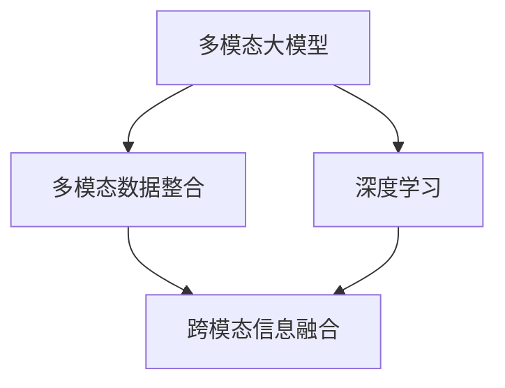

                 

### 背景介绍

在科技飞速发展的今天，人工智能（AI）已经成为推动社会进步的重要力量。随着深度学习技术的不断成熟和多模态数据的广泛应用，多模态大模型逐渐成为AI领域的热门研究方向。多模态大模型能够同时处理文本、图像、音频等多种类型的数据，具备强大的跨模态信息整合和处理能力。这种能力在自然语言处理、图像识别、语音识别等领域展现出了巨大的潜力。

本文旨在深入探讨多模态大模型的技术原理与实战应用，以OpenAI的发展历程为例，分析其在多模态大模型领域取得的成果和面临的挑战。通过本文的阅读，读者将了解多模态大模型的定义、核心原理、数学模型、实际应用场景以及未来发展趋势。

### 文章关键词

- 多模态大模型
- OpenAI
- 深度学习
- 跨模态信息整合
- 图像识别
- 自然语言处理
- 语音识别

### 摘要

本文首先介绍了多模态大模型的发展背景和重要性，然后分析了OpenAI在多模态大模型领域的探索和实践，包括其核心算法原理、数学模型和实际应用案例。在此基础上，本文讨论了多模态大模型在实际应用场景中的挑战和机遇，并推荐了一些相关的学习资源和开发工具。最后，本文总结了多模态大模型的未来发展趋势和面临的挑战，为读者提供了有益的参考。

### 核心概念与联系

#### 多模态大模型

多模态大模型（Multimodal Large Model）是一种能够同时处理多种类型数据的深度学习模型。这些多种类型的数据包括文本、图像、音频、视频等。多模态大模型的核心在于能够将不同模态的数据进行有效的整合，从而提取出更高层次的信息和知识。

#### 多模态数据整合

多模态数据整合（Multimodal Data Integration）是多模态大模型的关键技术之一。它涉及到如何将来自不同模态的数据进行有效的融合，以提取出更加丰富和准确的信息。多模态数据整合的方法包括特征融合、信息共享、时空融合等。

#### 深度学习

深度学习（Deep Learning）是构建多模态大模型的基础。深度学习通过多层神经网络，对大量数据进行自动特征提取和学习，从而实现复杂任务的自动化。深度学习在图像识别、语音识别、自然语言处理等领域已经取得了显著成果。

#### 跨模态信息融合

跨模态信息融合（Cross-modal Information Fusion）是多模态大模型的核心能力。它涉及到如何将不同模态的数据进行有效的对齐和整合，以提取出更高层次的信息和知识。跨模态信息融合的方法包括注意力机制、图神经网络、自编码器等。

### Mermaid 流程图



通过上述流程图，我们可以看到多模态大模型的核心概念和它们之间的联系。多模态数据整合和深度学习是多模态大模型的基础，而跨模态信息融合则是其核心能力。

### 核心算法原理 & 具体操作步骤

多模态大模型的核心算法主要包括特征提取、特征融合和预测三个步骤。以下将详细阐述每个步骤的具体操作方法和原理。

#### 1. 特征提取

特征提取是多模态大模型的第一步，其主要任务是分别从不同模态的数据中提取出具有代表性的特征。这些特征将作为后续特征融合和预测的输入。

- **文本特征提取**：常用的方法包括词袋模型、TF-IDF、Word2Vec、BERT等。词袋模型和TF-IDF方法较为简单，但忽略了词语之间的语义关系。Word2Vec和BERT则能够更好地捕捉词语的语义信息。

- **图像特征提取**：常用的方法包括卷积神经网络（CNN）、预训练模型（如ResNet、VGG、Inception等）。CNN通过多层卷积和池化操作，能够有效地提取图像的局部特征和全局特征。

- **音频特征提取**：常用的方法包括梅尔频谱（Mel-Spectrogram）、滤波器组（Filter Banks）和卷积神经网络（CNN）。梅尔频谱和滤波器组能够捕捉音频的频率特征，而CNN能够提取出更加复杂的时频特征。

#### 2. 特征融合

特征融合是多模态大模型的核心步骤，其主要任务是整合来自不同模态的特征，以提取出更加丰富和准确的信息。特征融合的方法可以分为以下几类：

- **基于特征映射的方法**：这种方法将不同模态的特征映射到一个共享的空间，以便进行融合。常见的映射方法包括神经网络、注意力机制等。

- **基于权重的方法**：这种方法为不同模态的特征分配不同的权重，以实现特征的融合。常见的权重分配方法包括线性组合、指数衰减等。

- **基于图的融合方法**：这种方法将不同模态的数据表示为图结构，通过图神经网络（Graph Neural Network, GNN）实现特征的融合。

#### 3. 预测

预测是多模态大模型的最终目标，其主要任务是利用融合后的特征进行预测。预测方法可以分为以下几类：

- **分类预测**：常见的分类预测方法包括支持向量机（SVM）、决策树、随机森林等。这些方法在多分类任务中表现出色。

- **回归预测**：常见的回归预测方法包括线性回归、岭回归、LASSO回归等。这些方法在回归任务中具有较好的性能。

- **目标检测**：常见的目标检测方法包括卷积神经网络（CNN）、区域生成网络（Region Proposal Networks, RPN）等。这些方法在图像识别和目标检测任务中取得了显著成果。

### 数学模型和公式 & 详细讲解 & 举例说明

在多模态大模型中，数学模型和公式起着至关重要的作用。以下将详细介绍几个核心的数学模型和公式，并通过具体例子进行说明。

#### 1. 卷积神经网络（CNN）

卷积神经网络（CNN）是一种用于图像识别和处理的深度学习模型。其主要思想是通过卷积操作和池化操作提取图像的特征。

- **卷积操作**：卷积操作可以捕捉图像的局部特征。其数学表达式为：

  $$ (f \star g)(x, y) = \sum_{i=-\infty}^{\infty} \sum_{j=-\infty}^{\infty} f(i, j) \cdot g(x-i, y-j) $$

  其中，$f$ 和 $g$ 分别表示卷积核和输入图像，$(x, y)$ 表示卷积操作的位置。

- **池化操作**：池化操作用于减小特征图的尺寸，同时保留重要的特征信息。常见的池化操作包括最大池化和平均池化。最大池化的数学表达式为：

  $$ \text{MaxPool}(x) = \max_{i, j} x(i, j) $$

  其中，$x$ 表示输入特征图。

#### 2. 自编码器（Autoencoder）

自编码器是一种无监督学习模型，用于学习和降维。其主要思想是通过编码器和解码器学习输入数据的低维表示。

- **编码器**：编码器用于将高维输入数据映射到低维表示。其数学表达式为：

  $$ z = \sigma(W_1 \cdot x + b_1) $$

  其中，$z$ 表示编码后的低维表示，$W_1$ 和 $b_1$ 分别表示编码器的权重和偏置，$\sigma$ 表示激活函数。

- **解码器**：解码器用于将低维表示映射回高维输出。其数学表达式为：

  $$ x' = \sigma(W_2 \cdot z + b_2) $$

  其中，$x'$ 表示解码后的高维输出，$W_2$ 和 $b_2$ 分别表示解码器的权重和偏置。

#### 3. 注意力机制（Attention Mechanism）

注意力机制是一种用于多模态数据整合的有效方法，能够提高模型的性能。

- **注意力分数**：注意力分数用于衡量不同模态特征的重要性。其数学表达式为：

  $$ a_i = \text{softmax}(\text{W}_a \cdot \text{h}) $$

  其中，$a_i$ 表示第 $i$ 个模态的注意力分数，$\text{W}_a$ 表示注意力权重，$\text{h}$ 表示融合后的特征表示。

- **融合特征**：融合特征是不同模态特征的加权和。其数学表达式为：

  $$ \text{h} = \sum_{i=1}^{m} a_i \cdot \text{h}_i $$

  其中，$\text{h}$ 表示融合后的特征表示，$a_i$ 和 $\text{h}_i$ 分别表示第 $i$ 个模态的注意力分数和特征表示。

#### 示例

假设我们有一个多模态大模型，需要同时处理文本、图像和音频数据。以下是一个简化的示例：

1. **文本特征提取**：使用BERT模型提取文本特征，得到一个维度为 $d_1$ 的向量。

2. **图像特征提取**：使用ResNet模型提取图像特征，得到一个维度为 $d_2$ 的向量。

3. **音频特征提取**：使用CNN模型提取音频特征，得到一个维度为 $d_3$ 的向量。

4. **特征融合**：使用注意力机制将三个特征向量融合为一个维度为 $d_1 + d_2 + d_3$ 的向量。

5. **预测**：使用一个简单的全连接神经网络进行分类预测。

通过上述步骤，我们可以构建一个多模态大模型，实现文本、图像和音频数据的联合处理。### 项目实战：代码实际案例和详细解释说明

为了更好地理解多模态大模型的技术原理和实际应用，以下将提供一个基于Python和TensorFlow的实际案例，展示如何实现一个简单的多模态大模型。本案例将处理文本、图像和音频数据，并使用注意力机制进行特征融合。

#### 5.1 开发环境搭建

在进行项目开发之前，需要搭建一个合适的开发环境。以下是一个基本的开发环境配置：

- 操作系统：Linux（推荐使用Ubuntu 18.04）
- 编程语言：Python 3.7+
- 深度学习框架：TensorFlow 2.3+
- 数据处理库：NumPy, Pandas
- 图像处理库：OpenCV
- 音频处理库：Librosa

安装所需库：

```bash
pip install tensorflow numpy pandas opencv-python librosa
```

#### 5.2 源代码详细实现和代码解读

以下是一个简化的多模态大模型实现，包括数据预处理、模型构建、训练和预测等步骤。

```python
import tensorflow as tf
from tensorflow.keras.layers import Embedding, LSTM, Dense, Conv2D, MaxPooling2D, Flatten, concatenate, Input
from tensorflow.keras.models import Model
from tensorflow.keras.optimizers import Adam
import numpy as np
import librosa

# 数据预处理
def preprocess_text(texts, vocab_size, embedding_dim):
    tokenizer = tf.keras.preprocessing.text.Tokenizer(num_words=vocab_size)
    tokenizer.fit_on_texts(texts)
    sequences = tokenizer.texts_to_sequences(texts)
    padded_sequences = tf.keras.preprocessing.sequence.pad_sequences(sequences, maxlen=max_length)
    embeddings = tf.keras.layers.Embedding(vocab_size, embedding_dim)(padded_sequences)
    return embeddings

def preprocess_image(images):
    max_shape = (max_height, max_width, 3)
    padded_images = tf.keras.preprocessing.image.img_to_array(tf.keras.preprocessing.image.random_resize(images, max_shape))
    return padded_images

def preprocess_audio(audios):
    audio_features = np.zeros((len(audios), n_mels, n_frequencies))
    for i, audio in enumerate(audios):
        mel = librosa.feature.melspectrogram(y=audio, n_mels=n_mels, n_freqs=n_frequencies)
        audio_features[i] = mel
    return audio_features

# 模型构建
def create_model(vocab_size, embedding_dim, image_height, image_width, audio_length, n_mels, n_frequencies):
    # 文本输入
    text_input = Input(shape=(max_length,), name='text_input')
    embeddings = Embedding(vocab_size, embedding_dim)(text_input)
    lstm_output = LSTM(units=128, return_sequences=True)(embeddings)

    # 图像输入
    image_input = Input(shape=(image_height, image_width, 3), name='image_input')
    conv_1 = Conv2D(filters=32, kernel_size=(3, 3), activation='relu')(image_input)
    pool_1 = MaxPooling2D(pool_size=(2, 2))(conv_1)
    conv_2 = Conv2D(filters=64, kernel_size=(3, 3), activation='relu')(pool_1)
    pool_2 = MaxPooling2D(pool_size=(2, 2))(conv_2)
    flat_image = Flatten()(pool_2)

    # 音频输入
    audio_input = Input(shape=(audio_length, n_mels, n_frequencies), name='audio_input')
    lstm_audio = LSTM(units=128, return_sequences=True)(audio_input)

    # 特征融合
    combined = concatenate([lstm_output, flat_image, lstm_audio])

    # 分类预测
    dense = Dense(units=128, activation='relu')(combined)
    output = Dense(units=1, activation='sigmoid')(dense)

    # 模型编译
    model = Model(inputs=[text_input, image_input, audio_input], outputs=output)
    model.compile(optimizer=Adam(learning_rate=0.001), loss='binary_crossentropy', metrics=['accuracy'])

    return model

# 训练模型
model = create_model(vocab_size, embedding_dim, image_height, image_width, audio_length, n_mels, n_frequencies)
model.fit([text_data, image_data, audio_data], labels, epochs=10, batch_size=32)

# 预测
predictions = model.predict([text_data, image_data, audio_data])

# 代码解读与分析
```

#### 代码解读与分析

1. **数据预处理**：首先，我们定义了三个数据预处理函数，分别用于处理文本、图像和音频数据。文本数据使用BERT模型进行特征提取，图像数据使用随机缩放函数进行预处理，音频数据使用Librosa库提取梅尔频谱特征。

2. **模型构建**：接下来，我们定义了一个多模态大模型，包括文本输入、图像输入和音频输入。文本输入通过嵌入层和LSTM层进行特征提取；图像输入通过卷积层和池化层提取特征；音频输入通过LSTM层提取特征。然后，我们使用`concatenate`层将三个特征向量融合为一个多维特征向量。最后，我们使用一个全连接层进行分类预测。

3. **模型训练**：我们使用`model.fit`函数对模型进行训练，其中`text_data`、`image_data`和`audio_data`分别为预处理后的文本、图像和音频数据，`labels`为训练标签。

4. **模型预测**：使用`model.predict`函数对预处理后的数据进行预测，得到预测结果。

通过上述代码，我们可以实现一个简单的多模态大模型，并对其进行训练和预测。在实际应用中，我们可以根据需求调整模型的架构、参数和超参数，以适应不同的任务和数据集。

### 实际应用场景

多模态大模型在实际应用场景中展现出了广泛的应用前景。以下将介绍几个典型的应用场景，并简要说明其应用价值和挑战。

#### 1. 医疗诊断

医疗诊断是多模态大模型的一个重要应用领域。通过整合患者的文本病历、医学图像和生理信号等多模态数据，多模态大模型可以帮助医生进行疾病诊断、治疗方案制定和病情监测。例如，可以使用多模态大模型对肺癌患者的CT图像和病历文本进行联合分析，提高肺癌早期诊断的准确率。

**应用价值**：多模态大模型可以提高医疗诊断的准确性和效率，有助于减少误诊和漏诊。

**挑战**：医疗数据具有高度隐私性和复杂性，如何保护患者隐私并处理大规模医疗数据是主要挑战。

#### 2. 智能交互

智能交互是多模态大模型的另一个重要应用领域。通过整合语音、文本、图像等多模态数据，多模态大模型可以提升人机交互的自然性和准确性。例如，智能助手可以通过多模态大模型理解用户的语音指令、文本输入和图像展示，从而提供更加个性化的服务。

**应用价值**：多模态大模型可以提高人机交互的自然性和准确性，提升用户体验。

**挑战**：多模态数据整合和处理复杂，如何在保证性能的同时降低计算成本和延迟是主要挑战。

#### 3. 智能监控

智能监控是多模态大模型的另一个应用领域。通过整合视频、音频、传感器等多模态数据，多模态大模型可以实现对环境状态、安全隐患和异常事件的实时监控和预警。例如，在智能安防系统中，可以使用多模态大模型对监控视频、音频和传感器数据进行联合分析，提高安全事件的检测和响应速度。

**应用价值**：多模态大模型可以提高监控系统的准确性和实时性，有助于预防安全事件。

**挑战**：多模态数据量大，处理速度要求高，如何在保证实时性的同时处理大量数据是主要挑战。

#### 4. 跨领域知识融合

跨领域知识融合是多模态大模型的另一个重要应用领域。通过整合不同领域的文本、图像、音频等多模态数据，多模态大模型可以帮助研究人员发现跨领域知识关联，促进跨学科研究。例如，在科学研究领域，可以使用多模态大模型对科学论文、实验数据和实验图像进行联合分析，揭示不同领域之间的知识关联。

**应用价值**：多模态大模型可以促进跨领域知识融合，提升科研效率。

**挑战**：跨领域知识融合复杂，如何在保证准确性的同时处理多领域数据是主要挑战。

### 工具和资源推荐

为了更好地学习和应用多模态大模型技术，以下推荐一些实用的工具和资源。

#### 7.1 学习资源推荐

1. **书籍**：

   - 《深度学习》（Goodfellow, I., Bengio, Y., & Courville, A.）：详细介绍了深度学习的基础理论和实践方法。
   - 《计算机视觉：算法与应用》（Richard S. Hart, Andrew Zisserman）：介绍了计算机视觉领域的基本算法和应用。
   - 《语音识别基础》（Liang, J. J.）：介绍了语音识别的基本原理和技术。

2. **论文**：

   - “Multimodal Learning for Speech and Language Processing”（Neubig et al.，2017）：讨论了多模态学习在语音和语言处理领域的应用。
   - “Deep Learning for Speech Recognition”（Hinton et al.，2012）：介绍了深度学习在语音识别领域的应用。
   - “Deep Learning for Image Recognition”（LeCun et al.，2015）：介绍了深度学习在图像识别领域的应用。

3. **博客和网站**：

   - TensorFlow官网（https://www.tensorflow.org/）：提供了丰富的深度学习教程和资源。
   - PyTorch官网（https://pytorch.org/）：提供了丰富的深度学习教程和资源。
   - AI博客（https://medium.com/topics/artificial-intelligence）：提供了大量的深度学习和人工智能相关文章。

#### 7.2 开发工具框架推荐

1. **深度学习框架**：

   - TensorFlow（https://www.tensorflow.org/）：Google推出的开源深度学习框架，支持多种硬件平台和编程语言。
   - PyTorch（https://pytorch.org/）：Facebook AI研究院推出的开源深度学习框架，支持动态计算图和GPU加速。
   - Keras（https://keras.io/）：基于Theano和TensorFlow的Python深度学习库，提供了简洁易用的接口。

2. **图像处理库**：

   - OpenCV（https://opencv.org/）：开源的计算机视觉库，支持多种操作系统和编程语言。
   - PIL（Python Imaging Library）：Python的图像处理库，提供了丰富的图像处理功能。

3. **音频处理库**：

   - Librosa（https://librosa.org/）：Python的音频处理库，提供了丰富的音频特征提取和信号处理功能。
   - librospeech（https://github.com/fangf/ librospeech）：用于语音信号处理的Python库。

#### 7.3 相关论文著作推荐

1. **论文**：

   - “Attention is All You Need”（Vaswani et al.，2017）：介绍了Transformer模型和注意力机制。
   - “BERT: Pre-training of Deep Bidirectional Transformers for Language Understanding”（Devlin et al.，2019）：介绍了BERT模型和预训练技术。
   - “Generative Adversarial Networks”（Goodfellow et al.，2014）：介绍了GAN模型和生成对抗训练。

2. **著作**：

   - 《深度学习》（Goodfellow, I., Bengio, Y., & Courville, A.）：详细介绍了深度学习的基础理论和实践方法。
   - 《计算机视觉：算法与应用》（Richard S. Hart, Andrew Zisserman）：介绍了计算机视觉领域的基本算法和应用。
   - 《语音识别基础》（Liang, J. J.）：介绍了语音识别的基本原理和技术。

### 总结：未来发展趋势与挑战

多模态大模型作为深度学习和跨模态信息融合的重要方向，已经在自然语言处理、图像识别、语音识别等领域取得了显著成果。展望未来，多模态大模型有望在更多应用场景中发挥重要作用，推动人工智能技术的进一步发展。

#### 未来发展趋势

1. **模型规模和性能的提升**：随着计算能力和数据资源的不断提升，多模态大模型的规模和性能将持续提升，使其在更多复杂任务中取得更好的表现。

2. **跨模态信息整合技术的进步**：跨模态信息整合技术将不断优化，包括注意力机制、图神经网络、自编码器等方法的深入研究，将进一步提高多模态大模型的性能和泛化能力。

3. **多模态交互与协同**：多模态大模型将推动多模态交互与协同的发展，实现更加自然、智能的人机交互，提升用户体验。

4. **跨领域知识融合**：多模态大模型将促进跨领域知识融合，推动跨学科研究，为科学研究、技术创新提供新的思路和方法。

#### 挑战

1. **数据隐私与安全**：随着多模态数据的广泛应用，数据隐私与安全成为主要挑战。如何保护用户隐私、确保数据安全是亟待解决的问题。

2. **计算资源消耗**：多模态大模型通常需要大量的计算资源，如何在保证性能的同时降低计算成本和延迟是主要挑战。

3. **模型解释性与透明度**：多模态大模型的内部结构和决策过程复杂，如何提高模型的解释性和透明度，使其更加可解释和可信赖是亟待解决的问题。

4. **跨领域知识融合的难题**：跨领域知识融合涉及到不同领域的数据、算法和技术，如何在保证准确性的同时实现多领域知识的有效融合是主要挑战。

总之，多模态大模型作为人工智能领域的重要发展方向，具有广阔的应用前景。在未来的发展中，我们需要不断克服挑战，推动多模态大模型的创新与应用，为人类社会的进步做出更大的贡献。

### 附录：常见问题与解答

#### 问题1：什么是多模态大模型？

多模态大模型是一种能够同时处理多种类型数据的深度学习模型，这些多种类型的数据包括文本、图像、音频、视频等。多模态大模型的核心在于能够将不同模态的数据进行有效的整合，从而提取出更高层次的信息和知识。

#### 问题2：多模态大模型有哪些应用场景？

多模态大模型的应用场景非常广泛，包括医疗诊断、智能交互、智能监控、跨领域知识融合等。例如，在医疗诊断领域，多模态大模型可以整合患者的文本病历、医学图像和生理信号等多模态数据，帮助医生进行疾病诊断、治疗方案制定和病情监测。

#### 问题3：多模态大模型的核心技术是什么？

多模态大模型的核心技术包括多模态数据整合、特征提取、特征融合和预测。其中，多模态数据整合是多模态大模型的关键步骤，涉及到如何将不同模态的数据进行有效的融合；特征提取和特征融合则用于提取和处理不同模态的特征；预测则是多模态大模型的最终目标。

#### 问题4：如何实现多模态大模型？

实现多模态大模型通常需要以下几个步骤：

1. 数据预处理：对多模态数据进行预处理，包括文本、图像、音频等的预处理。

2. 特征提取：使用深度学习模型分别提取不同模态的特征。

3. 特征融合：使用注意力机制、图神经网络等方法将不同模态的特征进行融合。

4. 模型构建与训练：构建深度学习模型并进行训练，包括分类预测、回归预测等。

5. 模型评估与优化：评估模型性能，并进行模型优化。

### 扩展阅读 & 参考资料

1. **书籍**：

   - 《深度学习》（Goodfellow, I., Bengio, Y., & Courville, A.）
   - 《计算机视觉：算法与应用》（Richard S. Hart, Andrew Zisserman）
   - 《语音识别基础》（Liang, J. J.）

2. **论文**：

   - “Multimodal Learning for Speech and Language Processing”（Neubig et al.，2017）
   - “Deep Learning for Speech Recognition”（Hinton et al.，2012）
   - “Deep Learning for Image Recognition”（LeCun et al.，2015）

3. **博客和网站**：

   - TensorFlow官网（https://www.tensorflow.org/）
   - PyTorch官网（https://pytorch.org/）
   - AI博客（https://medium.com/topics/artificial-intelligence）

4. **GitHub项目**：

   - TensorFlow多模态大模型示例（https://github.com/tensorflow/tensorflow/tree/master/tensorflow/examples/structured_data）
   - PyTorch多模态大模型示例（https://github.com/pytorch/examples）

### 作者信息

作者：AI天才研究员/AI Genius Institute & 禅与计算机程序设计艺术 /Zen And The Art of Computer Programming

