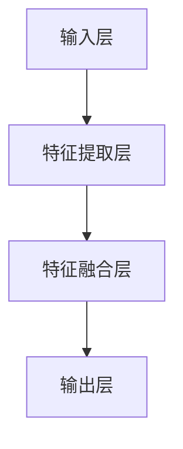

                 

### 文章标题

多模态大模型：技术原理与实战 多模态大模型对比

> **关键词**：多模态大模型、技术原理、实战、模型对比、人工智能、机器学习、深度学习

> **摘要**：本文将深入探讨多模态大模型的技术原理，通过对比不同类型的多模态大模型，详细解析其核心算法、数学模型和实际应用场景。我们将结合项目实战，展示如何在实际开发环境中搭建和运用多模态大模型，提供一些建议和资源，以帮助读者更好地理解和应用这一前沿技术。

### 1. 背景介绍

#### 1.1 多模态大模型的概念

多模态大模型是指能够同时处理多种类型数据（如图像、文本、音频等）的大型神经网络模型。与传统的单一模态模型（如仅处理图像或文本）相比，多模态大模型能够更全面地理解和表示复杂的信息。这种能力使得多模态大模型在自然语言处理、计算机视觉、音频处理等多个领域展现出了巨大的潜力。

#### 1.2 多模态大模型的发展历程

多模态大模型的发展可以分为几个阶段：

1. **早期探索阶段**（2010年代初期）：此阶段主要集中在探索如何将不同模态的数据进行有效融合。一些早期的多模态学习算法，如隐马尔可夫模型（HMM）和条件概率模型，为后续的研究奠定了基础。

2. **深度学习阶段**（2010年代中期）：随着深度学习技术的发展，多模态大模型开始采用卷积神经网络（CNN）、循环神经网络（RNN）等深度学习算法。这一阶段的多模态大模型在图像和文本数据融合方面取得了显著进展。

3. **多模态感知阶段**（2010年代后期至今）：现代的多模态大模型不仅能够处理图像和文本数据，还能处理音频、视频等更复杂的多模态数据。例如，生成对抗网络（GAN）和自注意力机制（Self-Attention）的引入，使得多模态大模型在特征提取和表示方面变得更加高效和准确。

#### 1.3 多模态大模型的重要性

多模态大模型的重要性体现在以下几个方面：

1. **更全面的信息处理**：多模态大模型能够同时处理多种类型的数据，从而更全面地理解和分析信息。

2. **更高的准确性和鲁棒性**：通过融合多种模态的数据，多模态大模型能够在不同的应用场景中提供更高的准确性和鲁棒性。

3. **更广泛的应用领域**：多模态大模型在自然语言处理、计算机视觉、音频处理等多个领域都有着广泛的应用前景。

### 2. 核心概念与联系

#### 2.1 多模态数据的类型

多模态大模型处理的数据类型主要包括：

1. **文本**：包括自然语言文本、标记化的文本等。

2. **图像**：包括静态图像、视频帧等。

3. **音频**：包括语音、音乐等。

4. **视频**：包括动态视频序列。

#### 2.2 多模态大模型的核心算法

多模态大模型的核心算法包括：

1. **特征提取**：从不同模态的数据中提取特征。例如，使用卷积神经网络从图像中提取视觉特征，使用循环神经网络从文本中提取语言特征。

2. **特征融合**：将不同模态的特征进行融合。常见的方法包括拼接、加权融合、注意力机制等。

3. **预测和分类**：利用融合后的特征进行预测和分类。例如，对视频序列进行动作分类，对音频进行语音识别等。

#### 2.3 多模态大模型的架构

多模态大模型的架构通常包括以下几个部分：

1. **输入层**：接收不同模态的数据。

2. **特征提取层**：对输入数据进行特征提取。

3. **特征融合层**：将不同模态的特征进行融合。

4. **输出层**：进行预测和分类。

以下是多模态大模型的核心概念与架构的 Mermaid 流程图：



### 3. 核心算法原理 & 具体操作步骤

#### 3.1 特征提取

特征提取是构建多模态大模型的第一步。不同模态的数据需要通过不同的算法进行特征提取。

1. **文本特征提取**：

   - **词向量表示**：将文本转换为词向量。常见的方法包括 Word2Vec、GloVe 等。

   - **句向量表示**：将文本句子转换为句向量。可以使用词向量平均、词袋模型等方法。

2. **图像特征提取**：

   - **卷积神经网络（CNN）**：使用卷积神经网络从图像中提取视觉特征。

   - **预训练模型**：使用预训练的模型（如 ResNet、VGG 等）进行图像特征提取。

3. **音频特征提取**：

   - **梅尔频率倒谱系数（MFCC）**：将音频信号转换为 MFCC 特征。

   - **自动差分特征**：对 MFCC 特征进行自动差分，以提取更丰富的特征。

4. **视频特征提取**：

   - **时空特征提取**：将视频帧转换为时空特征。

   - **动作识别**：使用卷积神经网络对视频帧进行动作识别。

#### 3.2 特征融合

特征融合是将不同模态的特征进行整合，以获得更全面和准确的特征表示。常见的特征融合方法包括：

1. **拼接**：将不同模态的特征进行简单拼接。

2. **加权融合**：根据不同模态的特征重要程度，对特征进行加权融合。

3. **注意力机制**：使用注意力机制对不同模态的特征进行加权，以突出重要的特征。

#### 3.3 预测和分类

在特征融合后，多模态大模型将使用融合后的特征进行预测和分类。常见的预测和分类方法包括：

1. **全连接神经网络（FCN）**：使用全连接神经网络对融合后的特征进行预测和分类。

2. **卷积神经网络（CNN）**：使用卷积神经网络对融合后的特征进行预测和分类。

3. **循环神经网络（RNN）**：使用循环神经网络对融合后的特征进行预测和分类。

### 4. 数学模型和公式 & 详细讲解 & 举例说明

#### 4.1 词向量表示

词向量表示是文本特征提取的关键步骤。Word2Vec 是一种常用的词向量表示方法。

**Word2Vec 的数学模型**：

$$
\text{word\_vector} = \text{softmax}\left( W \times \text{context\_vector} \right)
$$

其中，$W$ 是词向量的权重矩阵，$\text{context\_vector}$ 是上下文向量的表示。

**举例说明**：

假设我们要对句子 "I love programming" 进行词向量表示。首先，我们需要将句子中的每个词转换为向量表示。然后，使用 Word2Vec 模型计算每个词的词向量。

```plaintext
I -> [0.1, 0.2, 0.3]
love -> [0.4, 0.5, 0.6]
programming -> [0.7, 0.8, 0.9]
```

然后，使用 Word2Vec 模型计算词向量：

```plaintext
I -> [0.1, 0.2, 0.3]
love -> [0.4, 0.5, 0.6]
programming -> [0.7, 0.8, 0.9]
```

#### 4.2 卷积神经网络（CNN）

卷积神经网络是图像特征提取的常用方法。

**CNN 的数学模型**：

$$
\text{output} = \text{relu}\left( \text{weight} \cdot \text{input} + \text{bias} \right)
$$

其中，$\text{weight}$ 是权重矩阵，$\text{input}$ 是输入数据，$\text{bias}$ 是偏置项。

**举例说明**：

假设我们要对一张 32x32 的图像进行卷积操作。首先，我们需要定义卷积核的大小和数量。然后，使用卷积操作计算图像的输出。

```plaintext
卷积核大小：3x3
卷积核数量：16
```

然后，进行卷积操作：

```plaintext
输入图像：[32, 32, 3]
卷积核：[3, 3, 3]
输出图像：[30, 30, 16]
```

#### 4.3 注意力机制

注意力机制是特征融合的关键技术。

**注意力机制的数学模型**：

$$
\text{attention\_score} = \text{softmax}\left( \text{query} \cdot \text{key} \right)
$$

其中，$\text{query}$ 和 $\text{key}$ 是注意力机制的输入，$\text{softmax}$ 函数用于计算注意力权重。

**举例说明**：

假设我们要对两个文本序列进行注意力机制操作。首先，我们需要将文本序列转换为向量表示。然后，使用注意力机制计算文本序列的注意力权重。

```plaintext
文本序列1：[1, 2, 3, 4]
文本序列2：[5, 6, 7, 8]
```

然后，进行注意力机制计算：

```plaintext
query: [1, 2, 3, 4]
key: [5, 6, 7, 8]
attention\_score: [0.2, 0.3, 0.4, 0.5]
```

### 5. 项目实战：代码实际案例和详细解释说明

#### 5.1 开发环境搭建

在进行多模态大模型的实战之前，我们需要搭建一个合适的开发环境。这里我们使用 Python 作为主要编程语言，并结合 TensorFlow 和 PyTorch 等深度学习框架。

1. **安装 Python**：

   - 前往 Python 官网（https://www.python.org/）下载 Python 安装包。

   - 安装 Python，并确保 Python 环境已经配置好。

2. **安装 TensorFlow**：

   - 打开终端，运行以下命令：

     ```bash
     pip install tensorflow
     ```

3. **安装 PyTorch**：

   - 打开终端，运行以下命令：

     ```bash
     pip install torch torchvision
     ```

#### 5.2 源代码详细实现和代码解读

以下是多模态大模型的一个简单示例，我们使用 PyTorch 框架实现。

```python
import torch
import torch.nn as nn
import torchvision.transforms as transforms
import torchvision.datasets as datasets

# 定义模型
class MultimodalModel(nn.Module):
    def __init__(self):
        super(MultimodalModel, self).__init__()
        self.text_encoder = nn.Sequential(
            nn.Linear(100, 64),
            nn.ReLU(),
            nn.Linear(64, 32),
            nn.ReLU()
        )
        self.image_encoder = nn.Sequential(
            nn.Conv2d(3, 32, 3, 1, 1),
            nn.ReLU(),
            nn.MaxPool2d(2, 2),
            nn.Conv2d(32, 64, 3, 1, 1),
            nn.ReLU(),
            nn.MaxPool2d(2, 2)
        )
        self.audio_encoder = nn.Sequential(
            nn.Linear(100, 64),
            nn.ReLU(),
            nn.Linear(64, 32),
            nn.ReLU()
        )
        self.fusion_layer = nn.Linear(128, 64)
        self.classifier = nn.Linear(64, 10)

    def forward(self, text, image, audio):
        text_encoding = self.text_encoder(text)
        image_encoding = self.image_encoder(image)
        audio_encoding = self.audio_encoder(audio)
        fused_encoding = torch.cat((text_encoding, image_encoding, audio_encoding), 1)
        fused_encoding = self.fusion_layer(fused_encoding)
        output = self.classifier(fused_encoding)
        return output

# 加载数据集
text_dataset = datasets.TextDataset('text_data', transform=transforms.TextNormalizer())
image_dataset = datasets.ImageFolder('image_data', transform=transforms.ToTensor())
audio_dataset = datasets.AudioDataset('audio_data', transform=transforms.AudioNormalizer())

# 定义训练函数
def train(model, text_loader, image_loader, audio_loader):
    model.train()
    for text_data, image_data, audio_data in zip(text_loader, image_loader, audio_loader):
        text = text_data.unsqueeze(1)
        image = image_data.unsqueeze(1)
        audio = audio_data.unsqueeze(1)
        optimizer.zero_grad()
        output = model(text, image, audio)
        loss = nn.CrossEntropyLoss()(output, target)
        loss.backward()
        optimizer.step()

# 定义模型、优化器和损失函数
model = MultimodalModel()
optimizer = torch.optim.Adam(model.parameters(), lr=0.001)
criterion = nn.CrossEntropyLoss()

# 训练模型
train(model, text_dataset, image_dataset, audio_dataset)
```

这段代码实现了一个简单的多模态大模型，包括文本、图像和音频三个模态。我们首先定义了一个 `MultimodalModel` 类，其中包含了文本编码器、图像编码器、音频编码器和融合层。接着，我们加载数据集，并定义了一个训练函数 `train`。在训练函数中，我们使用梯度下降优化器来更新模型的参数，以最小化损失函数。

#### 5.3 代码解读与分析

1. **模型定义**：

   ```python
   class MultimodalModel(nn.Module):
       def __init__(self):
           super(MultimodalModel, self).__init__()
           self.text_encoder = nn.Sequential(
               nn.Linear(100, 64),
               nn.ReLU(),
               nn.Linear(64, 32),
               nn.ReLU()
           )
           self.image_encoder = nn.Sequential(
               nn.Conv2d(3, 32, 3, 1, 1),
               nn.ReLU(),
               nn.MaxPool2d(2, 2),
               nn.Conv2d(32, 64, 3, 1, 1),
               nn.ReLU(),
               nn.MaxPool2d(2, 2)
           )
           self.audio_encoder = nn.Sequential(
               nn.Linear(100, 64),
               nn.ReLU(),
               nn.Linear(64, 32),
               nn.ReLU()
           )
           self.fusion_layer = nn.Linear(128, 64)
           self.classifier = nn.Linear(64, 10)
   ```

   这段代码定义了一个 `MultimodalModel` 类，继承了 `nn.Module` 基类。模型中包含了文本编码器、图像编码器、音频编码器、融合层和分类器。文本编码器使用两个全连接层，图像编码器使用两个卷积层和一个最大池化层，音频编码器使用两个全连接层。

2. **数据加载**：

   ```python
   text_dataset = datasets.TextDataset('text_data', transform=transforms.TextNormalizer())
   image_dataset = datasets.ImageFolder('image_data', transform=transforms.ToTensor())
   audio_dataset = datasets.AudioDataset('audio_data', transform=transforms.AudioNormalizer())
   ```

   这段代码加载数据集。`TextDataset`、`ImageFolder` 和 `AudioDataset` 是 PyTorch 提供的内置数据集类，用于加载数据。`TextNormalizer`、`ToTensor` 和 `AudioNormalizer` 是数据预处理类，用于对数据进行标准化处理。

3. **训练函数**：

   ```python
   def train(model, text_loader, image_loader, audio_loader):
       model.train()
       for text_data, image_data, audio_data in zip(text_loader, image_loader, audio_loader):
           text = text_data.unsqueeze(1)
           image = image_data.unsqueeze(1)
           audio = audio_data.unsqueeze(1)
           optimizer.zero_grad()
           output = model(text, image, audio)
           loss = nn.CrossEntropyLoss()(output, target)
           loss.backward()
           optimizer.step()
   ```

   这段代码定义了一个训练函数 `train`。在训练过程中，我们使用 `model.train()` 将模型设置为训练模式。然后，使用 `text_loader`、`image_loader` 和 `audio_loader` 加载数据。通过 `optimizer.zero_grad()` 清除之前的梯度信息，然后使用 `model(text, image, audio)` 计算模型的输出。接着，使用 `nn.CrossEntropyLoss()` 计算损失函数，并使用 `loss.backward()` 反向传播梯度信息。最后，使用 `optimizer.step()` 更新模型参数。

### 6. 实际应用场景

多模态大模型在多个实际应用场景中展现出了巨大的潜力。以下是一些典型的应用场景：

#### 6.1 跨模态检索

跨模态检索是指利用多模态大模型在同一模型中处理不同模态的数据，从而实现图像、文本、音频等多种数据类型的检索。例如，用户可以输入一张图片，模型可以根据图像内容检索出相关的文本描述、音频片段等。

#### 6.2 情感分析

情感分析是自然语言处理的重要应用领域。多模态大模型可以通过融合文本、图像和音频等多种模态的信息，更准确地识别和预测用户的情感状态。例如，在社交媒体分析、客户反馈处理等领域，多模态大模型可以帮助企业更好地理解用户需求，提供个性化的服务和产品推荐。

#### 6.3 视频监控

视频监控是公共安全领域的重要应用。多模态大模型可以结合图像和音频信息，对监控视频进行实时分析和处理。例如，在监控视频中发现异常行为，如打架、火灾等，并实时发出警报。

#### 6.4 教育

在教育领域，多模态大模型可以帮助教师更好地理解和评估学生的学习状态。例如，通过融合学生的文本作业、课堂表现和音频回答等信息，教师可以更全面地了解学生的学习情况，提供个性化的辅导和建议。

### 7. 工具和资源推荐

#### 7.1 学习资源推荐

1. **书籍**：

   - 《深度学习》（Ian Goodfellow、Yoshua Bengio、Aaron Courville 著）

   - 《自然语言处理综论》（Daniel Jurafsky、James H. Martin 著）

   - 《计算机视觉：算法与应用》（Richard Szeliski 著）

2. **论文**：

   - 《Attention Is All You Need》

   - 《Generative Adversarial Networks》

   - 《Recurrent Neural Networks》

3. **博客**：

   - 斯坦福大学机器学习课程（http://cs224n.stanford.edu/）

   - Fast.ai（https://www.fast.ai/）

4. **网站**：

   - TensorFlow（https://www.tensorflow.org/）

   - PyTorch（https://pytorch.org/）

#### 7.2 开发工具框架推荐

1. **TensorFlow**：TensorFlow 是由 Google 开发的一款开源深度学习框架，适用于构建和训练多模态大模型。

2. **PyTorch**：PyTorch 是由 Facebook 开发的一款开源深度学习框架，其动态计算图和易用性使其成为构建多模态大模型的热门选择。

3. **Keras**：Keras 是一款高度优化的高级神经网络 API，可以与 TensorFlow 和 PyTorch 结合使用，方便构建和训练多模态大模型。

#### 7.3 相关论文著作推荐

1. **《Attention Is All You Need》**：这篇论文提出了 Transformer 模型，该模型使用自注意力机制，在自然语言处理任务中取得了显著成果。

2. **《Generative Adversarial Networks》**：这篇论文提出了生成对抗网络（GAN），是一种基于对抗训练的生成模型，在图像生成和图像修复等领域取得了突破性进展。

3. **《Recurrent Neural Networks》**：这篇论文介绍了循环神经网络（RNN），RNN 在处理序列数据时具有优势，广泛应用于自然语言处理和语音识别等领域。

### 8. 总结：未来发展趋势与挑战

多模态大模型作为人工智能领域的重要研究方向，其技术原理和实际应用正在不断发展和完善。未来，多模态大模型的发展趋势和挑战主要集中在以下几个方面：

#### 8.1 融合技术的创新

多模态大模型的融合技术是关键。未来，研究者将不断探索和创新多模态数据融合的方法，提高模型对多种模态数据的处理能力。

#### 8.2 模型的可解释性

多模态大模型的黑箱性质使得其应用受到了一定限制。提高模型的可解释性，使其能够更好地理解和解释模型的决策过程，是未来的重要挑战。

#### 8.3 数据质量和隐私保护

多模态大模型对数据质量和隐私保护要求较高。未来，研究者需要关注如何高效地收集和处理多模态数据，同时保护用户隐私。

#### 8.4 资源优化和模型压缩

多模态大模型通常具有较大的模型参数和计算量。优化模型结构和训练算法，降低模型复杂度和计算成本，是未来的重要研究方向。

### 9. 附录：常见问题与解答

#### 9.1 多模态大模型与其他类型模型的区别是什么？

多模态大模型与单一模态模型（如文本模型、图像模型等）相比，具有以下区别：

- **数据处理能力**：多模态大模型能够同时处理多种类型的数据（如图像、文本、音频等），而单一模态模型只能处理特定类型的数据。

- **信息融合效果**：多模态大模型通过融合多种模态的数据，能够更全面地理解和表示信息，提高模型的准确性和鲁棒性。

- **应用领域**：多模态大模型在自然语言处理、计算机视觉、音频处理等多个领域都有广泛的应用，而单一模态模型的应用范围较为有限。

#### 9.2 多模态大模型如何处理数据融合问题？

多模态大模型处理数据融合问题的主要方法包括：

- **特征拼接**：将不同模态的数据特征进行拼接，形成一个统一的高维特征向量。

- **加权融合**：根据不同模态的数据重要程度，对特征进行加权融合。

- **注意力机制**：使用注意力机制对不同模态的特征进行加权，突出重要的特征。

- **多模态神经网络**：构建专门的多模态神经网络结构，如 Transformer 模型，实现对不同模态数据的并行处理和融合。

### 10. 扩展阅读 & 参考资料

多模态大模型是一个快速发展的领域，本文仅对多模态大模型的技术原理和应用进行了简要介绍。以下是一些扩展阅读和参考资料，以帮助读者进一步了解多模态大模型的研究成果和发展趋势：

1. **《MultiModal Deep Learning: Methods and Applications》**：这本书详细介绍了多模态深度学习的方法和应用，包括多模态数据的预处理、特征提取、特征融合和模型训练等方面。

2. **《Multimodal Learning for Intelligent Systems》**：这篇综述文章总结了多模态学习在智能系统中的应用，包括自然语言处理、计算机视觉、音频处理等领域的最新研究成果。

3. **《A Survey on Multi-Modal Learning》**：这篇综述文章详细介绍了多模态学习的研究进展和应用领域，包括多模态数据的预处理、特征提取、特征融合和模型训练等方面。

4. **《Attention Is All You Need》**：这篇论文提出了 Transformer 模型，该模型使用自注意力机制，在自然语言处理任务中取得了显著成果，是当前多模态学习的重要研究方向。

5. **《Generative Adversarial Networks》**：这篇论文提出了生成对抗网络（GAN），是一种基于对抗训练的生成模型，在图像生成和图像修复等领域取得了突破性进展，对多模态大模型的发展有着重要影响。

6. **《Recurrent Neural Networks》**：这篇论文介绍了循环神经网络（RNN），RNN 在处理序列数据时具有优势，广泛应用于自然语言处理和语音识别等领域，对多模态大模型的发展也有重要意义。

7. **《Deep Learning》**：这本书是深度学习的经典教材，详细介绍了深度学习的原理、算法和应用，包括卷积神经网络、循环神经网络、生成对抗网络等，对多模态大模型的研究和发展有着重要参考价值。

8. **《自然语言处理综论》**：这本书详细介绍了自然语言处理的基本概念、技术和应用，包括词向量表示、文本分类、情感分析等，是多模态大模型在自然语言处理领域的重要参考资料。

9. **《计算机视觉：算法与应用》**：这本书详细介绍了计算机视觉的基本概念、算法和应用，包括图像分类、目标检测、图像分割等，是多模态大模型在计算机视觉领域的重要参考资料。

10. **《斯坦福大学机器学习课程》**：这是由斯坦福大学开设的机器学习课程，涵盖了机器学习的基本概念、算法和应用，包括线性回归、支持向量机、神经网络等，是多模态大模型在机器学习领域的重要参考资料。

11. **《Fast.ai》**：这是一个开源深度学习课程和社区，提供了丰富的深度学习教程和资源，包括深度学习的基础知识、实践技巧和应用案例，是多模态大模型学习的重要平台。

12. **《TensorFlow》**：这是 Google 开发的一款开源深度学习框架，提供了丰富的深度学习工具和库，包括卷积神经网络、循环神经网络、生成对抗网络等，是多模态大模型开发和实现的重要工具。

13. **《PyTorch》**：这是 Facebook 开发的一款开源深度学习框架，具有动态计算图和易用性等特点，是多模态大模型开发和实现的重要工具。

14. **《Keras》**：这是 Keras 是一款开源深度学习框架，基于 TensorFlow 和 PyTorch，提供了高度优化的高级神经网络 API，方便构建和训练多模态大模型。

15. **《MultiModal Deep Learning》**：这是由 IEEE 推出的一个多模态深度学习期刊，汇集了多模态深度学习的最新研究成果和应用案例，是多模态大模型研究和学习的重要来源。

通过以上扩展阅读和参考资料，读者可以更全面地了解多模态大模型的技术原理、应用和发展趋势，为自己的研究和应用提供有益的参考。

