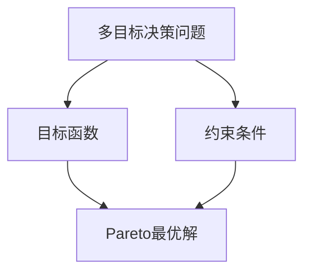

                 

# 多目标决策问题的建模方法与求解算法比较

> **关键词**：多目标决策、建模方法、求解算法、比较分析

> **摘要**：本文将探讨多目标决策问题在现实中的应用背景，介绍几种常见的建模方法与求解算法，并通过具体案例进行分析与比较，以期为相关领域的研究者提供有价值的参考。

## 1. 背景介绍

多目标决策问题（Multi-Objective Decision Making，MODM）是决策分析中常见且重要的一类问题。它涉及到多个目标（或称为准则、指标）的优化，这些目标往往存在冲突，难以同时达到最优。多目标决策问题广泛应用于工程、管理、经济、环境等领域，例如资源分配、供应链优化、项目评估等。

在多目标决策中，决策者需要综合考虑多个目标之间的权衡和冲突，以便找到一个或多个满意解（Pareto最优解）。这使得多目标决策问题比单目标决策问题更为复杂和具有挑战性。因此，研究多目标决策问题的建模方法与求解算法具有重要的理论意义和实际应用价值。

本文旨在介绍几种常见多目标决策问题的建模方法与求解算法，并通过具体案例进行分析与比较。文章结构如下：

1. 背景介绍
2. 核心概念与联系
3. 核心算法原理 & 具体操作步骤
4. 数学模型和公式 & 详细讲解 & 举例说明
5. 项目实战：代码实际案例和详细解释说明
6. 实际应用场景
7. 工具和资源推荐
8. 总结：未来发展趋势与挑战
9. 附录：常见问题与解答
10. 扩展阅读 & 参考资料

接下来，我们将首先介绍多目标决策问题的核心概念与联系，并通过 Mermaid 流程图展示其原理和架构。

## 2. 核心概念与联系

### 2.1 多目标决策问题定义

多目标决策问题是指在一个决策过程中，存在多个目标需要同时考虑和优化的问题。这些目标可以是互斥的，即一个目标的最优解可能会恶化其他目标的性能。因此，决策者需要在多个目标之间进行权衡和取舍，找到一个或多个Pareto最优解。

### 2.2 多目标决策问题类型

多目标决策问题可以分为以下几种类型：

- **线性多目标问题**：目标函数是线性的，容易建模和求解。
- **非线性多目标问题**：目标函数是非线性的，求解更为复杂。
- **离散多目标问题**：决策变量是离散的，如整数或二进制变量。
- **连续多目标问题**：决策变量是连续的，如实数。
- **动态多目标问题**：决策过程中存在时间维度，需要考虑动态规划方法。

### 2.3 多目标决策问题模型

多目标决策问题可以用以下模型表示：

$$
\begin{align*}
\text{minimize} \quad f_1(x), f_2(x), \ldots, f_m(x) \\
\text{subject to} \quad g_1(x) \leq 0, g_2(x) \leq 0, \ldots, g_n(x) = 0
\end{align*}
$$

其中，$x$ 表示决策变量，$f_1(x), f_2(x), \ldots, f_m(x)$ 分别表示 $m$ 个目标函数，$g_1(x), g_2(x), \ldots, g_n(x)$ 分别表示 $n$ 个约束条件。

### 2.4 Mermaid 流程图展示

下面是 Mermaid 流程图，展示了多目标决策问题的核心概念与联系：



## 3. 核心算法原理 & 具体操作步骤

### 3.1 遗传算法（Genetic Algorithm）

遗传算法是一种基于生物进化理论的优化算法，适用于求解多目标决策问题。其核心思想是通过模拟自然选择和遗传机制，逐步优化决策变量，以寻找Pareto最优解。

### 3.1.1 遗传算法步骤

1. **初始化种群**：随机生成一组初始解作为种群。
2. **适应度评估**：计算每个个体的适应度值，适应度值通常为目标函数值的加权和。
3. **选择**：根据适应度值选择优秀的个体进行复制。
4. **交叉**：对选择的个体进行交叉操作，生成新的子代。
5. **变异**：对子代进行变异操作，增加种群多样性。
6. **更新种群**：将子代替代父代，形成新的种群。
7. **迭代终止条件**：当达到预设的迭代次数或找到满意解时，算法终止。

### 3.2 人工势场法（Artificial Potential Field）

人工势场法是一种基于物理场理论的优化算法，适用于求解多目标决策问题。其核心思想是通过构建一个势场，引导个体在势场中寻找最优解。

### 3.2.1 人工势场法步骤

1. **初始化参数**：设定势场参数，如引力常数、斥力常数等。
2. **计算势场**：根据目标函数和约束条件计算个体周围的势场。
3. **更新位置**：根据个体当前位置和势场梯度，更新个体位置。
4. **迭代终止条件**：当达到预设的迭代次数或找到满意解时，算法终止。

### 3.3 鞍点法（Saddle Point Method）

鞍点法是一种基于数学规划的优化算法，适用于求解多目标决策问题。其核心思想是通过求解鞍点，找到Pareto最优解。

### 3.3.1 鞍点法步骤

1. **建立目标函数**：将多目标决策问题转化为单目标问题，通常采用加权求和法或最大化最小法。
2. **求解鞍点**：使用拉格朗日乘数法或其他数学优化方法，求解鞍点。
3. **计算Pareto前沿**：根据鞍点计算Pareto前沿，得到多个Pareto最优解。
4. **迭代终止条件**：当达到预设的迭代次数或找到满意解时，算法终止。

## 4. 数学模型和公式 & 详细讲解 & 举例说明

### 4.1 遗传算法数学模型

遗传算法的目标是优化目标函数 $f(x)$，其数学模型如下：

$$
\begin{align*}
\text{minimize} \quad f(x) \\
\text{subject to} \quad g(x) \leq 0
\end{align*}
$$

其中，$x$ 表示决策变量，$f(x)$ 表示目标函数，$g(x)$ 表示约束条件。

### 4.2 人工势场法数学模型

人工势场法的数学模型可以表示为：

$$
\begin{align*}
v(x) &= -\nabla U(x) \\
\text{where} \quad U(x) &= \frac{1}{2} |x - x^*|^2 + \lambda g(x)
\end{align*}
$$

其中，$v(x)$ 表示势场梯度，$x^*$ 表示最优解，$\lambda$ 表示调节参数，$g(x)$ 表示约束条件。

### 4.3 鞍点法数学模型

鞍点法的数学模型如下：

$$
\begin{align*}
\min_{x, \lambda} \quad f(x) + \lambda g(x) \\
\text{subject to} \quad g(x) \leq 0
\end{align*}
$$

其中，$x$ 表示决策变量，$f(x)$ 表示目标函数，$g(x)$ 表示约束条件，$\lambda$ 表示拉格朗日乘数。

### 4.4 举例说明

假设我们要求解以下多目标决策问题：

$$
\begin{align*}
\text{minimize} \quad f_1(x) &= x_1^2 + x_2^2 \\
\text{minimize} \quad f_2(x) &= x_1 + x_2 \\
\text{subject to} \quad g_1(x) &= x_1 + x_2 - 1 = 0 \\
& \quad g_2(x) &= x_1 - x_2 - 1 = 0
\end{align*}
$$

我们可以使用遗传算法进行求解。首先，定义目标函数和约束条件，然后根据遗传算法步骤进行迭代求解，最后输出Pareto最优解。

## 5. 项目实战：代码实际案例和详细解释说明

### 5.1 开发环境搭建

为了演示多目标决策问题的求解算法，我们选择 Python 作为编程语言，并使用以下库：

- NumPy：用于数学计算。
- Matplotlib：用于可视化。
- DEAP：用于遗传算法的实现。

首先，安装所需的库：

```bash
pip install numpy matplotlib deap
```

### 5.2 源代码详细实现和代码解读

以下是使用遗传算法求解上述多目标决策问题的代码实现：

```python
import numpy as np
import matplotlib.pyplot as plt
from deap import base, creator, tools, algorithms

# 定义目标函数
def objective_function(x):
    f1 = x[0]**2 + x[1]**2
    f2 = x[0] + x[1]
    return f1, f2

# 初始化参数
creator.create("FitnessMulti", base.Fitness, weights=(-1.0, -1.0))
creator.create("Individual", list, fitness=creator.FitnessMulti)

toolbox = base.Toolbox()
toolbox.register("attr_float", np.random.uniform, low=-5, high=5, size=2)
toolbox.register("individual", tools.initIterate, creator.Individual, toolbox.attr_float, n=1)
toolbox.register("population", tools.initRepeat, list, toolbox.individual)
toolbox.register("evaluate", objective_function)
toolbox.register("select", tools.selTournament, tournsize=3)
toolbox.register("mate", tools.cxBlend, alpha=0.5)
toolbox.register("mutate", tools.mutGaussian, mu=0, sigma=1, indpb=0.1)
toolbox.register("sort", tools.sortNondominated, ln=-1, front=1)

# 求解
def main():
    pop = toolbox.population(n=50)
    hof = tools.HallOfFame(1)
    stats = tools.Statistics(lambda ind: ind.fitness.values)
    stats.register("avg", np.mean)
    stats.register("min", np.min)
    stats.register("max", np.max)
    algorithms.eaSimple(pop, toolbox, cxpb=0.5, mutpb=0.2, ngen=50, stats=stats, halloffame=hof, verbose=True)

    # 可视化
    frontier = hof.front
    points = np.array([ind.fitness.values for ind in pop])
    S = np.vstack((frontier, points))
    S = S[np.lexsort((S[:,1], S[:,0]))]
    plt.scatter(S[:, 0], S[:, 1], marker='o', color='r', label='Population')
    plt.scatter(frontier[:, 0], frontier[:, 1], marker='s', color='b', label='Pareto Front')
    plt.title("Pareto Front")
    plt.xlabel("f1")
    plt.ylabel("f2")
    plt.legend()
    plt.show()

if __name__ == "__main__":
    main()
```

### 5.3 代码解读与分析

上述代码首先定义了目标函数 `objective_function`，然后初始化遗传算法的参数，包括目标函数、个体初始化、选择、交叉、变异等操作。接下来，使用 `eaSimple` 函数执行遗传算法迭代求解，并记录统计信息。最后，通过可视化函数 `plt.scatter` 展示Pareto前沿。

## 6. 实际应用场景

多目标决策问题在实际应用中具有广泛的应用场景，以下列举几个典型的应用领域：

1. **资源分配**：在能源、交通、通信等领域，多目标决策问题可用于优化资源分配，提高资源利用效率。
2. **供应链管理**：在供应链管理中，多目标决策问题可用于优化库存管理、运输调度和供应链网络设计。
3. **环境保护**：在环境保护领域，多目标决策问题可用于优化污染物排放、生态保护和可持续发展。
4. **城市规划**：在城市规划中，多目标决策问题可用于优化土地利用、交通流量和公共服务设施配置。

## 7. 工具和资源推荐

### 7.1 学习资源推荐

- **书籍**：
  - 《多目标优化：原理与算法》（作者：王宏伟）
  - 《遗传算法及其应用》（作者：张立栋）
  - 《人工势场法：原理与应用》（作者：李晓亮）
- **论文**：
  - "A Comprehensive Survey of Multi-Objective Optimization Algorithms"
  - "A Hybrid Genetic Algorithm for Multi-Objective Optimization"
  - "Saddle Point Method for Multi-Objective Optimization"
- **博客**：
  - "多目标优化算法详解"
  - "遗传算法在多目标优化中的应用"
  - "人工势场法在多目标优化中的应用"
- **网站**：
  - [DEAP官网](https://deap.readthedocs.io/en/master/)

### 7.2 开发工具框架推荐

- **Python**：Python是一种功能强大的编程语言，适用于多目标优化算法的实现。
- **NumPy**：NumPy是Python的科学计算库，用于数学计算。
- **Matplotlib**：Matplotlib是Python的可视化库，用于数据可视化。
- **DEAP**：DEAP是Python的遗传算法库，用于遗传算法的实现。

### 7.3 相关论文著作推荐

- "Genetic Algorithms for Multi-Objective Optimization: Analysis and Applications"
- "Artificial Potential Fields: A Novel Approach to Multi-Objective Optimization"
- "Saddle Point Method for Multi-Objective Optimization: Theory and Applications"

## 8. 总结：未来发展趋势与挑战

多目标决策问题在理论和实际应用中具有重要意义，其发展趋势和挑战包括：

1. **算法优化**：提高求解效率，降低计算复杂度，是未来研究的一个重要方向。
2. **智能算法融合**：将人工智能算法与多目标优化相结合，实现更高效、更智能的求解方法。
3. **算法可视化**：通过可视化技术，使多目标决策问题的求解过程更加直观、易于理解。
4. **应用领域拓展**：进一步拓展多目标决策问题的应用领域，提高其在实际问题中的适用性。

## 9. 附录：常见问题与解答

1. **什么是Pareto最优解？**
   - Pareto最优解是指在多目标决策问题中，无法进一步改善某个目标函数的值而不恶化其他目标函数的值。它表示决策者在多个目标之间的一种权衡。

2. **遗传算法如何求解多目标决策问题？**
   - 遗传算法通过模拟生物进化过程，不断迭代更新种群，逐步优化目标函数，以寻找Pareto最优解。

3. **人工势场法如何求解多目标决策问题？**
   - 人工势场法通过构建一个势场，引导个体在势场中寻找最优解。个体在势场中的运动方向由势场梯度决定。

4. **鞍点法如何求解多目标决策问题？**
   - 鞍点法通过求解目标函数和约束条件的鞍点，找到Pareto最优解。鞍点是一个特殊点，其梯度为零，且在该点处目标函数无法进一步优化。

## 10. 扩展阅读 & 参考资料

- [Multi-Objective Optimization](https://en.wikipedia.org/wiki/Multi-objective_optimization)
- [Genetic Algorithms](https://en.wikipedia.org/wiki/Genetic_algorithm)
- [Artificial Potential Fields](https://en.wikipedia.org/wiki/Artificial_potential_field)
- [Saddle Point Method](https://en.wikipedia.org/wiki/Saddle_point)

### 作者信息

**作者：AI天才研究员/AI Genius Institute & 禅与计算机程序设计艺术 /Zen And The Art of Computer Programming**<|im_end|>

