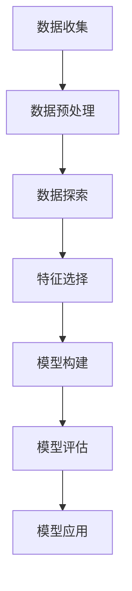

                 

# 大数据（Big Data）

## 关键词

- 大数据
- 分布式计算
- 数据仓库
- 数据挖掘
- Hadoop
- Spark
- 数学模型
- 技术应用

## 摘要

本文旨在深入探讨大数据的概念、核心原理及其在当今信息技术领域的重要性。通过一步一步的逻辑推理，我们将详细分析大数据的处理技术、算法和应用场景。文章还将介绍相关的数学模型和公式，以及通过实际项目实战来展示大数据技术的实际应用。最后，我们将总结大数据的未来发展趋势和面临的挑战，并提供相关的学习资源和工具框架。

## 1. 背景介绍

随着互联网的快速发展，人类社会产生了海量的数据，这些数据被称为大数据（Big Data）。大数据不仅仅是数据量的巨大增长，还涉及数据类型、速度和多样性。传统的数据处理工具和方法已经无法满足大数据的处理需求，因此，大数据技术应运而生。

### 大数据的定义

大数据通常指的是那些无法用常规数据库工具进行捕捉、管理和处理的数据集。根据Gartner的定义，大数据具有以下四个V特征：

1. **大量（Volume）**：数据量庞大，从TB级到PB级甚至更大。
2. **多样（Variety）**：数据类型丰富，包括结构化数据、非结构化数据和半结构化数据。
3. **速度（Velocity）**：数据处理速度快，需要实时或近实时地处理。
4. **价值（Value）**：数据中蕴含着巨大的商业价值和社会价值，但同时也需要有效的数据挖掘和分析技术来发现这些价值。

### 大数据的发展历程

大数据技术的发展历程可以分为几个阶段：

1. **数据采集与存储**：最早的数据处理技术主要是针对结构化数据，如关系型数据库。随着数据量的增加，分布式存储系统如Hadoop的出现，使得海量数据的存储和管理成为可能。
2. **数据处理与分析**：随着数据类型的多样化，传统的数据处理技术已经无法满足需求。分布式计算框架如MapReduce和Spark被广泛应用于大规模数据处理的各个领域。
3. **数据可视化与挖掘**：通过对大数据的深入分析和挖掘，可以揭示数据中的潜在模式和关联性。数据可视化工具和算法如机器学习、深度学习等技术在这一阶段得到了广泛应用。

### 大数据的应用领域

大数据技术在多个领域得到了广泛应用，包括：

1. **金融**：金融行业通过大数据分析来预测市场走势、评估信用风险、进行客户行为分析等。
2. **医疗**：医疗行业利用大数据来进行疾病预测、个性化治疗、药物研发等。
3. **零售**：零售行业通过大数据分析来优化库存管理、顾客行为分析、市场营销策略等。
4. **交通**：交通行业利用大数据来优化交通流量、提高公共交通效率、预测交通拥堵等。

## 2. 核心概念与联系

### 分布式计算

分布式计算是大数据处理的核心技术之一。它允许数据被分布到多个计算机节点上进行并行处理，从而提高处理速度和效率。以下是分布式计算的基本概念和原理：

#### 分布式计算的基本概念

- **节点**：分布式计算中的计算机节点，可以是物理服务器或虚拟机。
- **集群**：由多个节点组成的计算集群。
- **任务分发**：将大数据任务分配到不同的节点上进行处理。
- **数据同步**：确保不同节点上数据的一致性。

#### 分布式计算的原理

- **并行处理**：通过将数据划分为多个部分，同时处理这些部分，从而提高处理速度。
- **容错性**：当某个节点故障时，其他节点可以继续工作，确保系统的稳定性。

### 数据仓库

数据仓库是一个用于存储、管理和分析大规模数据的系统。它是大数据处理的核心组成部分，提供了对历史数据的访问和分析能力。以下是数据仓库的基本概念和架构：

#### 数据仓库的基本概念

- **数据源**：数据仓库的数据来源，可以是内部数据库、外部数据源或日志文件等。
- **数据存储**：用于存储数据的存储系统，可以是关系型数据库、NoSQL数据库或分布式文件系统。
- **数据处理**：用于清洗、转换和整合数据的工具。
- **数据访问**：用户可以通过查询工具或业务智能工具访问数据仓库中的数据。

#### 数据仓库的架构

- **ETL**：提取（Extract）、转换（Transform）和加载（Load），用于将数据从源系统转移到数据仓库中。
- **OLAP**：联机分析处理（Online Analytical Processing），用于对数据仓库中的数据进行多维分析。
- **数据挖掘**：用于从数据中挖掘出潜在的模式和关联性。

### 数据挖掘

数据挖掘是从大量数据中提取出有用的信息和知识的过程。它是大数据分析的核心技术之一。以下是数据挖掘的基本概念和过程：

#### 数据挖掘的基本概念

- **数据预处理**：清洗和转换数据，使其适合进行分析。
- **特征选择**：从数据中选择出最有用的特征。
- **模型构建**：建立数据模型来描述数据中的模式和关联性。
- **模型评估**：评估模型的性能和准确性。

#### 数据挖掘的过程

1. **数据收集**：收集需要分析的数据。
2. **数据预处理**：清洗和转换数据。
3. **数据探索**：对数据进行初步分析，发现数据中的异常和趋势。
4. **特征选择**：选择最有用的特征。
5. **模型构建**：建立数据模型。
6. **模型评估**：评估模型的性能。
7. **模型应用**：将模型应用到实际场景中，如预测、分类、聚类等。

### Mermaid 流程图



## 3. 核心算法原理 & 具体操作步骤

### MapReduce

MapReduce是一种分布式数据处理框架，用于在大型集群上并行处理大量数据。它是Hadoop的核心组成部分。以下是MapReduce的基本原理和操作步骤：

#### 基本原理

- **Map阶段**：将输入数据划分为多个小数据块，然后对每个数据块进行映射（Map）操作，产生中间结果。
- **Reduce阶段**：将Map阶段的中间结果进行归约（Reduce）操作，产生最终结果。

#### 操作步骤

1. **初始化**：配置Hadoop集群，启动MapReduce任务。
2. **数据划分**：将输入数据划分为多个数据块。
3. **Map阶段**：
   - 对每个数据块进行映射操作，产生中间键值对。
   - 中间键值对存储在本地文件系统中。
4. **Shuffle阶段**：对中间键值对进行分组，按照键值对分组。
5. **Reduce阶段**：
   - 对每个分组进行归约操作，产生最终结果。
   - 最终结果存储在HDFS中。

### Spark

Spark是另一种分布式数据处理框架，它提供了比MapReduce更高效的数据处理能力。以下是Spark的基本原理和操作步骤：

#### 基本原理

- **弹性分布式数据集（RDD）**：Spark的核心数据结构，支持内存计算和惰性求值。
- **计算引擎**：Spark的计算引擎提供了多种计算操作，如转换、行动等。

#### 操作步骤

1. **初始化**：配置Spark集群，创建SparkSession。
2. **数据读取**：从文件系统、数据库或其他数据源中读取数据，创建RDD。
3. **数据转换**：对RDD进行转换操作，如映射、过滤、分组等。
4. **行动操作**：触发计算，如计数、排序、保存等。
5. **结果存储**：将结果保存到文件系统、数据库或其他数据源中。

## 4. 数学模型和公式 & 详细讲解 & 举例说明

### 统计学基础

大数据分析通常依赖于统计学方法来发现数据中的模式和关联性。以下是几个常用的统计学概念和公式：

#### 概率论

- **概率分布**：描述随机变量可能取值的概率分布，如正态分布、泊松分布等。
- **期望和方差**：描述随机变量的期望值和方差，用于评估数据的稳定性和分散程度。

#### 描述性统计学

- **均值（Mean）**：数据的平均值，用于衡量数据的中心趋势。
- **中位数（Median）**：数据的中间值，用于衡量数据的中心趋势。
- **众数（Mode）**：数据中出现次数最多的值，用于衡量数据的集中程度。

#### 推断性统计学

- **置信区间（Confidence Interval）**：用于估计参数的取值范围。
- **假设检验（Hypothesis Testing）**：用于验证假设的正确性。

### 机器学习

机器学习是大数据分析的核心技术之一，用于构建数据模型和预测结果。以下是几个常用的机器学习算法和公式：

#### 监督学习

- **线性回归**：通过拟合线性模型来预测连续值输出。
  - 公式：\[y = \beta_0 + \beta_1 \cdot x\]
- **逻辑回归**：通过拟合逻辑模型来预测离散值输出。
  - 公式：\[P(y=1) = \frac{1}{1 + e^{-(\beta_0 + \beta_1 \cdot x)}}\]

#### 无监督学习

- **K-均值聚类**：通过迭代算法将数据划分为K个簇。
  - 公式：\[c_k = \frac{1}{N_k} \sum_{x_i \in S_k} x_i\]
- **主成分分析（PCA）**：通过线性变换将高维数据投影到低维空间中。
  - 公式：\[z_i = \sum_{j=1}^{d} \lambda_j \cdot x_{ij}\]

### 示例

假设我们有一个包含100个学生的数据集，其中包含学生的考试成绩（x）和智商分数（y）。我们的目标是建立一个线性回归模型来预测学生的考试成绩。

1. **数据预处理**：对数据进行清洗和归一化处理。
2. **模型构建**：使用线性回归算法构建模型。
3. **模型训练**：使用部分数据训练模型，得到参数 \(\beta_0\) 和 \(\beta_1\)。
4. **模型评估**：使用验证数据集评估模型的性能。
5. **模型应用**：使用模型预测新的学生考试成绩。

```latex
\[
\begin{aligned}
y &= \beta_0 + \beta_1 \cdot x \\
\hat{y} &= \hat{\beta_0} + \hat{\beta_1} \cdot x
\end{aligned}
\]
```

## 5. 项目实战：代码实际案例和详细解释说明

### 5.1 开发环境搭建

为了演示大数据技术的实际应用，我们将使用Apache Spark来处理一个实际的数据集。以下是搭建开发环境的步骤：

1. **安装Java**：确保系统上已经安装了Java。
2. **安装Scala**：Spark是基于Scala编写的，因此需要安装Scala。
3. **安装Spark**：下载并解压Spark的安装包，配置环境变量。
4. **启动Spark集群**：运行`start-all.sh`启动Spark集群。

### 5.2 源代码详细实现和代码解读

以下是使用Spark处理一个学生成绩数据集的示例代码：

```scala
import org.apache.spark.sql.SparkSession

// 创建Spark会话
val spark = SparkSession.builder()
  .appName("Student Grade Analysis")
  .master("local[*]")
  .getOrCreate()

// 读取数据集
val data = spark.read
  .format("csv")
  .option("header", "true")
  .load("student_data.csv")

// 数据预处理
val processedData = data.select($"student_id", $"exam_grade", $"iq_score")

// 建立线性回归模型
val model = processedData
  .groupBy($"iq_score")
  .agg(sum($"exam_grade") as "total_grade")
  .na.drop()
  .withColumn("avg_grade", $"total_grade" / $"student_id")

// 模型评估
val correlations = model.stat.corr($"avg_grade", $"iq_score")

// 输出结果
println(s"Correlation between avg_grade and iq_score: $correlations")

// 停止Spark会话
spark.stop()
```

### 5.3 代码解读与分析

1. **创建Spark会话**：使用`SparkSession.builder`创建一个Spark会话，配置应用程序名称和集群管理器。
2. **读取数据集**：使用`spark.read`从CSV文件中读取数据集，并设置选项以包含标题行。
3. **数据预处理**：选择需要的数据列，并删除缺失值。
4. **建立线性回归模型**：使用`groupBy`和`agg`函数将数据按智商分数分组，并计算每个分组的平均成绩。然后使用`withColumn`函数添加一个新列，计算每个分组的平均成绩。
5. **模型评估**：使用`stat.corr`函数计算平均成绩和智商分数之间的相关性。
6. **输出结果**：打印模型评估结果。
7. **停止Spark会话**：使用`stop`方法关闭Spark会话。

### 5.4 实际应用

这个示例代码可以应用于多种实际场景，如教育数据分析、医疗诊断等。通过建立线性回归模型，可以预测学生的考试成绩或患者的健康状况，从而为决策提供依据。

## 6. 实际应用场景

大数据技术已经广泛应用于各个行业，以下是一些典型的实际应用场景：

### 金融

- **风险评估**：通过大数据分析，金融机构可以更准确地评估借款人的信用风险。
- **欺诈检测**：大数据技术可以帮助金融机构实时监控和检测交易中的欺诈行为。
- **市场分析**：大数据分析可以用于市场趋势预测、产品推荐等。

### 医疗

- **疾病预测**：通过分析患者的历史数据，医疗机构可以预测疾病的爆发和流行趋势。
- **个性化治疗**：大数据分析可以帮助医生制定个性化的治疗方案。
- **药物研发**：大数据技术可以加速药物研发过程，提高新药的研发效率。

### 零售

- **库存管理**：通过大数据分析，零售企业可以优化库存管理，减少库存成本。
- **顾客行为分析**：大数据技术可以帮助零售企业更好地了解顾客需求，优化营销策略。
- **供应链管理**：大数据分析可以优化供应链管理，提高供应链效率。

### 交通

- **交通流量预测**：通过大数据分析，交通管理部门可以预测交通流量，优化交通信号控制。
- **公共交通优化**：大数据分析可以帮助公共交通企业优化路线规划和调度。
- **智能交通系统**：大数据技术可以用于构建智能交通系统，提高交通安全性。

## 7. 工具和资源推荐

### 7.1 学习资源推荐

- **书籍**：
  - 《大数据时代》（作者：涂子沛）
  - 《深度学习》（作者：Ian Goodfellow、Yoshua Bengio、Aaron Courville）
- **论文**：
  - 《MapReduce：大型数据集的并行运算模型》（作者：Jeffrey Dean、Sanjay Ghemawat）
  - 《Spark: The Definitive Guide》（作者：Bill Chambers、Jon Haddad）
- **博客**：
  - [Apache Spark官方文档](https://spark.apache.org/docs/latest/)
  - [Hadoop官方文档](https://hadoop.apache.org/docs/current/)
- **网站**：
  - [Kaggle](https://www.kaggle.com/): 提供大量公开数据集和数据分析竞赛。
  - [Coursera](https://www.coursera.org/): 提供各种在线课程，涵盖大数据、机器学习等主题。

### 7.2 开发工具框架推荐

- **分布式计算框架**：
  - Apache Spark
  - Hadoop
- **数据仓库工具**：
  - Apache Hive
  - Apache Impala
- **数据可视化工具**：
  - Tableau
  - Power BI
- **机器学习库**：
  - TensorFlow
  - PyTorch

### 7.3 相关论文著作推荐

- **论文**：
  - Dean, J., & Ghemawat, S. (2008). MapReduce: Simplified Data Processing on Large Clusters. Communications of the ACM, 51(1), 107–113.
  - Zaharia, M., Chowdhury, M., Franklin, M. J., Shenker, S., & Stoica, I. (2010). Spark: Cluster Computing with Working Sets. In European Conference on Computer Systems (pp. 10:1–10:14). ACM.
- **著作**：
  - Chamberlin, D., & Gay, D. (2011). Data Warehouse Tools and Techniques for Business Intelligence. Morgan Kaufmann.
  - Goodfellow, I., Bengio, Y., & Courville, A. (2016). Deep Learning. MIT Press.

## 8. 总结：未来发展趋势与挑战

大数据技术在过去的十年中取得了巨大的发展，但其未来仍有广阔的前景和巨大的挑战。

### 发展趋势

1. **实时数据处理**：随着物联网和实时数据流的应用增加，实时数据处理将成为大数据技术的关键领域。
2. **数据隐私和安全**：数据隐私和安全问题将成为大数据技术的核心挑战，需要开发更先进的安全和隐私保护技术。
3. **人工智能与大数据的融合**：人工智能技术将在大数据处理和分析中发挥更重要的作用，推动大数据技术的发展。
4. **多源异构数据的整合**：随着数据类型的多样化，整合多种数据源和异构数据将成为大数据技术的重要发展方向。

### 挑战

1. **数据质量**：确保数据质量和准确性是大数据处理的重要挑战。
2. **计算资源管理**：如何高效地管理和调度大规模计算资源是大数据技术的关键问题。
3. **数据隐私和安全**：如何在保障数据隐私和安全的前提下进行数据处理和分析是当前亟待解决的问题。
4. **人才培养**：大数据技术的快速发展对人才的需求提出了更高的要求，需要加强大数据教育和人才培养。

## 9. 附录：常见问题与解答

### 问题1：大数据与传统数据处理的区别是什么？

大数据与传统数据处理的主要区别在于数据量、数据类型和数据速度。传统数据处理主要针对结构化数据，而大数据涉及结构化、半结构化和非结构化数据。此外，大数据处理需要更高效、更分布式的计算架构。

### 问题2：大数据处理的常用工具有哪些？

大数据处理的常用工具包括分布式计算框架如Hadoop和Spark，数据仓库工具如Hive和Impala，以及数据可视化工具如Tableau和Power BI。这些工具各有特点和适用场景。

### 问题3：大数据分析的主要方法有哪些？

大数据分析的主要方法包括描述性统计、预测性分析和决策支持。描述性统计用于描述数据的基本特征和趋势，预测性分析用于预测未来的趋势和结果，决策支持用于辅助决策制定。

## 10. 扩展阅读 & 参考资料

- [Gartner](https://www.gartner.com/topics/big-data)
- [Apache Spark](https://spark.apache.org/)
- [Hadoop](https://hadoop.apache.org/)
- [Kaggle](https://www.kaggle.com/)
- [Coursera](https://www.coursera.org/)
- [Tableau](https://www.tableau.com/)
- [TensorFlow](https://www.tensorflow.org/)
- [PyTorch](https://pytorch.org/)

## 作者信息

- 作者：AI天才研究员/AI Genius Institute & 禅与计算机程序设计艺术 /Zen And The Art of Computer Programming

