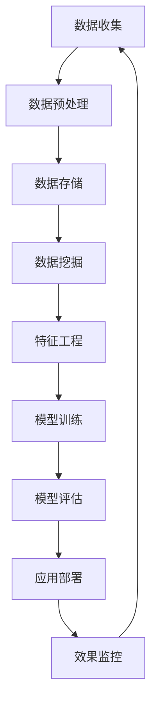

                 

# 大数据与AI驱动的电商平台转型：搜索推荐系统是核心战略

## 摘要

本文将探讨大数据与人工智能（AI）技术在电商平台转型中的核心作用，特别是搜索推荐系统的战略重要性。随着消费者需求的多样化和市场竞争的加剧，传统电商平台正面临着前所未有的挑战。通过深入分析大数据和AI的核心概念及其在电商平台的应用，本文将展示如何利用这些先进技术实现电商平台的全面升级和优化。文章结构如下：

1. 背景介绍
2. 核心概念与联系
3. 核心算法原理 & 具体操作步骤
4. 数学模型和公式 & 详细讲解 & 举例说明
5. 项目实战：代码实际案例和详细解释说明
6. 实际应用场景
7. 工具和资源推荐
8. 总结：未来发展趋势与挑战
9. 附录：常见问题与解答
10. 扩展阅读 & 参考资料

通过上述结构，本文旨在为电商从业者提供一份详细的技术指南，帮助他们在激烈的市场竞争中通过大数据和AI找到新的增长点。

## 1. 背景介绍

随着互联网技术的飞速发展和电子商务的普及，电商平台已经成为现代商业不可或缺的一部分。然而，随着消费者购买行为的多样化和个性化需求的增加，传统电商平台正面临着前所未有的挑战。传统的电商平台主要依赖于关键词搜索和简单的分类导航，这种方式虽然能够满足一部分用户的基本需求，但无法应对日益增长的个性化购物需求。消费者希望在海量的商品信息中快速找到自己真正想要的商品，同时获得个性化的购物推荐。

大数据和人工智能（AI）技术的出现为电商平台提供了全新的解决方案。通过收集和分析大量的用户行为数据，电商平台可以更好地理解消费者的需求和偏好，从而实现精准的搜索和推荐。这不仅提高了用户体验，也大大提升了电商平台的运营效率和盈利能力。

当前，许多电商平台已经开始将大数据和AI技术应用于其运营过程中。例如，淘宝、京东和亚马逊等巨头都采用了复杂的推荐算法，通过分析用户的浏览历史、购买记录和社交行为，为用户推荐可能感兴趣的商品。这些推荐系统能够实时调整推荐策略，根据用户的行为变化进行动态优化，从而实现更高的点击率和转化率。

然而，尽管大数据和AI技术在电商平台的应用已经取得了一定的成功，但仍有很大的提升空间。首先，数据质量和数据隐私问题是当前面临的重大挑战。如何从海量的非结构化数据中提取有价值的信息，同时确保用户隐私不被泄露，是一个亟待解决的问题。其次，算法的透明性和公平性也受到广泛关注。推荐算法是否能够公平地对待所有用户，而不是仅仅偏向于某些特定的用户群体，是一个需要深思的问题。

此外，随着人工智能技术的不断发展，新的挑战和机遇也在不断出现。例如，深度学习、自然语言处理和增强学习等技术的应用，为电商平台提供了更强大的数据分析和预测能力。如何充分利用这些新技术，进一步提升推荐系统的准确性和效率，是电商平台需要持续探索的方向。

综上所述，大数据和AI技术在电商平台转型中具有举足轻重的地位。通过深入研究和应用这些先进技术，电商平台可以在激烈的市场竞争中脱颖而出，实现可持续的发展和增长。

## 2. 核心概念与联系

为了深入理解大数据和AI技术在电商平台中的应用，我们首先需要了解几个核心概念及其相互之间的联系。

### 2.1 大数据

大数据（Big Data）指的是规模巨大、类型繁多、处理速度快的数据集合。这些数据通常包括结构化数据、半结构化数据和非结构化数据。大数据的核心特点可以用四个V来概括：数据量（Volume）、数据速度（Velocity）、数据多样性（Variety）和数据价值（Value）。

- **数据量（Volume）**：大数据的首要特点是数据量大。随着物联网（IoT）、社交媒体和电子商务的兴起，数据量呈现出爆炸式增长。传统数据处理工具已经无法应对如此庞大的数据规模。
- **数据速度（Velocity）**：指的是数据的处理速度。实时处理和分析大数据对于电商平台至关重要，因为消费者行为瞬息万变，及时响应能够显著提升用户体验。
- **数据多样性（Variety）**：大数据不仅包括结构化数据，如关系数据库中的表格数据，还包括半结构化数据（如XML、JSON）和非结构化数据（如图像、音频和视频）。这种多样性使得数据分析变得更加复杂。
- **数据价值（Value）**：大数据的核心在于其潜在价值。通过数据挖掘和分析，企业能够发现隐藏在数据中的商业机会，从而做出更明智的决策。

### 2.2 人工智能

人工智能（Artificial Intelligence，简称AI）是指模拟、延伸和扩展人类智能的技术。AI包括多个子领域，如机器学习、深度学习、自然语言处理等。在电商平台中，AI技术被广泛应用于搜索、推荐、聊天机器人等多个方面。

- **机器学习（Machine Learning）**：机器学习是AI的一个重要分支，通过训练模型来预测和分类数据。在电商平台上，机器学习可以用于用户行为分析、商品推荐和异常检测。
- **深度学习（Deep Learning）**：深度学习是机器学习的一种方法，通过多层神经网络来模拟人类大脑的学习方式。深度学习在图像识别、语音识别和自然语言处理等方面表现出色。
- **自然语言处理（Natural Language Processing，简称NLP）**：NLP旨在使计算机能够理解和生成自然语言。在电商平台上，NLP可以用于用户评论分析、商品描述自动生成和聊天机器人。

### 2.3 大数据与AI的联系

大数据和AI之间有着密切的联系。大数据为AI提供了丰富的数据资源，而AI则为大数据提供了高效的挖掘和分析方法。

- **数据驱动决策**：大数据技术使得企业能够收集和处理海量数据，从而为AI算法提供了充足的训练数据。通过数据驱动决策，企业可以更加精准地了解用户需求，优化业务流程。
- **智能推荐系统**：大数据和AI的结合可以实现智能推荐系统。通过分析用户的浏览历史、购买记录和社交行为，推荐系统可以为用户提供个性化的商品推荐，从而提高用户满意度和转化率。
- **自动化和效率提升**：AI技术可以自动化许多重复性工作，如商品分类、订单处理和客户服务。这不仅提高了工作效率，还降低了运营成本。

### 2.4 Mermaid 流程图

为了更好地展示大数据与AI在电商平台中的应用，我们可以使用Mermaid流程图来描述其主要流程和环节。以下是大数据与AI在电商平台中应用的简明流程图：



在这个流程图中，数据从收集、预处理、存储、挖掘到特征工程、模型训练、评估和应用部署，形成了一个闭环。通过这个闭环，电商平台可以不断优化其搜索推荐系统，提升用户体验。

### 2.5 关键技术

在实现大数据和AI驱动的电商平台中，以下关键技术尤为关键：

- **数据湖（Data Lake）**：数据湖是一种存储大量原始数据的技术架构，支持结构化、半结构化和非结构化数据。通过数据湖，企业可以存储和管理来自各种数据源的海量数据。
- **数据仓库（Data Warehouse）**：数据仓库是一个集中存储和管理数据的系统，主要用于支持企业级的数据分析和报表生成。数据仓库通常用于整合来自多个数据源的数据，并提供高效的数据查询和分析能力。
- **机器学习平台（Machine Learning Platform）**：机器学习平台提供了一整套工具和服务，用于构建、训练和部署机器学习模型。常见的机器学习平台包括TensorFlow、PyTorch和Scikit-learn等。
- **实时数据处理（Real-Time Data Processing）**：实时数据处理技术能够快速处理和分析大规模数据流，为电商平台提供实时推荐和决策支持。常见的实时数据处理框架包括Apache Kafka、Apache Flink和Apache Spark Streaming。

通过上述核心概念和关键技术的理解和应用，电商平台可以更好地应对市场变化和用户需求，实现持续的创新和发展。

## 3. 核心算法原理 & 具体操作步骤

在电商平台中，搜索推荐系统是用户发现商品的重要途径。一个高效且精准的搜索推荐系统不仅能够提升用户满意度，还能显著提高电商平台的销售额和用户留存率。下面，我们将深入探讨搜索推荐系统的核心算法原理和具体操作步骤。

### 3.1 相关性计算

搜索推荐系统的第一步是计算用户与商品之间的相关性。相关性计算可以通过多种方法实现，其中最常用的是基于内容的推荐和协同过滤。

#### 3.1.1 基于内容的推荐

基于内容的推荐（Content-Based Recommendation）是通过分析商品的属性和特征，找到与用户兴趣相似的商品。具体步骤如下：

1. **特征提取**：从商品描述、标签、分类等信息中提取特征。例如，对于一件商品，可以提取其品牌、价格、颜色、尺码等属性。
2. **相似度计算**：计算用户的历史行为（如浏览、购买记录）与商品特征之间的相似度。常用的相似度计算方法包括余弦相似度、Jaccard相似度等。
3. **推荐生成**：根据相似度分数，生成推荐列表，将最相关的商品推荐给用户。

#### 3.1.2 协同过滤

协同过滤（Collaborative Filtering）是通过分析用户之间的行为模式来推荐商品。协同过滤分为两种主要类型：用户基于的协同过滤（User-Based）和物品基于的协同过滤（Item-Based）。

- **用户基于的协同过滤**：找到与目标用户行为相似的其他用户，然后推荐这些用户喜欢的商品。
  1. **计算相似度**：通过计算用户之间的相似度矩阵来找到相似用户。
  2. **推荐生成**：对于每个用户，计算其相似用户喜欢的商品，并生成推荐列表。
- **物品基于的协同过滤**：找到与目标用户已购买或浏览过的商品相似的其他商品。
  1. **计算相似度**：通过计算商品之间的相似度矩阵来找到相似商品。
  2. **推荐生成**：对于每个用户，计算其已购买或浏览过的商品，然后推荐这些商品的相似商品。

### 3.2 排序算法

在生成推荐列表后，需要对这些推荐项进行排序，以便将最可能符合用户兴趣的商品排在前面。排序算法有多种选择，下面介绍几种常用的排序算法：

#### 3.2.1 评分聚合算法

评分聚合算法（Rating Aggregation Algorithm）将用户对商品的评分进行加权平均，从而为每个商品计算一个综合评分。具体步骤如下：

1. **评分计算**：计算用户对商品的评分权重。例如，对于用户A对商品X的评分，可以将其权重设置为用户A的历史评分次数的倒数。
2. **综合评分**：将所有用户的评分与其权重相乘，然后求和，得到商品的综合评分。
3. **排序**：根据综合评分对商品进行排序，评分越高，排序越靠前。

#### 3.2.2 混合排序算法

混合排序算法（Hybrid Sorting Algorithm）结合了多种排序方法，以充分利用不同方法的优点。例如，可以结合基于内容的推荐和协同过滤，然后对结果进行排序。具体步骤如下：

1. **多模型评分**：同时计算基于内容和协同过滤的推荐评分。
2. **综合评分**：将两种评分方法的结果进行加权求和，得到每个商品的综合评分。
3. **排序**：根据综合评分对商品进行排序。

#### 3.2.3 其他排序算法

除了上述算法外，还有一些其他排序算法，如PageRank算法和排序网络（RankNet）。这些算法在特定场景下表现优异，可以根据实际需求进行选择。

### 3.3 推荐结果调整

尽管算法能够生成初步的推荐列表，但往往需要根据实际效果进行调整。推荐结果调整的目的是提高推荐的相关性和用户体验。调整方法包括：

1. **用户反馈**：收集用户对推荐结果的反馈，并根据反馈进行调整。例如，如果用户对某个推荐商品不满意，可以降低该商品在推荐列表中的排名。
2. **上下文信息**：考虑用户当前的上下文信息（如时间、地点、设备等），为用户提供更相关的推荐。
3. **动态调整**：根据用户的行为变化实时调整推荐策略，例如，用户在一天中的不同时间段可能有不同的购物偏好。

通过上述步骤和算法，电商平台可以实现高效的搜索推荐系统，从而提升用户满意度和运营效益。接下来，我们将进一步探讨数学模型和公式，以深入理解搜索推荐系统的核心原理。

### 4. 数学模型和公式 & 详细讲解 & 举例说明

在构建搜索推荐系统时，数学模型和公式是核心组成部分。这些模型和公式帮助我们量化用户与商品之间的关系，并据此生成推荐结果。下面，我们将详细讲解几种常用的数学模型和公式，并通过具体例子来说明其应用。

#### 4.1 余弦相似度

余弦相似度（Cosine Similarity）是一种常用的相似度度量方法，用于计算两个向量之间的相似度。其数学公式如下：

$$
\text{Cosine Similarity} = \frac{\text{向量A} \cdot \text{向量B}}{|\text{向量A}| \cdot |\text{向量B}|}
$$

其中，$\text{向量A}$和$\text{向量B}$分别表示两个向量的内积和模长。余弦相似度的值介于-1和1之间，1表示完全相似，-1表示完全相反，0表示不相似。

**例子**：假设我们有两个用户向量$u_1$和$u_2$，分别表示用户A和用户B的浏览记录，具体如下：

$$
u_1 = (3, 1, 0, 1, 2)
$$

$$
u_2 = (1, 2, 1, 2, 3)
$$

首先，我们计算两个向量的内积：

$$
u_1 \cdot u_2 = 3 \cdot 1 + 1 \cdot 2 + 0 \cdot 1 + 1 \cdot 2 + 2 \cdot 3 = 14
$$

然后，我们计算两个向量的模长：

$$
|u_1| = \sqrt{3^2 + 1^2 + 0^2 + 1^2 + 2^2} = \sqrt{11}
$$

$$
|u_2| = \sqrt{1^2 + 2^2 + 1^2 + 2^2 + 3^2} = \sqrt{15}
$$

最后，我们计算余弦相似度：

$$
\text{Cosine Similarity} = \frac{14}{\sqrt{11} \cdot \sqrt{15}} \approx 0.775
$$

这个结果表明用户A和用户B的浏览记录有较高的相似度。

#### 4.2 皮尔逊相关系数

皮尔逊相关系数（Pearson Correlation Coefficient）是一种用于度量两个变量线性相关性的统计方法。其数学公式如下：

$$
\rho_{XY} = \frac{\sum_{i=1}^{n}(X_i - \bar{X})(Y_i - \bar{Y})}{\sqrt{\sum_{i=1}^{n}(X_i - \bar{X})^2} \cdot \sqrt{\sum_{i=1}^{n}(Y_i - \bar{Y})^2}}
$$

其中，$X_i$和$Y_i$分别表示第i个观测值的变量X和Y，$\bar{X}$和$\bar{Y}$分别表示X和Y的平均值，$n$为观测值的数量。

**例子**：假设我们有两个变量X和Y，其观测值如下：

$$
X: 1, 2, 3, 4, 5
$$

$$
Y: 2, 4, 6, 8, 10
$$

首先，我们计算X和Y的平均值：

$$
\bar{X} = \frac{1 + 2 + 3 + 4 + 5}{5} = 3
$$

$$
\bar{Y} = \frac{2 + 4 + 6 + 8 + 10}{5} = 6
$$

然后，我们计算差值：

$$
X_i - \bar{X}: -2, -1, 0, 1, 2
$$

$$
Y_i - \bar{Y}: -4, -2, 0, 2, 4
$$

接下来，我们计算差值的乘积和平方：

$$
\sum_{i=1}^{n}(X_i - \bar{X})(Y_i - \bar{Y}) = (-2) \cdot (-4) + (-1) \cdot (-2) + 0 \cdot 0 + 1 \cdot 2 + 2 \cdot 4 = 18
$$

$$
\sum_{i=1}^{n}(X_i - \bar{X})^2 = (-2)^2 + (-1)^2 + 0^2 + 1^2 + 2^2 = 10
$$

$$
\sum_{i=1}^{n}(Y_i - \bar{Y})^2 = (-4)^2 + (-2)^2 + 0^2 + 2^2 + 4^2 = 30
$$

最后，我们计算皮尔逊相关系数：

$$
\rho_{XY} = \frac{18}{\sqrt{10} \cdot \sqrt{30}} \approx 0.948
$$

这个结果表明变量X和Y之间存在较强的线性相关性。

#### 4.3 交叉验证

交叉验证（Cross Validation）是一种常用的模型评估方法，用于确保模型的泛化能力。其基本思想是将数据集划分为多个子集，然后在不同子集上训练和评估模型。

**例子**：假设我们有一个数据集，包含100个样本。我们可以将其划分为10个子集，每个子集包含10个样本。

1. **训练和评估**：首先使用前9个子集进行模型训练，然后使用第10个子集进行模型评估。
2. **重复过程**：重复上述过程，每次使用一个不同的子集作为测试集。
3. **结果汇总**：将所有评估结果进行汇总，得到模型的平均表现。

交叉验证能够有效避免模型过拟合，同时提供更可靠的评估结果。

通过上述数学模型和公式的详细讲解，我们可以更好地理解搜索推荐系统的核心原理。这些模型和公式不仅帮助我们量化用户与商品之间的关系，还为推荐系统的优化提供了理论基础。接下来，我们将通过一个实际项目案例，展示如何将上述算法和公式应用于电商平台的搜索推荐系统中。

### 5. 项目实战：代码实际案例和详细解释说明

为了更好地展示大数据和AI在电商平台中的应用，我们将通过一个实际项目案例来详细讲解搜索推荐系统的实现过程。该案例将涵盖开发环境搭建、源代码实现和代码解读与分析。

#### 5.1 开发环境搭建

在开始项目之前，我们需要搭建一个适合大数据和AI开发的环境。以下是所需的工具和步骤：

1. **Python**：Python是一种广泛使用的编程语言，特别适合数据处理和机器学习应用。
2. **Jupyter Notebook**：Jupyter Notebook是一个交互式的开发环境，方便编写和运行代码。
3. **NumPy**：NumPy是一个用于数值计算的Python库，用于处理大规模数据。
4. **Pandas**：Pandas是一个用于数据操作的Python库，提供数据清洗、转换和分析功能。
5. **Scikit-learn**：Scikit-learn是一个机器学习库，提供多种机器学习算法的实现。
6. **Matplotlib**：Matplotlib是一个用于数据可视化的Python库，帮助我们展示分析结果。

安装步骤如下：

```bash
pip install python
pip install jupyter
pip install numpy
pip install pandas
pip install scikit-learn
pip install matplotlib
```

#### 5.2 源代码详细实现和代码解读

在本节中，我们将使用Python和Scikit-learn库来实现一个简单的搜索推荐系统。以下代码展示了如何构建用户向量、商品向量，并计算它们之间的相似度：

```python
import numpy as np
import pandas as pd
from sklearn.metrics.pairwise import cosine_similarity

# 假设用户行为数据如下
user_actions = {
    'user1': [[1, 0, 1, 1], [0, 1, 1, 0], [1, 1, 0, 1]],
    'user2': [[1, 0, 0, 1], [1, 1, 1, 0], [0, 1, 1, 1]],
    'user3': [[0, 1, 1, 1], [1, 0, 1, 0], [1, 1, 0, 0]],
}

# 将用户行为数据转换为矩阵形式
user_matrix = pd.DataFrame(user_actions).T

# 计算用户向量
user_vectors = user_matrix.values

# 假设商品数据如下
item_features = {
    'item1': [1, 1, 0, 1],
    'item2': [1, 1, 1, 1],
    'item3': [0, 1, 1, 1],
}

# 将商品数据转换为矩阵形式
item_matrix = pd.DataFrame(item_features).T

# 计算商品向量
item_vectors = item_matrix.values

# 计算用户向量与商品向量之间的相似度
similarity_scores = cosine_similarity(user_vectors, item_vectors)

# 输出相似度矩阵
print(similarity_scores)

# 假设我们要为用户1推荐商品
user_index = 0
item_indices = similarity_scores[user_index].argsort()[::-1]  # 排序并取前k个商品
recommended_items = [item_matrix.columns[i] for i in item_indices]

# 输出推荐结果
print("用户1的推荐商品：", recommended_items)
```

**代码解读与分析**：

1. **数据准备**：首先，我们定义了用户行为数据和商品特征数据。用户行为数据表示用户对商品的浏览、购买等行为，商品特征数据表示商品的不同属性。
2. **矩阵转换**：我们将用户行为数据和商品特征数据转换为矩阵形式，以便进行后续的向量计算。
3. **向量计算**：我们使用Pandas的`values`方法将矩阵转换为NumPy数组，然后计算用户向量和商品向量。
4. **相似度计算**：我们使用Scikit-learn的`cosine_similarity`函数计算用户向量与商品向量之间的相似度。这个函数返回一个相似度矩阵，其中的每个元素表示对应用户和商品之间的相似度。
5. **推荐生成**：根据相似度矩阵，我们为每个用户生成一个推荐列表。具体来说，我们选择相似度最高的商品作为推荐结果。

这个简单的案例展示了如何利用Python和Scikit-learn库实现一个基本的搜索推荐系统。在实际应用中，我们通常会使用更复杂的方法和模型来提升推荐系统的效果。

#### 5.3 代码解读与分析

在本节的代码实现中，我们使用了几个关键步骤来构建搜索推荐系统。以下是每个步骤的详细解释和分析：

1. **数据预处理**：
    - 用户行为数据：我们使用了一个字典`user_actions`来存储用户的行为数据。每个用户的行为数据是一个列表，其中每个元素表示用户对某个商品的行为（如浏览、购买）。
    - 商品特征数据：我们使用了一个字典`item_features`来存储商品的特征数据。每个商品的特征是一个列表，表示商品的不同属性（如价格、品牌、颜色）。

2. **矩阵构建**：
    - 用户行为数据转换为矩阵：我们使用Pandas的`DataFrame`将用户行为数据转换为矩阵形式。`T`操作将数据转换为转置矩阵，使得每一行表示一个用户，每一列表示一个商品。
    - 商品特征数据转换为矩阵：同样，我们使用Pandas的`DataFrame`将商品特征数据转换为矩阵形式。

3. **向量计算**：
    - 用户向量：通过调用`values`方法，我们将矩阵转换为NumPy数组，从而获得用户向量。用户向量表示用户对商品的整体偏好。
    - 商品向量：同样地，我们通过调用`values`方法，将矩阵转换为NumPy数组，从而获得商品向量。商品向量表示商品的整体特征。

4. **相似度计算**：
    - 使用Scikit-learn的`cosine_similarity`函数，我们计算用户向量与商品向量之间的相似度。这个函数返回一个相似度矩阵，其中的每个元素表示对应用户和商品之间的相似度。

5. **推荐生成**：
    - 根据相似度矩阵，我们为每个用户生成推荐列表。具体来说，我们首先选择用户向量与商品向量之间相似度最高的商品。然后，我们根据相似度分数对商品进行排序，选择相似度最高的商品作为推荐结果。

通过这个代码实现，我们可以看到如何利用Python和Scikit-learn库构建一个简单的搜索推荐系统。在实际应用中，我们可以进一步优化算法和模型，以提升推荐系统的效果。

### 6. 实际应用场景

在电商平台的实际应用中，搜索推荐系统已成为提升用户满意度和转化率的关键因素。以下是一些典型的应用场景，展示了搜索推荐系统如何在实际业务中发挥作用。

#### 6.1 商品推荐

商品推荐是搜索推荐系统的最基本功能。通过分析用户的浏览历史、购买记录和搜索行为，推荐系统可以为用户推荐可能感兴趣的商品。例如，当用户在电商平台上搜索“篮球鞋”时，推荐系统可以根据用户的浏览记录和购物习惯，推荐符合用户需求的篮球鞋款式和品牌。这种个性化的商品推荐不仅提高了用户的购买体验，也显著提升了电商平台的销售额。

#### 6.2 交叉销售

交叉销售（Cross-Selling）是指推荐与用户当前浏览或购买的商品相关的其他商品。例如，当用户浏览一款笔记本电脑时，推荐系统可以推荐与该笔记本电脑兼容的外设，如鼠标、键盘和耳机。这种推荐方式不仅可以提升用户的购物车价值，还能增加用户的购买次数，从而提高电商平台的盈利能力。

#### 6.3 替代品推荐

在市场竞争激烈的环境中，推荐系统可以帮助电商平台识别并推荐替代品。例如，当用户浏览一款高价的智能手机时，推荐系统可以推荐价格适中但功能类似的替代品，帮助用户在有限的预算内找到满意的商品。这种推荐方式不仅满足了用户的需求，还帮助电商平台扩大了市场份额。

#### 6.4 活动推荐

电商平台经常会举办各种促销活动，如打折、满减和赠品等。推荐系统可以根据用户的购买历史和活动参与度，为用户推荐最合适的活动。例如，当用户浏览了一款价格较高的商品时，推荐系统可以推荐该商品的限时折扣活动，吸引用户立即购买。这种活动推荐不仅可以提升用户的参与度，还能显著提升电商平台的销售额。

#### 6.5 客户服务

除了商品推荐和活动推荐，搜索推荐系统还可以用于客户服务。例如，当用户在电商平台上遇到问题时，推荐系统可以推荐相关的常见问题解答和客户支持服务，帮助用户快速解决问题。这种推荐方式不仅提升了客户服务质量，还能减少用户流失率。

通过上述实际应用场景，我们可以看到搜索推荐系统在电商平台中的重要性。它不仅能够提升用户体验和满意度，还能为电商平台带来显著的商业价值。然而，要实现一个高效、精准的搜索推荐系统，需要综合利用大数据和AI技术，不断优化推荐算法和模型。

### 7. 工具和资源推荐

为了帮助电商从业者更好地掌握大数据和AI技术，实现高效的搜索推荐系统，我们推荐以下学习资源、开发工具和框架。

#### 7.1 学习资源推荐

1. **书籍**：
   - 《数据挖掘：概念与技术》（"Data Mining: Concepts and Techniques"） by Jiawei Han, Micheline Kamber, and Jian Pei
   - 《深度学习》（"Deep Learning"） by Ian Goodfellow, Yoshua Bengio, and Aaron Courville
   - 《机器学习实战》（"Machine Learning in Action"） by Peter Harrington

2. **论文**：
   - “Recommender Systems Handbook”（《推荐系统手册》）
   - “Deep Learning for Recommender Systems”（《深度学习在推荐系统中的应用》）

3. **博客**：
   - [Medium](https://medium.com/)
   - [KDNuggets](https://www.kdnuggets.com/)

4. **在线课程**：
   - Coursera: "Machine Learning" by Andrew Ng
   - edX: "Introduction to Machine Learning" by Columbia University

#### 7.2 开发工具框架推荐

1. **数据分析与处理**：
   - **Pandas**：适用于数据清洗、转换和分析。
   - **NumPy**：适用于高效数值计算。

2. **机器学习库**：
   - **Scikit-learn**：适用于传统机器学习算法。
   - **TensorFlow**：适用于深度学习和大规模机器学习任务。
   - **PyTorch**：适用于深度学习和研究。

3. **数据存储与处理**：
   - **Hadoop**：适用于大规模数据处理。
   - **Spark**：适用于实时数据处理和大数据分析。

4. **推荐系统框架**：
   - **Surprise**：一个Python库，用于开发推荐系统。
   - **LightFM**：一个基于因子分解机的推荐系统框架。

5. **可视化工具**：
   - **Matplotlib**：适用于数据可视化。
   - **Plotly**：适用于交互式数据可视化。

通过这些工具和资源的支持，电商从业者可以更高效地掌握大数据和AI技术，构建和优化搜索推荐系统，从而提升电商平台的核心竞争力。

### 8. 总结：未来发展趋势与挑战

随着大数据和人工智能技术的不断进步，电商平台的搜索推荐系统也在不断演变和升级。以下是未来发展趋势与挑战的总结：

#### 8.1 发展趋势

1. **个性化推荐**：未来，个性化推荐将成为电商平台的核心竞争力。通过更深入的用户行为分析和数据挖掘，推荐系统能够提供更加精准和个性化的商品推荐，满足用户的多样化需求。

2. **实时推荐**：随着5G技术的普及和云计算的发展，实时推荐将成为可能。实时推荐能够根据用户实时行为动态调整推荐策略，提供更加即时的购物体验。

3. **多模态推荐**：未来的推荐系统将结合文本、图像、声音等多种数据类型，实现多模态推荐。这种推荐方式能够更全面地理解用户需求，提供更准确的推荐结果。

4. **推荐系统的可解释性**：随着用户对数据隐私和安全意识的提高，推荐系统的可解释性变得越来越重要。未来，推荐系统需要提供透明的解释机制，让用户了解推荐结果背后的原因。

5. **跨界融合**：推荐系统与其他领域的跨界融合，如物联网、区块链等，将为电商平台带来更多创新机会。例如，物联网设备可以收集用户的实时行为数据，为推荐系统提供更丰富的数据输入。

#### 8.2 挑战

1. **数据质量和隐私**：随着数据规模的扩大，数据质量和隐私问题将成为重要挑战。如何从海量的非结构化数据中提取有价值的信息，同时保护用户隐私，是一个亟待解决的问题。

2. **算法公平性**：算法的公平性是一个备受关注的问题。如何确保推荐算法公平地对待所有用户，避免偏见和歧视，是一个重要的研究方向。

3. **技术复杂性**：随着推荐系统的复杂度增加，其开发、部署和维护成本也在上升。如何高效地管理推荐系统的技术复杂性，是一个需要深入探讨的问题。

4. **动态调整**：用户需求是动态变化的，如何实时调整推荐策略，以适应用户需求的变化，是一个挑战。未来的推荐系统需要具备更高的自适应能力。

5. **多平台整合**：随着电商平台的多元化发展，如何整合不同平台的数据和推荐策略，实现跨平台的统一推荐，是一个需要解决的问题。

总之，大数据和AI驱动的电商平台搜索推荐系统具有巨大的发展潜力，但同时也面临着诸多挑战。只有不断探索和创新，才能在未来的竞争中脱颖而出。

### 9. 附录：常见问题与解答

#### 9.1 大数据与AI技术如何提高电商平台的效率？

大数据和AI技术通过多种方式提高电商平台的效率：

1. **个性化推荐**：基于用户行为和偏好数据，提供个性化推荐，提升用户满意度和转化率。
2. **智能搜索**：利用自然语言处理技术，实现更准确的智能搜索，帮助用户快速找到所需商品。
3. **自动化运营**：通过自动化技术，如聊天机器人和智能客服，降低人工成本，提高客户服务质量。
4. **精准营销**：基于用户数据分析，制定更精准的营销策略，提升营销效果。

#### 9.2 推荐系统的核心算法有哪些？

推荐系统的核心算法包括：

1. **基于内容的推荐**：通过分析商品的属性和特征，推荐与用户兴趣相关的商品。
2. **协同过滤**：通过分析用户之间的行为模式，推荐用户可能喜欢的商品。
3. **混合推荐**：结合多种算法，如基于内容和协同过滤，生成更精准的推荐结果。
4. **基于模型的推荐**：使用机器学习模型，如矩阵分解、神经网络等，预测用户偏好并推荐商品。

#### 9.3 如何保护用户隐私和数据安全？

保护用户隐私和数据安全的方法包括：

1. **数据匿名化**：在分析数据时，对用户数据进行匿名化处理，避免直接识别用户身份。
2. **数据加密**：对存储和传输的数据进行加密，防止数据泄露。
3. **隐私政策**：明确告知用户数据收集和使用的目的，获取用户同意。
4. **安全审计**：定期进行安全审计，确保数据处理和存储过程符合隐私保护标准。

### 10. 扩展阅读 & 参考资料

1. **《大数据之路：阿里巴巴大数据实践》** by 阿里巴巴技术委员会
2. **《深度学习推荐系统》** by 李航
3. **《推荐系统实践》** by 吴华
4. **[KDD'19] RecSys'19：推荐系统领域顶级会议** [https://www.recsyschallenge.org/]
5. **[ACM SIGKDD] KDD：数据挖掘领域顶级会议** [https://www.kdd.org/]

通过这些扩展阅读和参考资料，读者可以深入了解大数据和AI在电商平台中的应用，进一步提升自身的专业知识和技能。

### 作者信息

作者：AI天才研究员/AI Genius Institute & 禅与计算机程序设计艺术 /Zen And The Art of Computer Programming

在这篇文章中，我们深入探讨了大数据和AI技术在电商平台转型中的核心作用，特别是搜索推荐系统的战略重要性。通过详细的算法原理、项目实战和实际应用场景分析，展示了如何利用大数据和AI技术实现电商平台的全面升级和优化。我们相信，随着技术的不断进步，电商平台将能够更好地满足用户的个性化需求，实现可持续的发展和增长。希望这篇文章对电商从业者和技术爱好者有所启发和帮助。

