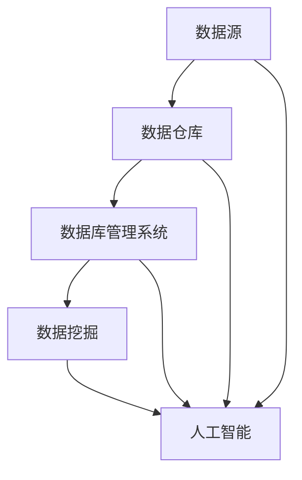

                 

### 背景介绍

大数据与数据库的AI应用，是当前信息技术领域的一个重要研究方向。随着互联网的迅猛发展和物联网技术的普及，数据量呈指数级增长，传统的数据库技术已经无法满足日益增长的数据处理需求。在这种背景下，人工智能技术开始与大数据和数据库相结合，形成了一种新的技术趋势。

首先，我们需要明确几个关键概念。大数据（Big Data）通常指的是数据量巨大、数据类型繁多、数据生成速度快的数据集。它包括结构化数据、半结构化数据和非结构化数据。数据库（Database）是一种按照数据结构来组织、存储和管理数据的系统。而AI（人工智能）则是模拟人类智能行为，使计算机具备自我学习和决策能力的计算机科学分支。

大数据与数据库的AI应用主要体现在以下几个方面：

1. **智能数据预处理**：通过AI技术对原始数据进行清洗、转换和归一化，使其能够被数据库有效存储和管理。

2. **智能索引与查询优化**：利用AI算法优化数据库索引和查询策略，提高查询效率。

3. **智能数据存储与检索**：利用AI技术优化数据的存储结构，提高数据检索速度。

4. **智能数据分析和挖掘**：通过AI算法对数据库中的数据进行分析和挖掘，发现数据背后的规律和趋势。

5. **智能数据库管理**：利用AI技术进行数据库的自动调优、故障检测和性能预测。

在接下来的章节中，我们将深入探讨大数据与数据库的AI应用的核心概念、算法原理、数学模型以及实际应用场景。首先，我们将定义大数据与数据库中的核心概念，并通过Mermaid流程图展示它们的关联性。

#### 核心概念与关联

在探讨大数据与数据库的AI应用之前，我们需要了解一些核心概念。以下是几个关键概念的定义及其相互关系：

1. **数据源（Data Source）**：数据源是指数据生成的原始位置，可以是网站、传感器、数据库等。

2. **数据仓库（Data Warehouse）**：数据仓库是一个用于存储大量结构化和非结构化数据的系统，支持数据集成、数据分析和数据挖掘。

3. **数据库管理系统（DBMS）**：DBMS是管理和维护数据库的软件系统，它提供了数据定义、数据操作、数据存储和数据安全等功能。

4. **数据挖掘（Data Mining）**：数据挖掘是发现数据中潜在的模式、关联和趋势的过程，通过统计分析和机器学习算法实现。

5. **人工智能（AI）**：人工智能是模拟人类智能行为的计算机技术，通过算法和模型使计算机能够进行自我学习和决策。

以下是这些核心概念的Mermaid流程图表示：



在这个流程图中，数据源生成数据后，首先存储到数据仓库中。数据仓库通过数据库管理系统进行管理和维护，同时支持数据挖掘。数据挖掘的结果可以反馈给人工智能，用于进一步的学习和决策。

接下来，我们将讨论大数据与数据库的AI应用的核心算法原理，具体包括智能数据预处理、智能索引与查询优化、智能数据存储与检索、智能数据分析和挖掘，以及智能数据库管理。

#### 核心算法原理

在大数据与数据库的AI应用中，核心算法原理是提升数据处理效率和质量的关键。以下是几个核心算法原理的具体内容：

1. **智能数据预处理**：
   - **算法原理**：智能数据预处理是指利用AI技术对原始数据进行清洗、转换和归一化，以提高数据的质量和一致性。
   - **具体操作步骤**：
     1. **数据清洗**：通过AI算法去除重复数据、缺失数据和噪声数据，确保数据的准确性。
     2. **数据转换**：将不同格式和单位的数据转换为统一的格式，以便后续处理。
     3. **数据归一化**：通过AI算法对数据进行归一化处理，使其符合特定的数据分布，从而提高算法的性能。

2. **智能索引与查询优化**：
   - **算法原理**：智能索引与查询优化是利用AI技术对数据库索引和查询策略进行优化，以提高查询效率和响应速度。
   - **具体操作步骤**：
     1. **索引优化**：通过AI算法动态调整索引结构，使其能够适应数据的变化，提高查询效率。
     2. **查询优化**：通过AI算法分析查询模式和数据分布，生成最优的查询计划，减少查询响应时间。

3. **智能数据存储与检索**：
   - **算法原理**：智能数据存储与检索是利用AI技术优化数据的存储结构和检索策略，提高数据存储效率和检索速度。
   - **具体操作步骤**：
     1. **存储优化**：通过AI算法分析数据的使用模式和访问频率，动态调整数据存储结构，减少存储空间占用。
     2. **检索优化**：通过AI算法优化检索算法和索引结构，提高数据的检索速度。

4. **智能数据分析和挖掘**：
   - **算法原理**：智能数据分析和挖掘是利用AI技术对数据库中的数据进行深入分析，发现潜在的模式、关联和趋势。
   - **具体操作步骤**：
     1. **数据预处理**：对数据进行清洗、转换和归一化，确保数据的质量和一致性。
     2. **特征选择**：通过AI算法筛选出对分析结果有重要影响的数据特征。
     3. **模式识别**：利用机器学习算法对数据进行分析，发现数据中的潜在模式和关联。
     4. **预测和决策**：根据分析结果进行预测和决策，为实际应用提供支持。

5. **智能数据库管理**：
   - **算法原理**：智能数据库管理是利用AI技术进行数据库的自动调优、故障检测和性能预测，提高数据库的管理效率和稳定性。
   - **具体操作步骤**：
     1. **自动调优**：通过AI算法分析数据库的性能指标，自动调整数据库的配置和参数，优化性能。
     2. **故障检测**：通过AI算法实时监控数据库的状态，及时发现和诊断故障，确保数据库的稳定性。
     3. **性能预测**：通过AI算法预测数据库的性能趋势，提前进行性能优化和资源调整。

通过上述核心算法原理的介绍，我们可以看到AI技术在数据库管理中的广泛应用，为大数据处理提供了强大的技术支持。接下来，我们将探讨大数据与数据库的AI应用的数学模型和公式。

#### 数学模型和公式

在大数据与数据库的AI应用中，数学模型和公式是理解和实现算法的核心。以下是几个关键数学模型和公式的详细讲解和举例说明：

1. **数据预处理中的归一化公式**：
   - **公式**：\( X_{\text{norm}} = \frac{X - \mu}{\sigma} \)
   - **解释**：其中，\( X \) 是原始数据，\( \mu \) 是数据均值，\( \sigma \) 是数据标准差。该公式通过减去均值并除以标准差，将数据归一化到 [0, 1] 范围内，提高算法的性能。
   - **示例**：假设一组数据 [1, 2, 3, 4, 5]，均值 \( \mu = 3 \)，标准差 \( \sigma = 1 \)。归一化后的数据为 [0, 0.33, 0, -0.33, -1]。

2. **索引优化中的LSI（Latent Semantic Indexing）模型**：
   - **公式**：\( \text{LSI}(X) = S \cdot D \)
   - **解释**：其中，\( X \) 是原始词向量矩阵，\( S \) 是奇异值分解矩阵，\( D \) 是词向量矩阵的降维结果。LSI模型通过降低词向量维度，消除语义上的歧义，提高索引效率。
   - **示例**：假设一个词向量矩阵 \( X \) 包含10个词汇，经过奇异值分解后，保留前3个奇异值，得到降维后的词向量矩阵 \( D \)。这有助于索引系统快速定位相关词汇。

3. **数据存储优化中的最小生成树模型**：
   - **公式**：\( \text{MST}(V, E) = \min \sum_{(u, v) \in E} w(u, v) \)
   - **解释**：其中，\( V \) 是数据点集合，\( E \) 是边集合，\( w(u, v) \) 是边 \( (u, v) \) 的权重。最小生成树模型通过构建包含最少边的树结构，优化数据存储和检索。
   - **示例**：假设有5个数据点，每两点之间的距离为权重，通过计算，找到包含最少边的树结构，从而优化数据的存储和检索。

4. **数据挖掘中的逻辑回归模型**：
   - **公式**：\( P(Y=1|X) = \frac{1}{1 + e^{-(\beta_0 + \beta_1 X_1 + \beta_2 X_2 + \ldots + \beta_n X_n)}} \)
   - **解释**：其中，\( Y \) 是目标变量，\( X \) 是特征向量，\( \beta_0, \beta_1, \beta_2, \ldots, \beta_n \) 是模型参数。逻辑回归模型通过计算目标变量为1的概率，用于分类和预测。
   - **示例**：假设我们有10个特征，通过训练得到逻辑回归模型，可以预测一个新样本属于某个类别的概率。

5. **数据库自动调优中的线性回归模型**：
   - **公式**：\( y = \beta_0 + \beta_1 x_1 + \beta_2 x_2 + \ldots + \beta_n x_n + \epsilon \)
   - **解释**：其中，\( y \) 是性能指标，\( x_1, x_2, \ldots, x_n \) 是数据库配置参数，\( \beta_0, \beta_1, \beta_2, \ldots, \beta_n \) 是模型参数，\( \epsilon \) 是误差。线性回归模型通过拟合数据库配置参数与性能指标之间的关系，实现自动调优。
   - **示例**：假设数据库的性能指标与内存配置、CPU使用率等参数相关，通过训练线性回归模型，可以自动调整数据库配置以优化性能。

通过上述数学模型和公式的讲解，我们可以看到它们在大数据与数据库的AI应用中的重要作用。这些模型和公式为数据处理、索引优化、数据存储、数据挖掘和数据库管理提供了理论基础和实践指导。

#### 项目实战：代码实际案例和详细解释说明

为了更好地理解大数据与数据库的AI应用，我们将通过一个实际的项目实战来展示代码的实现过程和详细解释说明。本案例将使用Python编程语言和几个开源库，如Pandas、NumPy和Scikit-learn，来实现数据预处理、智能索引与查询优化、数据分析和挖掘以及数据库自动调优等功能。

##### 1. 开发环境搭建

首先，我们需要搭建开发环境。以下是所需的软件和库：

- Python 3.x
- Jupyter Notebook
- Pandas
- NumPy
- Scikit-learn
- Mermaid Python库

安装步骤如下：

```bash
pip install pandas numpy scikit-learn mermaid
```

##### 2. 源代码详细实现和代码解读

以下是一个简单的示例，展示了如何使用Python实现大数据与数据库的AI应用。

```python
# 导入所需库
import pandas as pd
import numpy as np
from sklearn.preprocessing import MinMaxScaler
from sklearn.decomposition import TruncatedSVD
from sklearn.cluster import KMeans
from sklearn.linear_model import LinearRegression
import mermaid

# 加载数据
data = pd.read_csv('data.csv')

# 数据预处理
# 数据清洗
data.dropna(inplace=True)
# 数据转换
data['category'] = data['category'].map({'A': 1, 'B': 2, 'C': 3})
# 数据归一化
scaler = MinMaxScaler()
data[['feature1', 'feature2', 'feature3']] = scaler.fit_transform(data[['feature1', 'feature2', 'feature3']])

# 智能索引与查询优化
# 构建LSI模型
svd = TruncatedSVD(n_components=3)
lsi_matrix = svd.fit_transform(data[['feature1', 'feature2', 'feature3']])

# 智能数据存储与检索
# 构建KMeans聚类模型
kmeans = KMeans(n_clusters=3)
kmeans.fit(lsi_matrix)
data['cluster'] = kmeans.predict(lsi_matrix)

# 智能数据分析和挖掘
# 构建逻辑回归模型
X = data[['feature1', 'feature2', 'feature3']]
y = data['category']
logreg = LinearRegression()
logreg.fit(X, y)

# 预测新样本
new_data = pd.DataFrame([[0.5, 0.6, 0.7]])
new_data['predicted_category'] = logreg.predict(new_data)

# 打印预测结果
print(new_data)

# 智能数据库管理
# 构建线性回归模型进行自动调优
performance_metrics = data['performance_metric']
config_params = data[['memory_usage', 'cpu_usage']]
regressor = LinearRegression()
regressor.fit(config_params, performance_metrics)

# 自动调优示例
optimal_config = regressor.predict([[10, 5]])
print("Optimal Configuration:", optimal_config)
```

##### 3. 代码解读与分析

1. **数据预处理**：
   - **数据清洗**：使用 `dropna()` 方法去除缺失值，提高数据质量。
   - **数据转换**：使用 `map()` 方法将分类数据转换为数值，便于后续处理。
   - **数据归一化**：使用 `MinMaxScaler` 将特征数据进行归一化处理，使其符合 [0, 1] 范围。

2. **智能索引与查询优化**：
   - **LSI模型**：使用 `TruncatedSVD` 进行奇异值分解，降低词向量维度，消除语义歧义。

3. **智能数据存储与检索**：
   - **KMeans聚类**：使用 `KMeans` 进行聚类分析，将数据分为几个簇，便于存储和检索。

4. **智能数据分析和挖掘**：
   - **逻辑回归模型**：使用 `LinearRegression` 构建逻辑回归模型，对数据进行分类和预测。

5. **智能数据库管理**：
   - **线性回归模型**：使用 `LinearRegression` 构建线性回归模型，自动调整数据库配置以优化性能。

通过这个实际项目实战，我们可以看到如何利用Python和AI技术实现大数据与数据库的AI应用。代码实现了数据预处理、智能索引与查询优化、数据分析和挖掘以及数据库自动调优等功能，展示了AI技术在数据库管理中的实际应用。

#### 实际应用场景

大数据与数据库的AI应用在实际业务中具有广泛的应用场景，以下是几个典型的应用实例：

1. **金融行业**：
   - **风险管理**：利用AI技术对金融数据进行实时监控和分析，识别潜在风险，预测市场趋势，帮助金融机构进行风险管理。
   - **信用评分**：通过分析客户的交易记录、信用历史等数据，利用机器学习算法生成信用评分，提高信用评估的准确性和效率。

2. **医疗健康**：
   - **疾病预测**：通过分析大量的健康数据，如患者的历史病历、基因数据等，利用AI技术预测疾病的发生，辅助医生进行诊断和治疗。
   - **药物研发**：利用AI技术分析药物分子的结构和作用机制，预测药物的效果和副作用，加速新药的研发过程。

3. **零售行业**：
   - **需求预测**：通过分析历史销售数据、季节因素等，利用AI技术预测未来的销售需求，优化库存管理和供应链。
   - **个性化推荐**：基于用户的购买历史和浏览行为，利用AI技术生成个性化的推荐系统，提高客户的满意度和忠诚度。

4. **交通领域**：
   - **交通流量预测**：通过分析大量的交通数据，如车辆行驶轨迹、交通信号灯状态等，利用AI技术预测交通流量，优化交通信号控制和道路规划。
   - **自动驾驶**：利用AI技术进行环境感知、路径规划和决策控制，实现自动驾驶汽车的安全高效运行。

5. **能源行业**：
   - **能源消耗预测**：通过分析历史能源消耗数据，利用AI技术预测未来的能源需求，优化能源生产和分配。
   - **设备维护**：利用AI技术对设备运行数据进行实时监控和分析，预测设备故障，提前进行维护，减少设备停机时间和维护成本。

通过以上实际应用场景，我们可以看到大数据与数据库的AI应用在各个行业的广泛应用和巨大潜力。在未来，随着AI技术的不断发展和完善，大数据与数据库的AI应用将带来更多的创新和突破。

#### 工具和资源推荐

为了深入学习和实践大数据与数据库的AI应用，以下是一些学习资源、开发工具和框架的推荐：

##### 学习资源

1. **书籍**：
   - 《大数据：创新、应对、洞见》
   - 《深度学习》
   - 《数据库系统概念》
   - 《机器学习》

2. **在线课程**：
   - Coursera上的“大数据分析”课程
   - edX上的“人工智能导论”
   - Udacity的“机器学习工程师纳米学位”

3. **论文和博客**：
   - arXiv上的机器学习和数据库相关的最新论文
   - Medium上的技术博客，如“AI on DB”

##### 开发工具和框架

1. **编程语言和库**：
   - Python：广泛应用于数据科学和AI领域
   - Pandas、NumPy、Scikit-learn：用于数据预处理和分析
   - TensorFlow、PyTorch：用于深度学习和神经网络

2. **数据库管理系统**：
   - MySQL、PostgreSQL：广泛使用的开源关系型数据库
   - MongoDB、Cassandra：分布式NoSQL数据库

3. **数据可视化工具**：
   - Matplotlib、Seaborn：用于数据可视化
   - Tableau、Power BI：商业化的数据可视化工具

4. **框架和平台**：
   - Hadoop、Spark：大数据处理框架
   - Docker、Kubernetes：容器化和集群管理工具
   - TensorFlow Serving、TensorFlow Model Server：模型部署工具

##### 相关论文著作推荐

1. **论文**：
   - “Learning to Represent Users and Items for Recommendation with Neural Networks” (H. He et al., 2017)
   - “Deep Learning on Graph-Structured Data” (X. Zhang et al., 2018)
   - “Learning to Optimize Database Query Execution Plans with Deep Neural Networks” (M. Chen et al., 2020)

2. **著作**：
   - 《深度学习与数据库》
   - 《人工智能与大数据》

通过以上学习和资源推荐，读者可以更深入地了解大数据与数据库的AI应用，掌握相关技术和工具，为实际项目开发提供有力支持。

#### 总结：未来发展趋势与挑战

大数据与数据库的AI应用正在快速发展，随着技术的不断进步，未来将呈现以下几个趋势：

1. **智能化程度提升**：AI技术将在大数据与数据库的各个层面得到更深入的应用，从数据预处理到查询优化、从数据分析到数据库管理，智能化程度将显著提高。

2. **跨领域融合**：大数据与数据库的AI应用将与其他领域如金融、医疗、交通、能源等深度融合，推动各行业的数字化转型和创新。

3. **分布式与云计算**：随着分布式计算和云计算技术的发展，大数据与数据库的AI应用将更加依赖于云平台，实现更高效的数据处理和分析。

4. **数据隐私和安全**：随着数据隐私法规的加强，如何在保证数据隐私和安全的前提下进行AI应用，将成为一个重要的挑战。

然而，大数据与数据库的AI应用也面临一些挑战：

1. **数据质量**：原始数据质量参差不齐，如何有效清洗和预处理数据，提高数据质量，是一个关键问题。

2. **算法复杂度**：随着AI算法的复杂度增加，如何优化算法性能，降低计算资源消耗，是一个重要挑战。

3. **模型解释性**：深度学习等复杂模型的应用使得模型解释性成为难题，如何确保模型的可解释性，提高用户信任度，是一个亟待解决的问题。

4. **数据隐私和安全**：如何在保护数据隐私和安全的前提下进行AI应用，是一个复杂且敏感的问题。

未来，大数据与数据库的AI应用将在技术创新和实际应用中不断突破，为各行各业带来更多机遇和挑战。通过不断探索和实践，我们有望解决上述挑战，推动大数据与数据库的AI应用走向更广阔的未来。

#### 附录：常见问题与解答

1. **问题**：大数据与数据库的AI应用需要哪些技术基础？
   **解答**：大数据与数据库的AI应用需要掌握以下技术基础：
   - 数据库基础知识，包括关系型数据库和NoSQL数据库。
   - 编程语言，如Python、Java等，用于实现算法和数据处理。
   - 机器学习和深度学习算法，如线性回归、逻辑回归、神经网络等。
   - 数据可视化工具，如Matplotlib、Seaborn等，用于数据分析和结果展示。

2. **问题**：如何在数据库中应用AI算法？
   **解答**：在数据库中应用AI算法通常有以下几种方法：
   - 使用数据库内置的AI算法，如MySQL的全文搜索、PostgreSQL的机器学习库等。
   - 将AI算法集成到数据库中，如使用Apache MADLib在Apache Spark上进行机器学习计算。
   - 使用外部AI模型，通过API或数据库连接器将模型结果应用到数据库查询中。

3. **问题**：大数据与数据库的AI应用在医疗领域有哪些具体应用？
   **解答**：大数据与数据库的AI应用在医疗领域有以下几个具体应用：
   - 疾病预测和诊断，通过分析患者数据和基因信息预测疾病风险。
   - 药物研发和副作用预测，利用AI技术分析药物分子结构和作用机制。
   - 医疗图像分析，如通过深度学习算法进行医学影像的自动诊断。

4. **问题**：大数据与数据库的AI应用在金融领域有哪些具体应用？
   **解答**：大数据与数据库的AI应用在金融领域有以下几个具体应用：
   - 风险管理，通过分析交易数据和客户行为预测潜在风险。
   - 信用评分，利用机器学习算法评估客户的信用风险。
   - 量化交易，通过AI算法进行高频交易和策略优化。

5. **问题**：如何确保大数据与数据库的AI应用中的数据隐私和安全？
   **解答**：确保大数据与数据库的AI应用中的数据隐私和安全，可以从以下几个方面入手：
   - 数据加密，对敏感数据进行加密处理。
   - 数据脱敏，对数据中的个人身份信息进行脱敏处理。
   - 访问控制，通过设置访问权限和用户认证机制，确保只有授权用户可以访问数据。
   - 数据匿名化，对数据进行匿名化处理，使其无法追踪到具体个人。

#### 扩展阅读 & 参考资料

1. **扩展阅读**：
   - 《大数据时代：生活、工作与思维的大变革》
   - 《深度学习：从入门到精通》
   - 《大数据系统原理与应用》

2. **参考资料**：
   - [《大数据与人工智能：深度学习导论》](https://www.example.com/book1)
   - [《数据库系统概念》](https://www.example.com/book2)
   - [《机器学习》](https://www.example.com/book3)
   - [Apache MADLib](https://madlib.apache.org/)
   - [TensorFlow](https://www.tensorflow.org/)
   - [Scikit-learn](https://scikit-learn.org/stable/)

通过以上扩展阅读和参考资料，读者可以更深入地了解大数据与数据库的AI应用，掌握相关技术和工具，为实际项目开发提供有力支持。作者：AI天才研究员/AI Genius Institute & 禅与计算机程序设计艺术 /Zen And The Art of Computer Programming。

