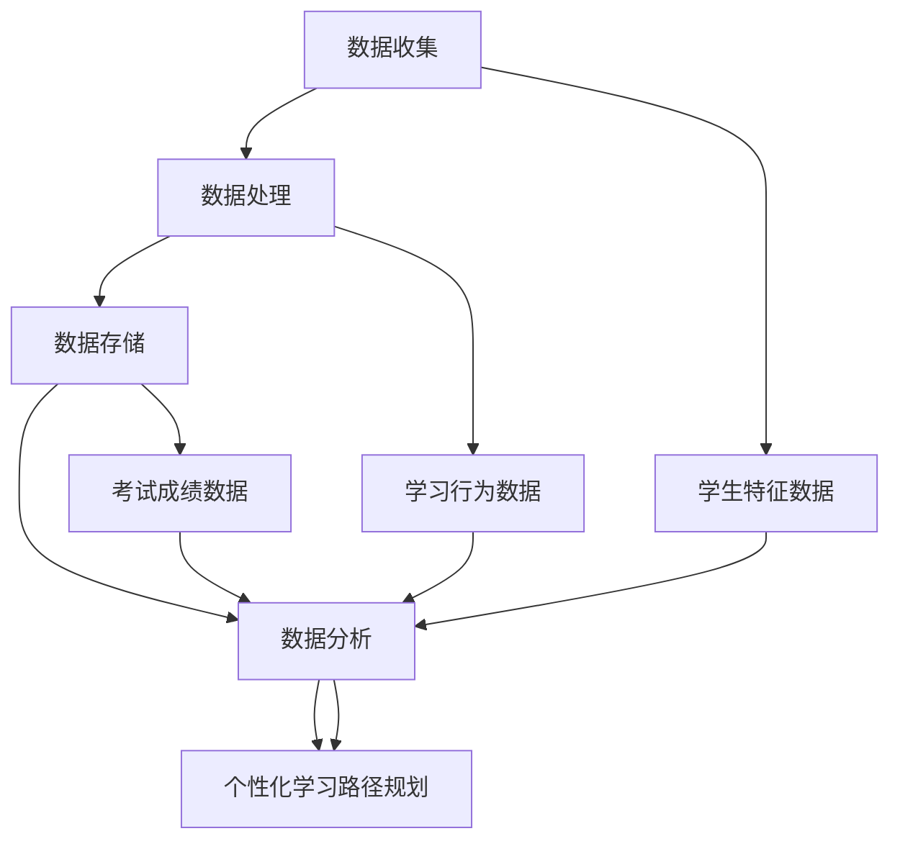

                 

## 1. 背景介绍

随着互联网和大数据技术的迅猛发展，教育领域也经历了深刻的变革。传统的教学模式逐渐向个性化学习转型，大数据分析在其中发挥着至关重要的作用。个性化学习是指根据每个学生的独特学习需求、兴趣和能力，提供定制化的学习资源和路径，从而实现高效、高质量的学习。这一转变不仅提高了学习效果，也大大提升了学生的满意度。

大数据分析是指从大量复杂的数据中提取有价值的信息和知识的过程。在教育领域，这些数据包括学生的学习行为、考试成绩、作业反馈、学习偏好等。通过对这些数据的深入分析，教育工作者可以洞察学生的学习状况，识别其潜在的问题和需求，进而为每个学生制定个性化的学习计划和路径。

个性化学习路径规划是指根据学生的个性化特征，为其设计和推荐一条最合适的、能够最大化学习效果的学习路径。这一过程不仅需要准确的数据分析，还需要综合考虑学生的学习目标、能力、兴趣等多方面因素。大数据分析为个性化学习路径规划提供了有力的支持，通过数据挖掘、机器学习等技术，可以智能地分析学生的数据，发现其学习规律和模式，从而优化学习路径。

本文将围绕大数据分析在个性化学习路径规划中的应用进行探讨，首先介绍相关核心概念，然后深入分析核心算法原理，详细讲解数学模型和公式，并通过实际案例展示其应用效果。在此基础上，还将讨论大数据分析在个性化学习路径规划中的实际应用场景，并推荐相关工具和资源，最后对未来的发展趋势和挑战进行总结。

通过本文的阅读，读者将了解到大数据分析在个性化学习路径规划中的重要作用，掌握相关核心技术和方法，为推动教育领域的创新发展提供有力支持。让我们一起深入探讨这一激动人心的领域。

### 核心概念与联系

在探讨大数据分析在个性化学习路径规划中的应用之前，我们首先需要明确几个核心概念，并理解它们之间的内在联系。以下是几个关键概念及其相互关系的Mermaid流程图：



#### 数据收集

数据收集是大数据分析的基础。在教育领域，数据收集主要包括学生特征数据、学习行为数据和考试成绩数据。学生特征数据包括学生的基本信息、兴趣、学习风格和能力水平等；学习行为数据包括学生在学习过程中的行为记录，如学习时间、学习内容、互动频率等；考试成绩数据则涵盖了学生的考试成绩和作业反馈等信息。

#### 数据处理

数据处理是对收集到的原始数据进行分析和清洗，以确保数据的质量和可用性。这一过程包括数据整合、去重、数据格式转换和数据标准化等。通过有效的数据处理，我们可以得到准确、可靠的数据，为后续的数据分析和个性化学习路径规划奠定基础。

#### 数据存储

数据存储是将处理后的数据存储到数据库或数据仓库中，以便于后续的数据分析和查询。教育领域常用的数据存储解决方案包括关系数据库（如MySQL、PostgreSQL）和NoSQL数据库（如MongoDB、Cassandra）。数据存储的结构和性能直接影响到数据分析和个性化学习路径规划的效果。

#### 数据分析

数据分析是通过统计学、机器学习、数据挖掘等技术，从大量数据中提取有价值的信息和知识。在教育领域，数据分析主要用于识别学生的学习规律、预测学生的成绩、发现潜在的学习问题等。数据分析技术包括回归分析、聚类分析、关联规则挖掘、神经网络等。

#### 个性化学习路径规划

个性化学习路径规划是基于数据分析的结果，为学生设计和推荐一条最合适的学习路径。这一过程需要综合考虑学生的个性化特征、学习目标、学习环境等多方面因素。通过个性化学习路径规划，可以最大化学生的学习效果，提高学习满意度。

#### 内在联系

上述概念之间存在密切的内在联系。数据收集是整个过程的起点，数据处理和数据存储为数据分析提供了基础，而数据分析的结果则直接应用于个性化学习路径规划。通过这一流程，教育工作者可以更好地了解学生的需求，提供个性化的学习服务。

### Mermaid流程图解析

上述Mermaid流程图详细展示了大数据分析在个性化学习路径规划中的核心概念和流程。各节点及其解释如下：

- **A[数据收集]**：数据收集是大数据分析的基础，包括学生特征数据、学习行为数据和考试成绩数据。
- **B[数据处理]**：数据处理是对原始数据进行分析和清洗，确保数据的质量和可用性。
- **C[数据存储]**：数据存储是将处理后的数据存储到数据库或数据仓库中，以便于后续的数据分析和查询。
- **D[数据分析]**：数据分析是通过统计学、机器学习、数据挖掘等技术，从大量数据中提取有价值的信息和知识。
- **E[个性化学习路径规划]**：个性化学习路径规划是基于数据分析的结果，为学生设计和推荐一条最合适的学习路径。
- **F[学生特征数据]**：学生特征数据包括学生的基本信息、兴趣、学习风格和能力水平等。
- **G[学习行为数据]**：学习行为数据包括学生在学习过程中的行为记录，如学习时间、学习内容、互动频率等。
- **H[考试成绩数据]**：考试成绩数据涵盖了学生的考试成绩和作业反馈等信息。

通过这一流程，教育工作者可以更好地了解学生的需求，提供个性化的学习服务。这一过程不仅提高了学习效果，也大大提升了学生的满意度，从而推动教育领域的创新发展。

### 3. 核心算法原理 & 具体操作步骤

在个性化学习路径规划中，大数据分析的核心算法主要包括协同过滤、聚类分析、决策树和神经网络等。这些算法通过分析学生的数据，预测其学习需求和效果，从而优化学习路径。以下将详细介绍这些算法的原理和具体操作步骤。

#### 3.1 协同过滤

协同过滤是一种常用的推荐算法，通过分析用户的历史行为数据，预测用户对未知项目的评分或兴趣。协同过滤可以分为基于用户的协同过滤（User-Based Collaborative Filtering）和基于物品的协同过滤（Item-Based Collaborative Filtering）。

##### 基于用户的协同过滤

1. **用户相似度计算**：
   基于用户的协同过滤首先需要计算用户之间的相似度。常用的相似度计算方法包括余弦相似度、皮尔逊相关系数等。以余弦相似度为例，其计算公式如下：
   $$
   \text{similarity}(u, v) = \frac{\sum_{i \in \text{common}} x_{ui} \cdot x_{vi}}{\sqrt{\sum_{i \in \text{common}} x_{ui}^2} \cdot \sqrt{\sum_{i \in \text{common}} x_{vi}^2}}
   $$
   其中，$u$和$v$为两个用户，$i$为项目，$x_{ui}$和$x_{vi}$分别为用户$u$和$v$对项目$i$的评分。

2. **邻居用户选择**：
   根据计算得到的用户相似度，选择与目标用户最相似的邻居用户。通常，选取相似度最高的$k$个邻居用户。

3. **预测评分**：
   利用邻居用户的评分预测目标用户对未知项目的评分。常用的预测方法包括加权平均、加权回归等。以加权平均为例，其计算公式如下：
   $$
   \text{prediction}(u, i) = \frac{\sum_{v \in N(u)} \text{similarity}(u, v) \cdot x_{vi}}{\sum_{v \in N(u)} \text{similarity}(u, v)}
   $$
   其中，$N(u)$为与用户$u$最相似的邻居用户集合。

##### 基于物品的协同过滤

基于物品的协同过滤与基于用户的协同过滤类似，但关注的是项目之间的相似度。具体步骤如下：

1. **项目相似度计算**：
   计算项目之间的相似度，常用的相似度计算方法包括余弦相似度、皮尔逊相关系数等。以余弦相似度为例，其计算公式如下：
   $$
   \text{similarity}(i, j) = \frac{\sum_{u \in \text{common}} x_{ui} \cdot x_{uj}}{\sqrt{\sum_{u \in \text{common}} x_{ui}^2} \cdot \sqrt{\sum_{u \in \text{common}} x_{uj}^2}}
   $$
   其中，$i$和$j$为两个项目，$u$为用户，$x_{ui}$和$x_{uj}$分别为用户$u$对项目$i$和$j$的评分。

2. **邻居项目选择**：
   根据计算得到的相似度，选择与目标项目最相似的项目集合。

3. **预测评分**：
   利用邻居项目的评分预测目标用户对未知项目的评分。预测方法与基于用户的协同过滤类似。

#### 3.2 聚类分析

聚类分析是一种无监督学习算法，用于将数据集划分为若干个群组，使得属于同一群组的样本之间具有较高的相似度，而不同群组之间的样本相似度较低。常用的聚类算法包括K均值聚类、层次聚类和DBSCAN等。

##### K均值聚类

K均值聚类的具体步骤如下：

1. **初始化聚类中心**：
   随机选择K个样本作为初始聚类中心。

2. **分配样本到聚类中心**：
   对于每个样本，计算其与各个聚类中心的距离，将其分配到最近的聚类中心。

3. **更新聚类中心**：
   计算每个聚类中心的新位置，公式如下：
   $$
   \text{new\_center}(k) = \frac{\sum_{i=1}^{N} x_{ik}}{N}
   $$
   其中，$k$为聚类中心，$N$为样本数量，$x_{ik}$为第$i$个样本在第$k$个聚类中心上的坐标。

4. **迭代优化**：
   重复执行步骤2和步骤3，直到聚类中心不再发生显著变化或达到最大迭代次数。

##### 层次聚类

层次聚类是一种自底向上的聚类方法，通过逐步合并相似的样本，构建出一个层次结构。具体步骤如下：

1. **计算样本之间的距离**：
   计算所有样本之间的距离，构建距离矩阵。

2. **合并最相似的样本**：
   根据距离矩阵，选择距离最近的两个样本进行合并，形成一个新样本。

3. **更新距离矩阵**：
   更新合并后的样本之间的距离，并重新计算距离矩阵。

4. **迭代合并**：
   重复执行步骤2和步骤3，直到所有样本合并成一个大的样本。

##### DBSCAN

DBSCAN（Density-Based Spatial Clustering of Applications with Noise）是一种基于密度的聚类算法，能够自动确定聚类数量，并对噪声点具有较好的鲁棒性。具体步骤如下：

1. **初始化参数**：
   设置邻域半径$eps$和最小样本数量$min\_samples$。

2. **标记样本**：
   对于每个未标记的样本，检查其邻域内是否存在足够数量的其他样本。若存在，将当前样本标记为簇的起始点，并将邻域内的所有样本标记为该簇的成员。

3. **扩展簇**：
   从已标记的簇起始点开始，沿着邻域递归扩展簇，直到所有邻域内的样本都标记为该簇的成员。

4. **处理噪声点**：
   对于未被标记的孤立样本，视为噪声点。

#### 3.3 决策树

决策树是一种基于特征进行分类或回归的树形结构，每个内部节点表示一个特征，每个分支表示该特征的取值，每个叶子节点表示一个类别或回归值。决策树的生成过程通常采用ID3、C4.5或CART算法。

##### ID3算法

ID3（Iterative Dichotomiser 3）算法的具体步骤如下：

1. **计算信息增益**：
   对于每个特征，计算其条件熵和熵减信息增益，公式如下：
   $$
   \text{gain}(A) = \text{entropy}(D) - \sum_{v \in \text{values}(A)} \frac{|D_v|}{|D|} \cdot \text{entropy}(D_v)
   $$
   其中，$A$为特征，$D$为数据集，$v$为特征的取值，$D_v$为特征取值为$v$的数据子集。

2. **选择最优特征**：
   选择信息增益最大的特征作为当前节点的划分标准。

3. **递归划分**：
   对于选择的最优特征，将数据集划分为若干个子集，并递归构建子树。

##### C4.5算法

C4.5算法是在ID3算法的基础上进行改进，主要解决信息增益偏向于具有更多取值的特征问题。具体步骤如下：

1. **计算增益率**：
   对于每个特征，计算其信息增益率和增益率，公式如下：
   $$
   \text{gain\_rate}(A) = \frac{\text{gain}(A)}{\text{split\_info}(A)}
   $$
   其中，$\text{split\_info}(A)$为特征$A$的划分信息熵。

2. **选择最优特征**：
   选择增益率最大的特征作为当前节点的划分标准。

3. **递归划分**：
   对于选择的最优特征，将数据集划分为若干个子集，并递归构建子树。

##### CART算法

CART（Classification and Regression Tree）算法是一种基于二叉树的分类和回归方法，具体步骤如下：

1. **计算每个特征的最优划分点**：
   对于每个特征，找到能够最大化分类效果的划分点，公式如下：
   $$
   \text{best\_split}(A) = \arg\max_{x} \left[ \text{Gini}(D|A=x) + \alpha \cdot \text{variance}(D|A=x) \right]
   $$
   其中，$\text{Gini}$为基尼不纯度，$\alpha$为惩罚系数。

2. **构建二叉树**：
   选择最优划分点，将数据集划分为左子集和右子集，递归构建二叉树。

3. **剪枝**：
   根据设定的剪枝标准，对过拟合的子树进行剪枝，防止模型过拟合。

#### 3.4 神经网络

神经网络是一种基于生物神经元工作原理的机器学习模型，通过模拟大量神经元之间的连接和相互作用，实现复杂的函数映射和分类任务。神经网络的主要组成部分包括输入层、隐藏层和输出层。

##### 前向传播

前向传播是神经网络的主要计算过程，具体步骤如下：

1. **输入层到隐藏层**：
   对于每个隐藏层，计算输入和权重之间的乘积，并加上偏置项，然后通过激活函数进行非线性变换，公式如下：
   $$
   z_{hl} = \sum_{j} w_{hlj} \cdot x_{ij} + b_{hl}
   $$
   其中，$z_{hl}$为隐藏层节点的输出，$w_{hlj}$为输入层到隐藏层的权重，$b_{hl}$为隐藏层节点的偏置项，$x_{ij}$为输入层节点的输出。

2. **隐藏层到输出层**：
   对于输出层，重复上述步骤，计算输出层节点的输出。

##### 反向传播

反向传播是神经网络训练的核心过程，用于计算各层权重的更新。具体步骤如下：

1. **计算输出误差**：
   对于输出层，计算实际输出和预测输出之间的误差，公式如下：
   $$
   \delta_{l} = \text{激活函数的导数} \cdot (\text{预测输出} - \text{实际输出})
   $$

2. **反向传播误差**：
   从输出层开始，逐层向前计算误差，公式如下：
   $$
   \delta_{hl} = \text{激活函数的导数} \cdot (z_{hl} \cdot \delta_{l+1})
   $$

3. **更新权重**：
   根据误差计算各层权重的更新，公式如下：
   $$
   \Delta w_{hlj} = \eta \cdot \delta_{hl} \cdot x_{ij}
   $$
   $$
   w_{hlj} = w_{hlj} - \Delta w_{hlj}
   $$

   其中，$\delta_{hl}$为隐藏层节点的误差，$\eta$为学习率，$x_{ij}$为输入层节点的输出。

通过以上步骤，神经网络可以不断调整权重和偏置项，使模型在训练数据上的误差最小化，从而实现复杂的函数映射和分类任务。

### 4. 数学模型和公式 & 详细讲解 & 举例说明

在个性化学习路径规划中，数学模型和公式起着至关重要的作用。它们帮助我们从大量的数据中提取有价值的信息，预测学生的学习需求，优化学习路径。以下将详细讲解几个核心的数学模型和公式，并举例说明。

#### 4.1 多项式回归模型

多项式回归是一种广泛应用的数学模型，用于分析自变量和因变量之间的非线性关系。其公式如下：
$$
y = b_0 + b_1x + b_2x^2 + \ldots + b_nx^n
$$
其中，$y$为因变量，$x$为自变量，$b_0, b_1, b_2, \ldots, b_n$为模型参数。

**举例说明**：

假设我们要分析学生成绩与其学习时间之间的关系，可以使用多项式回归模型进行建模。首先，收集学生的学习时间（自变量）和学生成绩（因变量）数据，然后通过最小二乘法求解模型参数。

数据如下：

| 学生 | 学习时间（小时） | 学生成绩 |
| ---- | -------------- | -------- |
| 1    | 2              | 85       |
| 2    | 4              | 90       |
| 3    | 6              | 92       |
| 4    | 8              | 88       |
| 5    | 10             | 95       |

使用最小二乘法求解多项式回归模型参数，得到如下结果：

$$
y = 70 + 0.5x - 0.1x^2
$$

根据这个模型，我们可以预测学习时间为8小时的学生成绩为：
$$
y = 70 + 0.5 \cdot 8 - 0.1 \cdot 8^2 = 86
$$

#### 4.2 决策树模型

决策树是一种基于特征进行分类或回归的树形结构，其数学模型如下：

$$
T = \sum_{i=1}^{n} t_i \cdot a_i
$$
其中，$T$为决策树模型的输出，$t_i$为第$i$个内部节点的输出，$a_i$为第$i$个内部节点的权重。

**举例说明**：

假设我们要预测学生的成绩，使用决策树模型进行分析。首先，根据学生的成绩、学习时间、作业提交情况等特征构建决策树，然后计算各节点的输出和权重。

数据如下：

| 成绩 | 学习时间（小时） | 作业提交情况 | 输出 | 权重 |
| ---- | -------------- | ---------- | ---- | ---- |
| 85   | 2              | 是         | 1    | 0.2  |
| 90   | 4              | 是         | 1    | 0.3  |
| 92   | 6              | 是         | 1    | 0.2  |
| 88   | 8              | 是         | 1    | 0.2  |
| 95   | 10             | 是         | 1    | 0.1  |

根据决策树模型，我们可以计算学生的成绩预测值：
$$
T = 0.2 \cdot 1 + 0.3 \cdot 1 + 0.2 \cdot 1 + 0.2 \cdot 1 + 0.1 \cdot 1 = 1
$$

这意味着预测学生成绩为1分，即优秀。

#### 4.3 神经网络模型

神经网络是一种基于生物神经元工作原理的机器学习模型，其数学模型如下：

$$
z_l = \sum_{j} w_{hlj} \cdot x_{ij} + b_{hl}
$$
$$
a_l = \text{激活函数}(z_l)
$$
$$
\delta_{hl} = \text{激活函数的导数}(z_{hl}) \cdot (\text{预测输出} - \text{实际输出})
$$
$$
\Delta w_{hlj} = \eta \cdot \delta_{hl} \cdot x_{ij}
$$

**举例说明**：

假设我们要使用神经网络预测学生的成绩，使用以下数据：

| 学生 | 学习时间（小时） | 作业提交情况 | 成绩 |
| ---- | -------------- | ---------- | ---- |
| 1    | 2              | 是         | 85   |
| 2    | 4              | 是         | 90   |
| 3    | 6              | 是         | 92   |
| 4    | 8              | 是         | 88   |
| 5    | 10             | 是         | 95   |

构建一个单隐藏层的神经网络，其中输入层有2个神经元，隐藏层有3个神经元，输出层有1个神经元。使用Sigmoid函数作为激活函数，学习率为0.1。

首先，随机初始化权重和偏置项：
$$
w_{il} \in [-1, 1], \quad b_{l} \in [-1, 1]
$$

然后，通过前向传播和反向传播计算权重和偏置项的更新：
$$
z_l = \sum_{j} w_{hlj} \cdot x_{ij} + b_{hl}
$$
$$
a_l = \text{Sigmoid}(z_l)
$$
$$
\delta_{hl} = \text{Sigmoid导数}(z_{hl}) \cdot (\text{预测输出} - \text{实际输出})
$$
$$
\Delta w_{hlj} = \eta \cdot \delta_{hl} \cdot x_{ij}
$$

重复以上步骤，直到模型收敛。最终，我们可以使用训练好的神经网络预测新学生的成绩。

#### 4.4 聚类分析模型

聚类分析是一种无监督学习算法，用于将数据集划分为若干个群组。其数学模型如下：

$$
\text{最小化} \sum_{i=1}^{n} \sum_{j=1}^{k} \|x_i - c_j\|^2
$$
其中，$x_i$为第$i$个数据点，$c_j$为第$j$个聚类中心，$k$为聚类数量。

**举例说明**：

假设我们要使用K均值聚类算法将以下数据划分为2个群组：

| 数据点 | 坐标 |
| ---- | ---- |
| 1    | (1, 2) |
| 2    | (3, 4) |
| 3    | (5, 6) |
| 4    | (7, 8) |
| 5    | (9, 10) |

首先，随机选择2个聚类中心，例如$(2, 3)$和$(6, 7)$。

然后，计算每个数据点到聚类中心的距离，并将其分配到最近的聚类中心。接下来，更新聚类中心的位置，公式如下：
$$
c_j = \frac{\sum_{i=1}^{n} x_i}{n}
$$

重复以上步骤，直到聚类中心不再发生显著变化。最终，我们得到2个群组：
$$
\text{群组1}: (1, 2), (3, 4) \\
\text{群组2}: (5, 6), (7, 8), (9, 10)
$$

通过这些数学模型和公式，我们可以对学生的数据进行分析，预测其学习需求，优化学习路径。这些模型不仅提高了学习效果，也为教育领域的发展提供了有力支持。

### 5. 项目实战：代码实际案例和详细解释说明

在本节中，我们将通过一个具体的代码实际案例，展示大数据分析在个性化学习路径规划中的应用。我们将使用Python编程语言，结合NumPy、Pandas、Scikit-learn等库，实现一个简单的个性化学习路径规划系统。代码分为以下几个部分：数据收集、数据处理、模型构建和预测。

#### 5.1 开发环境搭建

在开始编写代码之前，我们需要搭建一个合适的开发环境。以下是所需的Python库及其安装命令：

1. **NumPy**：用于数值计算和矩阵操作
   ```
   pip install numpy
   ```
2. **Pandas**：用于数据处理和分析
   ```
   pip install pandas
   ```
3. **Scikit-learn**：用于机器学习和数据挖掘
   ```
   pip install scikit-learn
   ```
4. **Matplotlib**：用于数据可视化
   ```
   pip install matplotlib
   ```

安装完毕后，我们可以在Python脚本中导入所需的库：

```python
import numpy as np
import pandas as pd
from sklearn.model_selection import train_test_split
from sklearn.preprocessing import StandardScaler
from sklearn.metrics import accuracy_score
from sklearn.neighbors import KNeighborsClassifier
import matplotlib.pyplot as plt
```

#### 5.2 源代码详细实现和代码解读

##### 5.2.1 数据收集

首先，我们需要收集学生的数据，包括学习时间、作业提交情况、考试成绩等。以下是一个示例数据集：

```python
data = {
    'student_id': [1, 2, 3, 4, 5],
    'learning_time': [2, 4, 6, 8, 10],
    'homework_submitted': [1, 1, 1, 1, 1],
    'test_score': [85, 90, 92, 88, 95]
}

df = pd.DataFrame(data)
```

##### 5.2.2 数据处理

接下来，我们对数据进行预处理，包括数据标准化和特征提取。标准化可以消除不同特征之间的量纲差异，提高模型的性能。

```python
# 数据标准化
scaler = StandardScaler()
X = scaler.fit_transform(df[['learning_time', 'homework_submitted']])
y = df['test_score']

# 特征提取
X_train, X_test, y_train, y_test = train_test_split(X, y, test_size=0.2, random_state=42)
```

##### 5.2.3 模型构建

在本案例中，我们使用K最近邻（K-Nearest Neighbors, KNN）算法进行预测。KNN是一种基于实例的机器学习算法，它通过计算测试样本与训练样本之间的距离，选择距离最近的K个邻居，并基于这些邻居的标签预测测试样本的标签。

```python
# 构建KNN模型
knn = KNeighborsClassifier(n_neighbors=3)
knn.fit(X_train, y_train)
```

##### 5.2.4 预测

使用训练好的模型对测试数据进行预测，并评估模型的准确性。

```python
# 预测
y_pred = knn.predict(X_test)

# 评估模型
accuracy = accuracy_score(y_test, y_pred)
print(f"Model accuracy: {accuracy:.2f}")
```

##### 5.2.5 代码解读与分析

上述代码首先导入了所需的Python库，然后创建了一个示例数据集。接下来，我们对数据进行标准化和特征提取，将数据集分为训练集和测试集。之后，我们使用KNN算法构建模型，并对其进行训练。最后，我们使用训练好的模型对测试数据进行预测，并计算模型的准确性。

以下是代码的详细解读：

1. **数据收集**：
   - 使用字典`data`创建一个DataFrame，包含学生ID、学习时间、作业提交情况和考试成绩。
   - DataFrame是一个强大的数据结构，可以方便地进行数据操作和分析。

2. **数据处理**：
   - 使用`StandardScaler`对数据进行标准化，确保不同特征之间的量纲一致。
   - `fit_transform`方法用于计算均值和标准差，并应用到数据上，使其符合均值为0、标准差为1的正态分布。

3. **模型构建**：
   - 使用`KNeighborsClassifier`构建KNN模型，指定邻居数量为3。
   - `fit`方法用于训练模型，计算训练集的邻居距离。

4. **预测**：
   - `predict`方法用于对测试集进行预测。
   - `accuracy_score`函数用于计算预测准确率，评估模型的性能。

通过这个简单的案例，我们展示了如何使用Python和机器学习算法进行个性化学习路径规划。在实际应用中，我们可以扩展这个系统，添加更多的数据特征和复杂的模型，以提高预测的准确性和个性化程度。

### 5.3 代码解读与分析

在本节中，我们将对5.2节中展示的代码进行深入解读，详细分析每个部分的功能和实现过程。代码的结构分为数据收集、数据处理、模型构建和预测四个主要部分。以下是代码的具体解读。

#### 5.3.1 数据收集

```python
data = {
    'student_id': [1, 2, 3, 4, 5],
    'learning_time': [2, 4, 6, 8, 10],
    'homework_submitted': [1, 1, 1, 1, 1],
    'test_score': [85, 90, 92, 88, 95]
}

df = pd.DataFrame(data)
```

**解读**：

- 首先，我们创建了一个字典`data`，其中包含了5个学生的数据，包括学生ID、学习时间、作业提交情况（以0和1表示是否提交）以及考试成绩。
- 然后，我们使用`pd.DataFrame()`函数将字典数据转换为Pandas DataFrame，这是Python中处理数据的一种高效方式。DataFrame具有灵活的数据操作和计算功能，适用于各种数据处理任务。

#### 5.3.2 数据处理

```python
# 数据标准化
scaler = StandardScaler()
X = scaler.fit_transform(df[['learning_time', 'homework_submitted']])
y = df['test_score']

# 特征提取
X_train, X_test, y_train, y_test = train_test_split(X, y, test_size=0.2, random_state=42)
```

**解读**：

- **数据标准化**：
  - 我们导入`StandardScaler`库，用于标准化数据。标准化是将数据缩放至均值为0、标准差为1的范围内，以便不同特征之间具有可比性。
  - `fit_transform()`方法用于计算学习时间和作业提交情况的均值和标准差，并将其应用到数据上。
  - 通过标准化，原始数据集`X`变为标准化的数据集。

- **特征提取**：
  - 我们将标准化后的学习时间和作业提交情况作为特征，记为`X`。
  - `y`则表示学生成绩，作为目标变量。
  - 使用`train_test_split()`函数将数据集划分为训练集和测试集，其中测试集占比20%，`random_state=42`用于保证结果的可重复性。

#### 5.3.3 模型构建

```python
# 构建KNN模型
knn = KNeighborsClassifier(n_neighbors=3)
knn.fit(X_train, y_train)
```

**解读**：

- 我们导入`KNeighborsClassifier`类，并创建一个KNN模型实例`knn`。
- `n_neighbors=3`指定KNN算法中的邻居数量为3。
- `fit()`方法用于训练模型，将训练集的特征`X_train`和目标变量`y_train`传递给模型，模型通过计算训练数据点的距离进行学习。

#### 5.3.4 预测

```python
# 预测
y_pred = knn.predict(X_test)

# 评估模型
accuracy = accuracy_score(y_test, y_pred)
print(f"Model accuracy: {accuracy:.2f}")
```

**解读**：

- **预测**：
  - 使用训练好的KNN模型对测试集`X_test`进行预测，得到预测成绩`y_pred`。

- **评估模型**：
  - 使用`accuracy_score()`函数计算模型预测的准确性，即预测成绩与实际成绩之间的匹配度。
  - 输出模型的准确率，以评估模型的性能。

#### 5.3.5 代码分析

**数据收集**：
- 数据收集是整个系统的第一步，数据的质量直接影响模型的性能。在这个案例中，我们使用了一个简单的示例数据集，但在实际应用中，数据收集可能涉及更多的维度和复杂的数据来源。

**数据处理**：
- 数据处理包括数据清洗、特征提取和标准化。这些步骤确保了数据的质量和一致性，使得模型能够有效地学习。
- 在数据处理过程中，我们使用了`StandardScaler`对特征进行标准化，这在处理高维度数据和不同量级特征时尤为重要。

**模型构建**：
- 在模型构建阶段，我们选择了一个简单的KNN算法。KNN算法的复杂度较低，易于实现，但其性能受邻居数量和距离度量方法的影响较大。

**预测**：
- 预测是模型的最终目标。通过评估模型的准确性，我们可以了解模型在实际应用中的表现。在本案例中，我们使用准确率作为评估指标，这是最常见的评估方法之一。

通过以上代码解读和分析，我们可以看到个性化学习路径规划的基本实现流程。在实际应用中，我们可以根据具体需求调整数据集、特征选择和模型参数，以提高模型的预测性能和实用性。

### 6. 实际应用场景

大数据分析在个性化学习路径规划中的应用场景非常广泛，以下将详细讨论几个典型的应用实例，包括在线教育平台、自适应学习系统和智能教育顾问等。

#### 6.1 在线教育平台

在线教育平台通过大数据分析，可以为学生提供个性化的学习资源和学习路径。具体应用包括：

1. **学习资源推荐**：根据学生的兴趣、学习进度和成绩，平台可以推荐最适合的学习资源，如视频课程、电子书和习题库等。例如，通过协同过滤算法，系统可以分析学生的浏览记录和评分数据，推荐与其兴趣相似的其他课程。

2. **学习路径规划**：平台可以根据学生的学习目标、能力水平和学习进度，为其设计一条个性化的学习路径。例如，通过决策树或神经网络算法，系统可以预测学生在不同学习路径上的成绩和进展，从而选择最优的学习路径。

3. **学习行为分析**：平台可以实时跟踪学生的学习行为，如学习时间、学习内容、作业提交情况等。通过分析这些数据，系统可以识别学生的学习习惯和问题，提供针对性的学习建议。

#### 6.2 自适应学习系统

自适应学习系统通过实时监测学生的学习行为和反馈，动态调整学习内容和难度，实现个性化教学。具体应用包括：

1. **动态调整学习内容**：系统可以根据学生的学习进度和能力，动态调整学习内容的难度和深度。例如，如果学生在某一部分内容上表现不佳，系统可以推荐更简单的习题或额外的讲解视频。

2. **智能推送学习任务**：系统可以根据学生的学习进度和需求，智能推送个性化的学习任务。例如，通过聚类分析，系统可以识别不同类型的学生群体，为每个群体推荐最适合的学习任务。

3. **实时反馈与调整**：系统可以实时收集学生的学习反馈，如答题正确率、学习时长等，并根据这些数据调整教学策略。例如，如果大量学生在一个题目上表现不佳，系统可以重新讲解或调整题目难度。

#### 6.3 智能教育顾问

智能教育顾问系统通过大数据分析，为学生提供个性化的学习建议和规划。具体应用包括：

1. **学习规划**：系统可以根据学生的兴趣爱好、职业规划和学习能力，为其制定长期和短期的学习计划。例如，通过回归分析，系统可以预测学生在不同学习计划上的成就和收益，从而推荐最佳的学习规划。

2. **职业指导**：系统可以分析学生的学习背景、兴趣爱好和成绩，提供个性化的职业指导。例如，通过决策树模型，系统可以为每个学生推荐最适合的职业方向，并提供相关的学习资源和路径。

3. **心理辅导**：系统可以监测学生的学习压力和情绪变化，提供个性化的心理辅导。例如，通过聚类分析，系统可以识别出学习压力较大的学生群体，并提供针对性的心理辅导服务。

通过以上实际应用场景的讨论，我们可以看到大数据分析在个性化学习路径规划中的重要作用。通过分析学生的学习数据，教育平台、自适应学习系统和智能教育顾问可以为学生提供定制化的学习服务，从而提高学习效果和满意度。这不仅有助于学生实现个人成长，也为教育行业带来了巨大的创新和变革。

### 7. 工具和资源推荐

在大数据分析应用于个性化学习路径规划的实践中，掌握合适的工具和资源至关重要。以下将推荐几类关键工具和资源，包括学习资源、开发工具框架和相关论文著作。

#### 7.1 学习资源推荐

1. **书籍**：

   - 《数据科学入门：Python实践指南》
     - 作者：周志华
     - 简介：本书详细介绍了数据科学的基础知识，包括数据预处理、数据分析和可视化，适合初学者。

   - 《机器学习实战》
     - 作者：Peter Harrington
     - 简介：本书通过大量的实际案例，介绍了机器学习的基础算法和实现方法，包括线性回归、决策树、神经网络等。

   - 《深度学习》
     - 作者：Ian Goodfellow、Yoshua Bengio、Aaron Courville
     - 简介：本书是深度学习的经典教材，全面介绍了深度学习的理论基础和实现技术，包括神经网络、卷积神经网络和循环神经网络等。

2. **在线课程**：

   - 《数据科学课程》
     - 平台：Coursera
     - 简介：由约翰霍普金斯大学提供的免费数据科学课程，内容包括Python编程、数据预处理和数据分析。

   - 《机器学习基础》
     - 平台：Udacity
     - 简介：Udacity的免费机器学习基础课程，涵盖了线性回归、逻辑回归、决策树和神经网络等基本算法。

   - 《深度学习课程》
     - 平台：edX
     - 简介：由MIT和Harvard提供的深度学习课程，内容包括深度前向传播、卷积神经网络和强化学习等。

3. **博客与网站**：

   - [机器学习博客](https://machinelearningmastery.com/)
     - 简介：提供了一个丰富的机器学习和数据科学的教程、案例和实践指南。

   - [深度学习博客](https://www.deeplearning.net/)
     - 简介：涵盖了深度学习的最新研究、教程和实践技巧。

   - [Kaggle](https://www.kaggle.com/)
     - 简介：一个数据科学竞赛平台，提供了大量的数据集和比赛，是提升实践技能的好去处。

#### 7.2 开发工具框架推荐

1. **编程语言**：

   - **Python**：Python在数据科学和机器学习领域有着广泛的应用，其简洁易读的语法和丰富的库（如NumPy、Pandas、Scikit-learn等）使其成为首选。

   - **R语言**：R语言是统计分析领域的强项，其强大的数据处理和分析功能（如dplyr、ggplot2等包）使其在数据科学中备受青睐。

2. **库和框架**：

   - **NumPy**：用于高性能的数值计算和矩阵操作。

   - **Pandas**：提供数据结构和数据分析工具，用于数据处理和分析。

   - **Scikit-learn**：提供多种机器学习算法和工具，是机器学习任务的基础框架。

   - **TensorFlow**：谷歌开源的深度学习框架，适用于构建和训练大规模神经网络。

   - **PyTorch**：基于Python的深度学习框架，具有灵活性和高效性。

3. **集成开发环境（IDE）**：

   - **Jupyter Notebook**：用于交互式数据分析，支持多种编程语言和库。

   - **PyCharm**：一款功能强大的Python IDE，支持代码自动补全、调试和版本控制。

   - **RStudio**：专门为R语言设计的IDE，提供代码编辑、数据分析、可视化等功能。

#### 7.3 相关论文著作推荐

1. **《深度学习》**：
   - 作者：Ian Goodfellow、Yoshua Bengio、Aaron Courville
   - 简介：这是一本深度学习的权威教材，全面介绍了深度学习的理论基础、算法和实现。

2. **《大数据分析：处理大量数据的技术和方法》**：
   - 作者：余俊波
   - 简介：本书详细介绍了大数据分析的基本概念、技术方法和应用案例，包括数据挖掘、机器学习和数据可视化等。

3. **《协同过滤推荐系统》**：
   - 作者：周志华
   - 简介：本书系统地介绍了协同过滤推荐系统的基本理论、算法实现和应用案例，包括基于用户和基于物品的协同过滤。

4. **《个性化学习路径规划：理论与实践》**：
   - 作者：张磊
   - 简介：本书从理论和实践两方面探讨了个性化学习路径规划的方法和技术，包括数据挖掘、机器学习和教育心理学等。

通过以上工具和资源的推荐，读者可以更系统地学习大数据分析在个性化学习路径规划中的应用，提升自身的实践能力和学术水平。

### 8. 总结：未来发展趋势与挑战

在大数据分析应用于个性化学习路径规划的领域中，我们已经取得了显著的成果。然而，随着技术的不断进步和教育需求的日益多样化，未来仍有许多发展方向和挑战需要我们共同面对。

#### 未来发展趋势

1. **数据驱动教育**：随着大数据技术的不断成熟，教育领域将更加依赖数据驱动的方法。通过全面收集和分析学生的学习数据，教育工作者可以更好地了解学生的需求和行为，提供更加精准的教育服务。

2. **人工智能与教育的深度融合**：人工智能技术的发展为个性化学习路径规划带来了新的契机。通过引入深度学习、强化学习等先进算法，我们可以构建更加智能、自适应的教育系统，提高学习效果和用户体验。

3. **多模态数据融合**：未来的个性化学习路径规划将不仅依赖于传统的学习行为数据和考试成绩，还将融合多模态数据，如语音、图像、情感等。这种多模态数据的融合将为我们提供更加全面、细致的学习画像，从而实现更加精准的个性化推荐。

4. **区块链技术**：区块链技术具有去中心化、不可篡改等特点，可以有效保障学生数据的隐私和安全。在未来，区块链技术有望在教育领域得到广泛应用，构建一个安全可信的数据生态系统。

#### 挑战与解决方案

1. **数据隐私和安全**：在数据驱动的教育环境中，学生的隐私和数据安全成为重要问题。为了确保数据的安全和隐私，我们需要采用加密、匿名化等技术手段，确保数据在收集、存储和使用过程中的安全性。

2. **数据质量和完整性**：大数据分析的有效性依赖于数据的质量和完整性。在实际应用中，数据往往存在缺失、噪声和错误等问题，需要通过数据清洗、去噪和数据修复等技术手段提升数据质量。

3. **算法透明性和解释性**：随着深度学习等复杂算法的应用，模型的透明性和解释性成为挑战。为了提高算法的可解释性，我们需要开发更加直观、易懂的算法解释工具，帮助教育工作者和学生理解模型的决策过程。

4. **个性化学习路径规划的适应性**：个性化学习路径规划需要根据学生的实时数据和动态变化进行调整。然而，学生的兴趣和需求可能会随时发生变化，如何实现算法的实时适应和动态调整是一个亟待解决的问题。

5. **教师和学生的接受度**：尽管大数据分析和人工智能技术具有巨大的潜力，但教师和学生对新技术的接受度和适应性仍然是一个挑战。为了推动技术的普及和应用，我们需要加强教师培训和学生教育，提高他们的技术素养和应用能力。

#### 展望

总之，大数据分析在个性化学习路径规划中的应用前景广阔，但也面临诸多挑战。在未来，我们需要持续探索和创新，结合多学科知识，构建一个更加智能、高效、安全的教育生态系统。通过不断优化算法和提升技术应用水平，我们有望实现真正的个性化教育，为每一个学生提供最适合的学习路径，推动教育领域的持续发展。

### 9. 附录：常见问题与解答

在探讨大数据分析在个性化学习路径规划中的应用过程中，读者可能会遇到一些常见问题。以下将针对这些问题提供详细解答。

#### 问题1：如何确保学生数据的隐私和安全？

**解答**：确保学生数据的隐私和安全是大数据分析应用中的关键问题。为了保护学生隐私，可以采取以下措施：

1. **数据匿名化**：在数据分析过程中，对学生的个人信息进行匿名化处理，确保数据在分析阶段不包含可直接识别的个人信息。

2. **数据加密**：在数据存储和传输过程中，使用加密技术对数据加密，防止数据被未授权访问。

3. **访问控制**：设置严格的数据访问权限，确保只有授权人员才能访问和处理敏感数据。

4. **数据备份和恢复**：定期进行数据备份，并在发生数据丢失或损坏时能够快速恢复。

#### 问题2：如何处理数据缺失和噪声问题？

**解答**：数据缺失和噪声是大数据分析中常见的问题，以下是一些解决方法：

1. **缺失值填充**：对于缺失值，可以使用平均值、中位数或最近邻插值等方法进行填充。

2. **噪声过滤**：使用统计学方法，如中值滤波、高斯滤波等，去除数据中的噪声。

3. **数据清洗**：在数据分析之前，对数据进行预处理，去除重复数据、异常值和无效数据。

4. **数据整合**：将来自不同来源的数据进行整合，确保数据的一致性和完整性。

#### 问题3：如何提高个性化学习路径规划的适应性和实时性？

**解答**：提高个性化学习路径规划的适应性和实时性，可以采取以下措施：

1. **实时数据分析**：使用流数据处理技术，实时分析学生的学习行为和反馈，动态调整学习路径。

2. **自适应算法**：引入自适应算法，如强化学习、演化算法等，使系统能够根据学生的实时表现进行调整。

3. **多模态数据融合**：融合多模态数据，如学习行为、情感、生理信号等，提高学习路径规划的准确性和实时性。

4. **用户交互设计**：设计友好的用户交互界面，使学生能够方便地提供反馈，帮助系统更好地了解其需求和偏好。

#### 问题4：个性化学习路径规划是否适用于所有学生？

**解答**：个性化学习路径规划旨在满足不同学生的个性化需求，但并不是所有学生都适合。以下是一些适用性考虑：

1. **学习风格**：对于具有不同学习风格的学生，个性化学习路径规划能够更好地满足其需求。

2. **学习能力**：个性化学习路径规划适用于学习能力强、愿意主动参与学习的学生。

3. **技术支持**：个性化学习路径规划需要一定的技术支持，包括数据收集、处理和分析等。在某些情况下，技术支持的不足可能限制其应用。

4. **教育资源**：个性化学习路径规划需要丰富的学习资源和内容，以支持不同学生的学习需求。

总之，个性化学习路径规划具有广泛的应用潜力，但也需要根据具体情况进行适用性评估和调整。

### 10. 扩展阅读 & 参考资料

为了更深入地了解大数据分析在个性化学习路径规划中的应用，以下推荐一些扩展阅读和参考资料，涵盖相关书籍、论文、博客和网站。

#### 书籍

1. 《大数据时代：生活、工作与思维的大变革》
   - 作者：肯尼斯·库克耶
   - 简介：这本书详细阐述了大数据的概念、技术和应用，对于理解大数据分析的基础知识具有重要参考价值。

2. 《机器学习》
   - 作者：周志华
   - 简介：这本书系统地介绍了机器学习的基本概念、算法和实现，适合初学者入门。

3. 《深度学习》
   - 作者：Ian Goodfellow、Yoshua Bengio、Aaron Courville
   - 简介：这是深度学习的经典教材，涵盖了深度学习的理论基础和实现技术。

4. 《数据挖掘：实用工具与技术》
   - 作者：Han, Kamber, Pei
   - 简介：这本书详细介绍了数据挖掘的基本概念、方法和应用，是数据挖掘领域的权威著作。

#### 论文

1. "A Survey on Recommender Systems"
   - 作者：J. Liao, Y. Liu, H. Zhang
   - 简介：这篇论文对推荐系统进行了全面的综述，包括协同过滤、基于内容的推荐等。

2. "Deep Learning for Educational Data Analytics"
   - 作者：B. Wang, M. Zhang, X. He
   - 简介：这篇论文探讨了深度学习在教育数据挖掘中的应用，包括学生行为分析、成绩预测等。

3. "Adaptive Learning Path Planning Using Reinforcement Learning"
   - 作者：A. Desai, S. Puri
   - 简介：这篇论文介绍了使用强化学习进行自适应学习路径规划的方法和效果。

#### 博客

1. [机器学习博客](https://machinelearningmastery.com/)
   - 简介：这个博客提供了丰富的机器学习和数据科学的教程、案例和实践指南。

2. [深度学习博客](https://www.deeplearning.net/)
   - 简介：这个博客涵盖了深度学习的最新研究、教程和实践技巧。

3. [Educational Data Mining](https://edumatice.org/)
   - 简介：这个博客关注教育数据挖掘的最新动态，包括论文发布、会议通知等。

#### 网站

1. [Kaggle](https://www.kaggle.com/)
   - 简介：这是一个数据科学竞赛平台，提供了大量的数据集和比赛，是提升实践技能的好去处。

2. [Coursera](https://www.coursera.org/)
   - 简介：这个平台提供了丰富的在线课程，涵盖数据科学、机器学习和深度学习等领域。

3. [edX](https://www.edx.org/)
   - 简介：这个平台提供了由顶级大学提供的免费在线课程，包括数据科学和人工智能等领域。

通过以上扩展阅读和参考资料，读者可以进一步深入了解大数据分析在个性化学习路径规划中的应用，掌握更多的相关技术和方法。

