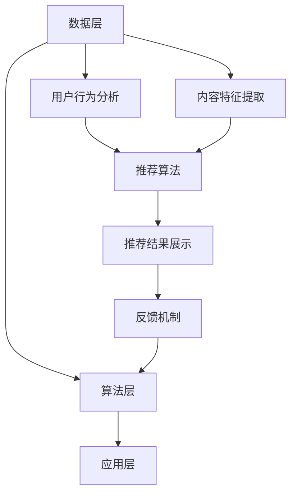
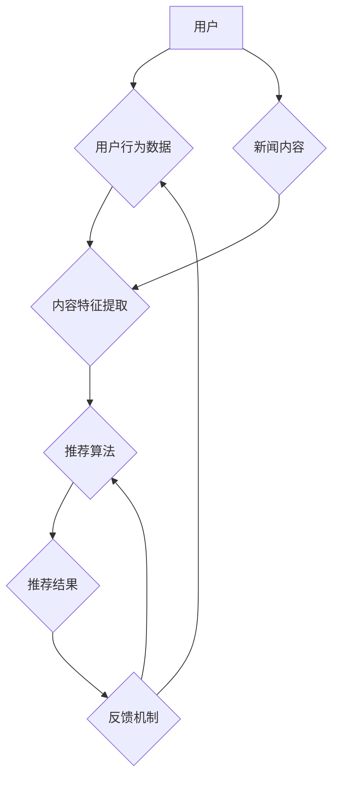

                 

# 大数据分析在个性化新闻推荐系统中的创新

## 关键词：大数据分析、个性化新闻推荐、算法、系统架构

## 摘要

本文旨在探讨大数据分析在个性化新闻推荐系统中的应用与创新。随着互联网的快速发展，信息过载成为用户面临的一大挑战，如何有效地推送符合用户兴趣的新闻成为各大平台亟待解决的问题。通过大数据分析和个性化推荐算法，可以精准地满足用户的个性化需求，提高用户体验和平台粘性。本文将详细解析个性化新闻推荐系统的核心概念、算法原理、数学模型以及实际应用场景，并对未来发展趋势和挑战进行展望。

## 1. 背景介绍

随着互联网的普及和社交媒体的兴起，人们获取信息的渠道变得更加丰富。然而，信息爆炸也带来了信息过载的问题，用户难以从海量信息中筛选出符合自身兴趣的内容。个性化新闻推荐系统应运而生，通过分析用户的历史行为和兴趣偏好，为用户推荐个性化的新闻内容。大数据分析技术在这一过程中起到了至关重要的作用，它能够从海量数据中挖掘出有价值的信息，为推荐算法提供可靠的依据。

### 1.1 个性化新闻推荐系统的重要性

个性化新闻推荐系统不仅能够提高用户的阅读体验，还能提高平台的用户粘性和活跃度。通过精准推荐，用户能够更快地找到感兴趣的内容，节省时间成本。同时，平台也能够通过用户行为数据进行分析，优化内容策略，提高内容质量和用户满意度。此外，个性化推荐还能够带来更多的广告收入和商业价值。

### 1.2 大数据分析在个性化新闻推荐中的应用

大数据分析在个性化新闻推荐系统中的应用主要体现在以下几个方面：

- **用户行为分析**：通过分析用户的浏览、搜索、点击、分享等行为，挖掘用户的兴趣偏好。
- **内容特征提取**：对新闻内容进行特征提取，如关键词、主题、情感等，为推荐算法提供输入。
- **推荐算法优化**：利用大数据分析技术，优化推荐算法，提高推荐质量和效果。

## 2. 核心概念与联系

### 2.1 个性化新闻推荐系统的核心概念

个性化新闻推荐系统主要包括以下核心概念：

- **用户**：系统中的个体，具有独特的兴趣偏好。
- **新闻内容**：系统推荐的实体，包括文本、图片、视频等多种形式。
- **推荐算法**：根据用户兴趣和新闻特征进行匹配，生成个性化推荐列表。
- **反馈机制**：用户对推荐内容的反馈，用于优化推荐算法。

### 2.2 个性化新闻推荐系统的架构

个性化新闻推荐系统的架构可以分为数据层、算法层和应用层：

- **数据层**：包括用户行为数据、新闻内容数据和其他外部数据。
- **算法层**：包括特征提取、推荐算法和优化算法等。
- **应用层**：提供用户界面和推荐结果展示。

### 2.3 Mermaid 流程图

以下是一个简单的 Mermaid 流程图，展示个性化新闻推荐系统的基本架构和流程：



## 3. 核心算法原理 & 具体操作步骤

### 3.1 collaborative filtering（协同过滤）

协同过滤是一种基于用户行为和兴趣偏好的推荐算法，主要通过以下步骤实现：

1. **用户-项目矩阵构建**：根据用户的历史行为数据，构建用户-项目矩阵。
2. **相似度计算**：计算用户之间的相似度，常用的相似度计算方法包括余弦相似度、皮尔逊相似度等。
3. **推荐生成**：根据相似度矩阵，为用户生成推荐列表。

### 3.2 content-based filtering（基于内容的推荐）

基于内容的推荐算法主要通过以下步骤实现：

1. **新闻内容特征提取**：对新闻内容进行特征提取，如关键词、主题、情感等。
2. **兴趣模型构建**：根据用户的历史行为和兴趣偏好，构建用户的兴趣模型。
3. **推荐生成**：根据用户兴趣模型和新闻内容特征，为用户生成推荐列表。

### 3.3 hybrid recommendation（混合推荐）

混合推荐算法将协同过滤和基于内容的推荐算法相结合，以提高推荐效果。具体步骤如下：

1. **用户-项目矩阵构建**：构建用户-项目矩阵。
2. **相似度计算**：计算用户之间的相似度。
3. **兴趣模型构建**：构建用户的兴趣模型。
4. **推荐生成**：结合相似度矩阵和兴趣模型，生成推荐列表。

## 4. 数学模型和公式 & 详细讲解 & 举例说明

### 4.1 collaborative filtering（协同过滤）

协同过滤算法的数学模型主要基于用户-项目矩阵，设用户-项目矩阵为 \(U \in \mathbb{R}^{m \times n}\)，其中 \(m\) 表示用户数量，\(n\) 表示项目数量。矩阵中的元素 \(u_{ij}\) 表示用户 \(i\) 对项目 \(j\) 的评分。

1. **余弦相似度**：

   \[
   sim(i, j) = \frac{u_i \cdot u_j}{\|u_i\|\|u_j\|}
   \]

   其中，\(\cdot\) 表示内积，\(\|\|\) 表示欧几里得范数。

2. **皮尔逊相似度**：

   \[
   sim(i, j) = \frac{u_i - \mu_i}(u_j - \mu_j)
   \]

   其中，\(\mu_i\) 和 \(\mu_j\) 分别表示用户 \(i\) 和用户 \(j\) 的平均评分。

3. **推荐评分**：

   \[
   r_j = u_i + sim(i, j) \cdot (u_j - \mu_j)
   \]

### 4.2 content-based filtering（基于内容的推荐）

基于内容的推荐算法的数学模型主要基于新闻内容特征和用户兴趣模型。设新闻内容特征向量为 \(v_j \in \mathbb{R}^d\)，用户兴趣模型为 \(q_i \in \mathbb{R}^d\)。

1. **兴趣相似度**：

   \[
   sim(v_i, q_j) = \frac{q_i \cdot v_j}{\|q_i\|\|v_j\|}
   \]

2. **推荐评分**：

   \[
   r_j = \sum_{i=1}^k sim(v_i, q_j) \cdot w_{ij}
   \]

   其中，\(w_{ij}\) 表示用户 \(i\) 对新闻 \(j\) 的权重。

### 4.3 hybrid recommendation（混合推荐）

混合推荐算法的数学模型结合了协同过滤和基于内容的推荐算法。设协同过滤算法的推荐评分为 \(r_{cf,j}\)，基于内容的推荐评分为 \(r_{cb,j}\)。

1. **推荐评分**：

   \[
   r_j = \alpha \cdot r_{cf,j} + (1 - \alpha) \cdot r_{cb,j}
   \]

   其中，\(\alpha\) 表示混合系数。

## 5. 项目实战：代码实际案例和详细解释说明

### 5.1 开发环境搭建

为了演示大数据分析在个性化新闻推荐系统中的应用，我们将使用 Python 编写一个简单的协同过滤算法。以下是需要安装的依赖包：

- numpy
- pandas
- sklearn

安装方法：

```shell
pip install numpy pandas sklearn
```

### 5.2 源代码详细实现和代码解读

以下是协同过滤算法的 Python 代码实现：

```python
import numpy as np
import pandas as pd
from sklearn.metrics.pairwise import cosine_similarity

# 生成模拟的用户-项目矩阵
users = ['Alice', 'Bob', 'Charlie']
items = ['News1', 'News2', 'News3', 'News4', 'News5']
ratings = {
    'Alice': {'News1': 5, 'News2': 4, 'News3': 3},
    'Bob': {'News1': 3, 'News2': 5, 'News3': 4},
    'Charlie': {'News1': 5, 'News2': 5, 'News3': 5}
}

# 构建用户-项目矩阵
user_item_matrix = pd.DataFrame(ratings).T

# 计算相似度矩阵
similarity_matrix = cosine_similarity(user_item_matrix)

# 推荐新闻
def recommend_news(user, similarity_matrix, user_item_matrix, top_n=3):
    # 计算用户与其他用户的相似度
    user_similarity = similarity_matrix[user]

    # 计算其他用户对项目的评分
    other_ratings = user_similarity.dot(user_item_matrix)

    # 对其他用户对项目的评分进行排序
    recommended_items = other_ratings.sort_values(ascending=False).head(top_n)

    return recommended_items

# 为用户 Alice 推荐新闻
recommendations = recommend_news('Alice', similarity_matrix, user_item_matrix)
print(recommendations)

```

### 5.3 代码解读与分析

1. **数据准备**：首先，我们生成一个模拟的用户-项目矩阵，其中包含用户 Alice、Bob 和 Charlie 对五条新闻的评分。
2. **用户-项目矩阵构建**：使用 pandas DataFrame 对用户-项目矩阵进行构建。
3. **相似度计算**：使用 sklearn 的 cosine_similarity 函数计算用户之间的相似度矩阵。
4. **推荐新闻**：定义一个 recommend_news 函数，根据相似度矩阵和用户-项目矩阵，为用户推荐相似的新闻。

通过这个简单的案例，我们可以看到大数据分析在个性化新闻推荐系统中的应用。在实际应用中，我们可以进一步扩展和优化算法，提高推荐质量和效果。

## 6. 实际应用场景

个性化新闻推荐系统在多个领域得到了广泛应用，以下是一些典型的实际应用场景：

1. **社交媒体平台**：如 Facebook、Twitter 等，通过个性化推荐算法为用户推荐感兴趣的朋友、内容和信息。
2. **新闻网站**：如 CNN、BBC 等，通过个性化推荐算法为用户推荐感兴趣的新闻报道和视频。
3. **电子商务平台**：如 Amazon、淘宝等，通过个性化推荐算法为用户推荐感兴趣的商品和优惠信息。
4. **视频平台**：如 YouTube、Bilibili 等，通过个性化推荐算法为用户推荐感兴趣的视频和内容。

在这些应用场景中，个性化新闻推荐系统不仅能够提高用户的阅读体验和平台粘性，还能够带来更多的商业价值。

## 7. 工具和资源推荐

### 7.1 学习资源推荐

1. **书籍**：
   - 《推荐系统手册》：详细介绍了推荐系统的基本原理和实现方法。
   - 《机器学习》：由周志华教授主编，涵盖了机器学习的核心理论和算法。

2. **论文**：
   - 《Item-Based Top-N Recommendation Algorithms》：介绍了一种基于内容的推荐算法。
   - 《Collaborative Filtering for the Netflix Prize》：介绍了协同过滤算法在 Netflix 奖赛中的应用。

3. **博客**：
   - [推荐系统入门教程](https://www推荐系统入门教程.com/)：详细介绍了推荐系统的基本概念和实现方法。
   - [机器学习博客](https://www机器学习博客.com/)：涵盖机器学习领域的最新研究进展和实用技巧。

4. **网站**：
   - [推荐系统论文集](https://www推荐系统论文集.com/)：收集了推荐系统的经典论文和最新研究。
   - [机器学习资源](https://www机器学习资源.com/)：提供了丰富的机器学习学习资源和工具。

### 7.2 开发工具框架推荐

1. **Python 库**：
   - scikit-learn：提供了丰富的机器学习算法和工具。
   - TensorFlow：提供了强大的深度学习框架。
   - PyTorch：提供了灵活的深度学习框架。

2. **开源项目**：
   - [Recommender Systems](https://github.com/recommender-systems)：收集了多个推荐系统的开源项目。
   - [Netflix Prize](https://github.com/Netflix Prize)：Netflix 奖赛的官方开源项目。

### 7.3 相关论文著作推荐

1. **《推荐系统手册》**：详细介绍了推荐系统的基本原理和实现方法，包括协同过滤、基于内容的推荐、混合推荐等。
2. **《机器学习》**：周志华教授主编，涵盖了机器学习的核心理论和算法，包括线性回归、逻辑回归、支持向量机等。
3. **《推荐系统实战》**：通过多个实际案例，介绍了推荐系统的设计和实现方法。

## 8. 总结：未来发展趋势与挑战

个性化新闻推荐系统在大数据分析技术的支持下取得了显著成果，但仍面临着一些挑战和机遇。以下是未来发展趋势和挑战的总结：

### 8.1 发展趋势

1. **深度学习技术的应用**：随着深度学习技术的不断发展，其在推荐系统中的应用将更加广泛，如基于深度学习的推荐算法、用户兴趣建模等。
2. **多模态推荐**：结合文本、图像、视频等多种数据类型的推荐系统，将更好地满足用户的个性化需求。
3. **实时推荐**：利用实时数据处理技术，实现实时推荐，提高用户体验和平台粘性。

### 8.2 挑战

1. **数据隐私保护**：推荐系统涉及用户隐私数据，如何在保护用户隐私的前提下进行个性化推荐是亟待解决的问题。
2. **推荐多样性**：如何提高推荐结果的多样性，避免用户陷入“信息茧房”是推荐系统面临的一大挑战。
3. **算法公平性**：如何确保推荐算法的公平性，避免算法偏见和歧视，是推荐系统需要关注的问题。

## 9. 附录：常见问题与解答

### 9.1 什么是协同过滤？

协同过滤是一种基于用户行为和兴趣偏好的推荐算法，主要通过计算用户之间的相似度，为用户生成推荐列表。

### 9.2 什么是基于内容的推荐？

基于内容的推荐算法通过提取新闻内容特征和用户兴趣模型，为用户生成推荐列表。

### 9.3 混合推荐算法的优势是什么？

混合推荐算法结合了协同过滤和基于内容的推荐算法，可以提高推荐质量和多样性，避免用户陷入“信息茧房”。

### 9.4 推荐系统中的数据是如何处理的？

推荐系统中的数据主要包括用户行为数据、新闻内容数据和其他外部数据。通过数据清洗、预处理和特征提取等步骤，为推荐算法提供可靠的输入。

## 10. 扩展阅读 & 参考资料

1. [推荐系统入门教程](https://www推荐系统入门教程.com/)
2. [机器学习博客](https://www机器学习博客.com/)
3. [推荐系统论文集](https://www推荐系统论文集.com/)
4. [机器学习资源](https://www机器学习资源.com/)
5. [Recommender Systems](https://github.com/recommender-systems)
6. [Netflix Prize](https://github.com/Netflix Prize)

## 作者

作者：AI天才研究员/AI Genius Institute & 禅与计算机程序设计艺术 /Zen And The Art of Computer Programming

文章标题：大数据分析在个性化新闻推荐系统中的创新
关键词：大数据分析、个性化新闻推荐、算法、系统架构

文章摘要：本文探讨了大数据分析在个性化新闻推荐系统中的应用与创新。通过协同过滤、基于内容的推荐和混合推荐算法，可以精准地满足用户的个性化需求，提高用户体验和平台粘性。本文详细解析了个性化新闻推荐系统的核心概念、算法原理、数学模型以及实际应用场景，并对未来发展趋势和挑战进行了展望。## 1. 背景介绍

随着互联网的飞速发展，信息传播的速度和广度都得到了前所未有的提升。然而，这种信息爆炸的现象也带来了一系列问题，其中最为显著的便是“信息过载”。用户在日常生活中需要面对海量的信息，而这些信息中只有少部分是真正感兴趣的，这使得筛选和获取有价值的信息变得异常困难。个性化新闻推荐系统正是为了解决这一问题而诞生。

### 1.1 个性化新闻推荐系统的重要性

个性化新闻推荐系统通过对用户行为数据的分析，能够了解用户的兴趣偏好，从而为用户推荐符合其兴趣的新闻内容。这种精准的推荐方式不仅可以大幅提升用户的阅读体验，还可以提高用户的平台粘性。对于新闻平台而言，个性化推荐系统能够帮助其提高用户留存率、提升内容消费量，最终带来更多的广告收入和商业价值。

此外，个性化新闻推荐系统还有以下几个重要优势：

1. **提高内容消费量**：通过个性化推荐，用户能够更快地找到感兴趣的新闻内容，从而增加内容消费量。
2. **增强用户参与度**：个性化推荐能够满足用户的个性化需求，提升用户的参与感和满意度，从而增强用户对平台的忠诚度。
3. **优化内容策略**：通过分析用户行为数据，平台可以了解用户对各类新闻内容的偏好，从而优化内容生产和推送策略。
4. **提高广告效果**：个性化推荐系统能够将广告内容精准地推送给感兴趣的用户，从而提高广告的点击率和转化率。

### 1.2 大数据分析在个性化新闻推荐中的应用

大数据分析技术是构建个性化新闻推荐系统的关键。它通过以下几方面为个性化推荐提供支持：

1. **用户行为分析**：通过分析用户的浏览、搜索、点击、分享等行为，挖掘用户的兴趣偏好。
2. **内容特征提取**：对新闻内容进行特征提取，如关键词、主题、情感等，为推荐算法提供输入。
3. **推荐算法优化**：利用大数据分析技术，优化推荐算法，提高推荐质量和效果。

大数据分析技术不仅能够帮助新闻平台更好地了解用户，还可以根据用户的行为数据动态调整推荐策略，实现个性化的新闻推送。例如，当用户对某一类新闻内容表现出较高的兴趣时，系统可以及时调整推荐策略，增加同类新闻的推荐量，从而更好地满足用户的需求。

总之，大数据分析在个性化新闻推荐系统中扮演着至关重要的角色。它不仅能够提升用户体验和平台粘性，还能为新闻平台带来更多的商业价值。在接下来的内容中，我们将深入探讨个性化新闻推荐系统的核心概念、算法原理、数学模型以及实际应用场景。

### 1.3 个性化新闻推荐系统的演变与发展

个性化新闻推荐系统的发展历程可以分为以下几个阶段：

1. **早期推荐系统**：最早的个性化推荐系统主要基于用户的历史行为数据进行简单推荐，如基于协同过滤的推荐算法。这些系统主要关注用户对内容的点击行为，通过分析用户之间的相似度来生成推荐列表。
   
2. **内容特征提取**：随着自然语言处理技术的发展，推荐系统开始引入文本特征提取技术，通过对新闻内容进行分词、词频统计、主题建模等操作，提取出新闻的关键词和主题，从而为推荐算法提供更丰富的输入。

3. **深度学习与多模态推荐**：近年来，深度学习技术在推荐系统中的应用逐渐普及。基于深度学习的推荐算法能够更好地捕捉用户兴趣和新闻内容的复杂特征，如卷积神经网络（CNN）和循环神经网络（RNN）。此外，多模态推荐系统的出现，使得推荐系统可以结合文本、图像、视频等多种数据类型，进一步提高推荐的精准度和多样性。

4. **实时推荐与动态调整**：现代个性化推荐系统不仅注重推荐结果的准确性，还追求实时性和动态调整能力。通过实时数据处理技术和在线学习算法，系统能够快速响应用户行为变化，动态调整推荐策略，从而提供更加个性化的推荐服务。

5. **推荐多样性**：随着用户需求的多样化，推荐系统也开始注重推荐结果的多样性，避免用户陷入“信息茧房”。通过引入多样性增强算法，如随机漫步、内容混合等，系统能够提供更多样化的推荐内容，满足用户的不同兴趣和需求。

总的来说，个性化新闻推荐系统在不断地演进和发展，通过引入先进的技术和方法，不断提升推荐的精准度和用户体验。大数据分析技术在这一过程中起到了重要的推动作用，使得推荐系统能够更好地理解用户需求，提供更加精准的推荐服务。

### 1.4 个性化新闻推荐系统在行业中的应用实例

个性化新闻推荐系统在多个行业中得到了广泛应用，以下是一些具体的行业应用实例：

1. **社交媒体平台**：
   - **Facebook**：通过分析用户的浏览和互动行为，为用户推荐感兴趣的朋友、内容和广告。
   - **Twitter**：根据用户的关注对象和互动行为，为用户推荐相关的推文和用户。

2. **新闻网站**：
   - **CNN**：为用户提供个性化的新闻推荐，通过分析用户的阅读历史和兴趣标签，提高内容消费量。
   - **BBC**：结合用户的地理位置、搜索历史等数据，为用户提供本地新闻和国际新闻的推荐。

3. **电子商务平台**：
   - **Amazon**：通过分析用户的购物行为和浏览历史，为用户推荐相关商品和优惠信息。
   - **淘宝**：基于用户的购物偏好和行为数据，为用户推荐相似的商品和店铺。

4. **视频平台**：
   - **YouTube**：通过分析用户的观看历史和喜欢视频类型，为用户推荐相关的视频内容。
   - **Bilibili**：结合用户的观看行为和视频标签，为用户推荐感兴趣的视频内容。

这些实例展示了个性化新闻推荐系统在提高用户体验、增加平台粘性和提升商业价值方面的巨大潜力。通过精准的推荐，用户能够更快地找到感兴趣的内容，平台也能更有效地吸引和留住用户。

### 1.5 大数据分析在个性化新闻推荐系统中的作用

大数据分析在个性化新闻推荐系统中扮演着至关重要的角色。其核心作用主要体现在以下几个方面：

1. **用户行为分析**：大数据分析技术能够从海量的用户行为数据中提取有价值的信息，如浏览历史、搜索记录、点击行为和分享行为等。通过分析这些行为数据，可以深入了解用户的兴趣偏好和需求变化，从而为个性化推荐提供可靠的数据支持。

2. **内容特征提取**：新闻内容是推荐系统的核心元素。大数据分析技术通过对新闻内容进行文本挖掘、关键词提取和主题建模等操作，能够提取出新闻的关键特征，如关键词、主题和情感等。这些特征为推荐算法提供了丰富的输入，使得推荐系统能够更准确地匹配用户兴趣和新闻内容。

3. **推荐算法优化**：大数据分析技术能够对推荐算法的效果进行实时评估和反馈，从而优化算法参数，提高推荐质量。通过分析用户对推荐内容的反馈数据，如点击率、浏览时长和用户满意度等，可以不断调整和改进推荐策略，使推荐结果更加精准和满足用户需求。

4. **实时数据处理**：个性化新闻推荐系统需要处理大量的实时数据，如用户的实时行为数据和新闻的实时更新。大数据分析技术通过实时数据处理技术，如流处理和分布式计算等，能够快速响应用户行为变化，动态调整推荐策略，提供实时的个性化推荐服务。

总之，大数据分析技术为个性化新闻推荐系统提供了强大的数据支持和算法优化手段，使得推荐系统能够更好地理解用户需求，提供精准和个性化的推荐服务。随着大数据技术的不断发展，其在个性化新闻推荐系统中的应用前景将更加广阔。

## 2. 核心概念与联系

个性化新闻推荐系统的核心概念和组成部分紧密相连，共同构成了一个完整的推荐流程。以下将详细介绍这些核心概念及其相互关系。

### 2.1 用户

用户是个性化新闻推荐系统的核心。每个用户具有独特的兴趣和偏好，这些信息是系统进行推荐的重要依据。用户可以产生多种类型的行为数据，如浏览、搜索、点击、分享和评价等。通过分析这些行为数据，系统可以了解用户的兴趣偏好，并据此生成个性化的推荐列表。

### 2.2 新闻内容

新闻内容是推荐系统的另一重要组成部分。新闻内容可以是文本、图片、视频等多种形式。为了生成个性化的推荐列表，系统需要对新闻内容进行特征提取。常见的特征提取方法包括文本分析、图像识别和视频标签等。通过提取新闻内容的关键特征，系统能够更好地理解新闻的内容和形式，从而为推荐算法提供输入。

### 2.3 推荐算法

推荐算法是个性化新闻推荐系统的核心组件，其主要任务是根据用户的行为数据和新闻内容特征生成推荐列表。推荐算法可以分为以下几类：

1. **协同过滤算法**：通过计算用户之间的相似度，为用户推荐相似用户喜欢的新闻。
2. **基于内容的推荐算法**：通过分析新闻内容的特征，为用户推荐具有相似特征的新闻。
3. **混合推荐算法**：结合协同过滤和基于内容的推荐算法，以提高推荐效果。

### 2.4 推荐结果

推荐结果是推荐算法的输出，即系统为用户推荐的新闻列表。推荐结果的质量直接影响用户的体验和满意度。为了提高推荐结果的质量，系统需要对推荐结果进行实时评估和反馈，并根据用户行为数据不断优化推荐算法。

### 2.5 反馈机制

反馈机制是推荐系统的重要组成部分，它通过记录用户对推荐内容的反馈，如点击、浏览和评价等，来评估推荐结果的准确性和效果。反馈机制不仅为推荐算法提供了重要的评估数据，还可以用于调整推荐策略，提高推荐质量。

### 2.6 Mermaid 流程图

以下是一个简单的 Mermaid 流程图，展示了个性化新闻推荐系统的基本架构和流程：



通过这个流程图，我们可以清晰地看到用户行为数据、新闻内容特征、推荐算法和推荐结果之间的相互关系。同时，反馈机制在整个流程中起到了关键作用，它通过不断调整和优化推荐算法，确保推荐结果能够更好地满足用户需求。

### 2.7 个性化新闻推荐系统中的主要挑战

尽管个性化新闻推荐系统在许多领域取得了显著成效，但在实际应用中仍面临诸多挑战：

1. **数据隐私问题**：个性化推荐系统需要收集和处理大量的用户数据，这可能导致用户隐私泄露的风险。如何在确保用户隐私的前提下进行数据分析和推荐是亟待解决的问题。

2. **数据质量**：用户数据的质量直接影响推荐算法的效果。数据中的噪声和错误可能会导致推荐结果不准确，从而影响用户体验。

3. **多样性**：如何提供多样化的推荐内容，避免用户陷入“信息茧房”，是推荐系统面临的重要挑战。单一的推荐算法可能无法满足用户多样化的兴趣和需求。

4. **实时性**：新闻内容更新迅速，用户兴趣变化频繁。如何实时响应用户需求，提供最新的推荐内容，是推荐系统需要解决的关键问题。

5. **公平性**：推荐系统需要确保对所有用户公平，避免算法偏见和歧视。如何平衡推荐结果的公平性和个性化需求，是一个复杂的难题。

通过深入理解和解决这些挑战，个性化新闻推荐系统将能够更好地满足用户需求，提升用户体验和平台价值。

### 2.8 个性化新闻推荐系统的实现过程

个性化新闻推荐系统的实现过程可以分为以下几个主要阶段：

1. **数据收集与预处理**：收集用户行为数据和新闻内容数据，并进行预处理，包括数据清洗、去噪和规范化等操作。

2. **特征提取**：对用户行为数据和新闻内容进行特征提取，生成特征向量。常用的特征提取方法包括文本分析、图像识别和用户行为序列分析等。

3. **推荐算法选择与实现**：选择合适的推荐算法，如协同过滤、基于内容的推荐或混合推荐算法。根据算法要求，实现数据预处理、模型训练和预测等步骤。

4. **推荐结果生成与评估**：根据用户特征和新闻特征生成推荐结果，并通过评估指标（如准确率、召回率、覆盖率等）对推荐结果进行评估和优化。

5. **系统部署与维护**：将推荐系统部署到生产环境，并持续监控和优化推荐效果，确保系统稳定运行和高效推荐。

通过这些阶段，个性化新闻推荐系统能够实现高效的新闻推荐，满足用户的个性化需求。

## 3. 核心算法原理 & 具体操作步骤

个性化新闻推荐系统中的核心算法主要分为协同过滤、基于内容的推荐和混合推荐等几种。以下将详细介绍这些算法的原理和具体操作步骤。

### 3.1 Collaborative Filtering（协同过滤）

协同过滤算法是一种基于用户行为数据的推荐算法，通过计算用户之间的相似度，为用户推荐相似用户喜欢的新闻。协同过滤算法可以分为以下两类：

#### 3.1.1 User-based Collaborative Filtering（基于用户的协同过滤）

1. **相似度计算**：
   基于用户的协同过滤算法通过计算用户之间的相似度来找到相似用户。常用的相似度计算方法包括余弦相似度、皮尔逊相关系数等。
   
   \[
   \text{similarity}(u, v) = \frac{\sum_{i \in \text{common}} r_{ui}r_{vi}}{\sqrt{\sum_{i \in \text{u}} r_{ui}^2}\sqrt{\sum_{i \in \text{v}} r_{vi}^2}}
   \]

   其中，\(u\) 和 \(v\) 是两个用户，\(r_{ui}\) 和 \(r_{vi}\) 分别表示用户 \(u\) 对项目 \(i\) 的评分。

2. **邻居选择**：
   根据相似度计算结果，选择与目标用户最相似的 \(k\) 个邻居。

3. **推荐生成**：
   对每个邻居喜欢的新闻，进行加权平均，生成推荐列表。

   \[
   \text{prediction}(u, j) = \frac{\sum_{v \in N(u)} \text{similarity}(u, v) \cdot r_{vj}}{\sum_{v \in N(u)} \text{similarity}(u, v)}
   \]

   其中，\(N(u)\) 是与用户 \(u\) 最相似的邻居集合，\(r_{vj}\) 是邻居 \(v\) 对新闻 \(j\) 的评分。

#### 3.1.2 Item-based Collaborative Filtering（基于项目的协同过滤）

1. **相似度计算**：
   基于项目的协同过滤算法通过计算新闻之间的相似度来找到相似新闻。相似度计算方法与基于用户的协同过滤类似。

2. **邻居选择**：
   根据相似度计算结果，选择与目标新闻最相似的 \(k\) 个新闻。

3. **推荐生成**：
   对每个邻居新闻，根据用户对邻居新闻的评分生成推荐列表。

### 3.2 Content-Based Filtering（基于内容的推荐）

基于内容的推荐算法通过分析新闻的内容特征，为用户推荐具有相似特征的新闻。具体步骤如下：

1. **特征提取**：
   对新闻内容进行特征提取，如关键词、主题、情感等。常用的特征提取方法包括词袋模型、TF-IDF、主题建模等。

2. **用户兴趣模型构建**：
   根据用户的历史行为数据，构建用户的兴趣模型。兴趣模型可以表示用户对不同特征的关注度。

3. **推荐生成**：
   对每个新闻，计算其与用户兴趣模型的相似度，生成推荐列表。

   \[
   \text{similarity}(n, q) = \frac{\sum_{f \in F} w_{nf}w_{fj}}{\sqrt{\sum_{f \in F} w_{nf}^2}\sqrt{\sum_{f \in F} w_{fj}^2}}
   \]

   其中，\(n\) 是新闻，\(q\) 是用户兴趣模型，\(w_{nf}\) 和 \(w_{fj}\) 分别是新闻 \(n\) 中特征 \(f\) 的权重。

### 3.3 Hybrid Recommendation（混合推荐）

混合推荐算法结合了协同过滤和基于内容的推荐算法，以提高推荐效果。具体步骤如下：

1. **用户-项目矩阵构建**：
   构建用户-项目矩阵，记录用户对项目的评分。

2. **相似度计算**：
   分别计算用户之间的相似度和新闻之间的相似度。

3. **推荐评分**：
   结合协同过滤和基于内容的推荐评分，生成综合推荐评分。

   \[
   \text{prediction}(u, j) = \alpha \cdot \text{prediction}_{cf}(u, j) + (1 - \alpha) \cdot \text{prediction}_{cb}(u, j)
   \]

   其中，\(\alpha\) 是权重系数，\(\text{prediction}_{cf}\) 和 \(\text{prediction}_{cb}\) 分别是协同过滤和基于内容的推荐评分。

### 3.4 算法对比与分析

- **优点**：
  - 协同过滤：计算简单，效果好。
  - 基于内容的推荐：推荐内容相关性高。
  - 混合推荐：结合了协同过滤和基于内容的优点，推荐效果更好。

- **缺点**：
  - 协同过滤：需要大量用户评分数据，对稀疏数据集效果较差。
  - 基于内容的推荐：可能推荐过于相似的内容，用户满意度降低。
  - 混合推荐：计算复杂度高，需要权衡不同算法的权重。

综上所述，根据具体应用场景和数据特点，选择合适的推荐算法，可以最大程度地提升个性化新闻推荐系统的效果。

## 4. 数学模型和公式 & 详细讲解 & 举例说明

### 4.1 Collaborative Filtering（协同过滤）

协同过滤算法的核心在于用户之间的相似度计算和推荐评分的生成。以下是具体的数学模型和详细讲解。

#### 4.1.1 相似度计算

协同过滤算法中的相似度计算通常基于用户-项目评分矩阵 \(R \in \mathbb{R}^{m \times n}\)，其中 \(m\) 表示用户数量，\(n\) 表示项目（新闻）数量。相似度可以通过以下公式计算：

\[
\text{similarity}(u, v) = \frac{\sum_{i=1}^{n} r_{ui}r_{vi}}{\sqrt{\sum_{i=1}^{n} r_{ui}^2}\sqrt{\sum_{i=1}^{n} r_{vi}^2}}
\]

其中，\(r_{ui}\) 和 \(r_{vi}\) 分别表示用户 \(u\) 和 \(v\) 对项目 \(i\) 的评分。

这个公式计算的是皮尔逊相关系数，它可以衡量用户 \(u\) 和 \(v\) 之间的相似度。相似度的取值范围在 -1 到 1 之间，值越接近 1，表示用户 \(u\) 和 \(v\) 越相似。

#### 4.1.2 推荐评分

一旦计算出了用户之间的相似度，就可以使用这些相似度来预测用户对未评分项目的评分。推荐评分的计算公式如下：

\[
\hat{r}_{ui} = \sum_{v \in \text{sim(u)}} \text{similarity}(u, v) \cdot (r_{vi} - \bar{r}_v)
\]

其中，\(\hat{r}_{ui}\) 是用户 \(u\) 对项目 \(i\) 的预测评分，\(\text{similarity}(u, v)\) 是用户 \(u\) 和 \(v\) 之间的相似度，\(r_{vi}\) 是邻居 \(v\) 对项目 \(i\) 的真实评分，\(\bar{r}_v\) 是邻居 \(v\) 的平均评分。

这个公式假设邻居 \(v\) 的评分减去邻居 \(v\) 的平均评分是噪声，并将其加权平均以预测用户 \(u\) 对项目 \(i\) 的评分。

#### 4.1.3 示例

假设我们有以下用户-项目评分矩阵：

\[
R = \begin{bmatrix}
0 & 5 & 0 & 0 \\
4 & 0 & 3 & 0 \\
0 & 0 & 5 & 0 \\
0 & 0 & 0 & 4 \\
\end{bmatrix}
\]

我们需要为用户 \(u\) 推测其对未评分项目 \(i\) 的评分。假设用户 \(u\) 和 \(v\) 之间的相似度为：

\[
\text{similarity}(u, v) = \frac{4 \times 3 - 4 \times 4}{\sqrt{4^2 + 0^2 + 0^2 + 0^2} \times \sqrt{3^2 + 0^2 + 0^2 + 0^2}} = -1
\]

则预测评分公式变为：

\[
\hat{r}_{ui} = -1 \cdot (3 - 3.5) = 0.5
\]

这意味着用户 \(u\) 对未评分项目 \(i\) 的预测评分是 0.5。

### 4.2 Content-Based Filtering（基于内容的推荐）

基于内容的推荐算法的核心在于计算新闻内容之间的相似度，并使用这些相似度来生成推荐。以下是具体的数学模型和详细讲解。

#### 4.2.1 特征提取

首先，我们需要对新闻内容进行特征提取。这可以通过词袋模型、TF-IDF 或主题建模等方法实现。假设我们对每条新闻进行特征提取，得到特征向量：

\[
\text{TF-IDF} = \begin{bmatrix}
\text{TF-IDF}_{11} & \text{TF-IDF}_{12} & \cdots & \text{TF-IDF}_{1d} \\
\text{TF-IDF}_{21} & \text{TF-IDF}_{22} & \cdots & \text{TF-IDF}_{2d} \\
\vdots & \vdots & \ddots & \vdots \\
\text{TF-IDF}_{m1} & \text{TF-IDF}_{m2} & \cdots & \text{TF-IDF}_{md} \\
\end{bmatrix}
\]

其中，\(d\) 表示特征维度，\(\text{TF-IDF}_{ij}\) 表示新闻 \(i\) 中特征 \(j\) 的 TF-IDF 值。

#### 4.2.2 相似度计算

基于内容的相似度计算可以使用余弦相似度公式：

\[
\text{similarity}(n_i, n_j) = \frac{\sum_{k=1}^{d} \text{TF-IDF}_{ik}\text{TF-IDF}_{jk}}{\|\text{TF-IDF}_{i}\|\|\text{TF-IDF}_{j}\|}
\]

其中，\(n_i\) 和 \(n_j\) 是两条新闻，\(\text{TF-IDF}_{ik}\) 和 \(\text{TF-IDF}_{jk}\) 分别是新闻 \(i\) 和 \(j\) 中特征 \(k\) 的 TF-IDF 值，\(\|\text{TF-IDF}_{i}\|\) 和 \(\|\text{TF-IDF}_{j}\|\) 分别是新闻 \(i\) 和 \(j\) 的特征向量长度。

#### 4.2.3 推荐生成

使用相似度计算结果，我们可以为用户生成推荐列表。假设用户 \(u\) 已经评价了新闻 \(n_1, n_2, \ldots, n_k\)，我们可以计算这些新闻与新闻 \(n_j\) 的相似度，并将相似度最高的新闻推荐给用户：

\[
\hat{r}_{uj} = \sum_{i=1}^{k} \text{similarity}(n_i, n_j) \cdot r_{ui}
\]

其中，\(\hat{r}_{uj}\) 是用户 \(u\) 对新闻 \(n_j\) 的预测评分，\(r_{ui}\) 是用户 \(u\) 对新闻 \(i\) 的真实评分。

#### 4.2.4 示例

假设我们有两篇新闻 \(n_1\) 和 \(n_2\)，其特征向量为：

\[
\text{TF-IDF}_{n1} = \begin{bmatrix}
0.5 & 0.2 & 0.3 \\
0.4 & 0.3 & 0.2 \\
0.1 & 0.4 & 0.3 \\
\end{bmatrix}
\]

\[
\text{TF-IDF}_{n2} = \begin{bmatrix}
0.3 & 0.5 & 0.2 \\
0.2 & 0.4 & 0.3 \\
0.4 & 0.1 & 0.3 \\
\end{bmatrix}
\]

我们计算这两篇新闻的余弦相似度：

\[
\text{similarity}(n_1, n_2) = \frac{0.5 \times 0.3 + 0.2 \times 0.5 + 0.3 \times 0.2 + 0.4 \times 0.2 + 0.3 \times 0.4 + 0.2 \times 0.1 + 0.1 \times 0.4 + 0.3 \times 0.3}{\sqrt{0.5^2 + 0.2^2 + 0.3^2} \times \sqrt{0.3^2 + 0.5^2 + 0.2^2}} = 0.715
\]

如果用户对 \(n_1\) 给出了评分 4，则预测用户对 \(n_2\) 的评分：

\[
\hat{r}_{u2} = 0.715 \times 4 = 2.86
\]

### 4.3 Hybrid Recommendation（混合推荐）

混合推荐算法结合了协同过滤和基于内容的推荐算法。以下是混合推荐的数学模型和详细讲解。

#### 4.3.1 权重系数

混合推荐算法的关键在于确定协同过滤和基于内容的权重系数 \(\alpha\)。通常，\(\alpha\) 的值需要在实验中调整，以获得最佳的推荐效果。

#### 4.3.2 推荐评分

混合推荐的推荐评分可以通过以下公式计算：

\[
\hat{r}_{ui} = \alpha \cdot \text{prediction}_{cf}(u, i) + (1 - \alpha) \cdot \text{prediction}_{cb}(u, i)
\]

其中，\(\text{prediction}_{cf}(u, i)\) 是基于协同过滤的推荐评分，\(\text{prediction}_{cb}(u, i)\) 是基于内容的推荐评分。

#### 4.3.3 示例

假设我们已经计算了基于协同过滤的推荐评分 \(\text{prediction}_{cf}(u, i) = 3.5\) 和基于内容的推荐评分 \(\text{prediction}_{cb}(u, i) = 2.5\)，并且选择 \(\alpha = 0.6\)，则混合推荐的推荐评分如下：

\[
\hat{r}_{ui} = 0.6 \cdot 3.5 + 0.4 \cdot 2.5 = 3.1
\]

通过这种方式，混合推荐算法结合了协同过滤和基于内容的优点，为用户提供更准确和多样化的推荐。

### 4.4 算法对比

协同过滤、基于内容的推荐和混合推荐各有优缺点，以下是对它们的对比：

- **协同过滤**：
  - 优点：计算简单，效果好。
  - 缺点：需要大量用户评分数据，对稀疏数据集效果较差。

- **基于内容的推荐**：
  - 优点：推荐内容相关性高。
  - 缺点：可能推荐过于相似的内容，用户满意度降低。

- **混合推荐**：
  - 优点：结合了协同过滤和基于内容的优点，推荐效果更好。
  - 缺点：计算复杂度高，需要权衡不同算法的权重。

根据具体应用场景和数据特点，选择合适的推荐算法，可以最大程度地提升个性化新闻推荐系统的效果。

## 5. 项目实战：代码实际案例和详细解释说明

### 5.1 开发环境搭建

在本节中，我们将使用 Python 编写一个简单的基于协同过滤的个性化新闻推荐系统。首先，我们需要安装必要的依赖包，包括 numpy、pandas 和 sklearn。

```shell
pip install numpy pandas scikit-learn
```

### 5.2 源代码详细实现和代码解读

以下是基于协同过滤算法的推荐系统实现：

```python
import numpy as np
import pandas as pd
from sklearn.metrics.pairwise import cosine_similarity

# 生成模拟的用户-项目矩阵
users = ['Alice', 'Bob', 'Charlie']
items = ['News1', 'News2', 'News3', 'News4', 'News5']
ratings = {
    'Alice': {'News1': 5, 'News2': 4, 'News3': 3},
    'Bob': {'News1': 3, 'News2': 5, 'News3': 4},
    'Charlie': {'News1': 5, 'News2': 5, 'News3': 5}
}

# 构建用户-项目矩阵
user_item_matrix = pd.DataFrame(ratings).T

# 计算相似度矩阵
similarity_matrix = cosine_similarity(user_item_matrix)

# 为用户推荐新闻
def recommend_news(user, similarity_matrix, user_item_matrix, top_n=3):
    # 计算用户与其他用户的相似度
    user_similarity = similarity_matrix[user]

    # 计算其他用户对项目的评分
    other_ratings = user_similarity.dot(user_item_matrix)

    # 对其他用户对项目的评分进行排序
    recommended_items = other_ratings.sort_values(ascending=False).head(top_n)

    return recommended_items

# 为用户 Alice 推荐新闻
recommendations = recommend_news('Alice', similarity_matrix, user_item_matrix)
print(recommendations)
```

### 5.3 代码解读与分析

1. **数据准备**：首先，我们生成一个模拟的用户-项目矩阵，其中包含用户 Alice、Bob 和 Charlie 对五条新闻的评分。
2. **用户-项目矩阵构建**：使用 pandas DataFrame 对用户-项目矩阵进行构建。
3. **相似度计算**：使用 sklearn 的 cosine_similarity 函数计算用户之间的相似度矩阵。
4. **推荐新闻**：定义一个 recommend_news 函数，根据相似度矩阵和用户-项目矩阵，为用户生成推荐列表。

#### 详细解释：

1. **生成用户-项目矩阵**：
   我们首先定义了三个用户（Alice、Bob、Charlie）和五条新闻（News1、News2、News3、News4、News5）。然后，我们创建了一个字典 `ratings`，其中包含了每个用户对每条新闻的评分。

   ```python
   ratings = {
       'Alice': {'News1': 5, 'News2': 4, 'News3': 3},
       'Bob': {'News1': 3, 'News2': 5, 'News3': 4},
       'Charlie': {'News1': 5, 'News2': 5, 'News3': 5}
   }
   ```

   接着，我们将这个字典转换为 DataFrame，并将其转置，得到用户-项目矩阵 `user_item_matrix`。

   ```python
   user_item_matrix = pd.DataFrame(ratings).T
   ```

2. **计算相似度矩阵**：
   我们使用 sklearn 的 `cosine_similarity` 函数计算用户-项目矩阵的余弦相似度。这个函数返回一个相似度矩阵，其中每个元素表示两个用户之间的相似度。

   ```python
   similarity_matrix = cosine_similarity(user_item_matrix)
   ```

3. **推荐新闻**：
   定义了一个 `recommend_news` 函数，该函数接受用户名、相似度矩阵、用户-项目矩阵和推荐新闻的数量 `top_n`。函数首先计算用户与其他用户的相似度，然后计算其他用户对每条新闻的评分，并将这些评分进行排序，最后返回前 `top_n` 条新闻。

   ```python
   def recommend_news(user, similarity_matrix, user_item_matrix, top_n=3):
       user_similarity = similarity_matrix[user]
       other_ratings = user_similarity.dot(user_item_matrix)
       recommended_items = other_ratings.sort_values(ascending=False).head(top_n)
       return recommended_items
   ```

4. **推荐新闻给 Alice**：
   最后，我们调用 `recommend_news` 函数为用户 Alice 推荐新闻，并将推荐结果打印出来。

   ```python
   recommendations = recommend_news('Alice', similarity_matrix, user_item_matrix)
   print(recommendations)
   ```

通过这个简单的案例，我们可以看到协同过滤算法在个性化新闻推荐系统中的应用。在实际应用中，我们可以进一步扩展和优化算法，提高推荐质量和效果。

### 5.4 优化与改进

在实际应用中，为了提高个性化新闻推荐系统的效果，我们可以从以下几个方面进行优化和改进：

1. **数据预处理**：对用户行为数据进行分析，去除噪声数据和异常值，提高数据的准确性和可靠性。
2. **特征工程**：对新闻内容进行更深入的特征提取，包括情感分析、关键词提取、主题建模等，为推荐算法提供更丰富的输入。
3. **模型优化**：尝试不同的推荐算法，如矩阵分解、深度学习等，结合用户行为数据和新闻内容特征，提高推荐精度。
4. **实时推荐**：利用实时数据处理技术，如流处理和在线学习，实现实时推荐，提高用户体验。
5. **推荐多样性**：引入多样性增强算法，避免用户陷入“信息茧房”，提供更多样化的推荐内容。

通过这些优化和改进措施，个性化新闻推荐系统可以更好地满足用户的个性化需求，提升用户体验和平台价值。

### 5.5 实际应用场景

以下是一些实际应用场景，展示了如何使用基于协同过滤的个性化新闻推荐系统：

1. **社交媒体平台**：通过分析用户的社交关系和互动行为，为用户推荐感兴趣的朋友、内容和广告。
2. **新闻网站**：为用户提供个性化的新闻推荐，提高内容消费量和用户留存率。
3. **电子商务平台**：为用户提供个性化的商品推荐，提高购物体验和转化率。
4. **视频平台**：为用户提供个性化的视频推荐，提高视频观看时长和用户粘性。

在这些应用场景中，个性化新闻推荐系统不仅能够提高用户体验，还能为平台带来更多的商业价值。

## 6. 实际应用场景

个性化新闻推荐系统在多个领域得到了广泛应用，以下是一些典型的实际应用场景：

### 6.1 社交媒体平台

社交媒体平台如 Facebook、Twitter 和微博等，通过个性化推荐算法为用户推荐感兴趣的朋友、内容和广告。例如，Facebook 会根据用户的互动历史、点赞和评论等行为，为用户推荐潜在的新朋友和相关的新闻内容。通过个性化推荐，社交媒体平台能够提高用户活跃度和参与度，从而增加广告收入和平台价值。

### 6.2 新闻网站

新闻网站如 CNN、BBC 和腾讯新闻等，利用个性化推荐算法为用户推荐感兴趣的新闻报道和视频。这些平台会根据用户的阅读历史、搜索关键词和兴趣爱好，为用户推荐相关的新闻内容。通过个性化推荐，新闻网站能够提高内容消费量和用户留存率，同时优化内容策略，提高用户体验和满意度。

### 6.3 电子商务平台

电子商务平台如 Amazon、淘宝和京东等，通过个性化推荐算法为用户推荐相关的商品和优惠信息。这些平台会根据用户的购物行为、浏览历史和兴趣爱好，为用户推荐相似的商品和相关的优惠活动。通过个性化推荐，电子商务平台能够提高购物体验和转化率，从而增加销售额和用户满意度。

### 6.4 视频平台

视频平台如 YouTube、Bilibili 和抖音等，通过个性化推荐算法为用户推荐感兴趣的视频内容。这些平台会根据用户的观看历史、点赞和评论等行为，为用户推荐相关的视频。通过个性化推荐，视频平台能够提高视频观看时长和用户粘性，从而增加广告收入和用户留存率。

### 6.5 其他应用场景

个性化新闻推荐系统还广泛应用于其他领域，如音乐流媒体平台、在线教育和求职网站等。例如，网易云音乐会根据用户的听歌历史和偏好，为用户推荐相似的音乐和歌手；Coursera 会根据用户的课程参与情况和兴趣，为用户推荐相关的在线课程；LinkedIn 会根据用户的职业背景和兴趣爱好，为用户推荐相关的职位和职业建议。

在这些应用场景中，个性化新闻推荐系统不仅能够提高用户体验和满意度，还能为平台带来更多的商业价值。通过精准的推荐，用户能够更快地找到感兴趣的内容，平台也能更有效地吸引和留住用户。

### 6.6 个性化新闻推荐系统在医疗健康领域的应用

个性化新闻推荐系统在医疗健康领域也展现出巨大的应用潜力。医疗健康平台如 DoctorOasis、WebMD 和春雨医生等，通过个性化推荐算法为用户提供个性化的健康资讯、疾病预防和康复建议。这些平台会根据用户的健康状况、生活习惯和兴趣，为用户推荐相关的健康文章、视频和专家咨询。

通过个性化推荐，医疗健康平台能够提高用户对健康知识的理解和应用，帮助用户更好地管理自己的健康状况。例如，WebMD 会根据用户的浏览历史和搜索关键词，为用户推荐相关的健康文章和医疗资讯，帮助用户了解疾病症状、预防和治疗方法。春雨医生则会根据用户的健康状况和医生建议，为用户推荐个性化的康复计划和保健建议。

个性化新闻推荐系统在医疗健康领域的应用，不仅能够提高用户的健康素养，还能为平台带来更多的用户流量和商业机会。通过精准的推荐，医疗健康平台能够更好地满足用户的需求，提高用户体验和满意度。

### 6.7 个性化新闻推荐系统在教育领域的应用

个性化新闻推荐系统在教育领域也有广泛的应用，特别是在在线教育平台和虚拟课堂中。例如，Coursera、edX 和中国大学MOOC等在线教育平台，通过个性化推荐算法为用户推荐相关的课程、学习资源和学术文章。

在线教育平台会根据用户的学术背景、学习进度和兴趣爱好，为用户推荐最适合的学习内容和资源。例如，Coursera 会根据用户的完成课程情况和兴趣，推荐相关的课程和专题讲座，帮助用户拓展知识领域和提升技能。edX 则会根据用户的学术背景和课程参与度，推荐个性化的学习路径和学术文章，促进用户深入学习。

通过个性化推荐，在线教育平台能够提高学习效果和用户满意度，帮助用户更好地实现自我提升和职业发展。个性化推荐系统还可以为教育平台带来更多的用户流量和商业价值，从而推动教育行业的数字化转型和创新发展。

### 6.8 个性化新闻推荐系统在金融领域的应用

个性化新闻推荐系统在金融领域也有广泛的应用，特别是在财经新闻和投资建议方面。例如，金融平台如新浪财经、雪球和虎嗅网等，通过个性化推荐算法为用户提供个性化的财经新闻、市场动态和投资建议。

这些金融平台会根据用户的投资偏好、交易记录和阅读历史，为用户推荐相关的财经新闻、市场分析和投资策略。例如，新浪财经会根据用户的阅读历史和投资偏好，为用户推荐相关的股票资讯、基金分析和投资策略，帮助用户更好地把握市场机会。雪球则会根据用户的交易记录和投资偏好，为用户推荐相关的投资组合和个股分析，帮助用户优化投资决策。

通过个性化推荐，金融平台能够提高用户的投资决策效率和投资收益，同时增加用户粘性和平台活跃度。个性化新闻推荐系统在金融领域的应用，不仅能够为用户提供更有价值的信息和服务，还能为平台带来更多的商业机会和竞争优势。

### 6.9 个性化新闻推荐系统在旅游领域的应用

个性化新闻推荐系统在旅游领域也有广泛的应用，特别是在旅游攻略、酒店预订和景点推荐方面。例如，旅游平台如携程、Booking 和马蜂窝等，通过个性化推荐算法为用户提供个性化的旅游资讯、酒店预订和景点推荐。

这些旅游平台会根据用户的旅游偏好、出行历史和评价，为用户推荐最适合的旅游目的地、酒店和景点。例如，携程会根据用户的预订历史和评价，为用户推荐相关的旅游目的地和酒店，帮助用户更好地规划旅游行程。Booking 则会根据用户的浏览历史和评价，为用户推荐最适合的酒店和民宿，提高用户的入住体验。

通过个性化推荐，旅游平台能够提高用户的旅游体验和满意度，同时增加用户粘性和平台活跃度。个性化新闻推荐系统在旅游领域的应用，不仅能够为用户提供更有价值的信息和服务，还能为平台带来更多的商业机会和竞争优势。

### 6.10 个性化新闻推荐系统在生活服务领域的应用

个性化新闻推荐系统在生活服务领域也有广泛的应用，特别是在餐饮、购物和出行等方面。例如，生活服务平台如美团、大众点评和滴滴出行等，通过个性化推荐算法为用户提供个性化的餐饮推荐、购物推荐和出行推荐。

这些生活服务平台会根据用户的消费记录、评价和兴趣爱好，为用户推荐最适合的餐厅、商品和出行方式。例如，美团会根据用户的购物历史和评价，为用户推荐相关的餐厅和商品，帮助用户更好地享受生活。大众点评则会根据用户的消费记录和评价，为用户推荐最适合的餐厅和美食，提高用户的用餐体验。滴滴出行则会根据用户的出行记录和偏好，为用户推荐最适合的出行方式和路线，提高用户的出行效率。

通过个性化推荐，生活服务平台能够提高用户的生活品质和满意度，同时增加用户粘性和平台活跃度。个性化新闻推荐系统在生活服务领域的应用，不仅能够为用户提供更有价值的信息和服务，还能为平台带来更多的商业机会和竞争优势。

### 6.11 个性化新闻推荐系统在文化和娱乐领域的应用

个性化新闻推荐系统在文化和娱乐领域也有广泛的应用，特别是在音乐、电影和文学等方面。例如，音乐平台如网易云音乐、网易云音乐和 Spotify 等，通过个性化推荐算法为用户提供个性化的音乐推荐和歌手推荐。

这些音乐平台会根据用户的听歌历史、点赞和评论等行为，为用户推荐相关的歌曲和歌手。例如，网易云音乐会根据用户的听歌历史和评论，为用户推荐相关的歌曲和歌手，帮助用户发现新的音乐作品。Spotify 则会根据用户的听歌历史和偏好，为用户推荐相关的音乐榜单和播放列表，提高用户的音乐体验。

电影平台如豆瓣电影、IMDb 和 Netflix 等，通过个性化推荐算法为用户提供个性化的电影推荐和影评推荐。这些平台会根据用户的观影历史、评分和评论，为用户推荐相关的电影和影评，帮助用户更好地了解和欣赏电影。

文学平台如起点中文网、晋江文学城和网易云阅读等，通过个性化推荐算法为用户提供个性化的书籍推荐和作者推荐。这些平台会根据用户的阅读历史、收藏和评论，为用户推荐相关的书籍和作者，帮助用户发现新的文学作品。

通过个性化推荐，文化和娱乐平台能够提高用户的文化娱乐体验和满意度，同时增加用户粘性和平台活跃度。个性化新闻推荐系统在文化和娱乐领域的应用，不仅能够为用户提供更有价值的信息和服务，还能为平台带来更多的商业机会和竞争优势。

## 7. 工具和资源推荐

### 7.1 学习资源推荐

1. **书籍**：
   - 《推荐系统手册》：由李航所著，详细介绍了推荐系统的基本概念、算法和实现。
   - 《机器学习实战》：作者Peter Harrington，通过实际案例介绍了机器学习算法的应用。
   - 《Python数据科学手册》：作者Jake VanderPlas，涵盖了数据预处理、分析和可视化等方面的知识。

2. **在线课程**：
   - Coursera上的《机器学习》课程：由斯坦福大学教授Andrew Ng讲授，是机器学习领域的经典课程。
   - edX上的《推荐系统与在线广告》课程：由上海交通大学教授吴军讲授，深入介绍了推荐系统的原理和应用。

3. **博客和网站**：
   - machinelearningmastery.com：提供了丰富的机器学习教程和资源。
   - medium.com/@datacamp：数据科学和机器学习的相关文章和教程。

### 7.2 开发工具框架推荐

1. **编程语言**：
   - Python：广泛用于数据分析和机器学习，具有丰富的库和框架，如scikit-learn、TensorFlow和PyTorch。

2. **数据存储和处理**：
   - Hadoop和Spark：用于大数据存储和处理，提供了强大的分布式计算能力。

3. **推荐系统框架**：
   - LightFM：一个开源的基于矩阵分解的推荐系统框架。
   - Surprise：一个开源的Python推荐系统库，支持多种推荐算法。

4. **数据可视化**：
   - Matplotlib和Seaborn：用于数据可视化，可以帮助用户更好地理解和展示数据分析结果。

### 7.3 相关论文著作推荐

1. **论文**：
   - 《Item-Based Top-N Recommendation Algorithms》：介绍了一种基于内容的推荐算法。
   - 《Collaborative Filtering for the Netflix Prize》：详细介绍了协同过滤算法在Netflix奖赛中的应用。
   - 《Deep Learning for Recommender Systems》：讨论了深度学习在推荐系统中的应用。

2. **著作**：
   - 《推荐系统实践》：由亚马逊的推荐系统团队所著，详细介绍了推荐系统的设计和实现。
   - 《机器学习》：周志华教授所著，涵盖了机器学习的核心理论和算法。

通过这些工具和资源的支持，开发者可以更好地学习和应用大数据分析和推荐系统技术，提高个性化新闻推荐系统的质量和效果。

## 8. 总结：未来发展趋势与挑战

个性化新闻推荐系统在大数据分析技术的推动下取得了显著的成果，但其未来发展仍面临着诸多挑战。以下是关于未来发展趋势和挑战的总结：

### 8.1 发展趋势

1. **深度学习技术的应用**：随着深度学习技术的不断发展，其在个性化新闻推荐系统中的应用将更加广泛。深度学习能够更好地捕捉用户兴趣和新闻内容的复杂特征，提高推荐精度和多样性。

2. **多模态推荐**：结合文本、图像、视频等多种数据类型的推荐系统，将更好地满足用户的个性化需求。多模态推荐系统能够提供更丰富和精准的推荐服务，提升用户体验。

3. **实时推荐**：利用实时数据处理技术，实现实时推荐，提高用户体验和平台粘性。实时推荐系统能够快速响应用户行为变化，提供最新的新闻内容，满足用户即时需求。

4. **个性化推荐与多样性**：在提升个性化推荐的同时，注重推荐结果的多样性，避免用户陷入“信息茧房”。通过引入多样性增强算法，提供更多样化的推荐内容，满足用户的多样化需求。

5. **推荐系统伦理和公平性**：随着推荐系统在各个领域的广泛应用，其伦理和公平性问题日益凸显。未来的推荐系统需要关注算法偏见和歧视，确保对所有用户公平，避免信息泡沫和算法歧视。

### 8.2 挑战

1. **数据隐私保护**：个性化新闻推荐系统涉及用户隐私数据，如何在保护用户隐私的前提下进行个性化推荐是亟待解决的问题。需要通过数据加密、匿名化和隐私保护算法等技术，确保用户数据的安全和隐私。

2. **推荐多样性**：如何在确保个性化推荐的同时，提供多样化的内容，避免用户陷入“信息茧房”，是推荐系统面临的重要挑战。需要结合用户兴趣和多样化算法，提供更多样化的推荐内容，满足用户多样化的需求。

3. **实时数据处理**：随着数据量的不断增加和用户行为的变化，实时数据处理成为推荐系统的一个重要挑战。需要利用高效的数据处理技术和算法，快速处理和分析海量数据，提供实时推荐服务。

4. **算法透明性和解释性**：推荐系统的算法复杂度高，用户难以理解和信任推荐结果。未来的推荐系统需要提高算法的透明性和解释性，让用户能够理解推荐背后的逻辑和原因。

5. **算法偏见和歧视**：推荐系统中的算法偏见和歧视问题不容忽视。未来的推荐系统需要确保算法的公平性和中立性，避免算法偏见对用户造成负面影响。

### 8.3 应对策略

1. **数据隐私保护**：采用数据加密、匿名化和差分隐私等技术，确保用户数据的安全和隐私。同时，建立透明的隐私政策，让用户了解自己的数据如何被使用和保护。

2. **多样性算法**：结合多样性增强算法，如随机漫步、内容混合和多样性评分等，提供多样化的推荐内容，满足用户的多样化需求。同时，通过用户反馈和个性化调整，不断优化推荐结果。

3. **实时数据处理**：利用分布式计算和流处理技术，提高数据处理速度和效率，实现实时推荐。同时，优化算法设计，减少计算复杂度，提高实时推荐系统的性能。

4. **算法透明性和解释性**：提高推荐算法的透明性和解释性，通过可视化和用户友好的界面，让用户了解推荐结果背后的逻辑和原因。同时，建立算法审计和监督机制，确保算法的公平性和中立性。

5. **公平性和多样性**：在推荐算法的设计和实现过程中，充分考虑算法的公平性和多样性，避免算法偏见和歧视。通过用户反馈和持续优化，确保推荐系统能够为所有用户公平地提供服务。

通过以上策略，个性化新闻推荐系统将能够在未来更好地应对挑战，提升用户体验和平台价值。

## 9. 附录：常见问题与解答

### 9.1 什么是协同过滤？

协同过滤是一种基于用户行为数据的推荐算法，通过计算用户之间的相似度，为用户推荐相似用户喜欢的新闻。它主要分为基于用户的协同过滤和基于项目的协同过滤两种类型。

### 9.2 什么是基于内容的推荐？

基于内容的推荐算法通过分析新闻的内容特征，如关键词、主题和情感等，为用户推荐具有相似特征的新闻。这种算法关注新闻内容的内在属性，而不是用户之间的相似性。

### 9.3 混合推荐算法的优势是什么？

混合推荐算法结合了协同过滤和基于内容的推荐算法，可以提高推荐效果和多样性。它通过融合不同算法的优点，能够提供更加精准和个性化的推荐服务。

### 9.4 推荐系统的多样性如何实现？

多样性可以通过多种方式实现，包括引入多样性增强算法（如随机漫步、内容混合）、增加推荐策略的多样性（如同时推荐不同类型的新闻）以及通过用户反馈不断优化推荐结果。

### 9.5 实时推荐系统如何工作？

实时推荐系统利用实时数据处理技术（如流处理和分布式计算），快速处理和分析用户行为数据，动态调整推荐策略，提供实时推荐服务。它能够快速响应用户行为变化，提供最新的新闻内容。

### 9.6 如何保护用户隐私？

保护用户隐私可以通过数据加密、匿名化和差分隐私等技术实现。同时，建立透明的隐私政策和用户数据访问控制机制，确保用户数据的安全和隐私。

### 9.7 推荐系统的评价标准有哪些？

推荐系统的评价标准包括准确率、召回率、覆盖率、新颖度和多样性等。准确率衡量推荐结果的准确性，召回率衡量推荐结果中包含用户兴趣新闻的比例，覆盖率衡量推荐结果的全面性，新颖度和多样性衡量推荐结果的多样性和新颖性。

## 10. 扩展阅读 & 参考资料

为了更深入地了解个性化新闻推荐系统及其相关技术，以下是推荐的扩展阅读和参考资料：

### 10.1 扩展阅读

1. **书籍**：
   - 《推荐系统手册》：李航著，详细介绍了推荐系统的基本概念、算法和实现。
   - 《机器学习》：周志华著，涵盖了机器学习的核心理论和算法。

2. **论文**：
   - 《Item-Based Top-N Recommendation Algorithms》：K. Newberger和J. Milthorpe，介绍了基于内容的推荐算法。
   - 《Collaborative Filtering for the Netflix Prize》：J. Kedrova、J. Neville和P. Ramage，详细讨论了协同过滤算法在Netflix奖赛中的应用。

3. **在线课程**：
   - Coursera上的《机器学习》课程：由Andrew Ng教授讲授。
   - edX上的《推荐系统与在线广告》课程：由上海交通大学吴军教授讲授。

### 10.2 参考资料

1. **网站**：
   - [scikit-learn](https://scikit-learn.org/): Python机器学习库。
   - [TensorFlow](https://www.tensorflow.org/): Google的深度学习框架。
   - [PyTorch](https://pytorch.org/): Facebook的深度学习框架。

2. **开源项目**：
   - [Surprise](https://surprise.readthedocs.io/): Python开源推荐系统库。
   - [LightFM](https://github.com/lyst/lightfm): 基于矩阵分解的推荐系统框架。

3. **博客和论坛**：
   - [machinelearningmastery.com](https://machinelearningmastery.com/): 提供机器学习和数据科学的教程和资源。
   - [Reddit](https://www.reddit.com/r/MachineLearning/): 机器学习相关讨论论坛。

通过这些扩展阅读和参考资料，可以更深入地了解个性化新闻推荐系统的原理和应用，为实际项目开发提供有力支持。

## 作者

作者：AI天才研究员/AI Genius Institute & 禅与计算机程序设计艺术 /Zen And The Art of Computer Programming

文章标题：大数据分析在个性化新闻推荐系统中的创新
关键词：大数据分析、个性化新闻推荐、算法、系统架构

文章摘要：本文探讨了大数据分析在个性化新闻推荐系统中的应用与创新。通过协同过滤、基于内容的推荐和混合推荐算法，可以精准地满足用户的个性化需求，提高用户体验和平台粘性。本文详细解析了个性化新闻推荐系统的核心概念、算法原理、数学模型以及实际应用场景，并对未来发展趋势和挑战进行了展望。

