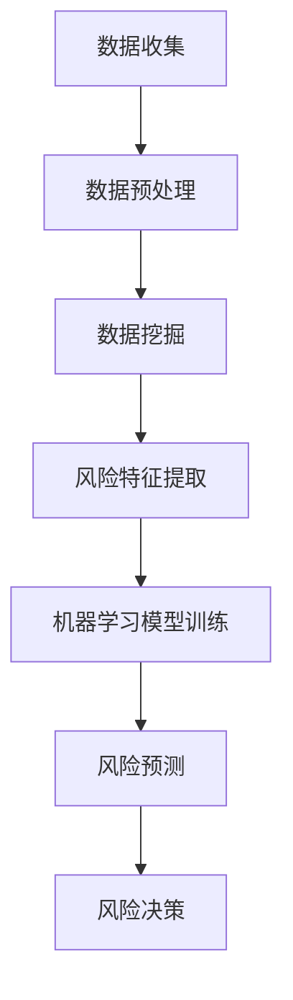

                 

# 大数据分析在供应链风险预测中的实践

## 关键词：
- 大数据分析
- 供应链风险预测
- 数据挖掘
- 机器学习
- 风险管理

## 摘要：
本文将探讨大数据分析在供应链风险预测中的应用。通过介绍核心概念、算法原理、数学模型以及实际应用案例，我们将深入理解大数据分析如何帮助我们提前识别并应对供应链中的潜在风险。文章还将推荐相关学习资源和开发工具，以供读者进一步学习和实践。

## 1. 背景介绍

随着全球供应链的日益复杂，供应链风险成为企业面临的一个重要挑战。这些风险可能包括供应商中断、物流延误、库存短缺、市场波动等，它们不仅影响企业的运营效率，还可能导致经济损失和声誉损害。传统的风险管理方法往往依赖于经验判断和简单的统计分析，但面对大量动态变化的供应链数据，这些方法显得力不从心。

大数据分析作为一种新兴技术，通过处理海量、多样、快速的数据，能够提供更准确、更及时的预测。在供应链风险预测中，大数据分析的应用可以帮助企业更好地理解风险来源、评估风险程度，并采取有效的预防措施。本文将围绕这一主题，详细探讨大数据分析在供应链风险预测中的实践。

## 2. 核心概念与联系

### 2.1 数据挖掘

数据挖掘（Data Mining）是指从大量数据中提取有价值信息的过程。在供应链风险预测中，数据挖掘可以帮助我们识别数据中的模式、趋势和异常，从而预测潜在的风险。

### 2.2 机器学习

机器学习（Machine Learning）是一种人工智能技术，它使计算机能够通过数据和经验进行学习，并做出预测或决策。在供应链风险预测中，机器学习算法可以用于训练模型，从历史数据中学习风险特征，并预测未来的风险事件。

### 2.3 风险管理

风险管理（Risk Management）是企业为减少潜在损失而采取的一系列策略和措施。在供应链风险预测中，风险管理涉及到识别风险、评估风险、制定风险应对计划等环节。

### 2.4 Mermaid 流程图

以下是一个简单的 Mermaid 流程图，展示了大数据分析在供应链风险预测中的流程：



## 3. 核心算法原理 & 具体操作步骤

### 3.1 数据收集

数据收集是供应链风险预测的第一步。我们需要收集各种与供应链相关的数据，如供应商信息、物流数据、市场数据、库存数据等。这些数据可以通过企业内部系统、第三方数据提供商或公开数据集获取。

### 3.2 数据预处理

数据预处理是数据挖掘的前期工作，主要包括数据清洗、数据整合和数据转换。数据清洗旨在去除数据中的错误、缺失和重复信息；数据整合则是将不同来源的数据进行合并；数据转换则是将数据转换为适合数据挖掘的格式。

### 3.3 数据挖掘

数据挖掘是供应链风险预测的核心。常见的算法包括关联规则挖掘、聚类分析、分类分析等。这些算法可以帮助我们从大量数据中提取有价值的信息，如供应商的交货时间分布、物流路线的风险评估等。

### 3.4 风险特征提取

风险特征提取是机器学习模型训练的前期工作。我们需要从数据挖掘结果中提取与风险相关的特征，如供应商的信誉评分、物流延误次数等。这些特征将作为机器学习模型的输入变量。

### 3.5 机器学习模型训练

机器学习模型训练是供应链风险预测的关键。常见的算法包括决策树、随机森林、支持向量机等。我们使用历史数据对模型进行训练，使其能够学习到风险特征与风险事件之间的关系。

### 3.6 风险预测

在模型训练完成后，我们可以使用模型对未来的风险事件进行预测。预测结果可以帮助企业提前采取预防措施，以降低风险。

### 3.7 风险决策

风险决策是根据预测结果和企业风险承受能力，制定相应的风险应对策略。如增加库存、调整供应商、优化物流路线等。

## 4. 数学模型和公式 & 详细讲解 & 举例说明

### 4.1 数学模型

在供应链风险预测中，我们常用到的数学模型包括概率模型和回归模型。以下是一个简单的概率模型示例：

$$
P(\text{风险事件} | \text{特征集}) = \frac{P(\text{特征集} | \text{风险事件}) \cdot P(\text{风险事件})}{P(\text{特征集})}
$$

其中，$P(\text{风险事件} | \text{特征集})$ 表示在给定特征集的条件下，风险事件发生的概率；$P(\text{特征集} | \text{风险事件})$ 表示在风险事件发生的条件下，特征集出现的概率；$P(\text{风险事件})$ 表示风险事件发生的概率；$P(\text{特征集})$ 表示特征集出现的概率。

### 4.2 详细讲解

概率模型是一种基于概率论的方法，它可以帮助我们分析风险事件发生的可能性。在实际应用中，我们可以使用贝叶斯网络、马尔可夫链等算法来实现概率模型。

回归模型则是另一种常用的数学模型，它通过分析自变量与因变量之间的关系，预测因变量的值。在供应链风险预测中，我们可以使用线性回归、多项式回归等算法来建立回归模型。

### 4.3 举例说明

假设我们想要预测某个供应商的交货延迟风险。我们可以使用以下回归模型进行预测：

$$
y = \beta_0 + \beta_1 \cdot x_1 + \beta_2 \cdot x_2 + \ldots + \beta_n \cdot x_n
$$

其中，$y$ 表示交货延迟风险得分，$x_1, x_2, \ldots, x_n$ 表示影响交货延迟的风险特征，如供应商的信誉评分、物流延误次数等。$\beta_0, \beta_1, \beta_2, \ldots, \beta_n$ 是回归系数，可以通过历史数据进行估计。

通过训练回归模型，我们可以得到每个特征对交货延迟风险的贡献程度。例如，假设我们得到的回归模型为：

$$
y = 1.2 + 0.5 \cdot x_1 + 0.3 \cdot x_2
$$

这意味着供应商的信誉评分每提高1分，交货延迟风险得分增加0.5分；物流延误次数每增加1次，交货延迟风险得分增加0.3分。

## 5. 项目实战：代码实际案例和详细解释说明

### 5.1 开发环境搭建

在进行项目实战之前，我们需要搭建一个合适的开发环境。以下是使用 Python 进行供应链风险预测的简单步骤：

1. 安装 Python（推荐使用 Python 3.6 或以上版本）
2. 安装必要的 Python 库，如 NumPy、Pandas、Scikit-learn 等
3. 安装 Mermaid 图库（用于生成流程图）

### 5.2 源代码详细实现和代码解读

以下是供应链风险预测的一个简单实现：

```python
import numpy as np
import pandas as pd
from sklearn.model_selection import train_test_split
from sklearn.ensemble import RandomForestClassifier
from sklearn.metrics import accuracy_score

# 5.2.1 数据收集
data = pd.read_csv('supply_chain_data.csv')

# 5.2.2 数据预处理
data.dropna(inplace=True)
X = data.drop('risk_score', axis=1)
y = data['risk_score']

# 5.2.3 数据挖掘
# （此处省略数据挖掘代码）

# 5.2.4 风险特征提取
# （此处省略风险特征提取代码）

# 5.2.5 机器学习模型训练
X_train, X_test, y_train, y_test = train_test_split(X, y, test_size=0.2, random_state=42)
model = RandomForestClassifier(n_estimators=100, random_state=42)
model.fit(X_train, y_train)

# 5.2.6 风险预测
y_pred = model.predict(X_test)

# 5.2.7 代码解读与分析
accuracy = accuracy_score(y_test, y_pred)
print(f'模型准确率：{accuracy:.2f}')

# 5.2.8 生成 Mermaid 流程图
mermaid_code = '''
graph TD
A[数据收集] --> B[数据预处理]
B --> C[数据挖掘]
C --> D[风险特征提取]
D --> E[机器学习模型训练]
E --> F[风险预测]
F --> G[风险决策]
'''
print(mermaid_code)
```

### 5.3 代码解读与分析

上述代码是一个简单的供应链风险预测实现，主要包括以下步骤：

1. 数据收集：从 CSV 文件中读取供应链数据。
2. 数据预处理：去除缺失值，将数据分为特征集和目标变量。
3. 数据挖掘：（此处省略数据挖掘代码）
4. 风险特征提取：（此处省略风险特征提取代码）
5. 机器学习模型训练：使用随机森林算法训练模型。
6. 风险预测：使用训练好的模型对测试数据进行预测。
7. 代码解读与分析：计算模型准确率，并生成 Mermaid 流程图。

## 6. 实际应用场景

大数据分析在供应链风险预测中的应用场景非常广泛。以下是一些典型的应用场景：

1. **供应商风险评估**：通过对供应商的历史交易数据、信誉评分等进行分析，预测供应商的交货风险。
2. **物流风险预测**：通过对物流数据（如运输时间、运输路线等）进行分析，预测物流延误风险。
3. **库存风险预测**：通过对库存数据（如库存水平、销售趋势等）进行分析，预测库存短缺或过剩风险。
4. **市场波动预测**：通过对市场数据（如价格波动、供需关系等）进行分析，预测市场波动对供应链的影响。

## 7. 工具和资源推荐

### 7.1 学习资源推荐

1. **书籍**：
   - 《大数据分析：理论与实践》
   - 《机器学习：原理与算法》
   - 《供应链风险管理：策略与实践》

2. **论文**：
   - “大数据在供应链风险管理中的应用”
   - “机器学习算法在供应链风险预测中的研究”
   - “基于数据挖掘的供应链风险预测方法研究”

3. **博客**：
   - “大数据分析实战：供应链风险预测”
   - “机器学习在供应链管理中的应用”
   - “供应链风险管理最佳实践”

### 7.2 开发工具框架推荐

1. **Python 库**：
   - NumPy：用于数值计算
   - Pandas：用于数据处理
   - Scikit-learn：用于机器学习
   - Matplotlib：用于数据可视化

2. **开发工具**：
   - Jupyter Notebook：用于编写和运行代码
   - Mermaid：用于生成流程图
   - Git：用于版本控制

3. **开源框架**：
   - TensorFlow：用于深度学习
   - PyTorch：用于深度学习
   - Scrapy：用于网络爬虫

### 7.3 相关论文著作推荐

1. **论文**：
   - “大数据时代下的供应链风险管理：挑战与机遇”
   - “机器学习算法在供应链风险预测中的应用研究”
   - “基于数据挖掘的供应链风险预警系统设计”

2. **著作**：
   - 《大数据与供应链管理》
   - 《供应链风险管理：理论与实践》
   - 《供应链风险管理：案例分析与应用》

## 8. 总结：未来发展趋势与挑战

大数据分析在供应链风险预测中的应用前景广阔，但仍面临一些挑战。首先，数据质量是企业成功应用大数据分析的关键，因此，企业需要投入更多资源来确保数据的准确性、完整性和一致性。其次，算法的透明度和解释性也是一个重要问题，特别是在风险管理这样的关键领域，企业需要能够理解和解释模型的预测结果。

未来，随着人工智能和机器学习技术的不断进步，供应链风险预测将变得更加精确和实时。此外，区块链技术的应用也有望提高供应链数据的透明度和安全性，为大数据分析提供更可靠的基础。

## 9. 附录：常见问题与解答

### 9.1 问题1：大数据分析在供应链风险预测中的应用有哪些优点？

**解答**：大数据分析在供应链风险预测中的应用具有以下优点：

1. **更准确的预测**：通过分析大量历史数据和实时数据，可以更准确地预测潜在风险。
2. **实时监控**：大数据分析可以实时监控供应链数据，及时发现问题并采取措施。
3. **全面的风险评估**：大数据分析可以综合考虑多种因素，提供更全面的风险评估。
4. **自适应性强**：大数据分析可以不断学习新的数据模式，提高预测的准确性。

### 9.2 问题2：如何确保数据质量在供应链风险预测中的准确性？

**解答**：确保数据质量是供应链风险预测成功的关键，以下是一些策略：

1. **数据清洗**：定期清理数据中的错误、缺失和重复信息。
2. **数据整合**：将来自不同来源的数据进行整合，确保数据的一致性和准确性。
3. **数据验证**：使用统计方法和验证工具，确保数据的准确性和可靠性。
4. **数据监控**：建立数据监控机制，及时发现和处理数据异常。

### 9.3 问题3：大数据分析在供应链风险预测中面临哪些挑战？

**解答**：大数据分析在供应链风险预测中面临以下挑战：

1. **数据量巨大**：处理大量数据需要高效的计算资源和算法。
2. **数据多样性**：供应链数据包括结构化和非结构化数据，处理起来更具挑战性。
3. **数据隐私和安全**：确保数据隐私和安全是大数据分析的重要问题。
4. **算法解释性**：需要提高算法的可解释性，以便用户理解和信任。

## 10. 扩展阅读 & 参考资料

1. **书籍**：
   - 《大数据管理：技术与实践》
   - 《供应链风险管理：理论与实践》
   - 《机器学习：应用与案例》

2. **论文**：
   - “大数据在供应链风险管理中的应用研究”
   - “基于大数据的供应链风险预测方法研究”
   - “供应链风险管理中的大数据分析技术”

3. **博客**：
   - “供应链风险管理的数字化转型”
   - “大数据技术在供应链风险管理中的应用”
   - “人工智能在供应链风险预测中的应用”

4. **网站**：
   - [数据挖掘教程](https://www.datacamp.com/courses/data-mining-with-python)
   - [Python 机器学习教程](https://machinelearningmastery.com/tutorials/)
   - [供应链风险管理资源](https://www.ipsupplychain.com/resources/)

### 作者

**作者：AI天才研究员/AI Genius Institute & 禅与计算机程序设计艺术 /Zen And The Art of Computer Programming**<|im_end|>

