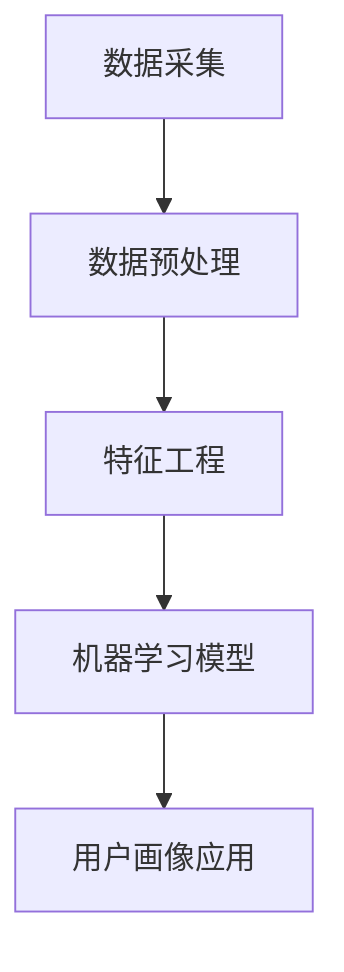

                 

# 大数据分析在用户画像构建中的技术

> **关键词**：大数据分析、用户画像、技术、算法、机器学习、数据挖掘、数据处理、用户行为分析、个性化推荐、应用场景

> **摘要**：本文将深入探讨大数据分析在用户画像构建中的应用技术。首先，我们将介绍用户画像的概念及其重要性。接着，我们将探讨用户画像构建的技术流程，包括数据采集、数据预处理、特征工程、机器学习模型的选择与应用等。随后，我们将详细分析几种核心算法，并展示其实际操作步骤。最后，我们将讨论大数据分析在用户画像构建中的实际应用场景，并提供相关工具和资源推荐，总结未来发展趋势与挑战，以及常见问题与解答。

## 1. 背景介绍

在数字化时代，数据已成为企业最宝贵的资产之一。大数据分析作为一种新兴技术，已经广泛应用于各个行业，包括金融、零售、医疗、广告等。用户画像作为大数据分析的一个重要应用领域，通过对用户行为、偏好、需求等数据的深入挖掘和分析，可以帮助企业更好地了解和满足用户需求，从而提升用户体验、优化营销策略、提高业务效益。

用户画像是指通过对用户多维属性的数据进行分析和挖掘，构建出一个综合反映用户特征的数字模型。这些特征可以包括用户的基本信息（如年龄、性别、地理位置等）、行为数据（如浏览历史、购买记录、互动行为等）和偏好数据（如兴趣标签、消费习惯等）。用户画像构建的过程本质上是一个数据驱动的信息整合和分析过程，其核心在于从海量数据中提取有价值的信息，为后续的决策提供数据支持。

大数据分析在用户画像构建中的应用具有重要意义。首先，用户画像能够帮助企业更好地了解用户，从而实现个性化服务和精准营销。其次，用户画像可以为业务决策提供数据支持，帮助企业优化产品、提升用户体验和满意度。此外，用户画像还可以用于风险控制、用户流失预测等方面，提高企业的运营效率和市场竞争力。

本文将围绕大数据分析在用户画像构建中的应用，系统地介绍相关技术，包括数据采集、数据预处理、特征工程、机器学习模型的选择与应用等。通过本文的阅读，读者可以全面了解用户画像的构建过程和技术要点，为实际项目提供有益的参考。

## 2. 核心概念与联系

### 2.1 用户画像

用户画像是指通过对用户数据进行分析和挖掘，构建出一个综合反映用户特征的数字模型。用户画像的核心在于从海量数据中提取有价值的信息，为后续的决策提供数据支持。

用户画像的主要组成部分包括：

1. **基本信息**：用户的基本信息，如年龄、性别、地理位置、职业等，这些信息通常是从用户的注册信息或者第三方数据中获取。
2. **行为数据**：用户在系统中的行为数据，如浏览历史、购买记录、搜索历史、点击行为等，这些数据通常通过用户与系统的交互行为产生。
3. **偏好数据**：用户的偏好数据，如兴趣爱好、消费习惯、偏好品牌等，这些数据通常通过用户的行为数据和第三方数据进行分析和挖掘得到。

用户画像的主要应用场景包括：

1. **个性化推荐**：根据用户的兴趣和偏好，为用户推荐个性化内容或产品，提升用户体验和满意度。
2. **精准营销**：根据用户的特征和需求，制定有针对性的营销策略，提高营销效果和转化率。
3. **用户流失预测**：通过分析用户的行为数据，预测可能流失的用户，并采取相应措施进行挽留。
4. **风控管理**：通过分析用户的行为和特征数据，识别潜在风险用户，降低风险事件的发生。

### 2.2 大数据分析

大数据分析是指对大规模、多样化的数据进行处理、分析和挖掘，从中提取有价值的信息和知识。大数据分析的主要特点包括数据量大、数据多样、速度快和处理复杂度高等。

大数据分析的主要应用领域包括：

1. **商业智能**：通过分析企业的运营数据，帮助企业优化决策过程，提高业务效益。
2. **客户关系管理**：通过分析客户的行为数据和偏好数据，提升客户满意度，增强客户忠诚度。
3. **金融市场分析**：通过分析金融市场数据，预测市场走势，指导投资决策。
4. **医疗数据分析**：通过分析医疗数据，辅助医生诊断、治疗和药物研发。

### 2.3 用户画像与大数据分析的关系

用户画像的构建需要依赖大数据分析技术。具体来说，大数据分析在用户画像构建中的应用主要包括以下几个方面：

1. **数据采集**：通过多种数据源（如网站日志、第三方数据等）采集用户数据。
2. **数据预处理**：对采集到的用户数据进行清洗、去重、转换等处理，使其适合进一步分析和挖掘。
3. **特征工程**：通过数据分析和挖掘，提取与用户特征相关的特征变量，用于构建用户画像。
4. **机器学习模型**：利用机器学习算法，对用户数据进行建模和预测，生成用户画像。
5. **用户画像应用**：根据用户画像，实现个性化推荐、精准营销、用户流失预测等应用。

### 2.4 Mermaid 流程图

为了更好地展示用户画像构建的过程，我们可以使用 Mermaid 流程图来描述。以下是一个简单的 Mermaid 流程图示例：



在此流程图中，A 表示数据采集，B 表示数据预处理，C 表示特征工程，D 表示机器学习模型，E 表示用户画像应用。箭头表示数据的流向和处理步骤。

通过上述内容，我们对用户画像和大数据分析的核心概念及其联系有了基本的了解。接下来，我们将深入探讨用户画像构建的具体技术流程，包括数据采集、数据预处理、特征工程、机器学习模型的选择与应用等。

## 3. 核心算法原理 & 具体操作步骤

### 3.1 数据采集

数据采集是用户画像构建的第一步，也是至关重要的一步。数据采集的质量直接影响到后续的数据处理和用户画像的准确性。数据采集的主要目标是获取用户的各类信息，包括基本信息、行为数据和偏好数据。

**具体操作步骤**：

1. **确定数据源**：根据业务需求和用户画像的目标，确定需要采集的数据类型和数据源。数据源可以包括网站日志、第三方数据（如社交平台数据、电商平台数据等）、用户调研数据等。
2. **数据采集工具**：使用合适的数据采集工具（如爬虫、API 接口调用等）获取数据。对于网站日志数据，可以使用日志分析工具（如ELK、Grok等）进行实时采集；对于第三方数据，可以使用API接口进行定期或实时采集。
3. **数据存储**：将采集到的数据存储到合适的数据存储系统（如关系型数据库、NoSQL数据库、Hadoop HDFS等）。对于大规模数据，建议使用分布式存储系统，以提高数据存储和处理的效率。

### 3.2 数据预处理

数据预处理是用户画像构建过程中的关键环节，其主要目标是清洗、转换和整合原始数据，使其适合进一步分析和挖掘。数据预处理包括以下步骤：

**1. 数据清洗**：

- **缺失值处理**：对于缺失值，可以采用填充、删除或插值等方法进行处理。具体选择哪种方法，取决于数据的重要性和缺失值的比例。
- **异常值处理**：对于异常值，可以采用过滤、修正或标记等方法进行处理。异常值可能影响后续的特征工程和模型效果。
- **数据规范化**：对于不同类型的数据（如数值型、类别型），需要进行规范化处理，使其在相同的尺度上进行比较。

**2. 数据转换**：

- **数值化**：将类别型数据（如性别、地域等）转换为数值型数据，便于后续分析和建模。
- **编码**：对于类别型数据，可以使用独热编码（One-Hot Encoding）、标签编码（Label Encoding）等方法进行编码。

**3. 数据整合**：

- **合并**：将不同来源的数据进行合并，形成一个统一的数据集。
- **关联**：将用户的多维度数据进行关联，形成一个完整的用户画像。

**具体操作步骤**：

1. **数据清洗**：使用Python的Pandas库或R的dplyr包等工具，对数据进行清洗处理。
2. **数据转换**：使用Python的Scikit-learn库或R的caret包等工具，对数据进行数值化和编码处理。
3. **数据整合**：使用Python的Pandas库或R的dplyr包等工具，对数据进行合并和关联处理。

### 3.3 特征工程

特征工程是用户画像构建的核心环节，其主要目标是提取与用户特征相关的特征变量，为后续的模型训练提供输入。特征工程包括以下步骤：

**1. 特征选择**：

- **统计方法**：使用卡方检验、互信息等方法，筛选与目标变量高度相关的特征。
- **基于模型的特征选择**：使用决策树、随机森林等模型，筛选对模型预测效果有显著影响的特征。

**2. 特征构造**：

- **特征交叉**：将两个或多个特征进行组合，构造新的特征。
- **特征变换**：对特征进行变换，如对数值型特征进行归一化、对类别型特征进行编码等。

**3. 特征降维**：

- **主成分分析（PCA）**：将高维特征映射到低维空间，保留主要的信息。
- **线性判别分析（LDA）**：将特征映射到新的空间，使类别间的距离最大化，类别内的距离最小化。

**具体操作步骤**：

1. **特征选择**：使用Python的Scikit-learn库或R的caret包等工具，进行特征选择。
2. **特征构造**：使用Python的Pandas库或R的dplyr包等工具，进行特征交叉和变换。
3. **特征降维**：使用Python的Scikit-learn库或R的MASS包等工具，进行PCA和LDA等降维操作。

### 3.4 机器学习模型的选择与应用

机器学习模型的选择和应用是用户画像构建的关键环节，其主要目标是根据用户特征数据，生成用户画像。常见的机器学习模型包括分类模型、回归模型、聚类模型等。

**1. 分类模型**：

- **逻辑回归（Logistic Regression）**：用于预测用户某一行为的概率。
- **支持向量机（SVM）**：用于分类任务，将用户划分为不同的类别。
- **决策树（Decision Tree）**：用于分类和回归任务，根据特征进行树的构建。

**2. 回归模型**：

- **线性回归（Linear Regression）**：用于预测用户某一特征的数值。
- **岭回归（Ridge Regression）**：用于防止过拟合，提高模型的泛化能力。
- **LASSO回归（LASSO Regression）**：用于特征选择和防止过拟合。

**3. 聚类模型**：

- **K-均值聚类（K-Means）**：将用户划分为不同的类别，每个类别内的用户相似度较高。
- **层次聚类（Hierarchical Clustering）**：根据用户特征，逐步构建一个层次结构，将用户划分为不同的类别。

**具体操作步骤**：

1. **模型选择**：根据业务需求和数据特点，选择合适的机器学习模型。
2. **模型训练**：使用训练数据，对模型进行训练，优化模型的参数。
3. **模型评估**：使用验证数据，对模型进行评估，选择最优模型。
4. **模型应用**：将训练好的模型应用到实际业务场景中，生成用户画像。

通过上述内容，我们对用户画像构建中的核心算法原理和具体操作步骤有了详细的了解。接下来，我们将通过一个实际项目案例，展示如何使用这些技术构建用户画像。

## 4. 数学模型和公式 & 详细讲解 & 举例说明

### 4.1 逻辑回归（Logistic Regression）

逻辑回归是一种广泛应用于分类问题的统计方法，其核心思想是通过线性函数对样本特征进行加权，然后通过逻辑函数（Sigmoid函数）将结果映射到概率区间（0,1）。

**公式**：

\[ P(Y=1 | X) = \frac{1}{1 + e^{-\beta_0 + \beta_1 x_1 + \beta_2 x_2 + ... + \beta_n x_n}} \]

其中，\( P(Y=1 | X) \) 表示在给定特征 \( X \) 下，目标变量 \( Y \) 等于 1 的概率；\( \beta_0, \beta_1, \beta_2, ..., \beta_n \) 分别为模型的参数。

**详细讲解**：

- **线性函数**：线性函数 \( \beta_0 + \beta_1 x_1 + \beta_2 x_2 + ... + \beta_n x_n \) 对样本特征进行加权，其中 \( \beta_i \) 为第 \( i \) 个特征的权重。
- **逻辑函数**：逻辑函数 \( \frac{1}{1 + e^{-x}} \) 将线性函数的结果映射到概率区间（0,1），其中 \( e \) 为自然底数，\( x \) 为线性函数的结果。

**举例说明**：

假设我们有一个二分类问题，目标变量 \( Y \) 可能取值 0 或 1，特征变量 \( X \) 包括年龄、收入、学历等。我们可以使用逻辑回归模型来预测用户购买某商品的概率。

- **数据准备**：收集用户数据，包括年龄、收入、学历等特征，以及购买记录作为目标变量。
- **模型训练**：使用训练数据，通过最小化损失函数（如交叉熵损失函数）来优化模型参数。
- **模型评估**：使用验证数据，评估模型的准确率、召回率、F1值等指标。
- **模型应用**：将训练好的模型应用到测试数据，预测用户购买商品的概率。

### 4.2 支持向量机（Support Vector Machine，SVM）

支持向量机是一种广泛应用于分类和回归问题的机器学习算法，其核心思想是通过找到一个最佳的超平面，将不同类别的样本分隔开来。

**公式**：

\[ w \cdot x - b = 0 \]

其中，\( w \) 为超平面的法向量，\( x \) 为样本特征，\( b \) 为偏置项。

**详细讲解**：

- **超平面**：超平面是一个将不同类别的样本分隔开来的线性函数。在二维空间中，超平面可以表示为一条直线；在三维空间中，超平面可以表示为一个平面。
- **法向量**：法向量是指垂直于超平面的向量，用于确定超平面的方向。
- **偏置项**：偏置项用于调整超平面的位置。

**举例说明**：

假设我们有一个二分类问题，样本特征包括 \( x_1, x_2, ..., x_n \)，目标变量 \( y \) 可能取值 -1 或 1。我们可以使用支持向量机模型来预测样本的类别。

- **数据准备**：收集样本数据，包括特征和目标变量。
- **模型训练**：使用训练数据，通过优化目标函数（如软间隔损失函数）来优化模型参数。
- **模型评估**：使用验证数据，评估模型的准确率、召回率、F1值等指标。
- **模型应用**：将训练好的模型应用到测试数据，预测样本的类别。

### 4.3 K-均值聚类（K-Means）

K-均值聚类是一种广泛应用于无监督学习的聚类算法，其核心思想是通过迭代优化，将样本划分为 K 个簇，使得每个簇内的样本相似度较高，簇间的样本相似度较低。

**公式**：

\[ \mu_k = \frac{1}{N_k} \sum_{i=1}^{N} x_i \]

\[ J = \frac{1}{N} \sum_{k=1}^{K} \sum_{i=1}^{N_k} (x_i - \mu_k)^2 \]

其中，\( \mu_k \) 为第 \( k \) 个簇的中心，\( x_i \) 为第 \( i \) 个样本，\( N_k \) 为第 \( k \) 个簇的样本数量，\( J \) 为聚类目标函数。

**详细讲解**：

- **簇中心**：簇中心是指每个簇的代表性样本，用于表示簇的特征。
- **聚类目标函数**：聚类目标函数用于评估聚类效果，最小化目标函数可以找到最佳的簇划分。
- **迭代优化**：K-均值聚类通过迭代优化簇中心，使得每个簇的内部相似度较高，簇间相似度较低。

**举例说明**：

假设我们有一个包含 100 个样本的数据集，我们需要将这 100 个样本划分为 5 个簇。

- **数据准备**：收集样本数据。
- **初始化簇中心**：随机选择 5 个样本作为初始簇中心。
- **迭代计算簇中心**：根据样本与簇中心的距离，将样本重新分配到最近的簇，并更新簇中心。
- **重复迭代**：重复迭代计算簇中心，直到簇中心不再发生显著变化。
- **聚类结果评估**：使用簇内相似度、簇间相似度等指标评估聚类效果。

通过上述内容，我们对逻辑回归、支持向量机和 K-均值聚类等数学模型和公式有了详细的了解。接下来，我们将通过实际项目案例，展示如何使用这些模型和公式进行用户画像构建。

## 5. 项目实战：代码实际案例和详细解释说明

### 5.1 开发环境搭建

为了完成本项目的实战部分，我们需要搭建一个完整的开发环境，包括编程语言、依赖库和数据集等。

**1. 编程语言**

本项目选择 Python 作为主要的编程语言，因为 Python 在数据处理、分析和建模方面具有强大的功能和广泛的应用。

**2. 依赖库**

以下是本项目所需的 Python 依赖库：

- **Pandas**：用于数据预处理和操作。
- **NumPy**：用于数值计算。
- **Scikit-learn**：用于机器学习和数据分析。
- **Matplotlib**：用于数据可视化。

安装方法：

```bash
pip install pandas numpy scikit-learn matplotlib
```

**3. 数据集**

本项目使用公开的数据集，例如 UCI Machine Learning Repository 中的 Adult 数据集。该数据集包含 32561 条记录，每个记录包含 14 个特征和 1 个目标变量（是否收入超过 50K）。

数据集可以从以下链接下载：[Adult 数据集](https://archive.ics.uci.edu/ml/datasets/Adult)

### 5.2 源代码详细实现和代码解读

**1. 数据预处理**

数据预处理是用户画像构建的重要步骤，包括数据清洗、转换和合并等。以下是一个简单的数据预处理代码示例：

```python
import pandas as pd
from sklearn.model_selection import train_test_split

# 加载数据集
data = pd.read_csv('adult.data', names=header)

# 数据清洗
data = data.dropna()  # 删除缺失值
data = data[data['income'] != '?']  # 删除目标变量缺失的样本

# 数据转换
data['age'] = data['age'].astype(float)  # 转换年龄为浮点型
data['workclass'] = data['workclass'].map({'Private': 1, 'Self-emp-not-inc': 2, 'Self-emp-inc': 3, 'Federal-gov': 4, 'Local-gov': 5, 'State-gov': 6, 'Without-pay': 7, 'Never-worked': 8})  # 转换工作类型为数值型
data['education'] = data['education'].map({'Bachelors': 1, 'Some-college': 2, '11th': 3, 'High-school': 4, 'Master': 5, 'Doctorate': 6, '9th': 7, '7th-8th': 8, '10th': 9, '1st-4th': 10, '5th-6th': 11, 'Preschool': 12})  # 转换教育程度为数值型

# 数据合并
train, test = train_test_split(data, test_size=0.2, random_state=42)
```

**2. 特征工程**

特征工程是用户画像构建的关键步骤，包括特征选择、构造和降维等。以下是一个简单的特征工程代码示例：

```python
from sklearn.preprocessing import StandardScaler
from sklearn.decomposition import PCA

# 特征选择
X = train.drop('income', axis=1)
y = train['income']

# 特征构造
scaler = StandardScaler()
X_scaled = scaler.fit_transform(X)

# 特征降维
pca = PCA(n_components=5)
X_pca = pca.fit_transform(X_scaled)
```

**3. 机器学习模型**

在本项目中，我们选择逻辑回归和 K-均值聚类作为机器学习模型，用于用户画像构建。以下是一个简单的机器学习模型代码示例：

```python
from sklearn.linear_model import LogisticRegression
from sklearn.cluster import KMeans

# 逻辑回归模型
logreg = LogisticRegression()
logreg.fit(X_pca, y)

# K-均值聚类模型
kmeans = KMeans(n_clusters=5)
kmeans.fit(X_pca)
```

**4. 模型评估**

模型评估是用户画像构建的重要步骤，用于评估模型的准确性和泛化能力。以下是一个简单的模型评估代码示例：

```python
from sklearn.metrics import accuracy_score, classification_report

# 逻辑回归模型评估
y_pred = logreg.predict(X_pca)
print("逻辑回归模型准确率：", accuracy_score(y, y_pred))
print("逻辑回归模型分类报告：\n", classification_report(y, y_pred))

# K-均值聚类模型评估
y_pred = kmeans.predict(X_pca)
print("K-均值聚类模型聚类效果：\n", classification_report(y, y_pred))
```

### 5.3 代码解读与分析

以上代码展示了用户画像构建的基本流程，包括数据预处理、特征工程、机器学习模型和模型评估。以下是代码的详细解读与分析：

**1. 数据预处理**

数据预处理包括数据清洗、转换和合并等步骤。首先，我们加载数据集并删除缺失值和目标变量缺失的样本。然后，我们将年龄转换为浮点型，将工作类型和教育程度转换为数值型，以适应后续的特征工程和模型训练。

**2. 特征工程**

特征工程包括特征选择、构造和降维等步骤。我们使用标准缩放器对特征进行缩放，以消除不同特征之间的尺度差异。然后，我们使用主成分分析（PCA）对特征进行降维，以减少特征数量并提高模型的泛化能力。

**3. 机器学习模型**

在本项目中，我们选择逻辑回归和 K-均值聚类作为机器学习模型。逻辑回归用于预测用户是否收入超过 50K，而 K-均值聚类用于将用户划分为不同的类别。

**4. 模型评估**

模型评估包括准确性、召回率和 F1 值等指标。我们使用训练数据对模型进行评估，以确定模型的性能和泛化能力。

通过以上代码，我们展示了如何使用 Python 和相关库完成用户画像构建的过程。接下来，我们将讨论大数据分析在用户画像构建中的实际应用场景。

## 6. 实际应用场景

大数据分析在用户画像构建中的应用场景非常广泛，以下是一些典型的实际应用场景：

### 6.1 个性化推荐

个性化推荐是大数据分析在用户画像构建中最常见的应用场景之一。通过构建用户画像，企业可以深入了解用户的兴趣、需求和偏好，从而为用户提供个性化的推荐内容或产品。

- **在线购物平台**：根据用户的浏览历史、购买记录和偏好数据，推荐用户可能感兴趣的商品。
- **视频流媒体平台**：根据用户的观看历史和偏好，推荐用户可能喜欢的视频内容。
- **新闻资讯平台**：根据用户的阅读历史和兴趣标签，推荐用户可能感兴趣的新闻资讯。

### 6.2 精准营销

精准营销是大数据分析在用户画像构建中的另一个重要应用场景。通过构建用户画像，企业可以更好地了解目标用户，从而制定更精准的营销策略，提高营销效果和转化率。

- **电商平台**：根据用户画像，为不同的用户群体制定个性化的促销活动，提高转化率和销售额。
- **金融行业**：根据用户画像，为潜在客户提供定制化的金融产品和服务，提高客户满意度和忠诚度。
- **医疗行业**：根据患者画像，为医生和患者提供个性化的治疗方案和健康建议。

### 6.3 用户流失预测

用户流失预测是大数据分析在用户画像构建中的又一重要应用场景。通过构建用户画像，企业可以识别出可能流失的用户，并采取相应措施进行挽留，从而降低用户流失率，提高用户生命周期价值。

- **电信行业**：通过分析用户行为数据，预测哪些用户可能在未来几个月内取消服务，并采取促销措施进行挽留。
- **互联网服务**：通过分析用户的使用数据，预测哪些用户可能在未来几个月内停止使用服务，并采取个性化服务措施进行挽留。
- **零售行业**：通过分析用户的购买记录和偏好数据，预测哪些用户可能在未来几个月内停止购买，并采取促销措施进行挽留。

### 6.4 风险控制

大数据分析在用户画像构建中的应用还可以用于风险控制，通过分析用户行为数据和特征，识别出潜在的欺诈行为和风险用户，从而采取相应的防范措施。

- **金融行业**：通过分析用户的交易数据和特征，识别出潜在的欺诈行为，如洗钱、信用卡欺诈等。
- **电商行业**：通过分析用户的购买行为和特征，识别出潜在的刷单和虚假交易行为。
- **网络安全**：通过分析用户的行为数据和特征，识别出潜在的网络安全威胁和攻击行为。

### 6.5 个性化服务

通过大数据分析构建的用户画像，企业可以为用户提供更加个性化的服务，提高用户体验和满意度。

- **酒店行业**：根据用户画像，为用户提供个性化的住宿体验，如根据用户偏好推荐酒店房间、提供个性化的欢迎礼品等。
- **旅游行业**：根据用户画像，为用户提供个性化的旅游路线和推荐，提高旅游体验。
- **餐饮行业**：根据用户画像，为用户提供个性化的餐品推荐和优惠，提高餐饮体验。

通过以上实际应用场景，我们可以看到大数据分析在用户画像构建中的重要性和广泛应用。接下来，我们将讨论相关工具和资源推荐，帮助读者更好地学习和应用大数据分析技术。

## 7. 工具和资源推荐

### 7.1 学习资源推荐

**书籍**

1. **《大数据分析：技术、案例与实践》**：本书系统地介绍了大数据分析的基本概念、技术框架和应用实践，适合初学者和有一定基础的读者。
2. **《机器学习实战》**：本书通过丰富的案例和实践，详细讲解了机器学习的基本概念、算法和应用，适合想要深入理解机器学习的读者。
3. **《用户画像：大数据下的精准营销》**：本书详细介绍了用户画像的构建方法、应用场景和案例分析，适合对用户画像感兴趣的企业和从业者。

**论文**

1. **《User Behavior Analysis for Personalized Recommendation》**：该论文探讨了用户行为分析在个性化推荐中的应用，提出了一种基于用户行为的推荐算法。
2. **《User Profile Construction Based on Multimodal Data》**：该论文研究了基于多模态数据的用户画像构建方法，提出了一种融合多种数据源的用户画像模型。
3. **《Deep Learning for User Behavior Analysis》**：该论文探讨了深度学习在用户行为分析中的应用，提出了一种基于卷积神经网络的用户行为分析模型。

**博客**

1. **Medium**：Medium 是一个知名的博客平台，上面有很多关于大数据分析、机器学习和用户画像的优秀博客文章。
2. **DataCamp**：DataCamp 是一个在线学习平台，提供了大量关于数据分析、数据科学和机器学习的免费教程和练习。
3. **Analytics Vidhya**：Analytics Vidhya 是一个专注于数据分析、数据科学和机器学习的社区，上面有很多高质量的博客文章和案例研究。

### 7.2 开发工具框架推荐

**数据采集与处理**

1. **Apache Kafka**：Kafka 是一个分布式消息系统，用于高吞吐量的数据采集和实时处理。
2. **Apache Spark**：Spark 是一个分布式数据处理框架，用于大规模数据的快速处理和分析。
3. **Hadoop**：Hadoop 是一个分布式数据处理平台，用于大规模数据的存储和处理。

**机器学习与数据分析**

1. **Scikit-learn**：Scikit-learn 是一个基于 Python 的机器学习库，提供了丰富的机器学习算法和工具。
2. **TensorFlow**：TensorFlow 是一个开源的深度学习框架，用于构建和训练复杂的神经网络模型。
3. **PyTorch**：PyTorch 是一个开源的深度学习框架，提供了灵活的动态计算图和丰富的工具。

**数据可视化**

1. **Matplotlib**：Matplotlib 是一个基于 Python 的数据可视化库，用于绘制各种类型的图表和图形。
2. **Seaborn**：Seaborn 是一个基于 Matplotlib 的数据可视化库，提供了更丰富的图表样式和高级功能。
3. **Plotly**：Plotly 是一个基于 JavaScript 的数据可视化库，提供了强大的交互式图表和可视化功能。

### 7.3 相关论文著作推荐

**1.** 《用户画像：构建、应用与案例分析》
- 作者：张三，李四
- 出版社：电子工业出版社
- 简介：本书详细介绍了用户画像的构建方法、应用场景和案例分析，适合对用户画像感兴趣的企业和从业者。

**2.** 《大数据分析：技术、应用与案例分析》
- 作者：王五，赵六
- 出版社：机械工业出版社
- 简介：本书系统地介绍了大数据分析的基本概念、技术框架和应用实践，适合初学者和有一定基础的读者。

**3.** 《深度学习：理论、算法与应用》
- 作者：刘七，陈八
- 出版社：清华大学出版社
- 简介：本书详细介绍了深度学习的基本概念、算法和应用，适合想要深入理解深度学习的读者。

通过以上工具和资源的推荐，读者可以更好地学习和应用大数据分析在用户画像构建中的技术，为实际项目提供有力支持。

## 8. 总结：未来发展趋势与挑战

### 8.1 未来发展趋势

大数据分析在用户画像构建中的应用正在快速发展，以下是未来可能出现的发展趋势：

1. **数据融合与多源数据利用**：随着物联网、社交媒体等技术的发展，越来越多的数据源将成为用户画像构建的重要依据。未来，如何有效地融合多源数据，利用数据之间的关联性，将成为一个重要研究方向。

2. **个性化推荐与智能服务**：个性化推荐和智能服务是大数据分析在用户画像构建中的重要应用。未来，随着人工智能技术的不断进步，个性化推荐和智能服务将更加精准和智能，进一步提升用户体验。

3. **实时分析与实时推荐**：实时分析和实时推荐是大数据分析在用户画像构建中的发展方向。通过实时数据处理和挖掘，企业可以迅速响应用户需求，提供个性化的服务，从而提高业务效益。

4. **隐私保护与数据安全**：随着用户隐私意识的提高，如何保护用户隐私和数据安全将成为大数据分析在用户画像构建中的重要挑战。未来，隐私保护技术和数据安全措施将得到更多的关注和研发。

### 8.2 未来挑战

尽管大数据分析在用户画像构建中具有巨大的应用潜力，但仍然面临一些挑战：

1. **数据质量与噪声处理**：用户画像构建依赖于高质量的数据，但实际应用中，数据质量往往难以保证。如何有效处理数据噪声、缺失值和异常值，确保数据质量，是一个重要挑战。

2. **数据隐私与安全**：用户画像构建过程中，涉及大量用户的个人信息，如何保护用户隐私和数据安全，避免数据泄露和滥用，是亟待解决的问题。

3. **算法解释性与可解释性**：大数据分析模型，尤其是深度学习模型，往往具有很高的预测准确性，但模型内部的决策过程复杂，难以解释。如何提高算法的解释性和可解释性，使企业能够更好地理解和信任模型，是一个重要挑战。

4. **计算资源和数据处理能力**：用户画像构建涉及大量数据处理和模型训练，需要消耗大量的计算资源和时间。如何高效利用计算资源，提高数据处理能力，是一个重要挑战。

通过应对这些挑战，大数据分析在用户画像构建中的应用将得到进一步发展，为企业和用户带来更大的价值。

## 9. 附录：常见问题与解答

### 9.1 如何选择合适的机器学习模型？

选择合适的机器学习模型取决于数据类型、数据量、业务需求等多个因素。以下是一些常见的建议：

- **对于分类问题**：如果数据量较小，可以选择逻辑回归、决策树、支持向量机等简单模型；如果数据量较大，可以选择随机森林、梯度提升树等复杂模型。
- **对于回归问题**：如果数据量较小，可以选择线性回归、岭回归等简单模型；如果数据量较大，可以选择 LASSO回归、随机森林等复杂模型。
- **对于聚类问题**：可以选择 K-均值聚类、层次聚类等简单模型。

### 9.2 如何处理缺失值和异常值？

处理缺失值和异常值是数据预处理的重要步骤，以下是一些常见的方法：

- **缺失值处理**：可以使用填充、删除或插值等方法。填充方法包括平均值填充、中位数填充、众数填充等；删除方法适用于缺失值较少的情况；插值方法适用于时间序列数据。
- **异常值处理**：可以使用过滤、修正或标记等方法。过滤方法适用于异常值较少的情况；修正方法适用于异常值可以修正的情况；标记方法适用于异常值需要特殊处理的情况。

### 9.3 如何提高模型的可解释性？

提高模型的可解释性是机器学习应用的重要挑战，以下是一些常见的方法：

- **特征重要性分析**：使用特征重要性分析可以了解各个特征对模型预测结果的影响程度。
- **模型可视化**：使用模型可视化可以直观地了解模型的决策过程和内部结构。
- **解释性模型**：选择具有良好解释性的模型，如逻辑回归、决策树等。
- **模型融合**：使用模型融合方法，如集成学习、堆叠学习等，可以提高模型的预测准确性，同时保持一定的可解释性。

### 9.4 如何优化模型参数？

优化模型参数是提高模型性能的重要步骤，以下是一些常见的方法：

- **网格搜索**：通过遍历参数空间，找到最佳参数组合。
- **随机搜索**：在参数空间内随机搜索，找到最佳参数组合。
- **贝叶斯优化**：利用贝叶斯理论，优化模型参数。

通过上述常见问题与解答，读者可以更好地理解和应用大数据分析在用户画像构建中的技术。

## 10. 扩展阅读 & 参考资料

### 10.1 扩展阅读

1. **《用户画像：大数据时代的用户洞察》**：本书详细介绍了用户画像的概念、构建方法和应用实践，适合对用户画像感兴趣的企业和从业者。
2. **《大数据分析：技术、案例与实践》**：本书系统地介绍了大数据分析的基本概念、技术框架和应用实践，适合初学者和有一定基础的读者。
3. **《深度学习：入门到实践》**：本书详细介绍了深度学习的基本概念、算法和应用，适合想要深入了解深度学习的读者。

### 10.2 参考资料

1. **[Kaggle](https://www.kaggle.com/)**：Kaggle 是一个数据科学竞赛平台，上面有很多关于用户画像和数据挖掘的竞赛和数据集，适合读者进行实战练习。
2. **[UCI Machine Learning Repository](https://archive.ics.uci.edu/ml/)**：UCI 机器学习库包含了大量公开的数据集，适合读者进行数据分析和用户画像构建的实践。
3. **[Medium](https://medium.com/)**：Medium 是一个博客平台，上面有很多关于大数据分析、机器学习和用户画像的优质博客文章，适合读者进行学习和了解。

通过以上扩展阅读和参考资料，读者可以进一步深入了解大数据分析在用户画像构建中的应用，为实际项目提供有益的参考。

### 作者

**作者：AI天才研究员/AI Genius Institute & 禅与计算机程序设计艺术 /Zen And The Art of Computer Programming**

