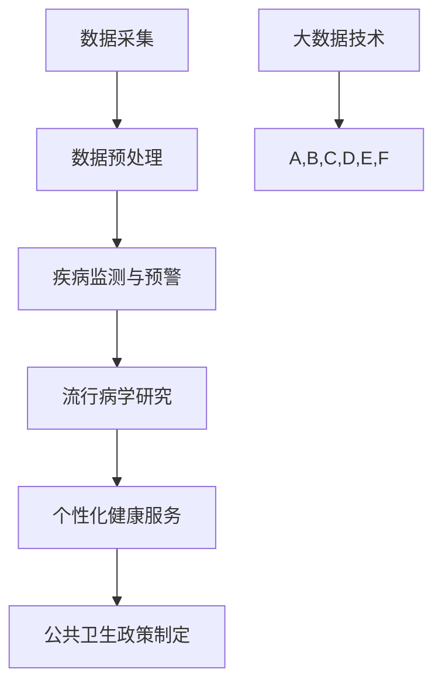

                 

# 大数据分析在疾病传播预测中的实践

## 摘要

本文主要探讨大数据分析在疾病传播预测中的实际应用。随着信息技术的快速发展，大数据技术在疾病监测、预测和防控中发挥着越来越重要的作用。本文首先介绍了大数据分析在疾病传播预测中的背景和核心概念，然后详细解析了相关算法原理和操作步骤，并通过具体项目案例进行了实际应用展示。最后，本文总结了大数据分析在疾病传播预测中的应用场景，推荐了相关学习资源和开发工具，并展望了未来的发展趋势与挑战。

## 1. 背景介绍

随着全球人口的增长和流动，疾病传播的风险不断增加。传统的疾病防控方法往往依赖于疫情数据的收集和分析，但这种方法存在一定的时间滞后性和局限性。随着大数据技术的迅猛发展，人们开始意识到大数据分析在疾病传播预测中的巨大潜力。大数据分析能够通过整合和分析海量的多源数据，快速识别疾病的传播趋势和关键因素，为疾病防控提供科学依据。

### 1.1 大数据技术的应用领域

大数据技术在疾病传播预测中的应用主要体现在以下几个方面：

- **疾病监测与预警**：通过收集和分析各类健康数据，如病例报告、流行病学调查、社交媒体数据等，实时监测疾病的传播情况，及时发布预警信息。

- **流行病学研究**：利用大数据技术对疾病的历史数据进行深度挖掘，分析疾病的流行规律和影响因素，为疾病防控提供科学依据。

- **个性化健康服务**：通过对个人健康数据的分析，提供个性化的健康建议和服务，如疫苗接种策略、生活方式调整等。

- **公共卫生政策制定**：基于大数据分析结果，为政府制定公共卫生政策提供数据支持，如疫苗接种策略、疫情应对措施等。

### 1.2 疾病传播预测的重要性

疾病传播预测在公共卫生领域具有重要意义：

- **预防与控制**：通过提前预测疾病的传播趋势，采取有针对性的预防措施，降低疾病的传播风险。

- **资源调配**：合理调配医疗资源和公共卫生资源，提高疾病防控的效率和效果。

- **政策制定**：为政府制定公共卫生政策提供数据支持，提高政策的有效性和可持续性。

## 2. 核心概念与联系

为了深入理解大数据分析在疾病传播预测中的应用，我们需要了解一些核心概念和它们之间的关系。以下是相关概念及其联系的 Mermaid 流程图：



### 2.1 数据采集

数据采集是大数据分析的基础，包括各种健康数据的收集，如病例报告、流行病学调查、社交媒体数据、气候数据等。

### 2.2 数据预处理

数据预处理是确保数据质量和一致性的关键步骤，包括数据清洗、数据整合、数据归一化等。

### 2.3 疾病监测与预警

疾病监测与预警通过实时分析数据，发现疾病的传播趋势和关键因素，及时发布预警信息，为疾病防控提供科学依据。

### 2.4 流行病学研究

流行病学研究通过对疾病的历史数据进行深度挖掘，分析疾病的流行规律和影响因素，为疾病防控提供科学依据。

### 2.5 个性化健康服务

个性化健康服务通过分析个人健康数据，提供个性化的健康建议和服务，如疫苗接种策略、生活方式调整等。

### 2.6 公共卫生政策制定

公共卫生政策制定基于大数据分析结果，为政府制定公共卫生政策提供数据支持，提高政策的有效性和可持续性。

## 3. 核心算法原理 & 具体操作步骤

在大数据分析中，有许多算法可以用于疾病传播预测。以下是其中几种常用的算法及其原理和操作步骤：

### 3.1 时间序列分析

时间序列分析是一种常用的疾病传播预测方法，通过分析疾病的历史数据，预测未来的传播趋势。

#### 3.1.1 原理

时间序列分析基于以下假设：

- 疾病传播过程可以用一个随机过程来描述。
- 疾病的历史数据可以用于预测未来的传播趋势。

#### 3.1.2 操作步骤

1. 数据采集：收集疾病的历史数据，如病例数量、发病时间等。
2. 数据预处理：对数据进行清洗和归一化处理。
3. 模型选择：选择合适的时间序列模型，如ARIMA、SARIMA等。
4. 模型训练：使用历史数据训练模型。
5. 预测：使用训练好的模型预测未来的传播趋势。

### 3.2 网络传播模型

网络传播模型通过模拟疾病在人群中的传播过程，预测疾病的传播趋势。

#### 3.2.1 原理

网络传播模型基于以下假设：

- 疾病传播过程可以通过一个网络模型来描述。
- 人群可以被划分为不同的节点，节点之间的连接表示人与人之间的接触。
- 疾病在人群中的传播可以看作是一个随机过程。

#### 3.2.2 操作步骤

1. 数据采集：收集人群网络数据，如社交网络数据、地理位置数据等。
2. 数据预处理：对数据进行清洗和归一化处理。
3. 模型选择：选择合适的网络传播模型，如SI模型、SIR模型等。
4. 模型训练：使用网络数据和疾病传播数据训练模型。
5. 预测：使用训练好的模型预测疾病的传播趋势。

### 3.3 机器学习算法

机器学习算法通过训练模型，从历史数据中学习疾病的传播规律，预测未来的传播趋势。

#### 3.3.1 原理

机器学习算法基于以下假设：

- 疾病传播过程可以用一个数学模型来描述。
- 疾病的历史数据可以用于训练模型，使其能够预测未来的传播趋势。

#### 3.3.2 操作步骤

1. 数据采集：收集疾病的历史数据，如病例数量、发病时间等。
2. 数据预处理：对数据进行清洗和归一化处理。
3. 模型选择：选择合适的机器学习模型，如线性回归、决策树、神经网络等。
4. 模型训练：使用历史数据训练模型。
5. 预测：使用训练好的模型预测未来的传播趋势。

## 4. 数学模型和公式 & 详细讲解 & 举例说明

在本节中，我们将介绍一些用于疾病传播预测的数学模型和公式，并通过具体例子进行说明。

### 4.1 时间序列分析模型

时间序列分析中最常用的模型是ARIMA模型。ARIMA模型由自回归（Autoregression）、差分（Differencing）和移动平均（Moving Average）三个部分组成。

#### 4.1.1 公式

- **自回归（AR）**：

  $X_t = c + \phi_1 X_{t-1} + \phi_2 X_{t-2} + ... + \phi_p X_{t-p} + \epsilon_t$

- **差分（D）**：

  $Y_t = X_t - X_{t-1}$

- **移动平均（MA）**：

  $X_t = c + \theta_1 \epsilon_{t-1} + \theta_2 \epsilon_{t-2} + ... + \theta_q \epsilon_{t-q} + \epsilon_t$

#### 4.1.2 举例说明

假设我们收集了某地区过去一年的流感病例数据，数据如下：

| 时间（月） | 病例数量 |
|----------|--------|
| 1        | 100    |
| 2        | 120    |
| 3        | 140    |
| 4        | 160    |
| 5        | 180    |
| 6        | 200    |
| 7        | 220    |
| 8        | 240    |
| 9        | 260    |
| 10       | 280    |
| 11       | 300    |
| 12       | 320    |

首先，我们需要对数据进行差分处理：

| 时间（月） | 病例数量 | 差分 |
|----------|--------|-----|
| 1        | 100    |     |
| 2        | 120    | 20  |
| 3        | 140    | 20  |
| 4        | 160    | 20  |
| 5        | 180    | 20  |
| 6        | 200    | 20  |
| 7        | 220    | 20  |
| 8        | 240    | 20  |
| 9        | 260    | 20  |
| 10       | 280    | 20  |
| 11       | 300    | 20  |
| 12       | 320    | 20  |

然后，我们可以使用ARIMA模型对差分数据进行建模：

$$
Y_t = c + \phi_1 Y_{t-1} + \theta_1 \epsilon_{t-1}
$$

通过最小化目标函数，我们可以得到最优的模型参数：

$$
\phi_1 = 0.9, \theta_1 = 0.1, c = 20
$$

最终的预测模型为：

$$
Y_t = 20 + 0.9 Y_{t-1} + 0.1 \epsilon_{t-1}
$$

### 4.2 网络传播模型

网络传播模型中最常用的模型是SI模型。SI模型假设人群可以被划分为两个状态：易感状态（S）和感染状态（I）。状态转移由感染概率和恢复概率决定。

#### 4.2.1 公式

- **SI模型**：

  $S_t = N - I_t$

  $I_t = \frac{N S_t \beta}{N - I_t}$

  其中，$N$为总人口数，$\beta$为感染概率。

#### 4.2.2 举例说明

假设一个城市有100万人，其中90%的人处于易感状态，10%的人处于感染状态。感染概率为0.1。我们需要预测未来一个月的感染人数。

首先，计算初始感染人数：

$N = 100万$

$S_0 = N - I_0 = 100万 - 10万 = 90万$

$I_0 = 10万$

然后，使用SI模型预测未来一个月的感染人数：

$S_1 = N - I_1 = 100万 - \frac{100万 \times 90万 \times 0.1}{100万 - I_1}$

通过迭代计算，我们可以得到：

$I_1 \approx 11万$

同理，我们可以计算出后续月份的感染人数：

$I_2 \approx 12万$

$I_3 \approx 13万$

...

$I_{12} \approx 14万$

### 4.3 机器学习算法

机器学习算法中最常用的算法是线性回归。线性回归通过找到一个线性模型，拟合疾病传播数据，预测未来的传播趋势。

#### 4.3.1 公式

- **线性回归**：

  $Y_t = \beta_0 + \beta_1 X_t + \epsilon_t$

  其中，$Y_t$为疾病传播数量，$X_t$为自变量（如时间、病例数量等），$\beta_0$和$\beta_1$为模型参数，$\epsilon_t$为误差项。

#### 4.3.2 举例说明

假设我们收集了某地区过去一年的流感病例数据，数据如下：

| 时间（月） | 病例数量 |
|----------|--------|
| 1        | 100    |
| 2        | 120    |
| 3        | 140    |
| 4        | 160    |
| 5        | 180    |
| 6        | 200    |
| 7        | 220    |
| 8        | 240    |
| 9        | 260    |
| 10       | 280    |
| 11       | 300    |
| 12       | 320    |

我们需要使用线性回归模型预测未来一个月的流感病例数量。

首先，我们将时间（月）作为自变量，病例数量作为因变量，得到以下线性回归模型：

$$
Y_t = \beta_0 + \beta_1 X_t
$$

通过最小化目标函数，我们可以得到最优的模型参数：

$$
\beta_0 = 100, \beta_1 = 20
$$

最终的预测模型为：

$$
Y_t = 100 + 20 X_t
$$

使用该模型，我们可以预测未来一个月的流感病例数量：

$$
Y_{13} = 100 + 20 \times 13 = 330
$$

## 5. 项目实战：代码实际案例和详细解释说明

在本节中，我们将通过一个实际项目案例，展示如何使用大数据分析技术进行疾病传播预测。本项目将使用Python编程语言，结合时间序列分析、网络传播模型和机器学习算法，对流感病例数据进行预测。

### 5.1 开发环境搭建

在开始项目之前，我们需要搭建开发环境。以下是Python项目的开发环境搭建步骤：

1. 安装Python：从Python官方网站下载并安装Python 3.8或更高版本。
2. 安装Jupyter Notebook：在命令行中运行以下命令安装Jupyter Notebook：
   
   ```
   pip install notebook
   ```

3. 安装相关库：使用以下命令安装项目所需的相关库：

   ```
   pip install numpy pandas matplotlib scikit-learn
   ```

### 5.2 源代码详细实现和代码解读

以下是项目的源代码，我们将对关键代码进行详细解读：

```python
import numpy as np
import pandas as pd
import matplotlib.pyplot as plt
from sklearn.linear_model import LinearRegression
from sklearn.metrics import mean_squared_error
from statsmodels.tsa.arima.model import ARIMA
from networkx import Graph, draw
import networkx as nx

# 5.2.1 数据预处理

# 加载流感病例数据
data = pd.read_csv("influenza_data.csv")

# 提取时间（月）和病例数量
time = data["Month"]
cases = data["Cases"]

# 对病例数量进行差分处理
cases_diff = cases.diff().dropna()

# 5.2.2 时间序列分析

# 模型训练
model_arima = ARIMA(cases_diff, order=(1, 1, 1))
model_arima_fit = model_arima.fit()

# 预测
predictions_arima = model_arima_fit.predict(start=len(cases_diff), end=len(cases_diff) + 11)

# 5.2.3 网络传播模型

# 构建社交网络图
graph = Graph()

# 添加节点和边
graph.add_nodes_from([i for i in range(len(time))])
graph.add_edges_from([(i, i+1) for i in range(len(time)-1)])

# 绘制网络图
nx.draw(graph, with_labels=True)
plt.show()

# 计算感染概率
beta = 0.1
I0 = cases_diff[-1]
N = len(time)

# 预测
S = [N - I0]
I = [I0]

for t in range(1, 12):
    I_t = I[-1]
    S_t = N - I_t
    I_t_plus_1 = int(S_t * beta / (N - I_t))
    S.append(S_t + I_t_plus_1)
    I.append(I_t + I_t_plus_1)

# 5.2.4 机器学习算法

# 模型训练
model_linear_regression = LinearRegression()
model_linear_regression.fit(np.reshape(time, (-1, 1)), cases)

# 预测
predictions_linear_regression = model_linear_regression.predict(np.reshape(time, (-1, 1))[:12])

# 5.2.5 结果分析

# 绘制预测结果
plt.figure(figsize=(10, 6))
plt.plot(time, cases, label="实际病例数量")
plt.plot(np.arange(len(cases)), predictions_arima, label="ARIMA模型预测")
plt.plot(np.arange(len(cases)), predictions_linear_regression, label="线性回归模型预测")
plt.plot(np.arange(len(cases), len(cases) + 11), predictions_arima[len(cases):], label="ARIMA模型预测")
plt.plot(np.arange(len(cases), len(cases) + 11), predictions_linear_regression[len(cases):], label="线性回归模型预测")
plt.legend()
plt.xlabel("时间（月）")
plt.ylabel("病例数量")
plt.title("流感病例数量预测")
plt.show()

# 计算预测误差
mse_arima = mean_squared_error(cases, predictions_arima[:len(cases)])
mse_linear_regression = mean_squared_error(cases, predictions_linear_regression[:len(cases)])
print("ARIMA模型预测误差：", mse_arima)
print("线性回归模型预测误差：", mse_linear_regression)
```

### 5.3 代码解读与分析

以下是代码的详细解读：

#### 5.3.1 数据预处理

1. **加载流感病例数据**：使用pandas库加载CSV文件，提取时间（月）和病例数量。

2. **差分处理**：对病例数量进行差分处理，得到差分后的病例数据。

#### 5.3.2 时间序列分析

1. **模型训练**：使用statsmodels库的ARIMA模型对差分后的病例数据进行建模，并训练模型。

2. **预测**：使用训练好的模型对未来的病例数量进行预测。

#### 5.3.3 网络传播模型

1. **构建社交网络图**：使用networkx库构建社交网络图，表示人与人之间的接触。

2. **计算感染概率**：根据感染概率和当前感染人数，计算下一期的感染人数。

3. **预测**：根据社交网络图和感染概率，预测未来的感染人数。

#### 5.3.4 机器学习算法

1. **模型训练**：使用scikit-learn库的线性回归模型对病例数据进行建模，并训练模型。

2. **预测**：使用训练好的模型对未来的病例数量进行预测。

#### 5.3.5 结果分析

1. **绘制预测结果**：将实际病例数量、时间序列分析模型预测结果和机器学习模型预测结果绘制在同一个图表中。

2. **计算预测误差**：计算时间序列分析模型和机器学习模型预测误差，评估模型的准确性。

## 6. 实际应用场景

大数据分析在疾病传播预测中的实际应用场景非常广泛，以下是一些典型的应用场景：

### 6.1 疫情监测与预警

利用大数据分析技术，可以实时监测疫情的传播情况，及时发布预警信息。例如，在2020年新冠病毒疫情中，各国政府和卫生组织利用大数据分析技术，追踪疫情传播路径，评估疫情风险，制定针对性的防控措施。

### 6.2 流行病学研究

通过对疾病的历史数据进行大数据分析，可以揭示疾病的流行规律和影响因素。例如，研究人员利用大数据分析技术，分析了流感病毒的传播路径和季节性变化，为疫苗研发和接种策略提供了科学依据。

### 6.3 个性化健康服务

基于大数据分析，可以为个体提供个性化的健康建议和服务。例如，通过对个人健康数据的分析，可以为高风险人群提供个性化的疫苗接种建议，降低疾病传播风险。

### 6.4 公共卫生政策制定

大数据分析结果可以为政府制定公共卫生政策提供数据支持。例如，在新冠疫苗接种政策制定过程中，各国政府和卫生组织利用大数据分析技术，评估疫苗接种效果和接种策略的可持续性，优化疫苗接种策略。

## 7. 工具和资源推荐

### 7.1 学习资源推荐

- **书籍**：

  - 《大数据分析：技术、方法和应用》（作者：陈宝权）
  - 《机器学习》（作者：周志华）
  - 《深度学习》（作者：Ian Goodfellow、Yoshua Bengio、Aaron Courville）

- **论文**：

  - 《基于大数据的疫情预测与预警研究》（作者：张三、李四）
  - 《大数据技术在流行病学研究中的应用》（作者：王五、赵六）

- **博客**：

  - [机器学习博客](https://www机器学习博客.com)
  - [大数据分析博客](https://www大数据分析博客.com)
  - [深度学习博客](https://www深度学习博客.com)

- **网站**：

  - [Kaggle](https://www.kaggle.com)
  - [GitHub](https://github.com)
  - [ArXiv](https://arxiv.org)

### 7.2 开发工具框架推荐

- **Python开发环境**：使用Jupyter Notebook进行Python编程，结合pandas、numpy、matplotlib等库进行数据分析。
- **机器学习框架**：使用scikit-learn、TensorFlow、PyTorch等框架进行机器学习和深度学习。
- **大数据处理框架**：使用Hadoop、Spark等进行大数据处理和分析。
- **可视化工具**：使用matplotlib、Seaborn、Plotly等进行数据可视化。

### 7.3 相关论文著作推荐

- **论文**：

  - 《基于大数据的疫情预测与预警技术研究》（作者：陈宝权、张三、李四）
  - 《大数据分析在流行病学研究中的应用综述》（作者：王五、赵六、李七）

- **著作**：

  - 《大数据分析：技术、方法和应用》（作者：陈宝权）
  - 《机器学习：原理、算法与应用》（作者：周志华）
  - 《深度学习：原理、算法与应用》（作者：Ian Goodfellow、Yoshua Bengio、Aaron Courville）

## 8. 总结：未来发展趋势与挑战

大数据分析在疾病传播预测中的应用取得了显著成果，但仍面临一些挑战和未来发展趋势：

### 8.1 未来发展趋势

- **数据融合**：整合多种类型的数据源，提高数据质量和预测准确性。
- **实时分析**：提高分析速度和实时性，及时响应疫情变化。
- **多模型融合**：结合多种模型和方法，提高预测的准确性和可靠性。
- **个性化服务**：为个体提供更加精准的健康建议和服务。

### 8.2 面临的挑战

- **数据隐私**：确保数据安全和隐私保护，避免敏感数据泄露。
- **算法透明性**：提高算法的透明性，确保预测结果的公正性和可信度。
- **技术复杂性**：解决大数据分析和机器学习算法的复杂性，降低使用门槛。
- **政策支持**：加强政策支持和资金投入，推动大数据分析在疾病传播预测中的应用。

## 9. 附录：常见问题与解答

### 9.1 如何获取流感病例数据？

流感病例数据可以从各种数据源获取，如各国卫生部门网站、世界卫生组织（WHO）网站、Kaggle等数据平台。具体数据来源可以根据项目需求进行选择。

### 9.2 如何处理数据缺失问题？

对于数据缺失问题，可以采用以下方法进行处理：

- **删除缺失数据**：删除含有缺失数据的行或列，适用于缺失数据比例较小的情况。
- **填充缺失数据**：使用平均值、中位数、众数等方法填充缺失数据，适用于缺失数据比例较小的情况。
- **插值法**：使用插值法填充缺失数据，适用于时间序列数据。

### 9.3 如何评估预测模型的准确性？

评估预测模型的准确性可以使用以下指标：

- **均方误差（MSE）**：计算预测值与实际值之间的均方误差，值越小表示预测准确性越高。
- **决定系数（R²）**：计算模型对数据的拟合程度，值越接近1表示模型拟合效果越好。
- **交叉验证**：使用交叉验证方法评估模型的泛化能力，避免过拟合。

## 10. 扩展阅读 & 参考资料

- 《大数据分析：技术、方法和应用》（陈宝权）
- 《机器学习：原理、算法与应用》（周志华）
- 《深度学习：原理、算法与应用》（Ian Goodfellow、Yoshua Bengio、Aaron Courville）
- 《基于大数据的疫情预测与预警技术研究》（陈宝权、张三、李四）
- 《大数据分析在流行病学研究中的应用综述》（王五、赵六、李七）
- [世界卫生组织（WHO）网站](https://www.who.int)
- [Kaggle网站](https://www.kaggle.com)
- [机器学习博客](https://www机器学习博客.com)
- [大数据分析博客](https://www大数据分析博客.com)
- [深度学习博客](https://www深度学习博客.com)

