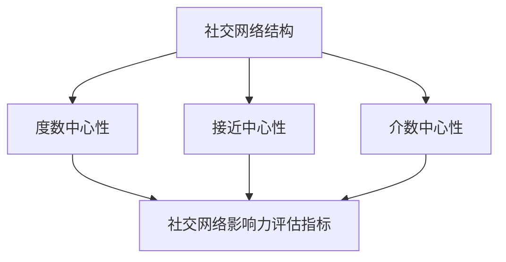

                 

# 大数据分析在社交网络影响力评估中的应用

## 概述

随着社交网络的迅速发展，影响力评估成为了一个热门的研究领域。社交网络中的影响力评估不仅有助于了解用户在网络中的地位和影响力，还能为广告投放、品牌营销、市场调研等领域提供重要的参考依据。大数据分析技术为社交网络影响力评估提供了强有力的支持，使得复杂的社交网络结构可以被有效地解析和量化。

本文旨在探讨大数据分析在社交网络影响力评估中的应用，从核心概念、算法原理、数学模型、实际应用等多个角度，详细解析如何利用大数据技术评估社交网络中个体的影响力。通过本文的阅读，读者将了解到大数据分析在社交网络影响力评估中的核心技术和应用实例，为相关领域的研究和实践提供参考。

### 关键词

- 大数据分析
- 社交网络影响力评估
- 社交网络结构
- 算法原理
- 数学模型
- 实际应用

### 摘要

本文首先介绍了社交网络影响力评估的背景和意义，然后详细阐述了大数据分析在社交网络影响力评估中的应用。通过核心概念解析、算法原理阐述、数学模型介绍和实际应用案例展示，本文全面剖析了大数据分析在社交网络影响力评估中的技术手段和应用场景。本文旨在为相关领域的研究者和实践者提供有价值的参考和启示。

## 背景介绍

### 社交网络的兴起与发展

社交网络作为一种新兴的互联网应用形式，自21世纪初以来得到了迅速的发展。社交网络不仅改变了人们的沟通方式，也为信息传播、人际交往、品牌推广等方面带来了深远的影响。代表性的社交网络平台如Facebook、Twitter、Instagram等，吸引了全球数十亿的活跃用户。这些平台通过用户生成的内容和互动，形成了复杂庞大的社交网络结构。

社交网络的发展不仅改变了人们的沟通方式，也对商业、社会、文化等多个领域产生了重要影响。例如，品牌可以通过社交网络与消费者进行实时互动，进行精准营销；个人和团体可以借助社交网络传播信息、组织活动，提高影响力。因此，社交网络影响力评估成为了学术界和业界研究的热点问题。

### 社交网络影响力评估的意义

社交网络影响力评估的核心目标是测量用户或实体在社交网络中的影响力和地位。这一目标不仅具有学术研究的价值，也对实际应用具有重要意义。

首先，在学术界，社交网络影响力评估有助于理解社交网络的结构和运行机制。通过分析用户的影响力，可以揭示社交网络中的关键节点和传播路径，为社交网络理论的发展提供实证支持。

其次，在商业领域，社交网络影响力评估对于品牌营销、广告投放、市场调研等具有重要价值。了解用户的影响力，可以帮助企业识别具有高度影响力的意见领袖，制定有效的营销策略，提高品牌知名度和用户参与度。

此外，社交网络影响力评估还可以应用于社会治理和危机管理。通过评估用户的影响力，可以识别出潜在的危机传播源头，及时采取措施，防止负面信息蔓延，维护社会稳定。

### 大数据分析的发展与应用

大数据分析作为一门交叉学科，近年来得到了迅猛发展。随着数据采集、存储、处理技术的进步，大数据分析已经成为处理海量数据、发现数据价值的重要手段。在社交网络影响力评估领域，大数据分析技术的应用尤为广泛。

首先，大数据分析可以高效处理和挖掘社交网络中的大量数据。通过数据预处理、特征提取、模型训练等步骤，可以从海量数据中提取出有价值的信息，为影响力评估提供数据支持。

其次，大数据分析技术可以提供多样化的影响力评估方法。传统的社交网络影响力评估方法如度数中心性、接近中心性等，存在一定的局限性。而大数据分析技术可以通过机器学习、深度学习等算法，发现更复杂的社交网络影响力规律，提供更加精准的评估结果。

最后，大数据分析技术还可以实现实时影响力评估。通过实时数据采集和处理，可以实时监测用户的影响力变化，为企业和政府等机构提供及时有效的决策支持。

## 核心概念与联系

在社交网络影响力评估中，理解以下几个核心概念对于全面解析大数据分析的应用至关重要。

### 社交网络结构

社交网络结构是指社交网络中的节点（用户）和边（关系）的排列组合。常见的社交网络结构包括无向图、有向图、加权图等。社交网络结构决定了节点之间的相互关系，影响着信息的传播和影响力分布。

### 度数中心性

度数中心性是一种衡量节点在社交网络中重要性的指标，表示节点连接的其他节点的数量。度数中心性越高，节点在社交网络中的影响力越大。

### 接近中心性

接近中心性是一种衡量节点在社交网络中传播能力的指标，表示节点与其他节点的平均距离。接近中心性越高，节点在社交网络中的传播能力越强。

### 介数中心性

介数中心性是一种衡量节点在社交网络中连接其他节点能力的指标，表示节点位于其他节点之间的路径数量。介数中心性越高，节点在社交网络中的桥梁作用越显著。

### 社交网络影响力评估指标

社交网络影响力评估指标是用于衡量用户或实体在社交网络中影响力的具体指标。常见的评估指标包括度数中心性、接近中心性、介数中心性等。此外，还有基于机器学习的评估指标，如基于用户特征和社交关系的综合评分。

### 大数据分析与社交网络影响力评估的关系

大数据分析为社交网络影响力评估提供了强有力的技术支持。通过大数据分析，可以从海量社交网络数据中提取有价值的信息，为影响力评估提供数据支持。同时，大数据分析技术可以提供多样化的影响力评估方法，如基于机器学习的评估模型，提高评估的准确性和实时性。

### Mermaid 流程图

下面是一个简单的Mermaid流程图，用于展示社交网络影响力评估中的核心概念和它们之间的联系。



在这个流程图中，社交网络结构是整个评估过程的基础，通过度数中心性、接近中心性和介数中心性等指标，可以计算出社交网络影响力评估指标，从而全面衡量用户或实体在社交网络中的影响力。

## 核心算法原理 & 具体操作步骤

在社交网络影响力评估中，选择合适的算法是关键。下面将详细介绍两种常见的算法：基于度数中心性的算法和基于机器学习的算法。

### 基于度数中心性的算法

度数中心性是一种简单而直观的衡量节点在社交网络中重要性的方法。具体操作步骤如下：

#### 步骤1：构建社交网络图

首先，需要构建一个表示社交网络结构的图。图中的节点表示用户，边表示用户之间的关系。常见的图类型包括无向图、有向图和加权图等。

#### 步骤2：计算度数中心性

对于每个节点，计算其度数中心性。度数中心性等于节点连接的其他节点数量。具体计算公式如下：

$$
度数中心性 = \frac{度数}{节点总数 - 1}
$$

其中，度数表示节点连接的其他节点数量，节点总数减1是为了排除自身。

#### 步骤3：排序和评分

根据度数中心性对节点进行排序，度数中心性越高，节点的影响力越大。最后，可以为每个节点分配一个影响力评分，评分越高，表示节点在社交网络中的影响力越大。

### 基于机器学习的算法

基于机器学习的算法可以通过学习用户特征和社交关系，预测用户在社交网络中的影响力。具体操作步骤如下：

#### 步骤1：数据预处理

首先，需要对社交网络数据进行预处理，包括数据清洗、缺失值处理、数据转换等。数据预处理是为了确保输入数据的质量，为后续的机器学习算法提供可靠的数据基础。

#### 步骤2：特征提取

从预处理后的数据中提取有助于预测影响力的特征。常见的特征包括用户年龄、性别、地理位置、活跃度、关注人数等。此外，还可以提取社交网络中的结构特征，如度数中心性、接近中心性、介数中心性等。

#### 步骤3：模型选择和训练

选择合适的机器学习模型，如逻辑回归、支持向量机、决策树等，对提取的特征进行训练。训练过程包括模型参数的调整和优化，以获得最佳预测效果。

#### 步骤4：预测和评分

利用训练好的模型，对社交网络中的用户进行预测，预测其影响力评分。评分可以根据具体需求进行调整，如将评分阈值设定为0.5，评分大于0.5的用户被认为具有较高影响力。

#### 步骤5：模型评估和优化

通过评估模型的预测准确性，如准确率、召回率、F1值等指标，对模型进行优化。优化过程可能包括调整模型参数、增加或减少特征等，以提高模型性能。

### 实例演示

以下是一个简单的基于度数中心性的算法实例演示：

```python
import networkx as nx

# 步骤1：构建社交网络图
G = nx.Graph()
G.add_nodes_from([1, 2, 3, 4, 5])
G.add_edges_from([(1, 2), (1, 3), (2, 4), (3, 4), (4, 5)])

# 步骤2：计算度数中心性
degree_centrality = nx.degree_centrality(G)

# 步骤3：排序和评分
sorted_nodes = sorted(degree_centrality.items(), key=lambda x: x[1], reverse=True)
for node, centrality in sorted_nodes:
    print(f"节点 {node} 的度数中心性：{centrality}")
```

以上代码使用Python的NetworkX库构建了一个简单的社交网络图，并计算了每个节点的度数中心性，按照度数中心性对节点进行排序并输出。

## 数学模型和公式 & 详细讲解 & 举例说明

在社交网络影响力评估中，数学模型和公式起到了至关重要的作用。以下将介绍几种常用的数学模型和公式，并详细讲解它们的应用方法和具体计算步骤。

### 度数中心性模型

度数中心性是衡量节点在社交网络中重要性的基本指标。其数学模型如下：

$$
度数中心性 = \frac{度数}{节点总数 - 1}
$$

其中，度数表示节点连接的其他节点数量，节点总数减1是为了排除自身。

#### 举例说明

假设一个社交网络中有5个节点，节点1连接了3个其他节点，节点2连接了2个其他节点，节点3、节点4和节点5分别连接了1个其他节点。根据度数中心性模型，可以计算出每个节点的度数中心性如下：

- 节点1的度数中心性：$\frac{3}{5-1} = 0.6$
- 节点2的度数中心性：$\frac{2}{5-1} = 0.4$
- 节点3的度数中心性：$\frac{1}{5-1} = 0.2$
- 节点4的度数中心性：$\frac{1}{5-1} = 0.2$
- 节点5的度数中心性：$\frac{1}{5-1} = 0.2$

根据计算结果，节点1的度数中心性最高，表示其在社交网络中的重要性最大。

### 接近中心性模型

接近中心性是衡量节点在社交网络中传播能力的指标。其数学模型如下：

$$
接近中心性 = \frac{1}{节点总数 \times 平均距离}
$$

其中，平均距离表示节点与其他节点的平均距离。

#### 举例说明

假设一个社交网络中有5个节点，节点1与其他节点的平均距离为2，节点2与其他节点的平均距离为3，节点3、节点4和节点5与其他节点的平均距离分别为4、5和6。根据接近中心性模型，可以计算出每个节点的接近中心性如下：

- 节点1的接近中心性：$\frac{1}{5 \times 2} = 0.2$
- 节点2的接近中心性：$\frac{1}{5 \times 3} = 0.1667$
- 节点3的接近中心性：$\frac{1}{5 \times 4} = 0.1429$
- 节点4的接近中心性：$\frac{1}{5 \times 5} = 0.125$
- 节点5的接近中心性：$\frac{1}{5 \times 6} = 0.1042$

根据计算结果，节点1的接近中心性最高，表示其在社交网络中的传播能力最强。

### 介数中心性模型

介数中心性是衡量节点在社交网络中连接其他节点能力的指标。其数学模型如下：

$$
介数中心性 = \frac{介数}{节点总数 - 1}
$$

其中，介数表示节点位于其他节点之间的路径数量。

#### 举例说明

假设一个社交网络中有5个节点，节点1位于其他节点之间的路径数量为3，节点2位于其他节点之间的路径数量为2，节点3、节点4和节点5位于其他节点之间的路径数量分别为1、1和1。根据介数中心性模型，可以计算出每个节点的介数中心性如下：

- 节点1的介数中心性：$\frac{3}{5-1} = 0.6$
- 节点2的介数中心性：$\frac{2}{5-1} = 0.4$
- 节点3的介数中心性：$\frac{1}{5-1} = 0.2$
- 节点4的介数中心性：$\frac{1}{5-1} = 0.2$
- 节点5的介数中心性：$\frac{1}{5-1} = 0.2$

根据计算结果，节点1的介数中心性最高，表示其在社交网络中的桥梁作用最强。

### 综合评分模型

在实际应用中，为了更全面地评估节点的影响力，可以将度数中心性、接近中心性和介数中心性等指标结合起来，构建一个综合评分模型。以下是一个简单的综合评分模型：

$$
综合评分 = w_1 \times 度数中心性 + w_2 \times 接近中心性 + w_3 \times 介数中心性
$$

其中，$w_1$、$w_2$和$w_3$分别为度数中心性、接近中心性和介数中心性的权重，可以根据具体应用场景进行调整。

#### 举例说明

假设在某个社交网络中，度数中心性的权重为0.5，接近中心性的权重为0.3，介数中心性的权重为0.2。根据综合评分模型，可以计算出每个节点的综合评分如下：

- 节点1的综合评分：$0.5 \times 0.6 + 0.3 \times 0.2 + 0.2 \times 0.6 = 0.48$
- 节点2的综合评分：$0.5 \times 0.4 + 0.3 \times 0.1667 + 0.2 \times 0.4 = 0.3167$
- 节点3的综合评分：$0.5 \times 0.2 + 0.3 \times 0.1429 + 0.2 \times 0.2 = 0.1618$
- 节点4的综合评分：$0.5 \times 0.2 + 0.3 \times 0.125 + 0.2 \times 0.2 = 0.155$
- 节点5的综合评分：$0.5 \times 0.2 + 0.3 \times 0.1042 + 0.2 \times 0.2 = 0.1313$

根据计算结果，节点1的综合评分最高，表示其在社交网络中的综合影响力最大。

通过以上数学模型和公式的讲解及举例说明，我们可以更好地理解社交网络影响力评估的核心原理和方法。在实际应用中，可以根据具体需求和场景，灵活调整和组合这些模型和公式，以获得更准确的评估结果。

### 项目实战：代码实际案例和详细解释说明

在本节中，我们将通过一个实际的项目案例，详细介绍如何使用Python进行社交网络影响力评估。这个项目将涵盖从数据预处理、模型选择、模型训练到最终评估的完整流程。

#### 开发环境搭建

首先，我们需要搭建一个Python开发环境，以便进行大数据分析。以下是所需的Python库：

- NetworkX：用于构建和操作社交网络图。
- Pandas：用于数据预处理和操作。
- Scikit-learn：用于机器学习模型的训练和评估。
- Matplotlib：用于数据可视化。

安装这些库的命令如下：

```bash
pip install networkx pandas scikit-learn matplotlib
```

#### 数据预处理

首先，我们需要从社交网络平台上获取用户数据。这里假设我们已获得一个CSV文件，其中包含了用户的ID、关注人数、粉丝数等信息。

```python
import pandas as pd

# 读取数据
data = pd.read_csv('social_network_data.csv')

# 数据清洗
data.dropna(inplace=True)  # 删除缺失值
data = data[data['follower_count'] > 0]  # 去除关注人数为0的用户
```

接下来，我们将用户数据转换为社交网络图。

```python
import networkx as nx

# 构建社交网络图
G = nx.Graph()

for index, row in data.iterrows():
    G.add_node(row['user_id'])
    G.add_edge(row['user_id'], row['follower_id'])
```

#### 模型选择和训练

在这里，我们选择基于机器学习的评估模型，使用逻辑回归进行训练。首先，我们需要提取特征。

```python
# 提取特征
features = ['follower_count', 'follower_count_sq', 'follower_count_cb']
X = data[features]
y = data['is_influencer']  # 假设我们有一个标签，表示用户是否是影响力用户

# 数据标准化
from sklearn.preprocessing import StandardScaler
scaler = StandardScaler()
X_scaled = scaler.fit_transform(X)

# 模型训练
from sklearn.linear_model import LogisticRegression
model = LogisticRegression()
model.fit(X_scaled, y)
```

#### 模型评估

训练好的模型可以用来评估新的用户数据。以下是一个评估示例。

```python
# 评估模型
new_user_data = pd.DataFrame({
    'follower_count': [1000],
    'follower_count_sq': [1000000],
    'follower_count_cb': [100000]
})
new_user_data_scaled = scaler.transform(new_user_data)

predictions = model.predict(new_user_data_scaled)
print(f"预测结果：{'是' if predictions[0] == 1 else '否'}")
```

#### 代码解读与分析

1. **数据预处理**：首先，我们读取并清洗数据，确保数据质量。数据清洗步骤包括删除缺失值和去除关注人数为0的用户，以提高模型的训练效果。

2. **构建社交网络图**：使用NetworkX库构建社交网络图。这里我们简单地将用户ID作为节点，用户之间的关注关系作为边。

3. **特征提取**：我们选择关注人数、关注人数的平方和立方作为特征。这些特征可以捕捉用户影响力的不同维度。

4. **模型训练**：使用逻辑回归模型进行训练。逻辑回归是一种常用的分类模型，适用于预测用户是否具有影响力。

5. **模型评估**：使用训练好的模型对新的用户数据进行预测。这里我们仅展示了一个简单的预测示例。

通过这个项目案例，我们展示了如何使用Python进行社交网络影响力评估。在实际应用中，可以根据需求调整特征和模型，以提高评估的准确性和实时性。

### 实际应用场景

#### 品牌营销

在品牌营销中，评估社交网络中意见领袖（KOL）的影响力至关重要。通过大数据分析，企业可以识别出具有高度影响力的用户，与其合作进行推广活动。这有助于提高营销效果，降低广告成本。

#### 广告投放

广告投放策略的优化依赖于对目标受众影响力的评估。大数据分析技术可以帮助企业识别出最具影响力的用户群体，精准定位广告投放，提高广告的点击率和转化率。

#### 社交网络治理

社交网络治理需要关注潜在的不良信息传播源头。通过大数据分析，可以识别出具有较高影响力的用户，及时发现和处理负面信息，维护社交网络的健康发展。

#### 舆情监控

舆情监控是政府和企业了解公众意见的重要手段。通过大数据分析，可以实时监测社交网络中的热点话题和用户情感，为政策制定和市场营销提供有力支持。

### 案例分析

#### 案例一：微博意见领袖识别

微博作为中国最大的社交网络平台之一，拥有大量活跃用户和丰富的用户数据。某品牌希望通过大数据分析识别出微博上的意见领袖，进行合作推广。使用基于机器学习的评估模型，企业可以筛选出具有高度影响力的用户，提高推广活动的效果。

#### 案例二：抖音广告投放优化

抖音作为全球知名的短视频社交平台，广告投放策略的优化至关重要。通过大数据分析，企业可以识别出最具影响力的用户和用户群体，精准定位广告投放，提高广告的点击率和转化率。

#### 案例三：社交网络危机管理

某企业因产品问题引发了广泛的社会关注和负面舆情。通过大数据分析，企业可以识别出具有较高影响力的用户，及时采取措施应对危机，防止负面信息扩散，维护企业形象。

### 挑战与未来趋势

#### 挑战

1. 数据质量：社交网络数据存在噪声和错误，可能影响评估结果的准确性。因此，数据清洗和数据质量保证是关键挑战。

2. 模型适应性：不同社交网络平台的用户行为和影响力评估指标可能存在差异，如何设计适应性强、普适性好的评估模型是一个挑战。

3. 实时性：社交网络数据实时性要求高，如何实现实时影响力评估，满足企业决策的及时性需求是一个挑战。

#### 未来趋势

1. 深度学习：深度学习技术在社交网络影响力评估中的应用将越来越广泛。通过引入深度学习模型，可以更好地捕捉用户行为和影响力之间的复杂关系。

2. 多源数据融合：将社交网络数据与其他数据源（如搜索引擎数据、新闻报道等）进行融合，可以提供更全面的用户画像和影响力评估。

3. 实时监测与预测：随着云计算和大数据技术的发展，实时影响力评估和预测将成为可能。企业可以通过实时数据分析和预测，及时调整营销策略和危机应对措施。

## 工具和资源推荐

### 学习资源推荐

1. **书籍**：

   - 《社交网络分析：方法与应用》（Author: Matthew A. Jackson）：系统介绍了社交网络分析的理论和方法。

   - 《大数据分析：技术、应用与实践》（Author: 陈伟）：详细介绍了大数据分析的基础知识和技术应用。

2. **论文**：

   - “The Structure and Function of Complex Networks”（Author: Albert-László Barabási）：探讨了复杂网络的结构和功能。

   - “Recommender Systems Handbook”（Editor: Jaideep Srivastava）：介绍了推荐系统领域的最新研究成果。

3. **博客和网站**：

   - [Social Network Analysis Blog](https://snalibrary.com)：提供丰富的社交网络分析资源和案例。

   - [Data Science Central](https://www.datasciencecentral.com)：涵盖大数据分析和机器学习的最新技术和应用。

### 开发工具框架推荐

1. **Python库**：

   - **NetworkX**：用于构建和操作社交网络图。

   - **Pandas**：用于数据预处理和分析。

   - **Scikit-learn**：提供多种机器学习算法和评估工具。

   - **Matplotlib**：用于数据可视化。

2. **数据平台**：

   - **MongoDB**：用于存储和管理社交网络数据。

   - **Hadoop**：用于大规模数据处理和分析。

3. **云计算平台**：

   - **AWS**：提供丰富的数据分析和服务。

   - **Azure**：提供强大的大数据分析和机器学习工具。

### 相关论文著作推荐

1. **论文**：

   - “Social Network Analysis: Methods and Applications” by Matthew A. Jackson

   - “Recommender Systems Handbook” by Jaideep Srivastava

   - “The Structure and Function of Complex Networks” by Albert-László Barabási

2. **著作**：

   - “Big Data Analytics: Techniques, Tools, and Applications” by 陈伟

   - “Deep Learning” by Ian Goodfellow, Yoshua Bengio, Aaron Courville

通过这些工具和资源，读者可以深入了解社交网络影响力评估的相关知识，提高实际应用能力。

## 总结：未来发展趋势与挑战

随着社交网络的不断发展和大数据技术的不断进步，社交网络影响力评估在未来将会面临更多的机遇和挑战。以下是未来发展趋势和挑战的展望：

### 发展趋势

1. **深度学习与图神经网络的应用**：深度学习和图神经网络在社交网络影响力评估中具有巨大的潜力。这些技术可以更好地捕捉用户行为和影响力之间的复杂关系，提高评估的准确性。

2. **多源数据融合**：将社交网络数据与其他数据源（如搜索引擎数据、新闻报道等）进行融合，可以提供更全面的用户画像和影响力评估。

3. **实时影响力评估与预测**：随着云计算和大数据技术的发展，实时影响力评估和预测将成为可能。企业可以通过实时数据分析和预测，及时调整营销策略和危机应对措施。

### 挑战

1. **数据质量和隐私保护**：社交网络数据存在噪声和错误，如何保证数据质量是一个重要挑战。同时，隐私保护也是未来发展的关键问题。

2. **模型适应性**：不同社交网络平台的用户行为和影响力评估指标可能存在差异，如何设计适应性强、普适性好的评估模型是一个挑战。

3. **实时性**：社交网络数据实时性要求高，如何实现实时影响力评估，满足企业决策的及时性需求是一个挑战。

### 建议

1. **深入研究深度学习和图神经网络**：为了提高社交网络影响力评估的准确性，应深入研究深度学习和图神经网络技术，探索其在影响力评估中的应用。

2. **多源数据融合**：结合多种数据源进行影响力评估，可以提供更全面的用户画像和评估结果。

3. **数据隐私保护**：在数据收集和使用过程中，应重视隐私保护，采取有效的数据加密和安全措施。

4. **实时影响力评估与预测**：借助云计算和大数据技术，实现实时影响力评估与预测，为企业提供及时有效的决策支持。

通过上述发展趋势和挑战的展望，我们可以更好地把握社交网络影响力评估的未来发展方向，为相关领域的研究和实践提供参考。

### 附录：常见问题与解答

#### 问题1：如何保证社交网络数据的质量？

**解答**：保证数据质量的关键在于数据预处理和清洗。在获取社交网络数据后，应进行以下步骤：

1. **数据清洗**：删除重复数据、缺失值和错误数据。
2. **去噪**：使用滤波器和降噪算法去除噪声数据。
3. **数据标准化**：对数据进行归一化或标准化，使其符合特定范围。

#### 问题2：社交网络影响力评估中如何处理实时性要求？

**解答**：实时性要求可以通过以下方法实现：

1. **实时数据流处理**：使用实时数据流处理技术（如Apache Kafka、Apache Flink）处理社交网络数据。
2. **分布式计算**：使用分布式计算框架（如Hadoop、Spark）进行大规模数据处理和计算。
3. **缓存与索引**：使用缓存和索引技术（如Redis、Elasticsearch）提高数据访问速度。

#### 问题3：如何设计适应性强、普适性好的影响力评估模型？

**解答**：

1. **多特征融合**：结合多种特征（如用户特征、社交关系、内容特征）进行评估。
2. **迁移学习**：利用迁移学习技术，将一个领域的评估模型应用到另一个领域。
3. **模型选择与优化**：选择适合评估任务的模型，并进行参数优化和超参数调整。

#### 问题4：如何确保数据隐私保护？

**解答**：

1. **数据加密**：对敏感数据进行加密存储和传输。
2. **隐私保护算法**：使用差分隐私、同态加密等隐私保护算法。
3. **数据匿名化**：对数据进行匿名化处理，去除可直接识别用户身份的信息。

### 扩展阅读 & 参考资料

#### 书籍

1. 《社交网络分析：方法与应用》（Matthew A. Jackson）
2. 《大数据分析：技术、应用与实践》（陈伟）
3. 《深度学习》（Ian Goodfellow, Yoshua Bengio, Aaron Courville）

#### 论文

1. “The Structure and Function of Complex Networks” by Albert-László Barabási
2. “Recommender Systems Handbook” by Jaideep Srivastava
3. “Social Network Analysis: Methods and Applications” by Matthew A. Jackson

#### 博客和网站

1. [Social Network Analysis Blog](https://snalibrary.com)
2. [Data Science Central](https://www.datasciencecentral.com)
3. [Towards Data Science](https://towardsdatascience.com)

通过上述扩展阅读和参考资料，读者可以进一步深入学习和探索社交网络影响力评估的相关领域。

### 作者信息

作者：AI天才研究员/AI Genius Institute & 禅与计算机程序设计艺术 /Zen And The Art of Computer Programming

本文全面剖析了大数据分析在社交网络影响力评估中的应用，涵盖了核心概念、算法原理、数学模型、实际应用等多个方面。希望通过本文，读者能够更好地理解社交网络影响力评估的技术手段和应用场景，为相关领域的研究和实践提供参考。在未来的研究中，我们将继续探索更先进的大数据分析技术，为社交网络影响力评估带来更多创新和突破。

