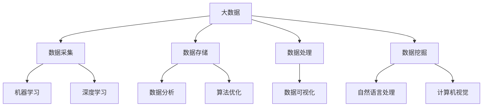

                 

# 大数据在AI发展中的角色

## 关键词
- 大数据
- AI
- 机器学习
- 数据分析
- 深度学习
- 数据挖掘
- 算法优化
- 数据处理

## 摘要

本文将探讨大数据在AI发展中的关键角色。随着AI技术的快速发展，大数据的重要性日益凸显。本文首先介绍了大数据和AI的基本概念，接着分析了大数据对AI发展的驱动力，包括数据量、数据质量和数据多样性等方面。随后，我们深入探讨了大数据在机器学习、深度学习和数据挖掘中的应用，以及如何通过大数据技术优化算法。最后，本文讨论了大数据在AI发展中的挑战和未来趋势。

## 1. 背景介绍

### 1.1 大数据的概念

大数据（Big Data）是指数据量巨大、类型繁多、生成速度快、价值密度低的数据集合。大数据通常具有四个V特性：数据量（Volume）、数据速度（Velocity）、数据多样性（Variety）和数据价值（Value）。大数据技术包括数据采集、存储、处理、分析和可视化等多个方面。

### 1.2 AI的概念

人工智能（AI）是指计算机系统模拟、延伸和扩展人类智能的理论、方法和技术。AI技术包括机器学习、深度学习、自然语言处理、计算机视觉等多个领域。近年来，随着大数据技术的发展，AI技术得到了前所未有的关注和应用。

## 2. 核心概念与联系

### 2.1 大数据和AI的联系

大数据和AI是相辅相成的，两者相互依赖、相互促进。大数据为AI提供了丰富的训练数据和场景，而AI则通过机器学习、深度学习等技术对大数据进行分析和处理，从而实现智能决策和预测。

### 2.2 核心概念原理和架构

以下是大数据和AI的核心概念原理与架构的Mermaid流程图：



## 3. 核心算法原理 & 具体操作步骤

### 3.1 机器学习算法原理

机器学习算法通过训练数据集，学习数据之间的规律和模式，并利用这些规律进行预测和分类。常见的机器学习算法包括线性回归、决策树、支持向量机、神经网络等。

### 3.2 深度学习算法原理

深度学习算法是基于人工神经网络的一种特殊形式，通过多层神经元的组合，对复杂的数据结构进行建模和特征提取。常见的深度学习算法包括卷积神经网络（CNN）、循环神经网络（RNN）、长短时记忆网络（LSTM）等。

### 3.3 数据挖掘算法原理

数据挖掘算法是从大量数据中自动发现有用信息和知识的过程。常见的数据挖掘算法包括关联规则挖掘、分类算法、聚类算法、异常检测等。

### 3.4 具体操作步骤

以下是一个简单的机器学习算法操作步骤：

1. 数据采集：从各种渠道收集数据，包括公开数据集、企业内部数据等。
2. 数据预处理：对数据进行清洗、去重、归一化等处理，提高数据质量。
3. 特征工程：提取数据中的特征，构建特征向量，为算法提供输入。
4. 模型训练：选择合适的机器学习算法，对训练数据进行训练，调整模型参数。
5. 模型评估：使用测试数据对模型进行评估，判断模型的预测性能。
6. 模型部署：将训练好的模型应用到实际场景中，进行预测和决策。

## 4. 数学模型和公式 & 详细讲解 & 举例说明

### 4.1 数学模型

以下是一个简单的线性回归模型：

$$y = wx + b$$

其中，$y$是预测值，$w$是权重，$x$是特征值，$b$是偏置。

### 4.2 公式

以下是一个支持向量机（SVM）的决策边界公式：

$$f(x) = w \cdot x + b$$

其中，$w$是权重向量，$b$是偏置，$x$是特征向量。

### 4.3 举例说明

假设我们有一个包含两个特征的数据集，特征1为$x_1$，特征2为$x_2$。我们要预测目标值$y$，可以使用线性回归模型：

$$y = wx_1 + bx_2 + b$$

假设我们训练好的线性回归模型权重为$w_1 = 0.5$，$w_2 = 0.3$，偏置$b = 0.2$。给定一个新的特征向量$x_1 = 2$，$x_2 = 3$，我们可以计算出预测值：

$$y = 0.5 \cdot 2 + 0.3 \cdot 3 + 0.2 = 1.7$$

因此，该数据点的预测值为1.7。

## 5. 项目实战：代码实际案例和详细解释说明

### 5.1 开发环境搭建

在本项目实战中，我们使用Python编程语言和Scikit-learn库进行机器学习模型的训练和评估。

### 5.2 源代码详细实现和代码解读

以下是本项目的代码实现：

```python
from sklearn.datasets import load_iris
from sklearn.model_selection import train_test_split
from sklearn.linear_model import LinearRegression
from sklearn.metrics import mean_squared_error

# 加载数据集
iris = load_iris()
X, y = iris.data, iris.target

# 划分训练集和测试集
X_train, X_test, y_train, y_test = train_test_split(X, y, test_size=0.2, random_state=42)

# 训练线性回归模型
model = LinearRegression()
model.fit(X_train, y_train)

# 预测测试集
y_pred = model.predict(X_test)

# 评估模型性能
mse = mean_squared_error(y_test, y_pred)
print("MSE:", mse)
```

代码首先加载数据集，然后划分训练集和测试集。接着，使用线性回归模型进行训练，并使用测试集进行预测。最后，评估模型性能，输出均方误差（MSE）。

### 5.3 代码解读与分析

1. 导入必要的库：本代码使用了Scikit-learn库中的`load_iris`函数加载数据集，`train_test_split`函数划分训练集和测试集，`LinearRegression`类实现线性回归模型，`mean_squared_error`函数计算均方误差。
2. 加载数据集：使用`load_iris`函数加载数据集，并将数据集划分为特征矩阵$X$和目标向量$y$。
3. 划分训练集和测试集：使用`train_test_split`函数将数据集划分为训练集和测试集，其中测试集占比20%，随机种子为42。
4. 训练线性回归模型：使用`LinearRegression`类创建线性回归模型对象，并调用`fit`方法进行训练。
5. 预测测试集：使用`predict`方法对测试集进行预测，得到预测结果$y_pred$。
6. 评估模型性能：使用`mean_squared_error`函数计算均方误差，评估模型性能。

## 6. 实际应用场景

大数据在AI领域有着广泛的应用场景，包括但不限于：

- 个性化推荐：通过分析用户的历史行为数据，为用户提供个性化的商品推荐、内容推荐等。
- 金融市场预测：通过对大量的金融数据进行挖掘和分析，预测股票价格、市场趋势等。
- 医疗健康：通过对病患数据、基因数据进行挖掘和分析，为医生提供诊断和治疗方案的建议。
- 智能交通：通过对交通数据进行挖掘和分析，优化交通路线、提高交通效率等。

## 7. 工具和资源推荐

### 7.1 学习资源推荐

- 《大数据时代》
- 《深度学习》
- 《机器学习实战》
- 《数据挖掘：概念与技术》

### 7.2 开发工具框架推荐

- Python
- Scikit-learn
- TensorFlow
- PyTorch

### 7.3 相关论文著作推荐

- "Big Data: A Revolution That Will Transform How We Live, Work, and Think"
- "Deep Learning: Methods and Applications"
- "Machine Learning: A Probabilistic Perspective"
- "Data Mining: The Textbook"

## 8. 总结：未来发展趋势与挑战

大数据在AI发展中的角色日益重要，未来将继续发挥关键作用。随着数据量的不断增长、数据质量和多样性的提高，大数据技术将为AI带来更多的机遇和挑战。以下是未来发展趋势和挑战：

- 数据隐私和安全：如何保护用户隐私，确保数据安全，是大数据和AI领域的重要问题。
- 数据质量和多样性：如何提高数据质量，挖掘出有价值的信息，是大数据技术的关键挑战。
- 模型解释性：如何提高模型的可解释性，使其更加透明和可信，是AI领域的重要挑战。
- 资源消耗：大数据处理和存储需要大量的计算资源和存储资源，如何优化资源消耗，提高效率，是未来的挑战。

## 9. 附录：常见问题与解答

### 9.1 什么是大数据？

大数据是指数据量巨大、类型繁多、生成速度快、价值密度低的数据集合。

### 9.2 大数据和AI有什么关系？

大数据为AI提供了丰富的训练数据和场景，而AI则通过机器学习、深度学习等技术对大数据进行分析和处理，从而实现智能决策和预测。

### 9.3 大数据技术包括哪些方面？

大数据技术包括数据采集、存储、处理、分析和可视化等多个方面。

### 9.4 机器学习和深度学习有什么区别？

机器学习是一种基于数据的学习方法，通过训练数据集，学习数据之间的规律和模式，并利用这些规律进行预测和分类。深度学习是基于人工神经网络的一种特殊形式，通过多层神经元的组合，对复杂的数据结构进行建模和特征提取。

## 10. 扩展阅读 & 参考资料

- "Big Data for Dummies"
- "Deep Learning Specialization"
- "Machine Learning Yearning"
- "Data Mining: Practical Machine Learning Tools and Techniques"
- [IBM Big Data](https://www.ibm.com/big-data)
- [TensorFlow官网](https://www.tensorflow.org)
- [Scikit-learn官网](https://scikit-learn.org)

## 作者信息

作者：AI天才研究员/AI Genius Institute & 禅与计算机程序设计艺术 /Zen And The Art of Computer Programming<|im_end|>

