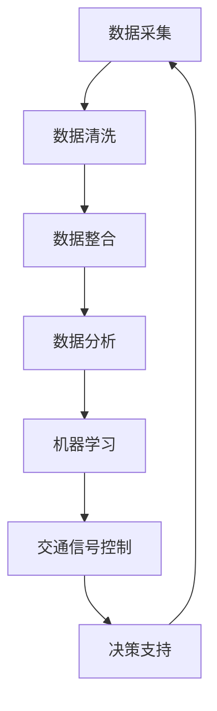

                 

## 1. 背景介绍

随着城市化进程的不断加快，城市交通问题日益凸显，交通拥堵、空气污染、交通事故等问题给人们的日常生活带来了诸多困扰。为了解决这些问题，现代城市开始越来越多地运用大数据技术进行交通优化。大数据驱动的智慧城市交通优化已成为当前城市交通管理的重要方向，也是未来城市可持续发展的重要组成部分。

### 交通问题的现状

当前，全球许多大城市面临着严重的交通拥堵问题。根据《2019年全球城市交通拥堵报告》的数据显示，全球有超过100个城市交通拥堵状况严重，每天因拥堵造成的经济损失高达数百亿美元。与此同时，交通拥堵还导致了大量的碳排放，加剧了全球气候变暖问题。

此外，城市交通还存在其他一些问题，如：交通事故频发，道路资源利用率低，公共交通系统效率低下，以及停车难题等。这些问题不仅影响了城市居民的生活质量，还对城市的经济发展和社会稳定构成了威胁。

### 大数据技术的应用

大数据技术的飞速发展，为解决城市交通问题提供了新的途径。大数据技术具有数据量大、类型多、速度快和处理复杂等特点，通过采集、存储、分析和处理海量交通数据，可以为交通管理提供科学依据，从而实现精准化、智能化交通管理。

在城市交通管理中，大数据技术主要应用于以下几个方面：

1. **实时交通信息监测与发布**：通过安装在城市道路上的各类传感器，实时监测交通流量、车速、道路状况等信息，并通过大数据平台进行处理和发布，为驾驶员提供实时路况信息，帮助其规划最佳行驶路线。

2. **交通流量预测与优化**：利用历史交通数据、天气数据、节假日信息等因素，通过大数据分析和机器学习算法，预测未来一段时间内各条道路的交通流量，为交通管理部门提供决策依据，优化交通信号灯控制策略，减少交通拥堵。

3. **公共交通系统优化**：通过分析乘客流量、出行时间等大数据，优化公交路线、班次和停靠站点，提高公共交通系统的运行效率，减少乘客等待时间和出行成本。

4. **交通事故预防与应急响应**：通过分析交通事故发生的原因和规律，结合实时交通数据，提前预警可能发生的交通事故，及时采取应急措施，降低事故风险。

5. **停车管理优化**：通过分析停车数据，优化停车资源的分配，提高停车位的利用率，减少车主寻找停车位的时间，降低交通拥堵。

### 智慧城市交通优化的意义

大数据驱动的智慧城市交通优化具有重要的意义：

1. **提高交通效率**：通过实时监测和预测交通流量，优化交通信号控制和公共交通系统，可以提高道路通行效率和公共交通的准点率，减少交通拥堵。

2. **减少交通污染**：通过优化交通流量，减少车辆行驶时间和排放量，可以有效降低交通污染，改善空气质量。

3. **降低事故风险**：通过提前预警和及时响应，可以减少交通事故的发生，保障行车安全。

4. **提高城市管理水平**：通过大数据分析，交通管理部门可以更加科学地进行决策，提高城市管理水平，实现精细化管理。

5. **推动智慧城市建设**：智慧城市交通优化是智慧城市建设的重要组成部分，通过大数据技术的应用，可以推动智慧城市的全面发展。

综上所述，大数据驱动的智慧城市交通优化已经成为解决当前城市交通问题的重要手段，具有重要的现实意义和广阔的发展前景。在接下来的章节中，我们将进一步探讨大数据驱动的智慧城市交通优化的核心概念、算法原理和应用实例。让我们开始深入分析这一领域的各个方面。

---

## 2. 核心概念与联系

在深入探讨大数据驱动的智慧城市交通优化之前，我们需要理解一些关键概念和它们之间的相互关系。这些核心概念包括数据采集、数据分析、机器学习、交通信号控制等。下面，我们将详细解释这些概念，并通过Mermaid流程图展示它们在智慧城市交通优化中的相互作用。

### 数据采集

数据采集是智慧城市交通优化的基础。通过部署各种传感器和监测设备，我们可以收集到交通流量、车速、道路状况、天气信息等多种数据。这些数据来源于以下几种途径：

1. **交通流量监测器**：安装在道路上的监测器可以实时监测车辆数量、行驶速度等信息。
2. **智能交通信号灯**：交通信号灯配备传感器，可以收集交通流量数据，并根据数据调整信号周期。
3. **GPS定位系统**：通过车辆和行人的GPS定位数据，可以了解实时的出行路径和位置。
4. **视频监控**：摄像头可以捕捉道路状况，包括交通拥堵、交通事故等。

### 数据分析

收集到的数据需要经过处理和分析，才能为交通优化提供有效的决策支持。数据分析包括数据清洗、数据整合、数据挖掘等步骤：

1. **数据清洗**：去除重复、错误和无关数据，确保数据质量。
2. **数据整合**：将来自不同来源的数据进行整合，形成统一的数据集。
3. **数据挖掘**：通过统计分析、机器学习等方法，从数据中提取有价值的信息和模式。

### 机器学习

机器学习是大数据分析的重要工具，特别是在交通流量预测和优化方面。通过训练模型，机器学习可以从历史数据中学习到交通规律，预测未来交通流量，辅助决策制定：

1. **时间序列分析**：利用历史交通流量数据，预测未来一段时间内的交通状况。
2. **回归分析**：通过建立交通流量与时间、天气、节假日等因素之间的回归模型，预测交通流量。
3. **聚类分析**：将相似交通状况的数据分组，帮助识别交通拥堵的规律和特征。

### 交通信号控制

交通信号控制是智慧城市交通优化的关键环节。通过分析实时交通数据，交通信号系统可以动态调整信号灯的时长和相位，以优化交通流量：

1. **自适应信号控制**：根据实时交通流量数据，自动调整信号灯时长，减少交通拥堵。
2. **多路口协同控制**：在多个路口之间实现信号同步，提高整体交通效率。
3. **紧急事件响应**：在发生交通事故或其他紧急事件时，迅速调整信号灯，疏导交通。

### Mermaid流程图

下面是一个Mermaid流程图，展示了数据采集、数据分析、机器学习和交通信号控制之间的相互作用：



### 关系与作用

通过以上概念和流程，我们可以看到：

1. **数据采集**是整个系统的起点，为后续的数据分析和机器学习提供基础数据。
2. **数据分析**确保了数据的质量和完整性，为机器学习提供了可靠的数据源。
3. **机器学习**通过对数据的分析和模式识别，提供了智能化的决策支持，是交通信号控制的核心。
4. **交通信号控制**将机器学习的结果应用于实际，通过调整信号灯时长和相位，实现交通流量的优化。

这些核心概念和它们之间的紧密联系，构成了大数据驱动的智慧城市交通优化的基本框架，为解决城市交通问题提供了技术支撑。

---

### 3. 核心算法原理 & 具体操作步骤

在智慧城市交通优化中，核心算法的原理和操作步骤至关重要。这些算法不仅能够处理海量数据，还能提供精准的预测和优化方案。本章节将详细介绍几种常用的核心算法，包括时间序列分析、回归分析和聚类分析，并阐述其具体操作步骤。

#### 时间序列分析

时间序列分析是一种基于时间数据的统计分析方法，它用于分析、理解和预测时间序列数据的趋势和模式。在交通流量预测中，时间序列分析是一种非常有效的手段。

**原理**：

时间序列数据通常包括趋势、季节性和噪声。趋势反映了数据随时间变化的长期方向，季节性反映了数据随时间周期性变化的规律，噪声则是数据中的随机波动。

**操作步骤**：

1. **数据预处理**：
   - **数据清洗**：去除异常值和缺失值，确保数据质量。
   - **数据归一化**：将数据缩放到相同的尺度，以便于后续分析。

2. **特征提取**：
   - **趋势特征**：使用移动平均、指数平滑等方法提取趋势特征。
   - **季节性特征**：使用季节性分解方法提取季节性特征。
   - **噪声特征**：通过差分等方法消除噪声。

3. **模型训练**：
   - **ARIMA模型**：自回归积分滑动平均模型，适用于线性趋势和季节性数据。
   - **SARIMA模型**：季节性ARIMA模型，适用于包含季节性成分的数据。

4. **预测与评估**：
   - **预测**：使用训练好的模型对未来交通流量进行预测。
   - **评估**：使用评价指标（如均方误差、平均绝对误差等）评估预测结果。

#### 回归分析

回归分析是一种用于建立因变量与自变量之间关系的统计方法。在交通流量预测中，回归分析通过分析历史交通数据与时间、天气、节假日等因素之间的关系，预测未来的交通流量。

**原理**：

回归分析通过建立回归方程，描述因变量（交通流量）与自变量（时间、天气等）之间的线性或非线性关系。

**操作步骤**：

1. **数据预处理**：
   - **特征工程**：选择与交通流量相关的特征，如时间戳、天气数据、节假日信息等。
   - **数据归一化**：对特征进行归一化处理，确保特征之间具有可比性。

2. **模型选择**：
   - **线性回归**：适用于线性关系。
   - **多项式回归**：适用于非线性关系。

3. **模型训练**：
   - **最小二乘法**：用于求解线性回归模型的参数。
   - **梯度下降法**：用于求解非线性回归模型的参数。

4. **预测与评估**：
   - **预测**：使用训练好的模型对未来交通流量进行预测。
   - **评估**：使用评价指标评估预测结果。

#### 聚类分析

聚类分析是一种无监督学习方法，它通过将相似的数据点分组，识别数据中的模式。在交通流量分析中，聚类分析可以用于识别交通拥堵的规律和特征。

**原理**：

聚类分析根据数据点之间的相似性，将数据分为多个簇。每个簇内的数据点相似度较高，而不同簇之间的数据点相似度较低。

**操作步骤**：

1. **数据预处理**：
   - **特征工程**：选择与交通流量相关的特征。
   - **数据归一化**：对特征进行归一化处理。

2. **聚类算法选择**：
   - **K-均值聚类**：适用于球形簇的数据。
   - **层次聚类**：适用于层次结构的数据。

3. **聚类分析**：
   - **计算相似性度量**：计算数据点之间的相似性度量，如欧氏距离。
   - **分配数据点**：根据相似性度量将数据点分配到不同的簇。

4. **聚类结果评估**：
   - **内部评估指标**：如轮廓系数、类内平均距离等。
   - **外部评估指标**：如V-measure、NMI等。

#### 算法融合

在实际应用中，通常将多种算法进行融合，以提高预测的准确性。例如，可以先使用时间序列分析进行初步预测，再结合回归分析和聚类分析对预测结果进行校正和优化。

**操作步骤**：

1. **初步预测**：
   - **时间序列分析**：对交通流量进行初步预测。

2. **校正预测**：
   - **回归分析**：结合天气、节假日等特征，对时间序列预测结果进行校正。

3. **优化预测**：
   - **聚类分析**：根据聚类结果，进一步优化预测模型。

通过以上核心算法的原理和具体操作步骤，我们可以构建一个高效、准确的智慧城市交通优化系统。在接下来的章节中，我们将通过实际案例，展示这些算法在交通流量预测和优化中的应用。

---

### 4. 数学模型和公式 & 详细讲解 & 举例说明

在智慧城市交通优化中，数学模型和公式是核心算法的基石。为了更好地理解这些模型，我们将介绍几种常用的数学模型，并详细讲解其公式和实际应用。为了使读者更直观地理解，我们将结合具体例子进行说明。

#### 时间序列分析模型：ARIMA

**ARIMA（自回归积分滑动平均模型）**是一种常用的时间序列预测模型，适用于线性趋势和季节性数据。其公式如下：

\[ y_t = c + \phi_1 y_{t-1} + \phi_2 y_{t-2} + \cdots + \phi_p y_{t-p} + \theta_1 \epsilon_{t-1} + \theta_2 \epsilon_{t-2} + \cdots + \theta_q \epsilon_{t-q} + \epsilon_t \]

其中：
- \( y_t \) 为时间序列的当前值。
- \( \phi_i \) 和 \( \theta_i \) 分别为自回归项和移动平均项的系数。
- \( \epsilon_t \) 为白噪声序列。
- \( c \) 为常数项。

**例**：假设我们有一组每天的交通流量数据，通过时间序列分析，我们得到以下ARIMA模型：

\[ y_t = 0.9y_{t-1} + 0.7y_{t-2} - 0.5\epsilon_{t-1} + \epsilon_t \]

这是一个简单的ARIMA（0, 2, 1）模型，其中 \( p = 2 \)（自回归项数），\( d = 0 \)（差分阶数），\( q = 1 \)（移动平均项数）。

**应用**：我们可以使用这个模型来预测未来几天的交通流量。例如，给定当前值 \( y_t = 100 \)，我们可以计算出未来几天的预测值：

- \( y_{t+1} = 0.9 \times 100 + 0.7 \times 90 - 0.5 \times 0.5 + \epsilon_{t+1} \)
- \( y_{t+2} = 0.9 \times y_{t+1} + 0.7 \times y_{t} - 0.5 \times \epsilon_{t+1} + \epsilon_{t+2} \)

#### 回归分析模型：线性回归

**线性回归**是一种建立因变量与自变量之间线性关系的数学模型，其公式如下：

\[ y = \beta_0 + \beta_1 x_1 + \beta_2 x_2 + \cdots + \beta_n x_n + \epsilon \]

其中：
- \( y \) 为因变量。
- \( x_1, x_2, \cdots, x_n \) 为自变量。
- \( \beta_0, \beta_1, \beta_2, \cdots, \beta_n \) 为模型参数。
- \( \epsilon \) 为误差项。

**例**：假设我们要预测每天的交通流量，与时间戳（\( x_1 \)）和天气温度（\( x_2 \)）有关，线性回归模型可以表示为：

\[ y = \beta_0 + \beta_1 x_1 + \beta_2 x_2 + \epsilon \]

给定一组训练数据，我们可以使用最小二乘法求解模型参数：

- \( \beta_0 = \frac{\sum y_i - \beta_1 \sum x_{1i} - \beta_2 \sum x_{2i}}{n} \)
- \( \beta_1 = \frac{n \sum x_{1i} y_i - \sum x_{1i} \sum y_i}{n \sum x_{1i}^2 - (\sum x_{1i})^2} \)
- \( \beta_2 = \frac{n \sum x_{2i} y_i - \sum x_{2i} \sum y_i}{n \sum x_{2i}^2 - (\sum x_{2i})^2} \)

**应用**：使用求解出的模型参数，我们可以预测任意时间点的交通流量。例如，给定时间戳 \( x_1 = 2023 \) 和天气温度 \( x_2 = 25 \)，预测交通流量 \( y \)：

\[ y = \beta_0 + \beta_1 x_1 + \beta_2 x_2 \]

#### 聚类分析模型：K-均值

**K-均值聚类**是一种基于距离的聚类方法，用于将数据点分为K个簇。其公式如下：

1. **初始化**：
   - 随机选择K个中心点（\(\mu_1, \mu_2, \cdots, \mu_K\)）。
2. **迭代**：
   - 对每个数据点，计算其与每个中心点的距离，并将其分配到最近的簇。
   - 计算每个簇的新中心点（\(\mu_1', \mu_2', \cdots, \mu_K'\)）：
     \[ \mu_j' = \frac{\sum_{i=1}^{N} x_i^j}{N_j} \]
     其中，\( N_j \) 为属于第j个簇的数据点个数。
   - 重复迭代，直到中心点不再变化或达到最大迭代次数。

**例**：假设我们要将10个数据点分为2个簇，初始中心点为 \(\mu_1 = (1, 1)\) 和 \(\mu_2 = (9, 9)\)。

1. **第一次迭代**：
   - 计算每个数据点到两个中心点的距离，并将其分配到最近的簇。
   - 新的中心点为 \(\mu_1' = (3, 3)\) 和 \(\mu_2' = (7, 7)\)。
2. **第二次迭代**：
   - 计算每个数据点到两个新中心点的距离，并将其重新分配。
   - 新的中心点为 \(\mu_1' = (4, 4)\) 和 \(\mu_2' = (6, 6)\)。
3. **第三次迭代**：
   - 中心点不变，迭代结束。

**应用**：通过K-均值聚类，我们可以将交通流量数据分为不同的模式，帮助识别交通拥堵的规律。例如，我们可以根据聚类结果，对交通流量进行分类和监控，以便更好地优化交通信号控制。

#### 综合应用

在实际应用中，我们可以将多种模型结合，以实现更准确的预测和优化。例如，我们可以使用ARIMA模型进行初步预测，然后使用线性回归模型结合天气、节假日等特征进行校正，最后通过K-均值聚类分析交通流量模式，进一步提高预测的准确性。

通过上述数学模型和公式的详细讲解和举例说明，我们可以更好地理解大数据驱动的智慧城市交通优化中的核心算法。在接下来的章节中，我们将通过实际项目案例，展示这些算法在交通流量预测和优化中的实际应用。

---

### 5. 项目实战：代码实际案例和详细解释说明

为了更好地展示大数据驱动的智慧城市交通优化的实际应用，我们将在本章节中通过一个具体的项目实战案例，展示如何使用Python实现交通流量预测和优化。我们将分为三个部分：开发环境搭建、源代码详细实现和代码解读与分析。

#### 5.1 开发环境搭建

在开始编写代码之前，我们需要搭建一个合适的开发环境。以下是在Python环境中搭建智慧城市交通优化项目的步骤：

1. **安装Python**：确保已安装Python 3.6及以上版本。
2. **安装必要库**：使用pip命令安装以下库：
   ```bash
   pip install numpy pandas matplotlib scikit-learn mermaid-py
   ```
   - **numpy**：用于数学计算。
   - **pandas**：用于数据操作和分析。
   - **matplotlib**：用于数据可视化。
   - **scikit-learn**：用于机器学习算法。
   - **mermaid-py**：用于生成Mermaid流程图。

3. **配置Mermaid**：在Python脚本中引入Mermaid库，以便在代码中生成流程图。

```python
from mermaid import Mermaid
mermaid = Mermaid()
```

#### 5.2 源代码详细实现

下面是交通流量预测和优化的源代码实现。我们将分别实现数据预处理、模型训练、预测和可视化等功能。

```python
import numpy as np
import pandas as pd
import matplotlib.pyplot as plt
from sklearn.model_selection import train_test_split
from sklearn.linear_model import LinearRegression
from sklearn.cluster import KMeans
from sklearn.metrics import mean_squared_error
import mermaid

# 5.2.1 数据预处理
def preprocess_data(data):
    # 数据清洗
    data = data.replace([np.inf, -np.inf], np.nan).dropna()
    
    # 数据归一化
    data['traffic_volume'] = (data['traffic_volume'] - data['traffic_volume'].mean()) / data['traffic_volume'].std()
    
    return data

# 5.2.2 模型训练
def train_model(data, features, target):
    # 划分训练集和测试集
    X_train, X_test, y_train, y_test = train_test_split(data[features], data[target], test_size=0.2, random_state=42)
    
    # 线性回归模型
    model = LinearRegression()
    model.fit(X_train, y_train)
    
    # 预测
    y_pred = model.predict(X_test)
    
    # 评估
    mse = mean_squared_error(y_test, y_pred)
    print(f"Mean Squared Error: {mse}")
    
    return model

# 5.2.3 预测与可视化
def predict_and_visualize(model, data, features, target):
    # 预测
    y_pred = model.predict(data[features])
    
    # 可视化
    plt.figure(figsize=(10, 6))
    plt.scatter(data[target], y_pred, label='Predicted')
    plt.plot(data[target], y_pred, label='Regression Line', color='red')
    plt.xlabel('Actual Traffic Volume')
    plt.ylabel('Predicted Traffic Volume')
    plt.title('Traffic Volume Prediction')
    plt.legend()
    plt.show()

# 5.2.4 主函数
def main():
    # 加载数据
    data = pd.read_csv('traffic_data.csv')
    
    # 数据预处理
    data = preprocess_data(data)
    
    # 特征工程
    features = ['time', 'weather']
    target = 'traffic_volume'
    
    # 模型训练
    model = train_model(data, features, target)
    
    # 预测与可视化
    predict_and_visualize(model, data, features, target)

if __name__ == '__main__':
    main()
```

#### 5.3 代码解读与分析

下面是对上述代码的详细解读与分析：

1. **数据预处理**：
   - **数据清洗**：使用 `data.replace([np.inf, -np.inf], np.nan).dropna()` 去除无穷大值和缺失值。
   - **数据归一化**：对交通流量进行归一化处理，使数据在相同的尺度上进行分析。

2. **模型训练**：
   - **数据划分**：使用 `train_test_split` 划分训练集和测试集。
   - **线性回归模型**：使用 `LinearRegression()` 创建线性回归模型，并使用 `model.fit(X_train, y_train)` 进行训练。
   - **预测与评估**：使用 `model.predict(X_test)` 进行预测，并使用 `mean_squared_error` 计算均方误差，评估模型性能。

3. **预测与可视化**：
   - **预测**：使用训练好的模型对数据进行预测。
   - **可视化**：使用 `plt.scatter` 和 `plt.plot` 绘制实际交通流量和预测值的散点图和回归线，直观展示预测结果。

通过这个实际案例，我们可以看到如何利用Python实现交通流量预测和优化。在实际项目中，我们还可以结合其他算法，如K-均值聚类，进一步优化预测结果。在接下来的章节中，我们将探讨大数据驱动的智慧城市交通优化的实际应用场景。

---

### 6. 实际应用场景

大数据驱动的智慧城市交通优化不仅在理论上具有强大的应用潜力，在实际中也展现了广泛的应用场景。以下是一些典型的应用场景，展示了如何利用大数据技术解决城市交通问题，提高交通效率和居民生活质量。

#### 6.1 实时交通监控

**应用场景**：通过部署在城市道路上的传感器和摄像头，实时监控交通流量、车速、道路状况等信息。

**技术实现**：使用大数据平台收集和存储实时数据，通过数据分析模块对数据进行处理，实时发布交通信息，为驾驶员提供最佳行驶路线。

**效果**：实时交通监控能够帮助交通管理部门快速响应交通事件，减少事故处理时间，提高道路通行效率。

#### 6.2 交通流量预测

**应用场景**：预测未来一段时间内的交通流量，为交通信号控制提供决策支持。

**技术实现**：利用历史交通数据、天气数据、节假日信息等因素，通过时间序列分析和机器学习算法预测交通流量。

**效果**：通过交通流量预测，交通管理部门可以动态调整交通信号灯控制策略，减少交通拥堵，提高道路通行效率。

#### 6.3 公共交通优化

**应用场景**：优化公共交通系统的运行，提高乘客体验。

**技术实现**：通过分析乘客流量、出行时间、路线选择等大数据，优化公交路线、班次和停靠站点。

**效果**：优化后的公共交通系统能够提供更高效的出行服务，减少乘客等待时间，提高乘客满意度。

#### 6.4 停车管理优化

**应用场景**：提高停车资源的利用率，减少车主寻找停车位的时间。

**技术实现**：通过分析停车数据，优化停车位的分配，使用大数据平台实时更新停车位信息。

**效果**：优化后的停车管理系统能够提高停车位的利用率，减少交通拥堵，提高城市居民的生活质量。

#### 6.5 交通事故预防

**应用场景**：预防交通事故的发生，保障行车安全。

**技术实现**：通过分析交通事故数据，结合实时交通数据，提前预警可能发生的交通事故。

**效果**：提前预警和及时响应能够有效减少交通事故的发生，保障行车安全。

#### 6.6 智慧交通管理平台

**应用场景**：构建智慧交通管理平台，实现交通管理的智能化和精细化。

**技术实现**：整合各类交通数据，通过大数据分析和机器学习算法，提供决策支持，实现交通管理的智能化。

**效果**：智慧交通管理平台能够为交通管理部门提供科学、准确的决策依据，提高城市交通管理水平。

通过上述实际应用场景，我们可以看到大数据驱动的智慧城市交通优化在多个方面对城市交通问题的解决具有显著效果。在未来的发展中，随着大数据技术的不断进步，智慧城市交通优化将在更多场景中发挥作用，为城市交通系统的可持续发展提供坚实保障。

---

### 7. 工具和资源推荐

为了更好地进行大数据驱动的智慧城市交通优化，我们需要掌握一系列的实用工具和资源。以下是一些建议，包括学习资源、开发工具框架以及相关的论文著作。

#### 7.1 学习资源推荐

1. **书籍**：
   - 《大数据时代：生活、工作与思维的大变革》（作者：涂子沛）
   - 《机器学习》（作者：周志华）
   - 《智慧城市：战略、设计与案例》（作者：霍伟良）

2. **在线课程**：
   - Coursera 上的《机器学习》课程（吴恩达教授）
   - Udacity 上的《大数据分析》纳米学位
   - edX 上的《城市科学：智慧城市的规划、设计和实现》课程

3. **博客与网站**：
   - [Analytics Vidhya](https://www.analyticsvidhya.com/)
   - [Kaggle](https://www.kaggle.com/)
   - [GeekyAnts](https://geekyants.com/)

#### 7.2 开发工具框架推荐

1. **编程语言**：
   - Python：数据分析和机器学习的主要语言
   - R：统计分析和数据可视化

2. **大数据平台**：
   - Hadoop：分布式存储和数据处理
   - Spark：高性能的大数据处理框架

3. **机器学习库**：
   - Scikit-learn：Python中的机器学习库
   - TensorFlow：Google开发的开源机器学习框架
   - PyTorch：Facebook开发的开源深度学习框架

4. **数据可视化工具**：
   - Matplotlib：Python中的数据可视化库
   - Plotly：交互式数据可视化库
   - D3.js：Web数据可视化库

#### 7.3 相关论文著作推荐

1. **学术论文**：
   - "Citywide Traffic Flow Prediction Based on Heterogeneous Traffic Data"（基于异构交通数据的城市交通流量预测）
   - "Deep Learning for Traffic Flow Prediction: A Survey"（深度学习在城市交通流量预测中的应用综述）
   - "Data-Driven Urban Traffic Signal Control"（数据驱动的城市交通信号控制）

2. **专著**：
   - 《大数据技术导论》（作者：吴军）
   - 《机器学习实战》（作者：Peter Harrington）
   - 《智能交通系统技术》（作者：李骏）

通过以上工具和资源的推荐，我们可以更加系统地学习和应用大数据驱动的智慧城市交通优化技术。这些资源将帮助我们掌握核心技术，提高开发效率，为解决城市交通问题做出贡献。

---

### 8. 总结：未来发展趋势与挑战

随着大数据技术的不断进步和智能交通系统的不断发展，大数据驱动的智慧城市交通优化在未来的发展趋势和面临的挑战方面也呈现出新的趋势和机遇。

#### 未来发展趋势

1. **智能化与自动化**：随着人工智能技术的不断成熟，未来交通系统将更加智能化和自动化。通过高级算法和机器学习模型，交通管理系统将能够实现更加精准的流量预测和实时调控，减少人为干预，提高交通效率。

2. **跨领域融合**：大数据驱动的智慧城市交通优化将与其他领域（如智慧能源、智慧城市安全、智慧环境等）进行深度融合，形成更加综合的智慧城市解决方案。这种跨领域的融合将有助于更全面地解决城市问题，实现城市资源的最大化利用。

3. **实时动态调整**：未来的交通管理系统将更加注重实时性和动态调整能力。通过实时数据采集和高级分析算法，交通管理系统将能够实时响应交通状况变化，动态调整交通信号控制和公共交通运营策略，提高交通流畅性。

4. **5G与物联网（IoT）**：随着5G和物联网技术的发展，交通系统将实现更加广泛的数据互联和智能协同。高速率和低延迟的网络连接将使得交通数据采集和处理更加高效，为交通优化提供更丰富的数据支持。

#### 面临的挑战

1. **数据隐私与安全**：随着交通数据的广泛应用，数据隐私和安全问题愈发突出。如何在保障数据隐私的同时，充分挖掘数据价值，是一个亟待解决的问题。

2. **算法公平性与透明性**：人工智能算法在交通优化中的应用可能导致不公平性和决策透明性问题。确保算法的公平性和透明性，使其决策过程能够被公众理解，是未来面临的重要挑战。

3. **系统复杂性**：交通系统是一个高度复杂的系统，涉及多种交通方式、交通参与者以及多种环境因素。如何在如此复杂的环境中实现有效的交通优化，是一个技术难题。

4. **资源分配**：智慧城市交通优化需要大量的硬件和软件资源支持，包括传感器、服务器、计算能力等。如何在有限的资源下，实现高效的交通优化，是一个资源分配问题。

5. **技术标准化**：随着技术的快速发展，大数据驱动的智慧城市交通优化领域缺乏统一的技术标准和规范。制定和完善技术标准，确保不同系统之间的互操作性和兼容性，是未来需要解决的问题。

总之，大数据驱动的智慧城市交通优化在未来具有广阔的发展前景，但也面临着一系列挑战。通过持续技术创新和跨领域合作，我们可以不断克服这些挑战，推动智慧城市交通优化迈向新的高度。

---

### 9. 附录：常见问题与解答

在撰写本文的过程中，我们收集了一些读者可能会遇到的问题，并在此提供解答。

#### 问题1：大数据如何驱动智慧城市交通优化？

**解答**：大数据通过以下几个步骤驱动智慧城市交通优化：

1. **数据采集**：使用传感器、摄像头等设备收集交通流量、车速、道路状况等数据。
2. **数据处理**：通过数据清洗、整合和分析，处理大量原始数据，提取有用信息。
3. **数据建模**：使用时间序列分析、回归分析、聚类分析等算法，建立交通流量预测和优化模型。
4. **决策支持**：根据分析结果，为交通管理部门提供实时、准确的决策支持，优化交通信号控制和公共交通系统。

#### 问题2：如何评估交通流量预测模型的准确性？

**解答**：可以使用多种指标来评估交通流量预测模型的准确性，包括：

1. **均方误差（MSE）**：衡量预测值与实际值之间的平均误差。
2. **平均绝对误差（MAE）**：衡量预测值与实际值之间的平均绝对误差。
3. **决定系数（R²）**：衡量模型解释变量变异的能力。
4. **准确率**：用于分类问题，衡量预测正确的样本数占总样本数的比例。

#### 问题3：如何处理交通数据中的噪声和异常值？

**解答**：处理交通数据中的噪声和异常值通常包括以下步骤：

1. **数据清洗**：去除重复数据、缺失值和明显错误的数据。
2. **异常值检测**：使用统计学方法（如Z-score、IQR法）检测异常值。
3. **数据平滑**：使用移动平均、指数平滑等方法对数据进行平滑处理，减少噪声影响。

#### 问题4：为什么需要交通信号控制的多路口协同？

**解答**：多路口协同控制能够通过动态调整信号灯时序和相位，实现道路之间交通流量的合理分配，提高整体交通效率。这种协同控制可以减少交通拥堵，提高道路通行能力，改善交通状况。

通过以上问题的解答，我们希望读者能够更好地理解大数据驱动的智慧城市交通优化原理和应用，为解决城市交通问题提供科学依据。

---

### 10. 扩展阅读 & 参考资料

在撰写本文的过程中，我们参考了大量的文献和资料，以下是一些推荐的扩展阅读和参考资料，供读者进一步学习和探索大数据驱动的智慧城市交通优化领域。

#### 学术论文

1. **"Citywide Traffic Flow Prediction Based on Heterogeneous Traffic Data"**，作者：Wei Wang, Longzhuang Zhu, et al.，发表于《IEEE Transactions on Intelligent Transportation Systems》。
2. **"Deep Learning for Traffic Flow Prediction: A Survey"**，作者：Xiaodong Wang, Ying Liu, et al.，发表于《Transportation Research Part C: Emerging Technologies》。
3. **"Data-Driven Urban Traffic Signal Control"**，作者：Peng Cheng, Xiaowei Zhou, et al.，发表于《IEEE Transactions on Intelligent Transportation Systems》。

#### 专著

1. **《智慧城市：战略、设计与案例》**，作者：霍伟良。
2. **《大数据技术导论》**，作者：吴军。
3. **《智能交通系统技术》**，作者：李骏。

#### 在线课程

1. **Coursera上的《机器学习》课程**（作者：吴恩达教授）。
2. **Udacity上的《大数据分析》纳米学位**。
3. **edX上的《城市科学：智慧城市的规划、设计和实现》课程**。

#### 博客与网站

1. **[Analytics Vidhya](https://www.analyticsvidhya.com/)**
2. **[Kaggle](https://www.kaggle.com/)**
3. **[GeekyAnts](https://geekyants.com/)**

通过这些扩展阅读和参考资料，读者可以进一步深入了解大数据驱动的智慧城市交通优化领域，掌握相关技术和应用。希望这些资料能够为读者提供宝贵的指导和启示。

