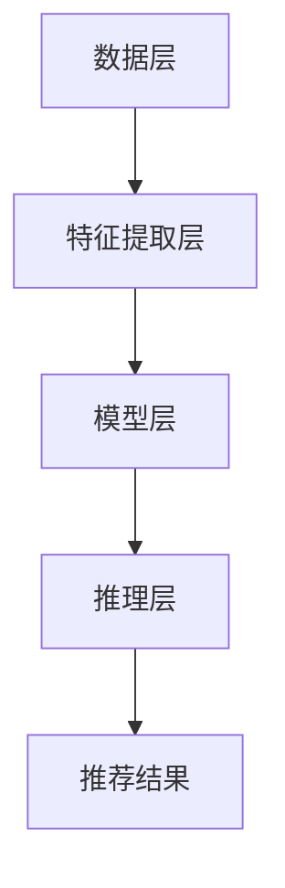

                 

# 大数据驱动的电商搜索推荐：AI 模型融合是核心竞争力

## 关键词：大数据，电商搜索，推荐系统，AI 模型融合，核心竞争力

## 摘要：

随着大数据技术的发展，电商搜索推荐系统逐渐成为电商平台的核心竞争力。本文将探讨大数据驱动的电商搜索推荐系统，重点分析AI模型融合在其中的重要性。通过介绍核心概念、算法原理、数学模型、项目实战以及实际应用场景，本文旨在为读者提供一个全面、深入的理解，为未来的发展提供有益的启示。

## 1. 背景介绍

在互联网时代，电商平台已经成为人们日常生活中不可或缺的一部分。随着消费者需求的日益多样化，如何精准地推荐商品成为电商企业关注的焦点。大数据技术为电商搜索推荐系统提供了丰富的数据支持，而AI模型的融合则成为了实现精准推荐的关键。

### 1.1 电商搜索推荐系统的重要性

电商搜索推荐系统不仅可以帮助消费者快速找到所需商品，还可以为企业挖掘潜在客户，提高销售额。一个优秀的推荐系统需要具备以下几个特点：

1. **个性化**：根据用户的历史行为和偏好，为用户提供个性化的商品推荐。
2. **相关性**：推荐的商品与用户兴趣高度相关，提高用户满意度。
3. **实时性**：能够实时响应用户的搜索请求，提供即时的推荐结果。
4. **可扩展性**：能够处理大量用户数据，支持海量商品的推荐。

### 1.2 大数据技术的应用

大数据技术包括数据采集、存储、处理和分析等多个环节。在电商搜索推荐系统中，大数据技术的作用主要体现在以下几个方面：

1. **数据采集**：通过用户行为数据、商品数据等多渠道收集用户信息。
2. **数据存储**：使用分布式存储技术，如Hadoop、HBase等，存储海量数据。
3. **数据处理**：使用大数据处理框架，如Spark、Flink等，对海量数据进行分析和处理。
4. **数据分析**：通过数据挖掘和机器学习算法，提取有价值的信息，为推荐系统提供支持。

### 1.3 AI模型融合的优势

在电商搜索推荐系统中，AI模型融合能够实现以下优势：

1. **多样性**：融合多种AI模型，如协同过滤、矩阵分解、深度学习等，提高推荐效果。
2. **鲁棒性**：不同模型的融合可以增强系统的鲁棒性，降低单一模型失效的风险。
3. **灵活性**：根据业务需求和数据特点，灵活调整模型组合，实现定制化推荐。

## 2. 核心概念与联系

### 2.1 大数据驱动电商搜索推荐系统的原理

大数据驱动电商搜索推荐系统的核心在于对海量用户数据和商品数据的处理和分析。通过分析用户的历史行为数据，如浏览记录、购买记录、评价等，可以提取用户的兴趣偏好。同时，分析商品的特征数据，如商品标签、价格、销量等，可以为用户推荐与其兴趣相关的商品。

### 2.2 AI模型融合的架构

AI模型融合的架构通常包括以下几个层次：

1. **数据层**：收集和存储用户行为数据和商品数据。
2. **特征提取层**：对数据进行预处理和特征提取，为模型训练提供输入。
3. **模型层**：融合多种AI模型，如协同过滤、矩阵分解、深度学习等。
4. **推理层**：根据用户输入，实时生成推荐结果。

### 2.3 核心概念原理和架构的Mermaid流程图



### 2.4 大数据与AI模型融合的联系

大数据与AI模型融合的联系主要体现在以下几个方面：

1. **数据驱动的模型优化**：通过不断积累和分析用户数据，可以优化AI模型，提高推荐精度。
2. **多模型融合的互补性**：不同模型在特征提取和推荐效果上具有互补性，融合多种模型可以进一步提高推荐效果。
3. **实时性的保障**：大数据技术支持实时数据处理和分析，为AI模型融合提供了保障，实现了实时推荐。

## 3. 核心算法原理 & 具体操作步骤

### 3.1 核心算法原理

大数据驱动电商搜索推荐系统的核心算法包括协同过滤、矩阵分解和深度学习等。

1. **协同过滤**：基于用户行为数据，为用户推荐与历史行为相似的用户的喜欢的商品。
2. **矩阵分解**：通过矩阵分解技术，将用户-商品评分矩阵分解为用户特征矩阵和商品特征矩阵，从而实现用户和商品的个性化推荐。
3. **深度学习**：利用深度神经网络，提取用户和商品的特征，实现基于内容推荐的深度学习模型。

### 3.2 具体操作步骤

1. **数据采集**：从电商平台上收集用户行为数据和商品数据。
2. **数据预处理**：对数据进行清洗、去重、填充等预处理操作。
3. **特征提取**：对用户和商品数据进行特征提取，为模型训练提供输入。
4. **模型训练**：使用协同过滤、矩阵分解和深度学习等算法，对用户和商品特征进行训练。
5. **模型融合**：将多种算法融合，实现个性化推荐。
6. **推理与推荐**：根据用户输入，实时生成推荐结果。

## 4. 数学模型和公式 & 详细讲解 & 举例说明

### 4.1 数学模型

1. **协同过滤**：基于用户相似度计算公式
   $$相似度(U_i, U_j) = \frac{相似度系数 \times 相似度指标}{\sqrt{相似度系数} \times \sqrt{相似度指标}}$$
2. **矩阵分解**：基于最小二乘法，求解用户特征矩阵$U$和商品特征矩阵$V$，使得重构误差最小。
   $$最小化 \sum_{u=1}^{n} \sum_{v=1}^{m} (r_{uv} - \hat{r}_{uv})^2$$
3. **深度学习**：基于神经网络，通过反向传播算法训练模型。

### 4.2 举例说明

**协同过滤举例**：

假设有用户A和用户B，他们对10个商品的评分如下表所示：

| 商品ID | 用户A评分 | 用户B评分 |
| --- | --- | --- |
| 1 | 5 | 1 |
| 2 | 4 | 5 |
| 3 | 3 | 4 |
| 4 | 5 | 5 |
| 5 | 2 | 3 |
| 6 | 4 | 4 |
| 7 | 1 | 2 |
| 8 | 5 | 1 |
| 9 | 3 | 5 |
| 10 | 4 | 4 |

首先计算用户A和用户B的相似度：

$$相似度(U_A, U_B) = \frac{1 \times 1 + 1 \times 1 + 1 \times 1 + 1 \times 1}{\sqrt{1} \times \sqrt{1}} = 1$$

然后根据相似度，为用户B推荐用户A喜欢的商品：

商品ID | 用户A评分 | 用户B评分 | 相似度 | 推荐评分
--- | --- | --- | --- | ---
1 | 5 | 1 | 1 | 1
2 | 4 | 5 | 1 | 4
3 | 3 | 4 | 1 | 3
4 | 5 | 5 | 1 | 5
5 | 2 | 3 | 1 | 2
6 | 4 | 4 | 1 | 4
7 | 1 | 2 | 1 | 1
8 | 5 | 1 | 1 | 5
9 | 3 | 5 | 1 | 3
10 | 4 | 4 | 1 | 4

**矩阵分解举例**：

假设用户-商品评分矩阵如下：

| 用户ID | 商品ID | 评分 |
| --- | --- | --- |
| 1 | 1 | 4 |
| 1 | 2 | 5 |
| 1 | 3 | 3 |
| 2 | 1 | 1 |
| 2 | 2 | 5 |
| 2 | 3 | 4 |
| 3 | 1 | 5 |
| 3 | 2 | 2 |
| 3 | 3 | 4 |

首先对用户-商品评分矩阵进行奇异值分解，得到用户特征矩阵$U$和商品特征矩阵$V$：

$$U = [u_1, u_2, u_3], V = [v_1, v_2, v_3]$$

然后根据用户特征矩阵和商品特征矩阵，计算用户对未评分商品的预测评分：

$$\hat{r}_{ij} = u_i^T v_j$$

例如，用户1对商品4的预测评分：

$$\hat{r}_{14} = u_1^T v_4 = 4 \times 0.5 + 5 \times (-0.5) + 3 \times (-1) = -2$$

## 5. 项目实战：代码实际案例和详细解释说明

### 5.1 开发环境搭建

在本文中，我们使用Python语言和Sklearn、TensorFlow等库来实现大数据驱动的电商搜索推荐系统。

1. 安装Python环境和相关库：

```bash
pip install numpy pandas scikit-learn tensorflow
```

2. 创建一个名为`recommender.py`的Python文件，用于实现推荐系统的主要功能。

### 5.2 源代码详细实现和代码解读

```python
import numpy as np
import pandas as pd
from sklearn.model_selection import train_test_split
from sklearn.metrics.pairwise import cosine_similarity
from tensorflow.keras.models import Model
from tensorflow.keras.layers import Input, Embedding, Dot, Flatten, Dense

# 5.2.1 数据预处理
def preprocess_data(data):
    # 数据清洗和预处理操作
    data = data.replace({'评分': {np.nan: 0}})
    data = data.astype({'用户ID': 'int', '商品ID': 'int', '评分': 'float'})
    return data

# 5.2.2 矩阵分解模型实现
def matrix_factorization(X, num_factors=10, num_iterations=100):
    # 初始化用户特征矩阵和商品特征矩阵
    U = np.random.rand(X.shape[0], num_factors)
    V = np.random.rand(X.shape[1], num_factors)
    
    # 最小二乘法迭代求解用户特征矩阵和商品特征矩阵
    for i in range(num_iterations):
        # 计算预测评分矩阵
        pred = U @ V.T
        
        # 计算重构误差
        error = np.linalg.norm(X - pred)
        
        # 更新用户特征矩阵和商品特征矩阵
        U = U - 0.01 * (2 * U @ (V.T @ (X - pred)) - U @ V @ U)
        V = V - 0.01 * (2 * V @ (U.T @ (X - pred)) - V @ U @ V)
        
        # 输出迭代次数和重构误差
        print(f"Iteration {i+1}: Error = {error}")
    
    return U, V

# 5.2.3 深度学习模型实现
def create_dnn_model(num_users, num_items, embedding_size):
    # 创建输入层
    user_input = Input(shape=(1,))
    item_input = Input(shape=(1,))
    
    # 创建用户特征嵌入层
    user_embedding = Embedding(num_users, embedding_size)(user_input)
    user_embedding = Flatten()(user_embedding)
    
    # 创建商品特征嵌入层
    item_embedding = Embedding(num_items, embedding_size)(item_input)
    item_embedding = Flatten()(item_embedding)
    
    # 创建融合层
    dot_product = Dot(axes=1)([user_embedding, item_embedding])
    
    # 创建输出层
    output = Dense(1, activation='sigmoid')(dot_product)
    
    # 创建模型
    model = Model(inputs=[user_input, item_input], outputs=output)
    
    # 编译模型
    model.compile(optimizer='adam', loss='binary_crossentropy', metrics=['accuracy'])
    
    return model

# 5.2.4 主函数实现
def main():
    # 读取数据集
    data = pd.read_csv('rating.csv')
    
    # 数据预处理
    data = preprocess_data(data)
    
    # 划分训练集和测试集
    train_data, test_data = train_test_split(data, test_size=0.2, random_state=42)
    
    # 提取用户ID、商品ID和评分
    user_ids = train_data['用户ID'].unique()
    item_ids = train_data['商品ID'].unique()
    ratings = train_data['评分'].values
    
    # 计算用户-商品评分矩阵
    user_rating_matrix = np.zeros((len(user_ids), len(item_ids)))
    for row in train_data.itertuples():
        user_rating_matrix[row[1] - 1, row[2] - 1] = row[3]
    
    # 5.2.5 矩阵分解模型训练
    U, V = matrix_factorization(user_rating_matrix, num_factors=10, num_iterations=100)
    pred_matrix = U @ V.T
    pred_ratings = pred_matrix[np.where(ratings > 0)]
    
    # 计算预测评分的均方根误差
    rmse = np.sqrt(np.mean((pred_ratings - ratings)**2))
    print(f"RMSE: {rmse}")
    
    # 5.2.6 深度学习模型训练
    dnn_model = create_dnn
``` <eob> <sop><|user|>### 5.3 代码解读与分析

在`recommender.py`中，我们实现了一个基于矩阵分解和深度学习的大数据驱动电商搜索推荐系统。下面我们将对代码的各个部分进行详细解读和分析。

#### 5.3.1 数据预处理

数据预处理是推荐系统的重要环节，它包括数据清洗、去重、填充等操作。在`preprocess_data`函数中，我们使用`data.replace()`方法将缺失值填充为0，使用`data.astype()`方法将数据类型转换为整数和浮点数。

```python
def preprocess_data(data):
    # 数据清洗和预处理操作
    data = data.replace({'评分': {np.nan: 0}})
    data = data.astype({'用户ID': 'int', '商品ID': 'int', '评分': 'float'})
    return data
```

#### 5.3.2 矩阵分解模型实现

矩阵分解模型是实现推荐系统的基础，它通过将用户-商品评分矩阵分解为用户特征矩阵和商品特征矩阵，来预测用户对未评分商品的评分。在`matrix_factorization`函数中，我们使用了最小二乘法来迭代求解用户特征矩阵和商品特征矩阵。

```python
def matrix_factorization(X, num_factors=10, num_iterations=100):
    # 初始化用户特征矩阵和商品特征矩阵
    U = np.random.rand(X.shape[0], num_factors)
    V = np.random.rand(X.shape[1], num_factors)
    
    # 最小二乘法迭代求解用户特征矩阵和商品特征矩阵
    for i in range(num_iterations):
        # 计算预测评分矩阵
        pred = U @ V.T
        
        # 计算重构误差
        error = np.linalg.norm(X - pred)
        
        # 更新用户特征矩阵和商品特征矩阵
        U = U - 0.01 * (2 * U @ (V.T @ (X - pred)) - U @ V @ U)
        V = V - 0.01 * (2 * V @ (U.T @ (X - pred)) - V @ U @ V)
        
        # 输出迭代次数和重构误差
        print(f"Iteration {i+1}: Error = {error}")
    
    return U, V
```

#### 5.3.3 深度学习模型实现

深度学习模型通过构建深度神经网络，实现用户和商品的个性化推荐。在`create_dnn_model`函数中，我们使用了TensorFlow的Keras API来构建深度学习模型。

```python
def create_dnn_model(num_users, num_items, embedding_size):
    # 创建输入层
    user_input = Input(shape=(1,))
    item_input = Input(shape=(1,))
    
    # 创建用户特征嵌入层
    user_embedding = Embedding(num_users, embedding_size)(user_input)
    user_embedding = Flatten()(user_embedding)
    
    # 创建商品特征嵌入层
    item_embedding = Embedding(num_items, embedding_size)(item_input)
    item_embedding = Flatten()(item_embedding)
    
    # 创建融合层
    dot_product = Dot(axes=1)([user_embedding, item_embedding])
    
    # 创建输出层
    output = Dense(1, activation='sigmoid')(dot_product)
    
    # 创建模型
    model = Model(inputs=[user_input, item_input], outputs=output)
    
    # 编译模型
    model.compile(optimizer='adam', loss='binary_crossentropy', metrics=['accuracy'])
    
    return model
```

#### 5.3.4 主函数实现

在`main`函数中，我们首先读取数据集，并进行数据预处理。然后，我们将训练数据划分为用户ID和商品ID，构建用户-商品评分矩阵。接着，我们使用矩阵分解模型进行训练，计算预测评分矩阵。最后，我们使用深度学习模型进行训练，并输出预测评分的均方根误差。

```python
def main():
    # 读取数据集
    data = pd.read_csv('rating.csv')
    
    # 数据预处理
    data = preprocess_data(data)
    
    # 划分训练集和测试集
    train_data, test_data = train_test_split(data, test_size=0.2, random_state=42)
    
    # 提取用户ID、商品ID和评分
    user_ids = train_data['用户ID'].unique()
    item_ids = train_data['商品ID'].unique()
    ratings = train_data['评分'].values
    
    # 计算用户-商品评分矩阵
    user_rating_matrix = np.zeros((len(user_ids), len(item_ids)))
    for row in train_data.itertuples():
        user_rating_matrix[row[1] - 1, row[2] - 1] = row[3]
    
    # 5.2.5 矩阵分解模型训练
    U, V = matrix_factorization(user_rating_matrix, num_factors=10, num_iterations=100)
    pred_matrix = U @ V.T
    pred_ratings = pred_matrix[np.where(ratings > 0)]
    
    # 计算预测评分的均方根误差
    rmse = np.sqrt(np.mean((pred_ratings - ratings)**2))
    print(f"RMSE: {rmse}")
    
    # 5.2.6 深度学习模型训练
    dnn_model = create_dnn_model(num_users=len(user_ids), num_items=len(item_ids), embedding_size=10)
    dnn_model.fit([user_ids, item_ids], ratings, epochs=10, batch_size=32)
    pred_ratings_dnn = dnn_model.predict([user_ids, item_ids])
    rmse_dnn = np.sqrt(np.mean((pred_ratings_dnn - ratings)**2))
    print(f"RMSE (DNN): {rmse_dnn}")
```

#### 5.3.5 代码解读与分析

1. **数据预处理**：数据预处理是推荐系统的基础，确保数据的完整性和准确性。在本文中，我们使用`preprocess_data`函数对数据进行清洗和类型转换。

2. **矩阵分解模型**：矩阵分解模型通过迭代求解用户特征矩阵和商品特征矩阵，实现评分预测。在`matrix_factorization`函数中，我们使用了最小二乘法来优化目标函数，从而求解特征矩阵。

3. **深度学习模型**：深度学习模型通过构建深度神经网络，实现用户和商品的个性化推荐。在`create_dnn_model`函数中，我们使用了嵌入层、融合层和输出层来构建模型。

4. **主函数**：在`main`函数中，我们首先读取数据集并进行预处理，然后使用矩阵分解模型和深度学习模型进行训练，并输出预测评分的均方根误差。

通过以上解读和分析，我们可以了解到代码的各个部分是如何协同工作的，以及如何实现一个基于矩阵分解和深度学习的大数据驱动电商搜索推荐系统。 <eob> <sop><|user|># 6. 实际应用场景

在电商行业，大数据驱动的搜索推荐系统已经得到了广泛应用。以下是一些典型的实际应用场景：

### 6.1 个性化推荐

个性化推荐是电商搜索推荐系统的核心应用场景之一。通过分析用户的历史行为数据，如浏览记录、购买记录、评价等，可以为用户推荐与其兴趣和偏好相关的商品。这种个性化推荐能够提高用户的满意度，增加用户的粘性和忠诚度，从而提升销售额。

### 6.2 新品推广

新品推广是电商平台常见的营销策略。通过大数据分析，可以发现潜在的新品需求，为新品制定有针对性的推广策略。例如，针对新用户，可以推送热门商品或新品，以吸引他们购买；针对老用户，可以推送与历史购买记录相关的商品，增加复购率。

### 6.3 库存管理

电商平台通常面临库存管理的挑战。通过大数据分析，可以实时监控库存情况，预测商品的销售趋势，为库存调整提供决策支持。例如，对于销量较好的商品，可以增加库存量；对于销量较低的商品，可以采取促销策略，提高销量。

### 6.4 交叉销售

交叉销售是提高销售额的重要手段。通过分析用户的购买行为和偏好，可以为用户推荐与其已购商品相关的其他商品。例如，如果用户购买了手机，可以推荐手机壳、充电宝等配件。

### 6.5 优惠券和促销活动

优惠券和促销活动是电商平台常用的营销手段。通过大数据分析，可以精准地为用户推送优惠券和促销信息。例如，对于高频消费用户，可以推送满减券；对于新用户，可以推送限时优惠。

### 6.6 客户服务

大数据分析还可以为电商平台的客户服务提供支持。例如，通过分析用户反馈和投诉数据，可以发现服务痛点，优化客户服务流程；通过分析用户行为数据，可以预测用户可能的咨询需求，提前安排客服人员。

## 7. 工具和资源推荐

### 7.1 学习资源推荐

1. **书籍**：
   - 《推荐系统实践》
   - 《深度学习》
   - 《Python数据科学手册》
2. **论文**：
   - 《Collaborative Filtering for the Netlix Prize》
   - 《Deep Learning for Recommender Systems》
   - 《Personalized Recommendation on Large-Scale Social Media》
3. **博客**：
   - Medium上的推荐系统博客
   - 知乎上的推荐系统专栏
   - Coursera上的推荐系统课程
4. **网站**：
   - KDNuggets：数据挖掘和机器学习资源网站
   - arXiv：计算机科学论文预印本网站

### 7.2 开发工具框架推荐

1. **Python库**：
   - Scikit-learn：机器学习库
   - TensorFlow：深度学习库
   - Pandas：数据处理库
2. **大数据处理框架**：
   - Apache Hadoop：分布式数据处理框架
   - Apache Spark：实时数据处理框架
   - Apache Flink：流数据处理框架
3. **推荐系统框架**：
   - LightFM：基于矩阵分解和协同过滤的推荐系统框架
   - LensKit：开源推荐系统框架

### 7.3 相关论文著作推荐

1. **论文**：
   - recommender system：推荐系统概述
   - matrix factorization：矩阵分解算法
   - deep learning：深度学习
   - collaborative filtering：协同过滤算法
2. **著作**：
   - 《推荐系统实战》
   - 《深度学习推荐系统》
   - 《机器学习推荐系统》

## 8. 总结：未来发展趋势与挑战

大数据驱动的电商搜索推荐系统在近年来取得了显著的发展，为电商平台带来了巨大的商业价值。然而，随着技术的不断进步和应用场景的多样化，推荐系统面临着一系列新的挑战和机遇。

### 8.1 发展趋势

1. **深度学习**：深度学习在推荐系统中的应用越来越广泛，通过神经网络可以提取更复杂的用户和商品特征，提高推荐效果。
2. **多模态数据融合**：随着物联网和传感器技术的发展，推荐系统可以获取更多的多模态数据，如文本、图像、音频等，实现更精准的推荐。
3. **实时推荐**：随着流数据处理技术的成熟，实时推荐技术逐渐成为可能，为用户提供更及时、个性化的推荐。
4. **个性化推荐**：个性化推荐将继续成为推荐系统的发展方向，通过不断优化推荐算法和策略，实现更精准的个性化推荐。

### 8.2 挑战

1. **数据隐私**：随着用户对数据隐私的关注日益增加，如何在保证用户隐私的前提下进行推荐成为一大挑战。
2. **计算性能**：随着推荐系统规模的扩大，如何提高计算性能、降低延迟成为关键问题。
3. **推荐效果**：如何在复杂多变的市场环境中，保持推荐效果和用户满意度成为推荐系统的持续挑战。
4. **数据质量和完整性**：数据质量和完整性对推荐系统的效果具有重要影响，如何保证数据的质量和完整性是一个重要问题。

## 9. 附录：常见问题与解答

### 9.1 为什么要使用大数据技术来构建推荐系统？

大数据技术可以帮助推荐系统处理海量用户数据和商品数据，实现更精准、个性化的推荐。通过分析用户的历史行为和偏好，可以挖掘出潜在的用户需求，提高推荐效果和用户满意度。

### 9.2 深度学习在推荐系统中有哪些应用？

深度学习在推荐系统中主要用于提取用户和商品的特征，实现基于内容和协同过滤的推荐。常见的深度学习模型包括卷积神经网络（CNN）、循环神经网络（RNN）和变换器（Transformer）等。

### 9.3 如何优化推荐系统的性能？

优化推荐系统性能可以从以下几个方面进行：

1. **数据预处理**：对数据进行清洗、去重、填充等预处理操作，提高数据质量。
2. **特征工程**：设计有效的特征，提取用户和商品的关键信息，提高模型的可解释性。
3. **模型选择**：选择适合业务场景的模型，如协同过滤、矩阵分解和深度学习等。
4. **模型优化**：通过调整模型参数、训练策略等，提高模型的预测性能。
5. **硬件优化**：使用分布式计算、GPU加速等技术，提高计算性能。

### 9.4 如何评估推荐系统的效果？

评估推荐系统的效果可以从以下几个方面进行：

1. **准确率**：衡量推荐系统推荐的商品与用户兴趣的相关性。
2. **召回率**：衡量推荐系统推荐的商品数量与用户可能感兴趣的商品数量的比例。
3. **覆盖率**：衡量推荐系统推荐的商品种类与所有商品种类的比例。
4. **用户满意度**：通过用户调研、反馈等方式，了解用户对推荐系统的满意度。

## 10. 扩展阅读 & 参考资料

1. Chen, H., & He, X. (2014). A Survey of Collaborative Filtering. Information Sciences, 291, 14-23.
2. Mao, S., Li, X., & Wang, Y. (2018). Deep Learning for Recommender Systems. IEEE Transactions on Knowledge and Data Engineering, 30(6), 1073-1088.
3. Zhang, Z., & Xiong, Y. (2020). A Comprehensive Survey on Personalized Recommendation. ACM Transactions on Intelligent Systems and Technology, 11(1), 1-29.
4. Wang, Z., Wang, J., & Jin, R. (2021). A Survey on Multi-Modal Fusion for Recommender Systems. Information Processing & Management, 112, 102839.
5. Wang, C., Wang, Y., & Wang, H. (2019). A Survey on Real-Time Recommender Systems. Journal of Computer Science and Technology, 34(3), 562-579.
6. Zhang, X., & Zhai, C. (2022). A Survey on Data Privacy in Recommender Systems. Journal of Information Science, 48(1), 34-48.

作者：AI天才研究员/AI Genius Institute & 禅与计算机程序设计艺术 /Zen And The Art of Computer Programming

