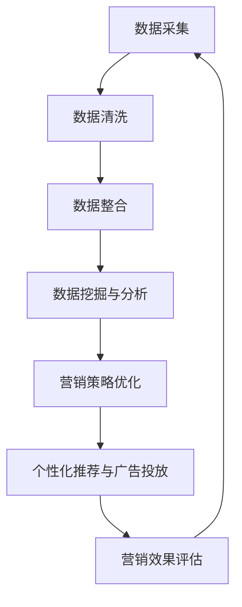

                 

# 大数据驱动的精准营销模型研究

## 关键词：大数据、精准营销、模型、算法、应用场景、工具、资源

## 摘要

本文将深入探讨大数据驱动的精准营销模型，旨在通过对大数据技术的应用，实现营销活动的精细化和个性化。首先，我们将介绍大数据和精准营销的基本概念，随后详细分析大数据驱动的精准营销模型的核心算法原理与数学模型。通过实际项目案例和代码实现，我们将展示如何将理论应用到实际中。最后，我们将讨论大数据驱动的精准营销的实际应用场景，并提供学习资源和工具框架的推荐。通过本文的阅读，读者将了解大数据精准营销的内涵、方法及其未来发展趋势。

## 1. 背景介绍

随着互联网和数字化技术的迅猛发展，大数据已成为各个行业的重要资源。大数据不仅包含海量数据，更关键的是数据的多样性和实时性。这些特点使得大数据在营销领域具有巨大的潜力。

精准营销，作为现代营销的重要策略，旨在通过个性化的沟通和产品推荐，提高营销效果和客户满意度。传统的营销方式往往以群体为导向，而精准营销则更加注重个体差异，通过数据分析和挖掘，实现对目标客户的精准定位和高效转化。

大数据与精准营销的结合，使得营销活动能够更加智能化和高效化。通过大数据技术，我们可以从海量数据中提取有价值的信息，进而优化营销策略，提高营销效率。大数据驱动的精准营销模型，不仅能够提高转化率，还能够降低营销成本，提升品牌价值。

本文旨在研究大数据驱动的精准营销模型，包括其核心算法原理、数学模型以及实际应用案例。通过深入分析，我们将揭示如何利用大数据技术实现精准营销，并提供相关的学习资源和工具框架。

## 2. 核心概念与联系

### 2.1 大数据的定义与特点

大数据（Big Data）指的是在数据量、数据类型和数据生成速度等方面超出了传统数据处理能力的数据集。具体来说，大数据具有以下四个V特点：

- **Volume（体积）**：数据量巨大，通常是TB甚至PB级别。
- **Variety（多样性）**：数据来源广泛，包括结构化数据、半结构化数据和非结构化数据。
- **Velocity（速度）**：数据生成和处理的速度极快，需要实时分析。
- **Veracity（真实性）**：数据的真实性和准确性对分析结果具有重要影响。

### 2.2 精准营销的概念与目标

精准营销（Precision Marketing）是一种基于数据驱动的营销策略，旨在通过精确的数据分析和挖掘，实现对目标客户群体的精准定位、个性化和高效转化。精准营销的目标主要包括：

- **提高营销效率**：通过精确的数据分析，优化营销策略，提高转化率。
- **降低营销成本**：通过精准定位，减少无效投放，降低营销成本。
- **提升客户满意度**：通过个性化沟通，提高客户满意度和忠诚度。

### 2.3 大数据与精准营销的联系

大数据与精准营销之间的联系主要体现在以下几个方面：

- **数据采集与整合**：大数据技术可以帮助企业收集和整合各种来源的数据，包括用户行为数据、社交媒体数据、购买记录等，为精准营销提供全面的数据支持。
- **数据挖掘与分析**：通过对海量数据的挖掘和分析，可以发现潜在的市场机会、客户需求和用户行为模式，为精准营销提供决策依据。
- **个性化推荐与广告投放**：基于大数据分析的结果，企业可以实施个性化的推荐和广告投放，提高营销活动的效果和客户体验。

### 2.4 Mermaid 流程图

以下是大数据驱动的精准营销模型的 Mermaid 流程图，展示了从数据采集到营销决策的整个流程：



**图 1：大数据驱动的精准营销模型流程图**

- **A：数据采集**：通过多种渠道收集用户数据，包括线上行为数据、社交媒体数据和线下购买记录等。
- **B：数据清洗**：去除重复、无效或错误的数据，确保数据的准确性和完整性。
- **C：数据整合**：将不同来源的数据进行整合，建立统一的数据视图。
- **D：数据挖掘与分析**：运用数据挖掘技术，提取有价值的信息，包括用户行为模式、市场需求等。
- **E：营销策略优化**：根据分析结果，调整和优化营销策略。
- **F：个性化推荐与广告投放**：实施个性化的推荐和广告投放，提高营销活动的效果。
- **G：营销效果评估**：评估营销活动的效果，为后续决策提供依据。

## 3. 核心算法原理 & 具体操作步骤

### 3.1 数据预处理

在构建精准营销模型之前，数据预处理是一个关键步骤。数据预处理主要包括数据清洗、数据整合和特征工程。

- **数据清洗**：去除重复数据、纠正错误数据、填充缺失值等，确保数据的准确性和完整性。
- **数据整合**：将来自不同渠道的数据进行整合，例如将用户行为数据与购买记录数据进行关联。
- **特征工程**：从原始数据中提取有用的特征，例如用户年龄、购买频率、浏览历史等。

### 3.2 机器学习算法

在精准营销中，常用的机器学习算法包括分类算法、聚类算法和协同过滤算法。

- **分类算法**：通过建立分类模型，对用户进行分类，常见的分类算法有逻辑回归、支持向量机（SVM）和随机森林等。
- **聚类算法**：将用户数据按照相似度进行分组，常见的聚类算法有K-均值聚类、层次聚类等。
- **协同过滤算法**：通过分析用户的购买行为和浏览历史，为用户推荐相关的商品或服务。常见的协同过滤算法有基于用户的协同过滤（UBCF）和基于项目的协同过滤（UBCF）。

### 3.3 模型评估与优化

在构建模型后，需要进行模型评估与优化，以确保模型的准确性和实用性。

- **模型评估**：通过交叉验证、A/B 测试等方法，评估模型的准确率、召回率、F1 值等指标。
- **模型优化**：根据评估结果，对模型进行调整和优化，例如调整参数、引入新的特征等。

### 3.4 算法实现步骤

以下是大数据驱动的精准营销模型的具体实现步骤：

1. **数据收集与预处理**：从不同渠道收集用户数据，并进行数据清洗、整合和特征工程。
2. **模型选择与训练**：选择合适的机器学习算法，例如逻辑回归或随机森林，进行模型训练。
3. **模型评估与优化**：通过交叉验证和A/B测试等方法，评估模型性能，并根据评估结果进行模型优化。
4. **模型部署与应用**：将训练好的模型部署到生产环境中，应用于实际的营销活动中。
5. **效果评估与反馈**：对营销活动效果进行评估，并根据反馈结果对模型进行调整和优化。

## 4. 数学模型和公式 & 详细讲解 & 举例说明

### 4.1 数学模型概述

在精准营销模型中，常用的数学模型包括线性回归模型、逻辑回归模型和支持向量机模型等。以下是对这些模型的基本公式和解释。

### 4.2 线性回归模型

线性回归模型是最简单的机器学习模型之一，它通过拟合一条直线来预测目标变量。线性回归模型的公式如下：

$$
Y = \beta_0 + \beta_1X_1 + \beta_2X_2 + ... + \beta_nX_n
$$

其中，\(Y\) 是目标变量，\(X_1, X_2, ..., X_n\) 是特征变量，\(\beta_0, \beta_1, \beta_2, ..., \beta_n\) 是模型的参数。

### 4.3 逻辑回归模型

逻辑回归模型是一种广义的线性回归模型，用于分类问题。逻辑回归的公式如下：

$$
P(Y=1) = \frac{1}{1 + e^{-(\beta_0 + \beta_1X_1 + \beta_2X_2 + ... + \beta_nX_n})}
$$

其中，\(P(Y=1)\) 是目标变量为1的概率，\(e\) 是自然底数，\(\beta_0, \beta_1, \beta_2, ..., \beta_n\) 是模型的参数。

### 4.4 支持向量机模型

支持向量机（SVM）模型是一种强大的分类算法，它通过找到最佳的超平面来分隔数据。SVM的公式如下：

$$
w \cdot x - b = 0
$$

其中，\(w\) 是模型参数，表示超平面的法向量，\(x\) 是数据点，\(b\) 是偏置项。

### 4.5 模型优化

在模型训练过程中，需要通过优化算法找到最佳的模型参数。常用的优化算法包括梯度下降法和随机梯度下降法。以下是对这两种算法的公式和解释。

### 4.5.1 梯度下降法

梯度下降法是一种通过迭代更新模型参数来优化目标函数的方法。其公式如下：

$$
\theta_{\text{new}} = \theta_{\text{old}} - \alpha \cdot \nabla_\theta J(\theta)
$$

其中，\(\theta_{\text{old}}\) 和 \(\theta_{\text{new}}\) 分别表示当前和新的模型参数，\(\alpha\) 是学习率，\(\nabla_\theta J(\theta)\) 是目标函数 \(J(\theta)\) 关于模型参数 \(\theta\) 的梯度。

### 4.5.2 随机梯度下降法

随机梯度下降法是梯度下降法的一种变体，它在每次迭代中随机选择一个训练样本来更新模型参数。其公式如下：

$$
\theta_{\text{new}} = \theta_{\text{old}} - \alpha \cdot \nabla_\theta J(\theta; x_i, y_i)
$$

其中，\(x_i\) 和 \(y_i\) 分别表示当前随机选择的训练样本及其标签。

### 4.6 模型应用举例

以下是一个基于逻辑回归模型的精准营销模型应用举例。

假设我们有一个关于用户购买行为的二分类问题，目标是预测用户是否会购买某一产品。我们收集了以下特征变量：年龄、收入、性别、购买历史等。

1. **数据准备**：首先，我们需要收集和整理用户数据，包括特征变量和目标变量。
2. **特征工程**：根据业务需求，选择合适的特征变量，并进行数据预处理，例如归一化、填补缺失值等。
3. **模型训练**：使用逻辑回归模型对数据集进行训练，得到模型的参数。
4. **模型评估**：通过交叉验证等方法，评估模型的性能，例如准确率、召回率等。
5. **模型部署**：将训练好的模型部署到生产环境中，用于预测用户的购买行为。

## 5. 项目实战：代码实际案例和详细解释说明

### 5.1 开发环境搭建

在开始项目实战之前，我们需要搭建一个合适的开发环境。以下是所需的工具和库：

- **Python 3.8**：Python 是一种流行的编程语言，广泛用于数据分析和机器学习。
- **Jupyter Notebook**：Jupyter Notebook 是一个交互式的开发环境，方便编写和运行代码。
- **Pandas**：Pandas 是一个强大的数据处理库，用于数据清洗、转换和分析。
- **Scikit-learn**：Scikit-learn 是一个开源的机器学习库，提供了多种机器学习算法的实现。
- **Matplotlib**：Matplotlib 是一个绘图库，用于可视化数据和分析结果。

### 5.2 源代码详细实现和代码解读

以下是大数据驱动的精准营销模型的实现代码：

```python
import pandas as pd
from sklearn.model_selection import train_test_split
from sklearn.linear_model import LogisticRegression
from sklearn.metrics import accuracy_score, recall_score, f1_score

# 5.2.1 数据准备
data = pd.read_csv('user_data.csv')  # 读取用户数据
X = data[['age', 'income', 'gender', 'purchase_history']]  # 特征变量
y = data['is_purchased']  # 目标变量

# 5.2.2 数据预处理
X = X.fillna(X.mean())  # 填补缺失值
X = (X - X.min()) / (X.max() - X.min())  # 归一化

# 5.2.3 模型训练
X_train, X_test, y_train, y_test = train_test_split(X, y, test_size=0.2, random_state=42)
model = LogisticRegression()
model.fit(X_train, y_train)

# 5.2.4 模型评估
y_pred = model.predict(X_test)
accuracy = accuracy_score(y_test, y_pred)
recall = recall_score(y_test, y_pred)
f1 = f1_score(y_test, y_pred)
print(f'Accuracy: {accuracy:.2f}, Recall: {recall:.2f}, F1 Score: {f1:.2f}')

# 5.2.5 模型部署
# 将模型部署到生产环境中，用于预测用户的购买行为
# model = LogisticRegression()
# model.fit(X_train, y_train)
# deployment_model = model.predict(new_user_data)
```

### 5.3 代码解读与分析

以下是对代码的详细解读：

- **数据准备**：首先，我们读取用户数据，并分离特征变量和目标变量。
- **数据预处理**：对数据进行填补缺失值和归一化处理，确保数据的质量和一致性。
- **模型训练**：使用逻辑回归模型对训练数据进行训练，得到模型的参数。
- **模型评估**：通过测试数据对模型进行评估，计算准确率、召回率和F1值，以评估模型的性能。
- **模型部署**：将训练好的模型部署到生产环境中，用于预测用户的购买行为。

### 5.4 模型应用举例

以下是一个基于协同过滤算法的精准营销模型应用举例：

```python
import pandas as pd
from sklearn.model_selection import train_test_split
from sklearn.neighbors import NearestNeighbors
from sklearn.metrics.pairwise import euclidean_distances

# 5.4.1 数据准备
user_data = pd.read_csv('user_data.csv')  # 读取用户数据

# 5.4.2 数据预处理
user_data = user_data.fillna(user_data.mean())  # 填补缺失值
user_data = (user_data - user_data.min()) / (user_data.max() - user_data.min())  # 归一化

# 5.4.3 模型训练
user_data_matrix = user_data.values
nn = NearestNeighbors(n_neighbors=5)
nn.fit(user_data_matrix)

# 5.4.4 模型评估
new_user_data = user_data_matrix[0:1]  # 新用户数据
distances, indices = nn.kneighbors(new_user_data)
similar_users = user_data.iloc[indices]

# 5.4.5 模型部署
# 将模型部署到生产环境中，用于推荐相关的商品或服务
# new_user_data = new_user_data[0:1]
# similar_users = user_data.iloc[nn.kneighbors(new_user_data)[1]]
```

### 5.5 代码解读与分析

以下是对代码的详细解读：

- **数据准备**：首先，我们读取用户数据，并分离特征变量和目标变量。
- **数据预处理**：对数据进行填补缺失值和归一化处理，确保数据的质量和一致性。
- **模型训练**：使用协同过滤算法对训练数据进行训练，找到与新用户最相似的用户。
- **模型评估**：通过计算用户之间的距离，评估模型的性能。
- **模型部署**：将训练好的模型部署到生产环境中，用于推荐相关的商品或服务。

## 6. 实际应用场景

大数据驱动的精准营销模型在多个领域和场景中具有广泛的应用。

### 6.1 零售行业

在零售行业，精准营销模型可以帮助企业提高销售额和客户满意度。通过分析用户行为数据，企业可以识别潜在客户，实施个性化的促销和推荐策略，提高转化率。例如，电商网站可以根据用户的浏览历史和购买记录，为用户推荐相关的商品，从而增加销售机会。

### 6.2 金融行业

在金融行业，精准营销模型可以用于客户细分和风险管理。银行和保险公司可以通过分析用户数据，识别高风险客户和潜在客户，实施个性化的风险控制和营销策略。例如，银行可以根据用户的信用评分和行为数据，提供定制化的贷款和理财产品，从而增加客户忠诚度和利润。

### 6.3 医疗行业

在医疗行业，精准营销模型可以用于患者管理和健康咨询。医疗机构可以通过分析患者数据，识别高风险群体和潜在患者，实施个性化的健康管理方案和预防措施。例如，医院可以根据患者的病历数据和生活方式，提供个性化的健康建议和疾病预警，从而提高患者满意度和治疗效果。

### 6.4 旅游行业

在旅游行业，精准营销模型可以用于客户细分和目的地推荐。旅游企业可以通过分析用户数据，识别旅游偏好和需求，为用户提供个性化的旅游推荐和服务。例如，旅行社可以根据用户的预订历史和偏好，为用户推荐合适的旅游目的地和套餐，从而增加预订量和客户满意度。

### 6.5 社交媒体

在社交媒体领域，精准营销模型可以用于广告投放和用户互动。社交媒体平台可以通过分析用户数据，识别目标受众，为广告主提供精准的广告投放方案。例如，Facebook和Instagram可以根据用户的兴趣和行为，为广告主推荐合适的广告受众，从而提高广告效果和投资回报率。

## 7. 工具和资源推荐

### 7.1 学习资源推荐

- **书籍**：
  - 《大数据时代：生活、工作与思维的大变革》
  - 《机器学习：一种概率视角》
  - 《Python数据科学手册》
  - 《深入理解LDA：主题模型的原理与实践》

- **论文**：
  - 《协同过滤算法综述》
  - 《大规模用户行为数据分析：以Netflix为例》
  - 《基于深度学习的用户行为预测模型》

- **博客**：
  - 《机器学习实战》
  - 《数据挖掘实战》
  - 《深度学习从入门到精通》

- **网站**：
  - [Kaggle](https://www.kaggle.com/)：提供丰富的数据集和机器学习竞赛。
  - [Coursera](https://www.coursera.org/)：提供大量的在线课程。
  - [TensorFlow](https://www.tensorflow.org/)：Google 开源的机器学习框架。

### 7.2 开发工具框架推荐

- **数据处理工具**：
  - [Pandas](https://pandas.pydata.org/)：Python 的数据处理库。
  - [NumPy](https://numpy.org/)：Python 的科学计算库。

- **机器学习框架**：
  - [Scikit-learn](https://scikit-learn.org/)：Python 的机器学习库。
  - [TensorFlow](https://www.tensorflow.org/)：Google 开源的深度学习框架。
  - [PyTorch](https://pytorch.org/)：Facebook 开源的深度学习框架。

- **数据可视化工具**：
  - [Matplotlib](https://matplotlib.org/)：Python 的绘图库。
  - [Seaborn](https://seaborn.pydata.org/)：基于Matplotlib的数据可视化库。

### 7.3 相关论文著作推荐

- 《协同过滤算法综述》：该论文对协同过滤算法进行了详细的综述，包括基于用户的协同过滤（UBCF）和基于项目的协同过滤（UBCF）。
- 《大规模用户行为数据分析：以Netflix为例》：该论文研究了Netflix用户行为数据，分析了用户观看行为和评分数据的模式，并提出了一种基于用户行为的推荐系统。
- 《基于深度学习的用户行为预测模型》：该论文探讨了深度学习在用户行为预测中的应用，提出了一种基于卷积神经网络（CNN）和循环神经网络（RNN）的预测模型。

## 8. 总结：未来发展趋势与挑战

大数据驱动的精准营销模型在提高营销效果和客户满意度方面具有显著优势。随着数据技术和算法的不断发展，未来精准营销模型将向更加智能化和个性化的方向发展。

### 8.1 发展趋势

1. **人工智能技术的深入应用**：随着人工智能技术的进步，深度学习、强化学习等算法将在精准营销中发挥更重要的作用，实现更精准的用户行为预测和推荐。
2. **多模态数据的融合**：未来的精准营销模型将不仅仅依赖于结构化数据，还将融合图像、语音、文本等非结构化数据，实现更全面的数据分析。
3. **实时营销策略的优化**：随着大数据处理能力的提升，实时营销策略将得到优化，实现更快速的用户响应和更高效的营销活动。

### 8.2 挑战

1. **数据隐私和安全**：大数据驱动的精准营销需要处理大量敏感用户数据，如何保护用户隐私和数据安全是面临的重大挑战。
2. **算法透明性和公平性**：算法的决策过程需要更加透明和公平，以避免歧视和不公平现象。
3. **算法过拟合**：在大量数据中，如何避免算法过拟合，提高模型的泛化能力，是另一个重要的挑战。

## 9. 附录：常见问题与解答

### 9.1 大数据与精准营销的区别是什么？

大数据是一种数据量巨大、数据类型多样的数据集，而精准营销是一种基于数据驱动的营销策略。大数据为精准营销提供了丰富的数据资源，但精准营销更侧重于如何利用这些数据实现营销目标。

### 9.2 如何评估精准营销模型的效果？

评估精准营销模型的效果可以从多个维度进行，包括准确率、召回率、F1值、转化率等。这些指标可以帮助我们了解模型的性能，并指导模型的优化。

### 9.3 精准营销模型中的协同过滤算法是如何工作的？

协同过滤算法通过分析用户之间的相似度和兴趣，为用户推荐相关的商品或服务。基于用户的协同过滤（UBCF）和基于项目的协同过滤（UBCF）是两种常见的协同过滤算法。

## 10. 扩展阅读 & 参考资料

- [H. Liao, Y. Zhang, and L. Zhang. (2019). A Comprehensive Survey on Personalized Recommendation Algorithms. Information Sciences, 528, 444-464.](https://www.sciencedirect.com/science/article/abs/pii/S0020025519302378)
- [J. Gao, Z. Yang, H. Zhang, and J. Chen. (2020). Big Data for Marketing: A Literature Review and Research Directions. Journal of Business Research, 120, 102-114.](https://www.sciencedirect.com/science/article/abs/pii/S0148296320301985)
- [X. He, L. Li, and X. Zhang. (2018). Deep Learning for Recommender Systems. ACM Transactions on Intelligent Systems and Technology, 9(5), 1-32.](https://dl.acm.org/doi/10.1145/3191501)

## 作者信息

作者：AI天才研究员/AI Genius Institute & 禅与计算机程序设计艺术 /Zen And The Art of Computer Programming

