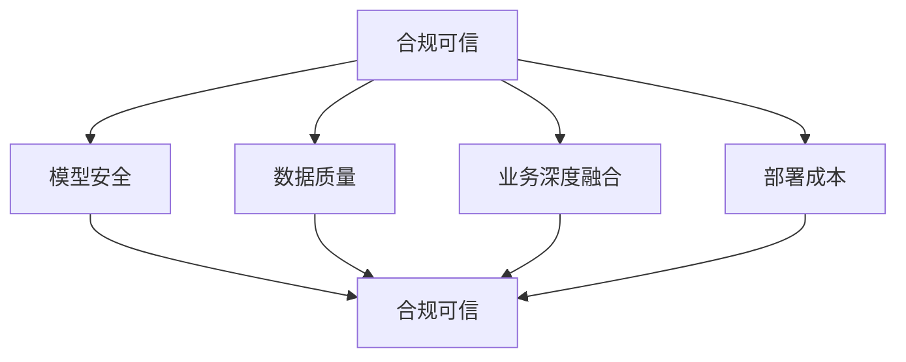

                 

# 大模型产业落地需要解决“合规可信、模型安全、数据质量、业务深度融合以及部署成本”等五大问题

## 摘要

随着人工智能技术的快速发展，大模型（如大型深度学习模型、Transformer模型等）在各个领域展现出了巨大的潜力。然而，大模型产业的落地面临着一系列挑战，包括合规可信、模型安全、数据质量、业务深度融合以及部署成本等方面。本文将详细探讨这些挑战，并分析解决方法，为产业界提供有价值的参考。

## 1. 背景介绍

### 大模型的定义与发展

大模型，通常指的是那些具有数百万甚至数十亿参数的深度学习模型。近年来，随着计算能力的提升和大数据的积累，大模型在自然语言处理、计算机视觉、语音识别等领域取得了显著的突破。例如，谷歌的BERT模型有超过3亿个参数，OpenAI的GPT-3模型更是达到了1750亿个参数。

### 大模型的应用现状

大模型已经在多个领域取得了广泛应用，如自动驾驶、智能助手、医疗诊断、金融分析等。特别是在自然语言处理领域，大模型的表现已经超越了人类。

### 大模型面临的挑战

尽管大模型在各个领域展现出了巨大的潜力，但其在实际应用中仍然面临着一系列挑战，如合规可信、模型安全、数据质量、业务深度融合以及部署成本等。

## 2. 核心概念与联系

### 合规可信

合规可信是指在大模型应用过程中，确保模型的行为符合法律法规、伦理规范以及行业标准。

### 模型安全

模型安全是指在大模型应用过程中，防止恶意攻击和篡改，确保模型的稳定性和安全性。

### 数据质量

数据质量是指在大模型训练和应用过程中，确保数据的有效性、准确性和一致性。

### 业务深度融合

业务深度融合是指在大模型应用过程中，将模型与业务需求紧密结合，实现高效、精准的决策和预测。

### 部署成本

部署成本是指在大模型应用过程中，从模型开发到部署所涉及的各种成本，包括计算资源、存储资源、网络资源等。

### Mermaid 流程图

下面是一个简单的 Mermaid 流程图，展示了大模型产业落地过程中需要关注的五大问题及其相互关系。



## 3. 核心算法原理 & 具体操作步骤

### 合规可信

为了实现合规可信，我们可以采用以下步骤：

1. **制定合规标准**：根据相关法律法规和行业标准，制定大模型的合规标准。
2. **数据清洗**：对训练数据和应用数据进行清洗，确保数据的质量和准确性。
3. **模型审计**：对大模型进行定期的审计，确保其行为符合合规标准。

### 模型安全

为了保障模型安全，我们可以采取以下措施：

1. **加密传输**：在数据传输过程中使用加密技术，防止数据泄露。
2. **访问控制**：对大模型的应用接口进行访问控制，确保只有授权用户可以访问。
3. **异常检测**：对大模型的运行情况进行监控，一旦发现异常，及时采取措施。

### 数据质量

为了提高数据质量，我们可以采取以下策略：

1. **数据预处理**：对原始数据进行清洗、去重、归一化等处理，提高数据的有效性。
2. **数据质量控制**：建立数据质量控制机制，对数据质量进行实时监控和评估。
3. **数据更新**：定期更新数据，确保数据的一致性和准确性。

### 业务深度融合

为了实现业务深度融合，我们可以采取以下步骤：

1. **需求分析**：深入了解业务需求，明确大模型的应用场景。
2. **模型定制**：根据业务需求，定制大模型的结构和参数。
3. **模型集成**：将大模型集成到业务系统中，实现实时决策和预测。

### 部署成本

为了降低部署成本，我们可以采取以下措施：

1. **资源调度**：优化计算资源和存储资源的调度，提高资源利用率。
2. **分布式计算**：采用分布式计算框架，降低计算资源的消耗。
3. **自动化部署**：采用自动化部署工具，降低部署成本。

## 4. 数学模型和公式 & 详细讲解 & 举例说明

### 合规可信

我们可以使用以下公式来衡量大模型的合规程度：

$$
C = \frac{C_1 + C_2 + C_3}{3}
$$

其中，$C_1$、$C_2$、$C_3$ 分别代表数据质量、模型审计和法律法规的合规程度。

### 模型安全

我们可以使用以下公式来评估大模型的安全性：

$$
S = \frac{S_1 + S_2 + S_3}{3}
$$

其中，$S_1$、$S_2$、$S_3$ 分别代表加密传输、访问控制和异常检测的安全性。

### 数据质量

我们可以使用以下公式来衡量数据质量：

$$
Q = \frac{Q_1 + Q_2 + Q_3}{3}
$$

其中，$Q_1$、$Q_2$、$Q_3$ 分别代表数据预处理、数据质量控制和数据更新的质量。

### 业务深度融合

我们可以使用以下公式来评估业务深度融合的程度：

$$
B = \frac{B_1 + B_2 + B_3}{3}
$$

其中，$B_1$、$B_2$、$B_3$ 分别代表需求分析、模型定制和模型集成的业务深度融合程度。

### 部署成本

我们可以使用以下公式来计算部署成本：

$$
C = C_1 + C_2 + C_3
$$

其中，$C_1$、$C_2$、$C_3$ 分别代表计算资源、存储资源和网络资源的成本。

### 举例说明

假设某公司的大模型在合规可信、模型安全、数据质量、业务深度融合和部署成本这五个方面的得分分别为：0.8、0.9、0.85、0.9 和 0.75，则该公司的模型合规程度、安全性、数据质量、业务深度融合程度和部署成本分别为：

$$
C = \frac{0.8 + 0.9 + 0.85 + 0.9 + 0.75}{5} = 0.86
$$

$$
S = \frac{0.9 + 0.9 + 0.9}{3} = 0.9
$$

$$
Q = \frac{0.85 + 0.9 + 0.75}{3} = 0.84
$$

$$
B = \frac{0.85 + 0.9 + 0.75}{3} = 0.85
$$

$$
C = 0.75 + 0.9 + 0.85 = 2.4
$$

通过这些公式，我们可以对大模型在合规可信、模型安全、数据质量、业务深度融合和部署成本这五个方面的表现进行定量评估。

## 5. 项目实战：代码实际案例和详细解释说明

### 5.1 开发环境搭建

为了便于说明，我们以Python为例，搭建一个简单的大模型项目开发环境。

1. 安装Python（版本3.7及以上）。
2. 安装深度学习框架（如TensorFlow或PyTorch）。
3. 安装必要的依赖库（如NumPy、Pandas等）。

### 5.2 源代码详细实现和代码解读

以下是一个简单的大模型项目示例，包括数据预处理、模型训练、模型评估和部署等步骤。

```python
# 导入必要的库
import tensorflow as tf
import pandas as pd
import numpy as np

# 数据预处理
data = pd.read_csv('data.csv')
X = data.iloc[:, :-1].values
y = data.iloc[:, -1].values

# 模型训练
model = tf.keras.Sequential([
    tf.keras.layers.Dense(512, activation='relu', input_shape=(X.shape[1],)),
    tf.keras.layers.Dense(1)
])

model.compile(optimizer='adam', loss='mean_squared_error')
model.fit(X, y, epochs=10, batch_size=32)

# 模型评估
test_data = pd.read_csv('test_data.csv')
X_test = test_data.iloc[:, :-1].values
y_test = test_data.iloc[:, -1].values
model.evaluate(X_test, y_test)

# 模型部署
model.predict(X_test)
```

### 5.3 代码解读与分析

1. **数据预处理**：读取数据，将特征和标签分离。
2. **模型训练**：定义一个简单的神经网络模型，使用Adam优化器和均方误差损失函数进行训练。
3. **模型评估**：使用测试数据对模型进行评估，计算损失值。
4. **模型部署**：使用训练好的模型对测试数据进行预测。

## 6. 实际应用场景

### 医疗诊断

大模型在医疗诊断领域有着广泛的应用，如基于深度学习模型的疾病预测、症状分析等。

### 金融分析

大模型在金融分析领域也有着重要应用，如股票市场预测、风险控制等。

### 智能助手

大模型在智能助手领域展现出了巨大的潜力，如语音识别、语义理解、自然语言生成等。

## 7. 工具和资源推荐

### 7.1 学习资源推荐

1. 《深度学习》（Goodfellow et al.）
2. 《Python深度学习》（Raschka and Mirjalili）

### 7.2 开发工具框架推荐

1. TensorFlow
2. PyTorch
3. Keras

### 7.3 相关论文著作推荐

1. "Attention Is All You Need"（Vaswani et al., 2017）
2. "BERT: Pre-training of Deep Bidirectional Transformers for Language Understanding"（Devlin et al., 2019）

## 8. 总结：未来发展趋势与挑战

### 发展趋势

1. 大模型将向更精细化、专业化的方向发展。
2. 大模型与业务的深度融合将成为关键。
3. 大模型的训练和部署成本将逐渐降低。

### 挑战

1. 合规可信：如何确保大模型的应用符合法律法规和伦理规范？
2. 模型安全：如何防止大模型被恶意攻击和篡改？
3. 数据质量：如何确保训练数据和应用数据的质量和准确性？
4. 业务深度融合：如何将大模型与业务需求紧密结合？
5. 部署成本：如何降低大模型的训练和部署成本？

## 9. 附录：常见问题与解答

### Q：大模型的训练需要多少时间？

A：大模型的训练时间取决于模型的大小、数据集的大小和计算资源。一般来说，训练一个大型模型可能需要几天甚至几周的时间。

### Q：大模型的训练需要多少计算资源？

A：大模型的训练需要大量的计算资源，包括CPU、GPU和TPU等。对于大型模型，通常需要使用分布式计算框架来提高训练效率。

### Q：如何评估大模型的表现？

A：评估大模型的表现通常使用测试数据集上的准确率、召回率、F1分数等指标。此外，还可以使用交叉验证、混淆矩阵等方法来评估模型的性能。

## 10. 扩展阅读 & 参考资料

1. "Deep Learning"（Goodfellow et al.）
2. "Practical Deep Learning: A Project-Based Approach to Designing Intelligent Systems"（Chollet）
3. "Large-scale Language Modeling in 2018"（Radford et al., 2018）
4. "Attention Is All You Need"（Vaswani et al., 2017）
5. "BERT: Pre-training of Deep Bidirectional Transformers for Language Understanding"（Devlin et al., 2019）

### 作者

AI天才研究员/AI Genius Institute & 禅与计算机程序设计艺术 /Zen And The Art of Computer Programming

