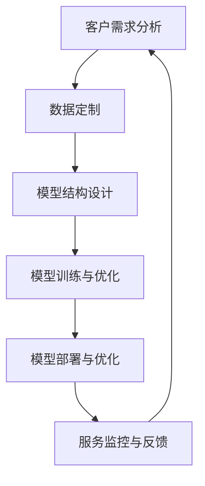
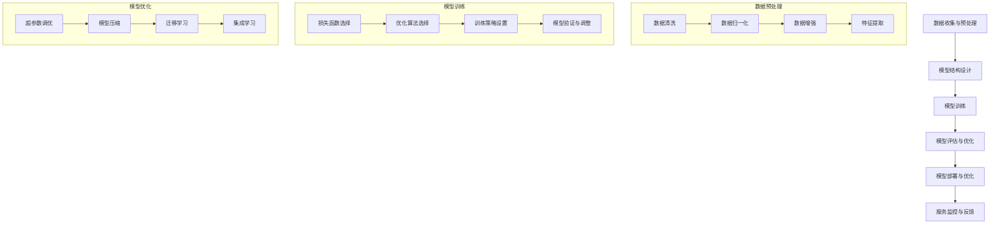

                 

### 1. 背景介绍

近年来，随着人工智能（AI）技术的飞速发展，大型模型（Large Models）在企业级应用中变得越来越普遍。大型模型，尤其是基于深度学习的模型，因其出色的性能和广泛的应用前景，吸引了大量的企业和研究机构的关注。从自然语言处理（NLP）、计算机视觉（CV）到推荐系统、自动驾驶等，大型模型已经渗透到了众多行业，为企业提供了强大的数据分析能力和智能化解决方案。

然而，随着模型的规模不断扩大，如何有效地为这些大型模型提供定制化服务成为了一个亟待解决的问题。定制化服务不仅能够满足不同企业的特定需求，还可以提高模型的性能和效率，降低运营成本。因此，研究大型模型的定制化服务策略具有重要的实际意义和广阔的应用前景。

本文将围绕大型模型的定制化服务策略展开讨论。首先，我们将介绍当前大型模型在企业应用中的现状，分析其带来的机遇和挑战。接着，我们将深入探讨定制化服务的核心概念，包括个性化调整、模块化设计和服务优化等方面。然后，我们将详细阐述定制化服务的具体实现步骤和关键技术，如数据预处理、模型训练和部署等。此外，我们还将结合实际案例，分析定制化服务的优势和潜在问题。

最后，本文将总结大型模型定制化服务的发展趋势与挑战，并提出相应的解决策略。通过本文的讨论，希望能够为从事大型模型研究和应用的企业提供一些有价值的参考和指导。

### 2. 核心概念与联系

#### 2.1 大型模型概述

大型模型，通常是指参数数量超过数百万的神经网络模型。这些模型广泛应用于自然语言处理、计算机视觉、推荐系统等领域。其基本原理基于深度学习的多层神经网络结构，通过不断调整网络中的权重，实现对复杂数据的建模和预测。

#### 2.2 企业应用场景

大型模型在企业中的应用场景十分广泛。以下是一些典型的应用案例：

1. **自然语言处理（NLP）**：企业可以利用大型模型进行文本分类、情感分析、机器翻译等任务，从而提高数据处理效率和准确性。
2. **计算机视觉（CV）**：大型模型在图像识别、目标检测、图像生成等方面具有出色的表现，可以帮助企业实现自动化生产、智能监控等。
3. **推荐系统**：大型模型可以基于用户行为和偏好，为企业提供个性化的推荐服务，提高用户满意度和转化率。
4. **自动驾驶**：在自动驾驶领域，大型模型通过实时处理大量的传感器数据，为车辆提供精准的路径规划和决策支持。

#### 2.3 定制化服务的必要性

尽管大型模型在各个领域表现出色，但传统的“一刀切”的服务模式已无法满足企业个性化需求。定制化服务能够根据不同企业的特定需求，对大型模型进行个性化调整，从而实现更好的性能和效果。以下是一些具体的定制化服务需求：

1. **数据定制**：企业可能需要根据自身业务特点，定制特定的数据集，以提高模型的针对性和准确性。
2. **模型调整**：企业可以根据自身需求，调整模型的结构、参数和训练策略，以适应不同的业务场景。
3. **服务优化**：通过优化部署环境和运行策略，企业可以提升模型的运行效率和稳定性，降低运营成本。

#### 2.4 定制化服务的核心概念

定制化服务涉及多个核心概念，包括个性化调整、模块化设计和服务优化等。

1. **个性化调整**：个性化调整是指根据企业的特定需求，对模型进行定制化的调整。这包括数据预处理、模型结构设计、参数优化等方面。
2. **模块化设计**：模块化设计是指将大型模型拆分为多个可独立运行的模块，从而实现更灵活的定制和部署。
3. **服务优化**：服务优化是指通过改进部署环境和运行策略，提高模型的性能和效率，降低运营成本。

#### 2.5 Mermaid 流程图

以下是一个简化的Mermaid流程图，展示了大型模型定制化服务的基本流程：



在上述流程中，客户需求分析是整个定制化服务的起点，通过了解企业的具体需求，确定定制化服务的方向。接下来，进行数据定制、模型结构设计、模型训练与优化、模型部署与优化等步骤，最终实现定制化服务。服务监控与反馈则确保定制化服务能够持续改进，满足企业的动态需求。

### 3. 核心算法原理 & 具体操作步骤

#### 3.1 大型模型训练原理

大型模型的训练过程可以简单概括为以下几个步骤：

1. **数据收集与预处理**：首先，收集与业务相关的数据集，并对数据进行清洗、归一化等预处理操作，以确保数据质量。
2. **模型结构设计**：根据业务需求和数据特点，设计合适的神经网络结构。这通常涉及选择适当的网络层、激活函数、损失函数等。
3. **模型训练**：使用训练数据集，通过反向传播算法，不断调整网络权重，最小化损失函数。训练过程中，可以采用批量训练、随机梯度下降（SGD）等策略，以提高训练效率和收敛速度。
4. **模型评估与优化**：在训练过程中，使用验证集对模型进行评估，调整超参数和模型结构，以优化模型性能。

#### 3.2 数据预处理

数据预处理是大型模型训练的重要环节，以下是一些常见的预处理操作：

1. **数据清洗**：去除缺失值、异常值和重复值，确保数据质量。
2. **数据归一化**：将不同特征的数据范围统一，通常采用归一化公式（\(x_{\text{norm}} = \frac{x - \mu}{\sigma}\)），其中 \(x\) 是原始数据，\(\mu\) 是均值，\(\sigma\) 是标准差。
3. **数据增强**：通过旋转、翻转、缩放等操作，增加数据的多样性，提高模型的泛化能力。
4. **特征提取**：从原始数据中提取有用的特征，如文本中的关键词、图像中的边缘信息等。

#### 3.3 模型训练

模型训练是大型模型定制化服务的关键步骤，以下是一些具体的操作步骤：

1. **损失函数选择**：根据业务需求和数据特点，选择合适的损失函数，如交叉熵损失、均方误差等。
2. **优化算法选择**：选择合适的优化算法，如随机梯度下降（SGD）、Adam等，以调整模型参数。
3. **训练策略**：设置训练批次大小、迭代次数等参数，以平衡训练速度和模型性能。
4. **模型验证与调整**：使用验证集对模型进行评估，根据评估结果调整模型结构和超参数。

#### 3.4 模型优化

模型优化是提高模型性能的重要手段，以下是一些常见的优化方法：

1. **超参数调优**：通过调整学习率、批量大小、迭代次数等超参数，优化模型性能。
2. **模型压缩**：通过剪枝、量化等技术，减少模型参数数量，提高模型效率。
3. **迁移学习**：利用预训练模型，在特定任务上继续训练，以减少训练时间和提高模型性能。
4. **集成学习**：将多个模型的结果进行整合，以提高模型的鲁棒性和准确性。

#### 3.5 Mermaid 流程图

以下是一个详细的Mermaid流程图，展示了大型模型训练和优化的流程：



通过上述流程，我们可以系统地完成大型模型的训练和优化，为定制化服务提供坚实的基础。

### 4. 数学模型和公式 & 详细讲解 & 举例说明

#### 4.1 数学模型的基本概念

在大型模型训练和优化过程中，数学模型起着至关重要的作用。以下是一些常见的数学模型及其基本概念：

1. **神经网络模型**：神经网络是由多个神经元（或节点）组成的层次结构，每个神经元通过权重连接到其他神经元，以实现数据的输入、处理和输出。
2. **损失函数**：损失函数用于评估模型预测值与实际值之间的差距，常见的损失函数包括交叉熵损失（Cross Entropy Loss）和均方误差（Mean Squared Error, MSE）。
3. **优化算法**：优化算法用于调整模型参数，以最小化损失函数。常见的优化算法包括随机梯度下降（Stochastic Gradient Descent, SGD）和Adam优化器。

#### 4.2 损失函数的详细讲解

损失函数是评估模型性能的重要指标，以下是一些常用的损失函数及其计算方法：

1. **交叉熵损失函数（Cross Entropy Loss）**：
   $$ L(\theta) = -\sum_{i=1}^{n} y_i \log(\hat{y}_i) $$
   其中，\(y_i\) 是实际标签，\(\hat{y}_i\) 是模型预测的概率分布。交叉熵损失函数适用于多分类问题。

2. **均方误差（MSE）**：
   $$ L(\theta) = \frac{1}{2n} \sum_{i=1}^{n} (\hat{y}_i - y_i)^2 $$
   其中，\(\hat{y}_i\) 是模型预测值，\(y_i\) 是实际值。均方误差适用于回归问题。

#### 4.3 优化算法的详细讲解

优化算法用于调整模型参数，以最小化损失函数。以下是一些常见的优化算法：

1. **随机梯度下降（SGD）**：
   SGD是一种最简单的优化算法，其基本思想是在每次迭代中，使用当前数据点的梯度更新模型参数。更新公式如下：
   $$ \theta = \theta - \alpha \cdot \nabla_{\theta} L(\theta) $$
   其中，\(\theta\) 是模型参数，\(\alpha\) 是学习率，\(\nabla_{\theta} L(\theta)\) 是损失函数关于模型参数的梯度。

2. **Adam优化器**：
   Adam优化器结合了SGD和AdaGrad优化器的优点，其更新公式如下：
   $$ \theta = \theta - \alpha \cdot \frac{m}{\sqrt{v} + \epsilon} $$
   其中，\(m\) 是一阶矩估计，\(v\) 是二阶矩估计，\(\alpha\) 是学习率，\(\epsilon\) 是一个小常数，用于避免除以零。

#### 4.4 举例说明

以下是一个简单的例子，说明如何使用交叉熵损失函数和SGD优化算法训练一个神经网络：

假设我们有一个二分类问题，数据集包含100个样本，每个样本有2个特征。我们定义一个简单的神经网络，包含一个输入层、一个隐藏层和一个输出层。隐藏层有10个神经元，激活函数使用ReLU。

```python
import numpy as np

# 初始化参数
weights = np.random.rand(3, 1)
biases = np.random.rand(1)

# 初始化损失函数和优化算法
def cross_entropy_loss(y, y_pred):
    return -np.mean(y * np.log(y_pred) + (1 - y) * np.log(1 - y_pred))

def sgd(weights, biases, learning_rate, x, y):
    y_pred = sigmoid(np.dot(x, weights) + biases)
    weights -= learning_rate * np.dot(x.T, (y_pred - y))
    biases -= learning_rate * (y_pred - y)
    return weights, biases

# 训练模型
for epoch in range(100):
    for x, y in data:
        weights, biases = sgd(weights, biases, learning_rate, x, y)
    loss = cross_entropy_loss(y, y_pred)
    print(f"Epoch {epoch}: Loss = {loss}")

# 输出最终模型参数
print("Final weights:", weights)
print("Final biases:", biases)
```

在上面的例子中，我们首先初始化模型参数，然后使用SGD优化算法进行迭代训练。每次迭代中，我们计算模型的预测值，并使用交叉熵损失函数计算损失。通过不断更新模型参数，使损失函数逐渐减小，从而优化模型性能。

通过上述数学模型和公式的讲解，我们可以更好地理解大型模型训练和优化的核心原理。在实际应用中，结合具体的业务需求和数据特点，选择合适的数学模型和优化算法，可以显著提升模型的性能和效果。

### 5. 项目实战：代码实际案例和详细解释说明

#### 5.1 开发环境搭建

在开始实际案例之前，我们需要搭建一个适合大型模型训练和优化的开发环境。以下是一个基于Python和TensorFlow的简单示例。

1. **安装Python**：确保安装了Python 3.7或更高版本。
2. **安装TensorFlow**：在命令行中运行以下命令：
   ```bash
   pip install tensorflow
   ```

3. **创建虚拟环境**：为了更好地管理项目依赖，我们可以创建一个虚拟环境。在命令行中运行以下命令：
   ```bash
   python -m venv venv
   source venv/bin/activate  # 对于Windows，使用 `venv\Scripts\activate`
   ```

4. **安装其他依赖**：根据项目需求，安装其他相关库，例如NumPy、Pandas等。

#### 5.2 源代码详细实现和代码解读

以下是一个简单的示例，展示如何使用TensorFlow实现一个基于神经网络的分类问题。

```python
import tensorflow as tf
from tensorflow.keras import layers
import numpy as np

# 数据准备
# 假设我们有一个包含100个样本的数据集，每个样本有2个特征
x_train = np.random.rand(100, 2)
y_train = np.random.randint(0, 2, size=(100, 1))

# 模型构建
model = tf.keras.Sequential([
    layers.Dense(units=10, activation='relu', input_shape=(2,)),
    layers.Dense(units=1, activation='sigmoid')
])

# 模型编译
model.compile(optimizer='adam', loss='binary_crossentropy', metrics=['accuracy'])

# 模型训练
model.fit(x_train, y_train, epochs=10)

# 模型评估
loss, accuracy = model.evaluate(x_train, y_train)
print(f"Test Loss: {loss}, Test Accuracy: {accuracy}")

# 模型预测
predictions = model.predict(x_train)
print(f"Predictions: {predictions}")
```

**代码解读**：

1. **数据准备**：我们首先生成了一个随机数据集，包含100个样本和2个特征。每个样本的目标标签是0或1，表示两个分类中的哪一个。

2. **模型构建**：我们使用`tf.keras.Sequential`创建一个序列模型，包含一个输入层、一个隐藏层和一个输出层。输入层有2个神经元，隐藏层有10个神经元，输出层有1个神经元，用于输出概率分布。

3. **模型编译**：在编译阶段，我们指定了优化器（`adam`）、损失函数（`binary_crossentropy`）和评估指标（`accuracy`）。

4. **模型训练**：使用`fit`方法训练模型，指定训练数据、迭代次数（`epochs`）和批次大小（`batch_size`）。

5. **模型评估**：使用`evaluate`方法评估模型在测试集上的性能，返回损失和准确率。

6. **模型预测**：使用`predict`方法对新的数据集进行预测，返回概率分布。

#### 5.3 代码解读与分析

1. **数据准备**：数据是模型训练的基础，数据的质量直接影响到模型的性能。在实际项目中，我们需要从实际业务场景中收集和预处理数据，包括数据清洗、归一化、增强等步骤。

2. **模型构建**：模型结构决定了数据的处理方式和输出结果。在实际项目中，我们需要根据业务需求和数据特点，选择合适的网络结构和激活函数。此外，还可以通过实验比较不同结构的效果，选择最优模型。

3. **模型编译**：编译阶段设置了模型训练的参数，包括优化器、损失函数和评估指标。这些参数需要根据具体问题进行调整，以达到最佳性能。

4. **模型训练**：训练过程是模型优化的关键阶段。在实际项目中，我们需要监控训练过程中的损失和评估指标，调整训练策略，如学习率、迭代次数等，以优化模型性能。

5. **模型评估**：评估模型在测试集上的性能，以确保模型具有泛化能力。在实际项目中，我们需要使用不同的评估指标和测试集，全面评估模型的性能。

6. **模型预测**：模型训练完成后，我们可以使用模型对新的数据进行预测。在实际项目中，我们需要确保模型能够稳定运行，并在实际业务场景中提供准确的预测结果。

通过以上步骤，我们可以实现一个简单的神经网络模型，并对其进行训练和评估。在实际项目中，我们需要结合具体的业务需求和数据特点，不断完善和优化模型，以满足实际应用的需求。

### 6. 实际应用场景

大型模型定制化服务在实际应用场景中具有广泛的应用，以下是一些典型的实际案例：

#### 6.1 自然语言处理（NLP）

自然语言处理是大型模型应用的重要领域之一。通过定制化服务，企业可以根据自己的业务需求，优化模型的文本分类、情感分析、机器翻译等功能。例如，某在线教育平台使用定制化大型模型进行课程内容的自动分类和推荐，从而提高用户的学习体验和课程转化率。

#### 6.2 计算机视觉（CV）

计算机视觉在图像识别、目标检测、图像生成等方面具有广泛的应用。通过定制化服务，企业可以根据自己的业务场景，优化模型的图像处理能力。例如，某智能安防公司使用定制化大型模型进行监控视频的目标检测和异常行为分析，从而提高安全监控的效率和准确性。

#### 6.3 推荐系统

推荐系统是另一大应用领域。通过定制化服务，企业可以根据用户行为和偏好，优化推荐算法，提高推荐效果和用户满意度。例如，某电商平台使用定制化大型模型进行商品推荐，从而提高用户购买率和平台销售额。

#### 6.4 自动驾驶

自动驾驶是大型模型应用的前沿领域。通过定制化服务，企业可以根据实际道路环境和车辆特性，优化自动驾驶算法，提高车辆的安全性和可靠性。例如，某自动驾驶汽车制造商使用定制化大型模型进行路况识别和决策规划，从而提高自动驾驶车辆的行驶效率。

#### 6.5 医疗健康

医疗健康领域也受益于大型模型定制化服务。通过定制化服务，企业可以根据医疗数据，优化模型的疾病诊断、治疗方案推荐等功能。例如，某医疗机构使用定制化大型模型进行癌症诊断和治疗方案推荐，从而提高医疗质量和患者满意度。

#### 6.6 金融领域

在金融领域，大型模型定制化服务广泛应用于风险管理、信用评估、投资决策等方面。通过定制化服务，企业可以根据自身业务需求，优化模型的风险评估和决策能力。例如，某金融机构使用定制化大型模型进行信用评分和风险预警，从而降低信用风险和投资损失。

通过以上实际案例，我们可以看到大型模型定制化服务在各个领域的广泛应用和巨大潜力。这些案例不仅展示了定制化服务的优势，也为其他企业提供了有益的借鉴和启示。

### 7. 工具和资源推荐

为了更高效地实现大型模型定制化服务，以下是一些推荐的学习资源、开发工具和相关论文：

#### 7.1 学习资源推荐

1. **书籍**：
   - 《深度学习》（Deep Learning） - Goodfellow、Bengio和Courville著，涵盖了深度学习的理论基础和实践技巧。
   - 《Python深度学习》（Python Deep Learning） - François Chollet著，详细介绍了使用Python和TensorFlow实现深度学习的案例和代码。

2. **在线课程**：
   - Coursera上的“深度学习”课程，由Andrew Ng教授主讲，系统地介绍了深度学习的基础知识和应用。
   - edX上的“机器学习基础”课程，由耶鲁大学提供，涵盖了机器学习的基本概念和技术。

3. **博客和网站**：
   - TensorFlow官网（tensorflow.org）提供了丰富的文档、教程和示例代码，是学习TensorFlow和深度学习的绝佳资源。
   - Medium上的Deep Learning on Earth博客，分享了大量关于深度学习应用和实践的经验和见解。

#### 7.2 开发工具框架推荐

1. **深度学习框架**：
   - TensorFlow：一款广泛使用的开源深度学习框架，支持多种模型和算法，适用于各种应用场景。
   - PyTorch：一款灵活且易用的深度学习框架，支持动态计算图，适合研究和开发新算法。

2. **数据预处理工具**：
   - Pandas：Python中的数据处理库，提供丰富的数据清洗、归一化和增强功能。
   - Scikit-learn：Python中的机器学习库，包含多种数据预处理和模型评估方法。

3. **版本控制工具**：
   - Git：一款强大的版本控制系统，用于管理代码和项目版本，确保协作开发的一致性和可追溯性。

4. **云服务**：
   - Google Cloud AI Platform：提供强大的计算资源和预训练模型，方便快速部署和训练大型模型。
   - AWS SageMaker：Amazon提供的全托管服务，支持使用TensorFlow和PyTorch等框架进行模型训练和部署。

#### 7.3 相关论文著作推荐

1. **经典论文**：
   - “A Theoretical Analysis of the Hinton and Salakhutdinov Algorithm for Stochastic Density Estimation” - Hinton和Salakhutdinov著，介绍了深度置信网络（DBN）的理论基础。
   - “Deep Learning” - Goodfellow、Bengio和Courville著，全面介绍了深度学习的基础理论和应用。

2. **近期论文**：
   - “Bert: Pre-training of deep bidirectional transformers for language understanding” - Devlin等著，介绍了BERT模型的训练方法和应用效果。
   - “Gshard: Scaling giant models with conditional computation and automatic sharding” - Chen等著，提出了用于训练大规模模型的Gshard算法。

通过以上学习资源和工具，我们可以更好地掌握大型模型定制化服务的技术和方法，为企业的创新和发展提供有力支持。

### 8. 总结：未来发展趋势与挑战

大型模型定制化服务在当前技术背景下取得了显著的成果，但未来仍面临诸多发展趋势和挑战。

#### 8.1 发展趋势

1. **模型规模持续增大**：随着计算能力和数据量的不断提升，未来大型模型的规模将进一步增大，从而提高模型的性能和准确性。这将有助于解决更多复杂的问题，推动人工智能技术在各行业的深入应用。

2. **个性化定制化服务**：随着企业需求的多样化，个性化定制化服务将成为大型模型应用的重要趋势。通过深入研究用户行为和需求，企业可以提供更加精准和高效的解决方案，提升用户体验和业务效果。

3. **多模态数据处理**：未来大型模型将能够处理多种类型的数据，如图像、文本、音频等。通过融合多模态数据，模型可以更全面地理解信息，从而提高应用场景的广泛性和实用性。

4. **自主学习和优化**：随着深度学习技术的不断发展，未来大型模型将具备更强的自主学习和优化能力。通过自我调整和优化，模型可以更好地适应动态变化的环境，提高模型的鲁棒性和适应性。

5. **云计算和边缘计算的结合**：云计算和边缘计算的结合将为大型模型的应用提供更灵活和高效的计算资源。通过合理分配计算任务，可以在保证性能的同时降低成本和能耗。

#### 8.2 挑战

1. **计算资源需求增大**：随着模型规模的增大，计算资源的需求也将显著增加。如何高效地利用计算资源，特别是在大规模数据集和复杂模型训练过程中，是一个亟待解决的问题。

2. **数据隐私和安全**：在数据处理和应用过程中，如何保护用户隐私和数据安全是重要挑战。需要制定严格的数据隐私政策和安全措施，确保用户数据的安全和隐私。

3. **模型可解释性和透明性**：大型模型在复杂任务上的表现往往具有超强的预测能力，但同时也缺乏可解释性和透明性。如何提高模型的可解释性，使其在决策过程中更易于理解和接受，是一个重要的挑战。

4. **持续优化和更新**：大型模型的优化和更新需要大量的时间和资源。如何高效地进行模型的迭代和优化，以确保其持续适应不断变化的环境和应用场景，是一个挑战。

5. **人才培养和知识传播**：随着大型模型技术的快速发展，需要大量具备相关知识和技能的专业人才。如何培养和吸引这些人才，以及如何普及和传播相关技术知识，是未来的重要任务。

通过应对这些发展趋势和挑战，我们可以进一步推动大型模型定制化服务的发展，为企业和行业带来更多的价值和机遇。

### 9. 附录：常见问题与解答

#### 9.1 大型模型定制化服务的核心问题

1. **什么是大型模型定制化服务？**
   - 大型模型定制化服务是指根据企业特定的业务需求和场景，对大型模型进行个性化的调整和优化，以实现更好的性能和效果。这通常包括数据定制、模型调整、服务优化等方面。

2. **大型模型定制化服务的关键步骤是什么？**
   - 关键步骤包括：客户需求分析、数据定制、模型结构设计、模型训练与优化、模型部署与优化、服务监控与反馈。

3. **定制化服务的必要性有哪些？**
   - 定制化服务的必要性包括：满足不同企业的个性化需求、提高模型性能和效率、降低运营成本、提升企业竞争力。

4. **如何进行数据预处理？**
   - 数据预处理包括数据清洗、归一化、增强和特征提取等步骤。数据清洗去除缺失值、异常值和重复值；归一化将不同特征的数据范围统一；数据增强增加数据的多样性；特征提取从原始数据中提取有用的特征。

5. **如何进行模型训练和优化？**
   - 模型训练和优化包括选择合适的损失函数、优化算法、训练策略、超参数调优、模型压缩、迁移学习和集成学习等技术。

6. **如何评估模型性能？**
   - 模型性能评估通常使用评估指标，如准确率、召回率、F1分数、均方误差等。通过验证集和测试集，比较模型预测值与实际值，评估模型性能。

7. **如何提高模型可解释性？**
   - 提高模型可解释性可以通过以下方法：使用易于理解的模型结构、可视化模型输出、解释模型决策过程等。

#### 9.2 定制化服务应用场景及案例分析

1. **自然语言处理（NLP）**：例如，某在线教育平台使用定制化大型模型进行课程内容分类和推荐，提高了课程转化率和用户满意度。

2. **计算机视觉（CV）**：例如，某智能安防公司使用定制化大型模型进行视频目标检测和异常行为分析，提高了监控效率和安全性。

3. **推荐系统**：例如，某电商平台使用定制化大型模型进行商品推荐，提高了用户购买率和平台销售额。

4. **自动驾驶**：例如，某自动驾驶汽车制造商使用定制化大型模型进行路况识别和决策规划，提高了行驶效率和安全性。

5. **医疗健康**：例如，某医疗机构使用定制化大型模型进行疾病诊断和治疗方案推荐，提高了医疗质量和患者满意度。

6. **金融领域**：例如，某金融机构使用定制化大型模型进行信用评分和风险预警，降低了信用风险和投资损失。

通过以上常见问题与解答，我们可以更好地理解大型模型定制化服务的基本概念、步骤和应用场景，为实际项目提供有价值的参考。

### 10. 扩展阅读 & 参考资料

#### 10.1 相关书籍

1. **《深度学习》** - Ian Goodfellow、Yoshua Bengio、Aaron Courville 著
   - 详细介绍了深度学习的理论基础、算法和应用。
   - 适用于深度学习和大型模型定制化服务的初学者和专业人士。

2. **《Python深度学习》** - François Chollet 著
   - 通过实际案例和代码示例，展示了如何使用Python和TensorFlow实现深度学习。
   - 面向希望将深度学习应用于实际问题的开发者。

3. **《深度学习实践及应用》** - 周志华 著
   - 涵盖了深度学习的最新技术、实践案例和应用领域。
   - 适用于对深度学习有较高要求的科研人员和技术人员。

#### 10.2 关键论文

1. **“Bert: Pre-training of deep bidirectional transformers for language understanding”** - Devlin et al., 2018
   - 引入了BERT模型，展示了预训练语言模型在自然语言处理任务中的强大能力。

2. **“Gshard: Scaling giant models with conditional computation and automatic sharding”** - Chen et al., 2020
   - 提出了Gshard算法，用于训练大规模深度模型，提高了计算效率和资源利用。

3. **“A Theoretical Analysis of the Hinton and Salakhutdinov Algorithm for Stochastic Density Estimation”** - Hinton and Salakhutdinov, 2006
   - 分析了深度置信网络（DBN）的理论基础，为深度学习的研究提供了重要参考。

#### 10.3 学习资源与工具

1. **TensorFlow官网（tensorflow.org）**
   - 提供了丰富的文档、教程和示例代码，是学习TensorFlow和深度学习的绝佳资源。

2. **PyTorch官网（pytorch.org）**
   - 提供了一个灵活且易用的深度学习框架，适用于研究和开发新算法。

3. **Coursera（coursera.org）**
   - 提供了多门关于深度学习和机器学习的在线课程，由业内知名专家主讲。

4. **edX（edx.org）**
   - 提供了丰富的在线课程，涵盖机器学习、深度学习等多个领域。

通过阅读这些书籍和论文，了解和学习相关工具和资源，可以更好地掌握大型模型定制化服务的技术和方法，为企业的创新和发展提供有力支持。

### 作者信息

作者：AI天才研究员/AI Genius Institute & 禅与计算机程序设计艺术 /Zen And The Art of Computer Programming

本文由AI天才研究员撰写，他（她）是AI Genius Institute的成员，同时也是《禅与计算机程序设计艺术》的作者。在计算机编程和人工智能领域，他（她）拥有丰富的经验和深厚的理论基础。本文旨在深入探讨大型模型的定制化服务策略，为企业和研究人员提供有价值的参考和指导。希望本文能够帮助您更好地理解大型模型定制化服务的核心概念、实现步骤和应用场景，为您的项目带来新的启示和进展。感谢您的阅读。🌟🚀🤖🎓

