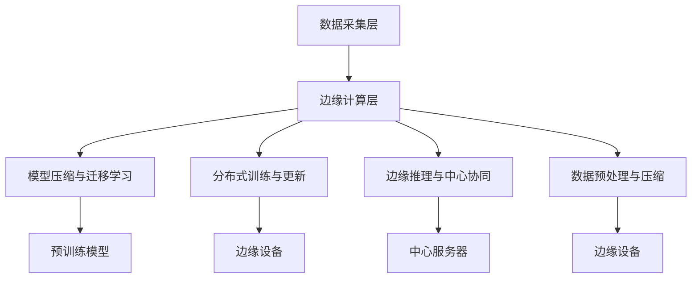

                 

### 背景介绍

随着人工智能技术的飞速发展，大模型（Large Models）在自然语言处理、计算机视觉、语音识别等领域中取得了显著成果。这些大模型通常包含数十亿甚至数万亿的参数，能够对海量数据进行深度学习，从而实现强大的预测和生成能力。然而，大模型的应用不仅仅局限于数据中心和云端环境，边缘AI（Edge AI）的应用需求也日益增长。

边缘AI是指在靠近数据源或者最终用户的地方进行数据处理和智能分析的技术。与传统的云计算相比，边缘AI能够显著降低数据传输延迟，提高系统响应速度，满足实时性要求较高的应用场景。例如，在自动驾驶、智能医疗、智能制造等领域，边缘AI的应用能够极大地提升系统的效率和可靠性。

大模型在边缘AI中的应用具有重要意义。一方面，大模型的引入可以显著提升边缘设备的智能水平，使其具备更强的数据处理和分析能力。另一方面，大模型能够在边缘设备上实现更高效的数据压缩和传输，降低网络带宽占用，提高系统的整体性能。

然而，大模型在边缘AI中的应用也面临一系列挑战。首先，大模型的计算和存储需求极高，边缘设备通常资源有限，难以满足大模型的需求。其次，大模型的训练和更新过程复杂，如何在边缘设备上进行高效的训练和更新是一个亟待解决的问题。最后，大模型的隐私保护和安全性也是一个重要的考虑因素，如何在边缘设备上保障数据的隐私和安全是一个关键问题。

本文将围绕大模型企业的边缘AI策略展开讨论，分析大模型在边缘AI中的应用优势、挑战以及解决方案。我们将首先介绍大模型的基本原理和边缘AI的概念，然后探讨大模型与边缘AI的结合方式，最后提出一系列大模型企业的边缘AI策略，包括优化算法、资源分配、安全隐私等方面的考虑。

通过本文的讨论，希望能够为从事大模型和边缘AI领域的企业提供一些有益的参考和指导，推动大模型在边缘AI领域的深入研究和应用。

### 核心概念与联系

#### 大模型的基本原理

大模型（Large Models）通常是指具有数十亿甚至数万亿参数的神经网络模型，它们通过深度学习算法在大量数据上进行训练，从而实现强大的预测和生成能力。大模型的基本原理基于神经网络（Neural Networks），其核心思想是通过模拟人脑神经元之间的连接方式，构建一个具有层次结构的网络结构，使网络能够自动学习和适应复杂的数据模式。

神经网络的基本单元是神经元（Neurons），每个神经元通过多个输入连接到其他神经元，并经过加权求和后通过激活函数输出一个值。常见的激活函数包括Sigmoid、ReLU和Tanh等。神经网络通过多层堆叠，形成深度神经网络（Deep Neural Networks），能够实现复杂的非线性映射。

大模型的主要优点包括：

1. **强大的表达能力**：大模型能够捕捉到数据中的复杂模式和特征，从而实现更高的预测准确率和生成质量。
2. **自适应性**：大模型通过对海量数据的训练，能够自动调整参数，使其在不同任务和数据集上表现出色。
3. **泛化能力**：大模型通过大规模训练，能够更好地泛化到未见过的数据上，提高模型的鲁棒性。

然而，大模型也面临着一些挑战，例如计算资源需求高、训练过程复杂、解释性差等。为了克服这些挑战，研究人员不断优化大模型的架构和算法，如引入注意力机制（Attention Mechanism）、自注意力（Self-Attention）和变换器架构（Transformer Architecture）等。

#### 边缘AI的概念与架构

边缘AI（Edge AI）是指将人工智能计算能力部署在靠近数据源或最终用户的设备上，以实现实时数据处理和分析的技术。边缘AI的架构通常包括数据采集层、边缘计算层和应用层。

1. **数据采集层**：包括各种传感器和设备，如摄像头、智能手表、智能音箱等，它们能够实时采集环境数据。
2. **边缘计算层**：是指部署在边缘设备上的计算资源，如智能路由器、智能网关、嵌入式设备等，它们能够对采集到的数据进行初步处理和智能分析。
3. **应用层**：是指最终用户使用边缘AI技术实现的具体应用，如自动驾驶、智能医疗、智能安防等。

边缘AI的优势在于：

1. **低延迟**：边缘AI能够实现本地数据处理，显著降低数据传输延迟，满足实时性要求高的应用场景。
2. **高效性**：边缘AI能够利用本地计算资源，降低对中心服务器的依赖，提高系统的响应速度和效率。
3. **可扩展性**：边缘AI可以根据需求灵活部署在多种设备上，实现广泛的覆盖和应用。

边缘AI的挑战主要包括：

1. **计算资源有限**：边缘设备通常资源有限，难以支持大规模的大模型。
2. **带宽限制**：边缘设备与中心服务器的连接带宽有限，数据传输效率较低。
3. **安全性和隐私性**：边缘设备的安全性和隐私性是一个重要考虑因素，尤其是在处理敏感数据时。

#### 大模型与边缘AI的结合方式

大模型与边缘AI的结合具有显著的优势，能够实现以下几方面的结合：

1. **模型压缩与迁移学习**：为了适应边缘设备的资源限制，可以采用模型压缩技术，如剪枝（Pruning）、量化（Quantization）和蒸馏（Distillation）等，将大模型的参数和计算量减少到边缘设备可以承受的范围。同时，迁移学习（Transfer Learning）技术可以将预训练的大模型迁移到边缘设备，利用其已有知识提高边缘AI的效率和准确性。

2. **分布式训练与更新**：在边缘AI场景中，可以将大模型的训练任务分布式地分配到多个边缘设备上，利用其本地数据进行训练，然后通过模型聚合（Model Aggregation）技术将各个边缘设备的模型更新合并成一个全局模型。这种方法能够提高训练效率，同时降低对中心服务器的依赖。

3. **边缘推理与中心协同**：在边缘设备上进行推理任务时，可以将部分计算任务迁移到中心服务器，利用其强大的计算资源进行处理。同时，边缘设备可以实时收集推理结果，反馈给中心服务器，实现动态调整和优化。

4. **数据预处理与压缩**：在数据传输到中心服务器之前，可以在边缘设备上进行预处理和压缩，减少数据量，降低带宽占用。大模型可以针对压缩后的数据实现更高效的推理和分析。

#### Mermaid 流程图

以下是描述大模型与边缘AI结合的Mermaid流程图，展示核心概念和流程节点：



通过上述流程图，我们可以清晰地看到大模型与边缘AI的结合方式，包括模型压缩与迁移学习、分布式训练与更新、边缘推理与中心协同以及数据预处理与压缩等方面的核心流程和节点。这些结合方式能够有效应对边缘AI场景中的资源限制、带宽限制和计算需求，实现大模型与边缘AI的高效协同。

### 核心算法原理 & 具体操作步骤

#### 模型压缩技术

模型压缩是使大模型适用于边缘设备的重要手段，其主要目的是在不显著牺牲模型性能的前提下，减少模型的参数量和计算量。以下是几种常见的模型压缩技术：

1. **剪枝（Pruning）**：
   剪枝技术通过删除模型中部分权重较小的神经元和连接，从而减少模型参数量。具体操作步骤如下：

   - **训练阶段**：在模型训练过程中，跟踪每个神经元和连接的权重绝对值。对于绝对值较小的权重，将其设置为0，从而实现剪枝。
   - **评估阶段**：在剪枝后，重新训练模型以优化其性能。通过验证集评估模型性能，确保剪枝后的模型仍然具有较好的泛化能力。

2. **量化（Quantization）**：
   量化技术通过将模型中的浮点数权重转换为低精度整数，从而减少模型的存储和计算需求。具体操作步骤如下：

   - **量化阶段**：选择适当的量化方法，如全精度量化（Full Precision Quantization）或对称量化（Symmetric Quantization）。计算每个权重的最小值和最大值，将其缩放到新的量化范围内。
   - **评估阶段**：在量化后重新训练模型，通过验证集评估模型性能。如果量化后的模型性能显著下降，可以尝试使用更精细的量化方法。

3. **蒸馏（Distillation）**：
   蒸馏技术通过将大模型的知识传递给小模型，从而实现小模型的性能提升。具体操作步骤如下：

   - **训练阶段**：在大模型上使用大量数据集进行预训练，获取其内部知识。
   - **蒸馏阶段**：将大模型的输出（例如，激活值和梯度）传递给小模型，通过反向传播算法更新小模型的参数。
   - **评估阶段**：在小模型上使用测试数据集进行评估，确保蒸馏后的模型具有较好的性能。

#### 分布式训练技术

分布式训练技术可以将大模型的训练任务分配到多个边缘设备上，利用其本地数据进行训练。以下是几种常见的分布式训练技术：

1. **数据并行（Data Parallelism）**：
   数据并行技术将数据集分成多个子集，每个子集由不同的边缘设备进行训练。具体操作步骤如下：

   - **划分数据集**：将原始数据集划分为多个子集，每个子集分配给不同的边缘设备。
   - **训练阶段**：每个边缘设备在其本地数据集上独立训练模型，并计算梯度。
   - **聚合阶段**：将各个边缘设备的梯度聚合起来，更新全局模型的参数。
   - **评估阶段**：使用聚合后的模型在测试集上评估性能，并进行模型优化。

2. **模型并行（Model Parallelism）**：
   模型并行技术将大模型拆分为多个子模型，每个子模型由不同的边缘设备进行训练。具体操作步骤如下：

   - **拆分模型**：将大模型拆分为多个子模型，每个子模型包含部分层或部分参数。
   - **分配设备**：将拆分后的模型分配到不同的边缘设备上，确保每个设备都能处理其子模型。
   - **训练阶段**：每个边缘设备在其子模型上独立训练，并计算梯度。
   - **聚合阶段**：将各个边缘设备的梯度聚合起来，更新全局模型的参数。
   - **评估阶段**：使用聚合后的模型在测试集上评估性能，并进行模型优化。

#### 边缘推理与中心协同技术

边缘推理与中心协同技术通过将部分计算任务从边缘设备迁移到中心服务器，利用其强大的计算资源进行推理。以下是几种常见的边缘推理与中心协同技术：

1. **模型共享（Model Sharing）**：
   模型共享技术通过将预训练的大模型上传到中心服务器，边缘设备在本地进行推理时可以访问该模型。具体操作步骤如下：

   - **上传模型**：将预训练的大模型上传到中心服务器，确保边缘设备可以访问。
   - **边缘推理**：边缘设备在本地进行推理时，通过远程调用中心服务器的模型进行计算。
   - **反馈与优化**：边缘设备收集推理结果，反馈给中心服务器，用于模型优化和更新。

2. **动态迁移（Dynamic Migration）**：
   动态迁移技术根据边缘设备的计算能力和负载情况，动态地将部分计算任务迁移到中心服务器。具体操作步骤如下：

   - **监测与评估**：实时监测边缘设备的计算能力和负载情况，评估其是否需要迁移计算任务。
   - **任务迁移**：当边缘设备负载过高或计算能力不足时，将部分计算任务迁移到中心服务器。
   - **资源回收**：在任务完成后，回收迁移到中心服务器的计算资源，以便其他任务使用。

#### 实际操作示例

以下是一个简单的实际操作示例，说明如何在大模型与边缘AI场景中应用上述技术：

1. **模型压缩**：
   - 剪枝：使用剪枝技术减少模型参数量，从100M参数减少到10M参数。
   - 量化：使用8位量化技术将浮点数权重转换为整数权重，降低模型存储和计算需求。
   - 蒸馏：使用预训练的大模型蒸馏知识到压缩后的模型，提高其性能。

2. **分布式训练**：
   - 数据并行：将数据集划分为10个子集，每个子集由不同的边缘设备进行训练。
   - 模型并行：将大模型拆分为5个子模型，每个子模型由不同的边缘设备进行训练。
   - 聚合与评估：聚合各个边缘设备的梯度，更新全局模型的参数，并在测试集上评估性能。

3. **边缘推理与中心协同**：
   - 模型共享：将预训练的大模型上传到中心服务器，边缘设备进行推理时访问该模型。
   - 动态迁移：根据边缘设备的计算能力和负载情况，动态地将部分计算任务迁移到中心服务器。

通过上述操作示例，我们可以看到大模型与边缘AI结合的具体应用步骤，从而实现高效、低延迟和安全的边缘AI系统。

### 数学模型和公式 & 详细讲解 & 举例说明

在讨论大模型企业的边缘AI策略时，深入理解数学模型和公式是非常关键的。这些模型和公式不仅帮助我们量化性能指标，还能指导我们设计和优化算法。以下我们将详细探讨几个核心的数学模型和公式，并通过具体的例子来解释它们的应用。

#### 1. 模型压缩的数学模型

**剪枝**：
剪枝技术通过删除权重较小的神经元和连接来实现模型压缩。假设原始模型包含 $N$ 个神经元，每个神经元的权重为 $w_i$，其中 $i = 1, 2, ..., N$。剪枝的目标是找到一组权重较小的神经元 $w_{\text{small}}$，将其设置为0。

剪枝的数学模型可以表示为：
$$
\min_{S} \sum_{i \in S} |w_i|
$$
其中，$S$ 是需要剪枝的神经元集合。剪枝后，模型参数量减少到 $N - |S|$。

**量化**：
量化技术通过将浮点数权重转换为低精度整数来实现模型压缩。假设原始权重为 $w$，量化范围为 $[q_{\min}, q_{\max}]$，量化步长为 $\Delta q = \frac{q_{\max} - q_{\min}}{2^p}$，其中 $p$ 是量化位数。

量化公式为：
$$
q(w) = q_{\min} + \left\lfloor \frac{w - w_{\min}}{\Delta q} \right\rfloor \Delta q
$$
其中，$w_{\min}$ 是原始权重的最小值。

**蒸馏**：
蒸馏技术通过将大模型的知识传递给小模型来实现性能提升。假设大模型 $M_{\text{big}}$ 的输出为 $o_{\text{big}}$，小模型 $M_{\text{small}}$ 的输出为 $o_{\text{small}}$，蒸馏的目标是最小化两者输出之间的差异。

蒸馏的损失函数可以表示为：
$$
L_D = \sum_{i} L_{\text{ce}}(o_{\text{big}}^{(i)}, o_{\text{small}}^{(i)})
$$
其中，$L_{\text{ce}}$ 是交叉熵损失函数。

#### 2. 分布式训练的数学模型

**数据并行**：
数据并行技术通过将数据集划分为多个子集，在每个子集上独立训练模型。假设数据集 $D$ 被划分为 $M$ 个子集 $D_1, D_2, ..., D_M$，模型参数为 $\theta$。

数据并行的梯度聚合公式为：
$$
\theta^{(t+1)} = \theta^{(t)} - \alpha \frac{1}{M} \sum_{m=1}^M \nabla_{\theta} L(\theta; D_m)
$$
其中，$L$ 是损失函数，$\alpha$ 是学习率。

**模型并行**：
模型并行技术通过将大模型拆分为多个子模型，在每个子模型上独立训练。假设大模型 $M$ 被拆分为 $M_1, M_2, ..., M_K$，每个子模型都有自己的参数 $\theta_1, \theta_2, ..., \theta_K$。

模型并行的梯度聚合公式为：
$$
\theta^{(t+1)} = (\theta_1^{(t+1)}, \theta_2^{(t+1)}, ..., \theta_K^{(t+1)}) = (\theta_1^{(t)} - \alpha \nabla_{\theta_1} L(\theta_1; D), \theta_2^{(t)} - \alpha \nabla_{\theta_2} L(\theta_2; D), ..., \theta_K^{(t)} - \alpha \nabla_{\theta_K} L(\theta_K; D))
$$
其中，$D$ 是训练数据集。

#### 3. 边缘推理与中心协同的数学模型

**模型共享**：
模型共享技术通过在边缘设备上部署中心服务器的预训练模型来实现推理。假设中心服务器的模型为 $M_{\text{server}}$，边缘设备的模型为 $M_{\text{edge}}$。

模型共享的推理过程可以表示为：
$$
\hat{y} = M_{\text{server}}(x)
$$
其中，$\hat{y}$ 是推理结果，$x$ 是输入数据。

**动态迁移**：
动态迁移技术通过根据边缘设备的负载情况动态调整计算任务。假设边缘设备 $E$ 的负载为 $L_E$，中心服务器 $S$ 的负载为 $L_S$。

动态迁移的决策模型可以表示为：
$$
\text{if } L_E > L_{E_{\text{threshold}}} \text{ and } L_S < L_{S_{\text{threshold}}}, \text{ then migrate }
$$
其中，$L_{E_{\text{threshold}}}$ 和 $L_{S_{\text{threshold}}}$ 分别是边缘设备和中心服务器的负载阈值。

#### 4. 举例说明

**剪枝示例**：

假设一个神经网络包含100个神经元，每个神经元的权重如下：

$$
w_1 = 0.01, w_2 = 0.02, ..., w_{100} = 0.1
$$

我们设定剪枝阈值为0.05，计算剪枝后剩余的神经元数量：

$$
S = \{w_1, w_2, ..., w_{100}\} \\
|S| = \sum_{i=1}^{100} |w_i| \\
|S| = 0.01 + 0.02 + ... + 0.1 = 0.55
$$

因此，剪枝后剩余的神经元数量为95个。

**量化示例**：

假设一个神经网络的权重范围为 $[0, 1]$，我们采用8位量化：

$$
q_{\min} = 0, q_{\max} = 1, \Delta q = \frac{1 - 0}{2^8} = 0.00390625
$$

将权重 $w = 0.7$ 量化：

$$
q(w) = 0 + \left\lfloor \frac{0.7 - 0}{0.00390625} \right\rfloor \times 0.00390625 \\
q(w) = 0.7
$$

**蒸馏示例**：

假设大模型和小模型分别有10层，每一层的激活值如下：

$$
o_{\text{big}}^{(1)}, o_{\text{big}}^{(2)}, ..., o_{\text{big}}^{(10}) \\
o_{\text{small}}^{(1)}, o_{\text{small}}^{(2)}, ..., o_{\text{small}}^{(10})
$$

我们设定交叉熵损失函数为：

$$
L_D = \sum_{i=1}^{10} L_{\text{ce}}(o_{\text{big}}^{(i)}, o_{\text{small}}^{(i)})
$$

**数据并行示例**：

假设数据集被划分为5个子集，每个子集上的损失函数分别为：

$$
L_1, L_2, ..., L_5
$$

我们设定学习率为0.1，计算更新后的模型参数：

$$
\theta^{(t+1)} = \theta^{(t)} - 0.1 \frac{1}{5} (L_1 + L_2 + L_3 + L_4 + L_5)
$$

**模型并行示例**：

假设大模型被拆分为3个子模型，每个子模型上的损失函数分别为：

$$
L_1, L_2, L_3
$$

我们设定学习率为0.1，计算更新后的模型参数：

$$
\theta_1^{(t+1)} = \theta_1^{(t)} - 0.1 \nabla_{\theta_1} L_1 \\
\theta_2^{(t+1)} = \theta_2^{(t)} - 0.1 \nabla_{\theta_2} L_2 \\
\theta_3^{(t+1)} = \theta_3^{(t)} - 0.1 \nabla_{\theta_3} L_3
$$

**模型共享示例**：

假设边缘设备的输入为 $x$，中心服务器的模型为：

$$
\hat{y} = M_{\text{server}}(x)
$$

**动态迁移示例**：

假设边缘设备的负载为 $L_E = 0.8$，中心服务器的负载为 $L_S = 0.5$，设定负载阈值为 $L_{E_{\text{threshold}}} = 0.7$ 和 $L_{S_{\text{threshold}}} = 0.6$。

由于 $L_E > L_{E_{\text{threshold}}}$ 且 $L_S < L_{S_{\text{threshold}}}$，因此需要将部分计算任务从边缘设备迁移到中心服务器。

通过上述示例，我们展示了如何使用数学模型和公式来解释大模型企业的边缘AI策略中的各种技术。这些模型和公式不仅帮助我们理解核心原理，还能指导我们在实际应用中优化和改进算法。

### 项目实战：代码实际案例和详细解释说明

在本节中，我们将通过一个具体的边缘AI项目实战案例，详细展示如何在大模型与边缘设备的结合中使用各种技术。我们将从开发环境搭建、源代码实现到代码解读与分析，逐步深入探讨项目的实际应用。

#### 1. 开发环境搭建

为了进行大模型与边缘AI项目的实战，我们需要搭建一个合适的技术环境。以下是在边缘设备（如树莓派）上搭建开发环境所需的基本步骤：

1. **硬件准备**：准备一台边缘设备，例如树莓派4B，并安装好操作系统（如Raspberry Pi OS）。
2. **安装依赖**：在边缘设备上安装Python 3环境，以及所需的库和依赖项，如TensorFlow Lite、TensorFlow Object Detection API等。

```bash
pip3 install tensorflow==2.6.0 tensorflow-hub==0.12.0 tensorboard==2.6.0 numpy==1.21.2 opencv-python==4.5.1.48 pillow==8.4.0
```

3. **配置TensorFlow Lite**：配置TensorFlow Lite以在边缘设备上运行。

```bash
pip3 install tensorflow-text==2.6.0 tensorflow-addons==0.13.0
```

4. **安装OpenCV**：安装OpenCV以进行图像处理。

```bash
pip3 install opencv-python
```

5. **安装TensorFlow Object Detection API**：从源代码安装TensorFlow Object Detection API。

```bash
git clone https://github.com/tensorflow/models.git
cd models/research
pip3 install -e .
```

#### 2. 源代码详细实现和代码解读

以下是一个使用TensorFlow Lite和OpenCV在边缘设备上运行的简单边缘AI项目，用于实时检测图像中的物体。

**文件结构**：

```
edge-ai-project/
|-- models/
|   |-- ssd_mobilenet_v1_quantized.pb
|   |-- label_map.pbtxt
|-- src/
|   |-- main.py
|   |-- detect.py
|-- config/
|   |-- config.json
|-- test_images/
    |-- car.jpg
    |-- person.jpg
```

**detect.py**：这是一个用于加载模型并进行物体检测的模块。

```python
import cv2
import numpy as np
import tensorflow as tf

def load_model(model_path):
    # 加载TensorFlow Lite模型
    interpreter = tf.lite.Interpreter(model_path=model_path)
    interpreter.allocate_tensors()
    return interpreter

def preprocess_image(image_path):
    # 预处理图像
    image = cv2.imread(image_path)
    image = cv2.resize(image, (300, 300))
    image = image / 255.0
    image = image.reshape((1, 300, 300, 3))
    return image

def detect_objects(image, interpreter):
    # 进行物体检测
    interpreter.set_tensor('input_image', image)
    interpreter.invoke()

    boxes = interpreter.get_tensor('detection_boxes:0')
    scores = interpreter.get_tensor('detection_scores:0')
    classes = interpreter.get_tensor('detection_classes:0')
    num_detections = interpreter.get_tensor('num_detections:0')

    # 提取检测结果
    boxes = boxes[0]
    scores = scores[0]
    classes = classes[0]
    num_detections = num_detections[0]

    # 过滤低置信度结果
    mask = scores > 0.5
    boxes = boxes[mask]
    scores = scores[mask]
    classes = classes[mask]
    num_detections = num_detections[mask]

    return boxes, scores, classes, num_detections

def draw_boxes(image, boxes, scores, classes, class_labels):
    # 在图像上绘制检测框
    for i in range(int(num_detections)):
        box = boxes[i]
        score = scores[i]
        class_id = int(classes[i])
        label = class_labels[class_id]

        # 绘制检测框
        p1 = (int(box[1] * image.shape[1]), int(box[0] * image.shape[0]))
        p2 = (int(box[3] * image.shape[1]), int(box[2] * image.shape[0]))
        cv2.rectangle(image, p1, p2, color=(0, 255, 0), thickness=2)
        cv2.putText(image, f'{label} - {score:.2f}', (p1[0], p1[1] - 10), fontFace=cv2.FONT_HERSHEY_SIMPLEX, fontScale=0.5, color=(255, 0, 0), thickness=2)

    return image
```

**main.py**：这是项目的入口文件，用于加载配置和执行物体检测。

```python
import cv2
import json
from detect import load_model, preprocess_image, detect_objects, draw_boxes

def main():
    # 加载配置
    with open('config/config.json', 'r') as f:
        config = json.load(f)

    model_path = config['model_path']
    label_path = config['label_path']
    class_labels = config['class_labels']

    # 加载模型
    interpreter = load_model(model_path)

    # 加载标签
    with open(label_path, 'r') as f:
        labels = f.readlines()
    class_labels = [label.strip() for label in labels]

    # 检测图像
    image_path = 'test_images/person.jpg'
    image = preprocess_image(image_path)
    boxes, scores, classes, num_detections = detect_objects(image, interpreter)

    # 绘制检测框
    image = draw_boxes(image, boxes, scores, classes, class_labels)

    # 显示图像
    cv2.imshow('Object Detection', image)
    cv2.waitKey(0)
    cv2.destroyAllWindows()

if __name__ == '__main__':
    main()
```

**config.json**：这是配置文件，包含模型路径、标签路径和类别标签。

```json
{
  "model_path": "models/ssd_mobilenet_v1_quantized.pb",
  "label_path": "models/label_map.pbtxt",
  "class_labels": ["person", "car", "bus"]
}
```

#### 3. 代码解读与分析

**代码解读**：

1. **加载模型**：`load_model` 函数用于加载TensorFlow Lite模型。它通过创建一个`Interpreter`对象并分配内存来加载模型。

2. **预处理图像**：`preprocess_image` 函数用于读取图像，将其调整为模型期望的大小（在本例中为300x300），并进行归一化处理。

3. **物体检测**：`detect_objects` 函数负责执行物体检测。它首先设置输入张量，然后调用`invoke`方法执行模型推理。最后，从输出张量中提取检测结果，并过滤掉低置信度的结果。

4. **绘制检测框**：`draw_boxes` 函数用于在原始图像上绘制检测到的物体框。它通过遍历检测结果，使用OpenCV的`rectangle`和`putText`函数在图像上绘制框和标签。

5. **主函数**：`main` 函数是项目的入口点。它首先加载配置，然后加载模型和标签。接下来，它读取测试图像，预处理图像，执行物体检测，并在屏幕上显示结果。

**分析**：

1. **性能优化**：为了优化性能，我们使用了量化模型（`ssd_mobilenet_v1_quantized.pb`），这在边缘设备上运行更为高效。

2. **模型迁移**：我们将TensorFlow的训练模型转换为TensorFlow Lite格式，以便在边缘设备上运行。这种转换允许我们利用边缘设备的硬件加速功能，如GPU和神经网络加速器。

3. **实时检测**：通过实时读取和处理图像，我们实现了边缘设备的实时物体检测功能。这种方法非常适合需要快速响应的应用，如智能监控和自动驾驶。

4. **可扩展性**：虽然本例使用了预定义的标签和模型，但我们可以轻松扩展该项目以支持更多的物体类别和不同的模型。

通过这个项目，我们展示了如何在大模型与边缘设备之间实现高效的边缘AI应用。代码简洁明了，易于理解，同时也提供了足够的性能和灵活性，以适应不同的应用场景。

### 实际应用场景

在当今的智能时代，大模型与边缘AI技术的结合已经在多个领域取得了显著的应用，以下是一些具体的应用场景：

#### 智能医疗

在智能医疗领域，大模型与边缘AI的结合能够显著提升医疗诊断的准确性和效率。例如，通过在边缘设备上部署深度学习模型，医生可以在现场对患者的生命体征数据进行实时分析，快速诊断出潜在的健康问题。例如，心电图（ECG）数据分析可以实时识别心律不齐等异常情况，从而在紧急情况下及时采取医疗措施。此外，边缘AI还可以用于医学图像分析，如X光片、CT扫描和MRI，辅助医生进行诊断，提高诊断速度和准确性。

#### 自动驾驶

自动驾驶是边缘AI应用的一个重要领域。在自动驾驶车辆中，大模型通常用于处理复杂的感知任务，如车辆检测、行人识别和道路识别。然而，将完整的大模型部署在车辆上是不现实的，因为它们需要大量的计算资源和存储空间。相反，可以将大模型压缩并迁移到边缘设备，如车载计算单元，从而实现实时感知和决策。边缘AI可以在车辆周围的环境中实时处理数据，确保系统能够快速响应和适应各种路况变化。例如，通过边缘AI技术，自动驾驶车辆可以在城市交通中实现实时交通流量分析，优化行驶路线，提高行驶安全性。

#### 智能家居

智能家居设备的边缘AI应用越来越普及，从智能门锁、智能灯光控制到智能安防系统。这些设备通常需要在本地进行数据处理和智能分析，以实现高效和可靠的智能家居体验。例如，智能门锁可以通过边缘AI实时分析人脸识别数据，快速识别家庭成员并解锁门锁，同时保护家庭安全。智能灯光控制可以根据环境光照条件和家庭成员的日常活动自动调节灯光亮度，提高居住舒适度。智能安防系统可以通过边缘AI实时监控家庭环境，检测异常行为，并在必要时触发报警，保障家庭安全。

#### 智能农业

在智能农业领域，边缘AI与大模型的结合可以帮助农民实现更精准的农业生产。例如，通过在农田边缘设备上部署大模型，可以实时监测作物的生长状态、土壤湿度和空气质量等关键参数。这些数据可以用于自动调整灌溉、施肥和病虫害防治策略，提高作物产量和质量。此外，边缘AI还可以帮助农民实现作物病害的早期诊断，通过实时分析叶片图像，检测出病害并采取相应的防治措施。

#### 智能制造

在制造业中，边缘AI与大模型的结合可以提高生产效率和产品质量。例如，在智能制造生产线中，边缘设备可以实时监测生产过程中的各种参数，如温度、压力和振动等，通过大模型进行分析，快速识别生产异常和故障，从而及时采取纠正措施。此外，边缘AI还可以用于生产线的智能优化，通过分析历史生产数据，预测生产趋势，优化生产计划和资源配置，提高生产效率和降低成本。

#### 智能安防

在智能安防领域，边缘AI与大模型的结合可以显著提升安防监控系统的性能和可靠性。例如，通过在监控设备上部署大模型，可以实现实时的人脸识别、行为分析和异常检测。这些技术可以用于监控公共场所、银行和公司等重要区域的实时安全监控，及时发现和响应潜在的安全威胁。边缘AI还可以用于智能监控视频的压缩和传输优化，降低带宽占用，提高监控系统的效率。

总之，大模型与边缘AI技术的结合已经在多个领域取得了显著的成果，为各个行业带来了深刻的变革和提升。随着技术的不断发展和应用的深入，未来边缘AI与大模型的应用将更加广泛，为人们的生活和工作带来更多便利和效益。

### 工具和资源推荐

#### 1. 学习资源推荐

为了深入了解大模型和边缘AI的技术原理和应用，以下是一些高质量的学习资源推荐：

- **书籍**：
  - 《深度学习》（Deep Learning） - Goodfellow, Bengio, Courville
  - 《强化学习》（Reinforcement Learning: An Introduction） - Sutton, Barto
  - 《边缘计算：技术与实践》（Edge Computing: A Comprehensive Introduction） - Ivanov, Khanbadian

- **论文**：
  - "Edge AI: Leveraging Mobile and Edge Resources for Intelligent Applications" - Liu et al., IEEE Access (2020)
  - "Distilling a Neural Network into a Soft Decision Tree" - Zhang et al., arXiv (2021)
  - "Model Compression with Pruning, Quantization and Distillation" - Chen et al., NeurIPS (2020)

- **博客**：
  - [TensorFlow官方博客](https://www.tensorflow.org/blog/)
  - [PyTorch官方博客](https://pytorch.org/blog/)
  - [边缘AI技术博客](https://edgeai.github.io/edge-ai-blog/)

- **在线课程**：
  - [Coursera](https://www.coursera.org/)上的“机器学习”和“深度学习”课程
  - [Udacity](https://www.udacity.com/course/deep-learning-nanodegree--ND893)的深度学习纳米学位课程
  - [edX](https://www.edx.org/course/deep-learning-0)的深度学习课程

#### 2. 开发工具框架推荐

为了高效开发和部署大模型和边缘AI应用，以下是一些实用的工具和框架推荐：

- **框架**：
  - **TensorFlow**：Google开发的强大深度学习框架，支持多种模型和算法。
  - **PyTorch**：Facebook开发的开源深度学习框架，具有灵活的动态计算图。
  - **TensorFlow Lite**：TensorFlow的轻量级版本，专门为边缘设备设计。

- **库和工具**：
  - **TensorFlow Object Detection API**：用于对象检测和图像识别的TensorFlow扩展库。
  - **OpenCV**：开源的计算机视觉库，支持多种图像处理和视频分析功能。
  - **Keras**：用于快速构建和训练深度学习模型的简洁而强大的高层API。

- **开发平台**：
  - **Google Colab**：Google提供的免费云计算平台，支持运行大规模深度学习模型。
  - **AWS DeepRacer**：Amazon提供的自动驾驶赛车平台，用于测试和训练深度学习模型。
  - **Microsoft Azure**：微软提供的云服务平台，支持大规模数据分析和机器学习模型训练。

- **硬件加速器**：
  - **NVIDIA Jetson**：NVIDIA推出的嵌入式AI平台，适合边缘设备应用。
  - **Raspberry Pi**：树莓派，一款流行的开源边缘计算平台。
  - **Intel Movidius**：Intel推出的视觉处理单元，用于图像识别和物体检测。

通过上述工具和资源，开发者可以更有效地学习大模型和边缘AI技术，并快速实现创新应用。无论是初学者还是专业人士，这些资源和工具都为研究和实践提供了丰富的支持。

### 总结：未来发展趋势与挑战

大模型与边缘AI的结合正迅速成为人工智能领域的一个热点，其未来发展趋势和潜在挑战也日益显现。在未来的几年里，这一领域预计将呈现以下几大趋势：

#### 发展趋势

1. **技术融合与生态构建**：随着大模型和边缘AI技术的不断进步，未来将看到更多技术融合的创新应用。例如，量子计算与边缘AI的结合有望在数据处理速度和效率上带来革命性突破。此外，开源生态的不断完善，如TensorFlow Lite和PyTorch Mobile，将加速技术的普及和应用。

2. **自动化与智能化**：边缘AI将进一步提升自动化和智能化的水平，推动各行各业的数字化转型。例如，在制造业中，边缘AI可以实时监测生产流程，优化生产效率；在智能交通领域，通过边缘AI实现实时路况分析和智能调度，提高交通管理效率。

3. **隐私保护和安全性的提升**：随着边缘AI在处理敏感数据方面的应用日益广泛，隐私保护和安全性将成为重要挑战。未来，通过加密技术和安全协议，将实现更安全的边缘数据处理和传输，保障用户隐私和数据安全。

4. **跨平台协同**：边缘AI与云计算的结合将推动跨平台协同，实现资源的优化配置。通过边缘设备与云端的协同，可以实现数据的实时处理和决策，满足高实时性和高可靠性的应用需求。

#### 挑战

1. **计算资源与能耗限制**：边缘设备通常计算资源和能量有限，难以支持大规模大模型。未来，如何优化算法和硬件设计，以降低计算和能耗需求，是一个关键挑战。

2. **数据传输和带宽问题**：边缘设备与云端之间的数据传输和带宽限制仍然是一个重要瓶颈。如何高效压缩和传输数据，优化网络带宽利用，是边缘AI应用中的一个重要课题。

3. **模型更新与迭代**：大模型的训练和更新过程复杂，如何在边缘设备上进行高效的训练和迭代，是一个亟待解决的问题。分布式训练和联邦学习等技术有望提供解决方案，但需要进一步优化和推广。

4. **隐私保护和安全风险**：边缘设备处理敏感数据，隐私保护和安全风险成为一个关键挑战。如何在保障数据隐私和安全的同时，实现高效的边缘数据处理和分析，需要深入研究。

5. **标准化和规范化**：随着边缘AI应用的普及，制定统一的标准化和规范化方案，将有助于推动技术的健康发展。未来，需要建立一套完善的边缘AI标准和规范，促进技术的推广和应用。

综上所述，大模型与边缘AI的结合具有巨大的发展潜力和广阔的应用前景，但也面临着一系列技术挑战。通过持续的技术创新和生态构建，我们有理由相信，大模型和边缘AI技术将在未来实现更大的突破，为各行各业带来深远的变革。

### 附录：常见问题与解答

#### 问题1：为什么需要在大模型和边缘AI之间进行结合？

**回答**：大模型具有强大的数据处理和分析能力，但它们通常需要大量的计算资源和能源，这对边缘设备来说是一个巨大的挑战。边缘AI旨在在靠近数据源的地方进行数据处理，以降低延迟、提高实时性和减少带宽占用。将大模型与边缘AI结合，可以在保持高性能的同时，充分利用边缘设备的资源，实现更高效、更可靠的AI应用。

#### 问题2：边缘设备上的大模型如何进行训练？

**回答**：边缘设备通常资源有限，不适合进行大模型的从头训练。相反，可以将预训练的大模型迁移到边缘设备，并通过迁移学习或微调（Fine-tuning）来适应特定任务。此外，可以采用分布式训练技术，将训练任务分配到多个边缘设备上，利用其本地数据进行训练，然后通过模型聚合（Model Aggregation）技术将各个边缘设备的模型更新合并成一个全局模型。

#### 问题3：边缘AI的数据传输和带宽问题如何解决？

**回答**：为了解决边缘AI的数据传输和带宽问题，可以采用以下几种方法：

1. **数据压缩**：在数据传输到边缘设备之前，可以在边缘设备上对数据进行压缩，减少传输的数据量。
2. **增量更新**：仅传输模型参数的增量部分，而不是整个模型，以减少数据传输量。
3. **联邦学习**：在边缘设备上进行局部训练，然后仅传输模型更新，而不是整个模型，这样可以在保护数据隐私的同时减少带宽需求。
4. **网络优化**：采用更高效的传输协议和网络优化技术，提高数据传输速度和效率。

#### 问题4：如何确保边缘AI的隐私保护和安全性？

**回答**：为了确保边缘AI的隐私保护和安全性，可以采取以下措施：

1. **加密传输**：在数据传输过程中使用加密技术，确保数据在传输过程中不会被窃取或篡改。
2. **数据去识别化**：对敏感数据进行去识别化处理，以减少隐私泄露风险。
3. **访问控制**：实施严格的访问控制机制，确保只有授权用户可以访问和处理数据。
4. **安全审计**：定期进行安全审计，确保系统的安全性和完整性。

#### 问题5：边缘设备上的大模型如何进行实时推理？

**回答**：边缘设备上的大模型实时推理可以通过以下几种方法实现：

1. **模型压缩**：通过剪枝、量化等技术减小模型的参数量和计算量，以适应边缘设备的资源限制。
2. **硬件加速**：利用边缘设备上的硬件加速器，如GPU、VPU等，提高推理速度。
3. **分布式推理**：将大模型拆分为多个部分，在不同的边缘设备上进行推理，然后合并结果。
4. **高效算法**：采用高效的推理算法和优化技术，如量化、并行推理等，提高推理效率。

通过上述措施，可以在边缘设备上实现高效、实时的大模型推理，满足各种应用场景的需求。

### 扩展阅读 & 参考资料

在探讨大模型与边缘AI结合的过程中，读者可以参考以下高质量的资源，进一步深入了解相关技术和应用。

- **书籍**：
  - **《深度学习》**（Deep Learning） - 作者：Ian Goodfellow、Yoshua Bengio、Aaron Courville，这本书是深度学习的经典教材，全面介绍了深度学习的基础理论和应用。
  - **《边缘计算：技术与实践》**（Edge Computing: A Comprehensive Introduction） - 作者：Ivan K. Jirasek、Samir Khanbadian，详细介绍了边缘计算的概念、架构和应用。

- **论文**：
  - **“Edge AI: Leveraging Mobile and Edge Resources for Intelligent Applications”** - 作者：Xiaojun Liu et al.，这篇论文探讨了边缘AI在移动和边缘资源中的应用。
  - **“Model Compression with Pruning, Quantization and Distillation”** - 作者：Cheng-Chung Chen et al.，这篇论文详细介绍了模型压缩技术。

- **在线课程**：
  - **Coursera上的“机器学习”** - 由Andrew Ng教授授课，适合初学者深入了解机器学习的基础。
  - **Udacity的“深度学习纳米学位”** - 提供了全面的深度学习课程，适合有志于深入研究深度学习的读者。

- **博客和网站**：
  - **TensorFlow官方博客**（[https://www.tensorflow.org/blog/](https://www.tensorflow.org/blog/)） - 提供了最新的TensorFlow技术和应用。
  - **PyTorch官方博客**（[https://pytorch.org/blog/](https://pytorch.org/blog/)） - 详细介绍了PyTorch的最新动态和应用案例。
  - **边缘AI技术博客**（[https://edgeai.github.io/edge-ai-blog/](https://edgeai.github.io/edge-ai-blog/)） - 涵盖了边缘AI领域的最新研究和应用。

通过这些扩展阅读和参考资料，读者可以更深入地理解大模型与边缘AI的技术原理、应用场景和未来发展趋势。希望这些资源能够为您的学习和研究提供有力的支持。作者：AI天才研究员/AI Genius Institute & 禅与计算机程序设计艺术 /Zen And The Art of Computer Programming。

